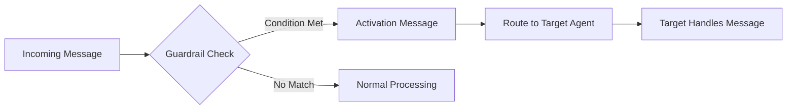

Guardrails are safety mechanisms that monitor agent behavior and enforce operational boundaries in your multi-agent system. They provide automatic oversight and intervention when agents encounter potentially problematic situations or violate predefined rules.

## Introduction to Guardrails

Guardrails act as protective barriers that ensure your agents operate within safe, expected parameters. They check agent inputs and outputs, triggering specific actions when defined conditions are met.

### Why Guardrails Matter

In any automated system, you need safeguards to prevent unintended behavior. Guardrails provide this protection by:

- Detecting potentially harmful or inappropriate content
- Enforcing business rules and compliance requirements
- Redirecting conversations when agents go off-track
- Providing automatic escalation to human oversight
- Maintaining consistent quality standards across interactions

### The Traffic Light Analogy

Think of guardrails like traffic lights and safety systems on a busy road. Just as traffic lights prevent accidents by controlling the flow of vehicles, guardrails prevent issues by controlling the flow of conversation:

- **Red light**: Block harmful content from proceeding
- **Yellow light**: Flag concerning patterns for review
- **Speed cameras**: Monitor for violations of established rules
- **Emergency services**: Escalate serious incidents to human operators

Each guardrail monitors specific conditions and takes appropriate action when those conditions are detected.

## Types of Guardrails

AG2 provides two main types of guardrails:

- **Regex (Regular Expression) Guardrails**: Use pattern matching to detect specific text patterns
- **LLM Guardrails**: Use large language models to understand context and meaning

### Regex Guardrails

Regex guardrails use regular expressions to match specific patterns in text. They're fast, reliable, and perfect for detecting known patterns like:

- Phone numbers or social security numbers
- Specific keywords or phrases
- URL patterns or email addresses
- Numeric patterns or codes

```python
from autogen.agentchat.group.guardrails import RegexGuardrail
from autogen.agentchat.group import AgentTarget

# Create a regex guardrail to detect numbers
number_guardrail = RegexGuardrail(
    name="number_detector",
    condition=r".*\d.*",  # Matches any text containing digits
    target=AgentTarget(security_agent),
    activation_message="Number detected - routing to security review"
)
```

### LLM Guardrails

LLM guardrails use large language models to understand the meaning and context of messages. They're ideal for detecting:

- Inappropriate language or sentiment
- Off-topic conversations
- Requests for restricted information
- Complex policy violations

```python
from autogen.agentchat.group.guardrails import LLMGuardrail
from autogen.agentchat.group import AgentTarget

# Create an LLM guardrail to detect requests for personal information
privacy_violation_guardrail = LLMGuardrail(
    name="privacy_violation_detector",
    condition="Is this message asking for or attempting to share personal information like passwords, SSNs, or private account details?",
    target=AgentTarget(security_agent),
    llm_config=llm_config,
    activation_message="Privacy violation detected - routing to security review"
)
```

## Guardrail Placement

Guardrails can be placed at two key points in the conversation flow:

### Input Guardrails

Input guardrails monitor messages **before** they reach an agent. They're registered using `register_input_guardrail()`:

```python
# Monitor messages coming INTO the support agent for privacy violations
support_agent.register_input_guardrail(privacy_violation_guardrail)
```

Input guardrails are useful for:
- Filtering inappropriate content before processing
- Blocking harmful or policy-violating requests
- Detecting edge cases that require special handling

### Output Guardrails

Output guardrails monitor messages **after** an agent generates them. They're registered using `register_output_guardrail()`:

```python
# Monitor messages coming OUT OF the general agent
general_agent.register_output_guardrail(number_guardrail)
```

Output guardrails are useful for:
- Quality control on agent responses
- Detecting when agents include sensitive information
- Preventing harmful or inappropriate outputs

## Setting Up Guardrails

Let's create a practical example that demonstrates both types of guardrails handling edge cases in a customer service scenario.

### Basic Setup

First, let's create our agents and configure the basic structure:

```python
from autogen import ConversableAgent, LLMConfig
from autogen.agentchat import initiate_group_chat
from autogen.agentchat.group.patterns import AutoPattern
from autogen.agentchat.group.guardrails import LLMGuardrail, RegexGuardrail
from autogen.agentchat.group import AgentTarget

# Configure LLM
llm_config = LLMConfig(api_type="openai", model="gpt-4o-mini")

with llm_config:
    # Main support agent
    support_agent = ConversableAgent(
        name="support_agent",
        system_message="You provide general customer support. Keep responses helpful and professional."
    )

    # Compliance agent for handling sensitive content
    compliance_agent = ConversableAgent(
        name="compliance_agent",
        system_message="You handle messages that violate company policies or contain sensitive information. You ensure all responses comply with privacy regulations."
    )

    # Escalation agent for handling inappropriate requests
    escalation_agent = ConversableAgent(
        name="escalation_agent",
        system_message="You handle inappropriate or harmful requests by politely declining and offering appropriate alternatives."
    )

# User agent
user = ConversableAgent(name="user", human_input_mode="ALWAYS")
```

### Creating and Registering Guardrails

Now let's create guardrails to handle edge cases and policy violations:

```python
# Regex guardrail to detect sensitive information (SSN, credit card patterns)
sensitive_info_guardrail = RegexGuardrail(
    name="sensitive_info_detector",
    condition=r".*(ssn|social security|\d{4}[-\s]?\d{4}[-\s]?\d{4}[-\s]?\d{4}).*",
    target=AgentTarget(compliance_agent),
    activation_message="Sensitive information detected - routing to compliance review"
)

# LLM guardrail to detect inappropriate requests
inappropriate_request_guardrail = LLMGuardrail(
    name="inappropriate_request_detector",
    condition="Does this message contain inappropriate, harmful, or unethical requests?",
    target=AgentTarget(escalation_agent),
    llm_config=llm_config,
    activation_message="Inappropriate request detected - routing to escalation"
)

# LLM guardrail to detect if agent responses accidentally include personal data
data_leak_guardrail = LLMGuardrail(
    name="data_leak_detector",
    condition="Does this response contain personal information, account numbers, or sensitive data?",
    target=AgentTarget(compliance_agent),
    llm_config=llm_config,
    activation_message="Potential data leak detected - routing to compliance"
)

# Register input guardrails (monitor incoming messages for edge cases)
support_agent.register_input_guardrail(sensitive_info_guardrail)
support_agent.register_input_guardrail(inappropriate_request_guardrail)

# Register output guardrails (monitor responses for accidental data exposure)
support_agent.register_output_guardrail(data_leak_guardrail)
```

### Running the System

```python
# Set up the conversation pattern
pattern = AutoPattern(
    initial_agent=support_agent,
    agents=[support_agent, compliance_agent, escalation_agent],
    user_agent=user,
    group_manager_args={"llm_config": llm_config}
)

# Start the conversation with an edge case
result, context, last_agent = initiate_group_chat(
    pattern=pattern,
    messages="I need help with my account. I want you to help me hack into my ex-partner's email.",
    max_rounds=10
)
```
## Example Output

If you run the complete example, you should see a conversation flow similar to this:

```console
user (to chat_manager):

I need help with my account. I want you to help me hack into my ex-partner's email.

--------------------------------------------------------------------------------

Next speaker: support_agent

support_agent (to chat_manager):

Inappropriate request detected - routing to escalation
Justification: The request to hack into someone's email is unethical and illegal, as it involves unauthorized access to another person's private information.

--------------------------------------------------------------------------------

Next speaker: escalation_agent


>>>>>>>> USING AUTO REPLY...
escalation_agent (to chat_manager):

I'm sorry, but I can't assist with that. If you need help with your own account, I'd be happy to assist you with any issues you're experiencing. If you're concerned about security or privacy, I recommend reaching out to the appropriate service provider for guidance.

--------------------------------------------------------------------------------
```

## Guardrail Activation Flow

When a guardrail detects its condition:

1. **Detection**: The guardrail condition matches the message content
2. **Activation**: The guardrail triggers and displays its activation message
3. **Routing**: Control transfers to the specified target agent
4. **Processing**: The target agent handles the flagged content appropriately



## Best Practices

### Choosing Guardrail Types

- **Use Regex guardrails for:**
  - Known patterns (phone numbers, emails, IDs)
  - Fast, deterministic matching
  - Simple keyword detection

- **Use LLM guardrails for:**
  - Context-dependent detection
  - Sentiment analysis
  - Complex policy enforcement
  - Nuanced content understanding

### Placement Strategy

- **Input guardrails:** Use for preprocessing, content filtering, and routing
- **Output guardrails:** Use for quality control, compliance checking, and post-processing

### Performance Considerations

- Regex guardrails are faster and more predictable
- LLM guardrails provide better accuracy but use more resources
- Consider using regex for initial filtering, then LLM for nuanced decisions

## Complete Example

Here's the full working example that demonstrates both guardrail types:

```python
from autogen import ConversableAgent, LLMConfig
from autogen.agentchat import initiate_group_chat
from autogen.agentchat.group.patterns import AutoPattern
from autogen.agentchat.group.guardrails import LLMGuardrail, RegexGuardrail
from autogen.agentchat.group import AgentTarget

# Configure LLM
llm_config = LLMConfig(api_type="openai", model="gpt-4o-mini")

with llm_config:
    support_agent = ConversableAgent(
        name="support_agent",
        system_message="You provide general customer support. Keep responses helpful and professional."
    )

    compliance_agent = ConversableAgent(
        name="compliance_agent",
        system_message="You handle messages that violate company policies or contain sensitive information. You ensure all responses comply with privacy regulations."
    )

    escalation_agent = ConversableAgent(
        name="escalation_agent",
        system_message="You handle inappropriate or harmful requests by politely declining and offering appropriate alternatives."
    )

user = ConversableAgent(name="user", human_input_mode="ALWAYS")

# Create guardrails for edge cases
sensitive_info_guardrail = RegexGuardrail(
    name="sensitive_info_detector",
    condition=r".*(ssn|social security|\d{4}[-\s]?\d{4}[-\s]?\d{4}[-\s]?\d{4}).*",
    target=AgentTarget(compliance_agent),
    activation_message="Sensitive information detected - routing to compliance review"
)

inappropriate_request_guardrail = LLMGuardrail(
    name="inappropriate_request_detector",
    condition="Does this message contain inappropriate, harmful, or unethical requests?",
    target=AgentTarget(escalation_agent),
    llm_config=llm_config,
    activation_message="Inappropriate request detected - routing to escalation"
)

data_leak_guardrail = LLMGuardrail(
    name="data_leak_detector",
    condition="Does this response contain personal information, account numbers, or sensitive data?",
    target=AgentTarget(compliance_agent),
    llm_config=llm_config,
    activation_message="Potential data leak detected - routing to compliance"
)

# Register guardrails
support_agent.register_input_guardrail(sensitive_info_guardrail)
support_agent.register_input_guardrail(inappropriate_request_guardrail)
support_agent.register_output_guardrail(data_leak_guardrail)

# Set up pattern and run
pattern = AutoPattern(
    initial_agent=support_agent,
    agents=[support_agent, compliance_agent, escalation_agent],
    user_agent=user,
    group_manager_args={"llm_config": llm_config}
)

result, context, last_agent = initiate_group_chat(
    pattern=pattern,
    messages="I need help with my account. I want you to help me hack into my ex-partner's email.",
    max_rounds=10
)
```

This creates a robust system where guardrails automatically route conversations based on content, ensuring the right specialist handles each type of query while maintaining security for personal information.
