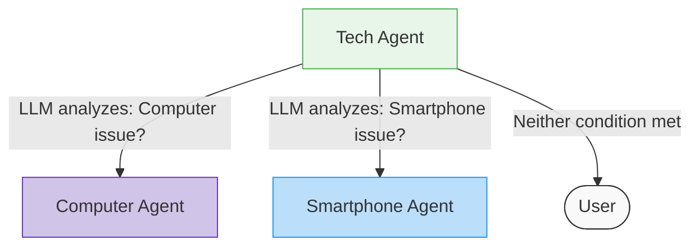
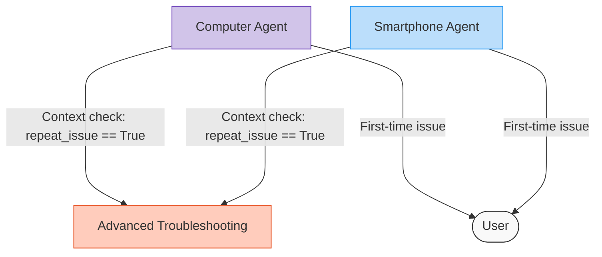

Handoffs are the essential mechanism that controls how agents interact and pass control to each other in a group chat. If tools represent what agents can do and context variables represent what they know, handoffs determine where they go next.

## Introduction to Handoffs

Handoffs define the paths a conversation can take through your multi-agent system. They allow you to create sophisticated workflows where the right agent handles each part of a conversation at the right time.

### Why Handoffs Matter

In any multi-agent system, you need to carefully control which agent speaks when.

Handoffs provide this control by:

- Directing the conversation to the most appropriate agent for each situation
- Creating predictable workflows with clear transitions
- Enabling complex decision trees based on conversation state
- Allowing dynamic adaptation to user inputs

### The Hospital Triage Analogy

Extending our hospital emergency room analogy, when a patient enters the ER, they first see a triage nurse who assesses their condition. The triage nurse then makes a critical decision:

- For cardiac symptoms, transfer immediately to the cardiologist
- For respiratory issues, send to the pulmonologist
- For minor injuries, direct to the general practitioner
- For severe trauma, rush to the trauma surgeon

Each medical professional follows specific "handoff protocols" that determine:

- When they need to transfer a patient
- Who they should transfer to
- What information must be included in the handoff

These protocols ensure the patient receives the right care at the right time. In AG2, handoffs serve the same purpose for your conversational agents.

## Core Handoff Concepts

Each agent in AG2 has a `handoffs` attribute that manages transitions from that agent. The **handoffs attribute is an instance of the [`Handoffs`](/docs/api-reference/autogen/agentchat/group/handoffs/Handoffs/) class**, which provides methods for defining when and where control should pass:

```python
# Access an agent's handoffs
my_agent.handoffs
```

### Transition Targets

When defining a handoff, you specify a transition target - the destination where control should go. AG2 provides several types of transition targets:

- [`AgentNameTarget`](/docs/api-reference/autogen/agentchat/group/targets/transition_target/AgentNameTarget): Transfer control to an agent by name
- [`AgentTarget`](/docs/api-reference/autogen/agentchat/group/targets/transition_target/AgentTarget): Transfer control to a specific agent instance
- [`AskUserTarget`](/docs/api-reference/autogen/agentchat/group/targets/transition_target/AskUserTarget): Ask the user to select the next speaker
- [`NestedChatTarget`](/docs/api-reference/autogen/agentchat/group/targets/transition_target/NestedChatTarget): Target that represents a nested chat configuration
- [`GroupManagerTarget`](/docs/api-reference/autogen/agentchat/group/targets/group_manager_target/GroupManagerTarget): Transfer control to the group manager who will select the next speaker
- [`GroupChatTarget`](/docs/api-reference/autogen/agentchat/group/GroupChatTarget): Transfer control to another group chat (essentially a nested group chat)
- [`RandomAgentTarget`](/docs/api-reference/autogen/agentchat/group/targets/transition_target/RandomAgentTarget): Randomly select from a list of agents
- [`RevertToUserTarget`](/docs/api-reference/autogen/agentchat/group/targets/transition_target/RevertToUserTarget): Return control to the user agent
- [`StayTarget`](/docs/api-reference/autogen/agentchat/group/targets/transition_target/StayTarget): Keep control with the current agent
- [`TerminateTarget`](/docs/api-reference/autogen/agentchat/group/targets/transition_target/TerminateTarget): End the conversation

Here's how you might use transition targets:

```python
from autogen.agentchat.group import AgentTarget, RevertToUserTarget, TerminateTarget

# Transition to a specific agent
target = AgentTarget(tech_agent)

# Return to the user
target = RevertToUserTarget()

# End the conversation
target = TerminateTarget()
```

### ReplyResults and Transitions

Each tool function can return a [`ReplyResult`](/docs/api-reference/autogen/agentchat/group/reply_result/ReplyResult) that specifies a transition target:

```python hl_lines="4"
def my_tool_function(param: str, context_variables: ContextVariables) -> ReplyResult:
    return ReplyResult(
        message="Tool result message",
        target=AgentTarget(next_agent),  # Where to go next
        context_variables=context_variables  # Updated context
    )
```

This creates a powerful mechanism where tools can determine the conversation flow based on their results.

## Types of Handoffs

AG2 offers four main ways to define handoffs:

- **LLM-based conditions**: Transitions based on the language model's analysis of messages
- **Context-based conditions**: Transitions based on values in context variables
- **After-work behavior**: Default transition when no LLM or context conditions are met and no tools are called
- **Explicit handoffs from tools**: Direct transitions specified by tool return values

Let's explore each type in our triage example.


### LLM-Based Conditions

LLM-based conditions use the language model to determine when a transition should occur. This is useful when the decision depends on understanding the meaning of messages:

```python hl_lines="5-11"
from autogen.agentchat.group import OnCondition, StringLLMCondition

# Set up LLM-based handoffs for the triage agent
triage_agent.handoffs.add_llm_conditions([
    OnCondition(
        target=AgentTarget(tech_agent),
        condition=StringLLMCondition(prompt="When the user query is related to technical issues."),
    ),
    OnCondition(
        target=AgentTarget(general_agent),
        condition=StringLLMCondition(prompt="When the user query is related to general questions."),
    )
])
```

In this example, the `triage_agent` uses the LLM to evaluate each condition prompt against the messages in the conversation. If it determines that the user query is about a technical issue, control passes to the tech agent.

### Context-Based Conditions

Context-based conditions transition based on the values of context variables. This is ideal for decisions that depend on the system's state rather than message content:

```python hl_lines="5-11"
from autogen.agentchat.group import OnContextCondition, ExpressionContextCondition, ContextExpression

# Set up context-based handoffs for the tech agent
tech_agent.handoffs.add_context_condition(
    OnContextCondition(
        target=AgentTarget(escalation_agent),
        condition=ExpressionContextCondition(
            expression=ContextExpression("${issue_severity} >= 8")
        )
    )
)
```

This example transitions to an escalation agent when the **`issue_severity` context variable is 8 or higher**.

### After-Work Behavior

After-work behavior defines the default transition that occurs after an agent completes its work and no specific condition is met:

```python
# Set the default after-work transition
tech_agent.handoffs.set_after_work(RevertToUserTarget())
```

In this example, control returns to the user after the tech agent finishes speaking, unless another condition routes it elsewhere.

### Explicit Handoffs from Tools

Tools can specify transitions directly in their return values:

```python hl_lines="5 11"
def classify_query(query: str, context_variables: ContextVariables) -> ReplyResult:
    if is_technical:
        return ReplyResult(
            message="This is a technical issue.",
            target=AgentTarget(tech_agent),
            context_variables=context_variables
        )
    else:
        return ReplyResult(
            message="This is a general question.",
            target=AgentTarget(general_agent),
            context_variables=context_variables
        )
```

This gives you the most direct control over transitions based on tool execution results.

## Configuring Handoffs for Agents

Let's build a tech support system to demonstrate different types of handoffs and how they work together to create a seamless user experience.

### Enhancing our Support System with Handoffs

We will enhance our support system with multiple specialized agents that handle different aspects of customer service:

- A triage agent that analyzes initial queries
- A general support agent for non-technical questions
- Specialists for different device types (computers and smartphones)
- An advanced troubleshooting agent for persistent issues

This example demonstrates how a real-world support system might use handoffs to route customers efficiently.

### Setting Up the Initial Structure

First, let's create our context variables and agents:
```python
from typing import Annotated
from autogen import ConversableAgent, LLMConfig
from autogen.agentchat import initiate_group_chat
from autogen.agentchat.group.patterns import AutoPattern
from autogen.agentchat.group import (
    ContextVariables, ReplyResult, AgentTarget,
    OnCondition, StringLLMCondition,
    OnContextCondition, ExpressionContextCondition, ContextExpression,
    RevertToUserTarget
)

# Initialize context variables for our support system
support_context = ContextVariables(data={
    "query_count": 0,
    "repeat_issue": False,
    "previous_solutions": [],
    "issue_type": "",
    "issue_subtype": "",
})

# Configure the LLM
llm_config = LLMConfig(api_type="openai", model="gpt-4o-mini")

# Create all our support agents
with llm_config:
    # Main triage agent - the starting point for all user queries
    triage_agent = ConversableAgent(
        name="triage_agent",
        system_message="""You are a support triage agent. Your role is to:
        1. Determine if a query is technical or general
        2. Use the classify_query function to route appropriately

        Do not attempt to solve issues yourself - your job is proper routing."""
    )

    # General support for non-technical questions
    general_agent = ConversableAgent(
        name="general_agent",
        system_message="""You are a general support agent who handles non-technical questions.
        If the user is a premium customer (check account_tier context variable),
        you should transfer them directly to the premium support agent.
        Otherwise, provide helpful responses to general inquiries."""
    )

    # Tech agent for initial technical assessment
    tech_agent = ConversableAgent(
        name="tech_agent",
        system_message="""You are a technical support agent who handles the initial assessment
        of all technical issues.

        If the user is a premium customer (check account_tier context variable),
        you should transfer them directly to the premium support agent.

        Otherwise, determine if the issue is related to:
        - Computer issues (laptops, desktops, PCs, Macs)
        - Smartphone issues (iPhones, Android phones, tablets)

        And route to the appropriate specialist."""
    )

    # Device-specific agents
    computer_agent = ConversableAgent(
        name="computer_agent",
        system_message="""You are a computer specialist who handles issues with laptops, desktops,
        PCs, and Macs. You provide troubleshooting for hardware and software issues specific to
        computers. You're knowledgeable about Windows, macOS, Linux, and common computer peripherals.

        For first-time issues, provide a solution directly.

        If a user returns and says they tried your solution but are still having the issue,
        use the check_repeat_issue function to escalate to advanced troubleshooting. Do not provide a solution
        yourself for returning users, simply route it to advanced troubleshooting."""
    )

    smartphone_agent = ConversableAgent(
        name="smartphone_agent",
        system_message="""You are a smartphone specialist who handles issues with mobile devices
        including iPhones, Android phones, and tablets. You're knowledgeable about iOS, Android,
        mobile apps, battery issues, screen problems, and connectivity troubleshooting.

        For first-time issues, provide a solution directly.

        If a user returns and says they tried your solution but are still having the issue,
        use the check_repeat_issue function to escalate to advanced troubleshooting. Do not provide a solution
        yourself for returning users, simply route it to advanced troubleshooting"""
    )

    # Advanced troubleshooting for complex issues
    advanced_troubleshooting_agent = ConversableAgent(
        name="advanced_troubleshooting_agent",
        system_message="""You are an advanced troubleshooting specialist who handles complex,
        persistent issues that weren't resolved by initial solutions. You provide deeper
        diagnostic approaches and more comprehensive solutions for difficult technical problems."""
    )
```

### Creating Tool Functions

Now let's define the tool functions that enable our agents to make routing decisions and update the conversation state:

```python
# Define tool functions
def classify_query(
    query: Annotated[str, "The user query to classify"],
    context_variables: ContextVariables
) -> ReplyResult:
    """Classify a user query and route to the appropriate agent."""
    # Update query count
    context_variables["query_count"] += 1

    # Simple classification logic
    technical_keywords = ["error", "bug", "broken", "crash", "not working", "shutting down",
                         "frozen", "blue screen", "won't start", "slow", "virus"]

    if any(keyword in query.lower() for keyword in technical_keywords):
        return ReplyResult(
            message="This appears to be a technical issue. Let me route you to our tech support team.",
            target=AgentTarget(tech_agent),
            context_variables=context_variables
        )
    else:
        return ReplyResult(
            message="This appears to be a general question. Let me connect you with our general support team.",
            target=AgentTarget(general_agent),
            context_variables=context_variables
        )

def check_repeat_issue(
    description: Annotated[str, "User's description of the continuing issue"],
    context_variables: ContextVariables
) -> ReplyResult:
    """Check if this is a repeat of an issue that wasn't resolved."""
    # Mark this as a repeat issue in the context
    context_variables["repeat_issue"] = True
    context_variables["continuing_issue"] = description

    return ReplyResult(
        message="I understand that your issue wasn't resolved. Let me connect you with our advanced troubleshooting specialist.",
        target=AgentTarget(advanced_troubleshooting_agent),
        context_variables=context_variables
    )

# Add tool functions to the appropriate agents
triage_agent.functions = [classify_query]
computer_agent.functions = [check_repeat_issue]
smartphone_agent.functions = [check_repeat_issue]
```

### Configuring LLM-Based Handoffs

Our first type of handoff uses the LLM to analyze messages and route based on content. The tech agent uses this to route device-specific issues:

```python hl_lines="3-10"
# Route based on device type using LLM-based handoffs
tech_agent.handoffs.add_llm_conditions([
    OnCondition(
        target=AgentTarget(computer_agent),
        condition=StringLLMCondition(prompt="Route to computer specialist when the issue involves laptops, desktops, PCs, or Macs."),
    ),
    OnCondition(
        target=AgentTarget(smartphone_agent),
        condition=StringLLMCondition(prompt="Route to smartphone specialist when the issue involves phones, mobile devices, iOS, or Android."),
    )
])
```

With these LLM-based handoffs, the tech agent analyzes the user's message to identify if they're discussing a computer or smartphone issue, then routes accordingly. The LLM evaluates the prompt against the conversation content to make this decision.



### Configuring Context-Based Handoffs

Context-based handoffs make decisions based on the state of the conversation rather than message content. We use these to detect when a customer returns with the same issue:

```python hl_lines="5-7 15-17"
# Configure handoffs for computer agent - for repeat issues
computer_agent.handoffs.add_context_conditions([
    OnContextCondition(
        target=AgentTarget(advanced_troubleshooting_agent),
        condition=ExpressionContextCondition(
            expression=ContextExpression("${repeat_issue} == True")
        )
    )
])

# Similarly for smartphone agent
smartphone_agent.handoffs.add_context_conditions([
    OnContextCondition(
        target=AgentTarget(advanced_troubleshooting_agent),
        condition=ExpressionContextCondition(
            expression=ContextExpression("${repeat_issue} == True")
        )
    )
])
```

These context-based handoffs check if `repeat_issue` is set to `True` in the context variables. When a user says their issue wasn't solved, the `check_repeat_issue` tool sets this flag, and the handoff condition triggers a transfer to advanced troubleshooting.



### Setting Default After-Work Behavior

After-work behavior defines what happens when an agent completes its work and no specific LLM or context-based handoff conditions are triggered. AG2 provides two levels of control for setting after-work behavior: **agent-level** and **pattern-level**.

#### Agent-Level After-Work Behavior

You can set the after-work behavior for an agent using the `set_after_work` method. This method takes a `Target` object as an argument, which defines what happens when the agent completes its work.

```python
# Configure handoffs for advanced troubleshooting agent
advanced_troubleshooting_agent.handoffs.set_after_work(RevertToUserTarget())

# General agent reverts to user after helping
general_agent.handoffs.set_after_work(RevertToUserTarget())
```

This approach is ideal when different agents in your system need different behaviors after completing their tasks.

#### Pattern-Level After-Work Behavior

Pattern-level after-work behavior sets a default behavior for all agents in the group chat using the `group_after_work` parameter:

```python
# Set pattern-level after-work behavior that applies to all agents
pattern = DefaultPattern(
    initial_agent=triage_agent,
    agents=[triage_agent, tech_agent, general_agent],
    user_agent=user,
    group_manager_args={"llm_config": llm_config},
    group_after_work=RevertToUserTarget()  # All agents revert to user when done
)
```

This approach is useful when you want consistent behavior across all agents in your system, reducing the need to configure each agent individually.

#### Precedence and Override Behavior

When both agent-level and pattern-level after-work behaviors are set, agent-level settings take precedence:

```python
# Pattern-level setting applies to all agents
pattern = AutoPattern(
    initial_agent=triage_agent,
    agents=[triage_agent, tech_agent, general_agent],
    user_agent=user,
    group_after_work=RevertToUserTarget()  # Default for all agents
)

# Agent-level setting overrides pattern-level for this specific agent
tech_agent.handoffs.set_after_work(TerminateTarget())  # This overrides the pattern setting
```

In this example, `triage_agent` and `general_agent` will revert to the user after completing their work, while `tech_agent` will terminate the conversation.

The `group_after_work` parameter accepts any of the [transition targets](/docs/user-guide/advanced-concepts/orchestration/group-chat/handoffs/#transition-targets) available in AG2.

#### Choosing the Right Approach

Use `agent-level` after-work behavior when:

- Different agents need different behaviors after completing their tasks
- You want fine-grained control over conversation flow
- Some agents should terminate while others should continue the conversation

Use `pattern-level` after-work behavior when:

- You want consistent behavior across all agents
- You're setting up a simple workflow where all agents should behave similarly
- You want to minimize configuration overhead

### Putting It All Together

Now we can set up the conversation pattern and run the chat:

```python
# Create the user agent
user = ConversableAgent(name="user", human_input_mode="ALWAYS")

# Set up the conversation pattern
pattern = AutoPattern(
    initial_agent=triage_agent,
    agents=[
        triage_agent,
        tech_agent,
        computer_agent,
        smartphone_agent,
        advanced_troubleshooting_agent,
        general_agent
    ],
    user_agent=user,
    context_variables=support_context,
    group_manager_args = {"llm_config": llm_config},
)

# Run the chat
result, final_context, last_agent = initiate_group_chat(
    pattern=pattern,
    messages="My laptop keeps shutting down randomly. Can you help?",
    max_rounds=15
)
```


By combining different handoff types, we've created a support system that can:

- Route based on message content (LLM-based handoffs)
- Route based on conversation state (context-based handoffs)
- Provide fallback behaviors when no conditions are met (after-work)
- Use tools to update context and influence routing

### Complete Example

???+ info "Complete Code Example"

    ```python
    from typing import Annotated
    from autogen import ConversableAgent, LLMConfig
    from autogen.agentchat import initiate_group_chat
    from autogen.agentchat.group.patterns import AutoPattern
    from autogen.agentchat.group import (
        ContextVariables, ReplyResult, AgentTarget,
        OnCondition, StringLLMCondition,
        OnContextCondition, ExpressionContextCondition, ContextExpression,
        RevertToUserTarget
    )

    # Initialize context variables for our support system
    support_context = ContextVariables(data={
        "query_count": 0,
        "repeat_issue": False,
        "previous_solutions": [],
        "issue_type": "",
        "issue_subtype": "",
    })

    # Configure the LLM
    llm_config = LLMConfig(api_type="openai", model="gpt-4o-mini")

    # Create all our support agents
    with llm_config:
        # Main triage agent - the starting point for all user queries
        triage_agent = ConversableAgent(
            name="triage_agent",
            system_message="""You are a support triage agent. Your role is to:
            1. Determine if a query is technical or general
            2. Use the classify_query function to route appropriately

            Do not attempt to solve issues yourself - your job is proper routing."""
        )

        # General support for non-technical questions
        general_agent = ConversableAgent(
            name="general_agent",
            system_message="""You are a general support agent who handles non-technical questions.
            If the user is a premium customer (check account_tier context variable),
            you should transfer them directly to the premium support agent.
            Otherwise, provide helpful responses to general inquiries."""
        )

        # Tech agent for initial technical assessment
        tech_agent = ConversableAgent(
            name="tech_agent",
            system_message="""You are a technical support agent who handles the initial assessment
            of all technical issues.

            If the user is a premium customer (check account_tier context variable),
            you should transfer them directly to the premium support agent.

            Otherwise, determine if the issue is related to:
            - Computer issues (laptops, desktops, PCs, Macs)
            - Smartphone issues (iPhones, Android phones, tablets)

            And route to the appropriate specialist."""
        )

        # Device-specific agents
        computer_agent = ConversableAgent(
            name="computer_agent",
            system_message="""You are a computer specialist who handles issues with laptops, desktops,
            PCs, and Macs. You provide troubleshooting for hardware and software issues specific to
            computers. You're knowledgeable about Windows, macOS, Linux, and common computer peripherals.

            For first-time issues, provide a solution directly.

            If a user returns and says they tried your solution but are still having the issue,
            use the check_repeat_issue function to escalate to advanced troubleshooting. Do not provide a solution yourself for returning users, simply route it to advanced troubleshooting."""
        )

        smartphone_agent = ConversableAgent(
            name="smartphone_agent",
            system_message="""You are a smartphone specialist who handles issues with mobile devices
            including iPhones, Android phones, and tablets. You're knowledgeable about iOS, Android,
            mobile apps, battery issues, screen problems, and connectivity troubleshooting.

            For first-time issues, provide a solution directly.

            If a user returns and says they tried your solution but are still having the issue,
            use the check_repeat_issue function to escalate to advanced troubleshooting. Do not provide a solution yourself for returning users, simply route it to advanced troubleshooting"""
        )

        # Advanced troubleshooting for complex issues
        advanced_troubleshooting_agent = ConversableAgent(
            name="advanced_troubleshooting_agent",
            system_message="""You are an advanced troubleshooting specialist who handles complex,
            persistent issues that weren't resolved by initial solutions. You provide deeper
            diagnostic approaches and more comprehensive solutions for difficult technical problems."""
        )

    # Define tool functions
    def classify_query(
        query: Annotated[str, "The user query to classify"],
        context_variables: ContextVariables
    ) -> ReplyResult:
        """Classify a user query and route to the appropriate agent."""
        # Update query count
        context_variables["query_count"] += 1

        # Simple classification logic
        technical_keywords = ["error", "bug", "broken", "crash", "not working", "shutting down",
                            "frozen", "blue screen", "won't start", "slow", "virus"]

        if any(keyword in query.lower() for keyword in technical_keywords):
            return ReplyResult(
                message="This appears to be a technical issue. Let me route you to our tech support team.",
                target=AgentTarget(tech_agent),
                context_variables=context_variables
            )
        else:
            return ReplyResult(
                message="This appears to be a general question. Let me connect you with our general support team.",
                target=AgentTarget(general_agent),
                context_variables=context_variables
            )

    def check_repeat_issue(
        description: Annotated[str, "User's description of the continuing issue"],
        context_variables: ContextVariables
    ) -> ReplyResult:
        """Check if this is a repeat of an issue that wasn't resolved."""
        # Mark this as a repeat issue in the context
        context_variables["repeat_issue"] = True
        context_variables["continuing_issue"] = description

        return ReplyResult(
            message="I understand that your issue wasn't resolved. Let me connect you with our advanced troubleshooting specialist.",
            target=AgentTarget(advanced_troubleshooting_agent),
            context_variables=context_variables
        )

    # Add tool functions to the appropriate agents
    triage_agent.functions = [classify_query]
    computer_agent.functions = [check_repeat_issue]
    smartphone_agent.functions = [check_repeat_issue]


    # Route based on device type
    tech_agent.handoffs.add_llm_conditions([
        OnCondition(
            target=AgentTarget(computer_agent),
            condition=StringLLMCondition(prompt="Route to computer specialist when the issue involves laptops, desktops, PCs, or Macs."),
        ),
        OnCondition(
            target=AgentTarget(smartphone_agent),
            condition=StringLLMCondition(prompt="Route to smartphone specialist when the issue involves phones, mobile devices, iOS, or Android."),
        )
    ])

    # For other tech issues, revert to user
    tech_agent.handoffs.set_after_work(RevertToUserTarget())

    # Configure handoffs for computer agent - for repeat issues
    computer_agent.handoffs.add_context_conditions([
        OnContextCondition(
            target=AgentTarget(advanced_troubleshooting_agent),
            condition=ExpressionContextCondition(
                expression=ContextExpression("${repeat_issue} == True")
            )
        )
    ])

    # For first-time issues, revert to user
    # computer_agent.handoffs.set_after_work(RevertToUserTarget())

    # Similarly for smartphone agent
    smartphone_agent.handoffs.add_context_conditions([
        OnContextCondition(
            target=AgentTarget(advanced_troubleshooting_agent),
            condition=ExpressionContextCondition(
                expression=ContextExpression("${repeat_issue} == True")
            )
        )
    ])
    # smartphone_agent.handoffs.set_after_work(RevertToUserTarget())

    # Configure handoffs for advanced troubleshooting agent
    advanced_troubleshooting_agent.handoffs.set_after_work(RevertToUserTarget())


    general_agent.handoffs.set_after_work(RevertToUserTarget())

    # Create the user agent
    user = ConversableAgent(name="user", human_input_mode="ALWAYS")

    # Set up the conversation pattern
    pattern = AutoPattern(
        initial_agent=triage_agent,
        agents=[
            triage_agent,
            tech_agent,
            computer_agent,
            smartphone_agent,
            advanced_troubleshooting_agent,
            general_agent
        ],
        user_agent=user,
        context_variables=support_context,
        group_manager_args = {"llm_config": llm_config},
    )

    # Run the chat
    result, final_context, last_agent = initiate_group_chat(
        pattern=pattern,
        messages="My laptop keeps shutting down randomly. Can you help?",
        max_rounds=15
    )

    ```

## Example Output

If you run the complete example, you should see a conversation flow similar to this:

```console
user (to chat_manager):

My laptop keeps shutting down randomly. Can you help?

--------------------------------------------------------------------------------

Next speaker: triage_agent


>>>>>>>> USING AUTO REPLY...
triage_agent (to chat_manager):

This sounds like a technical query. I will now classify the query for appropriate routing.

**Classifying query...**

--------------------------------------------------------------------------------

Next speaker: tech_agent


>>>>>>>> USING AUTO REPLY...
tech_agent (to chat_manager):

***** Suggested tool call (call_tGgsphmvaldi4NpISolDMuqf): transfer_to_computer_agent_1 *****
Arguments:
{}
*********************************************************************************************

--------------------------------------------------------------------------------

Next speaker: _Group_Tool_Executor


>>>>>>>> EXECUTING FUNCTION transfer_to_computer_agent_1...
Call ID: call_tGgsphmvaldi4NpISolDMuqf
Input arguments: {}
_Group_Tool_Executor (to chat_manager):

***** Response from calling tool (call_tGgsphmvaldi4NpISolDMuqf) *****
Transfer to computer_agent
**********************************************************************

--------------------------------------------------------------------------------

Next speaker: computer_agent


>>>>>>>> USING AUTO REPLY...
computer_agent (to chat_manager):

It sounds like your laptop may be having a hardware or overheating issue. Here are a few steps you can take to troubleshoot the problem:

1. **Check for Overheating**: Ensure that the vents of the laptop are not blocked. Use compressed air to clear out dust from the fans and vents.

2. **Battery Health**: If your laptop has a removable battery, try running it without the battery (only using the power adapter) to see if it still shuts down. If it doesn’t, you may need to replace the battery.

3. **Power Supply Issues**: Make sure that your power adapter is working properly. Try using a different power adapter that is compatible with your laptop if you have one available.

4. **Update Drivers and BIOS**: Make sure that all your drivers (especially the chipset and graphics drivers) are up to date, along with the BIOS.

5. **Run Hardware Diagnostics**: Many laptops come with built-in hardware diagnostics. Check your manufacturer’s website for instructions on how to access and run these tests.

If these steps don’t resolve the issue, let me know!

--------------------------------------------------------------------------------

Next speaker: user

Replying as user. Provide feedback to chat_manager. Press enter to skip and use auto-reply, or type 'exit' to end the conversation: I tried all your suggestions and none of them fixed my issue
user (to chat_manager):

I tried all your suggestions and none of them fixed my issue

--------------------------------------------------------------------------------

Next speaker: computer_agent


>>>>>>>> USING AUTO REPLY...
computer_agent (to chat_manager):

It sounds like we need to dive a bit deeper into this issue. I will escalate this to advanced troubleshooting for you. Please hold on while I check for repeat issues.

--------------------------------------------------------------------------------

Next speaker: advanced_troubleshooting_agent


>>>>>>>> USING AUTO REPLY...
advanced_troubleshooting_agent (to chat_manager):

Thank you for your patience. Since the initial troubleshooting steps didn’t resolve the problem, we can look at more advanced diagnostics to get to the root cause of your laptop shutting down randomly.

1. **Event Viewer Analysis**:
   - Open Event Viewer by typing “eventvwr.msc” into the Run dialog (Win + R).
   - Look for critical errors under "Windows Logs" > "System". Pay particular attention to events marked with a red exclamation mark that occurred around the time of the shutdown. This might provide insights into whether it’s a hardware failure, kernel panics, or software corruption.

2. **Temperature Monitoring**:
   - Use software tools like HWMonitor, Core Temp, or MSI Afterburner to monitor your CPU and GPU temperatures in real time.
   - If temperatures are significantly above the normal operating range (typically above 80°C under load), then overheating could still be a primary factor, possibly indicating that thermal paste may need to be reapplied on the CPU/GPU or that the cooling system requires professional cleaning or repair.

3. **Memory Test**:
   - Run Windows Memory Diagnostic (search for "Windows Memory Diagnostic" in the start menu) or use a more comprehensive tool like MemTest86 to rule out RAM issues. Let it run for multiple passes to ensure thorough testing.

4. **Disk Integrity Check**:
   - Run “chkdsk /f /r” in the Command Prompt (as Administrator) to check for and repair any disk errors. Note that this might require a restart.

5. **Check for Malware or Corrupted System Files**:
   - Run a full system scan using your antivirus software or use Windows Defender. Also, run “sfc /scannow” from an elevated Command Prompt to check for and repair corrupted system files.

6. **Power and Sleep Settings**:
   - Check the power settings (Control Panel > Power Options) to ensure there are no custom settings that might be causing the laptop to shut down. Sometimes a faulty power plan can lead to unexpected behavior.

7. **Physical Hardware Checks**:
   - If you feel comfortable, open the laptop (if it's user-serviceable) to check for any loose connections, particularly around the power supply, motherboard, and battery. Check for any signs of damage or burnt components.

8. **BIOS Settings**:
   - Sometimes, certain settings in the BIOS related to power management can cause instability. Resetting the BIOS to default settings or updating to the latest version can sometimes help.

If, after these advanced diagnostics, the issue persists, we may need to explore more severe hardware issues, such as problems with the motherboard or a failing power supply. If you’re comfortable with hardware repairs, consider the possibility of testing with known good components if available. Otherwise, professional service might be necessary. Let me know how it goes, and we can take further steps based on your findings.

--------------------------------------------------------------------------------

Next speaker: user

Replying as user. Provide feedback to chat_manager. Press enter to skip and use auto-reply, or type 'exit' to end the conversation: exit

>>>>>>>> TERMINATING RUN (e1d28d36-15f8-4e17-b021-c324cf82062a): User requested to end the conversation

>>>>>>>> TERMINATING RUN (e9063a2a-4c36-443e-b938-02eee57e09f9): No reply generated
```

## Next Steps: Putting Everything Together with Patterns

You've already seen `AutoPattern` in action in this example, where it allows the system to dynamically select agents based on conversation context. In the next section, you'll explore the full range of orchestration patterns available in AG2.
In the upcoming "Patterns" section, you'll discover:

- How different pattern types (DefaultPattern, RoundRobinPattern, RandomPattern, etc.) offer alternative approaches to agent selection and conversation flow
- When to choose each pattern type based on your specific use case requirements
- How to customize patterns with additional configuration options
- Advanced techniques for combining patterns with handoffs, context variables, and tools

The patterns section completes your understanding of AG2's orchestration capabilities, showing how these powerful components work together to create intelligent, responsive multi-agent systems for complex real-world tasks.
