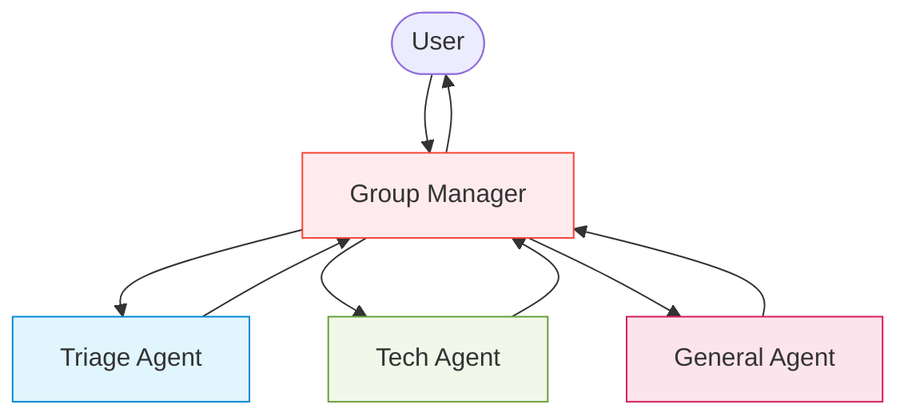

Group Chat orchestration in AG2 allows multiple agents to collaborate within a shared context, enabling more dynamic and complex workflows than what’s possible with just two agents or sequential interactions.

This powerful pattern streamlines coordination when you need more than two agents working together, whether they have specialized expertise or complementary roles in a workflow.

## Purpose and Benefits

While two-agent chats work well for straightforward interactions and sequential chats handle predetermined workflows, Group Chat provides several unique advantages:

- **Streamlined coordination**: Manage multiple agents with less code and more flexible interactions
- **Specialized expertise**: Each agent can focus on what it does best, creating a team of specialists
- **Dynamic collaboration**: Agents can interact with each other and respond to new information as it emerges
- **Flexible handoffs**: Control can move between agents based on context, conversation state, or explicit directions
- **Shared context**: All agents work within the same conversation context, maintaining continuity
- **Scalable complexity**: Easily add new capabilities by introducing specialized agents rather than making existing agents more complex

## Core Components

The below are the core components of a Group Chat orchestration:

- **Agents**: Conversable agents that perform specific tasks in the workflow
- **Patterns**: Define how agents take turns in the conversation and how they interact with each other.
- **Handoffs**: Control how agents pass control to each other
- **Context Variables**:  Shared state information accessible to all agents throughout the conversation

## Step-by-Step Guide: Creating a Simple Group Chat

This example demonstrates how to build a simple Group Chat system with three agents: **a triage agent**, a **technical support agent**, and a **general support agent**.

These agents collaborate to assist the user with a tech-related query. We use the `AutoPattern` to automatically decide which agent should respond next based on the conversation context.

### 1. Import Modules and Configure the LLM

We start by importing necessary modules and setting up the language model configuration.

```python
from autogen import ConversableAgent, LLMConfig
from autogen.agentchat import initiate_group_chat
from autogen.agentchat.group.patterns import AutoPattern

llm_config = LLMConfig(api_type="openai", model="gpt-4o-mini")
```

### 2. Create Specialized Agents

Each agent has a focused responsibility. We configure their roles using system messages.

```python
with llm_config:
    triage_agent = ConversableAgent(
        name="triage_agent",
        system_message="""You are a triage agent. For each user query,
        identify whether it is a technical issue or a general question. Route
        technical issues to the tech agent and general questions to the general agent.
        Do not provide suggestions or answers, only route the query."""
    )

    tech_agent = ConversableAgent(
        name="tech_agent",
        system_message="""You solve technical problems like software bugs
        and hardware issues."""
    )

    general_agent = ConversableAgent(
        name="general_agent",
        system_message="You handle general, non-technical support questions."
    )
```
### 3. Create a User Agent

The user agent simulates a real human user participating in the group chat.

```python
user = ConversableAgent(name="user", human_input_mode="ALWAYS")
```

### 4. Define the Conversation Pattern

We use **AutoPattern** to let the Group Manager dynamically decide which agent should take the next turn.

```python
pattern = AutoPattern(
    initial_agent=triage_agent,  # Agent that starts the conversation
    agents=[triage_agent, tech_agent, general_agent],
    user_agent=user,
    group_manager_args={"llm_config": llm_config}
)
```

### 5. Start the Group Chat

We kick off the conversation by calling `initiate_group_chat()` method:

```python
result, context, last_agent = initiate_group_chat(
    pattern=pattern,
    messages="My laptop keeps shutting down randomly. Can you help?",
    max_rounds=10
)
```

### What Happens During Execution?

The following diagram illustrates how the triage example unfolds. The user submits a message, and based on the issue, the triage agent decides whether it’s technical or general.

We are using the `AutoPattern` in this example, where the next speaker is automatically selected for based on the context of the conversation.



### Complete Code Example

Here's the complete, ready-to-run code for our enhanced financial compliance system using the Group Chat pattern:

???+ info "Complete Code Example"

    ```python
    from autogen import ConversableAgent, LLMConfig
    from autogen.agentchat import initiate_group_chat
    from autogen.agentchat.group.patterns import AutoPattern

    llm_config = LLMConfig(api_type="openai", model="gpt-4o-mini")

    with llm_config:
        triage_agent = ConversableAgent(
            name="triage_agent",
            system_message="""You are a triage agent. For each user query,
            identify whether it is a technical issue or a general question. Route
            technical issues to the tech agent and general questions to the general agent.
            Do not provide suggestions or answers, only route the query."""
        )

        tech_agent = ConversableAgent(
            name="tech_agent",
            system_message="""You solve technical problems like software bugs
            and hardware issues."""
        )

        general_agent = ConversableAgent(
            name="general_agent",
            system_message="You handle general, non-technical support questions."
        )

    user = ConversableAgent(name="user", human_input_mode="ALWAYS")

    pattern = AutoPattern(
        initial_agent=triage_agent,
        agents=[triage_agent, tech_agent, general_agent],
        user_agent=user,
        group_manager_args={"llm_config": llm_config}
    )

    result, context, last_agent = initiate_group_chat(
        pattern=pattern,
        messages="My laptop keeps shutting down randomly. Can you help?",
        max_rounds=10
    )
    ```

### How to Run This Example

- Save the code above to a file (e.g., `triage_chat.py)`
- Set your OpenAI API key in your environment variable or use your preferred model provider
- Make sure you have AG2 installed: `pip install ag2[openai]` or use your preferred model provider extra
- Run the script: python `triage_chat.py`

### Example Output

When you run this code, you'll see a workflow similar to this:

```console
user (to chat_manager):

My laptop keeps shutting down randomly. Can you help?

--------------------------------------------------------------------------------

Next speaker: triage_agent


>>>>>>>> USING AUTO REPLY...
triage_agent (to chat_manager):

Routing to tech agent.

--------------------------------------------------------------------------------

Next speaker: tech_agent


>>>>>>>> USING AUTO REPLY...
tech_agent (to chat_manager):

Certainly! A laptop shutting down randomly can be caused by several issues. Here are some troubleshooting steps you can follow:

1. **Check the Power Supply**: Ensure that your laptop's power adapter is functioning properly. Make sure the connection to the laptop and the power outlet is secure. If possible, try a different power adapter.

2. **Examine the Battery**: If your laptop has a removable battery, try taking it out and then reseating it. You might also want to test the laptop without the battery by running it only on the power adapter to see if it still shuts down.

3. **Overheating**: Overheating can trigger automatic shutdowns. Make sure the vents are clean and not blocked by dust. You might want to use compressed air to clean out any obstructions.

4. **Check for Hardware Issues**: Inspect for any loose connections, especially if you’ve recently upgraded or repaired your laptop.

5. **Run Diagnostics**: Most laptops come with built-in diagnostics. Access it (usually by pressing a specific key during boot) and run the hardware tests available.

6. **Update Drivers and BIOS**: Ensure that your operating system, drivers, and BIOS are up-to-date. Sometimes, outdated software can lead to unexpected shutdowns.

7. **Scan for Malware**: Run a full system scan using a trusted antivirus software to ensure that malware isn’t causing the problem.

8. **Event Viewer**: Check the Event Viewer (Windows) to look for any critical errors or warnings at the time of shutdown that might give you clues about the issue.

9. **Run a System Restore**: If the issue started recently, consider using System Restore to roll back to a previous state when the laptop was functioning correctly.

If the problem persists after trying the above steps, there may be a more serious hardware issue, such as a failing motherboard or power supply. In that case, it might be best to consult a professional technician.

--------------------------------------------------------------------------------

Next speaker: user

Replying as user. Provide feedback to chat_manager. Press enter to skip and use auto-reply, or type 'exit' to end the conversation: Thank you
user (to chat_manager):

Thank you

--------------------------------------------------------------------------------

Next speaker: tech_agent


>>>>>>>> USING AUTO REPLY...
tech_agent (to chat_manager):

You're welcome! If you have any more questions or need further assistance, feel free to ask. Good luck with your laptop!

--------------------------------------------------------------------------------

Next speaker: user

Replying as user. Provide feedback to chat_manager. Press enter to skip and use auto-reply, or type 'exit' to end the conversation: exit

>>>>>>>> TERMINATING RUN (4e4995ff-dfd4-4f2c-91a8-28f374c8269e): User requested to end the conversation

>>>>>>>> TERMINATING RUN (1353f5d3-ce7c-46e4-a713-b05729b682bb): No reply generated
```

## Next Steps
Now that you understand the basics of Group Chat, the following sections will dive deeper into:

- **Tools and Functions** – Understand how agents use functions to perform actions and return results, a foundation for creating interactive workflows
- **Context Variables** – Learn how to share and maintain state across agents during conversations, providing a shared memory for your agent team
- **Handoffs and Transitions** – Master how to control and customize transitions between agents, both implicitly (via context) and explicitly (via handoff mechanisms)
- **Patterns** – Explore various orchestration patterns available (AutoPattern, RoundRobinPattern, RandomPattern, ManualPattern) and how they influence agent behavior

This sequence allows users to first understand how agents can perform actions through tools, then how they can share state with context variables, before moving on to how they can transition between each other with handoffs.
