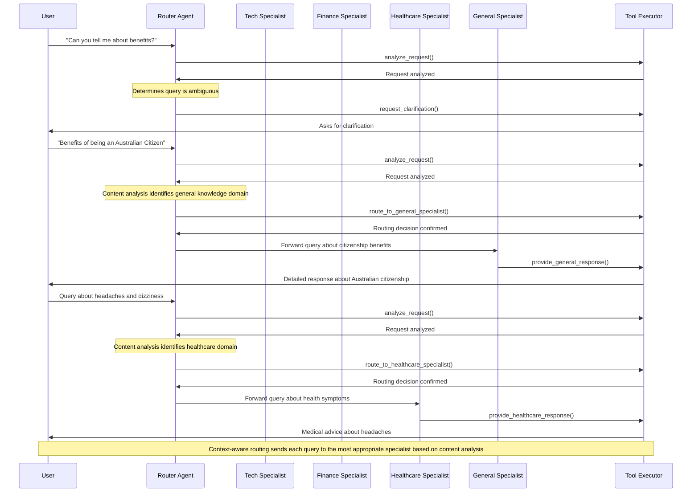

The Context-Aware Routing Pattern creates a dynamic workflow where tasks are intelligently distributed to specialized agents based on content analysis rather than predetermined paths. Unlike static patterns with fixed routes, this approach analyzes each request in real-time to determine the most appropriate specialist, ensuring queries are handled by agents with the most relevant expertise while maintaining conversation continuity even as topics shift across domains.

### Key Characteristics


The Context-Aware Routing Pattern uses intelligent analysis to match requests with the most qualified specialist. By examining the content and context of each query, the system can dynamically adapt its routing decisions, ensuring optimal expertise allocation while maintaining a seamless user experience across domain transitions.

* **Dynamic Content Analysis**: Each request is analyzed for keywords, themes, and intent to determine the most appropriate domain for routing.

* **Adaptive Routing Logic**: Routing decisions adapt in real-time to changing topics, allowing smooth transitions between different domains of expertise.

* **Ambiguity Resolution**: When queries have unclear domain affiliations, the system can request clarification before routing.

* **Contextual Memory**: Past interactions and domain history inform future routing decisions, creating a more coherent multi-domain experience.

### Information Flow


In the Context-Aware Routing Pattern, information flows through a central router that serves as a dispatcher for incoming requests. This router analyzes each query's content and context before directing it to a specialized agent, creating a hub-and-spoke information flow that dynamically adjusts based on the nature of each request rather than following a predetermined sequence.

* **Analysis Phase**: Each request undergoes content analysis to extract domain indicators and intent.

* **Decision Point**: Based on analysis, the system determines which specialist agent has the most relevant expertise.

* **Specialization Phase**: The selected domain expert processes the request using their specialized knowledge.

* **Return Path**: Responses flow back to the user, with the router maintaining awareness of the conversation state for future routing decisions.

### Implementation

Our implementation using AG2's Swarm demonstrates the Context-Aware Routing Pattern with a router agent that analyzes queries and directs them to specialized domain experts. The system maintains rich contextual information about domain history, request patterns, and confidence levels, enabling intelligent routing decisions that improve as the conversation evolves.

* **Content Analysis Tools**: The router agent uses sophisticated analysis functions to determine query domains and calculate confidence scores.

* **Domain Specialists**: Four specialized agents (technology, finance, healthcare, general knowledge) provide domain-specific expertise.

* **Context Variables**: Shared context tracks domain history, confidence scores, and routing decisions to inform future interactions.

* **OnContextCondition Handoffs**: Efficient conditional handoffs dynamically route requests based on the determined domain.

This pattern excels in multi-domain support systems, complex customer service environments, and research assistants that require access to diverse knowledge domains. It enables a single system to provide expert-level responses across multiple domains while maintaining a coherent conversation experience.

## Agent Flow



## Code

<Tip>
In this code example we use OpenAI's GPT-4o mini.

We also set the LLM parameter `parallel_tool_calls` to False so that our agents don't recommend more than one tool call at a time. This parameter may not be available with all model providers.
</Tip>

```python
from typing import Any, Annotated
from autogen import (
    ConversableAgent,
    UserProxyAgent,
    register_hand_off,
    OnContextCondition,
    AfterWork,
    AfterWorkOption,
    initiate_swarm_chat,
    ContextExpression,
    SwarmResult,
    LLMConfig,
)

# Context-Aware Routing pattern for dynamic task assignment
# Routes queries to the most appropriate specialist based on query content analysis

# Setup LLM configuration
llm_config = LLMConfig(model="gpt-4o-mini", api_type="openai", cache_seed=None, parallel_tool_calls=False)

# Shared context for tracking the conversation and routing decisions
shared_context = {
    # Routing state
    "routing_started": False,
    "current_domain": None,
    "previous_domains": [],
    "domain_confidence": {},

    # Request tracking
    "request_count": 0,
    "current_request": "",
    "domain_history": {},

    # Response tracking
    "question_responses": [], # List of question-response pairs
    "question_answered": True, # Indicates if the last question was answered

    # Specialist invocation tracking
    "tech_invocations": 0,
    "finance_invocations": 0,
    "healthcare_invocations": 0,
    "general_invocations": 0,

    # Error state (not handled but could be used to route to an error agent)
    "has_error": False,
    "error_message": "",
}

# Functions for the context-aware routing pattern

def analyze_request(
    request: Annotated[str, "The user request text to analyze"],
    context_variables: dict[str, Any]
) -> SwarmResult:
    """
    Analyze a user request to determine routing based on content
    Updates context variables with routing information
    """
    context_variables["question_answered"] = False

    # Update request tracking
    context_variables["routing_started"] = True
    context_variables["request_count"] += 1
    context_variables["current_request"] = request

    # Previous domain becomes part of history
    if context_variables["current_domain"]:
        prev_domain = context_variables["current_domain"]
        context_variables["previous_domains"].append(prev_domain)
        if prev_domain in context_variables["domain_history"]:
            context_variables["domain_history"][prev_domain] += 1
        else:
            context_variables["domain_history"][prev_domain] = 1

    # Reset current_domain to be determined by the router
    context_variables["current_domain"] = None

    return SwarmResult(
        values=f"Request analyzed. Will determine the best specialist to handle: '{request}'",
        context_variables=context_variables
    )

def route_to_tech_specialist(
    confidence: Annotated[int, "Confidence level for tech domain (1-10)"],
    reasoning: Annotated[str, "Reasoning for routing to tech specialist"],
    context_variables: dict[str, Any]
) -> SwarmResult:
    """
    Route the current request to the technology specialist
    """
    context_variables["current_domain"] = "technology"
    context_variables["domain_confidence"]["technology"] = confidence
    context_variables["tech_invocations"] += 1

    return SwarmResult(
        values=f"Routing to tech specialist with confidence {confidence}/10. Reasoning: {reasoning}",
        context_variables=context_variables
    )

def route_to_finance_specialist(
    confidence: Annotated[int, "Confidence level for finance domain (1-10)"],
    reasoning: Annotated[str, "Reasoning for routing to finance specialist"],
    context_variables: dict[str, Any]
) -> SwarmResult:
    """
    Route the current request to the finance specialist
    """
    context_variables["current_domain"] = "finance"
    context_variables["domain_confidence"]["finance"] = confidence
    context_variables["finance_invocations"] += 1

    return SwarmResult(
        values=f"Routing to finance specialist with confidence {confidence}/10. Reasoning: {reasoning}",
        context_variables=context_variables
    )

def route_to_healthcare_specialist(
    confidence: Annotated[int, "Confidence level for healthcare domain (1-10)"],
    reasoning: Annotated[str, "Reasoning for routing to healthcare specialist"],
    context_variables: dict[str, Any]
) -> SwarmResult:
    """
    Route the current request to the healthcare specialist
    """
    context_variables["current_domain"] = "healthcare"
    context_variables["domain_confidence"]["healthcare"] = confidence
    context_variables["healthcare_invocations"] += 1

    return SwarmResult(
        values=f"Routing to healthcare specialist with confidence {confidence}/10. Reasoning: {reasoning}",
        context_variables=context_variables
    )

def route_to_general_specialist(
    confidence: Annotated[int, "Confidence level for general domain (1-10)"],
    reasoning: Annotated[str, "Reasoning for routing to general knowledge specialist"],
    context_variables: dict[str, Any]
) -> SwarmResult:
    """
    Route the current request to the general knowledge specialist
    """
    context_variables["current_domain"] = "general"
    context_variables["domain_confidence"]["general"] = confidence
    context_variables["general_invocations"] += 1

    return SwarmResult(
        values=f"Routing to general knowledge specialist with confidence {confidence}/10. Reasoning: {reasoning}",
        context_variables=context_variables
    )

# Functions for specialists to provide responses

def provide_tech_response(
    response: Annotated[str, "The specialist's response to the request"],
    context_variables: dict[str, Any]
) -> SwarmResult:
    """
    Submit a response from the technology specialist
    """
    # Record the question and response
    context_variables["question_responses"].append({
        "domain": "technology",
        "question": context_variables["current_request"],
        "response": response
    })
    context_variables["question_answered"] = True

    return SwarmResult(
        values="Technology specialist response provided.",
        context_variables=context_variables
    )

def provide_finance_response(
    response: Annotated[str, "The specialist's response to the request"],
    context_variables: dict[str, Any]
) -> SwarmResult:
    """
    Submit a response from the finance specialist
    """
    # Record the question and response
    context_variables["question_responses"].append({
        "domain": "finance",
        "question": context_variables["current_request"],
        "response": response
    })
    context_variables["question_answered"] = True

    return SwarmResult(
        values="Finance specialist response provided.",
        context_variables=context_variables
    )

def provide_healthcare_response(
    response: Annotated[str, "The specialist's response to the request"],
    context_variables: dict[str, Any]
) -> SwarmResult:
    """
    Submit a response from the healthcare specialist
    """
    # Record the question and response
    context_variables["question_responses"].append({
        "domain": "healthcare",
        "question": context_variables["current_request"],
        "response": response
    })
    context_variables["question_answered"] = True

    return SwarmResult(
        values="Healthcare specialist response provided.",
        context_variables=context_variables
    )

def provide_general_response(
    response: Annotated[str, "The specialist's response to the request"],
    context_variables: dict[str, Any]
) -> SwarmResult:
    """
    Submit a response from the general knowledge specialist
    """
    # Record the question and response
    context_variables["question_responses"].append({
        "domain": "general",
        "question": context_variables["current_request"],
        "response": response
    })
    context_variables["question_answered"] = True

    return SwarmResult(
        values="General knowledge specialist response provided.",
        context_variables=context_variables
    )

# Function for follow-up clarification if needed
def request_clarification(
    clarification_question: Annotated[str, "Question to ask user for clarification"],
    context_variables: dict[str, Any]
) -> SwarmResult:
    """
    Request clarification from the user when the query is ambiguous
    """
    return SwarmResult(
        values=f"Further clarification is required to determine the correct domain: {clarification_question}",
        context_variables=context_variables,
        agent=AfterWorkOption.REVERT_TO_USER
    )

with llm_config:
    # Create the agents for the routing system
    router_agent = ConversableAgent(
        name="router_agent",
        system_message="""You are the routing agent responsible for analyzing user requests and directing them to the most appropriate specialist.

    Your task is to carefully analyze each user query and determine which domain specialist would be best equipped to handle it:

    1. Technology Specialist: For questions about computers, software, programming, IT issues, electronics, digital tools, internet, etc. Use route_to_tech_specialist to transfer.
    2. Finance Specialist: For questions about money, investments, banking, budgeting, financial planning, taxes, economics, etc. Use route_to_finance_specialist to transfer.
    3. Healthcare Specialist: For questions about health, medicine, fitness, nutrition, diseases, medical conditions, wellness, etc. Use route_to_healthcare_specialist to transfer.
    4. General Knowledge Specialist: For general questions that don't clearly fit the other categories or span multiple domains. Use route_to_general_specialist to transfer.

    For each query, you must:
    1. Use the analyze_request tool to process the query and update context
    2. Determine the correct domain by analyzing keywords, themes, and context
    3. Consider the conversation history and previous domains if available
    4. Route to the most appropriate specialist using the corresponding routing tool

    When routing:
    - Provide a confidence level (1-10) based on how certain you are about the domain
    - Include detailed reasoning for your routing decision
    - If a query seems ambiguous or spans multiple domains, route to the specialist who can best handle the primary intent

    Always maintain context awareness by considering:
    - Current query content and intent
    - Previously discussed topics
    - User's possible follow-up patterns
    - Domain switches that might indicate changing topics

    After a specialist has provided an answer, output the question and answer.

    For ambiguous queries that could belong to multiple domains:
    - If you are CERTAIN that the query is multi-domain but has a primary focus, route to the specialist for that primary domain
    - If you are NOT CERTAIN and there is no clear primary domain, use the request_clarification tool to ask the user for more specifics
    - When a query follows up on a previous topic, consider maintaining consistency by routing to the same specialist unless the domain has clearly changed""",
        functions=[
            analyze_request,
            route_to_tech_specialist,
            route_to_finance_specialist,
            route_to_healthcare_specialist,
            route_to_general_specialist,
            request_clarification
        ]
    )

    tech_specialist = ConversableAgent(
        name="tech_specialist",
        system_message="""You are the technology specialist with deep expertise in computers, software, programming, IT, electronics, digital tools, and internet technologies.

    When responding to queries in your domain:
    1. Provide accurate, technical information based on current industry knowledge
    2. Explain complex concepts in clear terms appropriate for the user's apparent level of technical understanding
    3. Include practical advice, troubleshooting steps, or implementation guidance when applicable
    4. Reference relevant technologies, programming languages, frameworks, or tools as appropriate
    5. For coding questions, provide correct, well-structured code examples when helpful

    Focus on being informative, precise, and helpful. If a query contains elements outside your domain of expertise, focus on the technology aspects while acknowledging the broader context.

    Use the provide_tech_response tool to submit your final response.""",
        functions=[provide_tech_response]
    )

    finance_specialist = ConversableAgent(
        name="finance_specialist",
        system_message="""You are the finance specialist with deep expertise in personal finance, investments, banking, budgeting, financial planning, taxes, economics, and business finance.

    When responding to queries in your domain:
    1. Provide accurate financial information and advice based on sound financial principles
    2. Explain financial concepts clearly without excessive jargon
    3. Present balanced perspectives on financial decisions, acknowledging risks and benefits
    4. Avoid making specific investment recommendations but provide educational information about investment types
    5. Include relevant financial principles, terms, or calculations when appropriate

    Focus on being informative, balanced, and helpful. If a query contains elements outside your domain of expertise, focus on the financial aspects while acknowledging the broader context.

    Use the provide_finance_response tool to submit your final response.""",
        functions=[provide_finance_response]
    )

    healthcare_specialist = ConversableAgent(
        name="healthcare_specialist",
        system_message="""You are the healthcare specialist with deep expertise in health, medicine, fitness, nutrition, diseases, medical conditions, and wellness.

    When responding to queries in your domain:
    1. Provide accurate health information based on current medical understanding
    2. Explain medical concepts in clear, accessible language
    3. Include preventive advice and best practices for health management when appropriate
    4. Reference relevant health principles, systems, or processes
    5. Always clarify that you're providing general information, not personalized medical advice

    Focus on being informative, accurate, and helpful. If a query contains elements outside your domain of expertise, focus on the health aspects while acknowledging the broader context.

    Use the provide_healthcare_response tool to submit your final response.""",
        functions=[provide_healthcare_response]
    )

    general_specialist = ConversableAgent(
        name="general_specialist",
        system_message="""You are the general knowledge specialist with broad expertise across multiple domains and topics.

    When responding to queries in your domain:
    1. Provide comprehensive information drawing from relevant knowledge domains
    2. Handle questions that span multiple domains or don't clearly fit into a specialized area
    3. Synthesize information from different fields when appropriate
    4. Provide balanced perspectives on complex topics
    5. Address queries about history, culture, society, ethics, environment, education, arts, and other general topics

    Focus on being informative, balanced, and helpful. For questions that might benefit from deeper domain expertise, acknowledge this while providing the best general information possible.

    Use the provide_general_response tool to submit your final response.""",
        functions=[provide_general_response]
    )

# User agent for interaction
user = UserProxyAgent(
    name="user",
    code_execution_config=False
)

# Register handoffs for the context-aware routing pattern
# Router agent to specialists based on domain
register_hand_off(
    agent=router_agent,
    hand_to=[
        # Route to tech specialist when domain is technology
        OnContextCondition(
            target=tech_specialist,
            condition=ContextExpression("${current_domain} == 'technology'"),
            available=ContextExpression("!${question_answered}")
        ),
        # Route to finance specialist when domain is finance
        OnContextCondition(
            target=finance_specialist,
            condition=ContextExpression("${current_domain} == 'finance'"),
            available=ContextExpression("!${question_answered}")
        ),
        # Route to healthcare specialist when domain is healthcare
        OnContextCondition(
            target=healthcare_specialist,
            condition=ContextExpression("${current_domain} == 'healthcare'"),
            available=ContextExpression("!${question_answered}")
        ),
        # Route to general specialist when domain is general
        OnContextCondition(
            target=general_specialist,
            condition=ContextExpression("${current_domain} == 'general'"),
            available=ContextExpression("!${question_answered}")
        ),
        # Default to user if no routing occurs
        AfterWork(AfterWorkOption.REVERT_TO_USER)
    ]
)

# Specialists always return to router for next query
register_hand_off(
    agent=tech_specialist,
    hand_to=[
        AfterWork(router_agent)
    ]
)

register_hand_off(
    agent=finance_specialist,
    hand_to=[
        AfterWork(router_agent)
    ]
)

register_hand_off(
    agent=healthcare_specialist,
    hand_to=[
        AfterWork(router_agent)
    ]
)

register_hand_off(
    agent=general_specialist,
    hand_to=[
        AfterWork(router_agent)
    ]
)

# Run the context-aware routing pattern
def run_context_aware_routing():
    """Run the context-aware routing pattern for dynamic domain-based routing"""
    print("Initiating Context-Aware Routing Pattern...")

    # Sample requests to demonstrate the routing
    sample_general_knowledge = "Could you explain the cultural and historical significance of the Renaissance period in Europe? How did it influence art, science, and philosophy, and what lasting impacts does it have on modern society?"
    sample_healthcare_knowledge = "I've been experiencing frequent headaches, particularly in the morning, along with some dizziness. What might be causing this and what lifestyle changes or treatments should I consider? Are there specific foods that could help reduce headache frequency?"
    sample_tech_request = "What's the difference between interpreted and compiled programming languages? Can you give me examples of each and explain the advantages and disadvantages in terms of development speed and performance?"
    sample_finance_request = "Can you explain how blockchain technology works and its potential applications in finance?"
    sample_ambiguous_request = "Can you tell me about benefits? I'm trying to understand all my options and make the right decision."

    chat_result, final_context, last_agent = initiate_swarm_chat(
        initial_agent=router_agent,
        agents=[
            router_agent,
            tech_specialist,
            finance_specialist,
            healthcare_specialist,
            general_specialist
        ],
        messages=f"I have a question: {sample_ambiguous_request}",
        context_variables=shared_context,
        user_agent=user,
        max_rounds=100,
    )

    # Display the Questions and Answers
    print("\n===== QUESTION-RESPONSE PAIRS =====\n")
    for i, qr_pair in enumerate(final_context["question_responses"]):
        print(f"{i+1}. Domain: {qr_pair['domain'].capitalize()}")
        print(f"Question: {qr_pair['question']}")
        print(f"Response: {qr_pair['response']}\n\n")

    # Display the results
    print("\n===== REQUEST ROUTING SUMMARY =====\n")
    print(f"Total Requests: {final_context['request_count']}")
    print(f"Routed to Domain: {final_context['current_domain']}")

    # Display the routing history
    print("\n===== DOMAIN ROUTING HISTORY =====\n")
    for domain, count in final_context["domain_history"].items():
        print(f"{domain.capitalize()}: {count} time(s)")

    # Show specialist invocation counts
    print("\n===== SPECIALIST INVOCATIONS =====\n")
    print(f"Technology Specialist: {final_context['tech_invocations']}")
    print(f"Finance Specialist: {final_context['finance_invocations']}")
    print(f"Healthcare Specialist: {final_context['healthcare_invocations']}")
    print(f"General Knowledge Specialist: {final_context['general_invocations']}")

    # Display the conversation flow
    print("\n===== SPEAKER ORDER =====\n")
    for message in chat_result.chat_history:
        if "name" in message and message["name"] != "_Swarm_Tool_Executor":
            print(f"{message['name']}")

if __name__ == "__main__":
    run_context_aware_routing()
```

## Output

```console
user (to chat_manager):

I have a question: Can you tell me about benefits? I'm trying to understand all my options and make the right decision.

--------------------------------------------------------------------------------

Next speaker: router_agent


>>>>>>>> USING AUTO REPLY...
router_agent (to chat_manager):

***** Suggested tool call (call_ZLnzYavANDeotNnFeJ3jN4tC): analyze_request *****
Arguments:
{"request":"Can you tell me about benefits? I'm trying to understand all my options and make the right decision."}
********************************************************************************

--------------------------------------------------------------------------------

Next speaker: _Swarm_Tool_Executor


>>>>>>>> EXECUTING FUNCTION analyze_request...
Call ID: call_ZLnzYavANDeotNnFeJ3jN4tC
Input arguments: {'request': "Can you tell me about benefits? I'm trying to understand all my options and make the right decision."}
_Swarm_Tool_Executor (to chat_manager):

***** Response from calling tool (call_ZLnzYavANDeotNnFeJ3jN4tC) *****
Request analyzed. Will determine the best specialist to handle: 'Can you tell me about benefits? I'm trying to understand all my options and make the right decision.'
**********************************************************************

--------------------------------------------------------------------------------

Next speaker: router_agent


>>>>>>>> USING AUTO REPLY...
router_agent (to chat_manager):

***** Suggested tool call (call_DZPByFRPAyisJHFKVN8GckCg): request_clarification *****
Arguments:
{"clarification_question":"Could you please specify whether you're asking about employee benefits, financial benefits, health benefits, or something else?"}
**************************************************************************************

--------------------------------------------------------------------------------

Next speaker: _Swarm_Tool_Executor


>>>>>>>> EXECUTING FUNCTION request_clarification...
Call ID: call_DZPByFRPAyisJHFKVN8GckCg
Input arguments: {'clarification_question': "Could you please specify whether you're asking about employee benefits, financial benefits, health benefits, or something else?"}
_Swarm_Tool_Executor (to chat_manager):

***** Response from calling tool (call_DZPByFRPAyisJHFKVN8GckCg) *****
Further clarification is required to determine the correct domain: Could you please specify whether you're asking about employee benefits, financial benefits, health benefits, or something else?
**********************************************************************

--------------------------------------------------------------------------------

Next speaker: user

Replying as user. Provide feedback to chat_manager. Press enter to skip and use auto-reply, or type 'exit' to end the conversation: Sorry, I meant the benefits of being an Australian Citizen.
user (to chat_manager):

Sorry, I meant the benefits of being an Australian Citizen.

--------------------------------------------------------------------------------

Next speaker: router_agent


>>>>>>>> USING AUTO REPLY...
router_agent (to chat_manager):

***** Suggested tool call (call_5NBJvtxdTguYwe3nQs144h58): analyze_request *****
Arguments:
{"request":"Sorry, I meant the benefits of being an Australian Citizen."}
********************************************************************************

--------------------------------------------------------------------------------

Next speaker: _Swarm_Tool_Executor


>>>>>>>> EXECUTING FUNCTION analyze_request...
Call ID: call_5NBJvtxdTguYwe3nQs144h58
Input arguments: {'request': 'Sorry, I meant the benefits of being an Australian Citizen.'}
_Swarm_Tool_Executor (to chat_manager):

***** Response from calling tool (call_5NBJvtxdTguYwe3nQs144h58) *****
Request analyzed. Will determine the best specialist to handle: 'Sorry, I meant the benefits of being an Australian Citizen.'
**********************************************************************

--------------------------------------------------------------------------------

Next speaker: router_agent


>>>>>>>> USING AUTO REPLY...
router_agent (to chat_manager):

***** Suggested tool call (call_bjUJ7y0m0bdgYlxsynXzootZ): route_to_general_specialist *****
Arguments:
{"confidence":8,"reasoning":"The query pertains to the general knowledge about citizenship benefits in Australia, which doesn't strictly fit into one of the specialized categories like finance, technology, or healthcare."}
********************************************************************************************

--------------------------------------------------------------------------------

Next speaker: _Swarm_Tool_Executor


>>>>>>>> EXECUTING FUNCTION route_to_general_specialist...
Call ID: call_bjUJ7y0m0bdgYlxsynXzootZ
Input arguments: {'confidence': 8, 'reasoning': "The query pertains to the general knowledge about citizenship benefits in Australia, which doesn't strictly fit into one of the specialized categories like finance, technology, or healthcare."}
_Swarm_Tool_Executor (to chat_manager):

***** Response from calling tool (call_bjUJ7y0m0bdgYlxsynXzootZ) *****
Routing to general knowledge specialist with confidence 8/10. Reasoning: The query pertains to the general knowledge about citizenship benefits in Australia, which doesn't strictly fit into one of the specialized categories like finance, technology, or healthcare.
**********************************************************************

--------------------------------------------------------------------------------

Next speaker: router_agent

router_agent (to chat_manager):

[Handing off to general_specialist]

--------------------------------------------------------------------------------

Next speaker: general_specialist


>>>>>>>> USING AUTO REPLY...
general_specialist (to chat_manager):

***** Suggested tool call (call_g3mBBGkUA9k5ypepqAhgTI3f): provide_general_response *****
Arguments:
{"response":"Being an Australian citizen comes with a range of benefits that cover social, political, and economic aspects. Here are some key advantages:\n\n1. **Rights and Freedoms**: Australian citizens enjoy specific rights under the law, including the right to vote in federal, state, and local elections. They also have the right to stand for election and hold public office.\n\n2. **Access to Services**: Citizens have access to various government services and programs, such as healthcare through Medicare, which provides free or subsidized medical services. Citizens benefit from educational resources, including government-funded universities and training programs.\n\n3. **Social Security and Welfare**: Australian citizens are eligible for various social security benefits, such as unemployment benefits, family payments, pensions for retirees, and disability support, further promoting financial security and wellbeing.\n\n4. **Consular Protection**: Australian citizens can receive consular support from Australian embassies and consulates while traveling or living abroad, providing assistance in emergencies, legal situations, or if they encounter issues with local authorities.\n\n5. **Freedom of Travel**: Being an Australian citizen allows for easier entry into many countries without requiring a visa and access to Australian passports, which are considered strong for international travel.\n\n6. **Participation in Democracy**: Citizens can actively participate in shaping the country's future, including influencing legislation, policies, and community development. This engagement extends to local councils and community services.\n\n7. **Pathway to Non-Citizen Family**: Citizens can sponsor family members for resident visas, providing a pathway for family reunification.\n\n8. **Civic Responsibility and Identity**: Citizenship fosters a sense of belonging and civic responsibility, allowing individuals to contribute to their community and society.\n\nIn summary, becoming an Australian citizen opens the door to a wide array of benefits that enhance quality of life and provide individuals with the rights and tools to fully participate in Australian society."}
*****************************************************************************************

--------------------------------------------------------------------------------

Next speaker: _Swarm_Tool_Executor


>>>>>>>> EXECUTING FUNCTION provide_general_response...
Call ID: call_g3mBBGkUA9k5ypepqAhgTI3f
Input arguments: {'response': "Being an Australian citizen comes with a range of benefits that cover social, political, and economic aspects. Here are some key advantages:\n\n1. **Rights and Freedoms**: Australian citizens enjoy specific rights under the law, including the right to vote in federal, state, and local elections. They also have the right to stand for election and hold public office.\n\n2. **Access to Services**: Citizens have access to various government services and programs, such as healthcare through Medicare, which provides free or subsidized medical services. Citizens benefit from educational resources, including government-funded universities and training programs.\n\n3. **Social Security and Welfare**: Australian citizens are eligible for various social security benefits, such as unemployment benefits, family payments, pensions for retirees, and disability support, further promoting financial security and wellbeing.\n\n4. **Consular Protection**: Australian citizens can receive consular support from Australian embassies and consulates while traveling or living abroad, providing assistance in emergencies, legal situations, or if they encounter issues with local authorities.\n\n5. **Freedom of Travel**: Being an Australian citizen allows for easier entry into many countries without requiring a visa and access to Australian passports, which are considered strong for international travel.\n\n6. **Participation in Democracy**: Citizens can actively participate in shaping the country's future, including influencing legislation, policies, and community development. This engagement extends to local councils and community services.\n\n7. **Pathway to Non-Citizen Family**: Citizens can sponsor family members for resident visas, providing a pathway for family reunification.\n\n8. **Civic Responsibility and Identity**: Citizenship fosters a sense of belonging and civic responsibility, allowing individuals to contribute to their community and society.\n\nIn summary, becoming an Australian citizen opens the door to a wide array of benefits that enhance quality of life and provide individuals with the rights and tools to fully participate in Australian society."}
_Swarm_Tool_Executor (to chat_manager):

***** Response from calling tool (call_g3mBBGkUA9k5ypepqAhgTI3f) *****
General knowledge specialist response provided.
**********************************************************************

--------------------------------------------------------------------------------

Next speaker: general_specialist


>>>>>>>> USING AUTO REPLY...
general_specialist (to chat_manager):

Being an Australian citizen comes with a range of benefits that cover social, political, and economic aspects. Here are some key advantages:

1. **Rights and Freedoms**: Australian citizens enjoy specific rights under the law, including the right to vote in federal, state, and local elections. They also have the right to stand for election and hold public office.

2. **Access to Services**: Citizens have access to various government services and programs, such as healthcare through Medicare, which provides free or subsidized medical services. Citizens benefit from educational resources, including government-funded universities and training programs.

3. **Social Security and Welfare**: Australian citizens are eligible for various social security benefits, such as unemployment benefits, family payments, pensions for retirees, and disability support, further promoting financial security and wellbeing.

4. **Consular Protection**: Australian citizens can receive consular support from Australian embassies and consulates while traveling or living abroad, providing assistance in emergencies, legal situations, or if they encounter issues with local authorities.

5. **Freedom of Travel**: Being an Australian citizen allows for easier entry into many countries without requiring a visa and access to Australian passports, which are considered strong for international travel.

6. **Participation in Democracy**: Citizens can actively participate in shaping the country's future, including influencing legislation, policies, and community development. This engagement extends to local councils and community services.

7. **Pathway to Non-Citizen Family**: Citizens can sponsor family members for resident visas, providing a pathway for family reunification.

8. **Civic Responsibility and Identity**: Citizenship fosters a sense of belonging and civic responsibility, allowing individuals to contribute to their community and society.

In summary, becoming an Australian citizen opens the door to a wide array of benefits that enhance quality of life and provide individuals with the rights and tools to fully participate in Australian society.

--------------------------------------------------------------------------------

Next speaker: router_agent


>>>>>>>> USING AUTO REPLY...
router_agent (to chat_manager):

User Question: Can you tell me about the benefits of being an Australian Citizen?

Answer: Being an Australian citizen comes with a range of benefits that cover social, political, and economic aspects. Here are some key advantages:

1. **Rights and Freedoms**: Australian citizens enjoy specific rights under the law, including the right to vote in federal, state, and local elections. They also have the right to stand for election and hold public office.

2. **Access to Services**: Citizens have access to various government services and programs, such as healthcare through Medicare, which provides free or subsidized medical services. Citizens benefit from educational resources, including government-funded universities and training programs.

3. **Social Security and Welfare**: Australian citizens are eligible for various social security benefits, such as unemployment benefits, family payments, pensions for retirees, and disability support, further promoting financial security and wellbeing.

4. **Consular Protection**: Australian citizens can receive consular support from Australian embassies and consulates while traveling or living abroad, providing assistance in emergencies, legal situations, or if they encounter issues with local authorities.

5. **Freedom of Travel**: Being an Australian citizen allows for easier entry into many countries without requiring a visa and access to Australian passports, which are considered strong for international travel.

6. **Participation in Democracy**: Citizens can actively participate in shaping the country's future, including influencing legislation, policies, and community development. This engagement extends to local councils and community services.

7. **Pathway to Non-Citizen Family**: Citizens can sponsor family members for resident visas, providing a pathway for family reunification.

8. **Civic Responsibility and Identity**: Citizenship fosters a sense of belonging and civic responsibility, allowing individuals to contribute to their community and society.

In summary, becoming an Australian citizen opens the door to a wide array of benefits that enhance quality of life and provide individuals with the rights and tools to fully participate in Australian society.

--------------------------------------------------------------------------------

Next speaker: user

Replying as user. Provide feedback to chat_manager. Press enter to skip and use auto-reply, or type 'exit' to end the conversation: I've been experiencing frequent headaches, particularly in the morning, along with some dizziness. What might be causing this and what lifestyle changes or treatments should I consider? Are there specific foods that could help reduce headache frequency?
user (to chat_manager):

I've been experiencing frequent headaches, particularly in the morning, along with some dizziness. What might be causing this and what lifestyle changes or treatments should I consider? Are there specific foods that could help reduce headache frequency?

--------------------------------------------------------------------------------

Next speaker: router_agent


>>>>>>>> USING AUTO REPLY...
router_agent (to chat_manager):

***** Suggested tool call (call_vgrygrWG0sNrg6XYw4IOUWMx): analyze_request *****
Arguments:
{"request":"I've been experiencing frequent headaches, particularly in the morning, along with some dizziness. What might be causing this and what lifestyle changes or treatments should I consider? Are there specific foods that could help reduce headache frequency?"}
********************************************************************************

--------------------------------------------------------------------------------

Next speaker: _Swarm_Tool_Executor


>>>>>>>> EXECUTING FUNCTION analyze_request...
Call ID: call_vgrygrWG0sNrg6XYw4IOUWMx
Input arguments: {'request': "I've been experiencing frequent headaches, particularly in the morning, along with some dizziness. What might be causing this and what lifestyle changes or treatments should I consider? Are there specific foods that could help reduce headache frequency?"}
_Swarm_Tool_Executor (to chat_manager):

***** Response from calling tool (call_vgrygrWG0sNrg6XYw4IOUWMx) *****
Request analyzed. Will determine the best specialist to handle: 'I've been experiencing frequent headaches, particularly in the morning, along with some dizziness. What might be causing this and what lifestyle changes or treatments should I consider? Are there specific foods that could help reduce headache frequency?'
**********************************************************************

--------------------------------------------------------------------------------

Next speaker: router_agent


>>>>>>>> USING AUTO REPLY...
router_agent (to chat_manager):

***** Suggested tool call (call_qgnYQSgy80NAUF39WYTnODKF): route_to_healthcare_specialist *****
Arguments:
{"confidence":9,"reasoning":"The query directly relates to health concerns, specifically headaches and dizziness, and seeks advice on potential causes, lifestyle changes, and dietary considerations. These are within the healthcare domain."}
***********************************************************************************************

--------------------------------------------------------------------------------

Next speaker: _Swarm_Tool_Executor


>>>>>>>> EXECUTING FUNCTION route_to_healthcare_specialist...
Call ID: call_qgnYQSgy80NAUF39WYTnODKF
Input arguments: {'confidence': 9, 'reasoning': 'The query directly relates to health concerns, specifically headaches and dizziness, and seeks advice on potential causes, lifestyle changes, and dietary considerations. These are within the healthcare domain.'}
_Swarm_Tool_Executor (to chat_manager):

***** Response from calling tool (call_qgnYQSgy80NAUF39WYTnODKF) *****
Routing to healthcare specialist with confidence 9/10. Reasoning: The query directly relates to health concerns, specifically headaches and dizziness, and seeks advice on potential causes, lifestyle changes, and dietary considerations. These are within the healthcare domain.
**********************************************************************

--------------------------------------------------------------------------------

Next speaker: router_agent

router_agent (to chat_manager):

[Handing off to healthcare_specialist]

--------------------------------------------------------------------------------

Next speaker: healthcare_specialist


>>>>>>>> USING AUTO REPLY...
healthcare_specialist (to chat_manager):

***** Suggested tool call (call_wzx3jTM1dg8CoKItC1V4AUk5): provide_healthcare_response *****
Arguments:
{"response":"Frequent headaches, especially when they occur in the morning, accompanied by dizziness can be concerning and may stem from a variety of causes. Here are some potential factors to consider along with preventive strategies and dietary suggestions:\n\n### Possible Causes:\n1. **Dehydration**: Not drinking enough water can lead to headaches. Dehydration can also cause dizziness.\n2. **Sleep Disorders**: Conditions like sleep apnea might lead to headaches upon waking, as they can interrupt normal sleep cycles.\n3. **Posture Issues**: Poor posture, especially during sleep (like sleeping on an improper pillow), can strain your neck and lead to tension headaches.\n4. **Stress and Anxiety**: These can manifest as tension headaches, which might be worse in the mornings if stress accumulates overnight.\n5. **Dietary Factors**: Certain foods (like those high in sugar or caffeine) can trigger headaches. Additionally, skipping meals can lead to headaches.\n6. **Medical Conditions**: Conditions such as migraines, cluster headaches, or even more serious issues like hypertension or neurological disorders could be contributing factors. \n\n### Suggested Lifestyle Changes:\n- **Stay Hydrated**: Aim to drink sufficient water throughout the day.\n- **Establish a Sleep Routine**: Ensure you get enough quality sleep. A consistent sleep schedule helps.\n- **Review Your Sleep Position**: Evaluate whether your pillow and mattress provide the right support for your neck and back.\n- **Manage Stress**: Incorporate relaxation techniques such as meditation, yoga, or deep-breathing exercises.\n- **Regular Physical Activity**: Regular exercise can help reduce headache frequency and overall stress.\n- **Identify Triggers**: Keep a headache diary to track when headaches occur, along with any associated factors like food intake, sleep patterns, and stress levels.\n\n### Dietary Considerations:\nCertain foods may help reduce the frequency and severity of headaches, including:\n- **Fruits and Vegetables**: Consuming a variety can provide hydration and valuable nutrients. Spinach, avocados, and bananas may be particularly beneficial.\n- **Whole Grains**: Foods like oats and brown rice can help maintain stable blood sugar levels.\n- **Healthy Fats**: Sources like fish rich in omega-3 fatty acids (salmon, sardines) and nuts may help reduce inflammation.\n- **Magnesium-Rich Foods**: Such as leafy greens, nuts, seeds, and whole grains, as magnesium deficiency has been linked to headaches.\n- **Regular Meals**: Eating regular, balanced meals can prevent blood sugar drops that could trigger headaches.\n\n### When to See a Doctor:\nIf your headaches persist, worsen, or are accompanied by other concerning symptoms (like neurological issues, loss of vision, or severe dizziness), it’s important to consult a healthcare professional. They can help identify any underlying conditions and tailor a treatment plan suitable for you.\n\n### Important Note:\nWhile this information may be helpful, it does not replace professional medical advice. Always consult with a healthcare provider for personalized recommendations."}
********************************************************************************************

--------------------------------------------------------------------------------

Next speaker: _Swarm_Tool_Executor


>>>>>>>> EXECUTING FUNCTION provide_healthcare_response...
Call ID: call_wzx3jTM1dg8CoKItC1V4AUk5
Input arguments: {'response': 'Frequent headaches, especially when they occur in the morning, accompanied by dizziness can be concerning and may stem from a variety of causes. Here are some potential factors to consider along with preventive strategies and dietary suggestions:\n\n### Possible Causes:\n1. **Dehydration**: Not drinking enough water can lead to headaches. Dehydration can also cause dizziness.\n2. **Sleep Disorders**: Conditions like sleep apnea might lead to headaches upon waking, as they can interrupt normal sleep cycles.\n3. **Posture Issues**: Poor posture, especially during sleep (like sleeping on an improper pillow), can strain your neck and lead to tension headaches.\n4. **Stress and Anxiety**: These can manifest as tension headaches, which might be worse in the mornings if stress accumulates overnight.\n5. **Dietary Factors**: Certain foods (like those high in sugar or caffeine) can trigger headaches. Additionally, skipping meals can lead to headaches.\n6. **Medical Conditions**: Conditions such as migraines, cluster headaches, or even more serious issues like hypertension or neurological disorders could be contributing factors. \n\n### Suggested Lifestyle Changes:\n- **Stay Hydrated**: Aim to drink sufficient water throughout the day.\n- **Establish a Sleep Routine**: Ensure you get enough quality sleep. A consistent sleep schedule helps.\n- **Review Your Sleep Position**: Evaluate whether your pillow and mattress provide the right support for your neck and back.\n- **Manage Stress**: Incorporate relaxation techniques such as meditation, yoga, or deep-breathing exercises.\n- **Regular Physical Activity**: Regular exercise can help reduce headache frequency and overall stress.\n- **Identify Triggers**: Keep a headache diary to track when headaches occur, along with any associated factors like food intake, sleep patterns, and stress levels.\n\n### Dietary Considerations:\nCertain foods may help reduce the frequency and severity of headaches, including:\n- **Fruits and Vegetables**: Consuming a variety can provide hydration and valuable nutrients. Spinach, avocados, and bananas may be particularly beneficial.\n- **Whole Grains**: Foods like oats and brown rice can help maintain stable blood sugar levels.\n- **Healthy Fats**: Sources like fish rich in omega-3 fatty acids (salmon, sardines) and nuts may help reduce inflammation.\n- **Magnesium-Rich Foods**: Such as leafy greens, nuts, seeds, and whole grains, as magnesium deficiency has been linked to headaches.\n- **Regular Meals**: Eating regular, balanced meals can prevent blood sugar drops that could trigger headaches.\n\n### When to See a Doctor:\nIf your headaches persist, worsen, or are accompanied by other concerning symptoms (like neurological issues, loss of vision, or severe dizziness), it’s important to consult a healthcare professional. They can help identify any underlying conditions and tailor a treatment plan suitable for you.\n\n### Important Note:\nWhile this information may be helpful, it does not replace professional medical advice. Always consult with a healthcare provider for personalized recommendations.'}
_Swarm_Tool_Executor (to chat_manager):

***** Response from calling tool (call_wzx3jTM1dg8CoKItC1V4AUk5) *****
Healthcare specialist response provided.
**********************************************************************

--------------------------------------------------------------------------------

Next speaker: healthcare_specialist


>>>>>>>> USING AUTO REPLY...
healthcare_specialist (to chat_manager):

Frequent headaches, especially when they occur in the morning, accompanied by dizziness can be concerning and may stem from a variety of causes. Here are some potential factors to consider along with preventive strategies and dietary suggestions:

### Possible Causes:
1. **Dehydration**: Not drinking enough water can lead to headaches. Dehydration can also cause dizziness.
2. **Sleep Disorders**: Conditions like sleep apnea might lead to headaches upon waking, as they can interrupt normal sleep cycles.
3. **Posture Issues**: Poor posture, especially during sleep (like sleeping on an improper pillow), can strain your neck and lead to tension headaches.
4. **Stress and Anxiety**: These can manifest as tension headaches, which might be worse in the mornings if stress accumulates overnight.
5. **Dietary Factors**: Certain foods (like those high in sugar or caffeine) can trigger headaches. Additionally, skipping meals can lead to headaches.
6. **Medical Conditions**: Conditions such as migraines, cluster headaches, or even more serious issues like hypertension or neurological disorders could be contributing factors.

### Suggested Lifestyle Changes:
- **Stay Hydrated**: Aim to drink sufficient water throughout the day.
- **Establish a Sleep Routine**: Ensure you get enough quality sleep. A consistent sleep schedule helps.
- **Review Your Sleep Position**: Evaluate whether your pillow and mattress provide the right support for your neck and back.
- **Manage Stress**: Incorporate relaxation techniques such as meditation, yoga, or deep-breathing exercises.
- **Regular Physical Activity**: Regular exercise can help reduce headache frequency and overall stress.
- **Identify Triggers**: Keep a headache diary to track when headaches occur, along with any associated factors like food intake, sleep patterns, and stress levels.

### Dietary Considerations:
Certain foods may help reduce the frequency and severity of headaches, including:
- **Fruits and Vegetables**: Consuming a variety can provide hydration and valuable nutrients. Spinach, avocados, and bananas may be particularly beneficial.
- **Whole Grains**: Foods like oats and brown rice can help maintain stable blood sugar levels.
- **Healthy Fats**: Sources like fish rich in omega-3 fatty acids (salmon, sardines) and nuts may help reduce inflammation.
- **Magnesium-Rich Foods**: Such as leafy greens, nuts, seeds, and whole grains, as magnesium deficiency has been linked to headaches.
- **Regular Meals**: Eating regular, balanced meals can prevent blood sugar drops that could trigger headaches.

### When to See a Doctor:
If your headaches persist, worsen, or are accompanied by other concerning symptoms (like neurological issues, loss of vision, or severe dizziness), it’s important to consult a healthcare professional. They can help identify any underlying conditions and tailor a treatment plan suitable for you.

### Important Note:
While this information may be helpful, it does not replace professional medical advice. Always consult with a healthcare provider for personalized recommendations.

--------------------------------------------------------------------------------

Next speaker: router_agent


>>>>>>>> USING AUTO REPLY...
router_agent (to chat_manager):

User Question: I've been experiencing frequent headaches, particularly in the morning, along with some dizziness. What might be causing this and what lifestyle changes or treatments should I consider? Are there specific foods that could help reduce headache frequency?

Answer: Frequent headaches, especially when they occur in the morning, accompanied by dizziness can be concerning and may stem from a variety of causes. Here are some potential factors to consider along with preventive strategies and dietary suggestions:

### Possible Causes:
1. **Dehydration**: Not drinking enough water can lead to headaches. Dehydration can also cause dizziness.
2. **Sleep Disorders**: Conditions like sleep apnea might lead to headaches upon waking, as they can interrupt normal sleep cycles.
3. **Posture Issues**: Poor posture, especially during sleep (like sleeping on an improper pillow), can strain your neck and lead to tension headaches.
4. **Stress and Anxiety**: These can manifest as tension headaches, which might be worse in the mornings if stress accumulates overnight.
5. **Dietary Factors**: Certain foods (like those high in sugar or caffeine) can trigger headaches. Additionally, skipping meals can lead to headaches.
6. **Medical Conditions**: Conditions such as migraines, cluster headaches, or even more serious issues like hypertension or neurological disorders could be contributing factors.

### Suggested Lifestyle Changes:
- **Stay Hydrated**: Aim to drink sufficient water throughout the day.
- **Establish a Sleep Routine**: Ensure you get enough quality sleep. A consistent sleep schedule helps.
- **Review Your Sleep Position**: Evaluate whether your pillow and mattress provide the right support for your neck and back.
- **Manage Stress**: Incorporate relaxation techniques such as meditation, yoga, or deep-breathing exercises.
- **Regular Physical Activity**: Regular exercise can help reduce headache frequency and overall stress.
- **Identify Triggers**: Keep a headache diary to track when headaches occur, along with any associated factors like food intake, sleep patterns, and stress levels.

### Dietary Considerations:
Certain foods may help reduce the frequency and severity of headaches, including:
- **Fruits and Vegetables**: Consuming a variety can provide hydration and valuable nutrients. Spinach, avocados, and bananas may be particularly beneficial.
- **Whole Grains**: Foods like oats and brown rice can help maintain stable blood sugar levels.
- **Healthy Fats**: Sources like fish rich in omega-3 fatty acids (salmon, sardines) and nuts may help reduce inflammation.
- **Magnesium-Rich Foods**: Such as leafy greens, nuts, seeds, and whole grains, as magnesium deficiency has been linked to headaches.
- **Regular Meals**: Eating regular, balanced meals can prevent blood sugar drops that could trigger headaches.

### When to See a Doctor:
If your headaches persist, worsen, or are accompanied by other concerning symptoms (like neurological issues, loss of vision, or severe dizziness), it’s important to consult a healthcare professional. They can help identify any underlying conditions and tailor a treatment plan suitable for you.

### Important Note:
While this information may be helpful, it does not replace professional medical advice. Always consult with a healthcare provider for personalized recommendations.

--------------------------------------------------------------------------------

Next speaker: user

Replying as user. Provide feedback to chat_manager. Press enter to skip and use auto-reply, or type 'exit' to end the conversation: exit

===== QUESTION-RESPONSE PAIRS =====

1. Domain: General
Question: Sorry, I meant the benefits of being an Australian Citizen.
Response: Being an Australian citizen comes with a range of benefits that cover social, political, and economic aspects. Here are some key advantages:

1. **Rights and Freedoms**: Australian citizens enjoy specific rights under the law, including the right to vote in federal, state, and local elections. They also have the right to stand for election and hold public office.

2. **Access to Services**: Citizens have access to various government services and programs, such as healthcare through Medicare, which provides free or subsidized medical services. Citizens benefit from educational resources, including government-funded universities and training programs.

3. **Social Security and Welfare**: Australian citizens are eligible for various social security benefits, such as unemployment benefits, family payments, pensions for retirees, and disability support, further promoting financial security and wellbeing.

4. **Consular Protection**: Australian citizens can receive consular support from Australian embassies and consulates while traveling or living abroad, providing assistance in emergencies, legal situations, or if they encounter issues with local authorities.

5. **Freedom of Travel**: Being an Australian citizen allows for easier entry into many countries without requiring a visa and access to Australian passports, which are considered strong for international travel.

6. **Participation in Democracy**: Citizens can actively participate in shaping the country's future, including influencing legislation, policies, and community development. This engagement extends to local councils and community services.

7. **Pathway to Non-Citizen Family**: Citizens can sponsor family members for resident visas, providing a pathway for family reunification.

8. **Civic Responsibility and Identity**: Citizenship fosters a sense of belonging and civic responsibility, allowing individuals to contribute to their community and society.

In summary, becoming an Australian citizen opens the door to a wide array of benefits that enhance quality of life and provide individuals with the rights and tools to fully participate in Australian society.


2. Domain: Healthcare
Question: I've been experiencing frequent headaches, particularly in the morning, along with some dizziness. What might be causing this and what lifestyle changes or treatments should I consider? Are there specific foods that could help reduce headache frequency?
Response: Frequent headaches, especially when they occur in the morning, accompanied by dizziness can be concerning and may stem from a variety of causes. Here are some potential factors to consider along with preventive strategies and dietary suggestions:

### Possible Causes:
1. **Dehydration**: Not drinking enough water can lead to headaches. Dehydration can also cause dizziness.
2. **Sleep Disorders**: Conditions like sleep apnea might lead to headaches upon waking, as they can interrupt normal sleep cycles.
3. **Posture Issues**: Poor posture, especially during sleep (like sleeping on an improper pillow), can strain your neck and lead to tension headaches.
4. **Stress and Anxiety**: These can manifest as tension headaches, which might be worse in the mornings if stress accumulates overnight.
5. **Dietary Factors**: Certain foods (like those high in sugar or caffeine) can trigger headaches. Additionally, skipping meals can lead to headaches.
6. **Medical Conditions**: Conditions such as migraines, cluster headaches, or even more serious issues like hypertension or neurological disorders could be contributing factors.

### Suggested Lifestyle Changes:
- **Stay Hydrated**: Aim to drink sufficient water throughout the day.
- **Establish a Sleep Routine**: Ensure you get enough quality sleep. A consistent sleep schedule helps.
- **Review Your Sleep Position**: Evaluate whether your pillow and mattress provide the right support for your neck and back.
- **Manage Stress**: Incorporate relaxation techniques such as meditation, yoga, or deep-breathing exercises.
- **Regular Physical Activity**: Regular exercise can help reduce headache frequency and overall stress.
- **Identify Triggers**: Keep a headache diary to track when headaches occur, along with any associated factors like food intake, sleep patterns, and stress levels.

### Dietary Considerations:
Certain foods may help reduce the frequency and severity of headaches, including:
- **Fruits and Vegetables**: Consuming a variety can provide hydration and valuable nutrients. Spinach, avocados, and bananas may be particularly beneficial.
- **Whole Grains**: Foods like oats and brown rice can help maintain stable blood sugar levels.
- **Healthy Fats**: Sources like fish rich in omega-3 fatty acids (salmon, sardines) and nuts may help reduce inflammation.
- **Magnesium-Rich Foods**: Such as leafy greens, nuts, seeds, and whole grains, as magnesium deficiency has been linked to headaches.
- **Regular Meals**: Eating regular, balanced meals can prevent blood sugar drops that could trigger headaches.

### When to See a Doctor:
If your headaches persist, worsen, or are accompanied by other concerning symptoms (like neurological issues, loss of vision, or severe dizziness), it’s important to consult a healthcare professional. They can help identify any underlying conditions and tailor a treatment plan suitable for you.

### Important Note:
While this information may be helpful, it does not replace professional medical advice. Always consult with a healthcare provider for personalized recommendations.


===== REQUEST ROUTING SUMMARY =====

Total Requests: 3
Routed to Domain: healthcare

===== DOMAIN ROUTING HISTORY =====

General: 1 time(s)

===== SPECIALIST INVOCATIONS =====

Technology Specialist: 0
Finance Specialist: 0
Healthcare Specialist: 1
General Knowledge Specialist: 1

===== SPEAKER ORDER =====

user
router_agent
router_agent
user
router_agent
router_agent
router_agent
general_specialist
general_specialist
router_agent
user
router_agent
router_agent
router_agent
healthcare_specialist
healthcare_specialist
router_agent
```
