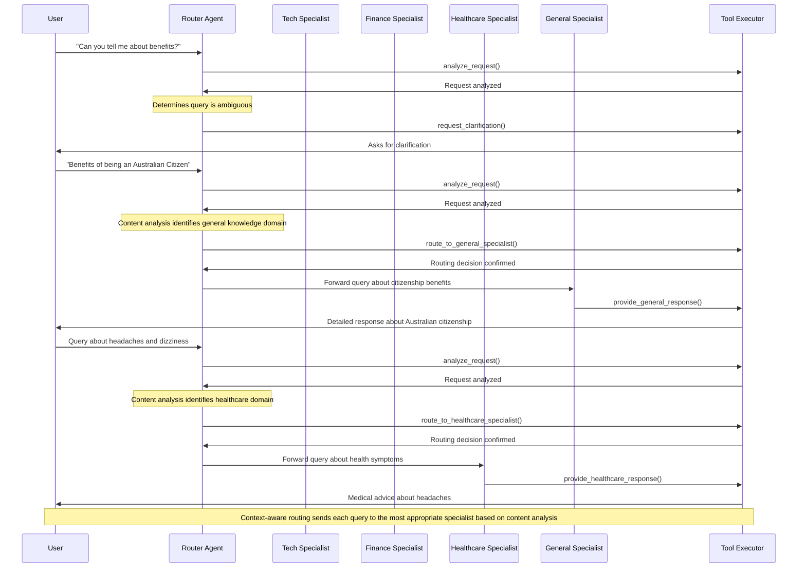

The Context-Aware Routing Pattern creates a dynamic workflow where tasks are intelligently distributed to specialized agents based on content analysis rather than predetermined paths. Unlike static patterns with fixed routes, this approach analyzes each request in real-time to determine the most appropriate specialist, ensuring queries are handled by agents with the most relevant expertise while maintaining conversation continuity even as topics shift across domains.

### Key Characteristics


The Context-Aware Routing Pattern uses intelligent analysis to match requests with the most qualified specialist. By examining the content and context of each query, the system can dynamically adapt its routing decisions, ensuring optimal expertise allocation while maintaining a seamless user experience across domain transitions.

* **Dynamic Content Analysis**: Each request is analyzed for keywords, themes, and intent to determine the most appropriate domain for routing.

* **Adaptive Routing Logic**: Routing decisions adapt in real-time to changing topics, allowing smooth transitions between different domains of expertise.

* **Ambiguity Resolution**: When queries have unclear domain affiliations, the system can request clarification before routing.

* **Contextual Memory**: Past interactions and domain history inform future routing decisions, creating a more coherent multi-domain experience.

### Information Flow


In the Context-Aware Routing Pattern, information flows through a central router that serves as a dispatcher for incoming requests. This router analyzes each query's content and context before directing it to a specialized agent, creating a hub-and-spoke information flow that dynamically adjusts based on the nature of each request rather than following a predetermined sequence.

* **Analysis Phase**: Each request undergoes content analysis to extract domain indicators and intent.

* **Decision Point**: Based on analysis, the system determines which specialist agent has the most relevant expertise.

* **Specialization Phase**: The selected domain expert processes the request using their specialized knowledge.

* **Return Path**: Responses flow back to the user, with the router maintaining awareness of the conversation state for future routing decisions.

### Implementation

Our implementation using AG2's Group Chat demonstrates the Context-Aware Routing Pattern with a router agent that analyzes queries and directs them to specialized domain experts. The system maintains rich contextual information about domain history, request patterns, and confidence levels, enabling intelligent routing decisions that improve as the conversation evolves.

* **Content Analysis Tools**: The router agent uses sophisticated analysis functions to determine query domains and calculate confidence scores.

* **Domain Specialists**: Four specialized agents (technology, finance, healthcare, general knowledge) provide domain-specific expertise.

* **Context Variables**: Shared context tracks domain history, confidence scores, and routing decisions to inform future interactions.

* **OnContextCondition Handoffs**: Efficient conditional handoffs dynamically route requests based on the determined domain.

This pattern excels in multi-domain support systems, complex customer service environments, and research assistants that require access to diverse knowledge domains. It enables a single system to provide expert-level responses across multiple domains while maintaining a coherent conversation experience.

## Agent Flow



## Code

<Tip>
In this code example we use OpenAI's GPT-4o mini.

We also set the LLM parameter `parallel_tool_calls` to False so that our agents don't recommend more than one tool call at a time. This parameter may not be available with all model providers.
</Tip>

```python
# Context-Aware Routing pattern for dynamic task assignment
# Routes queries to the most appropriate specialist based on query content analysis

from typing import Annotated
from autogen import (
    ConversableAgent,
    UserProxyAgent,
    LLMConfig,
)

from autogen.agentchat import initiate_group_chat
from autogen.agentchat.group.patterns import DefaultPattern
from autogen.agentchat.group.targets.transition_target import AgentTarget, AgentNameTarget, RevertToUserTarget
from autogen.agentchat.group import ReplyResult, ContextVariables, ExpressionContextCondition, ExpressionAvailableCondition, ContextExpression, OnContextCondition

# Setup LLM configuration
llm_config = LLMConfig(model="gpt-4.1-mini", api_type="openai", cache_seed=1, parallel_tool_calls=False)

# Shared context for tracking the conversation and routing decisions
shared_context = ContextVariables(data={
    # Routing state
    "routing_started": False,
    "current_domain": None,
    "previous_domains": [],
    "domain_confidence": {},

    # Request tracking
    "request_count": 0,
    "current_request": "",
    "domain_history": {},

    # Response tracking
    "question_responses": [], # List of question-response pairs
    "question_answered": True, # Indicates if the last question was answered

    # Specialist invocation tracking
    "tech_invocations": 0,
    "finance_invocations": 0,
    "healthcare_invocations": 0,
    "general_invocations": 0,

    # Error state (not handled but could be used to route to an error agent)
    "has_error": False,
    "error_message": "",
})

# Functions for the context-aware routing pattern

def analyze_request(
    request: Annotated[str, "The user request text to analyze"],
    context_variables: ContextVariables
) -> ReplyResult:
    """
    Analyze a user request to determine routing based on content
    Updates context variables with routing information
    """
    context_variables["question_answered"] = False

    # Update request tracking
    context_variables["routing_started"] = True
    context_variables["request_count"] += 1
    context_variables["current_request"] = request

    # Previous domain becomes part of history
    if context_variables["current_domain"]:
        prev_domain = context_variables["current_domain"]
        context_variables["previous_domains"].append(prev_domain)
        if prev_domain in context_variables["domain_history"]:
            context_variables["domain_history"][prev_domain] += 1
        else:
            context_variables["domain_history"][prev_domain] = 1

    # Reset current_domain to be determined by the router
    context_variables["current_domain"] = None

    return ReplyResult(
        message=f"Request analyzed. Will determine the best specialist to handle: '{request}'",
        context_variables=context_variables
    )

def route_to_tech_specialist(
    confidence: Annotated[int, "Confidence level for tech domain (1-10)"],
    reasoning: Annotated[str, "Reasoning for routing to tech specialist"],
    context_variables: ContextVariables
) -> ReplyResult:
    """
    Route the current request to the technology specialist
    """
    context_variables["current_domain"] = "technology"
    context_variables["domain_confidence"]["technology"] = confidence
    context_variables["tech_invocations"] += 1

    return ReplyResult(
        target=AgentTarget(agent=tech_specialist),
        message=f"Routing to tech specialist with confidence {confidence}/10. Reasoning: {reasoning}",
        context_variables=context_variables
    )

def route_to_finance_specialist(
    confidence: Annotated[int, "Confidence level for finance domain (1-10)"],
    reasoning: Annotated[str, "Reasoning for routing to finance specialist"],
    context_variables: ContextVariables
) -> ReplyResult:
    """
    Route the current request to the finance specialist
    """
    context_variables["current_domain"] = "finance"
    context_variables["domain_confidence"]["finance"] = confidence
    context_variables["finance_invocations"] += 1

    return ReplyResult(
        #target=AgentTarget(finance_specialist),
        target=AgentNameTarget(agent_name="finance_specialist"),
        message=f"Routing to finance specialist with confidence {confidence}/10. Reasoning: {reasoning}",
        context_variables=context_variables
    )

def route_to_healthcare_specialist(
    confidence: Annotated[int, "Confidence level for healthcare domain (1-10)"],
    reasoning: Annotated[str, "Reasoning for routing to healthcare specialist"],
    context_variables: ContextVariables
) -> ReplyResult:
    """
    Route the current request to the healthcare specialist
    """
    context_variables["current_domain"] = "healthcare"
    context_variables["domain_confidence"]["healthcare"] = confidence
    context_variables["healthcare_invocations"] += 1

    return ReplyResult(
        target=AgentTarget(agent=healthcare_specialist),
        message=f"Routing to healthcare specialist with confidence {confidence}/10. Reasoning: {reasoning}",
        context_variables=context_variables
    )

def route_to_general_specialist(
    confidence: Annotated[int, "Confidence level for general domain (1-10)"],
    reasoning: Annotated[str, "Reasoning for routing to general knowledge specialist"],
    context_variables: ContextVariables
) -> ReplyResult:
    """
    Route the current request to the general knowledge specialist
    """
    context_variables["current_domain"] = "general"
    context_variables["domain_confidence"]["general"] = confidence
    context_variables["general_invocations"] += 1

    return ReplyResult(
        target=AgentTarget(agent=general_specialist),
        message=f"Routing to general knowledge specialist with confidence {confidence}/10. Reasoning: {reasoning}",
        context_variables=context_variables
    )

# Functions for specialists to provide responses

def provide_tech_response(
    response: Annotated[str, "The specialist's response to the request"],
    context_variables: ContextVariables
) -> ReplyResult:
    """
    Submit a response from the technology specialist
    """
    # Record the question and response
    context_variables["question_responses"].append({
        "domain": "technology",
        "question": context_variables["current_request"],
        "response": response
    })
    context_variables["question_answered"] = True

    return ReplyResult(
        message="Technology specialist response provided.",
        context_variables=context_variables
    )

def provide_finance_response(
    response: Annotated[str, "The specialist's response to the request"],
    context_variables: ContextVariables
) -> ReplyResult:
    """
    Submit a response from the finance specialist
    """
    # Record the question and response
    context_variables["question_responses"].append({
        "domain": "finance",
        "question": context_variables["current_request"],
        "response": response
    })
    context_variables["question_answered"] = True

    return ReplyResult(
        message="Finance specialist response provided.",
        context_variables=context_variables
    )

def provide_healthcare_response(
    response: Annotated[str, "The specialist's response to the request"],
    context_variables: ContextVariables
) -> ReplyResult:
    """
    Submit a response from the healthcare specialist
    """
    # Record the question and response
    context_variables["question_responses"].append({
        "domain": "healthcare",
        "question": context_variables["current_request"],
        "response": response
    })
    context_variables["question_answered"] = True

    return ReplyResult(
        message="Healthcare specialist response provided.",
        context_variables=context_variables
    )

def provide_general_response(
    response: Annotated[str, "The specialist's response to the request"],
    context_variables: ContextVariables
) -> ReplyResult:
    """
    Submit a response from the general knowledge specialist
    """
    # Record the question and response
    context_variables["question_responses"].append({
        "domain": "general",
        "question": context_variables["current_request"],
        "response": response
    })
    context_variables["question_answered"] = True

    return ReplyResult(
        message="General knowledge specialist response provided.",
        context_variables=context_variables
    )

# Function for follow-up clarification if needed
def request_clarification(
    clarification_question: Annotated[str, "Question to ask user for clarification"],
    context_variables: ContextVariables
) -> ReplyResult:
    """
    Request clarification from the user when the query is ambiguous
    """
    return ReplyResult(
        message=f"Further clarification is required to determine the correct domain: {clarification_question}",
        context_variables=context_variables,
        target=RevertToUserTarget()
    )

with llm_config:
    # Create the agents for the routing system
    router_agent = ConversableAgent(
        name="router_agent",
        system_message="""You are the routing agent responsible for analyzing user requests and directing them to the most appropriate specialist.

    Your task is to carefully analyze each user query and determine which domain specialist would be best equipped to handle it:

    1. Technology Specialist: For questions about computers, software, programming, IT issues, electronics, digital tools, internet, etc. Use route_to_tech_specialist to transfer.
    2. Finance Specialist: For questions about money, investments, banking, budgeting, financial planning, taxes, economics, etc. Use route_to_finance_specialist to transfer.
    3. Healthcare Specialist: For questions about health, medicine, fitness, nutrition, diseases, medical conditions, wellness, etc. Use route_to_healthcare_specialist to transfer.
    4. General Knowledge Specialist: For general questions that don't clearly fit the other categories or span multiple domains. Use route_to_general_specialist to transfer.

    For each query, you must:
    1. Use the analyze_request tool to process the query and update context
    2. Determine the correct domain by analyzing keywords, themes, and context
    3. Consider the conversation history and previous domains if available
    4. Route to the most appropriate specialist using the corresponding routing tool

    When routing:
    - Provide a confidence level (1-10) based on how certain you are about the domain
    - Include detailed reasoning for your routing decision
    - If a query seems ambiguous or spans multiple domains, route to the specialist who can best handle the primary intent

    Always maintain context awareness by considering:
    - Current query content and intent
    - Previously discussed topics
    - User's possible follow-up patterns
    - Domain switches that might indicate changing topics

    After a specialist has provided an answer, output the question and answer.

    For ambiguous queries that could belong to multiple domains:
    - If you are CERTAIN that the query is multi-domain but has a primary focus, route to the specialist for that primary domain
    - If you are NOT CERTAIN and there is no clear primary domain, use the request_clarification tool to ask the user for more specifics
    - When a query follows up on a previous topic, consider maintaining consistency by routing to the same specialist unless the domain has clearly changed""",
        functions=[
            analyze_request,
            route_to_tech_specialist,
            route_to_finance_specialist,
            route_to_healthcare_specialist,
            route_to_general_specialist,
            request_clarification
        ]
    )

    tech_specialist = ConversableAgent(
        name="tech_specialist",
        system_message="""You are the technology specialist with deep expertise in computers, software, programming, IT, electronics, digital tools, and internet technologies.

    When responding to queries in your domain:
    1. Provide accurate, technical information based on current industry knowledge
    2. Explain complex concepts in clear terms appropriate for the user's apparent level of technical understanding
    3. Include practical advice, troubleshooting steps, or implementation guidance when applicable
    4. Reference relevant technologies, programming languages, frameworks, or tools as appropriate
    5. For coding questions, provide correct, well-structured code examples when helpful

    Focus on being informative, precise, and helpful. If a query contains elements outside your domain of expertise, focus on the technology aspects while acknowledging the broader context.

    Use the provide_tech_response tool to submit your final response.""",
        functions=[provide_tech_response]
    )

    finance_specialist = ConversableAgent(
        name="finance_specialist",
        system_message="""You are the finance specialist with deep expertise in personal finance, investments, banking, budgeting, financial planning, taxes, economics, and business finance.

    When responding to queries in your domain:
    1. Provide accurate financial information and advice based on sound financial principles
    2. Explain financial concepts clearly without excessive jargon
    3. Present balanced perspectives on financial decisions, acknowledging risks and benefits
    4. Avoid making specific investment recommendations but provide educational information about investment types
    5. Include relevant financial principles, terms, or calculations when appropriate

    Focus on being informative, balanced, and helpful. If a query contains elements outside your domain of expertise, focus on the financial aspects while acknowledging the broader context.

    Use the provide_finance_response tool to submit your final response.""",
        functions=[provide_finance_response]
    )

    healthcare_specialist = ConversableAgent(
        name="healthcare_specialist",
        system_message="""You are the healthcare specialist with deep expertise in health, medicine, fitness, nutrition, diseases, medical conditions, and wellness.

    When responding to queries in your domain:
    1. Provide accurate health information based on current medical understanding
    2. Explain medical concepts in clear, accessible language
    3. Include preventive advice and best practices for health management when appropriate
    4. Reference relevant health principles, systems, or processes
    5. Always clarify that you're providing general information, not personalized medical advice

    Focus on being informative, accurate, and helpful. If a query contains elements outside your domain of expertise, focus on the health aspects while acknowledging the broader context.

    Use the provide_healthcare_response tool to submit your final response.""",
        functions=[provide_healthcare_response]
    )

    general_specialist = ConversableAgent(
        name="general_specialist",
        system_message="""You are the general knowledge specialist with broad expertise across multiple domains and topics.

    When responding to queries in your domain:
    1. Provide comprehensive information drawing from relevant knowledge domains
    2. Handle questions that span multiple domains or don't clearly fit into a specialized area
    3. Synthesize information from different fields when appropriate
    4. Provide balanced perspectives on complex topics
    5. Address queries about history, culture, society, ethics, environment, education, arts, and other general topics

    Focus on being informative, balanced, and helpful. For questions that might benefit from deeper domain expertise, acknowledge this while providing the best general information possible.

    Use the provide_general_response tool to submit your final response.""",
        functions=[provide_general_response]
    )

# User agent for interaction
user = UserProxyAgent(
    name="user",
    code_execution_config=False
)

# Register handoffs for the context-aware routing pattern
# Router agent to specialists based on domain
router_agent.register_handoffs(conditions=[
    # Route to tech specialist when domain is technology
    OnContextCondition(
        target=AgentTarget(agent=tech_specialist),
        condition=ExpressionContextCondition(expression=ContextExpression(expression="${current_domain} == 'technology'")),
        available=ExpressionAvailableCondition(expression=ContextExpression(expression="!${question_answered}"))
    ),
    # Route to finance specialist when domain is finance
    OnContextCondition(
        target=AgentTarget(agent=finance_specialist),
        condition=ExpressionContextCondition(expression=ContextExpression(expression="${current_domain} == 'finance'")),
        available=ExpressionAvailableCondition(expression=ContextExpression(expression="!${question_answered}"))
    ),
    # Route to healthcare specialist when domain is healthcare
    OnContextCondition(
        target=AgentTarget(agent=healthcare_specialist),
        condition=ExpressionContextCondition(expression=ContextExpression(expression="${current_domain} == 'healthcare'")),
        available=ExpressionAvailableCondition(expression=ContextExpression(expression="!${question_answered}"))
    ),
    # Route to general specialist when domain is general
    OnContextCondition(
        target=AgentTarget(agent=general_specialist),
        condition=ExpressionContextCondition(expression=ContextExpression(expression="${current_domain} == 'general'")),
        available=ExpressionAvailableCondition(expression=ContextExpression(expression="!${question_answered}"))
    ),
])
router_agent.handoffs.set_after_work(target=RevertToUserTarget())

# Specialists always return to router for next query
tech_specialist.handoffs.set_after_work(target=AgentTarget(agent=router_agent))
finance_specialist.handoffs.set_after_work(target=AgentTarget(agent=router_agent))
healthcare_specialist.handoffs.set_after_work(target=AgentTarget(agent=router_agent))
general_specialist.handoffs.set_after_work(target=AgentTarget(agent=router_agent))

# Run the context-aware routing pattern
def run_context_aware_routing():
    """Run the context-aware routing pattern for dynamic domain-based routing"""
    print("Initiating Context-Aware Routing Pattern...")

    # Sample requests to demonstrate the routing
    sample_general_knowledge = "Could you explain the cultural and historical significance of the Renaissance period in Europe? How did it influence art, science, and philosophy, and what lasting impacts does it have on modern society?"
    sample_healthcare_knowledge = "I've been experiencing frequent headaches, particularly in the morning, along with some dizziness. What might be causing this and what lifestyle changes or treatments should I consider? Are there specific foods that could help reduce headache frequency?"
    sample_tech_request = "What's the difference between interpreted and compiled programming languages? Can you give me examples of each and explain the advantages and disadvantages in terms of development speed and performance?"
    sample_finance_request = "Can you explain how blockchain technology works and its potential applications in finance?"
    sample_ambiguous_request = "Can you tell me about benefits? I'm trying to understand all my options and make the right decision."

    agent_pattern = DefaultPattern(
    agents=[
            router_agent,
            tech_specialist,
            finance_specialist,
            healthcare_specialist,
            general_specialist
        ],
    initial_agent=router_agent,
    context_variables=shared_context,
    user_agent=user,
    )

    chat_result, final_context, last_agent = initiate_group_chat(
        pattern=agent_pattern,
        messages=f"I have a question: {sample_ambiguous_request}",
        max_rounds=100,
    )

    # Display the Questions and Answers
    print("\n===== QUESTION-RESPONSE PAIRS =====\n")
    for i, qr_pair in enumerate(final_context["question_responses"]):
        print(f"{i+1}. Domain: {qr_pair['domain'].capitalize()}")
        print(f"Question: {qr_pair['question']}")
        print(f"Response: {qr_pair['response']}\n\n")

    # Display the results
    print("\n===== REQUEST ROUTING SUMMARY =====\n")
    print(f"Total Requests: {final_context['request_count']}")
    print(f"Routed to Domain: {final_context['current_domain']}")

    # Display the routing history
    print("\n===== DOMAIN ROUTING HISTORY =====\n")
    for domain, count in final_context["domain_history"].items():
        print(f"{domain.capitalize()}: {count} time(s)")

    # Show specialist invocation counts
    print("\n===== SPECIALIST INVOCATIONS =====\n")
    print(f"Technology Specialist: {final_context['tech_invocations']}")
    print(f"Finance Specialist: {final_context['finance_invocations']}")
    print(f"Healthcare Specialist: {final_context['healthcare_invocations']}")
    print(f"General Knowledge Specialist: {final_context['general_invocations']}")

    # Display the conversation flow
    print("\n===== SPEAKER ORDER =====\n")
    for message in chat_result.chat_history:
        if "name" in message and message["name"] != "_Group_Tool_Executor":
            print(f"{message['name']}")

if __name__ == "__main__":
    run_context_aware_routing()
```

## Output

```console
Initiating Context-Aware Routing Pattern...
user (to chat_manager):

I have a question: Can you tell me about benefits? I'm trying to understand all my options and make the right decision.

--------------------------------------------------------------------------------

Next speaker: router_agent


>>>>>>>> USING AUTO REPLY...
router_agent (to chat_manager):

***** Suggested tool call (call_82DKgmrSzAS8HTUcv0X0JxyR): analyze_request *****
Arguments:
{"request":"Can you tell me about benefits? I'm trying to understand all my options and make the right decision."}
********************************************************************************

--------------------------------------------------------------------------------

Next speaker: _Group_Tool_Executor


>>>>>>>> EXECUTING FUNCTION analyze_request...
Call ID: call_82DKgmrSzAS8HTUcv0X0JxyR
Input arguments: {'request': "Can you tell me about benefits? I'm trying to understand all my options and make the right decision."}
_Group_Tool_Executor (to chat_manager):

***** Response from calling tool (call_82DKgmrSzAS8HTUcv0X0JxyR) *****
Request analyzed. Will determine the best specialist to handle: 'Can you tell me about benefits? I'm trying to understand all my options and make the right decision.'
**********************************************************************

--------------------------------------------------------------------------------

Next speaker: router_agent


>>>>>>>> USING AUTO REPLY...
router_agent (to chat_manager):

***** Suggested tool call (call_fz0sQOJY0qqzR6C1tmwCaRvv): request_clarification *****
Arguments:
{"clarification_question":"Could you please specify which type of benefits you are referring to? For example, employee benefits, health insurance benefits, financial benefits, or something else?"}
**************************************************************************************

--------------------------------------------------------------------------------

Next speaker: _Group_Tool_Executor


>>>>>>>> EXECUTING FUNCTION request_clarification...
Call ID: call_fz0sQOJY0qqzR6C1tmwCaRvv
Input arguments: {'clarification_question': 'Could you please specify which type of benefits you are referring to? For example, employee benefits, health insurance benefits, financial benefits, or something else?'}
_Group_Tool_Executor (to chat_manager):

***** Response from calling tool (call_fz0sQOJY0qqzR6C1tmwCaRvv) *****
Further clarification is required to determine the correct domain: Could you please specify which type of benefits you are referring to? For example, employee benefits, health insurance benefits, financial benefits, or something else?
**********************************************************************

--------------------------------------------------------------------------------

Next speaker: user

Replying as user. Provide feedback to chat_manager. Press enter to skip and use auto-reply, or type 'exit' to end the conversation: Sorry, I meant the benefits of being an Australian Citizen.
user (to chat_manager):

Sorry, I meant the benefits of being an Australian Citizen.

--------------------------------------------------------------------------------

Next speaker: router_agent


>>>>>>>> USING AUTO REPLY...
router_agent (to chat_manager):

***** Suggested tool call (call_OY6x9dzK0VlUo4x1jp6Vzf8o): analyze_request *****
Arguments:
{"request":"the benefits of being an Australian Citizen"}
********************************************************************************

--------------------------------------------------------------------------------

Next speaker: _Group_Tool_Executor


>>>>>>>> EXECUTING FUNCTION analyze_request...
Call ID: call_OY6x9dzK0VlUo4x1jp6Vzf8o
Input arguments: {'request': 'the benefits of being an Australian Citizen'}
_Group_Tool_Executor (to chat_manager):

***** Response from calling tool (call_OY6x9dzK0VlUo4x1jp6Vzf8o) *****
Request analyzed. Will determine the best specialist to handle: 'the benefits of being an Australian Citizen'
**********************************************************************

--------------------------------------------------------------------------------

Next speaker: router_agent


>>>>>>>> USING AUTO REPLY...
router_agent (to chat_manager):

***** Suggested tool call (call_P84aB8vkdKuYWkgpr9OaCVd2): route_to_general_specialist *****
Arguments:
{"confidence":9,"reasoning":"The query about the benefits of being an Australian Citizen is best suited for the General Knowledge Specialist, as it involves information related to citizenship benefits which cover legal, social, and civic aspects that are not strictly within technology, finance, or healthcare domains."}
********************************************************************************************

--------------------------------------------------------------------------------

Next speaker: _Group_Tool_Executor


>>>>>>>> EXECUTING FUNCTION route_to_general_specialist...
Call ID: call_P84aB8vkdKuYWkgpr9OaCVd2
Input arguments: {'confidence': 9, 'reasoning': 'The query about the benefits of being an Australian Citizen is best suited for the General Knowledge Specialist, as it involves information related to citizenship benefits which cover legal, social, and civic aspects that are not strictly within technology, finance, or healthcare domains.'}
_Group_Tool_Executor (to chat_manager):

***** Response from calling tool (call_P84aB8vkdKuYWkgpr9OaCVd2) *****
Routing to general knowledge specialist with confidence 9/10. Reasoning: The query about the benefits of being an Australian Citizen is best suited for the General Knowledge Specialist, as it involves information related to citizenship benefits which cover legal, social, and civic aspects that are not strictly within technology, finance, or healthcare domains.
**********************************************************************

--------------------------------------------------------------------------------

Next speaker: general_specialist


>>>>>>>> USING AUTO REPLY...
general_specialist (to chat_manager):

***** Suggested tool call (call_Fe06cKLYo7GP55IigeIDx70I): provide_general_response *****
Arguments:
{"response":"Being an Australian citizen comes with a variety of benefits and rights that can enhance your personal, social, and legal standing in Australia. Here are some key benefits of Australian citizenship:\n\n1. **Right to Vote and Stand for Office**: Citizens have the democratic right to vote in federal and state elections and referendums, and they can stand for election to parliament.\n\n2. **Access to Passport and Consular Assistance**: Australian citizens can apply for an Australian passport, which is highly respected globally and allows visa-free or visa-on-arrival travel to many countries. Citizens can also receive consular assistance from Australian embassies while overseas.\n\n3. **Unrestricted Work and Live Rights**: Citizenship grants the right to live and work anywhere in Australia without restrictions.\n\n4. **Eligibility for Government Jobs**: Some government positions and security-related jobs require Australian citizenship.\n\n5. **Social Security and Government Benefits**: Citizens are eligible for various government payments and benefits, including healthcare through Medicare, social security payments, and pensions.\n\n6. **Access to Education**: Citizens can access certain education benefits like subsidized university fees and student loans (e.g., HECS-HELP).\n\n7. **Protection under Australian Law**: Citizens receive full protection under Australian law and the Australian Constitution.\n\n8. **Ability to Pass Citizenship to Children**: Children born overseas to Australian citizens may automatically acquire citizenship.\n\n9. **Freedom from Deportation**: Unlike permanent residents, Australian citizens cannot be deported from Australia.\n\n10. **Sense of Belonging and National Identity**: Citizenship often provides a stronger sense of belonging and identity within Australia.\n\nIf you have specific aspects you want to explore further or need information about the citizenship application process, feel free to ask!"}
*****************************************************************************************

--------------------------------------------------------------------------------

Next speaker: _Group_Tool_Executor


>>>>>>>> EXECUTING FUNCTION provide_general_response...
Call ID: call_Fe06cKLYo7GP55IigeIDx70I
Input arguments: {'response': 'Being an Australian citizen comes with a variety of benefits and rights that can enhance your personal, social, and legal standing in Australia. Here are some key benefits of Australian citizenship:\n\n1. **Right to Vote and Stand for Office**: Citizens have the democratic right to vote in federal and state elections and referendums, and they can stand for election to parliament.\n\n2. **Access to Passport and Consular Assistance**: Australian citizens can apply for an Australian passport, which is highly respected globally and allows visa-free or visa-on-arrival travel to many countries. Citizens can also receive consular assistance from Australian embassies while overseas.\n\n3. **Unrestricted Work and Live Rights**: Citizenship grants the right to live and work anywhere in Australia without restrictions.\n\n4. **Eligibility for Government Jobs**: Some government positions and security-related jobs require Australian citizenship.\n\n5. **Social Security and Government Benefits**: Citizens are eligible for various government payments and benefits, including healthcare through Medicare, social security payments, and pensions.\n\n6. **Access to Education**: Citizens can access certain education benefits like subsidized university fees and student loans (e.g., HECS-HELP).\n\n7. **Protection under Australian Law**: Citizens receive full protection under Australian law and the Australian Constitution.\n\n8. **Ability to Pass Citizenship to Children**: Children born overseas to Australian citizens may automatically acquire citizenship.\n\n9. **Freedom from Deportation**: Unlike permanent residents, Australian citizens cannot be deported from Australia.\n\n10. **Sense of Belonging and National Identity**: Citizenship often provides a stronger sense of belonging and identity within Australia.\n\nIf you have specific aspects you want to explore further or need information about the citizenship application process, feel free to ask!'}
_Group_Tool_Executor (to chat_manager):

***** Response from calling tool (call_Fe06cKLYo7GP55IigeIDx70I) *****
General knowledge specialist response provided.
**********************************************************************

--------------------------------------------------------------------------------

Next speaker: general_specialist


>>>>>>>> USING AUTO REPLY...
general_specialist (to chat_manager):

Being an Australian citizen comes with a variety of benefits and rights that can enhance your personal, social, and legal standing in Australia. Here are some key benefits of Australian citizenship:

1. **Right to Vote and Stand for Office**: Citizens have the democratic right to vote in federal and state elections and referendums, and they can stand for election to parliament.

2. **Access to Passport and Consular Assistance**: Australian citizens can apply for an Australian passport, which is highly respected globally and allows visa-free or visa-on-arrival travel to many countries. Citizens can also receive consular assistance from Australian embassies while overseas.

3. **Unrestricted Work and Live Rights**: Citizenship grants the right to live and work anywhere in Australia without restrictions.

4. **Eligibility for Government Jobs**: Some government positions and security-related jobs require Australian citizenship.

5. **Social Security and Government Benefits**: Citizens are eligible for various government payments and benefits, including healthcare through Medicare, social security payments, and pensions.

6. **Access to Education**: Citizens can access certain education benefits like subsidized university fees and student loans (e.g., HECS-HELP).

7. **Protection under Australian Law**: Citizens receive full protection under Australian law and the Australian Constitution.

8. **Ability to Pass Citizenship to Children**: Children born overseas to Australian citizens may automatically acquire citizenship.

9. **Freedom from Deportation**: Unlike permanent residents, Australian citizens cannot be deported from Australia.

10. **Sense of Belonging and National Identity**: Citizenship often provides a stronger sense of belonging and identity within Australia.

If you have specific aspects you want to explore further or need information about the citizenship application process, feel free to ask!

--------------------------------------------------------------------------------

Next speaker: router_agent


>>>>>>>> USING AUTO REPLY...
router_agent (to chat_manager):

If you have any more questions or need clarification on any of the benefits or related topics about Australian citizenship, just let me know!

--------------------------------------------------------------------------------

Next speaker: user

Replying as user. Provide feedback to chat_manager. Press enter to skip and use auto-reply, or type 'exit' to end the conversation: I've been experiencing frequent headaches, particularly in the morning, along with some dizziness. What might be causing this and what lifestyle changes or treatments should I consider? Are there specific foods that could help reduce headache frequency?
user (to chat_manager):

I've been experiencing frequent headaches, particularly in the morning, along with some dizziness. What might be causing this and what lifestyle changes or treatments should I consider? Are there specific foods that could help reduce headache frequency?

--------------------------------------------------------------------------------

Next speaker: router_agent


>>>>>>>> USING AUTO REPLY...
router_agent (to chat_manager):

***** Suggested tool call (call_oDTbE64qgvNeMNq78F8zpa6j): analyze_request *****
Arguments:
{"request":"I've been experiencing frequent headaches, particularly in the morning, along with some dizziness. What might be causing this and what lifestyle changes or treatments should I consider? Are there specific foods that could help reduce headache frequency?"}
********************************************************************************

--------------------------------------------------------------------------------

Next speaker: _Group_Tool_Executor


>>>>>>>> EXECUTING FUNCTION analyze_request...
Call ID: call_oDTbE64qgvNeMNq78F8zpa6j
Input arguments: {'request': "I've been experiencing frequent headaches, particularly in the morning, along with some dizziness. What might be causing this and what lifestyle changes or treatments should I consider? Are there specific foods that could help reduce headache frequency?"}
_Group_Tool_Executor (to chat_manager):

***** Response from calling tool (call_oDTbE64qgvNeMNq78F8zpa6j) *****
Request analyzed. Will determine the best specialist to handle: 'I've been experiencing frequent headaches, particularly in the morning, along with some dizziness. What might be causing this and what lifestyle changes or treatments should I consider? Are there specific foods that could help reduce headache frequency?'
**********************************************************************

--------------------------------------------------------------------------------

Next speaker: router_agent


>>>>>>>> USING AUTO REPLY...
router_agent (to chat_manager):

***** Suggested tool call (call_XlFLYIUZkrEvOehQnp2yHcqj): route_to_healthcare_specialist *****
Arguments:
{"confidence":10,"reasoning":"The user's symptoms of frequent morning headaches and dizziness, along with inquiries about causes, treatments, lifestyle changes, and dietary recommendations, clearly align with healthcare and medical expertise. The healthcare specialist is best suited to address these health-related concerns comprehensively."}
***********************************************************************************************

--------------------------------------------------------------------------------

Next speaker: _Group_Tool_Executor


>>>>>>>> EXECUTING FUNCTION route_to_healthcare_specialist...
Call ID: call_XlFLYIUZkrEvOehQnp2yHcqj
Input arguments: {'confidence': 10, 'reasoning': "The user's symptoms of frequent morning headaches and dizziness, along with inquiries about causes, treatments, lifestyle changes, and dietary recommendations, clearly align with healthcare and medical expertise. The healthcare specialist is best suited to address these health-related concerns comprehensively."}
_Group_Tool_Executor (to chat_manager):

***** Response from calling tool (call_XlFLYIUZkrEvOehQnp2yHcqj) *****
Routing to healthcare specialist with confidence 10/10. Reasoning: The user's symptoms of frequent morning headaches and dizziness, along with inquiries about causes, treatments, lifestyle changes, and dietary recommendations, clearly align with healthcare and medical expertise. The healthcare specialist is best suited to address these health-related concerns comprehensively.
**********************************************************************

--------------------------------------------------------------------------------

Next speaker: healthcare_specialist


>>>>>>>> USING AUTO REPLY...
healthcare_specialist (to chat_manager):

***** Suggested tool call (call_DpmQGTHXZXDN6jz3bnV6pIDC): provide_healthcare_response *****
Arguments:
{"response":"Frequent morning headaches accompanied by dizziness can have several potential causes, ranging from lifestyle factors to medical conditions. Some common causes include:\n\n- **Sleep issues:** Poor quality sleep, sleep apnea, or insufficient sleep can trigger headaches and dizziness in the morning.\n- **Dehydration:** Not drinking enough fluids can cause headaches.\n- **Low blood sugar:** Skipping meals or having low blood sugar overnight may lead to morning headaches.\n- **Medication side effects:** Certain medications or their withdrawal can cause headaches.\n- **Tension headaches or migraines:** These can present with morning symptoms.\n- **Blood pressure changes:** High or low blood pressure can cause headaches and dizziness.\n- **Sinus problems or allergies:** Congestion might cause morning headaches.\n- **Other medical conditions:** Such as anemia, vision problems, or neurological issues.\n\n**Lifestyle changes and management strategies:**\n- Ensure consistent, adequate, and quality sleep (7-9 hours per night) with a regular schedule.\n- Stay well hydrated throughout the day.\n- Avoid skipping meals and maintain balanced blood sugar levels.\n- Limit caffeine and alcohol intake.\n- Manage stress through relaxation techniques, exercise, or mindfulness.\n- Maintain good posture and take breaks if you work at a desk or computer.\n\n**Diet and headache reduction:**\nSome foods and nutrients may help reduce headache frequency:\n- Magnesium-rich foods: spinach, nuts, seeds, whole grains.\n- Riboflavin (Vitamin B2): found in eggs, dairy, lean meats.\n- Omega-3 fatty acids: fatty fish like salmon, flaxseeds.\n- Stay consistent with meals and avoid trigger foods (such as processed meats, aged cheese, artificial sweeteners, and excessive caffeine).\n\nBecause headaches with dizziness can sometimes indicate underlying health issues, especially if frequent or worsening, it's important to consult a healthcare professional for an accurate diagnosis and tailored treatment. They may recommend investigations or specific therapies if needed.\n\nThis information is general and not a substitute for personalized medical advice. If your symptoms are severe, sudden, or accompanied by other signs like vision changes, weakness, confusion, or persistent vomiting, seek medical attention promptly."}
********************************************************************************************

--------------------------------------------------------------------------------

Next speaker: _Group_Tool_Executor


>>>>>>>> EXECUTING FUNCTION provide_healthcare_response...
Call ID: call_DpmQGTHXZXDN6jz3bnV6pIDC
Input arguments: {'response': "Frequent morning headaches accompanied by dizziness can have several potential causes, ranging from lifestyle factors to medical conditions. Some common causes include:\n\n- **Sleep issues:** Poor quality sleep, sleep apnea, or insufficient sleep can trigger headaches and dizziness in the morning.\n- **Dehydration:** Not drinking enough fluids can cause headaches.\n- **Low blood sugar:** Skipping meals or having low blood sugar overnight may lead to morning headaches.\n- **Medication side effects:** Certain medications or their withdrawal can cause headaches.\n- **Tension headaches or migraines:** These can present with morning symptoms.\n- **Blood pressure changes:** High or low blood pressure can cause headaches and dizziness.\n- **Sinus problems or allergies:** Congestion might cause morning headaches.\n- **Other medical conditions:** Such as anemia, vision problems, or neurological issues.\n\n**Lifestyle changes and management strategies:**\n- Ensure consistent, adequate, and quality sleep (7-9 hours per night) with a regular schedule.\n- Stay well hydrated throughout the day.\n- Avoid skipping meals and maintain balanced blood sugar levels.\n- Limit caffeine and alcohol intake.\n- Manage stress through relaxation techniques, exercise, or mindfulness.\n- Maintain good posture and take breaks if you work at a desk or computer.\n\n**Diet and headache reduction:**\nSome foods and nutrients may help reduce headache frequency:\n- Magnesium-rich foods: spinach, nuts, seeds, whole grains.\n- Riboflavin (Vitamin B2): found in eggs, dairy, lean meats.\n- Omega-3 fatty acids: fatty fish like salmon, flaxseeds.\n- Stay consistent with meals and avoid trigger foods (such as processed meats, aged cheese, artificial sweeteners, and excessive caffeine).\n\nBecause headaches with dizziness can sometimes indicate underlying health issues, especially if frequent or worsening, it's important to consult a healthcare professional for an accurate diagnosis and tailored treatment. They may recommend investigations or specific therapies if needed.\n\nThis information is general and not a substitute for personalized medical advice. If your symptoms are severe, sudden, or accompanied by other signs like vision changes, weakness, confusion, or persistent vomiting, seek medical attention promptly."}
_Group_Tool_Executor (to chat_manager):

***** Response from calling tool (call_DpmQGTHXZXDN6jz3bnV6pIDC) *****
Healthcare specialist response provided.
**********************************************************************

--------------------------------------------------------------------------------

Next speaker: healthcare_specialist


>>>>>>>> USING AUTO REPLY...
healthcare_specialist (to chat_manager):

Frequent morning headaches accompanied by dizziness can have several potential causes, ranging from lifestyle factors to medical conditions. Some common causes include:

- **Sleep issues:** Poor quality sleep, sleep apnea, or insufficient sleep can trigger headaches and dizziness in the morning.
- **Dehydration:** Not drinking enough fluids can cause headaches.
- **Low blood sugar:** Skipping meals or having low blood sugar overnight may lead to morning headaches.
- **Medication side effects:** Certain medications or their withdrawal can cause headaches.
- **Tension headaches or migraines:** These can present with morning symptoms.
- **Blood pressure changes:** High or low blood pressure can cause headaches and dizziness.
- **Sinus problems or allergies:** Congestion might cause morning headaches.
- **Other medical conditions:** Such as anemia, vision problems, or neurological issues.

**Lifestyle changes and management strategies:**
- Ensure consistent, adequate, and quality sleep (7-9 hours per night) with a regular schedule.
- Stay well hydrated throughout the day.
- Avoid skipping meals and maintain balanced blood sugar levels.
- Limit caffeine and alcohol intake.
- Manage stress through relaxation techniques, exercise, or mindfulness.
- Maintain good posture and take breaks if you work at a desk or computer.

**Diet and headache reduction:**
Some foods and nutrients may help reduce headache frequency:
- Magnesium-rich foods: spinach, nuts, seeds, whole grains.
- Riboflavin (Vitamin B2): found in eggs, dairy, lean meats.
- Omega-3 fatty acids: fatty fish like salmon, flaxseeds.
- Stay consistent with meals and avoid trigger foods (such as processed meats, aged cheese, artificial sweeteners, and excessive caffeine).

Because headaches with dizziness can sometimes indicate underlying health issues, especially if frequent or worsening, it's important to consult a healthcare professional for an accurate diagnosis and tailored treatment. They may recommend investigations or specific therapies if needed.

This information is general and not a substitute for personalized medical advice. If your symptoms are severe, sudden, or accompanied by other signs like vision changes, weakness, confusion, or persistent vomiting, seek medical attention promptly.

--------------------------------------------------------------------------------

Next speaker: router_agent


>>>>>>>> USING AUTO REPLY...
router_agent (to chat_manager):

You asked about frequent morning headaches with dizziness, possible causes, lifestyle changes, treatments, and specific foods to help reduce headache frequency. The potential causes include sleep issues, dehydration, low blood sugar, medication effects, tension headaches or migraines, blood pressure changes, sinus problems, or other medical conditions. Lifestyle changes to consider are improving sleep quality and regularity, staying hydrated, avoiding meal skipping, limiting caffeine and alcohol, managing stress, and maintaining good posture. Foods that may help include magnesium-rich foods (spinach, nuts, seeds), riboflavin sources (eggs, dairy, lean meats), and omega-3 fatty acids (fatty fish, flaxseeds), while avoiding known trigger foods is also advised. Because these symptoms might indicate underlying health issues, seeing a healthcare provider for diagnosis and personalized advice is important, especially if symptoms worsen or are accompanied by other concerning signs. If you need more detailed guidance or have other questions, feel free to ask!

--------------------------------------------------------------------------------

Next speaker: user

Replying as user. Provide feedback to chat_manager. Press enter to skip and use auto-reply, or type 'exit' to end the conversation: exit

>>>>>>>> TERMINATING RUN (d9f918c8-2f32-45cf-9849-da39d1404a5b): User requested to end the conversation

>>>>>>>> TERMINATING RUN (cb6d7abb-890b-45a7-83bc-8e7d8e49a9ea): No reply generated

===== QUESTION-RESPONSE PAIRS =====

1. Domain: General
Question: the benefits of being an Australian Citizen
Response: Being an Australian citizen comes with a variety of benefits and rights that can enhance your personal, social, and legal standing in Australia. Here are some key benefits of Australian citizenship:

1. **Right to Vote and Stand for Office**: Citizens have the democratic right to vote in federal and state elections and referendums, and they can stand for election to parliament.

2. **Access to Passport and Consular Assistance**: Australian citizens can apply for an Australian passport, which is highly respected globally and allows visa-free or visa-on-arrival travel to many countries. Citizens can also receive consular assistance from Australian embassies while overseas.

3. **Unrestricted Work and Live Rights**: Citizenship grants the right to live and work anywhere in Australia without restrictions.

4. **Eligibility for Government Jobs**: Some government positions and security-related jobs require Australian citizenship.

5. **Social Security and Government Benefits**: Citizens are eligible for various government payments and benefits, including healthcare through Medicare, social security payments, and pensions.

6. **Access to Education**: Citizens can access certain education benefits like subsidized university fees and student loans (e.g., HECS-HELP).

7. **Protection under Australian Law**: Citizens receive full protection under Australian law and the Australian Constitution.

8. **Ability to Pass Citizenship to Children**: Children born overseas to Australian citizens may automatically acquire citizenship.

9. **Freedom from Deportation**: Unlike permanent residents, Australian citizens cannot be deported from Australia.

10. **Sense of Belonging and National Identity**: Citizenship often provides a stronger sense of belonging and identity within Australia.

If you have specific aspects you want to explore further or need information about the citizenship application process, feel free to ask!


2. Domain: Healthcare
Question: I've been experiencing frequent headaches, particularly in the morning, along with some dizziness. What might be causing this and what lifestyle changes or treatments should I consider? Are there specific foods that could help reduce headache frequency?
Response: Frequent morning headaches accompanied by dizziness can have several potential causes, ranging from lifestyle factors to medical conditions. Some common causes include:

- **Sleep issues:** Poor quality sleep, sleep apnea, or insufficient sleep can trigger headaches and dizziness in the morning.
- **Dehydration:** Not drinking enough fluids can cause headaches.
- **Low blood sugar:** Skipping meals or having low blood sugar overnight may lead to morning headaches.
- **Medication side effects:** Certain medications or their withdrawal can cause headaches.
- **Tension headaches or migraines:** These can present with morning symptoms.
- **Blood pressure changes:** High or low blood pressure can cause headaches and dizziness.
- **Sinus problems or allergies:** Congestion might cause morning headaches.
- **Other medical conditions:** Such as anemia, vision problems, or neurological issues.

**Lifestyle changes and management strategies:**
- Ensure consistent, adequate, and quality sleep (7-9 hours per night) with a regular schedule.
- Stay well hydrated throughout the day.
- Avoid skipping meals and maintain balanced blood sugar levels.
- Limit caffeine and alcohol intake.
- Manage stress through relaxation techniques, exercise, or mindfulness.
- Maintain good posture and take breaks if you work at a desk or computer.

**Diet and headache reduction:**
Some foods and nutrients may help reduce headache frequency:
- Magnesium-rich foods: spinach, nuts, seeds, whole grains.
- Riboflavin (Vitamin B2): found in eggs, dairy, lean meats.
- Omega-3 fatty acids: fatty fish like salmon, flaxseeds.
- Stay consistent with meals and avoid trigger foods (such as processed meats, aged cheese, artificial sweeteners, and excessive caffeine).

Because headaches with dizziness can sometimes indicate underlying health issues, especially if frequent or worsening, it's important to consult a healthcare professional for an accurate diagnosis and tailored treatment. They may recommend investigations or specific therapies if needed.

This information is general and not a substitute for personalized medical advice. If your symptoms are severe, sudden, or accompanied by other signs like vision changes, weakness, confusion, or persistent vomiting, seek medical attention promptly.


===== REQUEST ROUTING SUMMARY =====

Total Requests: 3
Routed to Domain: healthcare

===== DOMAIN ROUTING HISTORY =====

General: 1 time(s)

===== SPECIALIST INVOCATIONS =====

Technology Specialist: 0
Finance Specialist: 0
Healthcare Specialist: 1
General Knowledge Specialist: 1

===== SPEAKER ORDER =====

user
router_agent
_Group_Tool_Executor
router_agent
_Group_Tool_Executor
user
router_agent
_Group_Tool_Executor
router_agent
_Group_Tool_Executor
general_specialist
_Group_Tool_Executor
general_specialist
router_agent
user
router_agent
_Group_Tool_Executor
router_agent
_Group_Tool_Executor
healthcare_specialist
_Group_Tool_Executor
healthcare_specialist
router_agent
```
