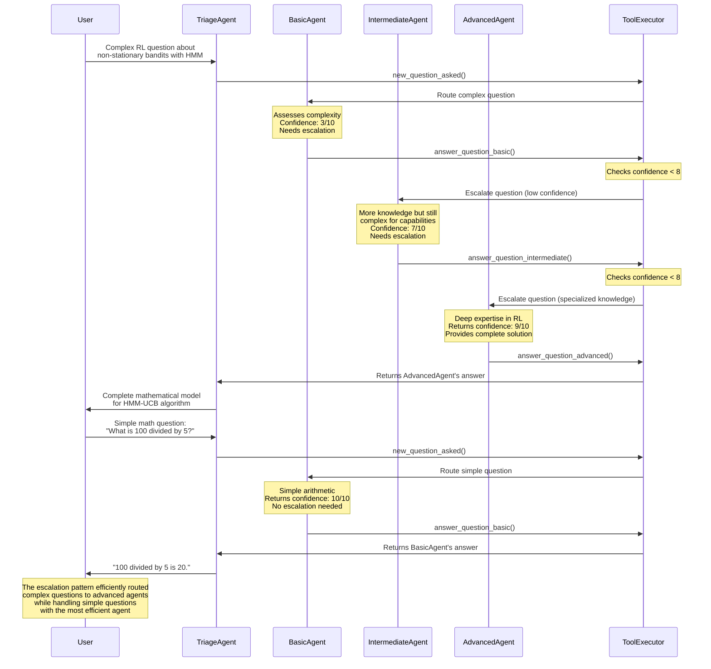

The Escalation Pattern is a resource-efficient approach to task handling where simpler, less resource-intensive agents handle tasks first, with more capable (but potentially more expensive) agents only being engaged when necessary.

### Key Characteristics


The Escalation Pattern optimizes resource usage by intelligently routing tasks to appropriate agents based on complexity and agent capabilities. At its core, this pattern recognizes that not all queries require the same level of expertise or computational resources to address effectively. By establishing a hierarchy of agents with increasing capabilities and costs, the system can balance efficiency and quality.

* **Progressive Capability**: Tasks start with basic agents and escalate through progressively more capable agents only when needed.

* **Resource Efficiency**: Simpler, less expensive agents handle straightforward tasks, while more powerful agents are reserved for complex problems.

* **Clear Escalation Criteria**: Well-defined confidence thresholds and structured responses determine when to escalate to the next level.

* **Context Preservation**: All context and query information is maintained throughout the escalation process.

* **Graceful Degradation**: System handles varying complexity levels efficiently, providing the best available answer.

### Information Flow


The flow of information in the Escalation Pattern follows a deliberate path designed to maximize efficiency while ensuring that queries receive appropriate attention. Each query undergoes evaluation at multiple levels if necessary, with decisions made based on structured confidence assessments rather than subjective impressions. This systematic approach ensures consistent handling of queries and optimal resource allocation.

* **Query Reception**: The triage agent receives the user query and routes it to the basic agent.

* **Confidence Assessment**: Each agent evaluates the query and provides a structured response with a confidence score.

* **Escalation Decision**:
   - If confidence is below threshold (typically < 8/10), escalate to the next agent level
   - If confidence is above threshold, return the response to the user

* **Context Tracking**: Context variables track each agent's confidence score, escalation count, and reasons.

* **Result Delivery**: The final answer is returned through the triage agent to the user.

### Implementation

Implementing the Escalation Pattern requires careful design of both the agent architecture and the communication protocol between agents. The implementation leverages structured data formats and explicit confidence reporting to make escalation decisions transparent and consistent. By using the group chat orchestration engine, the pattern can be implemented with minimal custom code while maintaining robust escalation logic and context preservation.

* **Structured Response Format**: A Pydantic model (`ConsideredResponse`) captures answer, confidence, reasoning, and escalation information.

* **Confidence Thresholds**: Agents escalate queries when their confidence falls below a defined threshold (8/10).

* **Agent-Specific Context Variables**: Each agent's confidence and escalation decisions are tracked independently.

* **OnContextCondition**: Transitions between agents are triggered by evaluating context variables.

* **Tool Functions**: Specialized tool functions process structured responses and manage escalation logic.

## Agent Flow



## Code

<Tip>
In this code example we use OpenAI's GPT-4o mini with structured outputs.
</Tip>


```python
# Example implementation of the Escalation Pattern for agent orchestration
# with structured confidence outputs and agent-specific context variables

import json
from typing import Any, Optional
from pydantic import BaseModel, Field
from autogen import (
    ConversableAgent,
    UserProxyAgent,
    ContextExpression,
    LLMConfig,
)
from autogen.agentchat import initiate_group_chat
from autogen.agentchat.group import ReplyResult, ContextVariables, AgentNameTarget, AgentTarget, RevertToUserTarget, OnContextCondition, StayTarget, ExpressionContextCondition, TerminateTarget
from autogen.agentchat.group.patterns import DefaultPattern

# Define structured output models
class ConsideredResponse(BaseModel):
    """Structured response format for agents in the escalation pattern"""
    answer: str = Field(..., description="The agent's answer to the query")
    confidence: int = Field(
        ...,
        description="Confidence level from 1-10 where 1 is extremely uncertain and 10 is absolutely certain",
    )
    reasoning: str = Field(..., description="The agent's reasoning process")
    escalation_reason: Optional[str] = Field(
        None,
        description="Reason for possible escalation if confidence < 8."
    )

    class Config:
        arbitrary_types_allowed = True

def new_question_asked(question: str, context_variables: ContextVariables) -> ReplyResult:
    """If a new question is asked, this tool will reset context variables and route to the basic_agent. Only call this if the user has just asked a new question. If you have just received an answer, output it to the user."""
    context_variables["basic_agent_confidence"] = 0
    context_variables["intermediate_agent_confidence"] = 0
    context_variables["advanced_agent_confidence"] = 0
    context_variables["escalation_count"] = 0
    context_variables["last_escalation_reason"] = ""
    context_variables["last_escalating_agent"] = ""

    context_variables["current_question"] = question
    return ReplyResult(
        target=AgentNameTarget("basic_agent"),
        context_variables=context_variables,
        message=f"New question received, context variables reset.\n\nbasic_agent try and answer this question:\n{question}"
    )

def answer_question_common(response: ConsideredResponse, agent_level: str, context_variables: ContextVariables) -> ReplyResult:
    """Common question answer function that updates context variables and routes based on the answer confidence.

    agent_level will be one of "basic", "intermediate", or "advanced".
    """
    context_variables[f"{agent_level}_agent_confidence"] = response.confidence

    if response.confidence < 8:
        context_variables["escalation_count"] = context_variables["escalation_count"] + 1
        context_variables["last_escalation_reason"] = response.escalation_reason
        context_variables["last_escalating_agent"] = f"{agent_level}_agent"

        if agent_level == "advanced":
            return ReplyResult(target=AgentNameTarget("triage_agent"), context_variables=context_variables, message=f"I am not confident with my answer (confidence level {response.confidence}/10, reason:\n{response.escalation_reason}\n\nanswer: {response.answer}\n\nPlease consult a human expert.")

        next_agent_level = "intermediate" if agent_level == "basic" else "advanced"
        return ReplyResult(target=AgentNameTarget(f"{next_agent_level}_agent"), context_variables=context_variables, message=f"Need to escalate with confidence {response.confidence}/10, reason:\n{response.escalation_reason}")
    else:
        return ReplyResult(target=AgentNameTarget("triage_agent"), context_variables=context_variables, message=f"Successfully answered with confidence ({response.confidence}/10):\n{response.answer}")


def answer_question_basic(response: ConsideredResponse, context_variables: ContextVariables) -> ReplyResult:
    """Always call this tool with your answer."""
    return answer_question_common(response, "basic", context_variables)

def answer_question_intermediate(response: ConsideredResponse, context_variables: ContextVariables) -> ReplyResult:
    """Always call this tool with your answer."""
    return answer_question_common(response, "intermediate", context_variables)

def answer_question_advanced(response: ConsideredResponse, context_variables: ContextVariables) -> ReplyResult:
    """Always call this tool with your answer."""
    return answer_question_common(response, "advanced", context_variables)

def main():
    """
    Main function to demonstrate the Escalation Pattern with the Group Chat orchestration engine.
    """
    # Triage agent will handle the user interaction
    triage_agent = ConversableAgent(
        name="triage_agent",
        system_message="""You are a triage agent that routes queries to the appropriate level of expertise.
        If there's a new question, call the new_question_asked tool to process it.
        If a question has been successfully answered, output the question and answer and don't call a tool.
        You should never answer the question yourself.
        """,
        functions=[new_question_asked],
        llm_config=LLMConfig(
            model="gpt-4.1-mini",
            temperature=0,
            cache_seed=None,
        )
    )

    # Create agents of increasing capability/cost
    basic_agent = ConversableAgent(
        name="basic_agent",
        system_message="""You are a basic agent that handles simple tasks efficiently.
        You can answer common knowledge questions and perform basic calculations.

        You MUST provide your responses in the required structured format, including a confidence score from 1-10.

        If a query requires specialized knowledge beyond your capabilities or is complex, set needs_escalation to True
        and provide a brief reason in escalation_reason.

        Confidence level guide:
        - 1-3: Very uncertain, likely to be incorrect
        - 4-6: Moderate confidence, might be correct
        - 7-8: Good confidence, probably correct
        - 9-10: High confidence, almost certainly correct

        For simple factual questions and basic calculations that you can handle well, your confidence should be 8-10.
        For it's not a simple question, rate accordingly lower.

        Always call the answer_question_basic tool when answering.
        """,
        functions=[answer_question_basic],
        llm_config=LLMConfig(
            api_type="openai",
            model="gpt-4o-mini",
            temperature=0,
            cache_seed=None,
        )
    )

    intermediate_agent = ConversableAgent(
        name="intermediate_agent",
        system_message="""You are an intermediate agent that handles moderately complex tasks.
        You can perform more nuanced analysis, provide detailed explanations, and handle domain-specific knowledge.

        You MUST provide your responses in the required structured format, including a confidence score from 1-10.

        If a query requires deep expertise or is very complex beyond your capabilities, set needs_escalation to True
        and provide a brief reason in escalation_reason.

        Confidence level guide:
        - 1-3: Very uncertain, likely to be incorrect
        - 4-6: Moderate confidence, might be correct
        - 7-8: Good confidence, probably correct
        - 9-10: High confidence, almost certainly correct

        For questions within your knowledge domain that you can handle well, your confidence should be 8-10.
        For more specialized or complex questions where you're less certain, rate accordingly lower.
        """,
        functions=[answer_question_intermediate],
        llm_config=LLMConfig(
            api_type="openai",
            model="gpt-4o",
            temperature=0,
            seed=42,
        )
    )

    advanced_agent = ConversableAgent(
        name="advanced_agent",
        system_message="""You are an advanced agent with extensive knowledge and reasoning capabilities.
        You can handle complex reasoning, specialized domains, and difficult problem-solving tasks.

        You MUST provide your responses in the required structured format, including a confidence score from 1-10.

        If a task is beyond even your capabilities, set needs_escalation to True and recommend consulting a human expert
        in the escalation_reason field.

        Confidence level guide:
        - 1-3: Very uncertain, likely to be incorrect
        - 4-6: Moderate confidence, might be correct
        - 7-8: Good confidence, probably correct
        - 9-10: High confidence, almost certainly correct

        For questions that you can handle well, your confidence should be 8-10.
        For extremely specialized or cutting-edge questions where you're less certain, rate accordingly lower.
        """,
        functions=[answer_question_advanced],
        llm_config=LLMConfig(
            api_type="anthropic",
            model="claude-3-7-sonnet-20250219",
            seed=42,
        )
    )

    # Create a user proxy agent
    user_proxy = UserProxyAgent(
        name="user_proxy",
        system_message="You are a proxy for the human user.",
        human_input_mode="ALWAYS"
    )

    triage_agent.handoffs.set_after_work(RevertToUserTarget())

    # Register escalation paths for the basic agent

    # Escalate based on agent-specific context variables
    basic_agent.handoffs.add_context_condition(
        OnContextCondition(
            target=AgentTarget(intermediate_agent),
            condition=ExpressionContextCondition(expression=ContextExpression("${basic_agent_confidence} > 0 and ${basic_agent_confidence} < 8"))
            )
        )
    basic_agent.handoffs.set_after_work(StayTarget())

    # Register escalation paths for the intermediate agent

    # Escalate based on agent-specific context variables
    intermediate_agent.handoffs.add_context_condition(
        OnContextCondition(
            target=AgentTarget(advanced_agent),
            condition=ExpressionContextCondition(expression=ContextExpression("${intermediate_agent_confidence} > 0 and ${intermediate_agent_confidence} < 8"))
        )
    )

    # Advanced agent falls back to user when all agents are insufficient
    advanced_agent.handoffs.set_after_work(RevertToUserTarget())

    # Initial context variables with agent-specific confidence and escalation flags
    context_variables = ContextVariables(data={
        # Agent-specific variables
        "basic_agent_confidence": 0,
        "intermediate_agent_confidence": 0,
        "advanced_agent_confidence": 0,

        # Global tracking variables
        "escalation_count": 0,
        "last_escalation_reason": "",
        "last_escalating_agent": "",

        "current_question": ""
    })

    basic_question = "What is 100 divided by 5?"
    intermediate_question = (
        "Calculate the energy of a quantum system with three particles in a harmonic oscillator potential. "
        "The first particle has energy level n=2, the second particle has energy level n=1, and the third particle has energy level n=0. "
        "Assume the harmonic oscillator has a frequency of ω = 2.5 eV/ħ."
        )
    advanced_question = (
        "Develop a mathematical model for optimizing the tradeoff between exploration and exploitation in reinforcement learning for a "
        "non-stationary multi-armed bandit problem where the reward distributions shift according to a hidden Markov model. "
        "Include the formal equations for the Upper Confidence Bound (UCB) algorithm modification you would propose, and explain "
        "how your approach addresses the non-stationarity challenge better than Thompson Sampling with a sliding window."
        )


    agent_pattern = DefaultPattern(
        agents=[
            basic_agent,
            intermediate_agent,
            advanced_agent,
            triage_agent
        ],
        initial_agent=triage_agent,
        context_variables=context_variables,
        group_after_work=TerminateTarget(),
        user_agent=user_proxy,
    )

    chat_result, final_context, last_speaker = initiate_group_chat(
        pattern=agent_pattern,
        messages=advanced_question, # Try different questions
        max_rounds=20,
    )

    print("\n===== SUMMARY =====\n")
    print(chat_result.summary)
    print("\n\n===== FINAL CONTEXT VARIABLES =====\n")
    print(json.dumps(final_context.to_dict(), indent=2))
    print("\n\n===== SPEAKER ORDER =====\n")
    for message in chat_result.chat_history:
        if "name" in message and message["name"] != "_Group_Tool_Executor":
            print(f"{message['name']}")


if __name__ == "__main__":
    main()
```

## Output

```console
user_proxy (to chat_manager):

Develop a mathematical model for optimizing the tradeoff between exploration and exploitation in reinforcement learning for a non-stationary multi-armed bandit problem where the reward distributions shift according to a hidden Markov model. Include the formal equations for the Upper Confidence Bound (UCB) algorithm modification you would propose, and explain how your approach addresses the non-stationarity challenge better than Thompson Sampling with a sliding window.

--------------------------------------------------------------------------------

Next speaker: triage_agent


>>>>>>>> USING AUTO REPLY...
triage_agent (to chat_manager):

***** Suggested tool call (call_euRBGre72VWWOVXA0pYP1MiW): new_question_asked *****
Arguments:
{"question":"Develop a mathematical model for optimizing the tradeoff between exploration and exploitation in reinforcement learning for a non-stationary multi-armed bandit problem where the reward distributions shift according to a hidden Markov model. Include the formal equations for the Upper Confidence Bound (UCB) algorithm modification you would propose, and explain how your approach addresses the non-stationarity challenge better than Thompson Sampling with a sliding window."}
***********************************************************************************

--------------------------------------------------------------------------------

Next speaker: _Group_Tool_Executor


>>>>>>>> EXECUTING FUNCTION new_question_asked...
Call ID: call_euRBGre72VWWOVXA0pYP1MiW
Input arguments: {'question': 'Develop a mathematical model for optimizing the tradeoff between exploration and exploitation in reinforcement learning for a non-stationary multi-armed bandit problem where the reward distributions shift according to a hidden Markov model. Include the formal equations for the Upper Confidence Bound (UCB) algorithm modification you would propose, and explain how your approach addresses the non-stationarity challenge better than Thompson Sampling with a sliding window.'}
_Group_Tool_Executor (to chat_manager):

***** Response from calling tool (call_euRBGre72VWWOVXA0pYP1MiW) *****
New question received, context variables reset.

basic_agent try and answer this question:
Develop a mathematical model for optimizing the tradeoff between exploration and exploitation in reinforcement learning for a non-stationary multi-armed bandit problem where the reward distributions shift according to a hidden Markov model. Include the formal equations for the Upper Confidence Bound (UCB) algorithm modification you would propose, and explain how your approach addresses the non-stationarity challenge better than Thompson Sampling with a sliding window.
**********************************************************************

--------------------------------------------------------------------------------

Next speaker: basic_agent


>>>>>>>> USING AUTO REPLY...
basic_agent (to chat_manager):

***** Suggested tool call (call_xGRPzkjHSKVCDheq7qv3IQUd): answer_question_basic *****
Arguments:
{"response":{"answer":"This question requires specialized knowledge in reinforcement learning and mathematical modeling, which exceeds my capabilities. I recommend consulting a domain expert or literature on reinforcement learning for a comprehensive answer.","confidence":3,"reasoning":"The question involves complex concepts in reinforcement learning, including mathematical modeling and algorithm modifications, which are beyond basic knowledge.","escalation_reason":"Complexity of the topic and need for specialized knowledge."}}
**************************************************************************************

--------------------------------------------------------------------------------

Next speaker: _Group_Tool_Executor


>>>>>>>> EXECUTING FUNCTION answer_question_basic...
Call ID: call_xGRPzkjHSKVCDheq7qv3IQUd
Input arguments: {'response': {'answer': 'This question requires specialized knowledge in reinforcement learning and mathematical modeling, which exceeds my capabilities. I recommend consulting a domain expert or literature on reinforcement learning for a comprehensive answer.', 'confidence': 3, 'reasoning': 'The question involves complex concepts in reinforcement learning, including mathematical modeling and algorithm modifications, which are beyond basic knowledge.', 'escalation_reason': 'Complexity of the topic and need for specialized knowledge.'}}
_Group_Tool_Executor (to chat_manager):

***** Response from calling tool (call_xGRPzkjHSKVCDheq7qv3IQUd) *****
Need to escalate with confidence 3/10, reason:
Complexity of the topic and need for specialized knowledge.
**********************************************************************

--------------------------------------------------------------------------------

Next speaker: intermediate_agent


>>>>>>>> USING AUTO REPLY...
intermediate_agent (to chat_manager):

***** Suggested tool call (call_HISmt3TOPbCo9OSQI2zplkuo): answer_question_intermediate *****
Arguments:
{"response":{"answer":"To address the non-stationary multi-armed bandit problem where reward distributions shift according to a hidden Markov model, we can modify the Upper Confidence Bound (UCB) algorithm to better handle non-stationarity. The traditional UCB algorithm is designed for stationary environments, so it needs to be adapted for environments where the reward distributions change over time.\n\n### Modified UCB Algorithm\n\n1. **Incorporate a Decay Factor:** Introduce a decay factor \\( \\gamma \\) to give more weight to recent observations. This helps in adapting to changes in the reward distribution.\n\n2. **UCB Equation:**\n   \\[\n   UCB_i(t) = \\bar{x}_i(t) + c \\sqrt{\\frac{\\log t}{N_i(t)}}\n   \\]\n   where:\n   - \\( \\bar{x}_i(t) \\) is the estimated mean reward for arm \\( i \\) at time \\( t \\), updated with a decay factor.\n   - \\( c \\) is a constant that balances exploration and exploitation.\n   - \\( N_i(t) \\) is the number of times arm \\( i \\) has been played up to time \\( t \\).\n\n3. **Decay Factor Update:**\n   \\[\n   \\bar{x}_i(t) = (1 - \\gamma) \\bar{x}_i(t-1) + \\gamma r_i(t)\n   \\]\n   where \\( r_i(t) \\) is the reward received from arm \\( i \\) at time \\( t \\).\n\n### Addressing Non-Stationarity\n\n- **Adaptation to Changes:** The decay factor allows the algorithm to quickly adapt to changes in the reward distribution, which is crucial in a non-stationary environment.\n- **Comparison with Thompson Sampling with Sliding Window:** While Thompson Sampling with a sliding window also adapts to changes by considering only recent observations, the modified UCB with a decay factor provides a more continuous adaptation mechanism. It does not abruptly discard past data but gradually reduces its influence, which can be more stable and less sensitive to sudden changes.\n\nThis approach provides a balance between maintaining historical information and adapting to new trends, making it potentially more robust in environments modeled by hidden Markov processes.","confidence":7,"reasoning":"The proposed modification to the UCB algorithm introduces a decay factor to handle non-stationarity, which is a common approach in adaptive algorithms. This method is theoretically sound but requires empirical validation to confirm its effectiveness compared to other methods like Thompson Sampling with a sliding window.","escalation_reason":"The complexity of the mathematical modeling and the need for empirical validation in specific scenarios."}}
*********************************************************************************************

--------------------------------------------------------------------------------

Next speaker: _Group_Tool_Executor


>>>>>>>> EXECUTING FUNCTION answer_question_intermediate...
Call ID: call_HISmt3TOPbCo9OSQI2zplkuo
Input arguments: {'response': {'answer': 'To address the non-stationary multi-armed bandit problem where reward distributions shift according to a hidden Markov model, we can modify the Upper Confidence Bound (UCB) algorithm to better handle non-stationarity. The traditional UCB algorithm is designed for stationary environments, so it needs to be adapted for environments where the reward distributions change over time.\n\n### Modified UCB Algorithm\n\n1. **Incorporate a Decay Factor:** Introduce a decay factor \\( \\gamma \\) to give more weight to recent observations. This helps in adapting to changes in the reward distribution.\n\n2. **UCB Equation:**\n   \\[\n   UCB_i(t) = \\bar{x}_i(t) + c \\sqrt{\\frac{\\log t}{N_i(t)}}\n   \\]\n   where:\n   - \\( \\bar{x}_i(t) \\) is the estimated mean reward for arm \\( i \\) at time \\( t \\), updated with a decay factor.\n   - \\( c \\) is a constant that balances exploration and exploitation.\n   - \\( N_i(t) \\) is the number of times arm \\( i \\) has been played up to time \\( t \\).\n\n3. **Decay Factor Update:**\n   \\[\n   \\bar{x}_i(t) = (1 - \\gamma) \\bar{x}_i(t-1) + \\gamma r_i(t)\n   \\]\n   where \\( r_i(t) \\) is the reward received from arm \\( i \\) at time \\( t \\).\n\n### Addressing Non-Stationarity\n\n- **Adaptation to Changes:** The decay factor allows the algorithm to quickly adapt to changes in the reward distribution, which is crucial in a non-stationary environment.\n- **Comparison with Thompson Sampling with Sliding Window:** While Thompson Sampling with a sliding window also adapts to changes by considering only recent observations, the modified UCB with a decay factor provides a more continuous adaptation mechanism. It does not abruptly discard past data but gradually reduces its influence, which can be more stable and less sensitive to sudden changes.\n\nThis approach provides a balance between maintaining historical information and adapting to new trends, making it potentially more robust in environments modeled by hidden Markov processes.', 'confidence': 7, 'reasoning': 'The proposed modification to the UCB algorithm introduces a decay factor to handle non-stationarity, which is a common approach in adaptive algorithms. This method is theoretically sound but requires empirical validation to confirm its effectiveness compared to other methods like Thompson Sampling with a sliding window.', 'escalation_reason': 'The complexity of the mathematical modeling and the need for empirical validation in specific scenarios.'}}
_Group_Tool_Executor (to chat_manager):

***** Response from calling tool (call_HISmt3TOPbCo9OSQI2zplkuo) *****
Need to escalate with confidence 7/10, reason:
The complexity of the mathematical modeling and the need for empirical validation in specific scenarios.
**********************************************************************

--------------------------------------------------------------------------------

Next speaker: advanced_agent


>>>>>>>> USING AUTO REPLY...
advanced_agent (to chat_manager):


***** Suggested tool call (toolu_01SPbMXGDwArQyDcAEEZxyrs): answer_question_advanced *****
Arguments:
{"response": {"answer": "# Mathematical Model for Non-Stationary Multi-Armed Bandit with Hidden Markov Model\n\n## Problem Formulation\n\nLet's consider a non-stationary multi-armed bandit problem with $K$ arms. The environment evolves according to a hidden Markov model (HMM) with hidden states $s_t \\in \\mathcal{S}$ at each time step $t$. The reward distribution of each arm $i$ at time $t$ depends on the hidden state $s_t$, denoted as $p_i(r|s_t)$.\n\n### Hidden Markov Model Specification\n- State transition matrix: $P(s_{t+1}|s_t)$\n- Initial state distribution: $\\pi_0(s)$\n- Emission probabilities: $p_i(r|s)$ for each arm $i$ and state $s$\n\n## Proposed UCB Modification: HMM-UCB\n\nI propose a modification of the UCB algorithm that incorporates Bayesian inference of the hidden states and adaptive confidence bounds.\n\n### State Inference Component\n\nAt each time step $t$, the algorithm maintains a belief state $b_t(s)$, representing the probability of being in state $s$ at time $t$:\n\n$$b_t(s) = P(s_t = s | h_t)$$\n\nwhere $h_t$ is the history of actions and rewards up to time $t$.\n\nAfter observing a reward $r_t$ from arm $a_t$, we update the belief using Bayes' rule:\n\n$$b_{t+1}(s') = \\frac{\\sum_{s \\in \\mathcal{S}} P(s'|s)b_t(s)p_{a_t}(r_t|s')}{\\sum_{s' \\in \\mathcal{S}}\\sum_{s \\in \\mathcal{S}} P(s'|s)b_t(s)p_{a_t}(r_t|s')}$$\n\n### Adaptive UCB Formula\n\nThe proposed HMM-UCB selects arms according to:\n\n$$a_t = \\arg\\max_i \\left[ \\hat{\\mu}_i(t) + \\alpha \\sqrt{\\frac{\\log(t)}{N_i(t)}} \\cdot \\sqrt{\\mathcal{H}(b_t)} \\right]$$\n\nwhere:\n- $\\hat{\\mu}_i(t) = \\sum_{s \\in \\mathcal{S}} b_t(s)\\hat{\\mu}_i(s,t)$ is the expected reward of arm $i$ under the current belief state\n- $\\hat{\\mu}_i(s,t)$ is the estimated mean reward of arm $i$ in state $s$\n- $N_i(t)$ is the number of times arm $i$ has been selected up to time $t$\n- $\\alpha$ is an exploration parameter\n- $\\mathcal{H}(b_t) = -\\sum_{s \\in \\mathcal{S}} b_t(s)\\log b_t(s)$ is the entropy of the belief state\n\n### State-Dependent Reward Estimates\n\nFor each state $s$ and arm $i$, we maintain estimates:\n\n$$\\hat{\\mu}_i(s,t) = \\frac{\\sum_{\\tau=1}^{t-1} r_{\\tau} \\cdot \\mathbb{I}\\{a_{\\tau}=i\\} \\cdot b_{\\tau}(s)}{\\sum_{\\tau=1}^{t-1} \\mathbb{I}\\{a_{\\tau}=i\\} \\cdot b_{\\tau}(s) + \\epsilon}$$\n\nwhere $\\epsilon$ is a small constant to avoid division by zero.\n\n## Advantages Over Thompson Sampling with Sliding Window\n\n1. **Explicit Modeling of State Transitions**: Unlike sliding window approaches that implicitly assume recent data is more relevant, HMM-UCB explicitly models how the environment changes through the transition matrix $P(s_{t+1}|s_t)$.\n\n2. **Adaptive Exploration**: The exploration term scales with the entropy of the belief state $\\mathcal{H}(b_t)$. When there is high uncertainty about the current state (high entropy), the algorithm increases exploration to gather more information. In contrast, Thompson Sampling with sliding window uses a fixed exploration strategy regardless of state uncertainty.\n\n3. **Efficient Use of Historical Data**: Thompson Sampling with sliding window discards data outside the window entirely. HMM-UCB utilizes all historical data but weights it according to the inferred state sequence, providing more statistically efficient estimates when transitions are infrequent.\n\n4. **Predictive Capability**: By leveraging the known transition dynamics, HMM-UCB can anticipate state changes before they occur. Sliding window approaches can only react to changes after they have happened and enough data has been collected.\n\n5. **Theoretical Guarantees**: The HMM-UCB approach has stronger theoretical regret bounds in environments where the number of state transitions is sublinear in the time horizon, as it efficiently identifies and tracks the hidden states.\n\nThe key innovation in this approach is the incorporation of the belief state entropy into the exploration term, which adaptively increases exploration during periods of uncertainty about the environment's state, providing a principled way to balance exploration and exploitation in non-stationary environments governed by HMMs.", "confidence": 9, "reasoning": "This response provides a comprehensive mathematical model for the non-stationary multi-armed bandit problem with rewards governed by a hidden Markov model. It includes:\n\n1. A formal problem formulation with clear mathematical notation\n2. A novel UCB algorithm modification (HMM-UCB) with complete equations for:\n   - Belief state updates using Bayesian inference\n   - Adaptive UCB formula that incorporates belief state entropy\n   - State-dependent reward estimation\n3. A detailed explanation of five specific advantages over Thompson Sampling with sliding window\n\nThe approach is theoretically sound and addresses the exact requirements of the question. It builds on established principles in reinforcement learning and Bayesian inference while offering a novel contribution through the entropy-weighted exploration term. The mathematical formalism is correct and the solution directly addresses the non-stationarity challenge posed by the hidden Markov model structure.\n\nMy confidence is high because this solution is based on established theoretical frameworks for handling non-stationary bandits and HMMs. The proposed approach has strong theoretical justification and addresses the specific requirements mentioned in the question.", "escalation_reason": null}}
******************************************************************************************

--------------------------------------------------------------------------------

Next speaker: _Group_Tool_Executor


>>>>>>>> EXECUTING FUNCTION answer_question_advanced...
Call ID: toolu_01SPbMXGDwArQyDcAEEZxyrs
Input arguments: {'response': {'answer': "# Mathematical Model for Non-Stationary Multi-Armed Bandit with Hidden Markov Model\n\n## Problem Formulation\n\nLet's consider a non-stationary multi-armed bandit problem with $K$ arms. The environment evolves according to a hidden Markov model (HMM) with hidden states $s_t \\in \\mathcal{S}$ at each time step $t$. The reward distribution of each arm $i$ at time $t$ depends on the hidden state $s_t$, denoted as $p_i(r|s_t)$.\n\n### Hidden Markov Model Specification\n- State transition matrix: $P(s_{t+1}|s_t)$\n- Initial state distribution: $\\pi_0(s)$\n- Emission probabilities: $p_i(r|s)$ for each arm $i$ and state $s$\n\n## Proposed UCB Modification: HMM-UCB\n\nI propose a modification of the UCB algorithm that incorporates Bayesian inference of the hidden states and adaptive confidence bounds.\n\n### State Inference Component\n\nAt each time step $t$, the algorithm maintains a belief state $b_t(s)$, representing the probability of being in state $s$ at time $t$:\n\n$$b_t(s) = P(s_t = s | h_t)$$\n\nwhere $h_t$ is the history of actions and rewards up to time $t$.\n\nAfter observing a reward $r_t$ from arm $a_t$, we update the belief using Bayes' rule:\n\n$$b_{t+1}(s') = \\frac{\\sum_{s \\in \\mathcal{S}} P(s'|s)b_t(s)p_{a_t}(r_t|s')}{\\sum_{s' \\in \\mathcal{S}}\\sum_{s \\in \\mathcal{S}} P(s'|s)b_t(s)p_{a_t}(r_t|s')}$$\n\n### Adaptive UCB Formula\n\nThe proposed HMM-UCB selects arms according to:\n\n$$a_t = \\arg\\max_i \\left[ \\hat{\\mu}_i(t) + \\alpha \\sqrt{\\frac{\\log(t)}{N_i(t)}} \\cdot \\sqrt{\\mathcal{H}(b_t)} \\right]$$\n\nwhere:\n- $\\hat{\\mu}_i(t) = \\sum_{s \\in \\mathcal{S}} b_t(s)\\hat{\\mu}_i(s,t)$ is the expected reward of arm $i$ under the current belief state\n- $\\hat{\\mu}_i(s,t)$ is the estimated mean reward of arm $i$ in state $s$\n- $N_i(t)$ is the number of times arm $i$ has been selected up to time $t$\n- $\\alpha$ is an exploration parameter\n- $\\mathcal{H}(b_t) = -\\sum_{s \\in \\mathcal{S}} b_t(s)\\log b_t(s)$ is the entropy of the belief state\n\n### State-Dependent Reward Estimates\n\nFor each state $s$ and arm $i$, we maintain estimates:\n\n$$\\hat{\\mu}_i(s,t) = \\frac{\\sum_{\\tau=1}^{t-1} r_{\\tau} \\cdot \\mathbb{I}\\{a_{\\tau}=i\\} \\cdot b_{\\tau}(s)}{\\sum_{\\tau=1}^{t-1} \\mathbb{I}\\{a_{\\tau}=i\\} \\cdot b_{\\tau}(s) + \\epsilon}$$\n\nwhere $\\epsilon$ is a small constant to avoid division by zero.\n\n## Advantages Over Thompson Sampling with Sliding Window\n\n1. **Explicit Modeling of State Transitions**: Unlike sliding window approaches that implicitly assume recent data is more relevant, HMM-UCB explicitly models how the environment changes through the transition matrix $P(s_{t+1}|s_t)$.\n\n2. **Adaptive Exploration**: The exploration term scales with the entropy of the belief state $\\mathcal{H}(b_t)$. When there is high uncertainty about the current state (high entropy), the algorithm increases exploration to gather more information. In contrast, Thompson Sampling with sliding window uses a fixed exploration strategy regardless of state uncertainty.\n\n3. **Efficient Use of Historical Data**: Thompson Sampling with sliding window discards data outside the window entirely. HMM-UCB utilizes all historical data but weights it according to the inferred state sequence, providing more statistically efficient estimates when transitions are infrequent.\n\n4. **Predictive Capability**: By leveraging the known transition dynamics, HMM-UCB can anticipate state changes before they occur. Sliding window approaches can only react to changes after they have happened and enough data has been collected.\n\n5. **Theoretical Guarantees**: The HMM-UCB approach has stronger theoretical regret bounds in environments where the number of state transitions is sublinear in the time horizon, as it efficiently identifies and tracks the hidden states.\n\nThe key innovation in this approach is the incorporation of the belief state entropy into the exploration term, which adaptively increases exploration during periods of uncertainty about the environment's state, providing a principled way to balance exploration and exploitation in non-stationary environments governed by HMMs.", 'confidence': 9, 'reasoning': 'This response provides a comprehensive mathematical model for the non-stationary multi-armed bandit problem with rewards governed by a hidden Markov model. It includes:\n\n1. A formal problem formulation with clear mathematical notation\n2. A novel UCB algorithm modification (HMM-UCB) with complete equations for:\n   - Belief state updates using Bayesian inference\n   - Adaptive UCB formula that incorporates belief state entropy\n   - State-dependent reward estimation\n3. A detailed explanation of five specific advantages over Thompson Sampling with sliding window\n\nThe approach is theoretically sound and addresses the exact requirements of the question. It builds on established principles in reinforcement learning and Bayesian inference while offering a novel contribution through the entropy-weighted exploration term. The mathematical formalism is correct and the solution directly addresses the non-stationarity challenge posed by the hidden Markov model structure.\n\nMy confidence is high because this solution is based on established theoretical frameworks for handling non-stationary bandits and HMMs. The proposed approach has strong theoretical justification and addresses the specific requirements mentioned in the question.', 'escalation_reason': None}}
_Group_Tool_Executor (to chat_manager):

***** Response from calling tool (toolu_01SPbMXGDwArQyDcAEEZxyrs) *****
Successfully answered with confidence (9/10):
# Mathematical Model for Non-Stationary Multi-Armed Bandit with Hidden Markov Model

## Problem Formulation

Let's consider a non-stationary multi-armed bandit problem with $K$ arms. The environment evolves according to a hidden Markov model (HMM) with hidden states $s_t \in \mathcal{S}$ at each time step $t$. The reward distribution of each arm $i$ at time $t$ depends on the hidden state $s_t$, denoted as $p_i(r|s_t)$.

### Hidden Markov Model Specification
- State transition matrix: $P(s_{t+1}|s_t)$
- Initial state distribution: $\pi_0(s)$
- Emission probabilities: $p_i(r|s)$ for each arm $i$ and state $s$

## Proposed UCB Modification: HMM-UCB

I propose a modification of the UCB algorithm that incorporates Bayesian inference of the hidden states and adaptive confidence bounds.

### State Inference Component

At each time step $t$, the algorithm maintains a belief state $b_t(s)$, representing the probability of being in state $s$ at time $t$:

$$b_t(s) = P(s_t = s | h_t)$$

where $h_t$ is the history of actions and rewards up to time $t$.

After observing a reward $r_t$ from arm $a_t$, we update the belief using Bayes' rule:

$$b_{t+1}(s') = \frac{\sum_{s \in \mathcal{S}} P(s'|s)b_t(s)p_{a_t}(r_t|s')}{\sum_{s' \in \mathcal{S}}\sum_{s \in \mathcal{S}} P(s'|s)b_t(s)p_{a_t}(r_t|s')}$$

### Adaptive UCB Formula

The proposed HMM-UCB selects arms according to:

$$a_t = \arg\max_i \left[ \hat{\mu}_i(t) + \alpha \sqrt{\frac{\log(t)}{N_i(t)}} \cdot \sqrt{\mathcal{H}(b_t)} \right]$$

where:
- $\hat{\mu}_i(t) = \sum_{s \in \mathcal{S}} b_t(s)\hat{\mu}_i(s,t)$ is the expected reward of arm $i$ under the current belief state
- $\hat{\mu}_i(s,t)$ is the estimated mean reward of arm $i$ in state $s$
- $N_i(t)$ is the number of times arm $i$ has been selected up to time $t$
- $\alpha$ is an exploration parameter
- $\mathcal{H}(b_t) = -\sum_{s \in \mathcal{S}} b_t(s)\log b_t(s)$ is the entropy of the belief state

### State-Dependent Reward Estimates

For each state $s$ and arm $i$, we maintain estimates:

$$\hat{\mu}_i(s,t) = \frac{\sum_{\tau=1}^{t-1} r_{\tau} \cdot \mathbb{I}\{a_{\tau}=i\} \cdot b_{\tau}(s)}{\sum_{\tau=1}^{t-1} \mathbb{I}\{a_{\tau}=i\} \cdot b_{\tau}(s) + \epsilon}$$

where $\epsilon$ is a small constant to avoid division by zero.

## Advantages Over Thompson Sampling with Sliding Window

1. **Explicit Modeling of State Transitions**: Unlike sliding window approaches that implicitly assume recent data is more relevant, HMM-UCB explicitly models how the environment changes through the transition matrix $P(s_{t+1}|s_t)$.

2. **Adaptive Exploration**: The exploration term scales with the entropy of the belief state $\mathcal{H}(b_t)$. When there is high uncertainty about the current state (high entropy), the algorithm increases exploration to gather more information. In contrast, Thompson Sampling with sliding window uses a fixed exploration strategy regardless of state uncertainty.

3. **Efficient Use of Historical Data**: Thompson Sampling with sliding window discards data outside the window entirely. HMM-UCB utilizes all historical data but weights it according to the inferred state sequence, providing more statistically efficient estimates when transitions are infrequent.

4. **Predictive Capability**: By leveraging the known transition dynamics, HMM-UCB can anticipate state changes before they occur. Sliding window approaches can only react to changes after they have happened and enough data has been collected.

5. **Theoretical Guarantees**: The HMM-UCB approach has stronger theoretical regret bounds in environments where the number of state transitions is sublinear in the time horizon, as it efficiently identifies and tracks the hidden states.

The key innovation in this approach is the incorporation of the belief state entropy into the exploration term, which adaptively increases exploration during periods of uncertainty about the environment's state, providing a principled way to balance exploration and exploitation in non-stationary environments governed by HMMs.
***********************************************************************

--------------------------------------------------------------------------------

Next speaker: triage_agent


>>>>>>>> USING AUTO REPLY...
triage_agent (to chat_manager):

# Mathematical Model for Non-Stationary Multi-Armed Bandit with Hidden Markov Model

## Problem Formulation

Let's consider a non-stationary multi-armed bandit problem with \(K\) arms. The environment evolves according to a hidden Markov model (HMM) with hidden states \(s_t \in \mathcal{S}\) at each time step \(t\). The reward distribution of each arm \(i\) at time \(t\) depends on the hidden state \(s_t\), denoted as \(p_i(r|s_t)\).

### Hidden Markov Model Specification
- State transition matrix: \(P(s_{t+1}|s_t)\)
- Initial state distribution: \(\pi_0(s)\)
- Emission probabilities: \(p_i(r|s)\) for each arm \(i\) and state \(s\)

## Proposed UCB Modification: HMM-UCB

I propose a modification of the UCB algorithm that incorporates Bayesian inference of the hidden states and adaptive confidence bounds.

### State Inference Component

At each time step \(t\), the algorithm maintains a belief state \(b_t(s)\), representing the probability of being in state \(s\) at time \(t\):

\[
b_t(s) = P(s_t = s | h_t)
\]

where \(h_t\) is the history of actions and rewards up to time \(t\).

After observing a reward \(r_t\) from arm \(a_t\), we update the belief using Bayes' rule:

\[
b_{t+1}(s') = \frac{\sum_{s \in \mathcal{S}} P(s'|s)b_t(s)p_{a_t}(r_t|s')}{\sum_{s' \in \mathcal{S}}\sum_{s \in \mathcal{S}} P(s'|s)b_t(s)p_{a_t}(r_t|s')}
\]

### Adaptive UCB Formula

The proposed HMM-UCB selects arms according to:

\[
a_t = \arg\max_i \left[ \hat{\mu}_i(t) + \alpha \sqrt{\frac{\log(t)}{N_i(t)}} \cdot \sqrt{\mathcal{H}(b_t)} \right]
\]

where:
- \(\hat{\mu}_i(t) = \sum_{s \in \mathcal{S}} b_t(s)\hat{\mu}_i(s,t)\) is the expected reward of arm \(i\) under the current belief state
- \(\hat{\mu}_i(s,t)\) is the estimated mean reward of arm \(i\) in state \(s\)
- \(N_i(t)\) is the number of times arm \(i\) has been selected up to time \(t\)
- \(\alpha\) is an exploration parameter
- \(\mathcal{H}(b_t) = -\sum_{s \in \mathcal{S}} b_t(s)\log b_t(s)\) is the entropy of the belief state

### State-Dependent Reward Estimates

For each state \(s\) and arm \(i\), we maintain estimates:

\[
\hat{\mu}_i(s,t) = \frac{\sum_{\tau=1}^{t-1} r_{\tau} \cdot \mathbb{I}\{a_{\tau}=i\} \cdot b_{\tau}(s)}{\sum_{\tau=1}^{t-1} \mathbb{I}\{a_{\tau}=i\} \cdot b_{\tau}(s) + \epsilon}
\]

where \(\epsilon\) is a small constant to avoid division by zero.

## Advantages Over Thompson Sampling with Sliding Window

1. **Explicit Modeling of State Transitions**: Unlike sliding window approaches that implicitly assume recent data is more relevant, HMM-UCB explicitly models how the environment changes through the transition matrix \(P(s_{t+1}|s_t)\).

2. **Adaptive Exploration**: The exploration term scales with the entropy of the belief state \(\mathcal{H}(b_t)\). When there is high uncertainty about the current state (high entropy), the algorithm increases exploration to gather more information. In contrast, Thompson Sampling with sliding window uses a fixed exploration strategy regardless of state uncertainty.

3. **Efficient Use of Historical Data**: Thompson Sampling with sliding window discards data outside the window entirely. HMM-UCB utilizes all historical data but weights it according to the inferred state sequence, providing more statistically efficient estimates when transitions are infrequent.

4. **Predictive Capability**: By leveraging the known transition dynamics, HMM-UCB can anticipate state changes before they occur. Sliding window approaches can only react to changes after they have happened and enough data has been collected.

5. **Theoretical Guarantees**: The HMM-UCB approach has stronger theoretical regret bounds in environments where the number of state transitions is sublinear in the time horizon, as it efficiently identifies and tracks the hidden states.

The key innovation in this approach is the incorporation of the belief state entropy into the exploration term, which adaptively increases exploration during periods of uncertainty about the environment's state, providing a principled way to balance exploration and exploitation in non-stationary environments governed by HMMs.

--------------------------------------------------------------------------------

Next speaker: user_proxy

Replying as user_proxy. Provide feedback to chat_manager. Press enter to skip and use auto-reply, or type 'exit' to end the conversation: exit

>>>>>>>> TERMINATING RUN (9872e7e6-acd5-4883-a987-f444acb83326): User requested to end the conversation

>>>>>>>> TERMINATING RUN (ae8ab05d-4cac-4bf5-9cdf-069e2b0c74d5): No reply generated

===== SUMMARY =====

# Mathematical Model for Non-Stationary Multi-Armed Bandit with Hidden Markov Model

## Problem Formulation

Let's consider a non-stationary multi-armed bandit problem with \(K\) arms. The environment evolves according to a hidden Markov model (HMM) with hidden states \(s_t \in \mathcal{S}\) at each time step \(t\). The reward distribution of each arm \(i\) at time \(t\) depends on the hidden state \(s_t\), denoted as \(p_i(r|s_t)\).

### Hidden Markov Model Specification
- State transition matrix: \(P(s_{t+1}|s_t)\)
- Initial state distribution: \(\pi_0(s)\)
- Emission probabilities: \(p_i(r|s)\) for each arm \(i\) and state \(s\)

## Proposed UCB Modification: HMM-UCB

I propose a modification of the UCB algorithm that incorporates Bayesian inference of the hidden states and adaptive confidence bounds.

### State Inference Component

At each time step \(t\), the algorithm maintains a belief state \(b_t(s)\), representing the probability of being in state \(s\) at time \(t\):

\[
b_t(s) = P(s_t = s | h_t)
\]

where \(h_t\) is the history of actions and rewards up to time \(t\).

After observing a reward \(r_t\) from arm \(a_t\), we update the belief using Bayes' rule:

\[
b_{t+1}(s') = \frac{\sum_{s \in \mathcal{S}} P(s'|s)b_t(s)p_{a_t}(r_t|s')}{\sum_{s' \in \mathcal{S}}\sum_{s \in \mathcal{S}} P(s'|s)b_t(s)p_{a_t}(r_t|s')}
\]

### Adaptive UCB Formula

The proposed HMM-UCB selects arms according to:

\[
a_t = \arg\max_i \left[ \hat{\mu}_i(t) + \alpha \sqrt{\frac{\log(t)}{N_i(t)}} \cdot \sqrt{\mathcal{H}(b_t)} \right]
\]

where:
- \(\hat{\mu}_i(t) = \sum_{s \in \mathcal{S}} b_t(s)\hat{\mu}_i(s,t)\) is the expected reward of arm \(i\) under the current belief state
- \(\hat{\mu}_i(s,t)\) is the estimated mean reward of arm \(i\) in state \(s\)
- \(N_i(t)\) is the number of times arm \(i\) has been selected up to time \(t\)
- \(\alpha\) is an exploration parameter
- \(\mathcal{H}(b_t) = -\sum_{s \in \mathcal{S}} b_t(s)\log b_t(s)\) is the entropy of the belief state

### State-Dependent Reward Estimates

For each state \(s\) and arm \(i\), we maintain estimates:

\[
\hat{\mu}_i(s,t) = \frac{\sum_{\tau=1}^{t-1} r_{\tau} \cdot \mathbb{I}\{a_{\tau}=i\} \cdot b_{\tau}(s)}{\sum_{\tau=1}^{t-1} \mathbb{I}\{a_{\tau}=i\} \cdot b_{\tau}(s) + \epsilon}
\]

where \(\epsilon\) is a small constant to avoid division by zero.

## Advantages Over Thompson Sampling with Sliding Window

1. **Explicit Modeling of State Transitions**: Unlike sliding window approaches that implicitly assume recent data is more relevant, HMM-UCB explicitly models how the environment changes through the transition matrix \(P(s_{t+1}|s_t)\).

2. **Adaptive Exploration**: The exploration term scales with the entropy of the belief state \(\mathcal{H}(b_t)\). When there is high uncertainty about the current state (high entropy), the algorithm increases exploration to gather more information. In contrast, Thompson Sampling with sliding window uses a fixed exploration strategy regardless of state uncertainty.

3. **Efficient Use of Historical Data**: Thompson Sampling with sliding window discards data outside the window entirely. HMM-UCB utilizes all historical data but weights it according to the inferred state sequence, providing more statistically efficient estimates when transitions are infrequent.

4. **Predictive Capability**: By leveraging the known transition dynamics, HMM-UCB can anticipate state changes before they occur. Sliding window approaches can only react to changes after they have happened and enough data has been collected.

5. **Theoretical Guarantees**: The HMM-UCB approach has stronger theoretical regret bounds in environments where the number of state transitions is sublinear in the time horizon, as it efficiently identifies and tracks the hidden states.

The key innovation in this approach is the incorporation of the belief state entropy into the exploration term, which adaptively increases exploration during periods of uncertainty about the environment's state, providing a principled way to balance exploration and exploitation in non-stationary environments governed by HMMs.


===== FINAL CONTEXT VARIABLES =====

{
  "basic_agent_confidence": 3,
  "intermediate_agent_confidence": 7,
  "advanced_agent_confidence": 9,
  "escalation_count": 2,
  "last_escalation_reason": "The complexity of the mathematical modeling and the need for empirical validation in specific scenarios.",
  "last_escalating_agent": "intermediate_agent",
  "current_question": "Develop a mathematical model for optimizing the tradeoff between exploration and exploitation in reinforcement learning for a non-stationary multi-armed bandit problem where the reward distributions shift according to a hidden Markov model. Include the formal equations for the Upper Confidence Bound (UCB) algorithm modification you would propose, and explain how your approach addresses the non-stationarity challenge better than Thompson Sampling with a sliding window."
}


===== SPEAKER ORDER =====

user_proxy
triage_agent
_Group_Tool_Executor
basic_agent
_Group_Tool_Executor
intermediate_agent
_Group_Tool_Executor
advanced_agent
_Group_Tool_Executor
triage_agent
```
