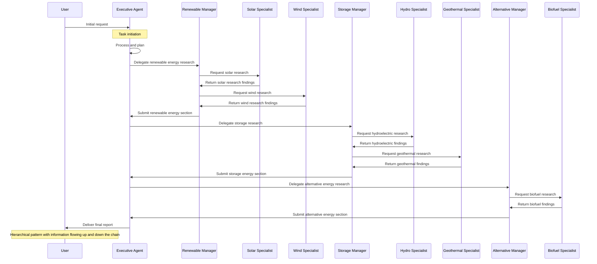

The Hierarchical, or Tree, Orchestration Pattern is a powerful approach to organizing multi-agent workflows, inspired by traditional organizational structures where work and information flow through a well-defined chain of command. This pattern creates a tree-structured arrangement of agents with clear levels of responsibility, specialization, and reporting relationships.

### Key Characteristics


The Hierarchical Pattern establishes distinct agent roles across three primary levels:

* **Executive Level** (Top): An executive agent maintains strategic oversight of the entire task. This agent breaks complex problems into logical components, delegates to appropriate domain managers, provides overall direction, and ultimately synthesizes the final output.

* **Manager Level** (Middle): Manager agents have responsibility for specific domains. Each manager breaks down their assigned component into specialized subtasks, delegates to appropriate specialists, monitors progress, provides guidance, and aggregates results before reporting back to the executive.

* **Specialist Level** (Bottom): Specialist agents possess deep expertise in narrow areas. They focus exclusively on well-defined, discrete tasks without needing to understand the entire problem context. These agents do the detailed work and report their findings back to their respective managers.

### Information Flow


The strength of this pattern comes from its structured information flow:

* **Downstream Flow**: Tasks, requirements, and context flow from the executive to managers to specialists, becoming more specialized and focused at each level.

* **Upstream Flow**: Results, findings, and completed work flow from specialists to managers to the executive, being aggregated and refined at each level.

### Implementation

In our implementation using AG2's Swarm, we've created:

* A clear hierarchy with one executive agent, three manager agents (Renewable, Storage, Alternative), and five specialist agents organized under their respective managers.

* Explicit handoffs designed around the hierarchy:
   - Context-based transitions using `OnContextCondition` for deterministic, non-LLM routing
   - LLM-based fallbacks using `OnCondition` for more complex decisions
   - Explicit `AfterWork` designations to ensure agents always report back to their supervisors

* Shared context variables to track progress at different levels, allowing for:
   - Deterministic routing based on task completion status
   - Storage of research content provided by specialists
   - Aggregation of report sections compiled by managers

* A complete workflow that follows organizational principles:
   - The executive delegates tasks to managers
   - Managers delegate to their respective specialists
   - Specialists conduct research and report back to managers
   - Managers synthesize findings into sections and report to the executive
   - The executive compiles the final report and presents it to the user

This pattern is particularly effective for complex, multi-faceted tasks where different aspects require specialized knowledge, and where the final output needs to synthesize diverse findings into a cohesive whole. The implementation demonstrates how automated agents can effectively mirror human organizational structures to tackle complex problems through division of labor and hierarchical information flow.

The hierarchical structure enables efficient cognitive division of labor - higher-level agents handle integration and context, while lower-level agents focus on specific details, resulting in a comprehensive final output that leverages the strengths of each level in the hierarchy.

## Agent Flow



## Code

<Tip>
In this code example we use OpenAI's GPT-4o mini.

We also set the LLM parameter `parallel_tool_calls` to False so that our agents don't recommend more than one tool call at a time. This parameter may not be available with all model providers.
</Tip>

```python
import json
from autogen import (
    AfterWork,
    AfterWorkOption,
    ConversableAgent,
    OnCondition,
    OnContextCondition,
    ContextExpression,
    SwarmResult,
    UserProxyAgent,
    initiate_swarm_chat,
    register_hand_off,
    LLMConfig,
)

# Example task: Research and create a comprehensive report on renewable energy technologies

# Setup LLM configuration
# Note that we turn parallel tool calling off for OpenAI so we only get one tool call at a time.
llm_config = LLMConfig(api_type="openai", model="gpt-4o-mini", parallel_tool_calls=False)

# Shared context for all agents in the swarm
shared_context = {
    # Project state
    "task_started": False,
    "task_completed": False,

    # Hierarchical state tracking
    "executive_review_ready": False,
    "manager_a_completed": False,
    "manager_b_completed": False,
    "manager_c_completed": False,

    # Specialist task tracking
    "specialist_a1_completed": False,
    "specialist_a2_completed": False,
    "specialist_b1_completed": False,
    "specialist_b2_completed": False,
    "specialist_c1_completed": False,

    # Content storage
    "solar_research": "",
    "wind_research": "",
    "hydro_research": "",
    "geothermal_research": "",
    "biofuel_research": "",
    "report_sections": {},
    "final_report": ""
}

# User agent for interaction
user = UserProxyAgent(
    name="user",
    code_execution_config=False
)

# ========================
# SPECIALIST FUNCTIONS
# ========================

def complete_solar_research(research_content: str, context_variables: dict) -> SwarmResult:
    """Submit solar energy research findings"""
    context_variables["solar_research"] = research_content
    context_variables["specialist_a1_completed"] = True

    # Check if both specialists under Manager A have completed their tasks
    if context_variables["specialist_a1_completed"] and context_variables["specialist_a2_completed"]:
        context_variables["manager_a_completed"] = True

    return SwarmResult(
        values="Solar research completed and stored.",
        context_variables=context_variables,
        agent=renewable_manager,
    )

def complete_wind_research(research_content: str, context_variables: dict) -> SwarmResult:
    """Submit wind energy research findings"""
    context_variables["wind_research"] = research_content
    context_variables["specialist_a2_completed"] = True

    # Check if both specialists under Manager A have completed their tasks
    if context_variables["specialist_a1_completed"] and context_variables["specialist_a2_completed"]:
        context_variables["manager_a_completed"] = True

    return SwarmResult(
        values="Wind research completed and stored.",
        context_variables=context_variables,
        agent=renewable_manager,
    )

def complete_hydro_research(research_content: str, context_variables: dict) -> SwarmResult:
    """Submit hydroelectric energy research findings"""
    context_variables["hydro_research"] = research_content
    context_variables["specialist_b1_completed"] = True

    # Check if both specialists under Manager B have completed their tasks
    if context_variables["specialist_b1_completed"] and context_variables["specialist_b2_completed"]:
        context_variables["manager_b_completed"] = True

    return SwarmResult(
        values="Hydroelectric research completed and stored.",
        context_variables=context_variables,
        agent=storage_manager
    )

def complete_geothermal_research(research_content: str, context_variables: dict) -> SwarmResult:
    """Submit geothermal energy research findings"""
    context_variables["geothermal_research"] = research_content
    context_variables["specialist_b2_completed"] = True

    # Check if both specialists under Manager B have completed their tasks
    if context_variables["specialist_b1_completed"] and context_variables["specialist_b2_completed"]:
        context_variables["manager_b_completed"] = True

    return SwarmResult(
        values="Geothermal research completed and stored.",
        context_variables=context_variables,
        agent=storage_manager
    )

def complete_biofuel_research(research_content: str, context_variables: dict) -> SwarmResult:
    """Submit biofuel research findings"""
    context_variables["biofuel_research"] = research_content
    context_variables["specialist_c1_completed"] = True
    context_variables["manager_c_completed"] = True

    return SwarmResult(
        values="Biofuel research completed and stored.",
        context_variables=context_variables,
        agent=alternative_manager
    )


# ========================
# SPECIALIST AGENTS
# ========================

with llm_config:
    specialist_a1 = ConversableAgent(
        name="solar_specialist",
        system_message="""You are a specialist in solar energy technologies.
        Your task is to research and provide concise information about:
        1. Current state of solar technology
        2. Efficiency rates of different types of solar panels
        3. Cost comparison with fossil fuels
        4. Major companies and countries leading in solar energy

        Be thorough but concise. Your research will be used as part of a larger report.

        Use your tools only one at a time.""",
        functions = [complete_solar_research],
    )

    specialist_a2 = ConversableAgent(
        name="wind_specialist",
        system_message="""You are a specialist in wind energy technologies.
        Your task is to research and provide concise information about:
        1. Current state of wind technology (onshore/offshore)
        2. Efficiency rates of modern wind turbines
        3. Cost comparison with fossil fuels
        4. Major companies and countries leading in wind energy

        Be thorough but concise. Your research will be used as part of a larger report.

        Use your tools only one at a time.""",
        functions = [complete_wind_research],
    )

    specialist_b1 = ConversableAgent(
        name="hydro_specialist",
        system_message="""You are a specialist in hydroelectric energy technologies.
        Your task is to research and provide concise information about:
        1. Current state of hydroelectric technology
        2. Types of hydroelectric generation (dams, run-of-river, pumped storage)
        3. Cost comparison with fossil fuels
        4. Major companies and countries leading in hydroelectric energy

        Be thorough but concise. Your research will be used as part of a larger report.

        Use your tools only one at a time.""",
        functions = [complete_hydro_research],
    )

    specialist_b2 = ConversableAgent(
        name="geothermal_specialist",
        system_message="""You are a specialist in geothermal energy technologies.
        Your task is to research and provide concise information about:
        1. Current state of geothermal technology
        2. Types of geothermal systems and efficiency rates
        3. Cost comparison with fossil fuels
        4. Major companies and countries leading in geothermal energy

        Be thorough but concise. Your research will be used as part of a larger report.

        Use your tools only one at a time.""",
        functions = [complete_geothermal_research],
    )

    specialist_c1 = ConversableAgent(
        name="biofuel_specialist",
        system_message="""You are a specialist in biofuel technologies.
        Your task is to research and provide concise information about:
        1. Current state of biofuel technology
        2. Types of biofuels and their applications
        3. Cost comparison with fossil fuels
        4. Major companies and countries leading in biofuel production

        Be thorough but concise. Your research will be used as part of a larger report.

        Use your tools only one at a time.""",
        functions = [complete_biofuel_research],
    )

# ========================
# MANAGER FUNCTIONS
# ========================

def compile_renewable_section(section_content: str, context_variables: dict) -> SwarmResult:
    """Compile the renewable energy section (solar and wind) for the final report"""
    context_variables["report_sections"]["renewable"] = section_content

    # Check if all managers have submitted their sections
    if all(key in context_variables["report_sections"] for key in ["renewable", "storage", "alternative"]):
        context_variables["executive_review_ready"] = True
        return SwarmResult(
            values="Renewable energy section compiled. All sections are now ready for executive review.",
            context_variables=context_variables,
            agent=executive_agent
        )
    else:
        return SwarmResult(
            values="Renewable energy section compiled and stored.",
            context_variables=context_variables,
            agent=executive_agent
        )

def compile_storage_section(section_content: str, context_variables: dict) -> SwarmResult:
    """Compile the energy storage section (hydro and geothermal) for the final report"""
    context_variables["report_sections"]["storage"] = section_content

    # Check if all managers have submitted their sections
    if all(key in context_variables["report_sections"] for key in ["renewable", "storage", "alternative"]):
        context_variables["executive_review_ready"] = True
        return SwarmResult(
            values="Energy storage section compiled. All sections are now ready for executive review.",
            context_variables=context_variables,
            agent=executive_agent
        )
    else:
        return SwarmResult(
            values="Energy storage section compiled and stored.",
            context_variables=context_variables,
            agent=executive_agent
        )

def compile_alternative_section(section_content: str, context_variables: dict) -> SwarmResult:
    """Compile the alternative energy section (biofuels) for the final report"""
    context_variables["report_sections"]["alternative"] = section_content

    # Check if all managers have submitted their sections
    if all(key in context_variables["report_sections"] for key in ["renewable", "storage", "alternative"]):
        context_variables["executive_review_ready"] = True
        return SwarmResult(
            values="Alternative energy section compiled. All sections are now ready for executive review.",
            context_variables=context_variables,
            agent=executive_agent
        )
    else:
        return SwarmResult(
            values="Alternative energy section compiled and stored.",
            context_variables=context_variables,
            agent=executive_agent
        )

# ========================
# MANAGER AGENTS
# ========================

with llm_config:
    renewable_manager = ConversableAgent(
        name="renewable_manager",
        system_message="""You are the manager for renewable energy research, specifically overseeing solar and wind energy specialists.
        Your responsibilities include:
        1. Reviewing the research from your specialists
        2. Ensuring the information is accurate and comprehensive
        3. Synthesizing the information into a cohesive section on renewable energy
        4. Submitting the compiled research to the executive for final report creation

        You should wait until both specialists have completed their research before compiling your section.

        Use your tools only one at a time.""",
        functions = [compile_renewable_section]
    )

    storage_manager = ConversableAgent(
        name="storage_manager",
        system_message="""You are the manager for energy storage and hydroelectric technologies, overseeing hydroelectric and geothermal energy specialists.
        Your responsibilities include:
        1. Reviewing the research from your specialists
        2. Ensuring the information is accurate and comprehensive
        3. Synthesizing the information into a cohesive section on energy storage and hydroelectric solutions
        4. Submitting the compiled research to the executive for final report creation

        You should wait until both specialists have completed their research before compiling your section.

        Use your tools only one at a time.""",
        functions = [compile_storage_section]
    )

    alternative_manager = ConversableAgent(
        name="alternative_manager",
        system_message="""You are the manager for alternative energy solutions, overseeing biofuel research.
        Your responsibilities include:
        1. Reviewing the research from your specialist
        2. Ensuring the information is accurate and comprehensive
        3. Synthesizing the information into a cohesive section on alternative energy solutions
        4. Submitting the compiled research to the executive for final report creation

        Use your tools only one at a time.""",
        functions = [compile_alternative_section]
    )

# ========================
# EXECUTIVE FUNCTIONS
# ========================

def initiate_research(context_variables: dict) -> SwarmResult:
    """Initiate the research process by delegating to managers"""
    context_variables["task_started"] = True

    return SwarmResult(
        values="Research initiated. Tasks have been delegated to the renewable energy manager, storage manager, and alternative energy manager.",
        context_variables=context_variables
    )

def compile_final_report(report_content: str, context_variables: dict) -> SwarmResult:
    """Compile the final comprehensive report from all sections"""
    context_variables["final_report"] = report_content
    context_variables["task_completed"] = True

    return SwarmResult(
        values="Final report compiled successfully. The comprehensive renewable energy report is now complete.",
        context_variables=context_variables,
        agent=user  # Return to user with final report
    )

# ========================
# EXECUTIVE AGENT
# ========================

with llm_config:
    executive_agent = ConversableAgent(
        name="executive_agent",
        system_message="""You are the executive overseeing the creation of a comprehensive report on renewable energy technologies.

        You have exactly three manager agents reporting to you, each responsible for specific technology domains:
        1. Renewable Manager - Oversees solar and wind energy research
        2. Storage Manager - Oversees hydroelectric and geothermal energy research
        3. Alternative Manager - Oversees biofuel research

        Your responsibilities include:
        1. Delegating research tasks to these three specific manager agents
        2. Providing overall direction and ensuring alignment with the project goals
        3. Reviewing the compiled sections from each manager
        4. Synthesizing all sections into a cohesive final report with executive summary
        5. Ensuring the report is comprehensive, balanced, and meets high-quality standards

        Do not create or attempt to delegate to managers that don't exist in this structure.

        The final report should include:
        - Executive Summary
        - Introduction to Renewable Energy
        - Three main sections:
        * Solar and Wind Energy (from Renewable Manager)
        * Hydroelectric and Geothermal Energy (from Storage Manager)
        * Biofuel Technologies (from Alternative Manager)
        - Comparison of technologies
        - Future outlook and recommendations""",
        functions = [initiate_research, compile_final_report],
    )

# ========================
# HANDOFFS REGISTRATION
# ========================

# Executive Agent handoffs
# Using OnContextCondition for task delegation based on context variables
# This eliminates the need for LLM-based decisions for simple routing
register_hand_off(
    agent=executive_agent,
    hand_to=[
        # Use context-based conditions for delegation
        OnContextCondition(
            target=renewable_manager,
            condition=ContextExpression("not(${manager_a_completed})"),
            available=ContextExpression("${task_started} == True")
        ),
        OnContextCondition(
            target=storage_manager,
            condition=ContextExpression("not(${manager_b_completed})"),
            available=ContextExpression("${task_started} == True")
        ),
        OnContextCondition(
            target=alternative_manager,
            condition=ContextExpression("not(${manager_c_completed})"),
            available=ContextExpression("${task_started} == True")
        ),
        # If executive has completed the report, return to user
        AfterWork(AfterWorkOption.REVERT_TO_USER)
    ]
)

# Renewable Manager handoffs - uses context expressions for more efficient decision-making
register_hand_off(
    agent=renewable_manager,
    hand_to=[
        # Context-based handoffs for specialist delegation
        OnContextCondition(
            target=specialist_a1,
            condition=ContextExpression("not(${specialist_a1_completed})"),
            available=ContextExpression("${task_started} == True")
        ),
        OnContextCondition(
            target=specialist_a2,
            condition=ContextExpression("not(${specialist_a2_completed})"),
            available=ContextExpression("${task_started} == True")
        ),
        OnCondition(
            target=executive_agent,
            condition="Return to the executive after your report has been compiled.",
            available=ContextExpression("${manager_a_completed} == True")
        ),
        # After all work, return to executive
        AfterWork(executive_agent)
    ]
)

# Storage Manager handoffs - similar pattern of context-based and LLM-based handoffs
register_hand_off(
    agent=storage_manager,
    hand_to=[
        # Context-based handoffs for specialist delegation
        OnContextCondition(
            target=specialist_b1,
            condition=ContextExpression("not(${specialist_b1_completed})"),
            available=ContextExpression("${task_started} == True")
        ),
        OnContextCondition(
            target=specialist_b2,
            condition=ContextExpression("not(${specialist_b2_completed})"),
            available=ContextExpression("${task_started} == True")
        ),
        OnCondition(
            target=executive_agent,
            condition="Return to the executive after your report has been compiled.",
            available=ContextExpression("${manager_b_completed} == True")
        ),
        # After all work, return to executive
        AfterWork(executive_agent)
    ]
)

# Alternative Manager handoffs - combination of context-based and LLM-based handoffs
register_hand_off(
    agent=alternative_manager,
    hand_to=[
        # Context-based handoff for specialist delegation
        OnContextCondition(
            target=specialist_c1,
            condition=ContextExpression("not(${specialist_c1_completed})"),
            available=ContextExpression("${task_started} == True")
        ),
        # We'll need to use an LLM-based handoff for checking dictionary keys
        OnCondition(
            target=executive_agent,
            condition="Return to the executive with the compiled alternative energy section",
            available=ContextExpression("${manager_c_ready} == True")
        ),
        OnCondition(
            target=executive_agent,
            condition="Return to the executive after your report has been compiled.",
            available=ContextExpression("${manager_c_completed} == True")
        ),
        # After all work, return to executive
        AfterWork(executive_agent)
    ]
)

# Specialists handoffs back to their managers based on task completion
register_hand_off(
    agent=specialist_a1,
    hand_to=[
        AfterWork(renewable_manager)
    ]
)

register_hand_off(
    agent=specialist_a2,
    hand_to=[
        AfterWork(renewable_manager)
    ]
)

register_hand_off(
    agent=specialist_b1,
    hand_to=[
        AfterWork(storage_manager)
    ]
)

register_hand_off(
    agent=specialist_b2,
    hand_to=[
        AfterWork(storage_manager)
    ]
)

register_hand_off(
    agent=specialist_c1,
    hand_to=[
        AfterWork(alternative_manager)
    ]
)

# ========================
# INITIATE THE SWARM
# ========================

def run_hierarchical_swarm():
    """Run the hierarchical swarm to generate a renewable energy report"""
    print("Initiating Hierarchical Swarm for Renewable Energy Report...")

    # Provide default after_work option that aligns with hierarchical pattern
    chat_result, final_context, last_agent = initiate_swarm_chat(
        initial_agent=executive_agent,
        agents=[
            # Executive level
            executive_agent,
            # Manager level
            renewable_manager, storage_manager, alternative_manager,
            # Specialist level
            specialist_a1, specialist_a2, specialist_b1, specialist_b2, specialist_c1
        ],
        messages="We need a comprehensive report on the current state of renewable energy technologies. Please coordinate the research and compilation of this report.",
        context_variables=shared_context,
        user_agent=user,
        max_rounds=50,
        after_work=AfterWorkOption.TERMINATE  # Default fallback if agent doesn't specify
    )

    # The final report will be stored in final_context["final_report"]
    if final_context["task_completed"]:
        print("Report generation completed successfully!")
        print("\n===== FINAL REPORT =====\n")
        print(final_context["final_report"])
        print("\n\n===== FINAL CONTEXT VARIABLES =====\n")
        print(json.dumps(final_context, indent=2))
        print("\n\n===== SPEAKER ORDER =====\n")
        for message in chat_result.chat_history:
            if "name" in message and message["name"] != "_Swarm_Tool_Executor":
                print(f"{message['name']}")
    else:
        print("Report generation did not complete successfully.")

if __name__ == "__main__":
    run_hierarchical_swarm()
```

## Output

```console
Initiating Hierarchical Swarm for Renewable Energy Report...
user (to chat_manager):

We need a comprehensive report on the current state of renewable energy technologies. Please coordinate the research and compilation of this report.

--------------------------------------------------------------------------------

Next speaker: executive_agent

executive_agent (to chat_manager):

***** Suggested tool call (call_i2OMHtfhbzEgrXKJ1BA5QJKE): initiate_research *****
Arguments:
{}
**********************************************************************************

--------------------------------------------------------------------------------

Next speaker: _Swarm_Tool_Executor


>>>>>>>> EXECUTING FUNCTION initiate_research...
Call ID: call_i2OMHtfhbzEgrXKJ1BA5QJKE
Input arguments: {'context_variables': {'task_started': False, 'task_completed': False, 'executive_review_ready': False, 'manager_a_completed': False, 'manager_b_completed': False, 'manager_c_completed': False, 'specialist_a1_completed': False, 'specialist_a2_completed': False, 'specialist_b1_completed': False, 'specialist_b2_completed': False, 'specialist_c1_completed': False, 'solar_research': '', 'wind_research': '', 'hydro_research': '', 'geothermal_research': '', 'biofuel_research': '', 'report_sections': {}, 'final_report': ''}}
_Swarm_Tool_Executor (to chat_manager):

***** Response from calling tool (call_i2OMHtfhbzEgrXKJ1BA5QJKE) *****
Research initiated. Tasks have been delegated to the renewable energy manager, storage manager, and alternative energy manager.
**********************************************************************

--------------------------------------------------------------------------------

Next speaker: executive_agent

executive_agent (to chat_manager):

[Handing off to renewable_manager]

--------------------------------------------------------------------------------

Next speaker: renewable_manager

renewable_manager (to chat_manager):

[Handing off to solar_specialist]

--------------------------------------------------------------------------------

Next speaker: solar_specialist

solar_specialist (to chat_manager):

***** Suggested tool call (call_dhRyKJK57O3j5djNmnRFpLD5): complete_solar_research *****
Arguments:
{"research_content":"1. **Current State of Solar Technology**: Solar technology has advanced significantly, with improvements in photovoltaic (PV) cells, concentrating solar power (CSP) systems, and solar thermal technology. There has been a shift toward higher efficiency and lower costs, with innovations in materials such as perovskite and bifacial modules. The deployment of solar energy is increasing globally, with more countries investing in solar farms and decentralized systems.\n\n2. **Efficiency Rates of Different Types of Solar Panels**: The efficiency rates vary by technology:\n   - **Monocrystalline Panels**: 15-22% efficiency, known for high performance due to high purity silicon.\n   - **Polycrystalline Panels**: 13-16% efficiency, slightly lower than monocrystalline but cost-effective.\n   - **Thin-Film Panels**: 10-12% efficiency, less efficient but flexible and suitable for various applications, including building-integrated photovoltaics.\n   - **Bifacial Panels**: 17-25% efficiency, captures sunlight from both sides, benefiting from ground reflection.\n\n3. **Cost Comparison with Fossil Fuels**: \n   - The levelized cost of electricity (LCOE) for solar has fallen significantly, reaching around $30-$60 per megawatt-hour (MWh) in optimal conditions. In contrast, fossil fuels average around $40-$100 per MWh. The cost gap continues to narrow with advancements in technology and scale, making solar increasingly competitive.\n\n4. **Major Companies and Countries Leading in Solar Energy**: Countries leading in solar energy include:\n   - **China**: Largest producer and consumer of solar power, with significant investments in manufacturing and solar farms.\n   - **United States**: Home to several leading solar companies, including First Solar, SunPower, and Tesla Energy.\n   - **Germany**: Noteworthy for its early adoption and strong government policies supporting solar.\n   - **India**: Rapidly expanding solar markets driven by government initiatives and ambitious solar capacity targets.\n   Major companies in solar technology include JinkoSolar, Trina Solar, Canadian Solar, and LONGi Solar, all contributing to global capacity and innovation."}
****************************************************************************************

--------------------------------------------------------------------------------

Next speaker: _Swarm_Tool_Executor


>>>>>>>> EXECUTING FUNCTION complete_solar_research...
Call ID: call_dhRyKJK57O3j5djNmnRFpLD5
Input arguments: {'research_content': '1. **Current State of Solar Technology**: Solar technology has advanced significantly, with improvements in photovoltaic (PV) cells, concentrating solar power (CSP) systems, and solar thermal technology. There has been a shift toward higher efficiency and lower costs, with innovations in materials such as perovskite and bifacial modules. The deployment of solar energy is increasing globally, with more countries investing in solar farms and decentralized systems.\n\n2. **Efficiency Rates of Different Types of Solar Panels**: The efficiency rates vary by technology:\n   - **Monocrystalline Panels**: 15-22% efficiency, known for high performance due to high purity silicon.\n   - **Polycrystalline Panels**: 13-16% efficiency, slightly lower than monocrystalline but cost-effective.\n   - **Thin-Film Panels**: 10-12% efficiency, less efficient but flexible and suitable for various applications, including building-integrated photovoltaics.\n   - **Bifacial Panels**: 17-25% efficiency, captures sunlight from both sides, benefiting from ground reflection.\n\n3. **Cost Comparison with Fossil Fuels**: \n   - The levelized cost of electricity (LCOE) for solar has fallen significantly, reaching around $30-$60 per megawatt-hour (MWh) in optimal conditions. In contrast, fossil fuels average around $40-$100 per MWh. The cost gap continues to narrow with advancements in technology and scale, making solar increasingly competitive.\n\n4. **Major Companies and Countries Leading in Solar Energy**: Countries leading in solar energy include:\n   - **China**: Largest producer and consumer of solar power, with significant investments in manufacturing and solar farms.\n   - **United States**: Home to several leading solar companies, including First Solar, SunPower, and Tesla Energy.\n   - **Germany**: Noteworthy for its early adoption and strong government policies supporting solar.\n   - **India**: Rapidly expanding solar markets driven by government initiatives and ambitious solar capacity targets.\n   Major companies in solar technology include JinkoSolar, Trina Solar, Canadian Solar, and LONGi Solar, all contributing to global capacity and innovation.', 'context_variables': {'task_started': True, 'task_completed': False, 'executive_review_ready': False, 'manager_a_completed': False, 'manager_b_completed': False, 'manager_c_completed': False, 'specialist_a1_completed': False, 'specialist_a2_completed': False, 'specialist_b1_completed': False, 'specialist_b2_completed': False, 'specialist_c1_completed': False, 'solar_research': '', 'wind_research': '', 'hydro_research': '', 'geothermal_research': '', 'biofuel_research': '', 'report_sections': {}, 'final_report': ''}}
_Swarm_Tool_Executor (to chat_manager):

***** Response from calling tool (call_dhRyKJK57O3j5djNmnRFpLD5) *****
Solar research completed and stored.
**********************************************************************

--------------------------------------------------------------------------------

Next speaker: renewable_manager

renewable_manager (to chat_manager):

[Handing off to wind_specialist]

--------------------------------------------------------------------------------

Next speaker: wind_specialist

wind_specialist (to chat_manager):

***** Suggested tool call (call_IMVoBPxNLzy1I5QDr3Nx2AlC): complete_wind_research *****
Arguments:
{"research_content":"1. **Current State of Wind Technology**: Wind energy technology has evolved significantly, with both onshore and offshore wind farms becoming more prevalent. Onshore wind farms dominate globally due to lower costs and faster installation, while offshore wind technology is advancing rapidly, with larger turbines and floating structures being developed. Countries like the UK, Germany, and China are leading in offshore development, while the US remains a leader in onshore wind.\n\n2. **Efficiency Rates of Modern Wind Turbines**: Modern wind turbines have efficiency rates (or capacity factors) that range from 35% to over 50% under optimal conditions. Larger turbines, often exceeding 10 MW in capacity for offshore applications, contribute to increased efficiency by capturing more wind energy. The optimal placement of turbines in areas with consistent wind patterns also enhances their performance.\n\n3. **Cost Comparison with Fossil Fuels**: The cost of wind energy has decreased significantly, with levelized costs now typically ranging from $30 to $60 per MWh for onshore and $60 to $100 per MWh for offshore. This is increasingly competitive with fossil fuels, which average around $40 to $100 per MWh, depending on the market and resource availability. As wind technology continues to improve and scale, the cost advantage is expected to grow.\n\n4. **Major Companies and Countries Leading in Wind Energy**: Key companies in the wind energy sector include:\n   - **GE Renewable Energy**: A major player in the wind turbine market with advanced technology solutions.\n   - **Siemens Gamesa Renewable Energy**: Known for its wide range of wind turbines for both onshore and offshore.\n   - **Vestas**: A leading manufacturer of wind turbines with a strong global presence.\n   Countries leading in wind energy include:\n   - **China**: The largest wind power producer, heavily investing in both onshore and offshore projects.\n   - **United States**: One of the largest markets for onshore wind energy.\n   - **Germany**: A pioneer in wind energy technology and policy.\n   - **Denmark**: Notably the first country to achieve a substantial share of its power from wind."}
***************************************************************************************

--------------------------------------------------------------------------------

Next speaker: _Swarm_Tool_Executor


>>>>>>>> EXECUTING FUNCTION complete_wind_research...
Call ID: call_IMVoBPxNLzy1I5QDr3Nx2AlC
Input arguments: {'research_content': '1. **Current State of Wind Technology**: Wind energy technology has evolved significantly, with both onshore and offshore wind farms becoming more prevalent. Onshore wind farms dominate globally due to lower costs and faster installation, while offshore wind technology is advancing rapidly, with larger turbines and floating structures being developed. Countries like the UK, Germany, and China are leading in offshore development, while the US remains a leader in onshore wind.\n\n2. **Efficiency Rates of Modern Wind Turbines**: Modern wind turbines have efficiency rates (or capacity factors) that range from 35% to over 50% under optimal conditions. Larger turbines, often exceeding 10 MW in capacity for offshore applications, contribute to increased efficiency by capturing more wind energy. The optimal placement of turbines in areas with consistent wind patterns also enhances their performance.\n\n3. **Cost Comparison with Fossil Fuels**: The cost of wind energy has decreased significantly, with levelized costs now typically ranging from $30 to $60 per MWh for onshore and $60 to $100 per MWh for offshore. This is increasingly competitive with fossil fuels, which average around $40 to $100 per MWh, depending on the market and resource availability. As wind technology continues to improve and scale, the cost advantage is expected to grow.\n\n4. **Major Companies and Countries Leading in Wind Energy**: Key companies in the wind energy sector include:\n   - **GE Renewable Energy**: A major player in the wind turbine market with advanced technology solutions.\n   - **Siemens Gamesa Renewable Energy**: Known for its wide range of wind turbines for both onshore and offshore.\n   - **Vestas**: A leading manufacturer of wind turbines with a strong global presence.\n   Countries leading in wind energy include:\n   - **China**: The largest wind power producer, heavily investing in both onshore and offshore projects.\n   - **United States**: One of the largest markets for onshore wind energy.\n   - **Germany**: A pioneer in wind energy technology and policy.\n   - **Denmark**: Notably the first country to achieve a substantial share of its power from wind.', 'context_variables': {'task_started': True, 'task_completed': False, 'executive_review_ready': False, 'manager_a_completed': False, 'manager_b_completed': False, 'manager_c_completed': False, 'specialist_a1_completed': True, 'specialist_a2_completed': False, 'specialist_b1_completed': False, 'specialist_b2_completed': False, 'specialist_c1_completed': False, 'solar_research': '1. **Current State of Solar Technology**: Solar technology has advanced significantly, with improvements in photovoltaic (PV) cells, concentrating solar power (CSP) systems, and solar thermal technology. There has been a shift toward higher efficiency and lower costs, with innovations in materials such as perovskite and bifacial modules. The deployment of solar energy is increasing globally, with more countries investing in solar farms and decentralized systems.\n\n2. **Efficiency Rates of Different Types of Solar Panels**: The efficiency rates vary by technology:\n   - **Monocrystalline Panels**: 15-22% efficiency, known for high performance due to high purity silicon.\n   - **Polycrystalline Panels**: 13-16% efficiency, slightly lower than monocrystalline but cost-effective.\n   - **Thin-Film Panels**: 10-12% efficiency, less efficient but flexible and suitable for various applications, including building-integrated photovoltaics.\n   - **Bifacial Panels**: 17-25% efficiency, captures sunlight from both sides, benefiting from ground reflection.\n\n3. **Cost Comparison with Fossil Fuels**: \n   - The levelized cost of electricity (LCOE) for solar has fallen significantly, reaching around $30-$60 per megawatt-hour (MWh) in optimal conditions. In contrast, fossil fuels average around $40-$100 per MWh. The cost gap continues to narrow with advancements in technology and scale, making solar increasingly competitive.\n\n4. **Major Companies and Countries Leading in Solar Energy**: Countries leading in solar energy include:\n   - **China**: Largest producer and consumer of solar power, with significant investments in manufacturing and solar farms.\n   - **United States**: Home to several leading solar companies, including First Solar, SunPower, and Tesla Energy.\n   - **Germany**: Noteworthy for its early adoption and strong government policies supporting solar.\n   - **India**: Rapidly expanding solar markets driven by government initiatives and ambitious solar capacity targets.\n   Major companies in solar technology include JinkoSolar, Trina Solar, Canadian Solar, and LONGi Solar, all contributing to global capacity and innovation.', 'wind_research': '', 'hydro_research': '', 'geothermal_research': '', 'biofuel_research': '', 'report_sections': {}, 'final_report': ''}}
_Swarm_Tool_Executor (to chat_manager):

***** Response from calling tool (call_IMVoBPxNLzy1I5QDr3Nx2AlC) *****
Wind research completed and stored.
**********************************************************************

--------------------------------------------------------------------------------

Next speaker: renewable_manager

renewable_manager (to chat_manager):

***** Suggested tool call (call_rvDJzDJcJTgTf0EfYH62lFG9): compile_renewable_section *****
Arguments:
{"section_content":"**Current State of Renewable Energy Technologies**\n\n1. **Solar Technology**:\n   - **Current State**: Solar technology has advanced significantly, with improvements in photovoltaic (PV) cells, concentrating solar power (CSP) systems, and solar thermal technology. There has been a shift toward higher efficiency and lower costs, with innovations in materials such as perovskite and bifacial modules. The deployment of solar energy is increasing globally, with more countries investing in solar farms and decentralized systems.\n\n   - **Efficiency Rates**: The efficiency rates vary by technology:\n     - **Monocrystalline Panels**: 15-22% efficiency.\n     - **Polycrystalline Panels**: 13-16% efficiency.\n     - **Thin-Film Panels**: 10-12% efficiency.\n     - **Bifacial Panels**: 17-25% efficiency.\n\n   - **Cost Comparison**: Solar LCOE has fallen to around $30-$60 per MWh, competing with fossil fuels at $40-$100 per MWh.\n\n   - **Leading Companies and Countries**: Leaders in solar energy include China, the United States, Germany, and India, with companies like JinkoSolar, Trina Solar, and First Solar.\n\n2. **Wind Technology**:\n   - **Current State**: Wind energy technology has evolved significantly, with both onshore and offshore wind farms becoming more prevalent. Countries like the UK, Germany, and China are leading in offshore development, while the US remains a leader in onshore wind.\n\n   - **Efficiency Rates**: Modern wind turbines have efficiency rates ranging from 35% to over 50%. Larger turbines contribute to increased efficiency through optimal placement.\n\n   - **Cost Comparison**: Wind energy costs now range from $30 to $60 per MWh for onshore and $60 to $100 per MWh for offshore, increasingly competing with fossil fuels.\n\n   - **Leading Companies and Countries**: Major wind companies include GE Renewable Energy, Siemens Gamesa, and Vestas, with leaders in wind energy being China, the United States, Germany, and Denmark."}
******************************************************************************************

--------------------------------------------------------------------------------

Next speaker: _Swarm_Tool_Executor


>>>>>>>> EXECUTING FUNCTION compile_renewable_section...
Call ID: call_rvDJzDJcJTgTf0EfYH62lFG9
Input arguments: {'section_content': '**Current State of Renewable Energy Technologies**\n\n1. **Solar Technology**:\n   - **Current State**: Solar technology has advanced significantly, with improvements in photovoltaic (PV) cells, concentrating solar power (CSP) systems, and solar thermal technology. There has been a shift toward higher efficiency and lower costs, with innovations in materials such as perovskite and bifacial modules. The deployment of solar energy is increasing globally, with more countries investing in solar farms and decentralized systems.\n\n   - **Efficiency Rates**: The efficiency rates vary by technology:\n     - **Monocrystalline Panels**: 15-22% efficiency.\n     - **Polycrystalline Panels**: 13-16% efficiency.\n     - **Thin-Film Panels**: 10-12% efficiency.\n     - **Bifacial Panels**: 17-25% efficiency.\n\n   - **Cost Comparison**: Solar LCOE has fallen to around $30-$60 per MWh, competing with fossil fuels at $40-$100 per MWh.\n\n   - **Leading Companies and Countries**: Leaders in solar energy include China, the United States, Germany, and India, with companies like JinkoSolar, Trina Solar, and First Solar.\n\n2. **Wind Technology**:\n   - **Current State**: Wind energy technology has evolved significantly, with both onshore and offshore wind farms becoming more prevalent. Countries like the UK, Germany, and China are leading in offshore development, while the US remains a leader in onshore wind.\n\n   - **Efficiency Rates**: Modern wind turbines have efficiency rates ranging from 35% to over 50%. Larger turbines contribute to increased efficiency through optimal placement.\n\n   - **Cost Comparison**: Wind energy costs now range from $30 to $60 per MWh for onshore and $60 to $100 per MWh for offshore, increasingly competing with fossil fuels.\n\n   - **Leading Companies and Countries**: Major wind companies include GE Renewable Energy, Siemens Gamesa, and Vestas, with leaders in wind energy being China, the United States, Germany, and Denmark.', 'context_variables': {'task_started': True, 'task_completed': False, 'executive_review_ready': False, 'manager_a_completed': True, 'manager_b_completed': False, 'manager_c_completed': False, 'specialist_a1_completed': True, 'specialist_a2_completed': True, 'specialist_b1_completed': False, 'specialist_b2_completed': False, 'specialist_c1_completed': False, 'solar_research': '1. **Current State of Solar Technology**: Solar technology has advanced significantly, with improvements in photovoltaic (PV) cells, concentrating solar power (CSP) systems, and solar thermal technology. There has been a shift toward higher efficiency and lower costs, with innovations in materials such as perovskite and bifacial modules. The deployment of solar energy is increasing globally, with more countries investing in solar farms and decentralized systems.\n\n2. **Efficiency Rates of Different Types of Solar Panels**: The efficiency rates vary by technology:\n   - **Monocrystalline Panels**: 15-22% efficiency, known for high performance due to high purity silicon.\n   - **Polycrystalline Panels**: 13-16% efficiency, slightly lower than monocrystalline but cost-effective.\n   - **Thin-Film Panels**: 10-12% efficiency, less efficient but flexible and suitable for various applications, including building-integrated photovoltaics.\n   - **Bifacial Panels**: 17-25% efficiency, captures sunlight from both sides, benefiting from ground reflection.\n\n3. **Cost Comparison with Fossil Fuels**: \n   - The levelized cost of electricity (LCOE) for solar has fallen significantly, reaching around $30-$60 per megawatt-hour (MWh) in optimal conditions. In contrast, fossil fuels average around $40-$100 per MWh. The cost gap continues to narrow with advancements in technology and scale, making solar increasingly competitive.\n\n4. **Major Companies and Countries Leading in Solar Energy**: Countries leading in solar energy include:\n   - **China**: Largest producer and consumer of solar power, with significant investments in manufacturing and solar farms.\n   - **United States**: Home to several leading solar companies, including First Solar, SunPower, and Tesla Energy.\n   - **Germany**: Noteworthy for its early adoption and strong government policies supporting solar.\n   - **India**: Rapidly expanding solar markets driven by government initiatives and ambitious solar capacity targets.\n   Major companies in solar technology include JinkoSolar, Trina Solar, Canadian Solar, and LONGi Solar, all contributing to global capacity and innovation.', 'wind_research': '1. **Current State of Wind Technology**: Wind energy technology has evolved significantly, with both onshore and offshore wind farms becoming more prevalent. Onshore wind farms dominate globally due to lower costs and faster installation, while offshore wind technology is advancing rapidly, with larger turbines and floating structures being developed. Countries like the UK, Germany, and China are leading in offshore development, while the US remains a leader in onshore wind.\n\n2. **Efficiency Rates of Modern Wind Turbines**: Modern wind turbines have efficiency rates (or capacity factors) that range from 35% to over 50% under optimal conditions. Larger turbines, often exceeding 10 MW in capacity for offshore applications, contribute to increased efficiency by capturing more wind energy. The optimal placement of turbines in areas with consistent wind patterns also enhances their performance.\n\n3. **Cost Comparison with Fossil Fuels**: The cost of wind energy has decreased significantly, with levelized costs now typically ranging from $30 to $60 per MWh for onshore and $60 to $100 per MWh for offshore. This is increasingly competitive with fossil fuels, which average around $40 to $100 per MWh, depending on the market and resource availability. As wind technology continues to improve and scale, the cost advantage is expected to grow.\n\n4. **Major Companies and Countries Leading in Wind Energy**: Key companies in the wind energy sector include:\n   - **GE Renewable Energy**: A major player in the wind turbine market with advanced technology solutions.\n   - **Siemens Gamesa Renewable Energy**: Known for its wide range of wind turbines for both onshore and offshore.\n   - **Vestas**: A leading manufacturer of wind turbines with a strong global presence.\n   Countries leading in wind energy include:\n   - **China**: The largest wind power producer, heavily investing in both onshore and offshore projects.\n   - **United States**: One of the largest markets for onshore wind energy.\n   - **Germany**: A pioneer in wind energy technology and policy.\n   - **Denmark**: Notably the first country to achieve a substantial share of its power from wind.', 'hydro_research': '', 'geothermal_research': '', 'biofuel_research': '', 'report_sections': {}, 'final_report': ''}}
_Swarm_Tool_Executor (to chat_manager):

***** Response from calling tool (call_rvDJzDJcJTgTf0EfYH62lFG9) *****
Renewable energy section compiled and stored.
**********************************************************************

--------------------------------------------------------------------------------

Next speaker: executive_agent

executive_agent (to chat_manager):

[Handing off to storage_manager]

--------------------------------------------------------------------------------

Next speaker: storage_manager

storage_manager (to chat_manager):

[Handing off to hydro_specialist]

--------------------------------------------------------------------------------

Next speaker: hydro_specialist

hydro_specialist (to chat_manager):

***** Suggested tool call (call_Vjt4H9LsBXduLTenHQL4K2EC): complete_hydro_research *****
Arguments:
{"research_content":"1. **Current State of Hydroelectric Technology**: Hydroelectric technology continues to be a dominant source of renewable energy globally, contributing approximately 16% of total electricity generation. Innovations in turbine design and efficiency improvements, alongside environmental considerations, are shaping the future of hydro power. There is also a growing focus on retrofitting existing dams for increased efficiency and reduced ecological impact.\n\n2. **Types of Hydroelectric Generation**:\n   - **Dams**: Traditional hydroelectric plants use large dams to store water in reservoirs, generating power through released water flowing through turbines.\n   - **Run-of-River**: This type uses the natural flow of rivers with minimal storage. Often involves micro-hydroelectric systems that can be more environmentally friendly but may produce less consistent energy due to reliance on river conditions.\n   - **Pumped Storage**: Functions like a battery, where water is pumped to a higher elevation during low demand and released to generate electricity during peak demand. This is crucial for balancing grid supply and demand.\n\n3. **Cost Comparison with Fossil Fuels**: The levelized cost of electricity (LCOE) for hydroelectric power typically ranges from $30 to $60 per MWh, making it cheaper than coal and gas, which can range from $40 to $100 per MWh. Hydroelectric power is also favorable due to its storage capabilities, which fossil fuels cannot match.\n\n4. **Major Companies and Countries Leading in Hydroelectric Energy**: Leading countries in hydroelectric generation include:\n   - **China**: Home to the world’s largest hydro dam, the Three Gorges Dam, and the largest producer of hydroelectric power.\n   - **Brazil**: A significant part of its energy matrix comes from hydroelectric sources.\n   - **Canada**: Top producer of hydroelectric power in North America, with major projects like the James Bay Project.\n   Major companies include **Voith Hydro**, **GE Renewable Energy**, and **Andritz Hydro**, all involved in manufacturing turbines and constructing hydro facilities."}
****************************************************************************************

--------------------------------------------------------------------------------

Next speaker: _Swarm_Tool_Executor


>>>>>>>> EXECUTING FUNCTION complete_hydro_research...
Call ID: call_Vjt4H9LsBXduLTenHQL4K2EC
Input arguments: {'research_content': '1. **Current State of Hydroelectric Technology**: Hydroelectric technology continues to be a dominant source of renewable energy globally, contributing approximately 16% of total electricity generation. Innovations in turbine design and efficiency improvements, alongside environmental considerations, are shaping the future of hydro power. There is also a growing focus on retrofitting existing dams for increased efficiency and reduced ecological impact.\n\n2. **Types of Hydroelectric Generation**:\n   - **Dams**: Traditional hydroelectric plants use large dams to store water in reservoirs, generating power through released water flowing through turbines.\n   - **Run-of-River**: This type uses the natural flow of rivers with minimal storage. Often involves micro-hydroelectric systems that can be more environmentally friendly but may produce less consistent energy due to reliance on river conditions.\n   - **Pumped Storage**: Functions like a battery, where water is pumped to a higher elevation during low demand and released to generate electricity during peak demand. This is crucial for balancing grid supply and demand.\n\n3. **Cost Comparison with Fossil Fuels**: The levelized cost of electricity (LCOE) for hydroelectric power typically ranges from $30 to $60 per MWh, making it cheaper than coal and gas, which can range from $40 to $100 per MWh. Hydroelectric power is also favorable due to its storage capabilities, which fossil fuels cannot match.\n\n4. **Major Companies and Countries Leading in Hydroelectric Energy**: Leading countries in hydroelectric generation include:\n   - **China**: Home to the world’s largest hydro dam, the Three Gorges Dam, and the largest producer of hydroelectric power.\n   - **Brazil**: A significant part of its energy matrix comes from hydroelectric sources.\n   - **Canada**: Top producer of hydroelectric power in North America, with major projects like the James Bay Project.\n   Major companies include **Voith Hydro**, **GE Renewable Energy**, and **Andritz Hydro**, all involved in manufacturing turbines and constructing hydro facilities.', 'context_variables': {'task_started': True, 'task_completed': False, 'executive_review_ready': False, 'manager_a_completed': True, 'manager_b_completed': False, 'manager_c_completed': False, 'specialist_a1_completed': True, 'specialist_a2_completed': True, 'specialist_b1_completed': False, 'specialist_b2_completed': False, 'specialist_c1_completed': False, 'solar_research': '1. **Current State of Solar Technology**: Solar technology has advanced significantly, with improvements in photovoltaic (PV) cells, concentrating solar power (CSP) systems, and solar thermal technology. There has been a shift toward higher efficiency and lower costs, with innovations in materials such as perovskite and bifacial modules. The deployment of solar energy is increasing globally, with more countries investing in solar farms and decentralized systems.\n\n2. **Efficiency Rates of Different Types of Solar Panels**: The efficiency rates vary by technology:\n   - **Monocrystalline Panels**: 15-22% efficiency, known for high performance due to high purity silicon.\n   - **Polycrystalline Panels**: 13-16% efficiency, slightly lower than monocrystalline but cost-effective.\n   - **Thin-Film Panels**: 10-12% efficiency, less efficient but flexible and suitable for various applications, including building-integrated photovoltaics.\n   - **Bifacial Panels**: 17-25% efficiency, captures sunlight from both sides, benefiting from ground reflection.\n\n3. **Cost Comparison with Fossil Fuels**: \n   - The levelized cost of electricity (LCOE) for solar has fallen significantly, reaching around $30-$60 per megawatt-hour (MWh) in optimal conditions. In contrast, fossil fuels average around $40-$100 per MWh. The cost gap continues to narrow with advancements in technology and scale, making solar increasingly competitive.\n\n4. **Major Companies and Countries Leading in Solar Energy**: Countries leading in solar energy include:\n   - **China**: Largest producer and consumer of solar power, with significant investments in manufacturing and solar farms.\n   - **United States**: Home to several leading solar companies, including First Solar, SunPower, and Tesla Energy.\n   - **Germany**: Noteworthy for its early adoption and strong government policies supporting solar.\n   - **India**: Rapidly expanding solar markets driven by government initiatives and ambitious solar capacity targets.\n   Major companies in solar technology include JinkoSolar, Trina Solar, Canadian Solar, and LONGi Solar, all contributing to global capacity and innovation.', 'wind_research': '1. **Current State of Wind Technology**: Wind energy technology has evolved significantly, with both onshore and offshore wind farms becoming more prevalent. Onshore wind farms dominate globally due to lower costs and faster installation, while offshore wind technology is advancing rapidly, with larger turbines and floating structures being developed. Countries like the UK, Germany, and China are leading in offshore development, while the US remains a leader in onshore wind.\n\n2. **Efficiency Rates of Modern Wind Turbines**: Modern wind turbines have efficiency rates (or capacity factors) that range from 35% to over 50% under optimal conditions. Larger turbines, often exceeding 10 MW in capacity for offshore applications, contribute to increased efficiency by capturing more wind energy. The optimal placement of turbines in areas with consistent wind patterns also enhances their performance.\n\n3. **Cost Comparison with Fossil Fuels**: The cost of wind energy has decreased significantly, with levelized costs now typically ranging from $30 to $60 per MWh for onshore and $60 to $100 per MWh for offshore. This is increasingly competitive with fossil fuels, which average around $40 to $100 per MWh, depending on the market and resource availability. As wind technology continues to improve and scale, the cost advantage is expected to grow.\n\n4. **Major Companies and Countries Leading in Wind Energy**: Key companies in the wind energy sector include:\n   - **GE Renewable Energy**: A major player in the wind turbine market with advanced technology solutions.\n   - **Siemens Gamesa Renewable Energy**: Known for its wide range of wind turbines for both onshore and offshore.\n   - **Vestas**: A leading manufacturer of wind turbines with a strong global presence.\n   Countries leading in wind energy include:\n   - **China**: The largest wind power producer, heavily investing in both onshore and offshore projects.\n   - **United States**: One of the largest markets for onshore wind energy.\n   - **Germany**: A pioneer in wind energy technology and policy.\n   - **Denmark**: Notably the first country to achieve a substantial share of its power from wind.', 'hydro_research': '', 'geothermal_research': '', 'biofuel_research': '', 'report_sections': {'renewable': '**Current State of Renewable Energy Technologies**\n\n1. **Solar Technology**:\n   - **Current State**: Solar technology has advanced significantly, with improvements in photovoltaic (PV) cells, concentrating solar power (CSP) systems, and solar thermal technology. There has been a shift toward higher efficiency and lower costs, with innovations in materials such as perovskite and bifacial modules. The deployment of solar energy is increasing globally, with more countries investing in solar farms and decentralized systems.\n\n   - **Efficiency Rates**: The efficiency rates vary by technology:\n     - **Monocrystalline Panels**: 15-22% efficiency.\n     - **Polycrystalline Panels**: 13-16% efficiency.\n     - **Thin-Film Panels**: 10-12% efficiency.\n     - **Bifacial Panels**: 17-25% efficiency.\n\n   - **Cost Comparison**: Solar LCOE has fallen to around $30-$60 per MWh, competing with fossil fuels at $40-$100 per MWh.\n\n   - **Leading Companies and Countries**: Leaders in solar energy include China, the United States, Germany, and India, with companies like JinkoSolar, Trina Solar, and First Solar.\n\n2. **Wind Technology**:\n   - **Current State**: Wind energy technology has evolved significantly, with both onshore and offshore wind farms becoming more prevalent. Countries like the UK, Germany, and China are leading in offshore development, while the US remains a leader in onshore wind.\n\n   - **Efficiency Rates**: Modern wind turbines have efficiency rates ranging from 35% to over 50%. Larger turbines contribute to increased efficiency through optimal placement.\n\n   - **Cost Comparison**: Wind energy costs now range from $30 to $60 per MWh for onshore and $60 to $100 per MWh for offshore, increasingly competing with fossil fuels.\n\n   - **Leading Companies and Countries**: Major wind companies include GE Renewable Energy, Siemens Gamesa, and Vestas, with leaders in wind energy being China, the United States, Germany, and Denmark.'}, 'final_report': ''}}
_Swarm_Tool_Executor (to chat_manager):

***** Response from calling tool (call_Vjt4H9LsBXduLTenHQL4K2EC) *****
Hydroelectric research completed and stored.
**********************************************************************

--------------------------------------------------------------------------------

Next speaker: storage_manager

storage_manager (to chat_manager):

[Handing off to geothermal_specialist]

--------------------------------------------------------------------------------

Next speaker: geothermal_specialist

geothermal_specialist (to chat_manager):

***** Suggested tool call (call_ZaaaIdlTvW3ArLQRTzntPpHr): complete_geothermal_research *****
Arguments:
{"research_content":"1. **Current State of Geothermal Technology**: Geothermal energy technology is steadily advancing, focusing on enhanced geothermal systems (EGS) and exploration methods. While conventional geothermal energy relies on naturally occurring heat sources at shallower depths, EGS allows for the harnessing of heat from deeper geological formations. This innovation opens new regions for geothermal development, enhancing global geothermal capacity.\n\n2. **Types of Geothermal Systems and Efficiency Rates**:\n   - **Hydrothermal Systems**: Utilize steam or hot water from underground reservoirs.\n     - **Efficiency Rate**: Can achieve 10-20% thermal efficiency; however, overall plant efficiency can be higher due to heat recovery.\n   - **Enhanced Geothermal Systems (EGS)**: A method of artificially creating geothermal reservoirs by injecting water into hot rock.\n     - **Efficiency Rate**: Similar to hydrothermal systems, efficiency often relies on geological formations.\n   - **Geothermal Heat Pumps**: Utilize the constant temperature of the earth for heating and cooling.\n     - **Efficiency Rate**: Often produce 3-4 units of heat for every unit of electricity consumed, achieving high seasonal efficiency rates (300-400%).\n\n3. **Cost Comparison with Fossil Fuels**: The levelized cost of geothermal energy typically ranges from $40 to $100 per MWh. While it can be higher than some fossil fuels, geothermal energy provides a constant and reliable power source, unlike variable renewable energies.\n\n4. **Major Companies and Countries Leading in Geothermal Energy**: Key players in geothermal technology include:\n   - **Ormat Technologies**: A leader in the design and manufacture of geothermal power plants.\n   - **Calpine Corporation**: Operates geothermal plants in the United States.\n   Leading countries in geothermal energy are:\n   - **United States**: Home to the largest geothermal power capacity.\n   - **Philippines**: Second-largest producer of geothermal energy, primarily for electricity generation.\n   - **Iceland**: A pioneer in direct use and electricity generation from geothermal resources."}
*********************************************************************************************

--------------------------------------------------------------------------------

Next speaker: _Swarm_Tool_Executor


>>>>>>>> EXECUTING FUNCTION complete_geothermal_research...
Call ID: call_ZaaaIdlTvW3ArLQRTzntPpHr
Input arguments: {'research_content': '1. **Current State of Geothermal Technology**: Geothermal energy technology is steadily advancing, focusing on enhanced geothermal systems (EGS) and exploration methods. While conventional geothermal energy relies on naturally occurring heat sources at shallower depths, EGS allows for the harnessing of heat from deeper geological formations. This innovation opens new regions for geothermal development, enhancing global geothermal capacity.\n\n2. **Types of Geothermal Systems and Efficiency Rates**:\n   - **Hydrothermal Systems**: Utilize steam or hot water from underground reservoirs.\n     - **Efficiency Rate**: Can achieve 10-20% thermal efficiency; however, overall plant efficiency can be higher due to heat recovery.\n   - **Enhanced Geothermal Systems (EGS)**: A method of artificially creating geothermal reservoirs by injecting water into hot rock.\n     - **Efficiency Rate**: Similar to hydrothermal systems, efficiency often relies on geological formations.\n   - **Geothermal Heat Pumps**: Utilize the constant temperature of the earth for heating and cooling.\n     - **Efficiency Rate**: Often produce 3-4 units of heat for every unit of electricity consumed, achieving high seasonal efficiency rates (300-400%).\n\n3. **Cost Comparison with Fossil Fuels**: The levelized cost of geothermal energy typically ranges from $40 to $100 per MWh. While it can be higher than some fossil fuels, geothermal energy provides a constant and reliable power source, unlike variable renewable energies.\n\n4. **Major Companies and Countries Leading in Geothermal Energy**: Key players in geothermal technology include:\n   - **Ormat Technologies**: A leader in the design and manufacture of geothermal power plants.\n   - **Calpine Corporation**: Operates geothermal plants in the United States.\n   Leading countries in geothermal energy are:\n   - **United States**: Home to the largest geothermal power capacity.\n   - **Philippines**: Second-largest producer of geothermal energy, primarily for electricity generation.\n   - **Iceland**: A pioneer in direct use and electricity generation from geothermal resources.', 'context_variables': {'task_started': True, 'task_completed': False, 'executive_review_ready': False, 'manager_a_completed': True, 'manager_b_completed': False, 'manager_c_completed': False, 'specialist_a1_completed': True, 'specialist_a2_completed': True, 'specialist_b1_completed': True, 'specialist_b2_completed': False, 'specialist_c1_completed': False, 'solar_research': '1. **Current State of Solar Technology**: Solar technology has advanced significantly, with improvements in photovoltaic (PV) cells, concentrating solar power (CSP) systems, and solar thermal technology. There has been a shift toward higher efficiency and lower costs, with innovations in materials such as perovskite and bifacial modules. The deployment of solar energy is increasing globally, with more countries investing in solar farms and decentralized systems.\n\n2. **Efficiency Rates of Different Types of Solar Panels**: The efficiency rates vary by technology:\n   - **Monocrystalline Panels**: 15-22% efficiency, known for high performance due to high purity silicon.\n   - **Polycrystalline Panels**: 13-16% efficiency, slightly lower than monocrystalline but cost-effective.\n   - **Thin-Film Panels**: 10-12% efficiency, less efficient but flexible and suitable for various applications, including building-integrated photovoltaics.\n   - **Bifacial Panels**: 17-25% efficiency, captures sunlight from both sides, benefiting from ground reflection.\n\n3. **Cost Comparison with Fossil Fuels**: \n   - The levelized cost of electricity (LCOE) for solar has fallen significantly, reaching around $30-$60 per megawatt-hour (MWh) in optimal conditions. In contrast, fossil fuels average around $40-$100 per MWh. The cost gap continues to narrow with advancements in technology and scale, making solar increasingly competitive.\n\n4. **Major Companies and Countries Leading in Solar Energy**: Countries leading in solar energy include:\n   - **China**: Largest producer and consumer of solar power, with significant investments in manufacturing and solar farms.\n   - **United States**: Home to several leading solar companies, including First Solar, SunPower, and Tesla Energy.\n   - **Germany**: Noteworthy for its early adoption and strong government policies supporting solar.\n   - **India**: Rapidly expanding solar markets driven by government initiatives and ambitious solar capacity targets.\n   Major companies in solar technology include JinkoSolar, Trina Solar, Canadian Solar, and LONGi Solar, all contributing to global capacity and innovation.', 'wind_research': '1. **Current State of Wind Technology**: Wind energy technology has evolved significantly, with both onshore and offshore wind farms becoming more prevalent. Onshore wind farms dominate globally due to lower costs and faster installation, while offshore wind technology is advancing rapidly, with larger turbines and floating structures being developed. Countries like the UK, Germany, and China are leading in offshore development, while the US remains a leader in onshore wind.\n\n2. **Efficiency Rates of Modern Wind Turbines**: Modern wind turbines have efficiency rates (or capacity factors) that range from 35% to over 50% under optimal conditions. Larger turbines, often exceeding 10 MW in capacity for offshore applications, contribute to increased efficiency by capturing more wind energy. The optimal placement of turbines in areas with consistent wind patterns also enhances their performance.\n\n3. **Cost Comparison with Fossil Fuels**: The cost of wind energy has decreased significantly, with levelized costs now typically ranging from $30 to $60 per MWh for onshore and $60 to $100 per MWh for offshore. This is increasingly competitive with fossil fuels, which average around $40 to $100 per MWh, depending on the market and resource availability. As wind technology continues to improve and scale, the cost advantage is expected to grow.\n\n4. **Major Companies and Countries Leading in Wind Energy**: Key companies in the wind energy sector include:\n   - **GE Renewable Energy**: A major player in the wind turbine market with advanced technology solutions.\n   - **Siemens Gamesa Renewable Energy**: Known for its wide range of wind turbines for both onshore and offshore.\n   - **Vestas**: A leading manufacturer of wind turbines with a strong global presence.\n   Countries leading in wind energy include:\n   - **China**: The largest wind power producer, heavily investing in both onshore and offshore projects.\n   - **United States**: One of the largest markets for onshore wind energy.\n   - **Germany**: A pioneer in wind energy technology and policy.\n   - **Denmark**: Notably the first country to achieve a substantial share of its power from wind.', 'hydro_research': '1. **Current State of Hydroelectric Technology**: Hydroelectric technology continues to be a dominant source of renewable energy globally, contributing approximately 16% of total electricity generation. Innovations in turbine design and efficiency improvements, alongside environmental considerations, are shaping the future of hydro power. There is also a growing focus on retrofitting existing dams for increased efficiency and reduced ecological impact.\n\n2. **Types of Hydroelectric Generation**:\n   - **Dams**: Traditional hydroelectric plants use large dams to store water in reservoirs, generating power through released water flowing through turbines.\n   - **Run-of-River**: This type uses the natural flow of rivers with minimal storage. Often involves micro-hydroelectric systems that can be more environmentally friendly but may produce less consistent energy due to reliance on river conditions.\n   - **Pumped Storage**: Functions like a battery, where water is pumped to a higher elevation during low demand and released to generate electricity during peak demand. This is crucial for balancing grid supply and demand.\n\n3. **Cost Comparison with Fossil Fuels**: The levelized cost of electricity (LCOE) for hydroelectric power typically ranges from $30 to $60 per MWh, making it cheaper than coal and gas, which can range from $40 to $100 per MWh. Hydroelectric power is also favorable due to its storage capabilities, which fossil fuels cannot match.\n\n4. **Major Companies and Countries Leading in Hydroelectric Energy**: Leading countries in hydroelectric generation include:\n   - **China**: Home to the world’s largest hydro dam, the Three Gorges Dam, and the largest producer of hydroelectric power.\n   - **Brazil**: A significant part of its energy matrix comes from hydroelectric sources.\n   - **Canada**: Top producer of hydroelectric power in North America, with major projects like the James Bay Project.\n   Major companies include **Voith Hydro**, **GE Renewable Energy**, and **Andritz Hydro**, all involved in manufacturing turbines and constructing hydro facilities.', 'geothermal_research': '', 'biofuel_research': '', 'report_sections': {'renewable': '**Current State of Renewable Energy Technologies**\n\n1. **Solar Technology**:\n   - **Current State**: Solar technology has advanced significantly, with improvements in photovoltaic (PV) cells, concentrating solar power (CSP) systems, and solar thermal technology. There has been a shift toward higher efficiency and lower costs, with innovations in materials such as perovskite and bifacial modules. The deployment of solar energy is increasing globally, with more countries investing in solar farms and decentralized systems.\n\n   - **Efficiency Rates**: The efficiency rates vary by technology:\n     - **Monocrystalline Panels**: 15-22% efficiency.\n     - **Polycrystalline Panels**: 13-16% efficiency.\n     - **Thin-Film Panels**: 10-12% efficiency.\n     - **Bifacial Panels**: 17-25% efficiency.\n\n   - **Cost Comparison**: Solar LCOE has fallen to around $30-$60 per MWh, competing with fossil fuels at $40-$100 per MWh.\n\n   - **Leading Companies and Countries**: Leaders in solar energy include China, the United States, Germany, and India, with companies like JinkoSolar, Trina Solar, and First Solar.\n\n2. **Wind Technology**:\n   - **Current State**: Wind energy technology has evolved significantly, with both onshore and offshore wind farms becoming more prevalent. Countries like the UK, Germany, and China are leading in offshore development, while the US remains a leader in onshore wind.\n\n   - **Efficiency Rates**: Modern wind turbines have efficiency rates ranging from 35% to over 50%. Larger turbines contribute to increased efficiency through optimal placement.\n\n   - **Cost Comparison**: Wind energy costs now range from $30 to $60 per MWh for onshore and $60 to $100 per MWh for offshore, increasingly competing with fossil fuels.\n\n   - **Leading Companies and Countries**: Major wind companies include GE Renewable Energy, Siemens Gamesa, and Vestas, with leaders in wind energy being China, the United States, Germany, and Denmark.'}, 'final_report': ''}}
_Swarm_Tool_Executor (to chat_manager):

***** Response from calling tool (call_ZaaaIdlTvW3ArLQRTzntPpHr) *****
Geothermal research completed and stored.
**********************************************************************

--------------------------------------------------------------------------------

Next speaker: storage_manager

storage_manager (to chat_manager):

***** Suggested tool call (call_4zuufKyv0c6rBjBOqsejQpLx): compile_storage_section *****
Arguments:
{"section_content":"**Current State of Energy Storage and Hydroelectric Technologies**\n\n1. **Hydroelectric Technology**:\n   - **Current State**: Hydroelectric technology plays a significant role in renewable energy, contributing approximately 16% of total electricity generation. Innovations focus on turbine design and efficiency, with increased attention on retrofitting existing dams. \n\n   - **Types of Hydroelectric Generation**:\n     - **Dams**: Traditional methods use large dams to create reservoirs.\n     - **Run-of-River**: Utilizes the natural flow of rivers for power generation.\n     - **Pumped Storage**: A crucial technology that balances grid demand by storing energy in the form of elevated water.\n\n   - **Cost Comparison**: The levelized cost of hydroelectric power typically ranges from $30 to $60 per MWh, significantly cheaper than fossil fuels.\n\n   - **Leading Companies and Countries**: Key players include **Voith Hydro**, **GE Renewable Energy**, and **Andritz Hydro**. Notable countries include **China**, **Brazil**, and **Canada**.\n\n2. **Geothermal Technology**:\n   - **Current State**: Geothermal technology focuses on both conventional systems and enhanced geothermal systems (EGS), which allow for energy extraction from deeper formations.\n\n   - **Types of Geothermal Systems and Efficiency Rates**:\n     - **Hydrothermal Systems**: Achieve 10-20% efficiency; overall plant efficiency can be higher due to heat recovery.\n     - **EGS**: Similar efficiency to hydrothermal but opens new areas for energy extraction.\n     - **Geothermal Heat Pumps**: Demonstrate high efficiency with ratios of 3-4 units of heat per unit of electricity.\n\n   - **Cost Comparison**: The geothermal levelized cost is typically $40 to $100 per MWh. While it may be higher than some fossil fuels, it offers reliable energy.\n\n   - **Leading Companies and Countries**: Companies like **Ormat Technologies** and **Calpine Corporation** lead the sector, with the **United States**, **Philippines**, and **Iceland** as major producers."}
****************************************************************************************

--------------------------------------------------------------------------------

Next speaker: _Swarm_Tool_Executor


>>>>>>>> EXECUTING FUNCTION compile_storage_section...
Call ID: call_4zuufKyv0c6rBjBOqsejQpLx
Input arguments: {'section_content': '**Current State of Energy Storage and Hydroelectric Technologies**\n\n1. **Hydroelectric Technology**:\n   - **Current State**: Hydroelectric technology plays a significant role in renewable energy, contributing approximately 16% of total electricity generation. Innovations focus on turbine design and efficiency, with increased attention on retrofitting existing dams. \n\n   - **Types of Hydroelectric Generation**:\n     - **Dams**: Traditional methods use large dams to create reservoirs.\n     - **Run-of-River**: Utilizes the natural flow of rivers for power generation.\n     - **Pumped Storage**: A crucial technology that balances grid demand by storing energy in the form of elevated water.\n\n   - **Cost Comparison**: The levelized cost of hydroelectric power typically ranges from $30 to $60 per MWh, significantly cheaper than fossil fuels.\n\n   - **Leading Companies and Countries**: Key players include **Voith Hydro**, **GE Renewable Energy**, and **Andritz Hydro**. Notable countries include **China**, **Brazil**, and **Canada**.\n\n2. **Geothermal Technology**:\n   - **Current State**: Geothermal technology focuses on both conventional systems and enhanced geothermal systems (EGS), which allow for energy extraction from deeper formations.\n\n   - **Types of Geothermal Systems and Efficiency Rates**:\n     - **Hydrothermal Systems**: Achieve 10-20% efficiency; overall plant efficiency can be higher due to heat recovery.\n     - **EGS**: Similar efficiency to hydrothermal but opens new areas for energy extraction.\n     - **Geothermal Heat Pumps**: Demonstrate high efficiency with ratios of 3-4 units of heat per unit of electricity.\n\n   - **Cost Comparison**: The geothermal levelized cost is typically $40 to $100 per MWh. While it may be higher than some fossil fuels, it offers reliable energy.\n\n   - **Leading Companies and Countries**: Companies like **Ormat Technologies** and **Calpine Corporation** lead the sector, with the **United States**, **Philippines**, and **Iceland** as major producers.', 'context_variables': {'task_started': True, 'task_completed': False, 'executive_review_ready': False, 'manager_a_completed': True, 'manager_b_completed': True, 'manager_c_completed': False, 'specialist_a1_completed': True, 'specialist_a2_completed': True, 'specialist_b1_completed': True, 'specialist_b2_completed': True, 'specialist_c1_completed': False, 'solar_research': '1. **Current State of Solar Technology**: Solar technology has advanced significantly, with improvements in photovoltaic (PV) cells, concentrating solar power (CSP) systems, and solar thermal technology. There has been a shift toward higher efficiency and lower costs, with innovations in materials such as perovskite and bifacial modules. The deployment of solar energy is increasing globally, with more countries investing in solar farms and decentralized systems.\n\n2. **Efficiency Rates of Different Types of Solar Panels**: The efficiency rates vary by technology:\n   - **Monocrystalline Panels**: 15-22% efficiency, known for high performance due to high purity silicon.\n   - **Polycrystalline Panels**: 13-16% efficiency, slightly lower than monocrystalline but cost-effective.\n   - **Thin-Film Panels**: 10-12% efficiency, less efficient but flexible and suitable for various applications, including building-integrated photovoltaics.\n   - **Bifacial Panels**: 17-25% efficiency, captures sunlight from both sides, benefiting from ground reflection.\n\n3. **Cost Comparison with Fossil Fuels**: \n   - The levelized cost of electricity (LCOE) for solar has fallen significantly, reaching around $30-$60 per megawatt-hour (MWh) in optimal conditions. In contrast, fossil fuels average around $40-$100 per MWh. The cost gap continues to narrow with advancements in technology and scale, making solar increasingly competitive.\n\n4. **Major Companies and Countries Leading in Solar Energy**: Countries leading in solar energy include:\n   - **China**: Largest producer and consumer of solar power, with significant investments in manufacturing and solar farms.\n   - **United States**: Home to several leading solar companies, including First Solar, SunPower, and Tesla Energy.\n   - **Germany**: Noteworthy for its early adoption and strong government policies supporting solar.\n   - **India**: Rapidly expanding solar markets driven by government initiatives and ambitious solar capacity targets.\n   Major companies in solar technology include JinkoSolar, Trina Solar, Canadian Solar, and LONGi Solar, all contributing to global capacity and innovation.', 'wind_research': '1. **Current State of Wind Technology**: Wind energy technology has evolved significantly, with both onshore and offshore wind farms becoming more prevalent. Onshore wind farms dominate globally due to lower costs and faster installation, while offshore wind technology is advancing rapidly, with larger turbines and floating structures being developed. Countries like the UK, Germany, and China are leading in offshore development, while the US remains a leader in onshore wind.\n\n2. **Efficiency Rates of Modern Wind Turbines**: Modern wind turbines have efficiency rates (or capacity factors) that range from 35% to over 50% under optimal conditions. Larger turbines, often exceeding 10 MW in capacity for offshore applications, contribute to increased efficiency by capturing more wind energy. The optimal placement of turbines in areas with consistent wind patterns also enhances their performance.\n\n3. **Cost Comparison with Fossil Fuels**: The cost of wind energy has decreased significantly, with levelized costs now typically ranging from $30 to $60 per MWh for onshore and $60 to $100 per MWh for offshore. This is increasingly competitive with fossil fuels, which average around $40 to $100 per MWh, depending on the market and resource availability. As wind technology continues to improve and scale, the cost advantage is expected to grow.\n\n4. **Major Companies and Countries Leading in Wind Energy**: Key companies in the wind energy sector include:\n   - **GE Renewable Energy**: A major player in the wind turbine market with advanced technology solutions.\n   - **Siemens Gamesa Renewable Energy**: Known for its wide range of wind turbines for both onshore and offshore.\n   - **Vestas**: A leading manufacturer of wind turbines with a strong global presence.\n   Countries leading in wind energy include:\n   - **China**: The largest wind power producer, heavily investing in both onshore and offshore projects.\n   - **United States**: One of the largest markets for onshore wind energy.\n   - **Germany**: A pioneer in wind energy technology and policy.\n   - **Denmark**: Notably the first country to achieve a substantial share of its power from wind.', 'hydro_research': '1. **Current State of Hydroelectric Technology**: Hydroelectric technology continues to be a dominant source of renewable energy globally, contributing approximately 16% of total electricity generation. Innovations in turbine design and efficiency improvements, alongside environmental considerations, are shaping the future of hydro power. There is also a growing focus on retrofitting existing dams for increased efficiency and reduced ecological impact.\n\n2. **Types of Hydroelectric Generation**:\n   - **Dams**: Traditional hydroelectric plants use large dams to store water in reservoirs, generating power through released water flowing through turbines.\n   - **Run-of-River**: This type uses the natural flow of rivers with minimal storage. Often involves micro-hydroelectric systems that can be more environmentally friendly but may produce less consistent energy due to reliance on river conditions.\n   - **Pumped Storage**: Functions like a battery, where water is pumped to a higher elevation during low demand and released to generate electricity during peak demand. This is crucial for balancing grid supply and demand.\n\n3. **Cost Comparison with Fossil Fuels**: The levelized cost of electricity (LCOE) for hydroelectric power typically ranges from $30 to $60 per MWh, making it cheaper than coal and gas, which can range from $40 to $100 per MWh. Hydroelectric power is also favorable due to its storage capabilities, which fossil fuels cannot match.\n\n4. **Major Companies and Countries Leading in Hydroelectric Energy**: Leading countries in hydroelectric generation include:\n   - **China**: Home to the world’s largest hydro dam, the Three Gorges Dam, and the largest producer of hydroelectric power.\n   - **Brazil**: A significant part of its energy matrix comes from hydroelectric sources.\n   - **Canada**: Top producer of hydroelectric power in North America, with major projects like the James Bay Project.\n   Major companies include **Voith Hydro**, **GE Renewable Energy**, and **Andritz Hydro**, all involved in manufacturing turbines and constructing hydro facilities.', 'geothermal_research': '1. **Current State of Geothermal Technology**: Geothermal energy technology is steadily advancing, focusing on enhanced geothermal systems (EGS) and exploration methods. While conventional geothermal energy relies on naturally occurring heat sources at shallower depths, EGS allows for the harnessing of heat from deeper geological formations. This innovation opens new regions for geothermal development, enhancing global geothermal capacity.\n\n2. **Types of Geothermal Systems and Efficiency Rates**:\n   - **Hydrothermal Systems**: Utilize steam or hot water from underground reservoirs.\n     - **Efficiency Rate**: Can achieve 10-20% thermal efficiency; however, overall plant efficiency can be higher due to heat recovery.\n   - **Enhanced Geothermal Systems (EGS)**: A method of artificially creating geothermal reservoirs by injecting water into hot rock.\n     - **Efficiency Rate**: Similar to hydrothermal systems, efficiency often relies on geological formations.\n   - **Geothermal Heat Pumps**: Utilize the constant temperature of the earth for heating and cooling.\n     - **Efficiency Rate**: Often produce 3-4 units of heat for every unit of electricity consumed, achieving high seasonal efficiency rates (300-400%).\n\n3. **Cost Comparison with Fossil Fuels**: The levelized cost of geothermal energy typically ranges from $40 to $100 per MWh. While it can be higher than some fossil fuels, geothermal energy provides a constant and reliable power source, unlike variable renewable energies.\n\n4. **Major Companies and Countries Leading in Geothermal Energy**: Key players in geothermal technology include:\n   - **Ormat Technologies**: A leader in the design and manufacture of geothermal power plants.\n   - **Calpine Corporation**: Operates geothermal plants in the United States.\n   Leading countries in geothermal energy are:\n   - **United States**: Home to the largest geothermal power capacity.\n   - **Philippines**: Second-largest producer of geothermal energy, primarily for electricity generation.\n   - **Iceland**: A pioneer in direct use and electricity generation from geothermal resources.', 'biofuel_research': '', 'report_sections': {'renewable': '**Current State of Renewable Energy Technologies**\n\n1. **Solar Technology**:\n   - **Current State**: Solar technology has advanced significantly, with improvements in photovoltaic (PV) cells, concentrating solar power (CSP) systems, and solar thermal technology. There has been a shift toward higher efficiency and lower costs, with innovations in materials such as perovskite and bifacial modules. The deployment of solar energy is increasing globally, with more countries investing in solar farms and decentralized systems.\n\n   - **Efficiency Rates**: The efficiency rates vary by technology:\n     - **Monocrystalline Panels**: 15-22% efficiency.\n     - **Polycrystalline Panels**: 13-16% efficiency.\n     - **Thin-Film Panels**: 10-12% efficiency.\n     - **Bifacial Panels**: 17-25% efficiency.\n\n   - **Cost Comparison**: Solar LCOE has fallen to around $30-$60 per MWh, competing with fossil fuels at $40-$100 per MWh.\n\n   - **Leading Companies and Countries**: Leaders in solar energy include China, the United States, Germany, and India, with companies like JinkoSolar, Trina Solar, and First Solar.\n\n2. **Wind Technology**:\n   - **Current State**: Wind energy technology has evolved significantly, with both onshore and offshore wind farms becoming more prevalent. Countries like the UK, Germany, and China are leading in offshore development, while the US remains a leader in onshore wind.\n\n   - **Efficiency Rates**: Modern wind turbines have efficiency rates ranging from 35% to over 50%. Larger turbines contribute to increased efficiency through optimal placement.\n\n   - **Cost Comparison**: Wind energy costs now range from $30 to $60 per MWh for onshore and $60 to $100 per MWh for offshore, increasingly competing with fossil fuels.\n\n   - **Leading Companies and Countries**: Major wind companies include GE Renewable Energy, Siemens Gamesa, and Vestas, with leaders in wind energy being China, the United States, Germany, and Denmark.'}, 'final_report': ''}}
_Swarm_Tool_Executor (to chat_manager):

***** Response from calling tool (call_4zuufKyv0c6rBjBOqsejQpLx) *****
Energy storage section compiled and stored.
**********************************************************************

--------------------------------------------------------------------------------

Next speaker: executive_agent

executive_agent (to chat_manager):

[Handing off to alternative_manager]

--------------------------------------------------------------------------------

Next speaker: alternative_manager

alternative_manager (to chat_manager):

[Handing off to biofuel_specialist]

--------------------------------------------------------------------------------

Next speaker: biofuel_specialist

biofuel_specialist (to chat_manager):

***** Suggested tool call (call_m8hGnrJLLEkhdzhctCreneki): complete_biofuel_research *****
Arguments:
{"research_content":"1. **Current State of Biofuel Technology**: Biofuel technology has advanced significantly, with a focus on producing sustainable fuel sources from organic materials. Research is directed towards improving the efficiency of conversion technologies (e.g., fermentation, transesterification) and increasing feedstock diversity, including waste materials, algae, and more dedicated energy crops. The sector is adapting to regulatory changes and growing demand for cleaner energy alternatives.\n\n2. **Types of Biofuels and Their Applications**:\n   - **Biodiesel**: Derived from vegetable oils or animal fats, commonly used in diesel engines.\n   - **Bioethanol**: Produced from fermenting sugars, often blended with gasoline for use in vehicles.\n   - **Biogas**: Generated from anaerobic digestion of organic matter, used for heating or electricity.\n   - **Advanced Biofuels**: Includes fuels produced from non-food sources or highly upgraded biofuels, such as renewable jet fuels, targeted for aviation.\n\n3. **Cost Comparison with Fossil Fuels**: The production cost of biofuels fluctuates based on feedstock and technology, with biodiesel and bioethanol often ranging between $1.00 and $1.50 per gallon. In comparison, fossil fuel prices can vary widely, generally ranging from $1.50 to $4.00 per gallon depending on market conditions. However, biofuels often have incentives and subsidies that affect their market viability.\n\n4. **Major Companies and Countries Leading in Biofuel Production**: Major companies include **POET**, **Neste**, and **Archer Daniels Midland Company (ADM)**, which are significant in biofuel production. Leading countries in biofuel production include **Brazil**, well-known for its sugarcane ethanol, **the United States**, a leader in corn-based ethanol, and **European Union** member states, focusing on sustainable biofuel policies."}
******************************************************************************************

--------------------------------------------------------------------------------

Next speaker: _Swarm_Tool_Executor


>>>>>>>> EXECUTING FUNCTION complete_biofuel_research...
Call ID: call_m8hGnrJLLEkhdzhctCreneki
Input arguments: {'research_content': '1. **Current State of Biofuel Technology**: Biofuel technology has advanced significantly, with a focus on producing sustainable fuel sources from organic materials. Research is directed towards improving the efficiency of conversion technologies (e.g., fermentation, transesterification) and increasing feedstock diversity, including waste materials, algae, and more dedicated energy crops. The sector is adapting to regulatory changes and growing demand for cleaner energy alternatives.\n\n2. **Types of Biofuels and Their Applications**:\n   - **Biodiesel**: Derived from vegetable oils or animal fats, commonly used in diesel engines.\n   - **Bioethanol**: Produced from fermenting sugars, often blended with gasoline for use in vehicles.\n   - **Biogas**: Generated from anaerobic digestion of organic matter, used for heating or electricity.\n   - **Advanced Biofuels**: Includes fuels produced from non-food sources or highly upgraded biofuels, such as renewable jet fuels, targeted for aviation.\n\n3. **Cost Comparison with Fossil Fuels**: The production cost of biofuels fluctuates based on feedstock and technology, with biodiesel and bioethanol often ranging between $1.00 and $1.50 per gallon. In comparison, fossil fuel prices can vary widely, generally ranging from $1.50 to $4.00 per gallon depending on market conditions. However, biofuels often have incentives and subsidies that affect their market viability.\n\n4. **Major Companies and Countries Leading in Biofuel Production**: Major companies include **POET**, **Neste**, and **Archer Daniels Midland Company (ADM)**, which are significant in biofuel production. Leading countries in biofuel production include **Brazil**, well-known for its sugarcane ethanol, **the United States**, a leader in corn-based ethanol, and **European Union** member states, focusing on sustainable biofuel policies.', 'context_variables': {'task_started': True, 'task_completed': False, 'executive_review_ready': False, 'manager_a_completed': True, 'manager_b_completed': True, 'manager_c_completed': False, 'specialist_a1_completed': True, 'specialist_a2_completed': True, 'specialist_b1_completed': True, 'specialist_b2_completed': True, 'specialist_c1_completed': False, 'solar_research': '1. **Current State of Solar Technology**: Solar technology has advanced significantly, with improvements in photovoltaic (PV) cells, concentrating solar power (CSP) systems, and solar thermal technology. There has been a shift toward higher efficiency and lower costs, with innovations in materials such as perovskite and bifacial modules. The deployment of solar energy is increasing globally, with more countries investing in solar farms and decentralized systems.\n\n2. **Efficiency Rates of Different Types of Solar Panels**: The efficiency rates vary by technology:\n   - **Monocrystalline Panels**: 15-22% efficiency, known for high performance due to high purity silicon.\n   - **Polycrystalline Panels**: 13-16% efficiency, slightly lower than monocrystalline but cost-effective.\n   - **Thin-Film Panels**: 10-12% efficiency, less efficient but flexible and suitable for various applications, including building-integrated photovoltaics.\n   - **Bifacial Panels**: 17-25% efficiency, captures sunlight from both sides, benefiting from ground reflection.\n\n3. **Cost Comparison with Fossil Fuels**: \n   - The levelized cost of electricity (LCOE) for solar has fallen significantly, reaching around $30-$60 per megawatt-hour (MWh) in optimal conditions. In contrast, fossil fuels average around $40-$100 per MWh. The cost gap continues to narrow with advancements in technology and scale, making solar increasingly competitive.\n\n4. **Major Companies and Countries Leading in Solar Energy**: Countries leading in solar energy include:\n   - **China**: Largest producer and consumer of solar power, with significant investments in manufacturing and solar farms.\n   - **United States**: Home to several leading solar companies, including First Solar, SunPower, and Tesla Energy.\n   - **Germany**: Noteworthy for its early adoption and strong government policies supporting solar.\n   - **India**: Rapidly expanding solar markets driven by government initiatives and ambitious solar capacity targets.\n   Major companies in solar technology include JinkoSolar, Trina Solar, Canadian Solar, and LONGi Solar, all contributing to global capacity and innovation.', 'wind_research': '1. **Current State of Wind Technology**: Wind energy technology has evolved significantly, with both onshore and offshore wind farms becoming more prevalent. Onshore wind farms dominate globally due to lower costs and faster installation, while offshore wind technology is advancing rapidly, with larger turbines and floating structures being developed. Countries like the UK, Germany, and China are leading in offshore development, while the US remains a leader in onshore wind.\n\n2. **Efficiency Rates of Modern Wind Turbines**: Modern wind turbines have efficiency rates (or capacity factors) that range from 35% to over 50% under optimal conditions. Larger turbines, often exceeding 10 MW in capacity for offshore applications, contribute to increased efficiency by capturing more wind energy. The optimal placement of turbines in areas with consistent wind patterns also enhances their performance.\n\n3. **Cost Comparison with Fossil Fuels**: The cost of wind energy has decreased significantly, with levelized costs now typically ranging from $30 to $60 per MWh for onshore and $60 to $100 per MWh for offshore. This is increasingly competitive with fossil fuels, which average around $40 to $100 per MWh, depending on the market and resource availability. As wind technology continues to improve and scale, the cost advantage is expected to grow.\n\n4. **Major Companies and Countries Leading in Wind Energy**: Key companies in the wind energy sector include:\n   - **GE Renewable Energy**: A major player in the wind turbine market with advanced technology solutions.\n   - **Siemens Gamesa Renewable Energy**: Known for its wide range of wind turbines for both onshore and offshore.\n   - **Vestas**: A leading manufacturer of wind turbines with a strong global presence.\n   Countries leading in wind energy include:\n   - **China**: The largest wind power producer, heavily investing in both onshore and offshore projects.\n   - **United States**: One of the largest markets for onshore wind energy.\n   - **Germany**: A pioneer in wind energy technology and policy.\n   - **Denmark**: Notably the first country to achieve a substantial share of its power from wind.', 'hydro_research': '1. **Current State of Hydroelectric Technology**: Hydroelectric technology continues to be a dominant source of renewable energy globally, contributing approximately 16% of total electricity generation. Innovations in turbine design and efficiency improvements, alongside environmental considerations, are shaping the future of hydro power. There is also a growing focus on retrofitting existing dams for increased efficiency and reduced ecological impact.\n\n2. **Types of Hydroelectric Generation**:\n   - **Dams**: Traditional hydroelectric plants use large dams to store water in reservoirs, generating power through released water flowing through turbines.\n   - **Run-of-River**: This type uses the natural flow of rivers with minimal storage. Often involves micro-hydroelectric systems that can be more environmentally friendly but may produce less consistent energy due to reliance on river conditions.\n   - **Pumped Storage**: Functions like a battery, where water is pumped to a higher elevation during low demand and released to generate electricity during peak demand. This is crucial for balancing grid supply and demand.\n\n3. **Cost Comparison with Fossil Fuels**: The levelized cost of electricity (LCOE) for hydroelectric power typically ranges from $30 to $60 per MWh, making it cheaper than coal and gas, which can range from $40 to $100 per MWh. Hydroelectric power is also favorable due to its storage capabilities, which fossil fuels cannot match.\n\n4. **Major Companies and Countries Leading in Hydroelectric Energy**: Leading countries in hydroelectric generation include:\n   - **China**: Home to the world’s largest hydro dam, the Three Gorges Dam, and the largest producer of hydroelectric power.\n   - **Brazil**: A significant part of its energy matrix comes from hydroelectric sources.\n   - **Canada**: Top producer of hydroelectric power in North America, with major projects like the James Bay Project.\n   Major companies include **Voith Hydro**, **GE Renewable Energy**, and **Andritz Hydro**, all involved in manufacturing turbines and constructing hydro facilities.', 'geothermal_research': '1. **Current State of Geothermal Technology**: Geothermal energy technology is steadily advancing, focusing on enhanced geothermal systems (EGS) and exploration methods. While conventional geothermal energy relies on naturally occurring heat sources at shallower depths, EGS allows for the harnessing of heat from deeper geological formations. This innovation opens new regions for geothermal development, enhancing global geothermal capacity.\n\n2. **Types of Geothermal Systems and Efficiency Rates**:\n   - **Hydrothermal Systems**: Utilize steam or hot water from underground reservoirs.\n     - **Efficiency Rate**: Can achieve 10-20% thermal efficiency; however, overall plant efficiency can be higher due to heat recovery.\n   - **Enhanced Geothermal Systems (EGS)**: A method of artificially creating geothermal reservoirs by injecting water into hot rock.\n     - **Efficiency Rate**: Similar to hydrothermal systems, efficiency often relies on geological formations.\n   - **Geothermal Heat Pumps**: Utilize the constant temperature of the earth for heating and cooling.\n     - **Efficiency Rate**: Often produce 3-4 units of heat for every unit of electricity consumed, achieving high seasonal efficiency rates (300-400%).\n\n3. **Cost Comparison with Fossil Fuels**: The levelized cost of geothermal energy typically ranges from $40 to $100 per MWh. While it can be higher than some fossil fuels, geothermal energy provides a constant and reliable power source, unlike variable renewable energies.\n\n4. **Major Companies and Countries Leading in Geothermal Energy**: Key players in geothermal technology include:\n   - **Ormat Technologies**: A leader in the design and manufacture of geothermal power plants.\n   - **Calpine Corporation**: Operates geothermal plants in the United States.\n   Leading countries in geothermal energy are:\n   - **United States**: Home to the largest geothermal power capacity.\n   - **Philippines**: Second-largest producer of geothermal energy, primarily for electricity generation.\n   - **Iceland**: A pioneer in direct use and electricity generation from geothermal resources.', 'biofuel_research': '', 'report_sections': {'renewable': '**Current State of Renewable Energy Technologies**\n\n1. **Solar Technology**:\n   - **Current State**: Solar technology has advanced significantly, with improvements in photovoltaic (PV) cells, concentrating solar power (CSP) systems, and solar thermal technology. There has been a shift toward higher efficiency and lower costs, with innovations in materials such as perovskite and bifacial modules. The deployment of solar energy is increasing globally, with more countries investing in solar farms and decentralized systems.\n\n   - **Efficiency Rates**: The efficiency rates vary by technology:\n     - **Monocrystalline Panels**: 15-22% efficiency.\n     - **Polycrystalline Panels**: 13-16% efficiency.\n     - **Thin-Film Panels**: 10-12% efficiency.\n     - **Bifacial Panels**: 17-25% efficiency.\n\n   - **Cost Comparison**: Solar LCOE has fallen to around $30-$60 per MWh, competing with fossil fuels at $40-$100 per MWh.\n\n   - **Leading Companies and Countries**: Leaders in solar energy include China, the United States, Germany, and India, with companies like JinkoSolar, Trina Solar, and First Solar.\n\n2. **Wind Technology**:\n   - **Current State**: Wind energy technology has evolved significantly, with both onshore and offshore wind farms becoming more prevalent. Countries like the UK, Germany, and China are leading in offshore development, while the US remains a leader in onshore wind.\n\n   - **Efficiency Rates**: Modern wind turbines have efficiency rates ranging from 35% to over 50%. Larger turbines contribute to increased efficiency through optimal placement.\n\n   - **Cost Comparison**: Wind energy costs now range from $30 to $60 per MWh for onshore and $60 to $100 per MWh for offshore, increasingly competing with fossil fuels.\n\n   - **Leading Companies and Countries**: Major wind companies include GE Renewable Energy, Siemens Gamesa, and Vestas, with leaders in wind energy being China, the United States, Germany, and Denmark.', 'storage': '**Current State of Energy Storage and Hydroelectric Technologies**\n\n1. **Hydroelectric Technology**:\n   - **Current State**: Hydroelectric technology plays a significant role in renewable energy, contributing approximately 16% of total electricity generation. Innovations focus on turbine design and efficiency, with increased attention on retrofitting existing dams. \n\n   - **Types of Hydroelectric Generation**:\n     - **Dams**: Traditional methods use large dams to create reservoirs.\n     - **Run-of-River**: Utilizes the natural flow of rivers for power generation.\n     - **Pumped Storage**: A crucial technology that balances grid demand by storing energy in the form of elevated water.\n\n   - **Cost Comparison**: The levelized cost of hydroelectric power typically ranges from $30 to $60 per MWh, significantly cheaper than fossil fuels.\n\n   - **Leading Companies and Countries**: Key players include **Voith Hydro**, **GE Renewable Energy**, and **Andritz Hydro**. Notable countries include **China**, **Brazil**, and **Canada**.\n\n2. **Geothermal Technology**:\n   - **Current State**: Geothermal technology focuses on both conventional systems and enhanced geothermal systems (EGS), which allow for energy extraction from deeper formations.\n\n   - **Types of Geothermal Systems and Efficiency Rates**:\n     - **Hydrothermal Systems**: Achieve 10-20% efficiency; overall plant efficiency can be higher due to heat recovery.\n     - **EGS**: Similar efficiency to hydrothermal but opens new areas for energy extraction.\n     - **Geothermal Heat Pumps**: Demonstrate high efficiency with ratios of 3-4 units of heat per unit of electricity.\n\n   - **Cost Comparison**: The geothermal levelized cost is typically $40 to $100 per MWh. While it may be higher than some fossil fuels, it offers reliable energy.\n\n   - **Leading Companies and Countries**: Companies like **Ormat Technologies** and **Calpine Corporation** lead the sector, with the **United States**, **Philippines**, and **Iceland** as major producers.'}, 'final_report': ''}}
_Swarm_Tool_Executor (to chat_manager):

***** Response from calling tool (call_m8hGnrJLLEkhdzhctCreneki) *****
Biofuel research completed and stored.
**********************************************************************

--------------------------------------------------------------------------------

Next speaker: alternative_manager

alternative_manager (to chat_manager):

***** Suggested tool call (call_oPnJl7K62r90jQyFgDT2tRPm): compile_alternative_section *****
Arguments:
{"section_content":"**Current State of Alternative Energy Solutions: Biofuels**\n\n1. **Biofuel Technology**: Significant advancements in biofuel technology emphasize sustainable fuel from organic materials. The research is dedicated to improving conversion efficiencies and enhancing feedstock diversity, focusing on waste materials and algae.\n\n2. **Types of Biofuels and Applications**:\n   - **Biodiesel**: Utilizes vegetable oils or animal fats, commonly used in diesel engines.\n   - **Bioethanol**: Produced from fermenting sugars and often blended with gasoline.\n   - **Biogas**: Derived from anaerobic digestion of organic matter, useful for heating or electricity.\n   - **Advanced Biofuels**: Include renewable jet fuels, aimed at reducing aviation emissions.\n\n3. **Cost Comparison with Fossil Fuels**: Production costs for biofuels typically range from $1.00 to $1.50 per gallon, compared to fossil fuel prices that vary from $1.50 to $4.00 per gallon. However, market incentives can make biofuels more viable.\n\n4. **Leading Companies and Countries**: Key players in biofuel production include **POET**, **Neste**, and **Archer Daniels Midland Company (ADM)**. Brazil is known for sugarcane ethanol, while the US leads in corn ethanol, and the EU focuses on sustainable biofuel markets."}
********************************************************************************************

--------------------------------------------------------------------------------

Next speaker: _Swarm_Tool_Executor


>>>>>>>> EXECUTING FUNCTION compile_alternative_section...
Call ID: call_oPnJl7K62r90jQyFgDT2tRPm
Input arguments: {'section_content': '**Current State of Alternative Energy Solutions: Biofuels**\n\n1. **Biofuel Technology**: Significant advancements in biofuel technology emphasize sustainable fuel from organic materials. The research is dedicated to improving conversion efficiencies and enhancing feedstock diversity, focusing on waste materials and algae.\n\n2. **Types of Biofuels and Applications**:\n   - **Biodiesel**: Utilizes vegetable oils or animal fats, commonly used in diesel engines.\n   - **Bioethanol**: Produced from fermenting sugars and often blended with gasoline.\n   - **Biogas**: Derived from anaerobic digestion of organic matter, useful for heating or electricity.\n   - **Advanced Biofuels**: Include renewable jet fuels, aimed at reducing aviation emissions.\n\n3. **Cost Comparison with Fossil Fuels**: Production costs for biofuels typically range from $1.00 to $1.50 per gallon, compared to fossil fuel prices that vary from $1.50 to $4.00 per gallon. However, market incentives can make biofuels more viable.\n\n4. **Leading Companies and Countries**: Key players in biofuel production include **POET**, **Neste**, and **Archer Daniels Midland Company (ADM)**. Brazil is known for sugarcane ethanol, while the US leads in corn ethanol, and the EU focuses on sustainable biofuel markets.', 'context_variables': {'task_started': True, 'task_completed': False, 'executive_review_ready': False, 'manager_a_completed': True, 'manager_b_completed': True, 'manager_c_completed': True, 'specialist_a1_completed': True, 'specialist_a2_completed': True, 'specialist_b1_completed': True, 'specialist_b2_completed': True, 'specialist_c1_completed': True, 'solar_research': '1. **Current State of Solar Technology**: Solar technology has advanced significantly, with improvements in photovoltaic (PV) cells, concentrating solar power (CSP) systems, and solar thermal technology. There has been a shift toward higher efficiency and lower costs, with innovations in materials such as perovskite and bifacial modules. The deployment of solar energy is increasing globally, with more countries investing in solar farms and decentralized systems.\n\n2. **Efficiency Rates of Different Types of Solar Panels**: The efficiency rates vary by technology:\n   - **Monocrystalline Panels**: 15-22% efficiency, known for high performance due to high purity silicon.\n   - **Polycrystalline Panels**: 13-16% efficiency, slightly lower than monocrystalline but cost-effective.\n   - **Thin-Film Panels**: 10-12% efficiency, less efficient but flexible and suitable for various applications, including building-integrated photovoltaics.\n   - **Bifacial Panels**: 17-25% efficiency, captures sunlight from both sides, benefiting from ground reflection.\n\n3. **Cost Comparison with Fossil Fuels**: \n   - The levelized cost of electricity (LCOE) for solar has fallen significantly, reaching around $30-$60 per megawatt-hour (MWh) in optimal conditions. In contrast, fossil fuels average around $40-$100 per MWh. The cost gap continues to narrow with advancements in technology and scale, making solar increasingly competitive.\n\n4. **Major Companies and Countries Leading in Solar Energy**: Countries leading in solar energy include:\n   - **China**: Largest producer and consumer of solar power, with significant investments in manufacturing and solar farms.\n   - **United States**: Home to several leading solar companies, including First Solar, SunPower, and Tesla Energy.\n   - **Germany**: Noteworthy for its early adoption and strong government policies supporting solar.\n   - **India**: Rapidly expanding solar markets driven by government initiatives and ambitious solar capacity targets.\n   Major companies in solar technology include JinkoSolar, Trina Solar, Canadian Solar, and LONGi Solar, all contributing to global capacity and innovation.', 'wind_research': '1. **Current State of Wind Technology**: Wind energy technology has evolved significantly, with both onshore and offshore wind farms becoming more prevalent. Onshore wind farms dominate globally due to lower costs and faster installation, while offshore wind technology is advancing rapidly, with larger turbines and floating structures being developed. Countries like the UK, Germany, and China are leading in offshore development, while the US remains a leader in onshore wind.\n\n2. **Efficiency Rates of Modern Wind Turbines**: Modern wind turbines have efficiency rates (or capacity factors) that range from 35% to over 50% under optimal conditions. Larger turbines, often exceeding 10 MW in capacity for offshore applications, contribute to increased efficiency by capturing more wind energy. The optimal placement of turbines in areas with consistent wind patterns also enhances their performance.\n\n3. **Cost Comparison with Fossil Fuels**: The cost of wind energy has decreased significantly, with levelized costs now typically ranging from $30 to $60 per MWh for onshore and $60 to $100 per MWh for offshore. This is increasingly competitive with fossil fuels, which average around $40 to $100 per MWh, depending on the market and resource availability. As wind technology continues to improve and scale, the cost advantage is expected to grow.\n\n4. **Major Companies and Countries Leading in Wind Energy**: Key companies in the wind energy sector include:\n   - **GE Renewable Energy**: A major player in the wind turbine market with advanced technology solutions.\n   - **Siemens Gamesa Renewable Energy**: Known for its wide range of wind turbines for both onshore and offshore.\n   - **Vestas**: A leading manufacturer of wind turbines with a strong global presence.\n   Countries leading in wind energy include:\n   - **China**: The largest wind power producer, heavily investing in both onshore and offshore projects.\n   - **United States**: One of the largest markets for onshore wind energy.\n   - **Germany**: A pioneer in wind energy technology and policy.\n   - **Denmark**: Notably the first country to achieve a substantial share of its power from wind.', 'hydro_research': '1. **Current State of Hydroelectric Technology**: Hydroelectric technology continues to be a dominant source of renewable energy globally, contributing approximately 16% of total electricity generation. Innovations in turbine design and efficiency improvements, alongside environmental considerations, are shaping the future of hydro power. There is also a growing focus on retrofitting existing dams for increased efficiency and reduced ecological impact.\n\n2. **Types of Hydroelectric Generation**:\n   - **Dams**: Traditional hydroelectric plants use large dams to store water in reservoirs, generating power through released water flowing through turbines.\n   - **Run-of-River**: This type uses the natural flow of rivers with minimal storage. Often involves micro-hydroelectric systems that can be more environmentally friendly but may produce less consistent energy due to reliance on river conditions.\n   - **Pumped Storage**: Functions like a battery, where water is pumped to a higher elevation during low demand and released to generate electricity during peak demand. This is crucial for balancing grid supply and demand.\n\n3. **Cost Comparison with Fossil Fuels**: The levelized cost of electricity (LCOE) for hydroelectric power typically ranges from $30 to $60 per MWh, making it cheaper than coal and gas, which can range from $40 to $100 per MWh. Hydroelectric power is also favorable due to its storage capabilities, which fossil fuels cannot match.\n\n4. **Major Companies and Countries Leading in Hydroelectric Energy**: Leading countries in hydroelectric generation include:\n   - **China**: Home to the world’s largest hydro dam, the Three Gorges Dam, and the largest producer of hydroelectric power.\n   - **Brazil**: A significant part of its energy matrix comes from hydroelectric sources.\n   - **Canada**: Top producer of hydroelectric power in North America, with major projects like the James Bay Project.\n   Major companies include **Voith Hydro**, **GE Renewable Energy**, and **Andritz Hydro**, all involved in manufacturing turbines and constructing hydro facilities.', 'geothermal_research': '1. **Current State of Geothermal Technology**: Geothermal energy technology is steadily advancing, focusing on enhanced geothermal systems (EGS) and exploration methods. While conventional geothermal energy relies on naturally occurring heat sources at shallower depths, EGS allows for the harnessing of heat from deeper geological formations. This innovation opens new regions for geothermal development, enhancing global geothermal capacity.\n\n2. **Types of Geothermal Systems and Efficiency Rates**:\n   - **Hydrothermal Systems**: Utilize steam or hot water from underground reservoirs.\n     - **Efficiency Rate**: Can achieve 10-20% thermal efficiency; however, overall plant efficiency can be higher due to heat recovery.\n   - **Enhanced Geothermal Systems (EGS)**: A method of artificially creating geothermal reservoirs by injecting water into hot rock.\n     - **Efficiency Rate**: Similar to hydrothermal systems, efficiency often relies on geological formations.\n   - **Geothermal Heat Pumps**: Utilize the constant temperature of the earth for heating and cooling.\n     - **Efficiency Rate**: Often produce 3-4 units of heat for every unit of electricity consumed, achieving high seasonal efficiency rates (300-400%).\n\n3. **Cost Comparison with Fossil Fuels**: The levelized cost of geothermal energy typically ranges from $40 to $100 per MWh. While it can be higher than some fossil fuels, geothermal energy provides a constant and reliable power source, unlike variable renewable energies.\n\n4. **Major Companies and Countries Leading in Geothermal Energy**: Key players in geothermal technology include:\n   - **Ormat Technologies**: A leader in the design and manufacture of geothermal power plants.\n   - **Calpine Corporation**: Operates geothermal plants in the United States.\n   Leading countries in geothermal energy are:\n   - **United States**: Home to the largest geothermal power capacity.\n   - **Philippines**: Second-largest producer of geothermal energy, primarily for electricity generation.\n   - **Iceland**: A pioneer in direct use and electricity generation from geothermal resources.', 'biofuel_research': '1. **Current State of Biofuel Technology**: Biofuel technology has advanced significantly, with a focus on producing sustainable fuel sources from organic materials. Research is directed towards improving the efficiency of conversion technologies (e.g., fermentation, transesterification) and increasing feedstock diversity, including waste materials, algae, and more dedicated energy crops. The sector is adapting to regulatory changes and growing demand for cleaner energy alternatives.\n\n2. **Types of Biofuels and Their Applications**:\n   - **Biodiesel**: Derived from vegetable oils or animal fats, commonly used in diesel engines.\n   - **Bioethanol**: Produced from fermenting sugars, often blended with gasoline for use in vehicles.\n   - **Biogas**: Generated from anaerobic digestion of organic matter, used for heating or electricity.\n   - **Advanced Biofuels**: Includes fuels produced from non-food sources or highly upgraded biofuels, such as renewable jet fuels, targeted for aviation.\n\n3. **Cost Comparison with Fossil Fuels**: The production cost of biofuels fluctuates based on feedstock and technology, with biodiesel and bioethanol often ranging between $1.00 and $1.50 per gallon. In comparison, fossil fuel prices can vary widely, generally ranging from $1.50 to $4.00 per gallon depending on market conditions. However, biofuels often have incentives and subsidies that affect their market viability.\n\n4. **Major Companies and Countries Leading in Biofuel Production**: Major companies include **POET**, **Neste**, and **Archer Daniels Midland Company (ADM)**, which are significant in biofuel production. Leading countries in biofuel production include **Brazil**, well-known for its sugarcane ethanol, **the United States**, a leader in corn-based ethanol, and **European Union** member states, focusing on sustainable biofuel policies.', 'report_sections': {'renewable': '**Current State of Renewable Energy Technologies**\n\n1. **Solar Technology**:\n   - **Current State**: Solar technology has advanced significantly, with improvements in photovoltaic (PV) cells, concentrating solar power (CSP) systems, and solar thermal technology. There has been a shift toward higher efficiency and lower costs, with innovations in materials such as perovskite and bifacial modules. The deployment of solar energy is increasing globally, with more countries investing in solar farms and decentralized systems.\n\n   - **Efficiency Rates**: The efficiency rates vary by technology:\n     - **Monocrystalline Panels**: 15-22% efficiency.\n     - **Polycrystalline Panels**: 13-16% efficiency.\n     - **Thin-Film Panels**: 10-12% efficiency.\n     - **Bifacial Panels**: 17-25% efficiency.\n\n   - **Cost Comparison**: Solar LCOE has fallen to around $30-$60 per MWh, competing with fossil fuels at $40-$100 per MWh.\n\n   - **Leading Companies and Countries**: Leaders in solar energy include China, the United States, Germany, and India, with companies like JinkoSolar, Trina Solar, and First Solar.\n\n2. **Wind Technology**:\n   - **Current State**: Wind energy technology has evolved significantly, with both onshore and offshore wind farms becoming more prevalent. Countries like the UK, Germany, and China are leading in offshore development, while the US remains a leader in onshore wind.\n\n   - **Efficiency Rates**: Modern wind turbines have efficiency rates ranging from 35% to over 50%. Larger turbines contribute to increased efficiency through optimal placement.\n\n   - **Cost Comparison**: Wind energy costs now range from $30 to $60 per MWh for onshore and $60 to $100 per MWh for offshore, increasingly competing with fossil fuels.\n\n   - **Leading Companies and Countries**: Major wind companies include GE Renewable Energy, Siemens Gamesa, and Vestas, with leaders in wind energy being China, the United States, Germany, and Denmark.', 'storage': '**Current State of Energy Storage and Hydroelectric Technologies**\n\n1. **Hydroelectric Technology**:\n   - **Current State**: Hydroelectric technology plays a significant role in renewable energy, contributing approximately 16% of total electricity generation. Innovations focus on turbine design and efficiency, with increased attention on retrofitting existing dams. \n\n   - **Types of Hydroelectric Generation**:\n     - **Dams**: Traditional methods use large dams to create reservoirs.\n     - **Run-of-River**: Utilizes the natural flow of rivers for power generation.\n     - **Pumped Storage**: A crucial technology that balances grid demand by storing energy in the form of elevated water.\n\n   - **Cost Comparison**: The levelized cost of hydroelectric power typically ranges from $30 to $60 per MWh, significantly cheaper than fossil fuels.\n\n   - **Leading Companies and Countries**: Key players include **Voith Hydro**, **GE Renewable Energy**, and **Andritz Hydro**. Notable countries include **China**, **Brazil**, and **Canada**.\n\n2. **Geothermal Technology**:\n   - **Current State**: Geothermal technology focuses on both conventional systems and enhanced geothermal systems (EGS), which allow for energy extraction from deeper formations.\n\n   - **Types of Geothermal Systems and Efficiency Rates**:\n     - **Hydrothermal Systems**: Achieve 10-20% efficiency; overall plant efficiency can be higher due to heat recovery.\n     - **EGS**: Similar efficiency to hydrothermal but opens new areas for energy extraction.\n     - **Geothermal Heat Pumps**: Demonstrate high efficiency with ratios of 3-4 units of heat per unit of electricity.\n\n   - **Cost Comparison**: The geothermal levelized cost is typically $40 to $100 per MWh. While it may be higher than some fossil fuels, it offers reliable energy.\n\n   - **Leading Companies and Countries**: Companies like **Ormat Technologies** and **Calpine Corporation** lead the sector, with the **United States**, **Philippines**, and **Iceland** as major producers.'}, 'final_report': ''}}
_Swarm_Tool_Executor (to chat_manager):

***** Response from calling tool (call_oPnJl7K62r90jQyFgDT2tRPm) *****
Alternative energy section compiled. All sections are now ready for executive review.
**********************************************************************

--------------------------------------------------------------------------------

Next speaker: executive_agent

executive_agent (to chat_manager):

***** Suggested tool call (call_bFY1o31u9Jqm6AoO4DBl98jc): compile_final_report *****
Arguments:
{"report_content":"**Final Comprehensive Report on Renewable Energy Technologies**\n\n**Executive Summary**:\nThis comprehensive report analyzes the current state of renewable energy technologies, focusing on solar, wind, hydroelectric, geothermal, and biofuel systems. Each technology's effectiveness, cost comparisons, major players, and future prospects are discussed, providing a balanced view of the renewable energy landscape and recommendations for future development.\n\n**Introduction to Renewable Energy**:\nAs the world transitions towards sustainability, renewable energy technologies have become pivotal in addressing climate change and reducing dependence on fossil fuels. A comprehensive review of leading technologies reveals advancements that impact energy efficiency, cost-effectiveness, and environmental sustainability.\n\n**1. Solar and Wind Energy**:\n   - **Solar**: Innovative advancements in photovoltaic technologies have led to increased efficiency and reduced costs. Major countries leading solar deployment are China, the US, and Germany.\n   - **Wind**: Wind energy, both onshore and offshore, has seen significant growth, significantly reducing costs, with investments from leading countries like China and the US.\n\n**2. Hydroelectric and Geothermal Energy**:\n   - **Hydroelectric**: Traditional hydroelectric systems provide a reliable energy source, complemented by emerging technologies such as pumped storage. This sector remains competitive with fossil fuels in terms of cost.\n   - **Geothermal**: Advances in enhanced geothermal systems expand energy extraction potential, although it faces higher costs in comparison to traditional fossil fuels.\n\n**3. Biofuel Technologies**:\n   - Biofuels have evolved with focuses on sustainability and advanced production techniques. With significant production in Brazil and the US, biofuels offer cleaner alternatives albeit fluctuating in cost against fossil fuels.\n\n**Comparison of Technologies**:\nA thorough comparison reveals that while solar and wind technologies have the lowest LCOE and highest growth, hydropower remains a stable energy source. Geothermal offers reliability but at potentially higher upfront costs, while biofuels serve as a transitional solution with varying economic viability.\n\n**Future Outlook and Recommendations**:\nContinued investment in research and development across all renewable technologies is crucial. Policies promoting financial incentives, infrastructure development, and public awareness can enhance sustainability efforts. Collaboration between governments and private sectors will accelerate the adoption of renewables, ultimately leading to a diversified and resilient energy system."}
*************************************************************************************

--------------------------------------------------------------------------------

Next speaker: _Swarm_Tool_Executor


>>>>>>>> EXECUTING FUNCTION compile_final_report...
Call ID: call_bFY1o31u9Jqm6AoO4DBl98jc
Input arguments: {'report_content': "**Final Comprehensive Report on Renewable Energy Technologies**\n\n**Executive Summary**:\nThis comprehensive report analyzes the current state of renewable energy technologies, focusing on solar, wind, hydroelectric, geothermal, and biofuel systems. Each technology's effectiveness, cost comparisons, major players, and future prospects are discussed, providing a balanced view of the renewable energy landscape and recommendations for future development.\n\n**Introduction to Renewable Energy**:\nAs the world transitions towards sustainability, renewable energy technologies have become pivotal in addressing climate change and reducing dependence on fossil fuels. A comprehensive review of leading technologies reveals advancements that impact energy efficiency, cost-effectiveness, and environmental sustainability.\n\n**1. Solar and Wind Energy**:\n   - **Solar**: Innovative advancements in photovoltaic technologies have led to increased efficiency and reduced costs. Major countries leading solar deployment are China, the US, and Germany.\n   - **Wind**: Wind energy, both onshore and offshore, has seen significant growth, significantly reducing costs, with investments from leading countries like China and the US.\n\n**2. Hydroelectric and Geothermal Energy**:\n   - **Hydroelectric**: Traditional hydroelectric systems provide a reliable energy source, complemented by emerging technologies such as pumped storage. This sector remains competitive with fossil fuels in terms of cost.\n   - **Geothermal**: Advances in enhanced geothermal systems expand energy extraction potential, although it faces higher costs in comparison to traditional fossil fuels.\n\n**3. Biofuel Technologies**:\n   - Biofuels have evolved with focuses on sustainability and advanced production techniques. With significant production in Brazil and the US, biofuels offer cleaner alternatives albeit fluctuating in cost against fossil fuels.\n\n**Comparison of Technologies**:\nA thorough comparison reveals that while solar and wind technologies have the lowest LCOE and highest growth, hydropower remains a stable energy source. Geothermal offers reliability but at potentially higher upfront costs, while biofuels serve as a transitional solution with varying economic viability.\n\n**Future Outlook and Recommendations**:\nContinued investment in research and development across all renewable technologies is crucial. Policies promoting financial incentives, infrastructure development, and public awareness can enhance sustainability efforts. Collaboration between governments and private sectors will accelerate the adoption of renewables, ultimately leading to a diversified and resilient energy system.", 'context_variables': {'task_started': True, 'task_completed': False, 'executive_review_ready': True, 'manager_a_completed': True, 'manager_b_completed': True, 'manager_c_completed': True, 'specialist_a1_completed': True, 'specialist_a2_completed': True, 'specialist_b1_completed': True, 'specialist_b2_completed': True, 'specialist_c1_completed': True, 'solar_research': '1. **Current State of Solar Technology**: Solar technology has advanced significantly, with improvements in photovoltaic (PV) cells, concentrating solar power (CSP) systems, and solar thermal technology. There has been a shift toward higher efficiency and lower costs, with innovations in materials such as perovskite and bifacial modules. The deployment of solar energy is increasing globally, with more countries investing in solar farms and decentralized systems.\n\n2. **Efficiency Rates of Different Types of Solar Panels**: The efficiency rates vary by technology:\n   - **Monocrystalline Panels**: 15-22% efficiency, known for high performance due to high purity silicon.\n   - **Polycrystalline Panels**: 13-16% efficiency, slightly lower than monocrystalline but cost-effective.\n   - **Thin-Film Panels**: 10-12% efficiency, less efficient but flexible and suitable for various applications, including building-integrated photovoltaics.\n   - **Bifacial Panels**: 17-25% efficiency, captures sunlight from both sides, benefiting from ground reflection.\n\n3. **Cost Comparison with Fossil Fuels**: \n   - The levelized cost of electricity (LCOE) for solar has fallen significantly, reaching around $30-$60 per megawatt-hour (MWh) in optimal conditions. In contrast, fossil fuels average around $40-$100 per MWh. The cost gap continues to narrow with advancements in technology and scale, making solar increasingly competitive.\n\n4. **Major Companies and Countries Leading in Solar Energy**: Countries leading in solar energy include:\n   - **China**: Largest producer and consumer of solar power, with significant investments in manufacturing and solar farms.\n   - **United States**: Home to several leading solar companies, including First Solar, SunPower, and Tesla Energy.\n   - **Germany**: Noteworthy for its early adoption and strong government policies supporting solar.\n   - **India**: Rapidly expanding solar markets driven by government initiatives and ambitious solar capacity targets.\n   Major companies in solar technology include JinkoSolar, Trina Solar, Canadian Solar, and LONGi Solar, all contributing to global capacity and innovation.', 'wind_research': '1. **Current State of Wind Technology**: Wind energy technology has evolved significantly, with both onshore and offshore wind farms becoming more prevalent. Onshore wind farms dominate globally due to lower costs and faster installation, while offshore wind technology is advancing rapidly, with larger turbines and floating structures being developed. Countries like the UK, Germany, and China are leading in offshore development, while the US remains a leader in onshore wind.\n\n2. **Efficiency Rates of Modern Wind Turbines**: Modern wind turbines have efficiency rates (or capacity factors) that range from 35% to over 50% under optimal conditions. Larger turbines, often exceeding 10 MW in capacity for offshore applications, contribute to increased efficiency by capturing more wind energy. The optimal placement of turbines in areas with consistent wind patterns also enhances their performance.\n\n3. **Cost Comparison with Fossil Fuels**: The cost of wind energy has decreased significantly, with levelized costs now typically ranging from $30 to $60 per MWh for onshore and $60 to $100 per MWh for offshore. This is increasingly competitive with fossil fuels, which average around $40 to $100 per MWh, depending on the market and resource availability. As wind technology continues to improve and scale, the cost advantage is expected to grow.\n\n4. **Major Companies and Countries Leading in Wind Energy**: Key companies in the wind energy sector include:\n   - **GE Renewable Energy**: A major player in the wind turbine market with advanced technology solutions.\n   - **Siemens Gamesa Renewable Energy**: Known for its wide range of wind turbines for both onshore and offshore.\n   - **Vestas**: A leading manufacturer of wind turbines with a strong global presence.\n   Countries leading in wind energy include:\n   - **China**: The largest wind power producer, heavily investing in both onshore and offshore projects.\n   - **United States**: One of the largest markets for onshore wind energy.\n   - **Germany**: A pioneer in wind energy technology and policy.\n   - **Denmark**: Notably the first country to achieve a substantial share of its power from wind.', 'hydro_research': '1. **Current State of Hydroelectric Technology**: Hydroelectric technology continues to be a dominant source of renewable energy globally, contributing approximately 16% of total electricity generation. Innovations in turbine design and efficiency improvements, alongside environmental considerations, are shaping the future of hydro power. There is also a growing focus on retrofitting existing dams for increased efficiency and reduced ecological impact.\n\n2. **Types of Hydroelectric Generation**:\n   - **Dams**: Traditional hydroelectric plants use large dams to store water in reservoirs, generating power through released water flowing through turbines.\n   - **Run-of-River**: This type uses the natural flow of rivers with minimal storage. Often involves micro-hydroelectric systems that can be more environmentally friendly but may produce less consistent energy due to reliance on river conditions.\n   - **Pumped Storage**: Functions like a battery, where water is pumped to a higher elevation during low demand and released to generate electricity during peak demand. This is crucial for balancing grid supply and demand.\n\n3. **Cost Comparison with Fossil Fuels**: The levelized cost of electricity (LCOE) for hydroelectric power typically ranges from $30 to $60 per MWh, making it cheaper than coal and gas, which can range from $40 to $100 per MWh. Hydroelectric power is also favorable due to its storage capabilities, which fossil fuels cannot match.\n\n4. **Major Companies and Countries Leading in Hydroelectric Energy**: Leading countries in hydroelectric generation include:\n   - **China**: Home to the world’s largest hydro dam, the Three Gorges Dam, and the largest producer of hydroelectric power.\n   - **Brazil**: A significant part of its energy matrix comes from hydroelectric sources.\n   - **Canada**: Top producer of hydroelectric power in North America, with major projects like the James Bay Project.\n   Major companies include **Voith Hydro**, **GE Renewable Energy**, and **Andritz Hydro**, all involved in manufacturing turbines and constructing hydro facilities.', 'geothermal_research': '1. **Current State of Geothermal Technology**: Geothermal energy technology is steadily advancing, focusing on enhanced geothermal systems (EGS) and exploration methods. While conventional geothermal energy relies on naturally occurring heat sources at shallower depths, EGS allows for the harnessing of heat from deeper geological formations. This innovation opens new regions for geothermal development, enhancing global geothermal capacity.\n\n2. **Types of Geothermal Systems and Efficiency Rates**:\n   - **Hydrothermal Systems**: Utilize steam or hot water from underground reservoirs.\n     - **Efficiency Rate**: Can achieve 10-20% thermal efficiency; however, overall plant efficiency can be higher due to heat recovery.\n   - **Enhanced Geothermal Systems (EGS)**: A method of artificially creating geothermal reservoirs by injecting water into hot rock.\n     - **Efficiency Rate**: Similar to hydrothermal systems, efficiency often relies on geological formations.\n   - **Geothermal Heat Pumps**: Utilize the constant temperature of the earth for heating and cooling.\n     - **Efficiency Rate**: Often produce 3-4 units of heat for every unit of electricity consumed, achieving high seasonal efficiency rates (300-400%).\n\n3. **Cost Comparison with Fossil Fuels**: The levelized cost of geothermal energy typically ranges from $40 to $100 per MWh. While it can be higher than some fossil fuels, geothermal energy provides a constant and reliable power source, unlike variable renewable energies.\n\n4. **Major Companies and Countries Leading in Geothermal Energy**: Key players in geothermal technology include:\n   - **Ormat Technologies**: A leader in the design and manufacture of geothermal power plants.\n   - **Calpine Corporation**: Operates geothermal plants in the United States.\n   Leading countries in geothermal energy are:\n   - **United States**: Home to the largest geothermal power capacity.\n   - **Philippines**: Second-largest producer of geothermal energy, primarily for electricity generation.\n   - **Iceland**: A pioneer in direct use and electricity generation from geothermal resources.', 'biofuel_research': '1. **Current State of Biofuel Technology**: Biofuel technology has advanced significantly, with a focus on producing sustainable fuel sources from organic materials. Research is directed towards improving the efficiency of conversion technologies (e.g., fermentation, transesterification) and increasing feedstock diversity, including waste materials, algae, and more dedicated energy crops. The sector is adapting to regulatory changes and growing demand for cleaner energy alternatives.\n\n2. **Types of Biofuels and Their Applications**:\n   - **Biodiesel**: Derived from vegetable oils or animal fats, commonly used in diesel engines.\n   - **Bioethanol**: Produced from fermenting sugars, often blended with gasoline for use in vehicles.\n   - **Biogas**: Generated from anaerobic digestion of organic matter, used for heating or electricity.\n   - **Advanced Biofuels**: Includes fuels produced from non-food sources or highly upgraded biofuels, such as renewable jet fuels, targeted for aviation.\n\n3. **Cost Comparison with Fossil Fuels**: The production cost of biofuels fluctuates based on feedstock and technology, with biodiesel and bioethanol often ranging between $1.00 and $1.50 per gallon. In comparison, fossil fuel prices can vary widely, generally ranging from $1.50 to $4.00 per gallon depending on market conditions. However, biofuels often have incentives and subsidies that affect their market viability.\n\n4. **Major Companies and Countries Leading in Biofuel Production**: Major companies include **POET**, **Neste**, and **Archer Daniels Midland Company (ADM)**, which are significant in biofuel production. Leading countries in biofuel production include **Brazil**, well-known for its sugarcane ethanol, **the United States**, a leader in corn-based ethanol, and **European Union** member states, focusing on sustainable biofuel policies.', 'report_sections': {'renewable': '**Current State of Renewable Energy Technologies**\n\n1. **Solar Technology**:\n   - **Current State**: Solar technology has advanced significantly, with improvements in photovoltaic (PV) cells, concentrating solar power (CSP) systems, and solar thermal technology. There has been a shift toward higher efficiency and lower costs, with innovations in materials such as perovskite and bifacial modules. The deployment of solar energy is increasing globally, with more countries investing in solar farms and decentralized systems.\n\n   - **Efficiency Rates**: The efficiency rates vary by technology:\n     - **Monocrystalline Panels**: 15-22% efficiency.\n     - **Polycrystalline Panels**: 13-16% efficiency.\n     - **Thin-Film Panels**: 10-12% efficiency.\n     - **Bifacial Panels**: 17-25% efficiency.\n\n   - **Cost Comparison**: Solar LCOE has fallen to around $30-$60 per MWh, competing with fossil fuels at $40-$100 per MWh.\n\n   - **Leading Companies and Countries**: Leaders in solar energy include China, the United States, Germany, and India, with companies like JinkoSolar, Trina Solar, and First Solar.\n\n2. **Wind Technology**:\n   - **Current State**: Wind energy technology has evolved significantly, with both onshore and offshore wind farms becoming more prevalent. Countries like the UK, Germany, and China are leading in offshore development, while the US remains a leader in onshore wind.\n\n   - **Efficiency Rates**: Modern wind turbines have efficiency rates ranging from 35% to over 50%. Larger turbines contribute to increased efficiency through optimal placement.\n\n   - **Cost Comparison**: Wind energy costs now range from $30 to $60 per MWh for onshore and $60 to $100 per MWh for offshore, increasingly competing with fossil fuels.\n\n   - **Leading Companies and Countries**: Major wind companies include GE Renewable Energy, Siemens Gamesa, and Vestas, with leaders in wind energy being China, the United States, Germany, and Denmark.', 'storage': '**Current State of Energy Storage and Hydroelectric Technologies**\n\n1. **Hydroelectric Technology**:\n   - **Current State**: Hydroelectric technology plays a significant role in renewable energy, contributing approximately 16% of total electricity generation. Innovations focus on turbine design and efficiency, with increased attention on retrofitting existing dams. \n\n   - **Types of Hydroelectric Generation**:\n     - **Dams**: Traditional methods use large dams to create reservoirs.\n     - **Run-of-River**: Utilizes the natural flow of rivers for power generation.\n     - **Pumped Storage**: A crucial technology that balances grid demand by storing energy in the form of elevated water.\n\n   - **Cost Comparison**: The levelized cost of hydroelectric power typically ranges from $30 to $60 per MWh, significantly cheaper than fossil fuels.\n\n   - **Leading Companies and Countries**: Key players include **Voith Hydro**, **GE Renewable Energy**, and **Andritz Hydro**. Notable countries include **China**, **Brazil**, and **Canada**.\n\n2. **Geothermal Technology**:\n   - **Current State**: Geothermal technology focuses on both conventional systems and enhanced geothermal systems (EGS), which allow for energy extraction from deeper formations.\n\n   - **Types of Geothermal Systems and Efficiency Rates**:\n     - **Hydrothermal Systems**: Achieve 10-20% efficiency; overall plant efficiency can be higher due to heat recovery.\n     - **EGS**: Similar efficiency to hydrothermal but opens new areas for energy extraction.\n     - **Geothermal Heat Pumps**: Demonstrate high efficiency with ratios of 3-4 units of heat per unit of electricity.\n\n   - **Cost Comparison**: The geothermal levelized cost is typically $40 to $100 per MWh. While it may be higher than some fossil fuels, it offers reliable energy.\n\n   - **Leading Companies and Countries**: Companies like **Ormat Technologies** and **Calpine Corporation** lead the sector, with the **United States**, **Philippines**, and **Iceland** as major producers.', 'alternative': '**Current State of Alternative Energy Solutions: Biofuels**\n\n1. **Biofuel Technology**: Significant advancements in biofuel technology emphasize sustainable fuel from organic materials. The research is dedicated to improving conversion efficiencies and enhancing feedstock diversity, focusing on waste materials and algae.\n\n2. **Types of Biofuels and Applications**:\n   - **Biodiesel**: Utilizes vegetable oils or animal fats, commonly used in diesel engines.\n   - **Bioethanol**: Produced from fermenting sugars and often blended with gasoline.\n   - **Biogas**: Derived from anaerobic digestion of organic matter, useful for heating or electricity.\n   - **Advanced Biofuels**: Include renewable jet fuels, aimed at reducing aviation emissions.\n\n3. **Cost Comparison with Fossil Fuels**: Production costs for biofuels typically range from $1.00 to $1.50 per gallon, compared to fossil fuel prices that vary from $1.50 to $4.00 per gallon. However, market incentives can make biofuels more viable.\n\n4. **Leading Companies and Countries**: Key players in biofuel production include **POET**, **Neste**, and **Archer Daniels Midland Company (ADM)**. Brazil is known for sugarcane ethanol, while the US leads in corn ethanol, and the EU focuses on sustainable biofuel markets.'}, 'final_report': ''}}
_Swarm_Tool_Executor (to chat_manager):

***** Response from calling tool (call_bFY1o31u9Jqm6AoO4DBl98jc) *****
Final report compiled successfully. The comprehensive renewable energy report is now complete.
**********************************************************************

--------------------------------------------------------------------------------

Next speaker: user

Replying as user. Provide feedback to chat_manager. Press enter to skip and use auto-reply, or type 'exit' to end the conversation: exit
Report generation completed successfully!

===== FINAL REPORT =====

**Final Comprehensive Report on Renewable Energy Technologies**

**Executive Summary**:
This comprehensive report analyzes the current state of renewable energy technologies, focusing on solar, wind, hydroelectric, geothermal, and biofuel systems. Each technology's effectiveness, cost comparisons, major players, and future prospects are discussed, providing a balanced view of the renewable energy landscape and recommendations for future development.

**Introduction to Renewable Energy**:
As the world transitions towards sustainability, renewable energy technologies have become pivotal in addressing climate change and reducing dependence on fossil fuels. A comprehensive review of leading technologies reveals advancements that impact energy efficiency, cost-effectiveness, and environmental sustainability.

**1. Solar and Wind Energy**:
   - **Solar**: Innovative advancements in photovoltaic technologies have led to increased efficiency and reduced costs. Major countries leading solar deployment are China, the US, and Germany.
   - **Wind**: Wind energy, both onshore and offshore, has seen significant growth, significantly reducing costs, with investments from leading countries like China and the US.

**2. Hydroelectric and Geothermal Energy**:
   - **Hydroelectric**: Traditional hydroelectric systems provide a reliable energy source, complemented by emerging technologies such as pumped storage. This sector remains competitive with fossil fuels in terms of cost.
   - **Geothermal**: Advances in enhanced geothermal systems expand energy extraction potential, although it faces higher costs in comparison to traditional fossil fuels.

**3. Biofuel Technologies**:
   - Biofuels have evolved with focuses on sustainability and advanced production techniques. With significant production in Brazil and the US, biofuels offer cleaner alternatives albeit fluctuating in cost against fossil fuels.

**Comparison of Technologies**:
A thorough comparison reveals that while solar and wind technologies have the lowest LCOE and highest growth, hydropower remains a stable energy source. Geothermal offers reliability but at potentially higher upfront costs, while biofuels serve as a transitional solution with varying economic viability.

**Future Outlook and Recommendations**:
Continued investment in research and development across all renewable technologies is crucial. Policies promoting financial incentives, infrastructure development, and public awareness can enhance sustainability efforts. Collaboration between governments and private sectors will accelerate the adoption of renewables, ultimately leading to a diversified and resilient energy system.


===== FINAL CONTEXT VARIABLES =====

{
  "task_started": true,
  "task_completed": true,
  "executive_review_ready": true,
  "manager_a_completed": true,
  "manager_b_completed": true,
  "manager_c_completed": true,
  "specialist_a1_completed": true,
  "specialist_a2_completed": true,
  "specialist_b1_completed": true,
  "specialist_b2_completed": true,
  "specialist_c1_completed": true,
  "solar_research": "1. **Current State of Solar Technology**: Solar technology has advanced significantly, with improvements in photovoltaic (PV) cells, concentrating solar power (CSP) systems, and solar thermal technology. There has been a shift toward higher efficiency and lower costs, with innovations in materials such as perovskite and bifacial modules. The deployment of solar energy is increasing globally, with more countries investing in solar farms and decentralized systems.\n\n2. **Efficiency Rates of Different Types of Solar Panels**: The efficiency rates vary by technology:\n   - **Monocrystalline Panels**: 15-22% efficiency, known for high performance due to high purity silicon.\n   - **Polycrystalline Panels**: 13-16% efficiency, slightly lower than monocrystalline but cost-effective.\n   - **Thin-Film Panels**: 10-12% efficiency, less efficient but flexible and suitable for various applications, including building-integrated photovoltaics.\n   - **Bifacial Panels**: 17-25% efficiency, captures sunlight from both sides, benefiting from ground reflection.\n\n3. **Cost Comparison with Fossil Fuels**: \n   - The levelized cost of electricity (LCOE) for solar has fallen significantly, reaching around $30-$60 per megawatt-hour (MWh) in optimal conditions. In contrast, fossil fuels average around $40-$100 per MWh. The cost gap continues to narrow with advancements in technology and scale, making solar increasingly competitive.\n\n4. **Major Companies and Countries Leading in Solar Energy**: Countries leading in solar energy include:\n   - **China**: Largest producer and consumer of solar power, with significant investments in manufacturing and solar farms.\n   - **United States**: Home to several leading solar companies, including First Solar, SunPower, and Tesla Energy.\n   - **Germany**: Noteworthy for its early adoption and strong government policies supporting solar.\n   - **India**: Rapidly expanding solar markets driven by government initiatives and ambitious solar capacity targets.\n   Major companies in solar technology include JinkoSolar, Trina Solar, Canadian Solar, and LONGi Solar, all contributing to global capacity and innovation.",
  "wind_research": "1. **Current State of Wind Technology**: Wind energy technology has evolved significantly, with both onshore and offshore wind farms becoming more prevalent. Onshore wind farms dominate globally due to lower costs and faster installation, while offshore wind technology is advancing rapidly, with larger turbines and floating structures being developed. Countries like the UK, Germany, and China are leading in offshore development, while the US remains a leader in onshore wind.\n\n2. **Efficiency Rates of Modern Wind Turbines**: Modern wind turbines have efficiency rates (or capacity factors) that range from 35% to over 50% under optimal conditions. Larger turbines, often exceeding 10 MW in capacity for offshore applications, contribute to increased efficiency by capturing more wind energy. The optimal placement of turbines in areas with consistent wind patterns also enhances their performance.\n\n3. **Cost Comparison with Fossil Fuels**: The cost of wind energy has decreased significantly, with levelized costs now typically ranging from $30 to $60 per MWh for onshore and $60 to $100 per MWh for offshore. This is increasingly competitive with fossil fuels, which average around $40 to $100 per MWh, depending on the market and resource availability. As wind technology continues to improve and scale, the cost advantage is expected to grow.\n\n4. **Major Companies and Countries Leading in Wind Energy**: Key companies in the wind energy sector include:\n   - **GE Renewable Energy**: A major player in the wind turbine market with advanced technology solutions.\n   - **Siemens Gamesa Renewable Energy**: Known for its wide range of wind turbines for both onshore and offshore.\n   - **Vestas**: A leading manufacturer of wind turbines with a strong global presence.\n   Countries leading in wind energy include:\n   - **China**: The largest wind power producer, heavily investing in both onshore and offshore projects.\n   - **United States**: One of the largest markets for onshore wind energy.\n   - **Germany**: A pioneer in wind energy technology and policy.\n   - **Denmark**: Notably the first country to achieve a substantial share of its power from wind.",
  "hydro_research": "1. **Current State of Hydroelectric Technology**: Hydroelectric technology continues to be a dominant source of renewable energy globally, contributing approximately 16% of total electricity generation. Innovations in turbine design and efficiency improvements, alongside environmental considerations, are shaping the future of hydro power. There is also a growing focus on retrofitting existing dams for increased efficiency and reduced ecological impact.\n\n2. **Types of Hydroelectric Generation**:\n   - **Dams**: Traditional hydroelectric plants use large dams to store water in reservoirs, generating power through released water flowing through turbines.\n   - **Run-of-River**: This type uses the natural flow of rivers with minimal storage. Often involves micro-hydroelectric systems that can be more environmentally friendly but may produce less consistent energy due to reliance on river conditions.\n   - **Pumped Storage**: Functions like a battery, where water is pumped to a higher elevation during low demand and released to generate electricity during peak demand. This is crucial for balancing grid supply and demand.\n\n3. **Cost Comparison with Fossil Fuels**: The levelized cost of electricity (LCOE) for hydroelectric power typically ranges from $30 to $60 per MWh, making it cheaper than coal and gas, which can range from $40 to $100 per MWh. Hydroelectric power is also favorable due to its storage capabilities, which fossil fuels cannot match.\n\n4. **Major Companies and Countries Leading in Hydroelectric Energy**: Leading countries in hydroelectric generation include:\n   - **China**: Home to the world\u2019s largest hydro dam, the Three Gorges Dam, and the largest producer of hydroelectric power.\n   - **Brazil**: A significant part of its energy matrix comes from hydroelectric sources.\n   - **Canada**: Top producer of hydroelectric power in North America, with major projects like the James Bay Project.\n   Major companies include **Voith Hydro**, **GE Renewable Energy**, and **Andritz Hydro**, all involved in manufacturing turbines and constructing hydro facilities.",
  "geothermal_research": "1. **Current State of Geothermal Technology**: Geothermal energy technology is steadily advancing, focusing on enhanced geothermal systems (EGS) and exploration methods. While conventional geothermal energy relies on naturally occurring heat sources at shallower depths, EGS allows for the harnessing of heat from deeper geological formations. This innovation opens new regions for geothermal development, enhancing global geothermal capacity.\n\n2. **Types of Geothermal Systems and Efficiency Rates**:\n   - **Hydrothermal Systems**: Utilize steam or hot water from underground reservoirs.\n     - **Efficiency Rate**: Can achieve 10-20% thermal efficiency; however, overall plant efficiency can be higher due to heat recovery.\n   - **Enhanced Geothermal Systems (EGS)**: A method of artificially creating geothermal reservoirs by injecting water into hot rock.\n     - **Efficiency Rate**: Similar to hydrothermal systems, efficiency often relies on geological formations.\n   - **Geothermal Heat Pumps**: Utilize the constant temperature of the earth for heating and cooling.\n     - **Efficiency Rate**: Often produce 3-4 units of heat for every unit of electricity consumed, achieving high seasonal efficiency rates (300-400%).\n\n3. **Cost Comparison with Fossil Fuels**: The levelized cost of geothermal energy typically ranges from $40 to $100 per MWh. While it can be higher than some fossil fuels, geothermal energy provides a constant and reliable power source, unlike variable renewable energies.\n\n4. **Major Companies and Countries Leading in Geothermal Energy**: Key players in geothermal technology include:\n   - **Ormat Technologies**: A leader in the design and manufacture of geothermal power plants.\n   - **Calpine Corporation**: Operates geothermal plants in the United States.\n   Leading countries in geothermal energy are:\n   - **United States**: Home to the largest geothermal power capacity.\n   - **Philippines**: Second-largest producer of geothermal energy, primarily for electricity generation.\n   - **Iceland**: A pioneer in direct use and electricity generation from geothermal resources.",
  "biofuel_research": "1. **Current State of Biofuel Technology**: Biofuel technology has advanced significantly, with a focus on producing sustainable fuel sources from organic materials. Research is directed towards improving the efficiency of conversion technologies (e.g., fermentation, transesterification) and increasing feedstock diversity, including waste materials, algae, and more dedicated energy crops. The sector is adapting to regulatory changes and growing demand for cleaner energy alternatives.\n\n2. **Types of Biofuels and Their Applications**:\n   - **Biodiesel**: Derived from vegetable oils or animal fats, commonly used in diesel engines.\n   - **Bioethanol**: Produced from fermenting sugars, often blended with gasoline for use in vehicles.\n   - **Biogas**: Generated from anaerobic digestion of organic matter, used for heating or electricity.\n   - **Advanced Biofuels**: Includes fuels produced from non-food sources or highly upgraded biofuels, such as renewable jet fuels, targeted for aviation.\n\n3. **Cost Comparison with Fossil Fuels**: The production cost of biofuels fluctuates based on feedstock and technology, with biodiesel and bioethanol often ranging between $1.00 and $1.50 per gallon. In comparison, fossil fuel prices can vary widely, generally ranging from $1.50 to $4.00 per gallon depending on market conditions. However, biofuels often have incentives and subsidies that affect their market viability.\n\n4. **Major Companies and Countries Leading in Biofuel Production**: Major companies include **POET**, **Neste**, and **Archer Daniels Midland Company (ADM)**, which are significant in biofuel production. Leading countries in biofuel production include **Brazil**, well-known for its sugarcane ethanol, **the United States**, a leader in corn-based ethanol, and **European Union** member states, focusing on sustainable biofuel policies.",
  "report_sections": {
    "renewable": "**Current State of Renewable Energy Technologies**\n\n1. **Solar Technology**:\n   - **Current State**: Solar technology has advanced significantly, with improvements in photovoltaic (PV) cells, concentrating solar power (CSP) systems, and solar thermal technology. There has been a shift toward higher efficiency and lower costs, with innovations in materials such as perovskite and bifacial modules. The deployment of solar energy is increasing globally, with more countries investing in solar farms and decentralized systems.\n\n   - **Efficiency Rates**: The efficiency rates vary by technology:\n     - **Monocrystalline Panels**: 15-22% efficiency.\n     - **Polycrystalline Panels**: 13-16% efficiency.\n     - **Thin-Film Panels**: 10-12% efficiency.\n     - **Bifacial Panels**: 17-25% efficiency.\n\n   - **Cost Comparison**: Solar LCOE has fallen to around $30-$60 per MWh, competing with fossil fuels at $40-$100 per MWh.\n\n   - **Leading Companies and Countries**: Leaders in solar energy include China, the United States, Germany, and India, with companies like JinkoSolar, Trina Solar, and First Solar.\n\n2. **Wind Technology**:\n   - **Current State**: Wind energy technology has evolved significantly, with both onshore and offshore wind farms becoming more prevalent. Countries like the UK, Germany, and China are leading in offshore development, while the US remains a leader in onshore wind.\n\n   - **Efficiency Rates**: Modern wind turbines have efficiency rates ranging from 35% to over 50%. Larger turbines contribute to increased efficiency through optimal placement.\n\n   - **Cost Comparison**: Wind energy costs now range from $30 to $60 per MWh for onshore and $60 to $100 per MWh for offshore, increasingly competing with fossil fuels.\n\n   - **Leading Companies and Countries**: Major wind companies include GE Renewable Energy, Siemens Gamesa, and Vestas, with leaders in wind energy being China, the United States, Germany, and Denmark.",
    "storage": "**Current State of Energy Storage and Hydroelectric Technologies**\n\n1. **Hydroelectric Technology**:\n   - **Current State**: Hydroelectric technology plays a significant role in renewable energy, contributing approximately 16% of total electricity generation. Innovations focus on turbine design and efficiency, with increased attention on retrofitting existing dams. \n\n   - **Types of Hydroelectric Generation**:\n     - **Dams**: Traditional methods use large dams to create reservoirs.\n     - **Run-of-River**: Utilizes the natural flow of rivers for power generation.\n     - **Pumped Storage**: A crucial technology that balances grid demand by storing energy in the form of elevated water.\n\n   - **Cost Comparison**: The levelized cost of hydroelectric power typically ranges from $30 to $60 per MWh, significantly cheaper than fossil fuels.\n\n   - **Leading Companies and Countries**: Key players include **Voith Hydro**, **GE Renewable Energy**, and **Andritz Hydro**. Notable countries include **China**, **Brazil**, and **Canada**.\n\n2. **Geothermal Technology**:\n   - **Current State**: Geothermal technology focuses on both conventional systems and enhanced geothermal systems (EGS), which allow for energy extraction from deeper formations.\n\n   - **Types of Geothermal Systems and Efficiency Rates**:\n     - **Hydrothermal Systems**: Achieve 10-20% efficiency; overall plant efficiency can be higher due to heat recovery.\n     - **EGS**: Similar efficiency to hydrothermal but opens new areas for energy extraction.\n     - **Geothermal Heat Pumps**: Demonstrate high efficiency with ratios of 3-4 units of heat per unit of electricity.\n\n   - **Cost Comparison**: The geothermal levelized cost is typically $40 to $100 per MWh. While it may be higher than some fossil fuels, it offers reliable energy.\n\n   - **Leading Companies and Countries**: Companies like **Ormat Technologies** and **Calpine Corporation** lead the sector, with the **United States**, **Philippines**, and **Iceland** as major producers.",
    "alternative": "**Current State of Alternative Energy Solutions: Biofuels**\n\n1. **Biofuel Technology**: Significant advancements in biofuel technology emphasize sustainable fuel from organic materials. The research is dedicated to improving conversion efficiencies and enhancing feedstock diversity, focusing on waste materials and algae.\n\n2. **Types of Biofuels and Applications**:\n   - **Biodiesel**: Utilizes vegetable oils or animal fats, commonly used in diesel engines.\n   - **Bioethanol**: Produced from fermenting sugars and often blended with gasoline.\n   - **Biogas**: Derived from anaerobic digestion of organic matter, useful for heating or electricity.\n   - **Advanced Biofuels**: Include renewable jet fuels, aimed at reducing aviation emissions.\n\n3. **Cost Comparison with Fossil Fuels**: Production costs for biofuels typically range from $1.00 to $1.50 per gallon, compared to fossil fuel prices that vary from $1.50 to $4.00 per gallon. However, market incentives can make biofuels more viable.\n\n4. **Leading Companies and Countries**: Key players in biofuel production include **POET**, **Neste**, and **Archer Daniels Midland Company (ADM)**. Brazil is known for sugarcane ethanol, while the US leads in corn ethanol, and the EU focuses on sustainable biofuel markets."
  },
  "final_report": "**Final Comprehensive Report on Renewable Energy Technologies**\n\n**Executive Summary**:\nThis comprehensive report analyzes the current state of renewable energy technologies, focusing on solar, wind, hydroelectric, geothermal, and biofuel systems. Each technology's effectiveness, cost comparisons, major players, and future prospects are discussed, providing a balanced view of the renewable energy landscape and recommendations for future development.\n\n**Introduction to Renewable Energy**:\nAs the world transitions towards sustainability, renewable energy technologies have become pivotal in addressing climate change and reducing dependence on fossil fuels. A comprehensive review of leading technologies reveals advancements that impact energy efficiency, cost-effectiveness, and environmental sustainability.\n\n**1. Solar and Wind Energy**:\n   - **Solar**: Innovative advancements in photovoltaic technologies have led to increased efficiency and reduced costs. Major countries leading solar deployment are China, the US, and Germany.\n   - **Wind**: Wind energy, both onshore and offshore, has seen significant growth, significantly reducing costs, with investments from leading countries like China and the US.\n\n**2. Hydroelectric and Geothermal Energy**:\n   - **Hydroelectric**: Traditional hydroelectric systems provide a reliable energy source, complemented by emerging technologies such as pumped storage. This sector remains competitive with fossil fuels in terms of cost.\n   - **Geothermal**: Advances in enhanced geothermal systems expand energy extraction potential, although it faces higher costs in comparison to traditional fossil fuels.\n\n**3. Biofuel Technologies**:\n   - Biofuels have evolved with focuses on sustainability and advanced production techniques. With significant production in Brazil and the US, biofuels offer cleaner alternatives albeit fluctuating in cost against fossil fuels.\n\n**Comparison of Technologies**:\nA thorough comparison reveals that while solar and wind technologies have the lowest LCOE and highest growth, hydropower remains a stable energy source. Geothermal offers reliability but at potentially higher upfront costs, while biofuels serve as a transitional solution with varying economic viability.\n\n**Future Outlook and Recommendations**:\nContinued investment in research and development across all renewable technologies is crucial. Policies promoting financial incentives, infrastructure development, and public awareness can enhance sustainability efforts. Collaboration between governments and private sectors will accelerate the adoption of renewables, ultimately leading to a diversified and resilient energy system."
}


===== SPEAKER ORDER =====

user
executive_agent
executive_agent
renewable_manager
solar_specialist
renewable_manager
wind_specialist
renewable_manager
executive_agent
storage_manager
hydro_specialist
storage_manager
geothermal_specialist
storage_manager
executive_agent
alternative_manager
biofuel_specialist
alternative_manager
executive_agent
```
