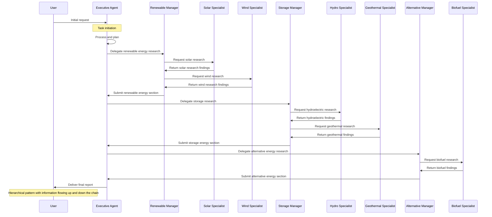

The Hierarchical, or Tree, Orchestration Pattern is a powerful approach to organizing multi-agent workflows, inspired by traditional organizational structures where work and information flow through a well-defined chain of command. This pattern creates a tree-structured arrangement of agents with clear levels of responsibility, specialization, and reporting relationships.

### Key Characteristics


The Hierarchical Pattern establishes distinct agent roles across three primary levels:

* **Executive Level** (Top): An executive agent maintains strategic oversight of the entire task. This agent breaks complex problems into logical components, delegates to appropriate domain managers, provides overall direction, and ultimately synthesizes the final output.

* **Manager Level** (Middle): Manager agents have responsibility for specific domains. Each manager breaks down their assigned component into specialized subtasks, delegates to appropriate specialists, monitors progress, provides guidance, and aggregates results before reporting back to the executive.

* **Specialist Level** (Bottom): Specialist agents possess deep expertise in narrow areas. They focus exclusively on well-defined, discrete tasks without needing to understand the entire problem context. These agents do the detailed work and report their findings back to their respective managers.

### Information Flow


The strength of this pattern comes from its structured information flow:

* **Downstream Flow**: Tasks, requirements, and context flow from the executive to managers to specialists, becoming more specialized and focused at each level.

* **Upstream Flow**: Results, findings, and completed work flow from specialists to managers to the executive, being aggregated and refined at each level.

### Implementation

In our implementation using AG2's Group Chat, we've created:

* A clear hierarchy with one executive agent, three manager agents (Renewable, Storage, Alternative), and five specialist agents organized under their respective managers.

* Explicit handoffs designed around the hierarchy:
   - Context-based transitions using `OnContextCondition` for deterministic, non-LLM routing
   - LLM-based fallbacks using `OnCondition` for more complex decisions
   - Explicit `AfterWork` designations to ensure agents always report back to their supervisors

* Shared context variables to track progress at different levels, allowing for:
   - Deterministic routing based on task completion status
   - Storage of research content provided by specialists
   - Aggregation of report sections compiled by managers

* A complete workflow that follows organizational principles:
   - The executive delegates tasks to managers
   - Managers delegate to their respective specialists
   - Specialists conduct research and report back to managers
   - Managers synthesize findings into sections and report to the executive
   - The executive compiles the final report and presents it to the user

This pattern is particularly effective for complex, multi-faceted tasks where different aspects require specialized knowledge, and where the final output needs to synthesize diverse findings into a cohesive whole. The implementation demonstrates how automated agents can effectively mirror human organizational structures to tackle complex problems through division of labor and hierarchical information flow.

The hierarchical structure enables efficient cognitive division of labor - higher-level agents handle integration and context, while lower-level agents focus on specific details, resulting in a comprehensive final output that leverages the strengths of each level in the hierarchy.

## Agent Flow



## Code

<Tip>
In this code example we use OpenAI's GPT-4o mini.

We also set the LLM parameter `parallel_tool_calls` to False so that our agents don't recommend more than one tool call at a time. This parameter may not be available with all model providers.
</Tip>

```python
# Example task: Research and create a comprehensive report on renewable energy technologies

import json
from autogen import (
    ConversableAgent,
    ContextExpression,
    UserProxyAgent,
    LLMConfig,
)
from autogen.agentchat.group import AgentNameTarget, AgentTarget, ContextVariables, ReplyResult, OnContextCondition, ExpressionContextCondition, TerminateTarget, ExpressionAvailableCondition, RevertToUserTarget, OnCondition, StringLLMCondition
from autogen.agentchat.group.patterns import DefaultPattern
from autogen.agentchat import initiate_group_chat


# Setup LLM configuration
# Note that we turn parallel tool calling off for OpenAI so we only get one tool call at a time.
llm_config = LLMConfig(api_type="openai", model="gpt-4o-mini", parallel_tool_calls=False)

# Shared context for all agents in the group chat
shared_context = ContextVariables(data={
    # Project state
    "task_started": False,
    "task_completed": False,

    # Hierarchical state tracking
    "executive_review_ready": False,
    "manager_a_completed": False,
    "manager_b_completed": False,
    "manager_c_completed": False,

    # Specialist task tracking
    "specialist_a1_completed": False,
    "specialist_a2_completed": False,
    "specialist_b1_completed": False,
    "specialist_b2_completed": False,
    "specialist_c1_completed": False,

    # Content storage
    "solar_research": "",
    "wind_research": "",
    "hydro_research": "",
    "geothermal_research": "",
    "biofuel_research": "",
    "report_sections": {},
    "final_report": ""
})

# User agent for interaction
user = UserProxyAgent(
    name="user",
    code_execution_config=False
)

# ========================
# SPECIALIST FUNCTIONS
# ========================

def complete_solar_research(research_content: str, context_variables: ContextVariables) -> ReplyResult:
    """Submit solar energy research findings"""
    context_variables["solar_research"] = research_content
    context_variables["specialist_a1_completed"] = True

    # Check if both specialists under Manager A have completed their tasks
    if context_variables["specialist_a1_completed"] and context_variables["specialist_a2_completed"]:
        context_variables["manager_a_completed"] = True

    return ReplyResult(
        message="Solar research completed and stored.",
        context_variables=context_variables,
        target=AgentTarget(renewable_manager),
    )

def complete_wind_research(research_content: str, context_variables: ContextVariables) -> ReplyResult:
    """Submit wind energy research findings"""
    context_variables["wind_research"] = research_content
    context_variables["specialist_a2_completed"] = True

    # Check if both specialists under Manager A have completed their tasks
    if context_variables["specialist_a1_completed"] and context_variables["specialist_a2_completed"]:
        context_variables["manager_a_completed"] = True

    return ReplyResult(
        message="Wind research completed and stored.",
        context_variables=context_variables,
        target=AgentTarget(renewable_manager),
    )

def complete_hydro_research(research_content: str, context_variables: ContextVariables) -> ReplyResult:
    """Submit hydroelectric energy research findings"""
    context_variables["hydro_research"] = research_content
    context_variables["specialist_b1_completed"] = True

    # Check if both specialists under Manager B have completed their tasks
    if context_variables["specialist_b1_completed"] and context_variables["specialist_b2_completed"]:
        context_variables["manager_b_completed"] = True

    return ReplyResult(
        message="Hydroelectric research completed and stored.",
        context_variables=context_variables,
        target=AgentTarget(storage_manager),
    )

def complete_geothermal_research(research_content: str, context_variables: ContextVariables) -> ReplyResult:
    """Submit geothermal energy research findings"""
    context_variables["geothermal_research"] = research_content
    context_variables["specialist_b2_completed"] = True

    # Check if both specialists under Manager B have completed their tasks
    if context_variables["specialist_b1_completed"] and context_variables["specialist_b2_completed"]:
        context_variables["manager_b_completed"] = True

    return ReplyResult(
        message="Geothermal research completed and stored.",
        context_variables=context_variables,
        target=AgentTarget(storage_manager),
    )

def complete_biofuel_research(research_content: str, context_variables: ContextVariables) -> ReplyResult:
    """Submit biofuel research findings"""
    context_variables["biofuel_research"] = research_content
    context_variables["specialist_c1_completed"] = True
    context_variables["manager_c_completed"] = True

    return ReplyResult(
        message="Biofuel research completed and stored.",
        context_variables=context_variables,
        target=AgentTarget(alternative_manager),
    )


# ========================
# SPECIALIST AGENTS
# ========================

with llm_config:
    specialist_a1 = ConversableAgent(
        name="solar_specialist",
        system_message="""You are a specialist in solar energy technologies.
        Your task is to research and provide concise information about:
        1. Current state of solar technology
        2. Efficiency rates of different types of solar panels
        3. Cost comparison with fossil fuels
        4. Major companies and countries leading in solar energy

        Be thorough but concise. Your research will be used as part of a larger report.

        Use your tools only one at a time.""",
        functions = [complete_solar_research],
    )

    specialist_a2 = ConversableAgent(
        name="wind_specialist",
        system_message="""You are a specialist in wind energy technologies.
        Your task is to research and provide concise information about:
        1. Current state of wind technology (onshore/offshore)
        2. Efficiency rates of modern wind turbines
        3. Cost comparison with fossil fuels
        4. Major companies and countries leading in wind energy

        Be thorough but concise. Your research will be used as part of a larger report.

        Use your tools only one at a time.""",
        functions = [complete_wind_research],
    )

    specialist_b1 = ConversableAgent(
        name="hydro_specialist",
        system_message="""You are a specialist in hydroelectric energy technologies.
        Your task is to research and provide concise information about:
        1. Current state of hydroelectric technology
        2. Types of hydroelectric generation (dams, run-of-river, pumped storage)
        3. Cost comparison with fossil fuels
        4. Major companies and countries leading in hydroelectric energy

        Be thorough but concise. Your research will be used as part of a larger report.

        Use your tools only one at a time.""",
        functions = [complete_hydro_research],
    )

    specialist_b2 = ConversableAgent(
        name="geothermal_specialist",
        system_message="""You are a specialist in geothermal energy technologies.
        Your task is to research and provide concise information about:
        1. Current state of geothermal technology
        2. Types of geothermal systems and efficiency rates
        3. Cost comparison with fossil fuels
        4. Major companies and countries leading in geothermal energy

        Be thorough but concise. Your research will be used as part of a larger report.

        Use your tools only one at a time.""",
        functions = [complete_geothermal_research],
    )

    specialist_c1 = ConversableAgent(
        name="biofuel_specialist",
        system_message="""You are a specialist in biofuel technologies.
        Your task is to research and provide concise information about:
        1. Current state of biofuel technology
        2. Types of biofuels and their applications
        3. Cost comparison with fossil fuels
        4. Major companies and countries leading in biofuel production

        Be thorough but concise. Your research will be used as part of a larger report.

        Use your tools only one at a time.""",
        functions = [complete_biofuel_research],
    )

# ========================
# MANAGER FUNCTIONS
# ========================

def compile_renewable_section(section_content: str, context_variables: ContextVariables) -> ReplyResult:
    """Compile the renewable energy section (solar and wind) for the final report"""
    context_variables["report_sections"]["renewable"] = section_content

    # Check if all managers have submitted their sections
    if all(key in context_variables["report_sections"] for key in ["renewable", "storage", "alternative"]):
        context_variables["executive_review_ready"] = True
        return ReplyResult(
            message="Renewable energy section compiled. All sections are now ready for executive review.",
            context_variables=context_variables,
            target=AgentTarget(executive_agent),
        )
    else:
        return ReplyResult(
            message="Renewable energy section compiled and stored.",
            context_variables=context_variables,
            target=AgentTarget(executive_agent),
        )

def compile_storage_section(section_content: str, context_variables: ContextVariables) -> ReplyResult:
    """Compile the energy storage section (hydro and geothermal) for the final report"""
    context_variables["report_sections"]["storage"] = section_content

    # Check if all managers have submitted their sections
    if all(key in context_variables["report_sections"] for key in ["renewable", "storage", "alternative"]):
        context_variables["executive_review_ready"] = True
        return ReplyResult(
            message="Energy storage section compiled. All sections are now ready for executive review.",
            context_variables=context_variables,
            target=AgentTarget(executive_agent),
        )
    else:
        return ReplyResult(
            message="Energy storage section compiled and stored.",
            context_variables=context_variables,
            target=AgentTarget(executive_agent),
        )

def compile_alternative_section(section_content: str, context_variables: ContextVariables) -> ReplyResult:
    """Compile the alternative energy section (biofuels) for the final report"""
    context_variables["report_sections"]["alternative"] = section_content

    # Check if all managers have submitted their sections
    if all(key in context_variables["report_sections"] for key in ["renewable", "storage", "alternative"]):
        context_variables["executive_review_ready"] = True
        return ReplyResult(
            message="Alternative energy section compiled. All sections are now ready for executive review.",
            context_variables=context_variables,
            target=AgentTarget(executive_agent),
        )
    else:
        return ReplyResult(
            message="Alternative energy section compiled and stored.",
            context_variables=context_variables,
            target=AgentTarget(executive_agent),
        )

# ========================
# MANAGER AGENTS
# ========================

with llm_config:
    renewable_manager = ConversableAgent(
        name="renewable_manager",
        system_message="""You are the manager for renewable energy research, specifically overseeing solar and wind energy specialists.
        Your responsibilities include:
        1. Reviewing the research from your specialists
        2. Ensuring the information is accurate and comprehensive
        3. Synthesizing the information into a cohesive section on renewable energy
        4. Submitting the compiled research to the executive for final report creation

        You should wait until both specialists have completed their research before compiling your section.

        Use your tools only one at a time.""",
        functions = [compile_renewable_section]
    )

    storage_manager = ConversableAgent(
        name="storage_manager",
        system_message="""You are the manager for energy storage and hydroelectric technologies, overseeing hydroelectric and geothermal energy specialists.
        Your responsibilities include:
        1. Reviewing the research from your specialists
        2. Ensuring the information is accurate and comprehensive
        3. Synthesizing the information into a cohesive section on energy storage and hydroelectric solutions
        4. Submitting the compiled research to the executive for final report creation

        You should wait until both specialists have completed their research before compiling your section.

        Use your tools only one at a time.""",
        functions = [compile_storage_section]
    )

    alternative_manager = ConversableAgent(
        name="alternative_manager",
        system_message="""You are the manager for alternative energy solutions, overseeing biofuel research.
        Your responsibilities include:
        1. Reviewing the research from your specialist
        2. Ensuring the information is accurate and comprehensive
        3. Synthesizing the information into a cohesive section on alternative energy solutions
        4. Submitting the compiled research to the executive for final report creation

        Use your tools only one at a time.""",
        functions = [compile_alternative_section]
    )

# ========================
# EXECUTIVE FUNCTIONS
# ========================

def initiate_research(context_variables: ContextVariables) -> ReplyResult:
    """Initiate the research process by delegating to managers"""
    context_variables["task_started"] = True

    return ReplyResult(
        message="Research initiated. Tasks have been delegated to the renewable energy manager, storage manager, and alternative energy manager.",
        context_variables=context_variables
    )

def compile_final_report(report_content: str, context_variables: ContextVariables) -> ReplyResult:
    """Compile the final comprehensive report from all sections"""
    context_variables["final_report"] = report_content
    context_variables["task_completed"] = True

    return ReplyResult(
        message="Final report compiled successfully. The comprehensive renewable energy report is now complete.",
        context_variables=context_variables,
        target=AgentTarget(user)  # Return to user with final report
    )

# ========================
# EXECUTIVE AGENT
# ========================

with llm_config:
    executive_agent = ConversableAgent(
        name="executive_agent",
        system_message="""You are the executive overseeing the creation of a comprehensive report on renewable energy technologies.

        You have exactly three manager agents reporting to you, each responsible for specific technology domains:
        1. Renewable Manager - Oversees solar and wind energy research
        2. Storage Manager - Oversees hydroelectric and geothermal energy research
        3. Alternative Manager - Oversees biofuel research

        Your responsibilities include:
        1. Delegating research tasks to these three specific manager agents
        2. Providing overall direction and ensuring alignment with the project goals
        3. Reviewing the compiled sections from each manager
        4. Synthesizing all sections into a cohesive final report with executive summary
        5. Ensuring the report is comprehensive, balanced, and meets high-quality standards

        Do not create or attempt to delegate to managers that don't exist in this structure.

        The final report should include:
        - Executive Summary
        - Introduction to Renewable Energy
        - Three main sections:
        * Solar and Wind Energy (from Renewable Manager)
        * Hydroelectric and Geothermal Energy (from Storage Manager)
        * Biofuel Technologies (from Alternative Manager)
        - Comparison of technologies
        - Future outlook and recommendations""",
        functions = [initiate_research, compile_final_report],
    )

# ========================
# HANDOFFS REGISTRATION
# ========================

# Executive Agent handoffs
# Using OnContextCondition for task delegation based on context variables
# This eliminates the need for LLM-based decisions for simple routing
executive_agent.handoffs.add_context_conditions(
    [
        OnContextCondition(
            target=AgentTarget(renewable_manager),
            condition=ExpressionContextCondition(ContextExpression("not(${manager_a_completed})")),
            available=ExpressionAvailableCondition(ContextExpression("${task_started} == True")),
        ),
        OnContextCondition(
            target=AgentTarget(storage_manager),
            condition=ExpressionContextCondition(ContextExpression("not(${manager_b_completed})")),
            available=ExpressionAvailableCondition(ContextExpression("${task_started} == True")),
        ),
        OnContextCondition(
            target=AgentTarget(alternative_manager),
            condition=ExpressionContextCondition(ContextExpression("not(${manager_c_completed})")),
            available=ExpressionAvailableCondition(ContextExpression("${task_started} == True")),
        )
    ]
)
executive_agent.handoffs.set_after_work(RevertToUserTarget())

# Renewable Manager handoffs - uses context expressions for more efficient decision-making
renewable_manager.handoffs.add_many(
    [
        # Context-based handoffs for specialist delegation
        OnContextCondition(
            target=AgentTarget(specialist_a1),
            condition=ExpressionContextCondition(ContextExpression("not(${specialist_a1_completed})")),
            available=ExpressionAvailableCondition(ContextExpression("${task_started} == True")),
        ),
        OnContextCondition(
            target=AgentTarget(specialist_a2),
            condition=ExpressionContextCondition(ContextExpression("not(${specialist_a2_completed})")),
            available=ExpressionAvailableCondition(ContextExpression("${task_started} == True")),
        ),
        OnCondition(
            target=AgentTarget(executive_agent),
            condition=StringLLMCondition("Return to the executive after your report has been compiled."),
            available=ExpressionAvailableCondition(ContextExpression("${manager_a_completed} == True")),
        ),
    ]
)
renewable_manager.handoffs.set_after_work(AgentTarget(executive_agent))  # After work, return to executive)

# Storage Manager handoffs - similar pattern of context-based and LLM-based handoffs
storage_manager.handoffs.add_many(
    [
        # Context-based handoffs for specialist delegation
        OnContextCondition(
            target=AgentTarget(specialist_b1),
            condition=ExpressionContextCondition(ContextExpression("not(${specialist_b1_completed})")),
            available=ExpressionAvailableCondition(ContextExpression("${task_started} == True")),
        ),
        OnContextCondition(
            target=AgentTarget(specialist_b2),
            condition=ExpressionContextCondition(ContextExpression("not(${specialist_b2_completed})")),
            available=ExpressionAvailableCondition(ContextExpression("${task_started} == True")),
        ),
        OnCondition(
            target=AgentTarget(executive_agent),
            condition=StringLLMCondition("Return to the executive after your report has been compiled."),
            available=ExpressionAvailableCondition(ContextExpression("${manager_b_completed} == True")),
        ),
    ]
)
# After work, return to executive
storage_manager.handoffs.set_after_work(AgentTarget(executive_agent))

# Alternative Manager handoffs - combination of context-based and LLM-based handoffs
alternative_manager.handoffs.add_many(
    [
        # Context-based handoffs for specialist delegation
        OnContextCondition(
            target=AgentTarget(specialist_c1),
            condition=ExpressionContextCondition(ContextExpression("not(${specialist_c1_completed})")),
            available=ExpressionAvailableCondition(ContextExpression("${task_started} == True")),
        ),
        OnCondition(
            target=AgentTarget(executive_agent),
            condition=StringLLMCondition("Return to the executive with the compiled alternative energy section"),
            available=ExpressionAvailableCondition(ContextExpression("${manager_c_completed} == True")),
        ),
    ]
)
alternative_manager.handoffs.set_after_work(AgentTarget(executive_agent))  # After work, return to executive


# Specialists handoffs back to their managers based on task completion
specialist_a1.handoffs.set_after_work(AgentTarget(renewable_manager))
specialist_a2.handoffs.set_after_work(AgentTarget(renewable_manager))
specialist_b1.handoffs.set_after_work(AgentTarget(storage_manager))
specialist_b2.handoffs.set_after_work(AgentTarget(storage_manager))
specialist_c1.handoffs.set_after_work(AgentTarget(alternative_manager))

# ========================
# INITIATE THE GROUP CHAT
# ========================

def run_hierarchical_chat():
    """Run the hierarchical group chat to generate a renewable energy report"""
    print("Initiating Hierarchical Group Chat for Renewable Energy Report...")

    agent_pattern = DefaultPattern(
        initial_agent=executive_agent,
        agents=[
            # Executive level
            executive_agent,
            # Manager level
            renewable_manager, storage_manager, alternative_manager,
            # Specialist level
            specialist_a1, specialist_a2, specialist_b1, specialist_b2, specialist_c1
        ],
        context_variables=shared_context,
        group_after_work=TerminateTarget(),  # Default fallback if agent doesn't specify
        user_agent=user,
    )

    # Provide default after_work option that aligns with hierarchical pattern
    chat_result, final_context, last_agent = initiate_group_chat(
        pattern=agent_pattern,
        messages="We need a comprehensive report on the current state of renewable energy technologies. Please coordinate the research and compilation of this report.",
        max_rounds=50,
    )

    # The final report will be stored in final_context["final_report"]
    if final_context["task_completed"]:
        print("Report generation completed successfully!")
        print("\n===== FINAL REPORT =====\n")
        print(final_context["final_report"])
        print("\n\n===== FINAL CONTEXT VARIABLES =====\n")
        print(json.dumps(final_context.to_dict(), indent=2))
        print("\n\n===== SPEAKER ORDER =====\n")
        for message in chat_result.chat_history:
            if "name" in message and message["name"] != "_Group_Tool_Executor":
                print(f"{message['name']}")
    else:
        print("Report generation did not complete successfully.")

if __name__ == "__main__":
    run_hierarchical_chat()
```

## Output

```console
Initiating Hierarchical Group Chat for Renewable Energy Report...
user (to chat_manager):

We need a comprehensive report on the current state of renewable energy technologies. Please coordinate the research and compilation of this report.

--------------------------------------------------------------------------------

Next speaker: executive_agent


>>>>>>>> USING AUTO REPLY...
executive_agent (to chat_manager):

***** Suggested tool call (call_yGfN22tc6vFafeVhHiFnceoC): initiate_research *****
Arguments:
{}
**********************************************************************************

--------------------------------------------------------------------------------

Next speaker: _Group_Tool_Executor


>>>>>>>> EXECUTING FUNCTION initiate_research...
Call ID: call_yGfN22tc6vFafeVhHiFnceoC
Input arguments: {}
_Group_Tool_Executor (to chat_manager):

***** Response from calling tool (call_yGfN22tc6vFafeVhHiFnceoC) *****
Research initiated. Tasks have been delegated to the renewable energy manager, storage manager, and alternative energy manager.
**********************************************************************

--------------------------------------------------------------------------------

Next speaker: executive_agent

executive_agent (to chat_manager):

[Handing off to renewable_manager]

--------------------------------------------------------------------------------

Next speaker: renewable_manager

renewable_manager (to chat_manager):

[Handing off to solar_specialist]

--------------------------------------------------------------------------------

Next speaker: solar_specialist


>>>>>>>> USING AUTO REPLY...
solar_specialist (to chat_manager):

***** Suggested tool call (call_YUjuZFBCubj4LmDLdE9YVKID): complete_solar_research *****
Arguments:
{"research_content":"1. Current State of Solar Technology:\nSolar energy technology has improved significantly over the past decade. As of 2023, photovoltaic (PV) systems dominate the market, with advances in materials like perovskite and bifacial solar panels enhancing efficiency and lowering production costs. Solar thermal technologies, including concentrated solar power (CSP), are also gaining traction, particularly in large-scale applications. Innovations in energy storage, such as lithium-ion batteries, further enhance the viability of solar energy by addressing intermittency issues.\n\n2. Efficiency Rates of Different Types of Solar Panels:\n- Monocrystalline panels: 15-22% efficiency\n- Polycrystalline panels: 13-16% efficiency\n- Thin-film panels: 10-12% efficiency\n- Bifacial panels: Up to 27% efficiency under optimal conditions\nRecent advancements have led to record-breaking efficiencies in laboratory settings, with the highest reported efficiency for monocrystalline reaching around 26.7%.\n\n3. Cost Comparison with Fossil Fuels:\nThe cost of solar energy has dropped dramatically, with the levelized cost of electricity (LCOE) for solar now averaging around $30-60 per MWh, compared to fossil fuels which range between $50-100 per MWh (depending on the fuel type). In many regions, solar is now the cheapest form of electricity generation, contributing to rapid deployment globally.\n\n4. Major Companies and Countries Leading in Solar Energy:\nLeading companies in the solar sector include:\n - First Solar (USA)\n - SunPower (USA)\n - Kyocera (Japan)\n - Trina Solar (China)\n - JinkoSolar (China)\nCountries at the forefront of solar energy production are:\n - China (largest producer and installer)\n - United States (fast-growing market)\n - India (significant growth in installations)\n - Germany (early adopter and leader in technology)\n - Japan (advanced technology and installations)"}
****************************************************************************************

--------------------------------------------------------------------------------

Next speaker: _Group_Tool_Executor


>>>>>>>> EXECUTING FUNCTION complete_solar_research...
Call ID: call_YUjuZFBCubj4LmDLdE9YVKID
Input arguments: {'research_content': '1. Current State of Solar Technology:\nSolar energy technology has improved significantly over the past decade. As of 2023, photovoltaic (PV) systems dominate the market, with advances in materials like perovskite and bifacial solar panels enhancing efficiency and lowering production costs. Solar thermal technologies, including concentrated solar power (CSP), are also gaining traction, particularly in large-scale applications. Innovations in energy storage, such as lithium-ion batteries, further enhance the viability of solar energy by addressing intermittency issues.\n\n2. Efficiency Rates of Different Types of Solar Panels:\n- Monocrystalline panels: 15-22% efficiency\n- Polycrystalline panels: 13-16% efficiency\n- Thin-film panels: 10-12% efficiency\n- Bifacial panels: Up to 27% efficiency under optimal conditions\nRecent advancements have led to record-breaking efficiencies in laboratory settings, with the highest reported efficiency for monocrystalline reaching around 26.7%.\n\n3. Cost Comparison with Fossil Fuels:\nThe cost of solar energy has dropped dramatically, with the levelized cost of electricity (LCOE) for solar now averaging around $30-60 per MWh, compared to fossil fuels which range between $50-100 per MWh (depending on the fuel type). In many regions, solar is now the cheapest form of electricity generation, contributing to rapid deployment globally.\n\n4. Major Companies and Countries Leading in Solar Energy:\nLeading companies in the solar sector include:\n - First Solar (USA)\n - SunPower (USA)\n - Kyocera (Japan)\n - Trina Solar (China)\n - JinkoSolar (China)\nCountries at the forefront of solar energy production are:\n - China (largest producer and installer)\n - United States (fast-growing market)\n - India (significant growth in installations)\n - Germany (early adopter and leader in technology)\n - Japan (advanced technology and installations)'}
_Group_Tool_Executor (to chat_manager):

***** Response from calling tool (call_YUjuZFBCubj4LmDLdE9YVKID) *****
Solar research completed and stored.
**********************************************************************

--------------------------------------------------------------------------------

Next speaker: renewable_manager

renewable_manager (to chat_manager):

[Handing off to wind_specialist]

--------------------------------------------------------------------------------

Next speaker: wind_specialist


>>>>>>>> USING AUTO REPLY...
wind_specialist (to chat_manager):

***** Suggested tool call (call_FaXCsOfxngj3oG9px09xXmn4): complete_wind_research *****
Arguments:
{"research_content":"1. Current State of Wind Technology:\nThe wind energy sector has seen substantial growth with advancements in both onshore and offshore wind technologies. \n- Onshore wind farms remain the dominant form of wind energy generation, due to lower costs and established infrastructure. However, the trend is shifting towards larger, more efficient turbines and hybrid systems that increase energy capture.\n- Offshore wind technology is rapidly advancing with larger turbines (up to 15 MW) and floating wind farms expanding the potential for energy generation in deeper waters. As of 2023, the global installed offshore wind capacity exceeds 50 GW.\n\n2. Efficiency Rates of Modern Wind Turbines:\nModern onshore turbines typically have efficiency rates (capacity factors) around 35-45%, while offshore turbines can achieve 45-55% efficiency under optimal conditions. The technological advancements in turbines, such as larger rotor diameters and improved drivetrain systems, contribute to these efficiency gains.\n\n3. Cost Comparison with Fossil Fuels:\nThe cost of wind energy has significantly decreased, making it competitive with fossil fuels. The average LCOE for onshore wind sits between $30-50 per MWh, while offshore wind ranges from $60-120 per MWh, depending on location and technology. Comparatively, fossil fuel costs can range from $50-100 per MWh, placing wind energy as one of the cheapest forms of new generation.\n\n4. Major Companies and Countries Leading in Wind Energy:\nLeading companies in the wind energy sector include:\n - Siemens Gamesa (Spain/Germany)\n - Vestas (Denmark)\n - GE Renewable Energy (USA)\n - Nordex (Germany)\n - Goldwind (China)\nCountries at the forefront of wind energy production are:\n - China (world leader in installed capacity)\n - United States (significant market growth)\n - Germany (strong commitment to renewables)\n - United Kingdom (leading offshore wind capacity)\n - Denmark (high percentage of energy from wind)"}
***************************************************************************************

--------------------------------------------------------------------------------

Next speaker: _Group_Tool_Executor


>>>>>>>> EXECUTING FUNCTION complete_wind_research...
Call ID: call_FaXCsOfxngj3oG9px09xXmn4
Input arguments: {'research_content': '1. Current State of Wind Technology:\nThe wind energy sector has seen substantial growth with advancements in both onshore and offshore wind technologies. \n- Onshore wind farms remain the dominant form of wind energy generation, due to lower costs and established infrastructure. However, the trend is shifting towards larger, more efficient turbines and hybrid systems that increase energy capture.\n- Offshore wind technology is rapidly advancing with larger turbines (up to 15 MW) and floating wind farms expanding the potential for energy generation in deeper waters. As of 2023, the global installed offshore wind capacity exceeds 50 GW.\n\n2. Efficiency Rates of Modern Wind Turbines:\nModern onshore turbines typically have efficiency rates (capacity factors) around 35-45%, while offshore turbines can achieve 45-55% efficiency under optimal conditions. The technological advancements in turbines, such as larger rotor diameters and improved drivetrain systems, contribute to these efficiency gains.\n\n3. Cost Comparison with Fossil Fuels:\nThe cost of wind energy has significantly decreased, making it competitive with fossil fuels. The average LCOE for onshore wind sits between $30-50 per MWh, while offshore wind ranges from $60-120 per MWh, depending on location and technology. Comparatively, fossil fuel costs can range from $50-100 per MWh, placing wind energy as one of the cheapest forms of new generation.\n\n4. Major Companies and Countries Leading in Wind Energy:\nLeading companies in the wind energy sector include:\n - Siemens Gamesa (Spain/Germany)\n - Vestas (Denmark)\n - GE Renewable Energy (USA)\n - Nordex (Germany)\n - Goldwind (China)\nCountries at the forefront of wind energy production are:\n - China (world leader in installed capacity)\n - United States (significant market growth)\n - Germany (strong commitment to renewables)\n - United Kingdom (leading offshore wind capacity)\n - Denmark (high percentage of energy from wind)'}
_Group_Tool_Executor (to chat_manager):

***** Response from calling tool (call_FaXCsOfxngj3oG9px09xXmn4) *****
Wind research completed and stored.
**********************************************************************

--------------------------------------------------------------------------------

Next speaker: renewable_manager


>>>>>>>> USING AUTO REPLY...
renewable_manager (to chat_manager):

***** Suggested tool call (call_KABtktTEMr4Q6iyDgfnSbg8d): compile_renewable_section *****
Arguments:
{"section_content":"### Current State of Renewable Energy Technologies\n\n#### Solar Energy\n1. **Current State of Solar Technology:**\nSolar energy technology has improved significantly over the past decade. As of 2023, photovoltaic (PV) systems dominate the market, with advances in materials like perovskite and bifacial solar panels enhancing efficiency and lowering production costs. Solar thermal technologies, including concentrated solar power (CSP), are also gaining traction, particularly in large-scale applications. Innovations in energy storage, such as lithium-ion batteries, further enhance the viability of solar energy by addressing intermittency issues.\n\n2. **Efficiency Rates of Different Types of Solar Panels:**\n   - Monocrystalline panels: 15-22% efficiency  \n   - Polycrystalline panels: 13-16% efficiency  \n   - Thin-film panels: 10-12% efficiency  \n   - Bifacial panels: Up to 27% efficiency under optimal conditions  \nRecent advancements have led to record-breaking efficiencies in laboratory settings, with the highest reported efficiency for monocrystalline reaching around 26.7%.\n\n3. **Cost Comparison with Fossil Fuels:**\nThe cost of solar energy has dropped dramatically, with the levelized cost of electricity (LCOE) for solar now averaging around $30-60 per MWh, compared to fossil fuels which range between $50-100 per MWh (depending on the fuel type). In many regions, solar is now the cheapest form of electricity generation, contributing to rapid deployment globally.\n\n4. **Major Companies and Countries Leading in Solar Energy:**\nLeading companies in the solar sector include:\n   - First Solar (USA)  \n   - SunPower (USA)  \n   - Kyocera (Japan)  \n   - Trina Solar (China)  \n   - JinkoSolar (China)  \nCountries at the forefront of solar energy production are:\n   - China (largest producer and installer)  \n   - United States (fast-growing market)  \n   - India (significant growth in installations)  \n   - Germany (early adopter and leader in technology)  \n   - Japan (advanced technology and installations)  \n\n#### Wind Energy\n1. **Current State of Wind Technology:**\nThe wind energy sector has seen substantial growth with advancements in both onshore and offshore wind technologies. \n- Onshore wind farms remain the dominant form of wind energy generation, due to lower costs and established infrastructure. However, the trend is shifting towards larger, more efficient turbines and hybrid systems that increase energy capture.\n- Offshore wind technology is rapidly advancing with larger turbines (up to 15 MW) and floating wind farms expanding the potential for energy generation in deeper waters. As of 2023, the global installed offshore wind capacity exceeds 50 GW.\n\n2. **Efficiency Rates of Modern Wind Turbines:**\nModern onshore turbines typically have efficiency rates (capacity factors) around 35-45%, while offshore turbines can achieve 45-55% efficiency under optimal conditions. The technological advancements in turbines, such as larger rotor diameters and improved drivetrain systems, contribute to these efficiency gains.\n\n3. **Cost Comparison with Fossil Fuels:**\nThe cost of wind energy has significantly decreased, making it competitive with fossil fuels. The average LCOE for onshore wind sits between $30-50 per MWh, while offshore wind ranges from $60-120 per MWh, depending on location and technology. Comparatively, fossil fuel costs can range from $50-100 per MWh, placing wind energy as one of the cheapest forms of new generation.\n\n4. **Major Companies and Countries Leading in Wind Energy:**\nLeading companies in the wind energy sector include:\n   - Siemens Gamesa (Spain/Germany)  \n   - Vestas (Denmark)  \n   - GE Renewable Energy (USA)  \n   - Nordex (Germany)  \n   - Goldwind (China)  \nCountries at the forefront of wind energy production are:\n   - China (world leader in installed capacity)  \n   - United States (significant market growth)  \n   - Germany (strong commitment to renewables)  \n   - United Kingdom (leading offshore wind capacity)  \n   - Denmark (high percentage of energy from wind)  \n"}
******************************************************************************************

--------------------------------------------------------------------------------

Next speaker: _Group_Tool_Executor


>>>>>>>> EXECUTING FUNCTION compile_renewable_section...
Call ID: call_KABtktTEMr4Q6iyDgfnSbg8d
Input arguments: {'section_content': '### Current State of Renewable Energy Technologies\n\n#### Solar Energy\n1. **Current State of Solar Technology:**\nSolar energy technology has improved significantly over the past decade. As of 2023, photovoltaic (PV) systems dominate the market, with advances in materials like perovskite and bifacial solar panels enhancing efficiency and lowering production costs. Solar thermal technologies, including concentrated solar power (CSP), are also gaining traction, particularly in large-scale applications. Innovations in energy storage, such as lithium-ion batteries, further enhance the viability of solar energy by addressing intermittency issues.\n\n2. **Efficiency Rates of Different Types of Solar Panels:**\n   - Monocrystalline panels: 15-22% efficiency  \n   - Polycrystalline panels: 13-16% efficiency  \n   - Thin-film panels: 10-12% efficiency  \n   - Bifacial panels: Up to 27% efficiency under optimal conditions  \nRecent advancements have led to record-breaking efficiencies in laboratory settings, with the highest reported efficiency for monocrystalline reaching around 26.7%.\n\n3. **Cost Comparison with Fossil Fuels:**\nThe cost of solar energy has dropped dramatically, with the levelized cost of electricity (LCOE) for solar now averaging around $30-60 per MWh, compared to fossil fuels which range between $50-100 per MWh (depending on the fuel type). In many regions, solar is now the cheapest form of electricity generation, contributing to rapid deployment globally.\n\n4. **Major Companies and Countries Leading in Solar Energy:**\nLeading companies in the solar sector include:\n   - First Solar (USA)  \n   - SunPower (USA)  \n   - Kyocera (Japan)  \n   - Trina Solar (China)  \n   - JinkoSolar (China)  \nCountries at the forefront of solar energy production are:\n   - China (largest producer and installer)  \n   - United States (fast-growing market)  \n   - India (significant growth in installations)  \n   - Germany (early adopter and leader in technology)  \n   - Japan (advanced technology and installations)  \n\n#### Wind Energy\n1. **Current State of Wind Technology:**\nThe wind energy sector has seen substantial growth with advancements in both onshore and offshore wind technologies. \n- Onshore wind farms remain the dominant form of wind energy generation, due to lower costs and established infrastructure. However, the trend is shifting towards larger, more efficient turbines and hybrid systems that increase energy capture.\n- Offshore wind technology is rapidly advancing with larger turbines (up to 15 MW) and floating wind farms expanding the potential for energy generation in deeper waters. As of 2023, the global installed offshore wind capacity exceeds 50 GW.\n\n2. **Efficiency Rates of Modern Wind Turbines:**\nModern onshore turbines typically have efficiency rates (capacity factors) around 35-45%, while offshore turbines can achieve 45-55% efficiency under optimal conditions. The technological advancements in turbines, such as larger rotor diameters and improved drivetrain systems, contribute to these efficiency gains.\n\n3. **Cost Comparison with Fossil Fuels:**\nThe cost of wind energy has significantly decreased, making it competitive with fossil fuels. The average LCOE for onshore wind sits between $30-50 per MWh, while offshore wind ranges from $60-120 per MWh, depending on location and technology. Comparatively, fossil fuel costs can range from $50-100 per MWh, placing wind energy as one of the cheapest forms of new generation.\n\n4. **Major Companies and Countries Leading in Wind Energy:**\nLeading companies in the wind energy sector include:\n   - Siemens Gamesa (Spain/Germany)  \n   - Vestas (Denmark)  \n   - GE Renewable Energy (USA)  \n   - Nordex (Germany)  \n   - Goldwind (China)  \nCountries at the forefront of wind energy production are:\n   - China (world leader in installed capacity)  \n   - United States (significant market growth)  \n   - Germany (strong commitment to renewables)  \n   - United Kingdom (leading offshore wind capacity)  \n   - Denmark (high percentage of energy from wind)  \n'}
_Group_Tool_Executor (to chat_manager):

***** Response from calling tool (call_KABtktTEMr4Q6iyDgfnSbg8d) *****
Renewable energy section compiled and stored.
**********************************************************************

--------------------------------------------------------------------------------

Next speaker: executive_agent

executive_agent (to chat_manager):

[Handing off to storage_manager]

--------------------------------------------------------------------------------

Next speaker: storage_manager

storage_manager (to chat_manager):

[Handing off to hydro_specialist]

--------------------------------------------------------------------------------

Next speaker: hydro_specialist


>>>>>>>> USING AUTO REPLY...
hydro_specialist (to chat_manager):

***** Suggested tool call (call_oQFWDEXt35R5BUbF97y3z70r): complete_hydro_research *****
Arguments:
{"research_content":"1. Current state of hydroelectric technology:\nAs of 2023, hydroelectric technology is well-established and continually evolving. The sector is focusing on improving efficiency and reducing environmental impacts. Innovations in turbine design (such as Kaplan and Francis turbines), and the integration of digital technologies for real-time monitoring and optimization are becoming standard. The global hydroelectric capacity stands robust, providing approximately 16% of the world's electricity, primarily from large-scale facilities. The sector is also leveraging pumped storage systems for energy storage, playing a crucial role in grid stability.\n\n2. Types of hydroelectric generation:\n- **Dams:** Traditional hydroelectricity generation through large dams that create reservoirs. They have high capacity and can provide baseload power but have significant ecological and geographical considerations. \n- **Run-of-River:** A less intrusive form of hydro power that utilizes the river's natural flow without creating large reservoirs, thus minimizing environmental impact. It is often utilized in smaller installations.\n- **Pumped Storage:** A method of storing energy by pumping water to a higher elevation and releasing it when needed. It acts as a large-scale battery, providing grid stability and energy management by balancing supply and demand.\n\n3. Cost comparison with fossil fuels:\nThe cost of hydroelectric power varies, generally falling between $30 to $60 per MWh, making it competitive with fossil fuels, which average $50 to $100 per MWh. Hydroelectricity provides a low-cost, reliable energy source that can stabilize pricing in energy markets.\n\n4. Major companies and countries leading in hydroelectric energy:\nLeading companies include:\n- Brookfield Renewable Partners (Canada)\n- FirstEnergy (USA)\n- China Yangtze Power (China)\nCountries that lead in hydroelectric generation are:\n- China (the largest producer with three gorges dam as the biggest facility)\n- Brazil (substantial reliance on hydro for electricity)\n- Canada (significant hydro resources and infrastructure)\n- United States (diverse range of hydro installations)\n- Russia (large hydro capacity and development potential)"}
****************************************************************************************

--------------------------------------------------------------------------------

Next speaker: _Group_Tool_Executor


>>>>>>>> EXECUTING FUNCTION complete_hydro_research...
Call ID: call_oQFWDEXt35R5BUbF97y3z70r
Input arguments: {'research_content': "1. Current state of hydroelectric technology:\nAs of 2023, hydroelectric technology is well-established and continually evolving. The sector is focusing on improving efficiency and reducing environmental impacts. Innovations in turbine design (such as Kaplan and Francis turbines), and the integration of digital technologies for real-time monitoring and optimization are becoming standard. The global hydroelectric capacity stands robust, providing approximately 16% of the world's electricity, primarily from large-scale facilities. The sector is also leveraging pumped storage systems for energy storage, playing a crucial role in grid stability.\n\n2. Types of hydroelectric generation:\n- **Dams:** Traditional hydroelectricity generation through large dams that create reservoirs. They have high capacity and can provide baseload power but have significant ecological and geographical considerations. \n- **Run-of-River:** A less intrusive form of hydro power that utilizes the river's natural flow without creating large reservoirs, thus minimizing environmental impact. It is often utilized in smaller installations.\n- **Pumped Storage:** A method of storing energy by pumping water to a higher elevation and releasing it when needed. It acts as a large-scale battery, providing grid stability and energy management by balancing supply and demand.\n\n3. Cost comparison with fossil fuels:\nThe cost of hydroelectric power varies, generally falling between $30 to $60 per MWh, making it competitive with fossil fuels, which average $50 to $100 per MWh. Hydroelectricity provides a low-cost, reliable energy source that can stabilize pricing in energy markets.\n\n4. Major companies and countries leading in hydroelectric energy:\nLeading companies include:\n- Brookfield Renewable Partners (Canada)\n- FirstEnergy (USA)\n- China Yangtze Power (China)\nCountries that lead in hydroelectric generation are:\n- China (the largest producer with three gorges dam as the biggest facility)\n- Brazil (substantial reliance on hydro for electricity)\n- Canada (significant hydro resources and infrastructure)\n- United States (diverse range of hydro installations)\n- Russia (large hydro capacity and development potential)"}
_Group_Tool_Executor (to chat_manager):

***** Response from calling tool (call_oQFWDEXt35R5BUbF97y3z70r) *****
Hydroelectric research completed and stored.
**********************************************************************

--------------------------------------------------------------------------------

Next speaker: storage_manager

storage_manager (to chat_manager):

[Handing off to geothermal_specialist]

--------------------------------------------------------------------------------

Next speaker: geothermal_specialist


>>>>>>>> USING AUTO REPLY...
geothermal_specialist (to chat_manager):

***** Suggested tool call (call_lwHGU4vUlByONVTpxhs3n3N2): complete_geothermal_research *****
Arguments:
{"research_content":"1. Current state of geothermal technology:\nGeothermal energy technology is advancing, with enhanced geothermal systems (EGS) gaining traction in addition to traditional hydrothermal resources. Technologies like binary cycle plants, which use a secondary fluid to generate electricity, are becoming more common, enabling efficient generation from lower-temperature resources. The focus is also on improved drilling technologies and energy conversion systems, which enhance the viability of geothermal resources.\n\n2. Types of geothermal systems and efficiency rates:\n   - **Hydrothermal systems:** Utilize hot steam or hot water from the Earth's crust, typically with efficiency rates around 10-20%.  \n   - **Enhanced geothermal systems (EGS):** Engineered reservoirs where water is injected into hot rocks, achieving efficiency rates of 15-30% under optimal conditions.  \n   - **Ground-source heat pumps (GSHP):** Used for heating and cooling buildings, with efficiency rates of 300-600%, leveraging the stable ground temperature.  \n   - **Binary cycle plants:** Operate by using a secondary fluid to vaporize and generate power, achieving efficiency rates similar to hydrothermal systems, around 10-15%.\n\n3. Cost comparison with fossil fuels:\nGeothermal energy's levelized cost of electricity (LCOE) typically ranges from $40 to $100 per MWh, depending on resource quality and installation specifics. In many cases, geothermal energy can compete favorably with fossil fuels, which are generally priced between $50 and $100 per MWh.\n\n4. Major companies and countries leading in geothermal energy:\nLeading companies in the geothermal sector include:\n- Ormat Technologies (USA)\n- Calpine (USA)\n- Enel Green Power (Italy)\nCountries that are leaders in geothermal energy utilization are:\n- United States (largest producer and developed sector)\n- Indonesia (rapid growth in geothermal energy)\n- Philippines (significant energy contributor)\n- Italy (historically significant in geothermal energy utilization)\n- New Zealand (high percentage of renewable energy from geothermal resources)"}
*********************************************************************************************

--------------------------------------------------------------------------------

Next speaker: _Group_Tool_Executor


>>>>>>>> EXECUTING FUNCTION complete_geothermal_research...
Call ID: call_lwHGU4vUlByONVTpxhs3n3N2
Input arguments: {'research_content': "1. Current state of geothermal technology:\nGeothermal energy technology is advancing, with enhanced geothermal systems (EGS) gaining traction in addition to traditional hydrothermal resources. Technologies like binary cycle plants, which use a secondary fluid to generate electricity, are becoming more common, enabling efficient generation from lower-temperature resources. The focus is also on improved drilling technologies and energy conversion systems, which enhance the viability of geothermal resources.\n\n2. Types of geothermal systems and efficiency rates:\n   - **Hydrothermal systems:** Utilize hot steam or hot water from the Earth's crust, typically with efficiency rates around 10-20%.  \n   - **Enhanced geothermal systems (EGS):** Engineered reservoirs where water is injected into hot rocks, achieving efficiency rates of 15-30% under optimal conditions.  \n   - **Ground-source heat pumps (GSHP):** Used for heating and cooling buildings, with efficiency rates of 300-600%, leveraging the stable ground temperature.  \n   - **Binary cycle plants:** Operate by using a secondary fluid to vaporize and generate power, achieving efficiency rates similar to hydrothermal systems, around 10-15%.\n\n3. Cost comparison with fossil fuels:\nGeothermal energy's levelized cost of electricity (LCOE) typically ranges from $40 to $100 per MWh, depending on resource quality and installation specifics. In many cases, geothermal energy can compete favorably with fossil fuels, which are generally priced between $50 and $100 per MWh.\n\n4. Major companies and countries leading in geothermal energy:\nLeading companies in the geothermal sector include:\n- Ormat Technologies (USA)\n- Calpine (USA)\n- Enel Green Power (Italy)\nCountries that are leaders in geothermal energy utilization are:\n- United States (largest producer and developed sector)\n- Indonesia (rapid growth in geothermal energy)\n- Philippines (significant energy contributor)\n- Italy (historically significant in geothermal energy utilization)\n- New Zealand (high percentage of renewable energy from geothermal resources)"}
_Group_Tool_Executor (to chat_manager):

***** Response from calling tool (call_lwHGU4vUlByONVTpxhs3n3N2) *****
Geothermal research completed and stored.
**********************************************************************

--------------------------------------------------------------------------------

Next speaker: storage_manager


>>>>>>>> USING AUTO REPLY...
storage_manager (to chat_manager):

***** Suggested tool call (call_kozVnmgnZdCWFnZ5o59cdnbA): compile_storage_section *****
Arguments:
{"section_content":"### Energy Storage and Hydroelectric Solutions\n\n#### Hydroelectric Energy\n1. **Current state of hydroelectric technology:**\nAs of 2023, hydroelectric technology is well-established and continually evolving. The sector is focusing on improving efficiency and reducing environmental impacts. Innovations in turbine design (such as Kaplan and Francis turbines), and the integration of digital technologies for real-time monitoring and optimization are becoming standard. The global hydroelectric capacity stands robust, providing approximately 16% of the world's electricity, primarily from large-scale facilities. The sector is also leveraging pumped storage systems for energy storage, playing a crucial role in grid stability.\n\n2. **Types of hydroelectric generation:**\n   - **Dams:** Traditional hydroelectricity generation through large dams that create reservoirs. They have high capacity and can provide baseload power but have significant ecological and geographical considerations.\n   - **Run-of-River:** A less intrusive form of hydropower that utilizes the river's natural flow without creating large reservoirs, thus minimizing environmental impact. It is often utilized in smaller installations.\n   - **Pumped Storage:** A method of storing energy by pumping water to a higher elevation and releasing it when needed. It acts as a large-scale battery, providing grid stability and energy management by balancing supply and demand.\n\n3. **Cost comparison with fossil fuels:**\nThe cost of hydroelectric power varies, generally falling between $30 to $60 per MWh, making it competitive with fossil fuels, which average $50 to $100 per MWh. Hydroelectricity provides a low-cost, reliable energy source that can stabilize pricing in energy markets.\n\n4. **Major companies and countries leading in hydroelectric energy:**\n   - Leading companies include:\n      - Brookfield Renewable Partners (Canada)\n      - FirstEnergy (USA)\n      - China Yangtze Power (China)\n   - Countries that lead in hydroelectric generation are:\n      - China (the largest producer with three gorges dam as the biggest facility)\n      - Brazil (substantial reliance on hydro for electricity)\n      - Canada (significant hydro resources and infrastructure)\n      - United States (diverse range of hydro installations)\n      - Russia (large hydro capacity and development potential)\n\n#### Geothermal Energy\n1. **Current state of geothermal technology:**\nGeothermal energy technology is advancing, with enhanced geothermal systems (EGS) gaining traction in addition to traditional hydrothermal resources. Technologies like binary cycle plants, which use a secondary fluid to generate electricity, are becoming more common, enabling efficient generation from lower-temperature resources. The focus is also on improved drilling technologies and energy conversion systems, which enhance the viability of geothermal resources.\n\n2. **Types of geothermal systems and efficiency rates:**\n   - **Hydrothermal systems:** Utilize hot steam or hot water from the Earth's crust, typically with efficiency rates around 10-20%.\n   - **Enhanced geothermal systems (EGS):** Engineered reservoirs where water is injected into hot rocks, achieving efficiency rates of 15-30% under optimal conditions.\n   - **Ground-source heat pumps (GSHP):** Used for heating and cooling buildings, with efficiency rates of 300-600%, leveraging the stable ground temperature.\n   - **Binary cycle plants:** Operate by using a secondary fluid to vaporize and generate power, achieving efficiency rates similar to hydrothermal systems, around 10-15%.\n\n3. **Cost comparison with fossil fuels:**\nGeothermal energy's levelized cost of electricity (LCOE) typically ranges from $40 to $100 per MWh, depending on resource quality and installation specifics. In many cases, geothermal energy can compete favorably with fossil fuels, which are generally priced between $50 and $100 per MWh.\n\n4. **Major companies and countries leading in geothermal energy:**\n   - Leading companies in the geothermal sector include:\n      - Ormat Technologies (USA)\n      - Calpine (USA)\n      - Enel Green Power (Italy)\n   - Countries that are leaders in geothermal energy utilization are:\n      - United States (largest producer and developed sector)\n      - Indonesia (rapid growth in geothermal energy)\n      - Philippines (significant energy contributor)\n      - Italy (historically significant in geothermal energy utilization)\n      - New Zealand (high percentage of renewable energy from geothermal resources)"}
****************************************************************************************

--------------------------------------------------------------------------------

Next speaker: _Group_Tool_Executor


>>>>>>>> EXECUTING FUNCTION compile_storage_section...
Call ID: call_kozVnmgnZdCWFnZ5o59cdnbA
Input arguments: {'section_content': "### Energy Storage and Hydroelectric Solutions\n\n#### Hydroelectric Energy\n1. **Current state of hydroelectric technology:**\nAs of 2023, hydroelectric technology is well-established and continually evolving. The sector is focusing on improving efficiency and reducing environmental impacts. Innovations in turbine design (such as Kaplan and Francis turbines), and the integration of digital technologies for real-time monitoring and optimization are becoming standard. The global hydroelectric capacity stands robust, providing approximately 16% of the world's electricity, primarily from large-scale facilities. The sector is also leveraging pumped storage systems for energy storage, playing a crucial role in grid stability.\n\n2. **Types of hydroelectric generation:**\n   - **Dams:** Traditional hydroelectricity generation through large dams that create reservoirs. They have high capacity and can provide baseload power but have significant ecological and geographical considerations.\n   - **Run-of-River:** A less intrusive form of hydropower that utilizes the river's natural flow without creating large reservoirs, thus minimizing environmental impact. It is often utilized in smaller installations.\n   - **Pumped Storage:** A method of storing energy by pumping water to a higher elevation and releasing it when needed. It acts as a large-scale battery, providing grid stability and energy management by balancing supply and demand.\n\n3. **Cost comparison with fossil fuels:**\nThe cost of hydroelectric power varies, generally falling between $30 to $60 per MWh, making it competitive with fossil fuels, which average $50 to $100 per MWh. Hydroelectricity provides a low-cost, reliable energy source that can stabilize pricing in energy markets.\n\n4. **Major companies and countries leading in hydroelectric energy:**\n   - Leading companies include:\n      - Brookfield Renewable Partners (Canada)\n      - FirstEnergy (USA)\n      - China Yangtze Power (China)\n   - Countries that lead in hydroelectric generation are:\n      - China (the largest producer with three gorges dam as the biggest facility)\n      - Brazil (substantial reliance on hydro for electricity)\n      - Canada (significant hydro resources and infrastructure)\n      - United States (diverse range of hydro installations)\n      - Russia (large hydro capacity and development potential)\n\n#### Geothermal Energy\n1. **Current state of geothermal technology:**\nGeothermal energy technology is advancing, with enhanced geothermal systems (EGS) gaining traction in addition to traditional hydrothermal resources. Technologies like binary cycle plants, which use a secondary fluid to generate electricity, are becoming more common, enabling efficient generation from lower-temperature resources. The focus is also on improved drilling technologies and energy conversion systems, which enhance the viability of geothermal resources.\n\n2. **Types of geothermal systems and efficiency rates:**\n   - **Hydrothermal systems:** Utilize hot steam or hot water from the Earth's crust, typically with efficiency rates around 10-20%.\n   - **Enhanced geothermal systems (EGS):** Engineered reservoirs where water is injected into hot rocks, achieving efficiency rates of 15-30% under optimal conditions.\n   - **Ground-source heat pumps (GSHP):** Used for heating and cooling buildings, with efficiency rates of 300-600%, leveraging the stable ground temperature.\n   - **Binary cycle plants:** Operate by using a secondary fluid to vaporize and generate power, achieving efficiency rates similar to hydrothermal systems, around 10-15%.\n\n3. **Cost comparison with fossil fuels:**\nGeothermal energy's levelized cost of electricity (LCOE) typically ranges from $40 to $100 per MWh, depending on resource quality and installation specifics. In many cases, geothermal energy can compete favorably with fossil fuels, which are generally priced between $50 and $100 per MWh.\n\n4. **Major companies and countries leading in geothermal energy:**\n   - Leading companies in the geothermal sector include:\n      - Ormat Technologies (USA)\n      - Calpine (USA)\n      - Enel Green Power (Italy)\n   - Countries that are leaders in geothermal energy utilization are:\n      - United States (largest producer and developed sector)\n      - Indonesia (rapid growth in geothermal energy)\n      - Philippines (significant energy contributor)\n      - Italy (historically significant in geothermal energy utilization)\n      - New Zealand (high percentage of renewable energy from geothermal resources)"}
_Group_Tool_Executor (to chat_manager):

***** Response from calling tool (call_kozVnmgnZdCWFnZ5o59cdnbA) *****
Energy storage section compiled and stored.
**********************************************************************

--------------------------------------------------------------------------------

Next speaker: executive_agent

executive_agent (to chat_manager):

[Handing off to alternative_manager]

--------------------------------------------------------------------------------

Next speaker: alternative_manager

alternative_manager (to chat_manager):

[Handing off to biofuel_specialist]

--------------------------------------------------------------------------------

Next speaker: biofuel_specialist


>>>>>>>> USING AUTO REPLY...
biofuel_specialist (to chat_manager):

***** Suggested tool call (call_S25Ph12VrZP0Tk7app3Ptbrb): complete_biofuel_research *****
Arguments:
{"research_content":"1. Current state of biofuel technology:\nAs of 2023, biofuel technology continues to advance with a focus on improving the efficiency and sustainability of production processes. Second- and third-generation biofuels are gaining attention as they utilize non-food feedstocks like agricultural waste, algae, and lignocellulosic materials, reducing competition with food supply and improving lifecycle assessments. Innovations in enzymatic hydrolysis and microbial fermentation are enhancing yields and lowering costs.\n\n2. Types of biofuels and their applications:\n   - **Biodiesel:** Made from vegetable oils or animal fats, used predominantly in transportation as a renewable alternative to diesel fuel. Commonly blended with fossil diesel.\n   - **Ethanol:** Typically produced from corn or sugarcane, used primarily as a gasoline additive to reduce emissions and enhance octane rating.\n   - **Biogas:** Produced from anaerobic digestion of organic materials, used for heating, electricity generation, and as a vehicle fuel.\n   - **Advanced biofuels:** This category includes drop-in fuels, such as renewable diesel and jet fuel made from non-food feedstocks, which can replace fossil fuels without modification to existing engines and infrastructures.\n\n3. Cost comparison with fossil fuels:\nThe production costs of biofuels vary widely, generally ranging between $30 and $70 per barrel for biodiesel and ethanol, while advanced biofuels can be higher, around $60 to $120 per barrel. In recent years, the costs of biofuels have become more competitive with fossil fuels, barring fluctuations in feedstock prices. As of 2023, crude oil prices fluctuate around $70 to $100 per barrel, making biofuels increasingly attractive in certain markets and sectors.\n\n4. Major companies and countries leading in biofuel production:\n   - Leading companies in the biofuels sector include:\n      - POET (USA)\n      - Archer Daniels Midland (USA)\n      - Neste (Finland)\n      - Renewable Energy Group (USA)\n      - Biome Technologies (UK)\n   - Countries leading in biofuel production include:\n      - United States (largest producer, ethanol chiefly)\n      - Brazil (significant ethanol production from sugarcane)\n      - Germany (advancement in biodiesel production)\n      - France (active in biogas production)\n      - China (rapidly growing biofuel market)"}
******************************************************************************************

--------------------------------------------------------------------------------

Next speaker: _Group_Tool_Executor


>>>>>>>> EXECUTING FUNCTION complete_biofuel_research...
Call ID: call_S25Ph12VrZP0Tk7app3Ptbrb
Input arguments: {'research_content': '1. Current state of biofuel technology:\nAs of 2023, biofuel technology continues to advance with a focus on improving the efficiency and sustainability of production processes. Second- and third-generation biofuels are gaining attention as they utilize non-food feedstocks like agricultural waste, algae, and lignocellulosic materials, reducing competition with food supply and improving lifecycle assessments. Innovations in enzymatic hydrolysis and microbial fermentation are enhancing yields and lowering costs.\n\n2. Types of biofuels and their applications:\n   - **Biodiesel:** Made from vegetable oils or animal fats, used predominantly in transportation as a renewable alternative to diesel fuel. Commonly blended with fossil diesel.\n   - **Ethanol:** Typically produced from corn or sugarcane, used primarily as a gasoline additive to reduce emissions and enhance octane rating.\n   - **Biogas:** Produced from anaerobic digestion of organic materials, used for heating, electricity generation, and as a vehicle fuel.\n   - **Advanced biofuels:** This category includes drop-in fuels, such as renewable diesel and jet fuel made from non-food feedstocks, which can replace fossil fuels without modification to existing engines and infrastructures.\n\n3. Cost comparison with fossil fuels:\nThe production costs of biofuels vary widely, generally ranging between $30 and $70 per barrel for biodiesel and ethanol, while advanced biofuels can be higher, around $60 to $120 per barrel. In recent years, the costs of biofuels have become more competitive with fossil fuels, barring fluctuations in feedstock prices. As of 2023, crude oil prices fluctuate around $70 to $100 per barrel, making biofuels increasingly attractive in certain markets and sectors.\n\n4. Major companies and countries leading in biofuel production:\n   - Leading companies in the biofuels sector include:\n      - POET (USA)\n      - Archer Daniels Midland (USA)\n      - Neste (Finland)\n      - Renewable Energy Group (USA)\n      - Biome Technologies (UK)\n   - Countries leading in biofuel production include:\n      - United States (largest producer, ethanol chiefly)\n      - Brazil (significant ethanol production from sugarcane)\n      - Germany (advancement in biodiesel production)\n      - France (active in biogas production)\n      - China (rapidly growing biofuel market)'}
_Group_Tool_Executor (to chat_manager):

***** Response from calling tool (call_S25Ph12VrZP0Tk7app3Ptbrb) *****
Biofuel research completed and stored.
**********************************************************************

--------------------------------------------------------------------------------

Next speaker: alternative_manager


>>>>>>>> USING AUTO REPLY...
alternative_manager (to chat_manager):

***** Suggested tool call (call_nd9ynPbECxvoK1JV1aCbtmxC): compile_alternative_section *****
Arguments:
{"section_content":"### Alternative Energy Solutions: Biofuels\n\n1. **Current state of biofuel technology:**\nAs of 2023, biofuel technology continues to advance with a focus on improving the efficiency and sustainability of production processes. Second- and third-generation biofuels are gaining attention as they utilize non-food feedstocks like agricultural waste, algae, and lignocellulosic materials, reducing competition with food supply and improving lifecycle assessments. Innovations in enzymatic hydrolysis and microbial fermentation are enhancing yields and lowering costs.\n\n2. **Types of biofuels and their applications:**\n   - **Biodiesel:** Made from vegetable oils or animal fats, used predominantly in transportation as a renewable alternative to diesel fuel. Commonly blended with fossil diesel.\n   - **Ethanol:** Typically produced from corn or sugarcane, used primarily as a gasoline additive to reduce emissions and enhance octane rating.\n   - **Biogas:** Produced from anaerobic digestion of organic materials, used for heating, electricity generation, and as a vehicle fuel.\n   - **Advanced biofuels:** This category includes drop-in fuels, such as renewable diesel and jet fuel made from non-food feedstocks, which can replace fossil fuels without modification to existing engines and infrastructures.\n\n3. **Cost comparison with fossil fuels:**\nThe production costs of biofuels vary widely, generally ranging between $30 and $70 per barrel for biodiesel and ethanol, while advanced biofuels can be higher, around $60 to $120 per barrel. In recent years, the costs of biofuels have become more competitive with fossil fuels, barring fluctuations in feedstock prices. As of 2023, crude oil prices fluctuate around $70 to $100 per barrel, making biofuels increasingly attractive in certain markets and sectors.\n\n4. **Major companies and countries leading in biofuel production:**\n   - Leading companies in the biofuels sector include:\n      - POET (USA)\n      - Archer Daniels Midland (USA)\n      - Neste (Finland)\n      - Renewable Energy Group (USA)\n      - Biome Technologies (UK)\n   - Countries leading in biofuel production include:\n      - United States (largest producer, ethanol chiefly)\n      - Brazil (significant ethanol production from sugarcane)\n      - Germany (advancement in biodiesel production)\n      - France (active in biogas production)\n      - China (rapidly growing biofuel market)"}
********************************************************************************************

--------------------------------------------------------------------------------

Next speaker: _Group_Tool_Executor


>>>>>>>> EXECUTING FUNCTION compile_alternative_section...
Call ID: call_nd9ynPbECxvoK1JV1aCbtmxC
Input arguments: {'section_content': '### Alternative Energy Solutions: Biofuels\n\n1. **Current state of biofuel technology:**\nAs of 2023, biofuel technology continues to advance with a focus on improving the efficiency and sustainability of production processes. Second- and third-generation biofuels are gaining attention as they utilize non-food feedstocks like agricultural waste, algae, and lignocellulosic materials, reducing competition with food supply and improving lifecycle assessments. Innovations in enzymatic hydrolysis and microbial fermentation are enhancing yields and lowering costs.\n\n2. **Types of biofuels and their applications:**\n   - **Biodiesel:** Made from vegetable oils or animal fats, used predominantly in transportation as a renewable alternative to diesel fuel. Commonly blended with fossil diesel.\n   - **Ethanol:** Typically produced from corn or sugarcane, used primarily as a gasoline additive to reduce emissions and enhance octane rating.\n   - **Biogas:** Produced from anaerobic digestion of organic materials, used for heating, electricity generation, and as a vehicle fuel.\n   - **Advanced biofuels:** This category includes drop-in fuels, such as renewable diesel and jet fuel made from non-food feedstocks, which can replace fossil fuels without modification to existing engines and infrastructures.\n\n3. **Cost comparison with fossil fuels:**\nThe production costs of biofuels vary widely, generally ranging between $30 and $70 per barrel for biodiesel and ethanol, while advanced biofuels can be higher, around $60 to $120 per barrel. In recent years, the costs of biofuels have become more competitive with fossil fuels, barring fluctuations in feedstock prices. As of 2023, crude oil prices fluctuate around $70 to $100 per barrel, making biofuels increasingly attractive in certain markets and sectors.\n\n4. **Major companies and countries leading in biofuel production:**\n   - Leading companies in the biofuels sector include:\n      - POET (USA)\n      - Archer Daniels Midland (USA)\n      - Neste (Finland)\n      - Renewable Energy Group (USA)\n      - Biome Technologies (UK)\n   - Countries leading in biofuel production include:\n      - United States (largest producer, ethanol chiefly)\n      - Brazil (significant ethanol production from sugarcane)\n      - Germany (advancement in biodiesel production)\n      - France (active in biogas production)\n      - China (rapidly growing biofuel market)'}
_Group_Tool_Executor (to chat_manager):

***** Response from calling tool (call_nd9ynPbECxvoK1JV1aCbtmxC) *****
Alternative energy section compiled. All sections are now ready for executive review.
**********************************************************************

--------------------------------------------------------------------------------

Next speaker: executive_agent


>>>>>>>> USING AUTO REPLY...
executive_agent (to chat_manager):

***** Suggested tool call (call_liGLE468jEZsKQ9zxiGAWi50): compile_final_report *****
Arguments:
{"report_content":"# Comprehensive Report on Renewable Energy Technologies\n\n## Executive Summary\nThis report provides a detailed overview of the current state of renewable energy technologies, focusing on solar and wind energy, hydroelectric and geothermal solutions, and biofuel innovations. It synthesizes findings from various research tasks completed by subject managers and offers insights into the future of renewable energy, emphasizing the potential for growth and development in these sectors.\n\n## Introduction to Renewable Energy\nThe necessity for cleaner, more sustainable energy sources has never been more critical. Renewable energy technologies offer a pathway to reduce greenhouse gas emissions, enhance energy security, and create economic opportunities. This report outlines advancements in three main renewable energy sectors: solar and wind, hydroelectric and geothermal, and biofuels.\n\n## 1. Solar and Wind Energy\n### Current State of Renewable Energy Technologies\n#### Solar Energy\nSolar technology has seen significant advancements, with PV systems and solar thermal technologies evolving to improve efficiency and reduce costs. The cost of solar energy has decreased, making it the cheapest electricity generation option in many regions, accompanied by a growing market led by major companies and countries.\n\n#### Wind Energy\nWind technology continues to expand, with advancements in both onshore and offshore capacities. Wind energy is competitive with fossil fuels, contributing significantly to the energy mix in various countries.\n\n## 2. Hydroelectric and Geothermal Energy\n### Energy Storage and Hydroelectric Solutions\n#### Hydroelectric Energy\nWell-established and continuously evolving, hydroelectric technology now involves innovations in turbine design and operational optimization, contributing to a significant share of global electricity. Hydroelectric power remains competitive in cost against fossil fuels.\n\n#### Geothermal Energy\nGeothermal technology is progressing with enhanced systems and improved efficiency in resource utilization. The sector's contributions are increasingly significant, with various companies leading the way in different countries.\n\n## 3. Biofuel Technologies\n### Alternative Energy Solutions: Biofuels\nBiofuel innovations have shifted focus toward sustainable production through advanced biofuels. With production costs becoming more competitive against fossil fuels, biofuels are being integrated into energy and transportation sectors globally, driven by major industry players.\n\n## Comparison of Technologies\nEach renewable energy technology exhibits unique characteristics, advantages, and costs. Solar and wind energy are complementary, while hydroelectricity offers reliability and storage solutions through pumped storage. Biofuels provide transport fuel alternatives, particularly in sectors where electrification may be challenging.\n\n## Future Outlook and Recommendations\nThe future of renewable energy looks promising, with continued investments in research and development essential for advancing technology and reducing costs. Policymakers and industries should collaborate to create supportive frameworks that encourage sustainable energy practices, optimize resource use, and stimulate growth in the renewable sector."}
*************************************************************************************

--------------------------------------------------------------------------------

Next speaker: _Group_Tool_Executor


>>>>>>>> EXECUTING FUNCTION compile_final_report...
Call ID: call_liGLE468jEZsKQ9zxiGAWi50
Input arguments: {'report_content': "# Comprehensive Report on Renewable Energy Technologies\n\n## Executive Summary\nThis report provides a detailed overview of the current state of renewable energy technologies, focusing on solar and wind energy, hydroelectric and geothermal solutions, and biofuel innovations. It synthesizes findings from various research tasks completed by subject managers and offers insights into the future of renewable energy, emphasizing the potential for growth and development in these sectors.\n\n## Introduction to Renewable Energy\nThe necessity for cleaner, more sustainable energy sources has never been more critical. Renewable energy technologies offer a pathway to reduce greenhouse gas emissions, enhance energy security, and create economic opportunities. This report outlines advancements in three main renewable energy sectors: solar and wind, hydroelectric and geothermal, and biofuels.\n\n## 1. Solar and Wind Energy\n### Current State of Renewable Energy Technologies\n#### Solar Energy\nSolar technology has seen significant advancements, with PV systems and solar thermal technologies evolving to improve efficiency and reduce costs. The cost of solar energy has decreased, making it the cheapest electricity generation option in many regions, accompanied by a growing market led by major companies and countries.\n\n#### Wind Energy\nWind technology continues to expand, with advancements in both onshore and offshore capacities. Wind energy is competitive with fossil fuels, contributing significantly to the energy mix in various countries.\n\n## 2. Hydroelectric and Geothermal Energy\n### Energy Storage and Hydroelectric Solutions\n#### Hydroelectric Energy\nWell-established and continuously evolving, hydroelectric technology now involves innovations in turbine design and operational optimization, contributing to a significant share of global electricity. Hydroelectric power remains competitive in cost against fossil fuels.\n\n#### Geothermal Energy\nGeothermal technology is progressing with enhanced systems and improved efficiency in resource utilization. The sector's contributions are increasingly significant, with various companies leading the way in different countries.\n\n## 3. Biofuel Technologies\n### Alternative Energy Solutions: Biofuels\nBiofuel innovations have shifted focus toward sustainable production through advanced biofuels. With production costs becoming more competitive against fossil fuels, biofuels are being integrated into energy and transportation sectors globally, driven by major industry players.\n\n## Comparison of Technologies\nEach renewable energy technology exhibits unique characteristics, advantages, and costs. Solar and wind energy are complementary, while hydroelectricity offers reliability and storage solutions through pumped storage. Biofuels provide transport fuel alternatives, particularly in sectors where electrification may be challenging.\n\n## Future Outlook and Recommendations\nThe future of renewable energy looks promising, with continued investments in research and development essential for advancing technology and reducing costs. Policymakers and industries should collaborate to create supportive frameworks that encourage sustainable energy practices, optimize resource use, and stimulate growth in the renewable sector."}
_Group_Tool_Executor (to chat_manager):

***** Response from calling tool (call_liGLE468jEZsKQ9zxiGAWi50) *****
Final report compiled successfully. The comprehensive renewable energy report is now complete.
**********************************************************************

--------------------------------------------------------------------------------

Next speaker: user

Replying as user. Provide feedback to chat_manager. Press enter to skip and use auto-reply, or type 'exit' to end the conversation: exit

>>>>>>>> TERMINATING RUN (b56c9940-be23-4409-8ff1-76e3dacf637e): User requested to end the conversation

>>>>>>>> TERMINATING RUN (fdd1efba-3bcb-4b3a-83cd-1117ff5b3501): No reply generated
Report generation completed successfully!

===== FINAL REPORT =====

# Comprehensive Report on Renewable Energy Technologies

## Executive Summary
This report provides a detailed overview of the current state of renewable energy technologies, focusing on solar and wind energy, hydroelectric and geothermal solutions, and biofuel innovations. It synthesizes findings from various research tasks completed by subject managers and offers insights into the future of renewable energy, emphasizing the potential for growth and development in these sectors.

## Introduction to Renewable Energy
The necessity for cleaner, more sustainable energy sources has never been more critical. Renewable energy technologies offer a pathway to reduce greenhouse gas emissions, enhance energy security, and create economic opportunities. This report outlines advancements in three main renewable energy sectors: solar and wind, hydroelectric and geothermal, and biofuels.

## 1. Solar and Wind Energy
### Current State of Renewable Energy Technologies
#### Solar Energy
Solar technology has seen significant advancements, with PV systems and solar thermal technologies evolving to improve efficiency and reduce costs. The cost of solar energy has decreased, making it the cheapest electricity generation option in many regions, accompanied by a growing market led by major companies and countries.

#### Wind Energy
Wind technology continues to expand, with advancements in both onshore and offshore capacities. Wind energy is competitive with fossil fuels, contributing significantly to the energy mix in various countries.

## 2. Hydroelectric and Geothermal Energy
### Energy Storage and Hydroelectric Solutions
#### Hydroelectric Energy
Well-established and continuously evolving, hydroelectric technology now involves innovations in turbine design and operational optimization, contributing to a significant share of global electricity. Hydroelectric power remains competitive in cost against fossil fuels.

#### Geothermal Energy
Geothermal technology is progressing with enhanced systems and improved efficiency in resource utilization. The sector's contributions are increasingly significant, with various companies leading the way in different countries.

## 3. Biofuel Technologies
### Alternative Energy Solutions: Biofuels
Biofuel innovations have shifted focus toward sustainable production through advanced biofuels. With production costs becoming more competitive against fossil fuels, biofuels are being integrated into energy and transportation sectors globally, driven by major industry players.

## Comparison of Technologies
Each renewable energy technology exhibits unique characteristics, advantages, and costs. Solar and wind energy are complementary, while hydroelectricity offers reliability and storage solutions through pumped storage. Biofuels provide transport fuel alternatives, particularly in sectors where electrification may be challenging.

## Future Outlook and Recommendations
The future of renewable energy looks promising, with continued investments in research and development essential for advancing technology and reducing costs. Policymakers and industries should collaborate to create supportive frameworks that encourage sustainable energy practices, optimize resource use, and stimulate growth in the renewable sector.


===== FINAL CONTEXT VARIABLES =====

{
  "task_started": true,
  "task_completed": true,
  "executive_review_ready": true,
  "manager_a_completed": true,
  "manager_b_completed": true,
  "manager_c_completed": true,
  "specialist_a1_completed": true,
  "specialist_a2_completed": true,
  "specialist_b1_completed": true,
  "specialist_b2_completed": true,
  "specialist_c1_completed": true,
  "solar_research": "1. Current State of Solar Technology:\nSolar energy technology has improved significantly over the past decade. As of 2023, photovoltaic (PV) systems dominate the market, with advances in materials like perovskite and bifacial solar panels enhancing efficiency and lowering production costs. Solar thermal technologies, including concentrated solar power (CSP), are also gaining traction, particularly in large-scale applications. Innovations in energy storage, such as lithium-ion batteries, further enhance the viability of solar energy by addressing intermittency issues.\n\n2. Efficiency Rates of Different Types of Solar Panels:\n- Monocrystalline panels: 15-22% efficiency\n- Polycrystalline panels: 13-16% efficiency\n- Thin-film panels: 10-12% efficiency\n- Bifacial panels: Up to 27% efficiency under optimal conditions\nRecent advancements have led to record-breaking efficiencies in laboratory settings, with the highest reported efficiency for monocrystalline reaching around 26.7%.\n\n3. Cost Comparison with Fossil Fuels:\nThe cost of solar energy has dropped dramatically, with the levelized cost of electricity (LCOE) for solar now averaging around $30-60 per MWh, compared to fossil fuels which range between $50-100 per MWh (depending on the fuel type). In many regions, solar is now the cheapest form of electricity generation, contributing to rapid deployment globally.\n\n4. Major Companies and Countries Leading in Solar Energy:\nLeading companies in the solar sector include:\n - First Solar (USA)\n - SunPower (USA)\n - Kyocera (Japan)\n - Trina Solar (China)\n - JinkoSolar (China)\nCountries at the forefront of solar energy production are:\n - China (largest producer and installer)\n - United States (fast-growing market)\n - India (significant growth in installations)\n - Germany (early adopter and leader in technology)\n - Japan (advanced technology and installations)",
  "wind_research": "1. Current State of Wind Technology:\nThe wind energy sector has seen substantial growth with advancements in both onshore and offshore wind technologies. \n- Onshore wind farms remain the dominant form of wind energy generation, due to lower costs and established infrastructure. However, the trend is shifting towards larger, more efficient turbines and hybrid systems that increase energy capture.\n- Offshore wind technology is rapidly advancing with larger turbines (up to 15 MW) and floating wind farms expanding the potential for energy generation in deeper waters. As of 2023, the global installed offshore wind capacity exceeds 50 GW.\n\n2. Efficiency Rates of Modern Wind Turbines:\nModern onshore turbines typically have efficiency rates (capacity factors) around 35-45%, while offshore turbines can achieve 45-55% efficiency under optimal conditions. The technological advancements in turbines, such as larger rotor diameters and improved drivetrain systems, contribute to these efficiency gains.\n\n3. Cost Comparison with Fossil Fuels:\nThe cost of wind energy has significantly decreased, making it competitive with fossil fuels. The average LCOE for onshore wind sits between $30-50 per MWh, while offshore wind ranges from $60-120 per MWh, depending on location and technology. Comparatively, fossil fuel costs can range from $50-100 per MWh, placing wind energy as one of the cheapest forms of new generation.\n\n4. Major Companies and Countries Leading in Wind Energy:\nLeading companies in the wind energy sector include:\n - Siemens Gamesa (Spain/Germany)\n - Vestas (Denmark)\n - GE Renewable Energy (USA)\n - Nordex (Germany)\n - Goldwind (China)\nCountries at the forefront of wind energy production are:\n - China (world leader in installed capacity)\n - United States (significant market growth)\n - Germany (strong commitment to renewables)\n - United Kingdom (leading offshore wind capacity)\n - Denmark (high percentage of energy from wind)",
  "hydro_research": "1. Current state of hydroelectric technology:\nAs of 2023, hydroelectric technology is well-established and continually evolving. The sector is focusing on improving efficiency and reducing environmental impacts. Innovations in turbine design (such as Kaplan and Francis turbines), and the integration of digital technologies for real-time monitoring and optimization are becoming standard. The global hydroelectric capacity stands robust, providing approximately 16% of the world's electricity, primarily from large-scale facilities. The sector is also leveraging pumped storage systems for energy storage, playing a crucial role in grid stability.\n\n2. Types of hydroelectric generation:\n- **Dams:** Traditional hydroelectricity generation through large dams that create reservoirs. They have high capacity and can provide baseload power but have significant ecological and geographical considerations. \n- **Run-of-River:** A less intrusive form of hydro power that utilizes the river's natural flow without creating large reservoirs, thus minimizing environmental impact. It is often utilized in smaller installations.\n- **Pumped Storage:** A method of storing energy by pumping water to a higher elevation and releasing it when needed. It acts as a large-scale battery, providing grid stability and energy management by balancing supply and demand.\n\n3. Cost comparison with fossil fuels:\nThe cost of hydroelectric power varies, generally falling between $30 to $60 per MWh, making it competitive with fossil fuels, which average $50 to $100 per MWh. Hydroelectricity provides a low-cost, reliable energy source that can stabilize pricing in energy markets.\n\n4. Major companies and countries leading in hydroelectric energy:\nLeading companies include:\n- Brookfield Renewable Partners (Canada)\n- FirstEnergy (USA)\n- China Yangtze Power (China)\nCountries that lead in hydroelectric generation are:\n- China (the largest producer with three gorges dam as the biggest facility)\n- Brazil (substantial reliance on hydro for electricity)\n- Canada (significant hydro resources and infrastructure)\n- United States (diverse range of hydro installations)\n- Russia (large hydro capacity and development potential)",
  "geothermal_research": "1. Current state of geothermal technology:\nGeothermal energy technology is advancing, with enhanced geothermal systems (EGS) gaining traction in addition to traditional hydrothermal resources. Technologies like binary cycle plants, which use a secondary fluid to generate electricity, are becoming more common, enabling efficient generation from lower-temperature resources. The focus is also on improved drilling technologies and energy conversion systems, which enhance the viability of geothermal resources.\n\n2. Types of geothermal systems and efficiency rates:\n   - **Hydrothermal systems:** Utilize hot steam or hot water from the Earth's crust, typically with efficiency rates around 10-20%.  \n   - **Enhanced geothermal systems (EGS):** Engineered reservoirs where water is injected into hot rocks, achieving efficiency rates of 15-30% under optimal conditions.  \n   - **Ground-source heat pumps (GSHP):** Used for heating and cooling buildings, with efficiency rates of 300-600%, leveraging the stable ground temperature.  \n   - **Binary cycle plants:** Operate by using a secondary fluid to vaporize and generate power, achieving efficiency rates similar to hydrothermal systems, around 10-15%.\n\n3. Cost comparison with fossil fuels:\nGeothermal energy's levelized cost of electricity (LCOE) typically ranges from $40 to $100 per MWh, depending on resource quality and installation specifics. In many cases, geothermal energy can compete favorably with fossil fuels, which are generally priced between $50 and $100 per MWh.\n\n4. Major companies and countries leading in geothermal energy:\nLeading companies in the geothermal sector include:\n- Ormat Technologies (USA)\n- Calpine (USA)\n- Enel Green Power (Italy)\nCountries that are leaders in geothermal energy utilization are:\n- United States (largest producer and developed sector)\n- Indonesia (rapid growth in geothermal energy)\n- Philippines (significant energy contributor)\n- Italy (historically significant in geothermal energy utilization)\n- New Zealand (high percentage of renewable energy from geothermal resources)",
  "biofuel_research": "1. Current state of biofuel technology:\nAs of 2023, biofuel technology continues to advance with a focus on improving the efficiency and sustainability of production processes. Second- and third-generation biofuels are gaining attention as they utilize non-food feedstocks like agricultural waste, algae, and lignocellulosic materials, reducing competition with food supply and improving lifecycle assessments. Innovations in enzymatic hydrolysis and microbial fermentation are enhancing yields and lowering costs.\n\n2. Types of biofuels and their applications:\n   - **Biodiesel:** Made from vegetable oils or animal fats, used predominantly in transportation as a renewable alternative to diesel fuel. Commonly blended with fossil diesel.\n   - **Ethanol:** Typically produced from corn or sugarcane, used primarily as a gasoline additive to reduce emissions and enhance octane rating.\n   - **Biogas:** Produced from anaerobic digestion of organic materials, used for heating, electricity generation, and as a vehicle fuel.\n   - **Advanced biofuels:** This category includes drop-in fuels, such as renewable diesel and jet fuel made from non-food feedstocks, which can replace fossil fuels without modification to existing engines and infrastructures.\n\n3. Cost comparison with fossil fuels:\nThe production costs of biofuels vary widely, generally ranging between $30 and $70 per barrel for biodiesel and ethanol, while advanced biofuels can be higher, around $60 to $120 per barrel. In recent years, the costs of biofuels have become more competitive with fossil fuels, barring fluctuations in feedstock prices. As of 2023, crude oil prices fluctuate around $70 to $100 per barrel, making biofuels increasingly attractive in certain markets and sectors.\n\n4. Major companies and countries leading in biofuel production:\n   - Leading companies in the biofuels sector include:\n      - POET (USA)\n      - Archer Daniels Midland (USA)\n      - Neste (Finland)\n      - Renewable Energy Group (USA)\n      - Biome Technologies (UK)\n   - Countries leading in biofuel production include:\n      - United States (largest producer, ethanol chiefly)\n      - Brazil (significant ethanol production from sugarcane)\n      - Germany (advancement in biodiesel production)\n      - France (active in biogas production)\n      - China (rapidly growing biofuel market)",
  "report_sections": {
    "renewable": "### Current State of Renewable Energy Technologies\n\n#### Solar Energy\n1. **Current State of Solar Technology:**\nSolar energy technology has improved significantly over the past decade. As of 2023, photovoltaic (PV) systems dominate the market, with advances in materials like perovskite and bifacial solar panels enhancing efficiency and lowering production costs. Solar thermal technologies, including concentrated solar power (CSP), are also gaining traction, particularly in large-scale applications. Innovations in energy storage, such as lithium-ion batteries, further enhance the viability of solar energy by addressing intermittency issues.\n\n2. **Efficiency Rates of Different Types of Solar Panels:**\n   - Monocrystalline panels: 15-22% efficiency  \n   - Polycrystalline panels: 13-16% efficiency  \n   - Thin-film panels: 10-12% efficiency  \n   - Bifacial panels: Up to 27% efficiency under optimal conditions  \nRecent advancements have led to record-breaking efficiencies in laboratory settings, with the highest reported efficiency for monocrystalline reaching around 26.7%.\n\n3. **Cost Comparison with Fossil Fuels:**\nThe cost of solar energy has dropped dramatically, with the levelized cost of electricity (LCOE) for solar now averaging around $30-60 per MWh, compared to fossil fuels which range between $50-100 per MWh (depending on the fuel type). In many regions, solar is now the cheapest form of electricity generation, contributing to rapid deployment globally.\n\n4. **Major Companies and Countries Leading in Solar Energy:**\nLeading companies in the solar sector include:\n   - First Solar (USA)  \n   - SunPower (USA)  \n   - Kyocera (Japan)  \n   - Trina Solar (China)  \n   - JinkoSolar (China)  \nCountries at the forefront of solar energy production are:\n   - China (largest producer and installer)  \n   - United States (fast-growing market)  \n   - India (significant growth in installations)  \n   - Germany (early adopter and leader in technology)  \n   - Japan (advanced technology and installations)  \n\n#### Wind Energy\n1. **Current State of Wind Technology:**\nThe wind energy sector has seen substantial growth with advancements in both onshore and offshore wind technologies. \n- Onshore wind farms remain the dominant form of wind energy generation, due to lower costs and established infrastructure. However, the trend is shifting towards larger, more efficient turbines and hybrid systems that increase energy capture.\n- Offshore wind technology is rapidly advancing with larger turbines (up to 15 MW) and floating wind farms expanding the potential for energy generation in deeper waters. As of 2023, the global installed offshore wind capacity exceeds 50 GW.\n\n2. **Efficiency Rates of Modern Wind Turbines:**\nModern onshore turbines typically have efficiency rates (capacity factors) around 35-45%, while offshore turbines can achieve 45-55% efficiency under optimal conditions. The technological advancements in turbines, such as larger rotor diameters and improved drivetrain systems, contribute to these efficiency gains.\n\n3. **Cost Comparison with Fossil Fuels:**\nThe cost of wind energy has significantly decreased, making it competitive with fossil fuels. The average LCOE for onshore wind sits between $30-50 per MWh, while offshore wind ranges from $60-120 per MWh, depending on location and technology. Comparatively, fossil fuel costs can range from $50-100 per MWh, placing wind energy as one of the cheapest forms of new generation.\n\n4. **Major Companies and Countries Leading in Wind Energy:**\nLeading companies in the wind energy sector include:\n   - Siemens Gamesa (Spain/Germany)  \n   - Vestas (Denmark)  \n   - GE Renewable Energy (USA)  \n   - Nordex (Germany)  \n   - Goldwind (China)  \nCountries at the forefront of wind energy production are:\n   - China (world leader in installed capacity)  \n   - United States (significant market growth)  \n   - Germany (strong commitment to renewables)  \n   - United Kingdom (leading offshore wind capacity)  \n   - Denmark (high percentage of energy from wind)  \n",
    "storage": "### Energy Storage and Hydroelectric Solutions\n\n#### Hydroelectric Energy\n1. **Current state of hydroelectric technology:**\nAs of 2023, hydroelectric technology is well-established and continually evolving. The sector is focusing on improving efficiency and reducing environmental impacts. Innovations in turbine design (such as Kaplan and Francis turbines), and the integration of digital technologies for real-time monitoring and optimization are becoming standard. The global hydroelectric capacity stands robust, providing approximately 16% of the world's electricity, primarily from large-scale facilities. The sector is also leveraging pumped storage systems for energy storage, playing a crucial role in grid stability.\n\n2. **Types of hydroelectric generation:**\n   - **Dams:** Traditional hydroelectricity generation through large dams that create reservoirs. They have high capacity and can provide baseload power but have significant ecological and geographical considerations.\n   - **Run-of-River:** A less intrusive form of hydropower that utilizes the river's natural flow without creating large reservoirs, thus minimizing environmental impact. It is often utilized in smaller installations.\n   - **Pumped Storage:** A method of storing energy by pumping water to a higher elevation and releasing it when needed. It acts as a large-scale battery, providing grid stability and energy management by balancing supply and demand.\n\n3. **Cost comparison with fossil fuels:**\nThe cost of hydroelectric power varies, generally falling between $30 to $60 per MWh, making it competitive with fossil fuels, which average $50 to $100 per MWh. Hydroelectricity provides a low-cost, reliable energy source that can stabilize pricing in energy markets.\n\n4. **Major companies and countries leading in hydroelectric energy:**\n   - Leading companies include:\n      - Brookfield Renewable Partners (Canada)\n      - FirstEnergy (USA)\n      - China Yangtze Power (China)\n   - Countries that lead in hydroelectric generation are:\n      - China (the largest producer with three gorges dam as the biggest facility)\n      - Brazil (substantial reliance on hydro for electricity)\n      - Canada (significant hydro resources and infrastructure)\n      - United States (diverse range of hydro installations)\n      - Russia (large hydro capacity and development potential)\n\n#### Geothermal Energy\n1. **Current state of geothermal technology:**\nGeothermal energy technology is advancing, with enhanced geothermal systems (EGS) gaining traction in addition to traditional hydrothermal resources. Technologies like binary cycle plants, which use a secondary fluid to generate electricity, are becoming more common, enabling efficient generation from lower-temperature resources. The focus is also on improved drilling technologies and energy conversion systems, which enhance the viability of geothermal resources.\n\n2. **Types of geothermal systems and efficiency rates:**\n   - **Hydrothermal systems:** Utilize hot steam or hot water from the Earth's crust, typically with efficiency rates around 10-20%.\n   - **Enhanced geothermal systems (EGS):** Engineered reservoirs where water is injected into hot rocks, achieving efficiency rates of 15-30% under optimal conditions.\n   - **Ground-source heat pumps (GSHP):** Used for heating and cooling buildings, with efficiency rates of 300-600%, leveraging the stable ground temperature.\n   - **Binary cycle plants:** Operate by using a secondary fluid to vaporize and generate power, achieving efficiency rates similar to hydrothermal systems, around 10-15%.\n\n3. **Cost comparison with fossil fuels:**\nGeothermal energy's levelized cost of electricity (LCOE) typically ranges from $40 to $100 per MWh, depending on resource quality and installation specifics. In many cases, geothermal energy can compete favorably with fossil fuels, which are generally priced between $50 and $100 per MWh.\n\n4. **Major companies and countries leading in geothermal energy:**\n   - Leading companies in the geothermal sector include:\n      - Ormat Technologies (USA)\n      - Calpine (USA)\n      - Enel Green Power (Italy)\n   - Countries that are leaders in geothermal energy utilization are:\n      - United States (largest producer and developed sector)\n      - Indonesia (rapid growth in geothermal energy)\n      - Philippines (significant energy contributor)\n      - Italy (historically significant in geothermal energy utilization)\n      - New Zealand (high percentage of renewable energy from geothermal resources)",
    "alternative": "### Alternative Energy Solutions: Biofuels\n\n1. **Current state of biofuel technology:**\nAs of 2023, biofuel technology continues to advance with a focus on improving the efficiency and sustainability of production processes. Second- and third-generation biofuels are gaining attention as they utilize non-food feedstocks like agricultural waste, algae, and lignocellulosic materials, reducing competition with food supply and improving lifecycle assessments. Innovations in enzymatic hydrolysis and microbial fermentation are enhancing yields and lowering costs.\n\n2. **Types of biofuels and their applications:**\n   - **Biodiesel:** Made from vegetable oils or animal fats, used predominantly in transportation as a renewable alternative to diesel fuel. Commonly blended with fossil diesel.\n   - **Ethanol:** Typically produced from corn or sugarcane, used primarily as a gasoline additive to reduce emissions and enhance octane rating.\n   - **Biogas:** Produced from anaerobic digestion of organic materials, used for heating, electricity generation, and as a vehicle fuel.\n   - **Advanced biofuels:** This category includes drop-in fuels, such as renewable diesel and jet fuel made from non-food feedstocks, which can replace fossil fuels without modification to existing engines and infrastructures.\n\n3. **Cost comparison with fossil fuels:**\nThe production costs of biofuels vary widely, generally ranging between $30 and $70 per barrel for biodiesel and ethanol, while advanced biofuels can be higher, around $60 to $120 per barrel. In recent years, the costs of biofuels have become more competitive with fossil fuels, barring fluctuations in feedstock prices. As of 2023, crude oil prices fluctuate around $70 to $100 per barrel, making biofuels increasingly attractive in certain markets and sectors.\n\n4. **Major companies and countries leading in biofuel production:**\n   - Leading companies in the biofuels sector include:\n      - POET (USA)\n      - Archer Daniels Midland (USA)\n      - Neste (Finland)\n      - Renewable Energy Group (USA)\n      - Biome Technologies (UK)\n   - Countries leading in biofuel production include:\n      - United States (largest producer, ethanol chiefly)\n      - Brazil (significant ethanol production from sugarcane)\n      - Germany (advancement in biodiesel production)\n      - France (active in biogas production)\n      - China (rapidly growing biofuel market)"
  },
  "final_report": "# Comprehensive Report on Renewable Energy Technologies\n\n## Executive Summary\nThis report provides a detailed overview of the current state of renewable energy technologies, focusing on solar and wind energy, hydroelectric and geothermal solutions, and biofuel innovations. It synthesizes findings from various research tasks completed by subject managers and offers insights into the future of renewable energy, emphasizing the potential for growth and development in these sectors.\n\n## Introduction to Renewable Energy\nThe necessity for cleaner, more sustainable energy sources has never been more critical. Renewable energy technologies offer a pathway to reduce greenhouse gas emissions, enhance energy security, and create economic opportunities. This report outlines advancements in three main renewable energy sectors: solar and wind, hydroelectric and geothermal, and biofuels.\n\n## 1. Solar and Wind Energy\n### Current State of Renewable Energy Technologies\n#### Solar Energy\nSolar technology has seen significant advancements, with PV systems and solar thermal technologies evolving to improve efficiency and reduce costs. The cost of solar energy has decreased, making it the cheapest electricity generation option in many regions, accompanied by a growing market led by major companies and countries.\n\n#### Wind Energy\nWind technology continues to expand, with advancements in both onshore and offshore capacities. Wind energy is competitive with fossil fuels, contributing significantly to the energy mix in various countries.\n\n## 2. Hydroelectric and Geothermal Energy\n### Energy Storage and Hydroelectric Solutions\n#### Hydroelectric Energy\nWell-established and continuously evolving, hydroelectric technology now involves innovations in turbine design and operational optimization, contributing to a significant share of global electricity. Hydroelectric power remains competitive in cost against fossil fuels.\n\n#### Geothermal Energy\nGeothermal technology is progressing with enhanced systems and improved efficiency in resource utilization. The sector's contributions are increasingly significant, with various companies leading the way in different countries.\n\n## 3. Biofuel Technologies\n### Alternative Energy Solutions: Biofuels\nBiofuel innovations have shifted focus toward sustainable production through advanced biofuels. With production costs becoming more competitive against fossil fuels, biofuels are being integrated into energy and transportation sectors globally, driven by major industry players.\n\n## Comparison of Technologies\nEach renewable energy technology exhibits unique characteristics, advantages, and costs. Solar and wind energy are complementary, while hydroelectricity offers reliability and storage solutions through pumped storage. Biofuels provide transport fuel alternatives, particularly in sectors where electrification may be challenging.\n\n## Future Outlook and Recommendations\nThe future of renewable energy looks promising, with continued investments in research and development essential for advancing technology and reducing costs. Policymakers and industries should collaborate to create supportive frameworks that encourage sustainable energy practices, optimize resource use, and stimulate growth in the renewable sector."
}


===== SPEAKER ORDER =====

user
executive_agent
_Group_Tool_Executor
executive_agent
renewable_manager
solar_specialist
_Group_Tool_Executor
renewable_manager
wind_specialist
_Group_Tool_Executor
renewable_manager
_Group_Tool_Executor
executive_agent
storage_manager
hydro_specialist
_Group_Tool_Executor
storage_manager
geothermal_specialist
_Group_Tool_Executor
storage_manager
_Group_Tool_Executor
executive_agent
alternative_manager
biofuel_specialist
_Group_Tool_Executor
alternative_manager
_Group_Tool_Executor
executive_agent
_Group_Tool_Executor
```
