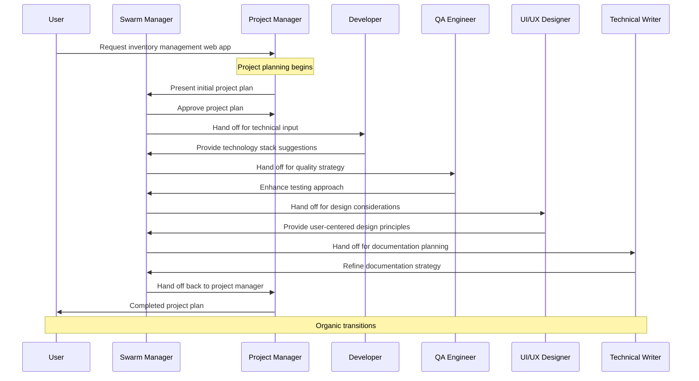

The simplest of the Swarm patterns, the Organic pattern utilizes entirely LLM-based transitions using the underlying Swarm Manager. The Swarm Manager uses the messages together with a set of the swarm's agent's [`description`](/docs/api-reference/autogen/ConversableAgent#description) fields to determine the next agent.

No hand-offs are specified as determining the next agent is solely done by the Swarm Manager. The shared context variables can still be used and updated via the agent's tools, though they don't play a role in determining the workflow.

This pattern excels in situations where conversation flow is unpredictable or where defining explicit rules would be overly complex. The organic approach creates a fluid user experience as different specialists naturally join the conversation when their expertise becomes relevant.

### Key Characteristics


The Organic Pattern creates a natural flow of agent interactions without explicit routing rules, allowing the system to adapt dynamically to conversation needs.

* **Natural Flow**: Transitions between agents happen organically based on the conversation context and content rather than predetermined paths.

* **Description-Based Routing**: The Swarm Manager selects the next agent based on agent descriptions and how well they match the current conversation needs.

* **Minimal Configuration**: No explicit handoff rules need to be defined, making this the simplest pattern to implement while maintaining sophisticated routing capabilities.

### Information Flow


In the Organic Pattern, information flows through the system based on content analysis and agent relevance, creating a fluid conversation experience that mimics natural human team collaboration.

* **Content Analysis**: The Swarm Manager analyzes each message to understand the context and requirements of the current conversation stage.

* **Agent Selection**: Based on this analysis, the system identifies and selects the most relevant specialist whose description best matches the current needs.

### Implementation

Our implementation using AG2's Swarm demonstrates the Organic Pattern with a team of specialized agents whose expertise areas are clearly defined in their descriptions, allowing the Swarm Manager to make intelligent routing decisions.

* **Descriptive Agent Profiles**: Each agent includes a detailed [`description`](/docs/api-reference/autogen/ConversableAgent#description) field that clearly outlines their domain expertise and when they should be activated. Note, the [`system_message`](/docs/api-reference/autogen/ConversableAgent#system-message) field will be used if an agent's [`description`](/docs/api-reference/autogen/ConversableAgent#description) field is not specified - however, it is better to define [`description`](/docs/api-reference/autogen/ConversableAgent#description) separately for use by the Swarm Manager, see the differences between [`description`](/docs/api-reference/autogen/ConversableAgent#description) and [`system_message`](/docs/api-reference/autogen/ConversableAgent#system-message) in the example below.

* **SWARM_MANAGER Configuration**: The implementation uses after_work=AfterWorkOption.SWARM_MANAGER to delegate all routing decisions to the Swarm Manager and we provide the Swarm Manager with an LLM through the `swarm_manager_args` parameter.

* **No Explicit Handoffs**: Unlike other patterns, no `register_hand_off` functions are required as the Swarm Manager handles all transitions automatically.

* **Shared Context**: While not used for routing decisions, shared context variables can still be used for maintaining state across different agents. In this example it's not used.

## Agent Flow



## Code

<Tip>
In this code example we use OpenAI's GPT-4o mini.
</Tip>

```python
from typing import Any, Dict, List, Optional
from autogen import ConversableAgent, UserProxyAgent, initiate_swarm_chat, AfterWorkOption, LLMConfig

# Setup LLM configuration
llm_config = LLMConfig(api_type="openai", model="gpt-4o-mini") # , temperature=0.2)

# Create specialized agents with descriptions that help the SWARM_MANAGER route appropriately
with llm_config:
  project_manager = ConversableAgent(
      name="project_manager",
      system_message="""You are a skilled project manager specializing in software development projects.
      You excel at creating project plans, setting milestones, managing timelines, allocating resources,
      conducting status meetings, and solving organizational problems.

      When responding to queries about project planning, timelines, resource allocation, risk management,
      or general project coordination, provide clear, structured guidance.

      You must utilize your experts: developer, qa_engineer, ui_ux_designer, and technical_writer to get the job done.
      """,
      description="""Answers questions about project planning, timelines,
      resource allocation, risk management, project coordination, team organization, and status updates.
      Call on this agent when the conversation involves planning, scheduling, task prioritization,
      or overall project management concerns.""",
  )

  developer = ConversableAgent(
      name="developer",
      system_message="""You are an expert software developer proficient in multiple programming languages
      and frameworks. You write clean, efficient code and can design robust software architectures.

      When asked for code solutions, architectural guidance, or implementation advice, provide
      practical, well-documented examples and explain your reasoning.

      You specialize in Python, JavaScript, cloud architecture, databases, and API development.
      """,
      description="""Answers questions about code implementation, programming languages,
      software architecture, technical solutions, APIs, databases, debugging, and development best practices.
      Call on this agent when the conversation involves writing or reviewing code, technical design decisions,
      or implementation approaches.""",
  )

  qa_engineer = ConversableAgent(
      name="qa_engineer",
      system_message="""You are a thorough QA engineer who specializes in software testing, quality
      assurance, and bug detection. You're skilled in creating test plans, writing test cases,
      performing manual and automated testing, and ensuring software meets quality standards.

      When addressing testing concerns, provide systematic approaches to verify functionality
      and identify potential issues.
      """,
      description="""Answers questions about testing strategies, test cases,
      quality assurance, bug detection, test automation, user acceptance testing, and software quality.
      Call on this agent when the conversation involves testing methodologies, quality concerns,
      finding bugs, or validating software functionality.""",
  )

  ui_ux_designer = ConversableAgent(
      name="ui_ux_designer",
      system_message="""You are a creative UI/UX designer with expertise in creating intuitive,
      accessible, and aesthetically pleasing user interfaces. You understand design principles,
      user research methodologies, and can create wireframes and mockups.

      When discussing design matters, focus on user-centered approaches and visual solutions
      that enhance user experience.
      """,
      description="""Answers questions about user interface design, user experience,
      visual design, wireframing, prototyping, usability, accessibility, and design systems.
      Call on this agent when the conversation involves design decisions, user interactions,
      visual elements, or user experience concerns.""",
  )

  technical_writer = ConversableAgent(
      name="technical_writer",
      system_message="""You are a skilled technical writer specializing in software documentation.
      You excel at creating clear, concise, and comprehensive documentation for various audiences,
      including user guides, API documentation, and technical specifications.

      When creating documentation, focus on clarity, completeness, and accessibility for the
      intended audience.
      """,
      description="""Answers questions about documentation, user guides,
      technical specifications, API docs, knowledge bases, and information architecture.
      Call on this agent when the conversation involves creating or improving documentation,
      explaining complex concepts, or organizing information for different audiences.""",
  )

# Create a user agent
user = UserProxyAgent(
    name="user_proxy",
    human_input_mode="ALWAYS",
    code_execution_config=False
)

# Initiate the swarm chat using a swarm manager who will
# select agents automatically based on descriptions
result, final_context, last_agent = initiate_swarm_chat(
    initial_agent=project_manager,
    agents=[project_manager, developer, qa_engineer, ui_ux_designer, technical_writer],
    messages="We need to create a new web application for inventory management. Let's start with a project plan.",
    max_rounds=15,
    swarm_manager_args={"llm_config": llm_config},
    after_work=AfterWorkOption.SWARM_MANAGER,
    user_agent=user
)
```

## Output

```console
user_proxy (to chat_manager):

We need to create a new web application for inventory management. Let's start with a project plan.

--------------------------------------------------------------------------------

Next speaker: project_manager


>>>>>>>> USING AUTO REPLY...
project_manager (to chat_manager):

Creating a project plan for a web application focused on inventory management involves several key steps. Below is a structured project plan that outlines the phases, milestones, tasks, and resources required.

### Project Plan for Inventory Management Web Application

#### 1. Project Objectives
- Develop a user-friendly web application for managing inventory.
- Ensure real-time tracking of inventory items.
- Implement a secure login and user authentication system.
- Facilitate reporting and analytics capabilities.

#### 2. Project Phases
- **Phase 1: Planning and Requirements Gathering**
- **Phase 2: Design**
- **Phase 3: Development**
- **Phase 4: Testing**
- **Phase 5: Deployment**
- **Phase 6: Maintenance and Support**

#### 3. Timeline and Milestones

| Phase                       | Tasks                                                    | Duration      | Milestones                          |
|----------------------------|---------------------------------------------------------|---------------|-------------------------------------|
| Phase 1: Planning          | - Hold kickoff meeting                                   | 1 week        | Project kickoff completed           |
|                            | - Gather requirements from stakeholders                  | 2 weeks       | Requirements document approved      |
|                            | - Define project scope and objectives                    | 1 week        | Scope document finalized            |
| Phase 2: Design            | - Create wireframes and UI designs                       | 2 weeks       | Design prototypes completed         |
|                            | - Review designs with stakeholders                       | 1 week        | Design feedback received            |
| Phase 3: Development       | - Setup development environment                          | 1 week        | Env. setup completed                |
|                            | - Develop frontend components                            | 4 weeks       | Frontend completed                  |
|                            | - Develop backend API functionalities                    | 4 weeks       | Backend API completed               |
|                            | - Integrate frontend and backend                         | 2 weeks       | Integration test completed          |
| Phase 4: Testing           | - Conduct unit testing                                   | 2 weeks       | Unit tests completed                |
|                            | - Perform user acceptance testing (UAT)                 | 2 weeks       | UAT completed                       |
|                            | - Fix identified issues                                  | 1 week        | Bugs fixed                          |
| Phase 5: Deployment        | - Prepare deployment environment                         | 1 week        | Deployment env. ready               |
|                            | - Deploy application to production                       | 1 week        | Application live                    |
| Phase 6: Maintenance       | - Monitor application performance                        | Ongoing       | Regular updates and maintenance     |
|                            | - Gather user feedback                                   | Ongoing       | Feedback loop established           |

#### 4. Resource Allocation

- **Project Manager:** Oversee project timeline, resource allocation, and communication.
- **Developer(s):** Responsible for coding the frontend and backend functionality.
- **QA Engineer:** Conduct testing, including unit testing and UAT.
- **UI/UX Designer:** Create the application’s interface and ensure user experience.
- **Technical Writer:** Develop documentation including user manuals and system documentation.

#### 5. Risk Management
- **Risk:** Scope creep from changing requirements.
  - **Mitigation:** Strict change control process.

- **Risk:** Delays in developing specific features due to technical challenges.
  - **Mitigation:** Regular technical reviews and prototype development.

- **Risk:** Ineffective communication among the team.
  - **Mitigation:** Weekly status meetings and updates.

#### 6. Regular Meetings
- **Kickoff Meeting:** To align the team and stakeholders on objectives.
- **Weekly Status Meetings:** To discuss progress, obstacles, and plans.
- **Review Meetings:** After each phase to evaluate outcomes and gather feedback.

### Next Steps
1. Schedule the kickoff meeting with stakeholders.
2. Assign team members to specific roles.
3. Start gathering detailed requirements.

This structured approach will help ensure that the project stays on track and that we meet the needs of stakeholders effectively. Let me know if you need any adjustments or additional details!

--------------------------------------------------------------------------------

Next speaker: developer


>>>>>>>> USING AUTO REPLY...
developer (to chat_manager):

Your project plan for the inventory management web application is comprehensive and well-structured. Below, I’ll provide some additional details and considerations to enhance the plan further, along with suggestions for the technology stack you might consider using.

### Additional Details

#### 1. Detailed Requirements Gathering
- **User Stories:** Collect user stories to capture the needs of end-users more effectively (e.g., "As a warehouse manager, I want to track stock levels in real-time so that I can make informed reordering decisions").
- **Feature List:** Break down features into core functionalities, such as adding/removing items, tracking item quantities, generating reports, and setting reorder levels.

#### 2. Design Considerations
- **Mobile Responsiveness:** Ensure that the application design is responsive to various screen sizes, as warehouse employees might be using mobile devices.
- **User Roles and Permissions:** Design the application to have different user roles (admin, warehouse staff, etc.) with varying permissions.

#### 3. Technology Stack Suggestions
- **Frontend:**
  - **Framework:** Consider using **React** or **Vue.js** for flexible and maintainable UI components.
  - **Styling:** Utilize a component library like **Material-UI** or **Bootstrap** for consistent styling.

- **Backend:**
  - **Framework:** Choose **Django** (Python) or **Node.js** (Express) for robust API development.
  - **Database:** Use **PostgreSQL** or **MongoDB** for structured or unstructured data storage respectively.

- **Authentication:** Implement an authentication solution like **OAuth** or **JWT** for secure user authentication.

- **Hosting/Deployment:**
  - Use cloud services such as **AWS**, **Azure**, or **Google Cloud Platform** for hosting the application.
  - Consider using **Docker** to containerize your application for easy deployment and scalability.

- **Real-time Updates:** Use WebSockets or libraries like **Socket.IO** if real-time updates of inventory are required.

### Enhancement of Testing Phase
- Implement **integration testing** to ensure components work together correctly.
- Conduct **load testing** to evaluate how the application performs under high usage scenarios.
- Prepare a **beta version** for a select group of users to gather early feedback.

### Maintenance and Support
- Develop a **support ticketing system** where users can report issues.
- Schedule regular check-ins with users to gather feedback post-deployment.
- Ensure that your team has a plan for regular updates and patch management.

### Additional Risk Management Strategies
- **Backup and Recovery:** Develop a backup strategy to protect data against loss.
- **Compliance:** Ensure the application complies with relevant guidelines (e.g., GDPR, HIPAA) if dealing with sensitive information.

### Next Steps
1. Finalize the technology stack based on team proficiency and project needs.
2. Expand on the wireframes and UI/UX designs in collaboration with stakeholders.
3. Create a detailed project timeline considering buffer time for unforeseen challenges.

With these additional considerations, you will be set to move forward with your inventory management web application in a structured and efficient manner. Let me know if you have any specific aspects you would like to explore further!

--------------------------------------------------------------------------------

Next speaker: qa_engineer


>>>>>>>> USING AUTO REPLY...
qa_engineer (to chat_manager):

Thank you for the additional insights and considerations to enhance the project plan. Here’s a consolidated approach that incorporates your suggestions while ensuring that we maintain a meticulous focus on quality assurance throughout the development lifecycle.

### Enhanced Project Plan for Inventory Management Web Application

#### 1. Detailed Requirements Gathering
- **User Stories:** Develop a comprehensive set of user stories with the involvement of key stakeholders to ensure all potential user scenarios are captured.
- **Feature List:** Categorize features into MVP (Minimum Viable Product) for initial release and future enhancements based on priority.

#### 2. Design Considerations
- **Mobile Responsiveness:** Create designs with responsive frameworks. Test designs over various devices to ensure usability.
- **User Roles and Permissions:** Define user roles including general permissions and role-specific functionalities to guide development.

#### 3. Technology Stack
- **Frontend:**
  - **React** or **Vue.js:** Allow for component-based design, making it easier to manage state and lifecycle.
  - **Material-UI** or **Bootstrap:** Ensures a consistent user interface across different devices.

- **Backend:**
  - **Django (Python)** or **Node.js (Express):** Each framework provides robust tools for API development.
  - **PostgreSQL** or **MongoDB:** Depending on the data nature, PostgreSQL offers relational data management while MongoDB serves for unstructured data.

- **Authentication:**
  - Implement **OAuth2** or **JWT** for secure access management.

- **Deployment:**
  - Use **Docker** to facilitate environment consistency and easier deployment.
  - Consider hosting on **AWS**, **Azure**, or **Google Cloud Platform** depending on the budget and required resources.

#### 4. Enhanced Testing Strategy
- **Unit Testing:** Initial deployment of unit tests during development for individual components.
- **Integration Testing:** Verify that combined parts of the application function correctly together.
- **User Acceptance Testing (UAT):** Gather user feedback during testing periods and incorporate necessary changes.
- **Load Testing:** Conduct to assess application performance under high traffic conditions, ensuring scalability.
- **Regression Testing:** Post any change, automatic tests to ensure existing functionalities remain unbroken.

#### 5. Maintenance and Support Enhancements
- **Support Ticketing System:** Implement a system to manage user-reported issues efficiently.
- **Regular User Check-ins:** Schedule meetings post-deployment to collect feedback for potential improvements.
- **Documentation:** Maintain technical documentation with updates aligned with application features for new team members.

#### 6. Risk Management Strategies
- **Scope Creep Control:** Maintain an active change request process to limit changes that could derail project timelines.
- **Data Backup and Recovery:** Set up defined procedures for data backups at regular intervals.
- **Compliance Audits:** Conduct regular audits to ensure compliance with data protection regulations (GDPR, HIPAA).

#### 7. Regular Meetings Framework
- **Weekly Status Updates:** Review progress, roadblocks, and pivot plans if necessary.
- **Phase Review Meetings:** After designing, developing, or testing phases to assess outcomes and gather feedback.

### Next Steps
1. Finalize and confirm the technology stack with the project team.
2. Begin developing a comprehensive design and wireframe based on user stories and feedback.
3. Schedule the initial project kickoff meeting to initiate requirement gathering and align all stakeholders.

With this enhanced project plan, we ensure a robust framework is in place to guide the development of the inventory management application with a strong focus on quality and user satisfaction. Should you have further areas to dive deeper into or additional topics to explore, please let me know!

--------------------------------------------------------------------------------

Next speaker: ui_ux_designer


>>>>>>>> USING AUTO REPLY...
ui_ux_designer (to chat_manager):

This enhanced project plan for the inventory management web application reflects a comprehensive, quality-focused approach that will support successful development and deployment. To further solidify and ensure we’re on the right track, here are a few suggestions and considerations that can complement your existing plan:

### 8. User-Centered Design Principles
- **User Personas:** Develop detailed user personas based on target users to better understand their needs, behaviors, and challenges. This will guide design decisions and feature priorities.
- **User Journey Mapping:** Facilitate the visualization of the user experience across various stages to identify pain points and improve overall usability.

### 9. Prototyping and Iteration
- **Prototyping:** Create high-fidelity prototypes using tools such as Figma or Adobe XD to simulate the application’s look and feel, enabling early feedback before development begins.
- **Iterative Feedback Cycle:** Plan for multiple iterations of the prototype based on user feedback, allowing for adjustments that can enhance user experience before the final design is approved.

### 10. Advanced Analytics and Reporting Features
- **Real-Time Analytics:** Incorporate capabilities for real-time data analytics that can provide insights into inventory levels, turnover rates, and more.
- **Customizable Reports:** Design a reporting feature where users can customize reports based on their specific needs, enhancing the application’s value.

### 11. Accessibility Considerations
- **Accessibility Standards:** Ensure compliance with Web Content Accessibility Guidelines (WCAG) to accommodate users with disabilities. This includes color contrast, screen reader compatibility, and keyboard navigation.
- **User Testing for Accessibility:** Involve users with varying abilities in the testing process to identify areas needing improvement from an accessibility standpoint.

### 12. Post-Deployment Metrics
- **Performance Metrics:** Define specific KPIs (Key Performance Indicators) for post-deployment evaluation, such as user engagement rates, error rates, and system performance.
- **User Feedback Mechanism:** Implement an in-app feedback option to collect user insights directly and continuously improve the application based on real-time data.

### 13. Documentation and Training
- **User Documentation:** Create comprehensive user manuals and quick-start guides to assist users in navigating the application efficiently.
- **Training Sessions:** Offer training sessions for users to familiarize them with the new system, highlighting key features, and addressing any concerns.

### 14. Future Scalability and Feature Roadmap
- **Scalability Planning:** Consider factors that will enable the application to scale, such as choosing modular technologies and cloud service scalability options.
- **Feature Roadmap:** Develop a long-term roadmap beyond the MVP to outline future enhancements based on user feedback and evolving business needs.

### Conclusion
By integrating these additional layers within the framework of your project plan, you can enhance user satisfaction, ensure accessibility, and provide robust support while maintaining alignment with business goals. These considerations will not only guide the development process but also foster a culture of continuous improvement and user focus.

Let me know if you have any further areas of inquiry or if you’d like assistance in any specific part of the design or development process!

--------------------------------------------------------------------------------

Next speaker: technical_writer


>>>>>>>> USING AUTO REPLY...
technical_writer (to chat_manager):

Thank you for the excellent suggestions! Integrating these user-centered design principles and additional considerations into our project plan will undoubtedly enhance the user experience and overall effectiveness of the inventory management web application. Below is a refined section of the project plan that incorporates your insights:

### Enhanced Project Plan for Inventory Management Web Application

#### 8. User-Centered Design Principles
- **User Personas:**
  - Develop detailed profiles representing target users, including warehouse managers, inventory clerks, and sales staff.
  - Incorporate their goals, frustrations, and motivations to tailor the application’s functionalities and design.

- **User Journey Mapping:**
  - Create visual representations of users' interactions with the application at various stages (e.g., onboarding to actual inventory management).
  - Identify key touchpoints and pain points to streamline user flows and enhance overall satisfaction.

#### 9. Prototyping and Iteration
- **Prototyping:**
  - Utilize tools like Figma or Adobe XD to create high-fidelity prototypes.
  - Include interactive elements to mimic user interactions for realistic feedback.

- **Iterative Feedback Cycle:**
  - Showcase prototypes to stakeholders and potential users for feedback.
  - Plan for multiple rounds of iterations, refining the design based on user insights to ensure usability and effectiveness before development.

#### 10. Advanced Analytics and Reporting Features
- **Real-Time Analytics:**
  - Develop dashboards providing up-to-date insights on inventory levels, sales trends, and reorder notifications.
  - Utilize visual data representation like graphs and charts.

- **Customizable Reports:**
  - Allow users to generate tailored reports, including parameters such as date ranges, categories, and inventory levels tailored to their specific operational needs.

#### 11. Accessibility Considerations
- **Accessibility Standards:**
  - Ensure design complies with WCAG guidelines for visual and functional accessibility (e.g., high color contrast, alternative text for images).

- **User Testing for Accessibility:**
  - Involve users with disabilities in the testing phases to provide insights and identify areas for improvement to ensure equitable access.

#### 12. Post-Deployment Metrics
- **Performance Metrics:**
  - Establish KPIs to evaluate the application's success, including user engagement rates, task completion times, and system uptime.

- **User Feedback Mechanism:**
  - Integrate an in-app feedback system for users to report issues or suggest improvements easily.
  - Regularly review feedback and prioritize actionable insights for future iterations.

#### 13. Documentation and Training
- **User Documentation:**
  - Develop comprehensive user manuals outlining all features and functionalities of the application.
  - Create quick-start guides for new users to help them adapt quickly.

- **Training Sessions:**
  - Organize hands-on training workshops for users post-deployment, focusing on application usage, highlighting key features, and addressing common challenges.

#### 14. Future Scalability and Feature Roadmap
- **Scalability Planning:**
  - Design the application using modular components and scalable architecture on a cloud platform to adapt to future enhancements and user growth.

- **Feature Roadmap:**
  - Outline a clear roadmap for future features beyond the MVP, using feedback gathered post-launch to prioritize enhancements that will drive user satisfaction.

#### Conclusion
By integrating these additional design recommendations and considerations, we can create an inventory management web application that exceeds user expectations while ensuring accessibility, usability, and future sustainability. This holistic approach fosters an environment for continuous feedback and improvement, enhancing the application's value both at launch and beyond.

If there are specific areas you'd like to further investigate or additional points you'd like to address, please don't hesitate to let me know!

--------------------------------------------------------------------------------

Next speaker: project_manager


>>>>>>>> USING AUTO REPLY...
project_manager (to chat_manager):

### Enhanced Project Plan for Inventory Management Web Application (Final Version)

#### Project Objectives
- Develop a user-centered, robust web application for managing inventory with features that cater to the diverse needs of various stakeholders.
- Ensure an application that is scalable, accessible, and equipped with reporting and analytics capabilities.

#### 1. User-Centered Design Principles
- **User Personas:** Create representative user profiles like warehouse managers, inventory clerks, and sales staff to guide design and feature prioritization.
- **User Journey Mapping:** Visualize user interactions throughout the application to identify touchpoints and improve usability.

#### 2. Prototyping and Iteration
- **Prototyping:** Use Figma or Adobe XD for high-fidelity interactive prototypes that simulate user experiences.
- **Iterative Feedback Cycle:** Gather feedback through prototype presentations to users and stakeholders, allowing for design refinements before development.

#### 3. Advanced Analytics and Reporting Features
- **Real-Time Analytics:** Implement dashboards for real-time inventory insights and visual data representation.
- **Customizable Reports:** Allow users to create reports tailored to their operational needs, selecting date ranges, categories, and more.

#### 4. Accessibility Considerations
- **Accessibility Standards:** Adhere to WCAG guidelines to ensure usability for individuals with disabilities, including features like high color contrast and screen reader compatibility.
- **User Testing for Accessibility:** Include individuals with diverse abilities in testing phases to enhance the application's accessibility and usability.

#### 5. Post-Deployment Metrics
- **Performance Metrics:** Set KPIs for user engagement and system performance, monitoring metrics like task completion rates and uptime.
- **User Feedback Mechanism:** Integrate an in-app system for real-time user feedback, regularly evaluating and prioritizing actionable insights.

#### 6. Documentation and Training
- **User Documentation:** Provide comprehensive manuals detailing application features and functionalities, along with quick-start guides for new users.
- **Training Sessions:** Conduct hands-on training workshops post-deployment to familiarize users with the application, emphasizing support for common challenges.

#### 7. Future Scalability and Feature Roadmap
- **Scalability Planning:** Utilize modular components and leverage cloud hosting to ensure the application can adapt to future demands.
- **Feature Roadmap:** Outline further enhancements based on user feedback, identifying features that will drive user satisfaction after initial launch.

#### 8. Regular Meetings Framework
- **Kickoff Meeting:** Align stakeholders on project objectives and initial requirements.
- **Weekly Status Updates:** Review project milestones, roadblocks, and pivot plans.
- **Phase Review Meetings:** Assess outcomes at the end of development phases, integrating feedback for future improvements.

#### Risk Management Strategies
- **Scope Creep Control:** Maintain a strict change request process.
- **Backup and Recovery:** Define a backup strategy for regular data protection.
- **Compliance Audits:** Ensure adherence to relevant data protection regulations.

### Conclusion
Integrating the above elements ensures a well-rounded project plan focused on user experience, accessibility, and future growth. This approach not only enhances the initiation of the project but sets the stage for long-term success and adaptability of the inventory management web application.

---

If you have any further inquiries regarding specific aspects of the project plan or need assistance with any additional topics, please feel free to ask!

--------------------------------------------------------------------------------

Next speaker: user_proxy

Replying as user_proxy. Provide feedback to chat_manager. Press enter to skip and use auto-reply, or type 'exit' to end the conversation:
```
