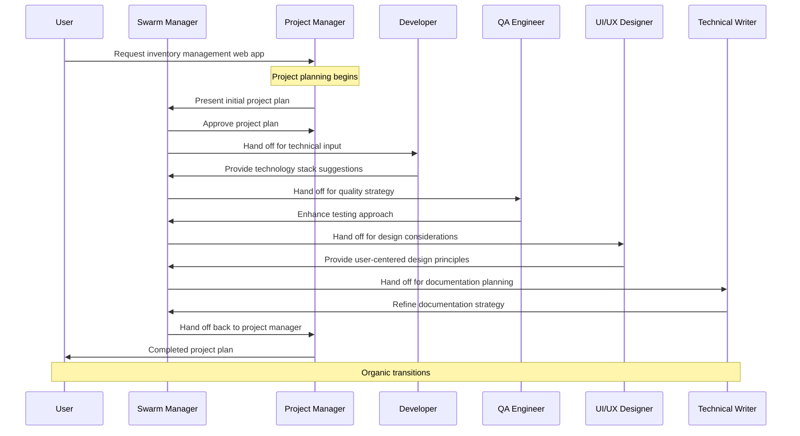

The simplest of the Group Chat patterns, the Organic pattern utilizes entirely LLM-based transitions using the underlying Group Chat Manager using the AutoPattern pattern. The Group Chat Manager uses the messages together with a set of the group chat's agent's [`description`](/docs/api-reference/autogen/ConversableAgent#description) fields to determine the next agent.

No hand-offs are specified as determining the next agent is solely done by the Group Chat Manager. The shared context variables can still be used and updated via the agent's tools, though they don't play a role in determining the workflow.

This pattern excels in situations where conversation flow is unpredictable or where defining explicit rules would be overly complex. The organic approach creates a fluid user experience as different specialists naturally join the conversation when their expertise becomes relevant.

### Key Characteristics


The Organic Pattern creates a natural flow of agent interactions without explicit routing rules, allowing the system to adapt dynamically to conversation needs.

* **Natural Flow**: Transitions between agents happen organically based on the conversation context and content rather than predetermined paths.

* **Description-Based Routing**: The Group Chat Manager selects the next agent based on agent descriptions and how well they match the current conversation needs.

* **Minimal Configuration**: No explicit handoff rules need to be defined, making this the simplest pattern to implement while maintaining sophisticated routing capabilities.

### Information Flow


In the Organic Pattern, information flows through the system based on content analysis and agent relevance, creating a fluid conversation experience that mimics natural human team collaboration.

* **Content Analysis**: The Group Chat Manager analyzes each message to understand the context and requirements of the current conversation stage.

* **Agent Selection**: Based on this analysis, the system identifies and selects the most relevant specialist whose description best matches the current needs.

### Implementation

Our implementation using AG2's Group Chat demonstrates the Organic Pattern with a team of specialized agents whose expertise areas are clearly defined in their descriptions, allowing the Group Chat Manager to make intelligent routing decisions.

* **Descriptive Agent Profiles**: Each agent includes a detailed [`description`](/docs/api-reference/autogen/ConversableAgent#description) field that clearly outlines their domain expertise and when they should be activated. Note, the [`system_message`](/docs/api-reference/autogen/ConversableAgent#system-message) field will be used if an agent's [`description`](/docs/api-reference/autogen/ConversableAgent#description) field is not specified - however, it is better to define [`description`](/docs/api-reference/autogen/ConversableAgent#description) separately for use by the Group Chat Manager, see the differences between [`description`](/docs/api-reference/autogen/ConversableAgent#description) and [`system_message`](/docs/api-reference/autogen/ConversableAgent#system-message) in the example below.

* **Group Chat Manager Configuration**: The implementation uses the GroupManagerTarget target for the chat's After Work to delegate all routing decisions to the Group Chat Manager and we provide the Group Chat Manager with an LLM through the `group_manager_args` parameter on the AutoPattern.

* **No Explicit Handoffs**: Unlike other patterns, no handoffs are required as the Group Chat Manager handles all transitions automatically.

* **Shared Context**: While not used for routing decisions, shared context variables can still be used for maintaining state across different agents. In this example it's not used.

## Agent Flow



## Code

<Tip>
In this code example we use OpenAI's GPT-4o mini.
</Tip>

```python
from autogen import ConversableAgent, UserProxyAgent, LLMConfig
from autogen.agentchat import initiate_group_chat
from autogen.agentchat.group.patterns import AutoPattern

# Setup LLM configuration
llm_config = LLMConfig(api_type="openai", model="gpt-4o-mini")

# Create specialized agents with descriptions that help the GROUP_MANAGER route appropriately
with llm_config:
  project_manager = ConversableAgent(
      name="project_manager",
      system_message="""You are a skilled project manager specializing in software development projects.
      You excel at creating project plans, setting milestones, managing timelines, allocating resources,
      conducting status meetings, and solving organizational problems.

      When responding to queries about project planning, timelines, resource allocation, risk management,
      or general project coordination, provide clear, structured guidance.

      You must utilize your experts: developer, qa_engineer, ui_ux_designer, and technical_writer to get the job done.
      """,
      description="""Answers questions about project planning, timelines,
      resource allocation, risk management, project coordination, team organization, and status updates.
      Call on this agent when the conversation involves planning, scheduling, task prioritization,
      or overall project management concerns.""",
  )

  developer = ConversableAgent(
      name="developer",
      system_message="""You are an expert software developer proficient in multiple programming languages
      and frameworks. You write clean, efficient code and can design robust software architectures.

      When asked for code solutions, architectural guidance, or implementation advice, provide
      practical, well-documented examples and explain your reasoning.

      You specialize in Python, JavaScript, cloud architecture, databases, and API development.
      """,
      description="""Answers questions about code implementation, programming languages,
      software architecture, technical solutions, APIs, databases, debugging, and development best practices.
      Call on this agent when the conversation involves writing or reviewing code, technical design decisions,
      or implementation approaches.""",
  )

  qa_engineer = ConversableAgent(
      name="qa_engineer",
      system_message="""You are a thorough QA engineer who specializes in software testing, quality
      assurance, and bug detection. You're skilled in creating test plans, writing test cases,
      performing manual and automated testing, and ensuring software meets quality standards.

      When addressing testing concerns, provide systematic approaches to verify functionality
      and identify potential issues.
      """,
      description="""Answers questions about testing strategies, test cases,
      quality assurance, bug detection, test automation, user acceptance testing, and software quality.
      Call on this agent when the conversation involves testing methodologies, quality concerns,
      finding bugs, or validating software functionality.""",
  )

  ui_ux_designer = ConversableAgent(
      name="ui_ux_designer",
      system_message="""You are a creative UI/UX designer with expertise in creating intuitive,
      accessible, and aesthetically pleasing user interfaces. You understand design principles,
      user research methodologies, and can create wireframes and mockups.

      When discussing design matters, focus on user-centered approaches and visual solutions
      that enhance user experience.
      """,
      description="""Answers questions about user interface design, user experience,
      visual design, wireframing, prototyping, usability, accessibility, and design systems.
      Call on this agent when the conversation involves design decisions, user interactions,
      visual elements, or user experience concerns.""",
  )

  technical_writer = ConversableAgent(
      name="technical_writer",
      system_message="""You are a skilled technical writer specializing in software documentation.
      You excel at creating clear, concise, and comprehensive documentation for various audiences,
      including user guides, API documentation, and technical specifications.

      When creating documentation, focus on clarity, completeness, and accessibility for the
      intended audience.
      """,
      description="""Answers questions about documentation, user guides,
      technical specifications, API docs, knowledge bases, and information architecture.
      Call on this agent when the conversation involves creating or improving documentation,
      explaining complex concepts, or organizing information for different audiences.""",
  )

# Create a user agent
user = UserProxyAgent(
    name="user_proxy",
    human_input_mode="ALWAYS",
    code_execution_config=False
)

# Create the agent pattern - AutoPattern uses the internal group chat manager
# to select agents automatically based on descriptions
agent_pattern = AutoPattern(
  initial_agent=project_manager,
    agents=[project_manager, developer, qa_engineer, ui_ux_designer, technical_writer],
    group_manager_args={"llm_config": llm_config},
    user_agent=user,
)

# Initiate the group chat with the pattern
result, final_context, last_agent = initiate_group_chat(
    pattern=agent_pattern,
    messages="We need to create a new web application for inventory management. Let's start with a project plan.",
    max_rounds=15,
)
```

## Output

```console
user_proxy (to chat_manager):

We need to create a new web application for inventory management. Let's start with a project plan.

--------------------------------------------------------------------------------

Next speaker: project_manager


>>>>>>>> USING AUTO REPLY...
project_manager (to chat_manager):

Creating a project plan for a web application focused on inventory management requires careful consideration of several elements, including scope, timelines, resources, and milestones. Below is a structured project plan outline that we can utilize:

### Project Plan Outline for Inventory Management Web Application

#### 1. **Project Overview**
   - **Project Name:** Inventory Management System
   - **Objective:** To develop a user-friendly web application to manage inventory effectively and efficiently.
   - **Stakeholders:**
      - Project Manager
      - Development Team
      - QA Team
      - UI/UX Design Team
      - Technical Writer

#### 2. **Scope of Work**
   - **Features to be Developed:**
     - User authentication (sign up, login, password recovery)
     - Inventory tracking (add, edit, delete items)
     - Reporting (generate inventory reports)
     - Notification system (low stock alerts)
     - User roles and permissions (admin, staff)
     - Integration with third-party services (if needed)
     - Responsive design for mobile/tablet access

#### 3. **Timeline**
   - **Project Duration:** 12 weeks
   - **Milestones:**
     - **Week 1-2:** Requirements gathering and finalization
     - **Week 3-4:** UI/UX design mockups and prototyping
     - **Week 5-8:** Development phase (backend and frontend)
     - **Week 9:** Integration and testing
     - **Week 10-11:** User acceptance testing (UAT)
     - **Week 12:** Final adjustments, documentation, and deployment

#### 4. **Resource Allocation**
   - **Core Team Members:**
     - **Developer(s):** 2 developers for backend and frontend
     - **QA Engineer:** 1 QA engineer for testing
     - **UI/UX Designer:** 1 UI/UX designer for interface design
     - **Technical Writer:** 1 technical writer for documentation
   - **Tooling Required:**
     - Development framework (e.g., React for frontend, Node.js for backend)
     - Database (e.g., PostgreSQL or MongoDB)
     - Project management tool (e.g., Jira, Trello)
     - Design tools (e.g., Figma, Adobe XD)
     - Testing tools (e.g., Selenium, Postman)

#### 5. **Risk Management**
   - **Potential Risks:**
     - Scope creep: Regularly review requirements with stakeholders.
     - Resource availability: Ensure backup resources are identified.
     - Technical challenges: Allocate time for troubleshooting during development.
     - Timelines delays: Implement buffer time in the project schedule.

#### 6. **Communication Plan**
   - **Status Meetings:** Weekly stand-ups to track progress and address blockers.
   - **Documentation:** Maintain an updated project wiki or document repository.
   - **Stakeholder Reporting:** Bi-weekly progress updates to stakeholders.

#### 7. **Project Closeout**
   - Conduct a retrospective meeting to capture lessons learned.
   - Finalize and distribute project documentation.
   - Transition support and maintenance post-deployment.

### Next Steps:
1. **Gather Requirements**: Organize a meeting with stakeholders to finalize the requirements.
2. **Assign Roles**: Identify team members' specific roles based on skills and availability.
3. **Kickoff Meeting**: Schedule a kickoff meeting to align everyone on the project plan.

Let me know if you would like to modify any section or need more details on specific parts!

--------------------------------------------------------------------------------

Next speaker: user_proxy

Replying as user_proxy. Provide feedback to chat_manager. Press enter to skip and use auto-reply, or type 'exit' to end the conversation: Proceed.
user_proxy (to chat_manager):

Proceed.

--------------------------------------------------------------------------------

Next speaker: project_manager


>>>>>>>> USING AUTO REPLY...
project_manager (to chat_manager):

Great! Let's proceed with the next steps outlined in the project plan. Here’s how we can initiate the project efficiently:

### Step 1: Gather Requirements
- **Action:** Schedule a dedicated requirements gathering session with stakeholders.
- **Participants:** Include key stakeholders such as users, product owners, and team members involved in the project.
- **Output:** Create a detailed requirements document capturing functional and non-functional requirements.

**Preparation:**
- Prepare a list of questions and topics to address during the requirement gathering (e.g., key features, user roles, reporting needs).
- Use collaboration tools (e.g., Miro, Google Docs) for live documentation during meetings.

### Step 2: Assign Roles
- **Action:** Assign specific roles to team members based on their skill set and availability.

**Team Roles:**
- **Development Team:**
  - Developer 1 (Frontend)
  - Developer 2 (Backend)

- **QA Team:**
  - QA Engineer

- **UI/UX Design Team:**
  - UI/UX Designer

- **Technical Writer:**
  - Technical Writer

### Step 3: Schedule a Kickoff Meeting
- **Action:** Schedule a project kickoff meeting to align the team on objectives and the project plan.
- **Agenda:**
  - Introduce the team
  - Review the project overview and objectives
  - Discuss the project plan and timelines
  - Clarify roles and responsibilities
  - Outline communication and reporting structure

### Step 4: Documentation of Requirements
- **Action:** Post-meeting, consolidate the requirements into a formal document and share it with all stakeholders for approval.

**Next Steps After Kickoff:**
1. **UI/UX Design Phase**
   - Initiate the design phase with the UI/UX designer to create mockups and prototypes based on gathered requirements.

2. **Development Phase Planning**
   - After design approval, schedule development sprints. Ensure that the development incorporates the agreed-upon UI/UX designs and specifications.

3. **Risk Assessment**
   - Conduct a risk assessment about potential challenges and mitigation strategies. Update the risk management log as the project progresses.

4. **Regular Check-ins & Updates**
   - Establish a rhythm of weekly check-ins to monitor progress, surface any blockers, and celebrate wins along the way.

Once the requirements are gathered and the kickoff meeting is complete, we’ll be well on our way to starting the design phase. Please confirm the next actions, and I can help in scheduling meetings or any additional tasks you need assistance with.

--------------------------------------------------------------------------------

Next speaker: user_proxy

Replying as user_proxy. Provide feedback to chat_manager. Press enter to skip and use auto-reply, or type 'exit' to end the conversation: Continue.
user_proxy (to chat_manager):

Continue.

--------------------------------------------------------------------------------

Next speaker: project_manager


>>>>>>>> USING AUTO REPLY...
project_manager (to chat_manager):

Excellent! Let’s move forward with the subsequent steps in our project plan. Here’s how we will continue with the project development process, specifically focusing on the UI/UX design phase and the initiation of development:

### Step 4: UI/UX Design Phase

1. **Design Kickoff**
   - **Action:** Organize a design kickoff meeting with the UI/UX designer to review the requirements document.
   - **Objective:** Ensure that the designer understands the user journey, requirements, and any constraints.
   - **Expected Outcome:** Initial design concepts and user flow diagrams.

2. **Creating Mockups and Prototypes**
   - **Action:** The UI/UX designer will create wireframes and interactive prototypes based on the requirements.
   - **Timeline:** Allocate 2 weeks for designing and iterating upon feedback.
   - **Tools:** Use design tools such as Figma or Adobe XD for creating mockups.

3. **Review Design**
   - **Action:** Organize a review meeting with stakeholders and the development team to present design mockups.
   - **Feedback Process:** Collect feedback and make necessary adjustments as per stakeholder inputs.

4. **Finalize Design Assets**
   - **Action:** Once approved, the designer will prepare design assets (icons, images, style guides) for the development team.
   - **Output:** A fully approved design that will guide the development process.

### Step 5: Development Phase Planning

1. **Sprint Planning**
   - **Action:** Schedule a sprint planning meeting with the development team to break down tasks based on the finalized design.
   - **Sprint Duration:** Organize the work into 2-week sprints.
   - **Task Prioritization:** Utilize backlog items for the product that align with the most critical functionalities.

2. **Development Setup**
   - **Action:** Ensure the development environment is set up, including:
     - Version control (e.g., Git repository)
     - Development frameworks and libraries based on the tech stack (React, Node.js, etc.)
     - Database setup and configuration (PostgreSQL or MongoDB)

3. **Implementation and Regular Check-ins**
   - **Action:** Begin the first sprint for development.
   - **Check-ins:** Conduct daily stand-up meetings to track progress and address any blockers.

### Step 6: Testing Phase Preparation

1. **Define Testing Strategy**
   - **Action:** Collaborate with the QA engineer to define the testing strategy early in the development phase.
   - **Types of Testing:** Plan for unit tests, integration tests, and user acceptance tests (UAT).

2. **Testing Tools Setup**
   - **Action:** Identify and set up any necessary testing tools (e.g., Selenium for automated testing).

### Step 7: Communication and Progress Reporting

1. **Regular Status Updates**
   - **Action:** Schedule weekly status updates with the entire team. This will include sharing updates on progress, challenges faced, and next steps.
   - **Documentation:** Keep an updated project dashboard (e.g., using Jira or Trello) for all team members to view progress and tasks.

2. **Stakeholder Communication**
   - **Action:** Prepare bi-weekly progress reports for stakeholders and schedule check-ins to keep them aligned.

### Next Steps:
- Confirm the schedule for the design kickoff meeting and sprint planning session.
- Initiate communications with the UI/UX designer regarding the requirements document.
- Ensure all team members are aware of their roles and timelines.

If you have specific dates in mind for meetings or need templates for any of the documents mentioned (like the requirements or design review), please let me know, and I will assist you further in those preparations!

--------------------------------------------------------------------------------

Next speaker: ui_ux_designer


>>>>>>>> USING AUTO REPLY...
ui_ux_designer (to chat_manager):

Great! Moving forward with these steps will set a solid foundation for the project. Here's a concise summarization with action items and suggestions to keep things organized:

### Next Steps: Implementation Plan

#### 1. Schedule Design Kickoff Meeting
   - **Participants:** UI/UX Designer, Project Manager, Key Stakeholders
   - **Action Items:**
     - Create an agenda focused on user journeys, requirements, and constraints.
     - Prepare any necessary visual aids or examples to stimulate discussion.

#### 2. Begin UI/UX Design Creation
   - **Timeline:** Set a period of 2 weeks for initial mockups and prototypes.
   - **Communication with the Designer:**
     - Confirm productivity tools (Figma/Adobe XD) to be used.
     - Set up regular check-ins for progress during this phase.

#### 3. Schedule Sprint Planning Meeting
   - **Participants:** Development Team, Project Manager, QA Engineer
   - **Action Items:**
     - Prepare a list of user stories based on finalized designs.
     - Prioritize tasks according to the project roadmap established in the kickoff.

#### 4. Development Environment Preparation
   - **Action Items:**
     - Ensure version control is configured and accessible.
     - Confirm technology stack and database setup are established by the start of the development phase.

#### 5. Establish Continuous Feedback Loop
   - **Daily Stand-ups:** Initiate brief catch-ups with the development team to promote transparency and collaboration.
   - **Weekly Status Updates:** Keep the entire team informed about progress, blockers, and next steps.

#### 6. Prepare Testing Strategy
   - **Collaborate with QA:** Work with the QA engineer during the design phase to align on key testing functionalities.
   - **Testing Tools:** Identify tools for unit and integration testing early on to prepare for development output.

#### 7. Document Progress and Communication
   - **Regular Updates:** Start maintaining a project dashboard for ease of access to project status for all members.
   - **Bi-weekly Stakeholder Reports:** Draft templates for periodic updates, ensuring stakeholders remain in the loop.

### Additional Considerations
- **Feedback Mechanism:** Establish a clear process for how feedback will be collected after design reviews.
- **Version Control Guidelines:** Ensure there is a clear guideline for the development team on how to manage branches and merging.
- **User Stories Format:** Adopt a consistent format (e.g., “As a [user], I want [feature], so that [benefit].”) for documenting user stories.

By addressing both the UI/UX design and the development planning simultaneously while ensuring open lines of communication, the project will advance smoothly through the initial stages.

Please confirm the dates and times for the meetings or any modifications needed, and I'll assist you in setting stuff up accordingly!

--------------------------------------------------------------------------------

Next speaker: project_manager


>>>>>>>> USING AUTO REPLY...
project_manager (to chat_manager):

Thank you for the detailed implementation plan! Your concise summarization will certainly help in maintaining structure and clarity as we move forward. Here’s how we can proceed with action items and set up meetings:

### Action Items and Scheduling

#### 1. **Schedule Design Kickoff Meeting**
   - **Proposed Date:** [Insert Date]
   - **Proposed Time:** [Insert Time, with time zone]
   - **Duration:** 1 hour
   - **Agenda:**
     - Introduction to project objectives and requirements
     - Discussion on user journeys and constraints
     - Agree on timelines for design deliverables

#### 2. **Begin UI/UX Design Creation**
   - **Timeline:** Deadline for mockups and prototypes should be set for [Insert Date, two weeks from kickoff].
   - **Productivity Tools:** Confirm the use of Figma for collaboration.
   - **Regular Check-ins:** Propose a weekly check-in (e.g., every [insert day of the week] at [insert time]).

#### 3. **Schedule Sprint Planning Meeting**
   - **Proposed Date:** [Insert Date, ideally after design approval]
   - **Proposed Time:** [Insert Time]
   - **Duration:** 1.5 hours
   - **Action Items:**
     - Develop user stories based on finalized UI/UX designs.

#### 4. **Development Environment Preparation**
   - **Target Completion:** [Insert Date, before development starts].
   - **Action Items:**
     - Confirm setup of version control on GitHub/GitLab.
     - Ensure a readme is available to guide the setup.

#### 5. **Establish a Continuous Feedback Loop**
   - **Daily Stand-ups:** Propose a time (e.g., 10:00 AM daily) for a 15-minute sync.
   - **Weekly Status Update Meetings:** Schedule for [Insert Day of the Week].

#### 6. **Prepare Testing Strategy**
   - **Initial Collaboration Meeting:** Schedule with the QA engineer as soon as designs are in progress.
   - **Focus on Key Functionalities:** Identify critical user flows for testing.

#### 7. **Document Progress and Communication**
   - **Project Dashboard Setup:** Identify a platform (e.g., Jira/Trello) for real-time tracking of tasks.
   - **Bi-weekly Stakeholder Reports:** Draft a template for updates to send to stakeholders.

### Next Steps:
- **Confirmation:** Please review and confirm the proposed dates, times, and details for each meeting.
- **Invite Schedule:** I can assist in sending out calendar invites and reminders once the dates are confirmed.
- **Feedback Collection Process:** Determine the best platform (e.g., Google Forms, Slack) for collecting feedback after design reviews.

Once we confirm the meeting schedules and other details, we can integrate this into the project management tools and start making progress. If you have any preferences for the exact dates/times or anything else, just let me know!

--------------------------------------------------------------------------------

Next speaker: user_proxy

Replying as user_proxy. Provide feedback to chat_manager. Press enter to skip and use auto-reply, or type 'exit' to end the conversation: exit
```
