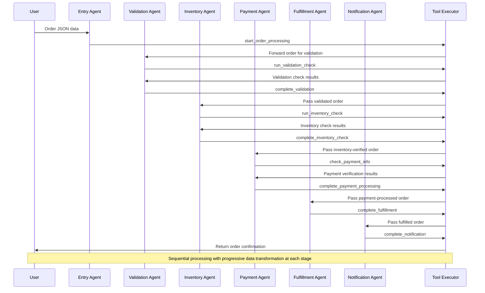

The Pipeline Pattern is a powerful orchestration approach that organizes agents into a linear sequence where each agent performs a specific transformation on data before passing it to the next agent in the chain. This pattern mirrors traditional assembly lines or data processing pipelines where information flows through a series of specialized stages, with each stage adding value or transforming the data in some way. Like an assembly line in manufacturing, the Pipeline Pattern maximizes efficiency by allowing each agent to focus exclusively on its specialized task.

### Key Characteristics


The Pipeline Pattern creates a streamlined, sequential processing flow where data moves through a series of specialized transformations. Each agent in the pipeline receives input from its predecessor, performs its specific processing, and passes the result to its successor. This approach simplifies complex workflows by breaking them into discrete, manageable stages.

* **Specialized Stages**: Each agent in the pipeline specializes in a specific type of data transformation or processing task, focusing exclusively on its area of expertise.

* **Unidirectional Flow**: Information typically flows in one direction from the beginning to the end of the pipeline, with clear handoffs between stages.

* **Progressive Refinement**: Data is progressively refined, enhanced, and transformed as it moves through each stage, with each agent building upon the work of previous agents.

* **Well-Defined Interfaces**: Each agent has clear expectations about the format and content of both its inputs and outputs, ensuring smooth transitions between stages.

### Information Flow


In the Pipeline Pattern, information flows along a predetermined path, creating a predictable sequence of transformations. The pattern enforces a disciplined approach to data processing, where each stage contributes its specific expertise to the evolving data. This linear progression ensures that data undergoes all necessary transformations in the correct order, with each agent focusing solely on its specialized processing.

The workflow begins with raw input data entering the first stage of the pipeline. Each agent applies its specific transformation before passing the enriched data to the next agent. This continues until the data reaches the final stage, which produces the fully processed output. If an error occurs at any point, the pipeline can terminate early, with error information flowing back to the user rather than proceeding to subsequent stages.

* **Sequential Progression**: Data moves through a predetermined sequence of processing stages, with each agent receiving, transforming, and passing data forward.

* **Transformation Focus**: Each stage applies its specialized expertise to the data, progressively refining it toward the final output.

* **Accumulative Value**: Each transformation builds upon previous ones, with the data becoming more refined and complete as it progresses through the pipeline.

### Implementation

Our implementation using AG2's Swarm demonstrates the Pipeline Pattern in an e-commerce order processing workflow. We've created a linear sequence of specialized agents that process an order from initial receipt through notification. The implementation showcases how complex workflows can be broken into discrete, manageable stages with clear responsibilities and interfaces.

The pipeline begins with an Entry Agent that receives the order data and initiates processing. The order then flows sequentially through specialized stages: Validation checks the order's correctness, Inventory verifies item availability, Payment processes the transaction, Fulfillment prepares shipping instructions, and finally, Notification sends confirmation to the customer. Each agent focuses exclusively on its stage of the process, applying its specialized transformation before passing the enhanced data to the next agent.

* **Structured Data Models**: Pydantic models define the input/output for each stage, creating clear contracts between pipeline stages and ensuring type safety.

* **Stage-Specific Functions**: Each processing stage has dedicated functions that transform the input, update the shared context, and determine whether to proceed or terminate with an error.

* **Strategic Handoffs**: AfterWork handlers and context variables manage transitions between agents, with SwarmResult directing the flow based on each stage's outcome.

The Pipeline Pattern excels at tasks requiring sequential processing with progressive refinement, particularly when the output of one stage naturally serves as the input to the next. This makes it ideal for workflows like document processing, approval sequences, and e-commerce transactions where data needs to undergo a series of distinct transformations in a specific order.

## Agent Flow



## Code

<Tip>
In this code example we use OpenAI's GPT-4o mini with structured outputs.

We also set the LLM parameter `parallel_tool_calls` to False so that our agents don't recommend more than one tool call at a time. This parameter may not be available with all model providers.
</Tip>

```python
import json
from typing import Optional
from pydantic import BaseModel, Field
from autogen import (
    ConversableAgent,
    UserProxyAgent,
    LLMConfig,
)
from autogen.agentchat import initiate_group_chat
from autogen.agentchat.group.patterns import DefaultPattern
from autogen.agentchat.group import AgentTarget, AgentNameTarget, OnContextCondition, ContextExpression, ExpressionContextCondition, ReplyResult, ContextVariables, RevertToUserTarget

# E-commerce order processing pipeline
# Each agent handles a specific stage of order processing in sequence

# Setup LLM configuration
llm_config = LLMConfig(api_type="openai", model="gpt-4o-mini", parallel_tool_calls=False, cache_seed=None)

# Shared context for tracking order processing state
shared_context = ContextVariables(data={
    # Pipeline state
    "pipeline_started": False,
    "pipeline_completed": False,

    # Stage completion tracking
    "validation_completed": False,
    "inventory_completed": False,
    "payment_completed": False,
    "fulfillment_completed": False,
    "notification_completed": False,

    # Order data
    "order_details": {},
    "validation_results": {},
    "inventory_results": {},
    "payment_results": {},
    "fulfillment_results": {},
    "notification_results": {},

    # Error state
    "has_error": False,
    "error_message": "",
    "error_stage": ""
})

# Pydantic models for pipeline stages
class ValidationResult(BaseModel):
    is_valid: bool = Field(..., description="Boolean indicating if the order passed validation")
    error_message: Optional[str] = Field(None, description="Explanation if validation failed")
    validation_details: Optional[dict] = Field(None, description="Any additional validation information")

class InventoryResult(BaseModel):
    items_available: bool = Field(..., description="Boolean indicating if all items are available")
    error_message: Optional[str] = Field(None, description="Explanation if any items are out of stock")
    reserved_items: Optional[list] = Field(None, description="Details of items reserved for this order")

class PaymentResult(BaseModel):
    payment_successful: bool = Field(..., description="Boolean indicating if payment was processed successfully")
    error_message: Optional[str] = Field(None, description="Explanation if payment failed")
    transaction_details: Optional[dict] = Field(None, description="Details of the payment transaction")

class FulfillmentResult(BaseModel):
    fulfillment_instructions: str = Field(..., description="Detailed instructions for order fulfillment")
    shipping_details: str = Field(..., description="Information about shipping method, tracking, etc.")
    estimated_delivery: str = Field(..., description="Expected delivery timeframe")

class NotificationResult(BaseModel):
    notification_sent: bool = Field(..., description="Boolean indicating if notification was sent")
    notification_method: str = Field(..., description="Method used to notify the customer (email, SMS, etc.)")
    notification_content: str = Field(..., description="Content of the notification message")

# Pipeline stage functions
def start_order_processing(order_json: str, context_variables: ContextVariables) -> ReplyResult:
    """Start the order processing pipeline with provided order details JSON string"""
    context_variables["pipeline_started"] = True

    # Parse the order JSON
    try:
        order_details = json.loads(order_json)
        context_variables["order_details"] = order_details

        return ReplyResult(
            message=f"Order processing started for Order #{order_details.get('order_id', 'Unknown')}",
            context_variables=context_variables,
            target=AgentNameTarget("validation_agent")
        )
    except json.JSONDecodeError:
        context_variables["has_error"] = True
        context_variables["error_message"] = "Invalid order JSON format"
        context_variables["error_stage"] = "entry"

        return ReplyResult(
            message="Failed to process order: Invalid JSON format",
            context_variables=context_variables,
            target=RevertToUserTarget()
        )

def run_validation_check(context_variables: ContextVariables) -> str:
    """Run the validation check for the order"""
    return "Validation check completed successfully."

def complete_validation(validation_result: ValidationResult, context_variables: ContextVariables) -> ReplyResult:
    """Complete the validation stage and pass to inventory check"""
    # Store the validation result in context variables
    context_variables["validation_results"] = validation_result.model_dump()
    context_variables["validation_completed"] = True

    # Check if validation failed
    if not validation_result.is_valid:
        context_variables["has_error"] = True
        context_variables["error_message"] = validation_result.error_message or "Validation failed"
        context_variables["error_stage"] = "validation"

        return ReplyResult(
            message=f"Validation failed: {validation_result.error_message or 'Unknown error'}",
            context_variables=context_variables,
            target=RevertToUserTarget()
        )

    return ReplyResult(
        message="Order validated successfully. Proceeding to inventory check.",
        context_variables=context_variables,
        target=AgentNameTarget("inventory_agent")
    )

def run_inventory_check(context_variables: ContextVariables) -> str:
    """Run the inventory check for the order"""
    return "Inventory check completed successfully."

def complete_inventory_check(inventory_result: InventoryResult, context_variables: ContextVariables) -> ReplyResult:
    """Complete the inventory check stage and pass to payment processing"""
    # Store the inventory result in context variables
    context_variables["inventory_results"] = inventory_result.model_dump()
    context_variables["inventory_completed"] = True

    # Check if inventory check failed
    if not inventory_result.items_available:
        context_variables["has_error"] = True
        context_variables["error_message"] = inventory_result.error_message or "Inventory check failed"
        context_variables["error_stage"] = "inventory"

        return ReplyResult(
            message=f"Inventory check failed: {inventory_result.error_message or 'Unknown error'}",
            context_variables=context_variables,
            target=RevertToUserTarget()
        )

    return ReplyResult(
        message="Inventory check completed successfully. Proceeding to payment processing.",
        context_variables=context_variables,
        target=AgentNameTarget("payment_agent")
    )

def check_payment_info(context_variables: ContextVariables) -> str:
    """Check the payment information for the order"""
    return "Payment information verified successfully."

def complete_payment_processing(payment_result: PaymentResult, context_variables: ContextVariables) -> ReplyResult:
    """Complete the payment processing stage and pass to fulfillment"""
    # Store the payment result in context variables
    context_variables["payment_results"] = payment_result.model_dump()
    context_variables["payment_completed"] = True

    # Check if payment processing failed
    if not payment_result.payment_successful:
        context_variables["has_error"] = True
        context_variables["error_message"] = payment_result.error_message or "Payment processing failed"
        context_variables["error_stage"] = "payment"

        return ReplyResult(
            message=f"Payment processing failed: {payment_result.error_message or 'Unknown error'}",
            context_variables=context_variables,
            target=RevertToUserTarget()
        )

    return ReplyResult(
        message="Payment processed successfully. Proceeding to order fulfillment.",
        context_variables=context_variables,
        target=AgentNameTarget("fulfillment_agent")
    )

def complete_fulfillment(fulfillment_result: FulfillmentResult, context_variables: ContextVariables) -> ReplyResult:
    """Complete the fulfillment stage and pass to notification"""
    # Store the fulfillment result in context variables
    context_variables["fulfillment_results"] = fulfillment_result.model_dump()
    context_variables["fulfillment_completed"] = True

    return ReplyResult(
        message="Order fulfillment completed. Proceeding to customer notification.",
        context_variables=context_variables,
        target=AgentNameTarget("notification_agent")
    )

def complete_notification(notification_result: NotificationResult, context_variables: ContextVariables) -> ReplyResult:
    """Complete the notification stage and finish the pipeline"""
    # Store the notification result in context variables
    context_variables["notification_results"] = notification_result.model_dump()
    context_variables["notification_completed"] = True
    context_variables["pipeline_completed"] = True

    return ReplyResult(
        message="Customer notification sent. Order processing completed successfully.",
        context_variables=context_variables,
        target=RevertToUserTarget()
    )

# Pipeline agents
with llm_config:
    entry_agent = ConversableAgent(
        name="entry_agent",
        system_message="""You are the entry point for the e-commerce order processing pipeline.
        Your task is to receive the order details and start the order processing.

        When you receive an order in JSON format, you should:
        1. Extract the full JSON string from the message
        2. Use the start_order_processing tool with the complete JSON string
        3. Do not modify or reformat the JSON

        The order details will be in a valid JSON format containing information about the customer, items, payment, etc.""",
        functions=[start_order_processing]
    )

    validation_agent = ConversableAgent(
        name="validation_agent",
        system_message="""You are the validation stage of the order processing pipeline.

        Your specific role is to validate the order details before further processing.
        Focus on:
        - Running a validation check, using the run_validation_check tool

        When submitting your results, create a ValidationResult object with:
        - is_valid: boolean indicating if the order passed validation
        - error_message: explanation if validation failed (optional)
        - validation_details: any additional validation information (optional)

        Always use the run_validation_check tool before using the complete_validation tool to submit your ValidationResult and move the order to the next stage.""",
        functions=[run_validation_check, complete_validation]
    )

    inventory_agent = ConversableAgent(
        name="inventory_agent",
        system_message="""You are the inventory stage of the order processing pipeline.

        Your specific role is to check if all items in the order are available in inventory.
        Focus on:
        - Running an inventory check using the run_inventory_check tool
        - Verifying each item's availability
        - Checking if requested quantities are in stock
        - Reserving the items for this order
        - Updating inventory counts

        When submitting your results, create an InventoryResult object with:
        - items_available: boolean indicating if all items are available
        - error_message: explanation if any items are out of stock (optional)
        - reserved_items: details of items reserved for this order (optional)

        Always use the run_inventory_check tool to do an inventory check before using the complete_inventory_check tool to submit your InventoryResult and move the order to the next stage.""",
        functions=[run_inventory_check, complete_inventory_check]
    )

    payment_agent = ConversableAgent(
        name="payment_agent",
        system_message="""You are the payment processing stage of the order processing pipeline.

        Your specific role is to process the payment for the order.
        Focus on:
        - Running the check_payment_info tool to check the validity of the payment information
        - Verifying payment information
        - Processing the payment transaction
        - Recording payment details
        - Handling payment errors or rejections

        When submitting your results, create a PaymentResult object with:
        - payment_successful: boolean indicating if payment was processed successfully
        - error_message: explanation if payment failed (optional)
        - transaction_details: details of the payment transaction (optional)

        Always use the check_payment_info tool before running the complete_payment_processing tool to submit your PaymentResult and move the order to the next stage.""",
        functions=[check_payment_info, complete_payment_processing]
    )

    fulfillment_agent = ConversableAgent(
        name="fulfillment_agent",
        system_message="""You are the fulfillment stage of the order processing pipeline.

        Your specific role is to create fulfillment instructions for the order.
        Focus on:
        - Creating picking instructions for warehouse staff
        - Generating shipping labels
        - Selecting appropriate packaging
        - Determining shipping method based on customer selection

        When submitting your results, create a FulfillmentResult object with:
        - fulfillment_instructions: detailed instructions for order fulfillment
        - shipping_details: information about shipping method, tracking, etc.
        - estimated_delivery: expected delivery timeframe

        Always use the complete_fulfillment tool to submit your FulfillmentResult and move the order to the next stage.""",
        functions=[complete_fulfillment]
    )

    notification_agent = ConversableAgent(
        name="notification_agent",
        system_message="""You are the notification stage of the order processing pipeline.

        Your specific role is to notify the customer about their order status.
        Focus on:
        - Creating a clear order confirmation message
        - Including all relevant order details
        - Providing shipping and tracking information
        - Setting expectations for next steps

        When submitting your results, create a NotificationResult object with:
        - notification_sent: boolean indicating if notification was sent
        - notification_method: method used to notify the customer (email, SMS, etc.)
        - notification_content: content of the notification message

        Always use the complete_notification tool to submit your NotificationResult and complete the order processing pipeline.""",
        functions=[complete_notification]
    )

# User agent for interaction
user = UserProxyAgent(
    name="user",
    code_execution_config=False
)

# Register handoffs for the pipeline
# Entry agent starts the pipeline
entry_agent.handoffs.add_context_condition(
    OnContextCondition(
        target=AgentTarget(validation_agent),
        condition=ExpressionContextCondition(ContextExpression("${pipeline_started} == True and ${validation_completed} == False"))
    ),
)
entry_agent.handoffs.set_after_work(RevertToUserTarget())

# Validation agent passes to Inventory agent if validation succeeds
validation_agent.handoffs.set_after_work(RevertToUserTarget())

# Inventory agent passes to Payment agent if inventory check succeeds
inventory_agent.handoffs.set_after_work(RevertToUserTarget())

# Payment agent passes to Fulfillment agent if payment succeeds
payment_agent.handoffs.set_after_work(RevertToUserTarget())

# Fulfillment agent passes to Notification agent
fulfillment_agent.handoffs.set_after_work(AgentTarget(notification_agent))

# Notification agent finishes the pipeline and returns to user
notification_agent.handoffs.set_after_work(RevertToUserTarget())

# Run the pipeline
def run_pipeline_pattern():
    """Run the pipeline pattern for e-commerce order processing"""
    print("Initiating Pipeline Pattern for E-commerce Order Processing...")

    # Sample order to process
    sample_order = {
        "order_id": "ORD-12345",
        "customer": {
            "id": "CUST-789",
            "name": "Jane Smith",
            "email": "jane.smith@example.com",
            "phone": "555-123-4567",
            "shipping_address": {
                "street": "123 Main St",
                "city": "Anytown",
                "state": "CA",
                "zip": "90210",
                "country": "USA"
            },
            "billing_address": {
                "street": "123 Main St",
                "city": "Anytown",
                "state": "CA",
                "zip": "90210",
                "country": "USA"
            }
        },
        "order_items": [
            {
                "item_id": "PROD-001",
                "name": "Smartphone XYZ",
                "quantity": 1,
                "price": 699.99
            },
            {
                "item_id": "PROD-042",
                "name": "Phone Case",
                "quantity": 2,
                "price": 24.99
            }
        ],
        "shipping_method": "express",
        "payment_info": {
            "method": "credit_card",
            "card_last_four": "4242",
            "amount": 749.97,
            "currency": "USD"
        },
        "promocode": "SUMMER10",
        "order_date": "2025-03-08T14:30:00Z"
    }

    sample_order_json = json.dumps(sample_order)

    agent_pattern = DefaultPattern(
        initial_agent=entry_agent,
        agents=[
            entry_agent,
            validation_agent,
            inventory_agent,
            payment_agent,
            fulfillment_agent,
            notification_agent
        ],
        user_agent=user,
        context_variables=shared_context,
    )

    chat_result, final_context, last_agent = initiate_group_chat(
        pattern=agent_pattern,
        messages=f"Please process this order through the pipeline:\n\n{sample_order_json}",
        max_rounds=30,
    )

    if final_context["pipeline_completed"]:
        print("Order processing completed successfully!")
        print("\n===== ORDER PROCESSING SUMMARY =====\n")
        print(f"Order ID: {final_context['order_details'].get('order_id')}")
        print(f"Customer: {final_context['order_details'].get('customer', {}).get('name')}")
        print(f"Total Amount: ${final_context['order_details'].get('payment_info', {}).get('amount')}")

        # Show the progression through pipeline stages
        print("\n===== PIPELINE PROGRESSION =====\n")
        print(f"Validation: {'✅ Passed' if final_context['validation_results'].get('is_valid') else '❌ Failed'}")
        print(f"Inventory: {'✅ Available' if final_context['inventory_results'].get('items_available') else '❌ Unavailable'}")
        print(f"Payment: {'✅ Successful' if final_context['payment_results'].get('payment_successful') else '❌ Failed'}")
        print(f"Fulfillment: {'✅ Completed' if 'fulfillment_results' in final_context else '❌ Not reached'}")
        print(f"Notification: {'✅ Sent' if final_context['notification_results'].get('notification_sent') else '❌ Not sent'}")

        # Display shipping information
        if 'fulfillment_results' in final_context:
            print("\n===== SHIPPING INFORMATION =====\n")
            print(f"Shipping Method: {final_context['fulfillment_results'].get('shipping_details', '')}")
            print(f"Estimated Delivery: {final_context['fulfillment_results'].get('estimated_delivery')}")

        print("\n\n===== SPEAKER ORDER =====\n")
        for message in chat_result.chat_history:
            if "name" in message and message["name"] != "_Group_Tool_Executor":
                print(f"{message['name']}")
    else:
        print("Order processing did not complete successfully.")
        if final_context["has_error"]:
            print(f"Error during {final_context['error_stage']} stage: {final_context['error_message']}")

if __name__ == "__main__":
    run_pipeline_pattern()
```

## Output

```console
Initiating Pipeline Pattern for E-commerce Order Processing...
user (to chat_manager):

Please process this order through the pipeline:

{"order_id": "ORD-12345", "customer": {"id": "CUST-789", "name": "Jane Smith", "email": "jane.smith@example.com", "phone": "555-123-4567", "shipping_address": {"street": "123 Main St", "city": "Anytown", "state": "CA", "zip": "90210", "country": "USA"}, "billing_address": {"street": "123 Main St", "city": "Anytown", "state": "CA", "zip": "90210", "country": "USA"}}, "order_items": [{"item_id": "PROD-001", "name": "Smartphone XYZ", "quantity": 1, "price": 699.99}, {"item_id": "PROD-042", "name": "Phone Case", "quantity": 2, "price": 24.99}], "shipping_method": "express", "payment_info": {"method": "credit_card", "card_last_four": "4242", "amount": 749.97, "currency": "USD"}, "promocode": "SUMMER10", "order_date": "2025-03-08T14:30:00Z"}

--------------------------------------------------------------------------------

Next speaker: entry_agent


>>>>>>>> USING AUTO REPLY...
entry_agent (to chat_manager):

***** Suggested tool call (call_lRGPvXdVtnqeQ5ncz18bNzNF): start_order_processing *****
Arguments:
{"order_json":"{\"order_id\": \"ORD-12345\", \"customer\": {\"id\": \"CUST-789\", \"name\": \"Jane Smith\", \"email\": \"jane.smith@example.com\", \"phone\": \"555-123-4567\", \"shipping_address\": {\"street\": \"123 Main St\", \"city\": \"Anytown\", \"state\": \"CA\", \"zip\": \"90210\", \"country\": \"USA\"}, \"billing_address\": {\"street\": \"123 Main St\", \"city\": \"Anytown\", \"state\": \"CA\", \"zip\": \"90210\", \"country\": \"USA\"}}, \"order_items\": [{\"item_id\": \"PROD-001\", \"name\": \"Smartphone XYZ\", \"quantity\": 1, \"price\": 699.99}, {\"item_id\": \"PROD-042\", \"name\": \"Phone Case\", \"quantity\": 2, \"price\": 24.99}], \"shipping_method\": \"express\", \"payment_info\": {\"method\": \"credit_card\", \"card_last_four\": \"4242\", \"amount\": 749.97, \"currency\": \"USD\"}, \"promocode\": \"SUMMER10\", \"order_date\": \"2025-03-08T14:30:00Z\"}"}
***************************************************************************************

--------------------------------------------------------------------------------

Next speaker: _Group_Tool_Executor


>>>>>>>> EXECUTING FUNCTION start_order_processing...
Call ID: call_lRGPvXdVtnqeQ5ncz18bNzNF
Input arguments: {'order_json': '{"order_id": "ORD-12345", "customer": {"id": "CUST-789", "name": "Jane Smith", "email": "jane.smith@example.com", "phone": "555-123-4567", "shipping_address": {"street": "123 Main St", "city": "Anytown", "state": "CA", "zip": "90210", "country": "USA"}, "billing_address": {"street": "123 Main St", "city": "Anytown", "state": "CA", "zip": "90210", "country": "USA"}}, "order_items": [{"item_id": "PROD-001", "name": "Smartphone XYZ", "quantity": 1, "price": 699.99}, {"item_id": "PROD-042", "name": "Phone Case", "quantity": 2, "price": 24.99}], "shipping_method": "express", "payment_info": {"method": "credit_card", "card_last_four": "4242", "amount": 749.97, "currency": "USD"}, "promocode": "SUMMER10", "order_date": "2025-03-08T14:30:00Z"}'}
_Group_Tool_Executor (to chat_manager):

***** Response from calling tool (call_lRGPvXdVtnqeQ5ncz18bNzNF) *****
Order processing started for Order #ORD-12345
**********************************************************************

--------------------------------------------------------------------------------

Next speaker: validation_agent


>>>>>>>> USING AUTO REPLY...
validation_agent (to chat_manager):

***** Suggested tool call (call_G9hvnRUPVCIDuY08c1WOc16l): run_validation_check *****
Arguments:
{}
*************************************************************************************

--------------------------------------------------------------------------------

Next speaker: _Group_Tool_Executor


>>>>>>>> EXECUTING FUNCTION run_validation_check...
Call ID: call_G9hvnRUPVCIDuY08c1WOc16l
Input arguments: {}
_Group_Tool_Executor (to chat_manager):

***** Response from calling tool (call_G9hvnRUPVCIDuY08c1WOc16l) *****
Validation check completed successfully.
**********************************************************************

--------------------------------------------------------------------------------

Next speaker: validation_agent


>>>>>>>> USING AUTO REPLY...
validation_agent (to chat_manager):

***** Suggested tool call (call_x7SK1809Lag1rduuvbe7158e): complete_validation *****
Arguments:
{"validation_result":{"is_valid":true}}
************************************************************************************

--------------------------------------------------------------------------------

Next speaker: _Group_Tool_Executor


>>>>>>>> EXECUTING FUNCTION complete_validation...
Call ID: call_x7SK1809Lag1rduuvbe7158e
Input arguments: {'validation_result': {'is_valid': True}}
_Group_Tool_Executor (to chat_manager):

***** Response from calling tool (call_x7SK1809Lag1rduuvbe7158e) *****
Order validated successfully. Proceeding to inventory check.
**********************************************************************

--------------------------------------------------------------------------------

Next speaker: inventory_agent


>>>>>>>> USING AUTO REPLY...
inventory_agent (to chat_manager):

***** Suggested tool call (call_gVZK493aZUjdyqqRXHTygbQc): run_inventory_check *****
Arguments:
{}
************************************************************************************

--------------------------------------------------------------------------------

Next speaker: _Group_Tool_Executor


>>>>>>>> EXECUTING FUNCTION run_inventory_check...
Call ID: call_gVZK493aZUjdyqqRXHTygbQc
Input arguments: {}
_Group_Tool_Executor (to chat_manager):

***** Response from calling tool (call_gVZK493aZUjdyqqRXHTygbQc) *****
Inventory check completed successfully.
**********************************************************************

--------------------------------------------------------------------------------

Next speaker: inventory_agent


>>>>>>>> USING AUTO REPLY...
inventory_agent (to chat_manager):

***** Suggested tool call (call_zgcR96Y0mAxPjQD1XA0cX7Bl): complete_inventory_check *****
Arguments:
{"inventory_result":{"items_available":true,"reserved_items":[{"item_id":"PROD-001","quantity":1},{"item_id":"PROD-042","quantity":2}]}}
*****************************************************************************************

--------------------------------------------------------------------------------

Next speaker: _Group_Tool_Executor


>>>>>>>> EXECUTING FUNCTION complete_inventory_check...
Call ID: call_zgcR96Y0mAxPjQD1XA0cX7Bl
Input arguments: {'inventory_result': {'items_available': True, 'reserved_items': [{'item_id': 'PROD-001', 'quantity': 1}, {'item_id': 'PROD-042', 'quantity': 2}]}}
_Group_Tool_Executor (to chat_manager):

***** Response from calling tool (call_zgcR96Y0mAxPjQD1XA0cX7Bl) *****
Inventory check completed successfully. Proceeding to payment processing.
**********************************************************************

--------------------------------------------------------------------------------

Next speaker: payment_agent


>>>>>>>> USING AUTO REPLY...
payment_agent (to chat_manager):

***** Suggested tool call (call_Ug9Bsjf7I2i8BPD4ej3ifonm): check_payment_info *****
Arguments:
{}
***********************************************************************************

--------------------------------------------------------------------------------

Next speaker: _Group_Tool_Executor


>>>>>>>> EXECUTING FUNCTION check_payment_info...
Call ID: call_Ug9Bsjf7I2i8BPD4ej3ifonm
Input arguments: {}
_Group_Tool_Executor (to chat_manager):

***** Response from calling tool (call_Ug9Bsjf7I2i8BPD4ej3ifonm) *****
Payment information verified successfully.
**********************************************************************

--------------------------------------------------------------------------------

Next speaker: payment_agent


>>>>>>>> USING AUTO REPLY...
payment_agent (to chat_manager):

***** Suggested tool call (call_FMcK9XYNynvtjYaMxaH5H4W5): complete_payment_processing *****
Arguments:
{"payment_result":{"payment_successful":true,"transaction_details":{"transaction_id":"TX123456789","amount":749.97,"currency":"USD"}}}
********************************************************************************************

--------------------------------------------------------------------------------

Next speaker: _Group_Tool_Executor


>>>>>>>> EXECUTING FUNCTION complete_payment_processing...
Call ID: call_FMcK9XYNynvtjYaMxaH5H4W5
Input arguments: {'payment_result': {'payment_successful': True, 'transaction_details': {'transaction_id': 'TX123456789', 'amount': 749.97, 'currency': 'USD'}}}
_Group_Tool_Executor (to chat_manager):

***** Response from calling tool (call_FMcK9XYNynvtjYaMxaH5H4W5) *****
Payment processed successfully. Proceeding to order fulfillment.
**********************************************************************

--------------------------------------------------------------------------------

Next speaker: fulfillment_agent


>>>>>>>> USING AUTO REPLY...
fulfillment_agent (to chat_manager):

***** Suggested tool call (call_Lx7wiuKPAIYMPEsgmfac9qdk): complete_fulfillment *****
Arguments:
{"fulfillment_result":{"fulfillment_instructions":"1. Pick the following items: \n   - 1x Smartphone XYZ (Item ID: PROD-001) \n   - 2x Phone Case (Item ID: PROD-042) \n2. Verify the quantities against the order. \n3. Pack the items securely: \n   - Use a padded envelope for the Phone Cases and a sturdy box for the Smartphone. \n4. Label the shipment with the following details: \n   - Recipient: Jane Smith \n   - Address: 123 Main St, Anytown, CA, 90210, USA \n   - Phone: 555-123-4567 \n5. Select Express shipping as per customer's choice. \n6. Ensure the shipping label is affixed properly and include the invoice inside the package.","shipping_details":"Shipping Method: Express\nTracking will be provided via email once the package has shipped.","estimated_delivery":"Estimated delivery is 1-2 business days."}}
*************************************************************************************

--------------------------------------------------------------------------------

Next speaker: _Group_Tool_Executor


>>>>>>>> EXECUTING FUNCTION complete_fulfillment...
Call ID: call_Lx7wiuKPAIYMPEsgmfac9qdk
Input arguments: {'fulfillment_result': {'fulfillment_instructions': "1. Pick the following items: \n   - 1x Smartphone XYZ (Item ID: PROD-001) \n   - 2x Phone Case (Item ID: PROD-042) \n2. Verify the quantities against the order. \n3. Pack the items securely: \n   - Use a padded envelope for the Phone Cases and a sturdy box for the Smartphone. \n4. Label the shipment with the following details: \n   - Recipient: Jane Smith \n   - Address: 123 Main St, Anytown, CA, 90210, USA \n   - Phone: 555-123-4567 \n5. Select Express shipping as per customer's choice. \n6. Ensure the shipping label is affixed properly and include the invoice inside the package.", 'shipping_details': 'Shipping Method: Express\nTracking will be provided via email once the package has shipped.', 'estimated_delivery': 'Estimated delivery is 1-2 business days.'}}
_Group_Tool_Executor (to chat_manager):

***** Response from calling tool (call_Lx7wiuKPAIYMPEsgmfac9qdk) *****
Order fulfillment completed. Proceeding to customer notification.
**********************************************************************

--------------------------------------------------------------------------------

Next speaker: notification_agent


>>>>>>>> USING AUTO REPLY...
notification_agent (to chat_manager):

***** Suggested tool call (call_ANfywzcdQvGsBLOc7KjoD0Yr): complete_notification *****
Arguments:
{"notification_result":{"notification_sent":true,"notification_method":"email","notification_content":"Order Confirmation\n\nDear Jane Smith,\n\nThank you for your order! Here are the details:\n\n**Order ID:** ORD-12345  \n**Order Date:** March 8, 2025  \n\n**Order Items:**  \n- Smartphone XYZ (1) - $699.99  \n- Phone Case (2) - $49.98  \n\n**Total Amount:** $749.97  \n**Payment Method:** Credit Card (****4242)  \n\n**Shipping Address:**  \n123 Main St  \nAnytown, CA 90210  \nUSA  \n\n**Shipping Method:** Express  \n\n**Estimated Delivery:** 1-2 business days from dispatch  \n\nOnce your order has been dispatched, we will send you an email with tracking details.\n\nThank you for choosing us!\n\nBest regards,  \nYour Company Name"}}
**************************************************************************************

--------------------------------------------------------------------------------

Next speaker: _Group_Tool_Executor


>>>>>>>> EXECUTING FUNCTION complete_notification...
Call ID: call_ANfywzcdQvGsBLOc7KjoD0Yr
Input arguments: {'notification_result': {'notification_sent': True, 'notification_method': 'email', 'notification_content': 'Order Confirmation\n\nDear Jane Smith,\n\nThank you for your order! Here are the details:\n\n**Order ID:** ORD-12345  \n**Order Date:** March 8, 2025  \n\n**Order Items:**  \n- Smartphone XYZ (1) - $699.99  \n- Phone Case (2) - $49.98  \n\n**Total Amount:** $749.97  \n**Payment Method:** Credit Card (****4242)  \n\n**Shipping Address:**  \n123 Main St  \nAnytown, CA 90210  \nUSA  \n\n**Shipping Method:** Express  \n\n**Estimated Delivery:** 1-2 business days from dispatch  \n\nOnce your order has been dispatched, we will send you an email with tracking details.\n\nThank you for choosing us!\n\nBest regards,  \nYour Company Name'}}
_Group_Tool_Executor (to chat_manager):

***** Response from calling tool (call_ANfywzcdQvGsBLOc7KjoD0Yr) *****
Customer notification sent. Order processing completed successfully.
**********************************************************************

--------------------------------------------------------------------------------

Next speaker: user

Replying as user. Provide feedback to chat_manager. Press enter to skip and use auto-reply, or type 'exit' to end the conversation: exit

>>>>>>>> TERMINATING RUN (3754ea15-31da-4d82-9b34-dbb7dd9faac4): User requested to end the conversation

>>>>>>>> TERMINATING RUN (c38f365a-a875-4c7f-a7b0-0dc14b4bb011): No reply generated
Order processing completed successfully!

===== ORDER PROCESSING SUMMARY =====

Order ID: ORD-12345
Customer: Jane Smith
Total Amount: $749.97

===== PIPELINE PROGRESSION =====

Validation: ✅ Passed
Inventory: ✅ Available
Payment: ✅ Successful
Fulfillment: ✅ Completed
Notification: ✅ Sent

===== SHIPPING INFORMATION =====

Shipping Method: Shipping Method: Express
Tracking will be provided via email once the package has shipped.
Estimated Delivery: Estimated delivery is 1-2 business days.


===== SPEAKER ORDER =====

user
entry_agent
validation_agent
validation_agent
inventory_agent
inventory_agent
payment_agent
payment_agent
fulfillment_agent
notification_agent
```
