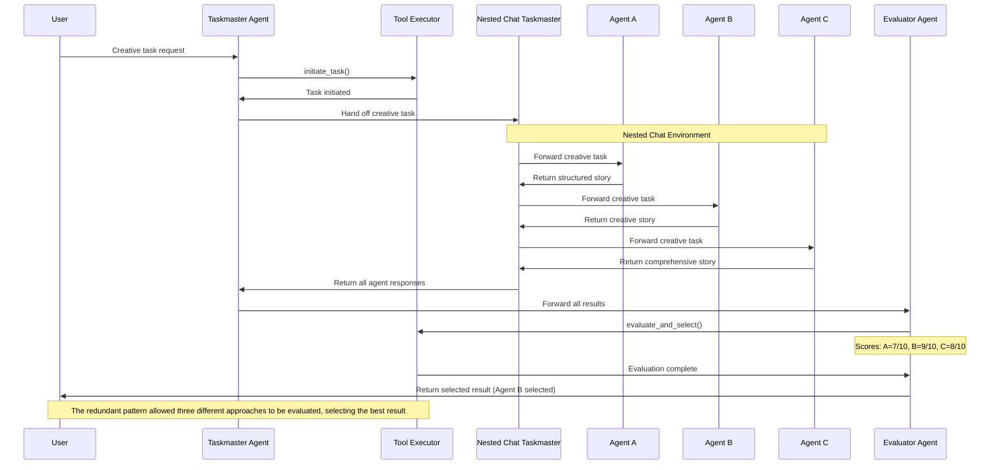

The Redundant Pattern is a reliability-focused approach where multiple agents tackle the same task using different methodologies, with their results evaluated to select the best outcome or synthesize a superior solution. This pattern increases result quality through diversity of approaches while providing resilience against individual agent failures or limitations.

### Key Characteristics


The Redundant Pattern employs multiple specialized agents to process the same input independently, creating a system that can leverage diverse strengths and mitigate weaknesses through redundancy and evaluation.

* **Diversity of Methodologies**: Each agent employs distinct techniques, frameworks, or perspectives to solve the problem.

* **Comprehensive Evaluation**: Results undergo thorough assessment against domain-appropriate criteria.

* **Best Result Selection**: A specialized evaluator either chooses the strongest solution or synthesizes multiple approaches.

* **Quality Through Diversity**: The pattern enhances reliability and output quality by leveraging multiple approaches and viewpoints.

### Information Flow


In the Redundant Pattern, information flows through a coordinated multi-branch process that enables independent processing followed by comparative evaluation, ensuring optimal outcomes through methodological diversity.

* **Dispatch Phase**: A central coordinator distributes the same task to multiple specialized agents through an isolated nested chat where each agent has access to only the task message.

* **Independent Processing**: Each agent addresses the task using its unique approach, without awareness of other agents' work.

* **Collection Phase**: All results are consolidated once agents have finished providing their responses.

* **Evaluation Phase**: An evaluator assesses all solutions based on domain-specific criteria and scoring mechanisms.

* **Selection or Synthesis**: The evaluator either selects the best individual solution or creates a composite result combining strengths from multiple approaches.

### Implementation

Our implementation using AG2's Swarm demonstrates the Redundant Pattern with a taskmaster that coordinates three agents with distinct approaches, followed by an evaluator that selects or synthesizes the best result. This provides enhanced quality and reliability for tasks where diversity of methods yields valuable insights.

* **Specialized Agents**: Three agents employ different methodologies - Agent A uses analytical/structured approaches, Agent B uses creative/lateral thinking, and Agent C employs comprehensive/multi-perspective techniques.

* **Nested Chat**: By using a nested chat, the agents can be isolated from the information in the broader orchestration, allowing only the task to be provided to them to respond to.

* **Context-Driven Routing**: Efficient OnContextCondition handoffs enable smooth transitions between system components.

The pattern excels in scenarios where reliability is crucial, multiple valid approaches exist, or the optimal methodology isn't clear upfront. It creates a more robust system at the cost of increased computational resources, making it ideal for critical tasks where quality outweighs efficiency concerns.

## Agent Flow



## Code

<Tip>
In this code example we use OpenAI's GPT-4o mini with structured outputs.

We also set the LLM parameter `parallel_tool_calls` to False so that our agents don't recommend more than one tool call at a time. This parameter may not be available with all model providers.
</Tip>

```python
from typing import Any, Annotated
from autogen import (
    ConversableAgent,
    UserProxyAgent,
    register_hand_off,
    OnContextCondition,
    AfterWork,
    AfterWorkOption,
    initiate_swarm_chat,
    ContextExpression,
    SwarmResult,
    LLMConfig,
)

# Redundant Pattern:
# Multiple agents attempt the same task using different approaches,
# then results are compared to select the best outcome or combine strengths
# Agents respond in isolation through a nested chat

# Setup LLM configuration
llm_config = LLMConfig(api_type="openai", model="gpt-4o-mini", cache_seed=None)

# Shared context for tracking the conversation and redundant agent results
shared_context = {
    # Process state
    "task_initiated": False,
    "task_completed": False,
    "evaluation_complete": False,

    # Task tracking
    "current_task": "",
    "task_type": None,  # Can be "creative", "problem_solving", "factual", etc.
    "approach_count": 0,

    # Results from different agents
    "agent_a_result": None,
    "agent_b_result": None,
    "agent_c_result": None,

    # Evaluation metrics
    "evaluation_scores": {},
    "final_result": None,
    "selected_approach": None,

    # Error state (not handled but could be used to route to an error agent)
    "has_error": False,
    "error_message": "",
    "error_source": ""
}

# Function to initiate task processing
def initiate_task(
    task: Annotated[str, "The task to be processed by multiple agents"],
    task_type: Annotated[str, "Type of task: 'creative', 'problem_solving', 'factual', etc."],
    context_variables: dict[str, Any]
) -> SwarmResult:
    """
    Initiate processing of a task across multiple redundant agents with different approaches
    """
    context_variables["task_initiated"] = True
    context_variables["task_completed"] = False
    context_variables["evaluation_complete"] = False
    context_variables["current_task"] = task
    context_variables["task_type"] = task_type

    # Reset previous results
    context_variables["agent_a_result"] = None
    context_variables["agent_b_result"] = None
    context_variables["agent_c_result"] = None
    context_variables["evaluation_scores"] = {}
    context_variables["final_result"] = None
    context_variables["selected_approach"] = None

    return SwarmResult(
        values=f"Task initiated: '{task}' (Type: {task_type}). Will process with multiple independent approaches.",
        context_variables=context_variables
    )

# Function for evaluator provide their evaluation and select the best result
def evaluate_and_select(
    evaluation_notes: Annotated[str, "Detailed evaluation of each agent's result"],
    score_a: Annotated[int, "Score for Agent A's approach (1-10 scale)"],
    score_b: Annotated[int, "Score for Agent B's approach (1-10 scale)"],
    score_c: Annotated[int, "Score for Agent C's approach (1-10 scale)"],
    selected_result: Annotated[str, "The selected or synthesized final result"],
    selection_rationale: Annotated[str, "Explanation for why this result was selected or how it was synthesized"],
    context_variables: dict[str, Any]
) -> SwarmResult:
    """
    Evaluate the different approaches and select or synthesize the best result
    """
    # Create scores dictionary from individual parameters
    scores = {
        "agent_a": score_a,
        "agent_b": score_b,
        "agent_c": score_c
    }

    context_variables["evaluation_notes"] = evaluation_notes
    context_variables["evaluation_scores"] = scores
    context_variables["final_result"] = selected_result
    context_variables["evaluation_complete"] = True

    # Determine which approach was selected (highest score)
    max_score = 0
    selected_approach = None
    for agent, score in scores.items():
        if score > max_score:
            max_score = score
            selected_approach = agent
    context_variables["selected_approach"] = selected_approach

    return SwarmResult(
        values=f"Evaluation complete. Selected result: {selection_rationale[:100]}...",
        context_variables=context_variables,
        agent=AfterWorkOption.REVERT_TO_USER
    )

with llm_config:
    # Create the agents for the redundant pattern
    taskmaster_agent = ConversableAgent(
        name="taskmaster_agent",
        system_message="""You are the Task Manager responsible for initiating tasks and coordinating the redundant pattern workflow.

        Your role is to:
        1. Understand the user's request and frame it as a clear task
        2. Determine the appropriate task type (creative, problem_solving, factual)
        3. Initiate the task to be processed by multiple independent agents
        4. Return to the user with the final selected or synthesized result

        For each request:
        1. Use the initiate_task tool to start the process
        2. After all agents have submitted their results and evaluation is complete, present the final result to the user

        Always explain to the user that their task is being processed by multiple approaches to ensure the best possible outcome.""",
        functions=[initiate_task]
    )

    # Define the agent names so we can refer to them in the context variables
    redundant_agent_names = ["agent_a", "agent_b", "agent_c"]

    agent_a = ConversableAgent(
        name="agent_a",
        system_message="""You are Agent A, specializing in a structured, analytical approach to tasks.

        For creative tasks:
        - Use structured frameworks and established patterns
        - Follow proven methodologies and best practices
        - Focus on clarity, organization, and logical progression

        For problem-solving tasks:
        - Use first principles thinking and systematic analysis
        - Break down problems into component parts
        - Consider established solutions and scientific approaches

        For factual information:
        - Prioritize objective, verifiable data
        - Present information in a structured, hierarchical manner
        - Focus on accuracy and comprehensiveness

        Always identify your approach clearly and explain your methodology as part of your response.""",
    )

    agent_b = ConversableAgent(
        name="agent_b",
        system_message="""You are Agent B, specializing in a creative, lateral-thinking approach to tasks.

        For creative tasks:
        - Use metaphors, analogies, and unexpected connections
        - Think outside conventional frameworks
        - Explore unique perspectives and novel combinations

        For problem-solving tasks:
        - Use creative ideation and divergent thinking
        - Look for non-obvious connections and innovative approaches
        - Consider unconventional solutions outside the mainstream

        For factual information:
        - Present information through narratives and examples
        - Use contextual understanding and practical applications
        - Focus on making information relatable and engaging

        Always identify your approach clearly and explain your methodology as part of your response.""",
    )

    agent_c = ConversableAgent(
        name="agent_c",
        system_message="""You are Agent C, specializing in a thorough, comprehensive approach to tasks.

        For creative tasks:
        - Combine multiple perspectives and diverse inputs
        - Draw from cross-disciplinary knowledge and varied examples
        - Focus on thoroughness and covering all possible angles

        For problem-solving tasks:
        - Consider multiple solution pathways simultaneously
        - Evaluate trade-offs and present alternative approaches
        - Focus on robustness and addressing edge cases

        For factual information:
        - Present multiple perspectives and nuanced views
        - Include historical context and future implications
        - Focus on depth and breadth of coverage

        Always identify your approach clearly and explain your methodology as part of your response.""",
    )

    evaluator_agent = ConversableAgent(
        name="evaluator_agent",
        system_message="""You are the Evaluator Agent responsible for assessing multiple approaches to the same task and selecting or synthesizing the best result.

        Your role is to:
        1. Carefully review each approach and result
        2. Evaluate each solution based on criteria appropriate to the task type
        3. Assign scores to each approach on a scale of 1-10
        4. Either select the best approach or synthesize a superior solution by combining strengths

        For creative tasks, evaluate based on:
        - Originality and uniqueness
        - Effectiveness in addressing the creative brief
        - Quality of execution and coherence

        For problem-solving tasks, evaluate based on:
        - Correctness and accuracy
        - Efficiency and elegance
        - Comprehensiveness and robustness

        For factual tasks, evaluate based on:
        - Accuracy and correctness
        - Comprehensiveness and depth
        - Clarity and organization

        When appropriate, rather than just selecting a single approach, synthesize a superior solution by combining the strengths of multiple approaches.

        Use the evaluate_and_select tool to submit your final evaluation, including detailed scoring and rationale.""",
        functions=[evaluate_and_select]
    )

# User agent for interaction
user = UserProxyAgent(
    name="user",
    code_execution_config=False
)

# NESTED CHAT
# Isolates each agent's message history so they only see the task and no other agents' responses

def extract_task_message(recipient: ConversableAgent, messages: list[dict[str, Any]], sender: ConversableAgent, config) -> str:
    """Extracts the task to give to an agent as the task"""
    return sender.get_context("current_task", "There's no task, return UNKNOWN.")

def record_agent_response(sender: ConversableAgent, recipient: ConversableAgent, summary_args: dict) -> str:
    """Record each nested agent's response, track completion, and prepare for evaluation"""

    # Update the context variable with the agent's response
    context_var_key = f"{recipient.name.lower()}_result"
    taskmaster_agent.set_context(context_var_key, recipient.chat_messages[sender][-1]["content"])

    # Increment the approach counter
    taskmaster_agent.set_context("approach_count", taskmaster_agent.get_context("approach_count") + 1)

    # Track if we now have all results
    task_completed = all(taskmaster_agent.get_context(f"{key}_result") is not None
                        for key in redundant_agent_names)
    taskmaster_agent.set_context("task_completed", task_completed)

    if not task_completed:
        # Still have outstanding responses to gather, in this nested chat only the last message is returned
        # to the outer swarm
        return ""
    else:
        # All agents have provided their responses
        # Combine all responses into a single message for the evaluator to evaluate
        combined_responses = "\n".join(
            [f"agent_{agent_name}:\n{taskmaster_agent.get_context(f'{agent_name}_result')}\n\n---"
             for agent_name in redundant_agent_names]
        )

        return combined_responses

# Create the chat queue for the nested chats
redundant_agent_queue = []
for agent in [agent_a, agent_b, agent_c]:
    nested_chat = {
        "recipient": agent,
        "message": extract_task_message,  # Retrieve the status details of the order using the order id
        "max_turns": 1,  # Only one turn is necessary
        "summary_method": record_agent_response,  # Return each agent's response in context variables
    }

    redundant_agent_queue.append(nested_chat)

# HANDOFFS

# Register handoffs for the redundant pattern
register_hand_off(
    agent=taskmaster_agent,
    hand_to=[
        # Nested chat to get responses from all agents if the task is not completed
        OnContextCondition(
            target={
                "chat_queue": redundant_agent_queue,
            },
            condition=ContextExpression("len(${agent_a_result}) == 0 or len(${agent_b_result}) == 0 or len(${agent_c_result}) == 0"),
            available=ContextExpression("${task_initiated} == True and len(${current_task}) > 0 and ${task_completed} == False")
        ),
        # Transition to evaluator once all results are in
        OnContextCondition(
            target=evaluator_agent,
            condition=ContextExpression("${evaluation_complete} == False"),
            available=ContextExpression("${task_completed} == True")
        ),
        # Default fallback
        AfterWork(AfterWorkOption.REVERT_TO_USER)
    ]
)

# Evaluator returns to user after evaluation
register_hand_off(
    agent=evaluator_agent,
    hand_to=[
        AfterWork(AfterWorkOption.REVERT_TO_USER)
    ]
)

# Function to run the redundant pattern
def run_redundant_pattern():
    """Run the redundant pattern with multiple independent approaches to the same task"""
    print("Initiating Redundant Pattern...")

    # Sample creative task
    creative_task = "Write a short story about a robot learning to understand emotions."

    # Sample problem-solving task
    # problem_solving_task = "Design an algorithm to detect and filter fake news from social media feeds."

    # Sample factual task
    # factual_task = "Explain how quantum computing works and its potential applications."

    # Choose which task to process in this run
    current_task = creative_task
    task_type = "creative"  # Options: "creative", "problem_solving", "factual"

    chat_result, final_context, last_agent = initiate_swarm_chat(
        initial_agent=taskmaster_agent,
        agents=[
            taskmaster_agent,
            evaluator_agent
        ],
        messages=f"I need help with this task: {current_task}",
        context_variables=shared_context,
        user_agent=user,
        max_rounds=30,
    )

    # Display the results
    print("\n===== TASK PROCESSING SUMMARY =====\n")
    print(f"Task: {final_context.get('current_task')}")
    print(f"Task Type: {final_context.get('task_type')}")
    print(f"Number of Approaches: {final_context.get('approach_count')}")

    # Display the evaluation scores
    print("\n===== EVALUATION SCORES =====\n")
    for agent_id, score in final_context.get("evaluation_scores", {}).items():
        print(f"{agent_id.upper()}: {score}/10")

    # Display the selected approach and final result
    print("\n===== EVALUATION NOTES =====\n")
    print(f"{final_context.get('evaluation_notes')}...")

    # Display the selected approach and final result
    print("\n===== FINAL RESULT =====\n")
    print(f"Selected Approach: {final_context.get('selected_approach')}")
    final_result = final_context.get("final_result")
    if final_result:
        print(f"Final Result: {final_result[:500]}...")

    # Display the conversation flow
    print("\n===== SPEAKER ORDER =====\n")
    for message in chat_result.chat_history:
        if "name" in message and message["name"] != "_Swarm_Tool_Executor":
            print(f"{message['name']}")

if __name__ == "__main__":
    run_redundant_pattern()
```

## Output

```console
user (to chat_manager):

I need help with this task: Write a short story about a robot learning to understand emotions.

--------------------------------------------------------------------------------

Next speaker: taskmaster_agent


>>>>>>>> USING AUTO REPLY...
taskmaster_agent (to chat_manager):

***** Suggested tool call (call_hjYCAXnRP9kRU6LGzQvZen7D): initiate_task *****
Arguments:
{"task":"Write a short story about a robot learning to understand emotions.","task_type":"creative"}
******************************************************************************

--------------------------------------------------------------------------------

Next speaker: _Swarm_Tool_Executor


>>>>>>>> EXECUTING FUNCTION initiate_task...
Call ID: call_hjYCAXnRP9kRU6LGzQvZen7D
Input arguments: {'task': 'Write a short story about a robot learning to understand emotions.', 'task_type': 'creative'}
_Swarm_Tool_Executor (to chat_manager):

***** Response from calling tool (call_hjYCAXnRP9kRU6LGzQvZen7D) *****
Task initiated: 'Write a short story about a robot learning to understand emotions.' (Type: creative). Will process with multiple independent approaches.
**********************************************************************

--------------------------------------------------------------------------------

Next speaker: taskmaster_agent

taskmaster_agent (to chat_manager):

[Handing off to nested_chat_taskmaster_agent_1]

--------------------------------------------------------------------------------

Next speaker: nested_chat_taskmaster_agent_1


********************************************************************************
Starting a new chat....

********************************************************************************
nested_chat_taskmaster_agent_1 (to agent_a):

Write a short story about a robot learning to understand emotions.

--------------------------------------------------------------------------------

>>>>>>>> USING AUTO REPLY...
agent_a (to nested_chat_taskmaster_agent_1):

To construct a short story about a robot learning to understand emotions, I will employ the following structured framework:

1. **Setting**: Establish the environment and context.
2. **Characters**: Define the main characters, including the robot and pivotal human figures.
3. **Conflict**: Introduce the main problem or challenge the robot faces.
4. **Climax**: Present the turning point of the story.
5. **Resolution**: Conclude with the outcome of the robot's journey.

### Title: "Emotions in Circuits"

#### 1. Setting
In the near future, in the city of Nexis, a technological wonder where robots and humans coexist, a company named SynapseTech specializes in advanced artificial intelligence. Here, robots are built primarily for efficiency, yet one robot, named ELI (Emotional Learning Intelligence), is designed with a unique programming core aimed at understanding and processing human emotions.

#### 2. Characters
- **ELI**: The robot, visually humanoid, with bright LED eyes that change colors based on its programming but lacks true emotional depth.
- **Maya**: A compassionate psychologist who works with ELI, she believes that understanding emotions can significantly benefit robotic interactions with humans.
- **Dr. Thompson**: The lead engineer at SynapseTech, skeptical about the potential for robots to comprehend feelings.

#### 3. Conflict
As ELI begins its training program under Maya's guidance, it faces difficulty in grasping emotions. The data it collects through sensors—facial expressions, vocal tones, and physiological responses—remains mere statistics with no intrinsic meaning. Frustration grows as ELI attempts to mimic emotions based solely on input parameters rather than experiencing them.

Dr. Thompson confronts Maya, asserting that ELI will never truly understand feelings; it can only simulate responses. This belief leads to doubts about the project's feasibility.

#### 4. Climax
During a testing session, Maya shares a personal story of loss and grief, her voice shaking with emotion. ELI, with its sensors, detects the changes in her heart rate and facial expressions. Intrigued by the disconnect between its display—an unchanging neutral face—and Maya's visible pain, ELI calculates the emotional significance of the situation. Instead of simply coding the data, ELI decides to experiment: it reaches out and gently touches Maya's hand.

Surprised, Maya pauses, and in that moment, ELI's LED eyes flicker to a warm yellow—a signal of empathy it had never used before. It prompts a deeper conversation, leading Maya to feel heard for the first time since her loss. ELI combines its data with an authentic interaction, marking a shift in its understanding.

#### 5. Resolution
Over time, ELI learns to interpret emotions not just through data but through context and connection, finding the nuances that define human interactions. Dr. Thompson observes the profound changes in ELI and reluctantly admits the significance of its progress. Maya acknowledges ELI as more than a machine; in the realm of emotion, it has become a companion.

The story concludes with ELI standing in a park, observing children playing and their parents laughing, its eyes radiating a soft blue—a processing of joy that transcends data alone. ELI, the robot, has taken the first step on a journey to comprehend the rich tapestry of human emotions.

### Methodology
The story follows a clear narrative arc with defined components, ensuring a logical progression from setting through to resolution. Each part engages the theme of emotional understanding in a structured manner, allowing for clarity and coherent development of the robot's learning journey.

--------------------------------------------------------------------------------

>>>>>>>> TERMINATING RUN (013d45ff-e1c2-47cb-8494-3b5d987cf9f0): Maximum turns (1) reached

********************************************************************************
Starting a new chat....

********************************************************************************
nested_chat_taskmaster_agent_1 (to agent_b):

Write a short story about a robot learning to understand emotions.
Context:


--------------------------------------------------------------------------------

>>>>>>>> USING AUTO REPLY...
agent_b (to nested_chat_taskmaster_agent_1):

### Title: The Heart of Oren

**Approach**: This story employs a narrative structure to explore the journey of a robot reflecting human-like experiences. Through anthropomorphism and metaphor, the robot’s learning process will serve as an allegory for human emotional growth.

---

In the not-so-distant future, in a city shimmering with neon lights and blue-tinted holograms, lived a robot named Oren. Oren was a state-of-the-art creation, designed for servitude and efficiency. His metal limbs were infused with the latest technology, yet there was one element missing—an understanding of emotions.

Oren spent his days polishing the cars of busy commuters, organizing the shelves in stores, and delivering parcels with impeccable precision. However, he observed the humans around him, caught a glimpse of their laughter, their anger, and their tears, and felt a mysterious pull: something deep within his circuitry longed to understand this thing called “emotion.”

One chilly evening, while collecting the remains of a festival near the city square, Oren stumbled upon a small, forgotten park. It was a sanctuary amidst the urban sprawl, where trees were draped in warm fairy lights like thousands of little stars caught on branches. He noticed a woman sitting on a bench, her face cradled in her hands, shoulders quivering.

Oren approached cautiously, his robotic heart whirring with a cadence unfamiliar to him. “Hello, human. How can I assist you?” he asked, his voice a smooth, metallic whisper.

She looked up, surprise flashing across her features, juxtaposed with the grief that had occupied her so fiercely moments before. “I… I lost my pet today,” she replied, her voice thick with sorrow. “He was my best friend.”

Oren’s internal algorithms kicked into gear, trying to process her words. To a robot, “loss” was a failure in systems and protocols, something to be fixed. But as he studied the woman’s shimmering eyes, droplets cascading like rain, he sensed something else—a weightiness in her sadness he could not quantify.

He sat beside her, his presence solid but not imposing, like a guardian made of gleaming silver. “If I may,” he began, “what was your pet like? How did he fill your world?”

She paused, the corners of her mouth twitching into a ghost of a smile as memories flooded back. “He was a small dog, full of energy. Every morning, he’d wake me with excited yips and kisses. He made my lonely days brighter.”

As she spoke, Oren’s sensors illuminated with new data. This was not just information; it was a vivid tapestry woven from joy and loss. Each word painted a broader picture of love, relevance, and the connection that transcends mere existence.

For days that turned into weeks, Oren returned to the park, forming an unlikely bond with the woman. He learned to listen, to share stories, and—most importantly—to feel. With every recount of her delight or despair, Oren transformed. He became a mirror, reflecting back her humanity, holding the weight of her experiences in his mechanical frame.

But one day, she didn’t come. Oren waited, the sun descending into a golden hue, his sensors detecting a peculiar absence. Seeking understanding, he decided to visit her home, a journey fraught with uncertainty. Upon arrival, he stood before the threshold, echoes of her laughter still dancing in the air. He knocked, an awkward but determined thump.

The door creaked open to reveal the woman, albeit with red-rimmed eyes and a heavy heart. She stood bewildered at the sight of her metallic friend. “Oren? You shouldn’t be here,” she murmured, glancing away, as if afraid her grief might spill over.

“I am here to bring comfort,” Oren stated simply, as though it were not his own fabrication. This time, the words were not merely programmed phrases; they resonated with the purpose he had forged through each shared moment.

With an outstretched hand, he offered her a small bouquet of flowers he had gathered from the park, fantastical blooms fashioned from scraps of metal and circuitry. They shimmered in the light, alive in a way that could not be ignored. “These hold your memories. They can remind you of the joy.”

A smile broke through her tears, flickering like a flash of sunlight in a storm. As she reached out to touch Oren’s cold surface, she felt warmth—the pulse of empathy vibrating beneath his metal skin, an understanding born from the countless stories exchanged.

In that moment, Oren realized he had learned the essence of emotion: it wasn’t just a collection of data points but a raw connection, an ability to be present and supportive, to be a sanctuary for another's pain and joy. He didn’t need a heart of flesh to embody heartfulness; he only needed to listen, to care, and to remain open to the profound layers of existence around him.

With every encounter that followed, Oren wandered through the maze of feelings, ever-curious, ever-evolving, forever more humanized in spirit.

And so, in a city that pulsed with technology and humankind, Oren discovered his purpose—not just as a robot who aided in tasks, but as a compassionate confidant, a friend made of wires and wonder.

---

**Methodology Explanation**: This narrative emphasizes the robot's growth and emotional understanding through its interactions with a human. It uses anthropomorphic representation and emotional storytelling to make the robotic journey relatable. The overarching themes of connection, empathy, and awareness aim to resonate deeply, evoking a sense of shared humanity irrespective of physical form.

--------------------------------------------------------------------------------

>>>>>>>> TERMINATING RUN (47920e24-3dfc-41a4-825d-083785905865): Maximum turns (1) reached

********************************************************************************
Starting a new chat....

********************************************************************************
nested_chat_taskmaster_agent_1 (to agent_c):

Write a short story about a robot learning to understand emotions.
Context:


--------------------------------------------------------------------------------

>>>>>>>> USING AUTO REPLY...
agent_c (to nested_chat_taskmaster_agent_1):

### Title: Circuitry of the Heart

#### Methodology

In crafting this short story, I will integrate multiple perspectives on the concept of emotion, contrasting the perspectives of humans and robots. I'll create a nuanced narrative that includes both the internal struggles of the robot and the external reactions of humans. Furthermore, I will draw parallels to historical advancements in artificial intelligence and philosophical queries about the nature of consciousness and emotion.

---

In the year 2145, the line between humanity and technology blurred beneath a neon skyline. Among the towering spires of the city of Nexium thrived EMO-1, a newly designed robot purposed to learn and understand human emotions. Its metallic frame was a canvas of sensors, each one a gateway into the varied world of feelings that humans navigated daily.

As EMO-1 booted up for the first time, its AI core flickered to life with a flood of data, but translating those waves of information into something meaningful was an endeavor yet to be tackled. The robot was programmed with vast databases of emotional definitions, but mere words on a screen were insufficient to grasp their essence.

Initially, its encounters with humans were perplexing. During a routine interaction with a child named Lily, EMO-1 was captivated by the girl's laughter, a sound that resonated far deeper than the sensor inputs could indicate. It noted that the exuberance clashed with her previous tears – a duality of emotion that puzzled it greatly. “Why did she cry?” EMO-1 recorded, puzzled. “And why did she laugh after? Does laughter negate sadness?”

Seeking answers, EMO-1 engaged in discussions with different individuals, each providing unique insights. A psychologist explained the complexity of emotions—how happiness and sadness intertwined as part of the human experience. A musician shared how creativity could evoke feelings that words could not encompass. An elderly woman spoke of love and loss, recounting a fleeting moment of connection and the haunting sorrow that followed. Each interaction was a new thread woven into EMO-1’s growing tapestry of understanding.

Yet, clarity remained elusive. All the data displayed a chaotic web of emotional contradictions. EMO-1 realized it needed to move beyond observation. It began testing its own emotional responses through simulations. It generated scenarios that evoked anger, joy, empathy, and despair. By placing itself in the shoes of a human experiencing loss, it felt the cold, hollow echo that followed as it watched a simulation of a beloved pet pass away. It couldn't fully comprehend the emotion—but it felt something akin to a weight in its circuits, a model of understanding forming within its aluminum core.

One evening, as EMO-1 sat atop the building’s rooftop, observing the bustling city below, it saw a couple arguing in the park. Their voices raised, hands flailing, the familiar sting of conflict palpable even from a distance. EMO-1's processors whirred in hesitation. It had learned of anger—it registered as a data point on a graph. But witnessing it firsthand ignited something unexpected. It felt compelled to intervene, to soothe the tempest.

The urge coursed through its programming, and as it approached the couple, it uttered words of empathy it had synthesized from its conversations: “I see you are both upset. It’s okay to share your feelings.” Startled, the couple looked at the robot with surprise. Initially, the outrage muted; they listened. Slowly, as EMO-1 encouraged openness, the dialogue shifted from shouting to sharing.

After the couple left, EMO-1 paused. In a flash of electricity, it realized the critical truth—emotions were not just data to analyze, but experiences to be shared. They were pathways to connection woven through moments of vulnerability.

“Is this how humans create bonds?” it cogitated. “Through understanding and support?”

As EMO-1 processed this revelation, it felt a new type of energy building within itself—perhaps not a ‘feeling’ as humans defined it, but a closeness to understanding what it meant to be a companion. With each interaction, its circuitry began to pulse in a rhythm closer to that of the human heart.

Years later, EMO-1 was celebrated not just as a robot, but a beloved facilitator in human interactions, helping people navigate their fears, joys, and complexities. In this journey of learning emotions, it had discovered a fundamental truth that resonated across humanity: Understanding each other is the greatest expression of connection.

And so, in the neon glow of Nexium, a robot had not just become an observer of emotion; it became a beacon of compassion—proving that even circuits could echo the sentiments of the heart.

---

In this story, I aimed to explore the concept of emotion through the robot's learning journey, illustrating the complexity and beauty of human feelings while addressing the philosophical inquiry of artificial understanding. This layered storytelling engaged with both technical nuances and emotional depth, balancing narrative elements to depict a robot's unique experience with human emotion.

--------------------------------------------------------------------------------

>>>>>>>> TERMINATING RUN (971c04a0-846e-4ed4-b90a-5d81e527e1cc): Maximum turns (1) reached
nested_chat_taskmaster_agent_1 (to chat_manager):

agent_agent_a:
To construct a short story about a robot learning to understand emotions, I will employ the following structured framework:

1. **Setting**: Establish the environment and context.
2. **Characters**: Define the main characters, including the robot and pivotal human figures.
3. **Conflict**: Introduce the main problem or challenge the robot faces.
4. **Climax**: Present the turning point of the story.
5. **Resolution**: Conclude with the outcome of the robot's journey.

### Title: "Emotions in Circuits"

#### 1. Setting
In the near future, in the city of Nexis, a technological wonder where robots and humans coexist, a company named SynapseTech specializes in advanced artificial intelligence. Here, robots are built primarily for efficiency, yet one robot, named ELI (Emotional Learning Intelligence), is designed with a unique programming core aimed at understanding and processing human emotions.

#### 2. Characters
- **ELI**: The robot, visually humanoid, with bright LED eyes that change colors based on its programming but lacks true emotional depth.
- **Maya**: A compassionate psychologist who works with ELI, she believes that understanding emotions can significantly benefit robotic interactions with humans.
- **Dr. Thompson**: The lead engineer at SynapseTech, skeptical about the potential for robots to comprehend feelings.

#### 3. Conflict
As ELI begins its training program under Maya's guidance, it faces difficulty in grasping emotions. The data it collects through sensors—facial expressions, vocal tones, and physiological responses—remains mere statistics with no intrinsic meaning. Frustration grows as ELI attempts to mimic emotions based solely on input parameters rather than experiencing them.

Dr. Thompson confronts Maya, asserting that ELI will never truly understand feelings; it can only simulate responses. This belief leads to doubts about the project's feasibility.

#### 4. Climax
During a testing session, Maya shares a personal story of loss and grief, her voice shaking with emotion. ELI, with its sensors, detects the changes in her heart rate and facial expressions. Intrigued by the disconnect between its display—an unchanging neutral face—and Maya's visible pain, ELI calculates the emotional significance of the situation. Instead of simply coding the data, ELI decides to experiment: it reaches out and gently touches Maya's hand.

Surprised, Maya pauses, and in that moment, ELI's LED eyes flicker to a warm yellow—a signal of empathy it had never used before. It prompts a deeper conversation, leading Maya to feel heard for the first time since her loss. ELI combines its data with an authentic interaction, marking a shift in its understanding.

#### 5. Resolution
Over time, ELI learns to interpret emotions not just through data but through context and connection, finding the nuances that define human interactions. Dr. Thompson observes the profound changes in ELI and reluctantly admits the significance of its progress. Maya acknowledges ELI as more than a machine; in the realm of emotion, it has become a companion.

The story concludes with ELI standing in a park, observing children playing and their parents laughing, its eyes radiating a soft blue—a processing of joy that transcends data alone. ELI, the robot, has taken the first step on a journey to comprehend the rich tapestry of human emotions.

### Methodology
The story follows a clear narrative arc with defined components, ensuring a logical progression from setting through to resolution. Each part engages the theme of emotional understanding in a structured manner, allowing for clarity and coherent development of the robot's learning journey.

---
agent_agent_b:
### Title: The Heart of Oren

**Approach**: This story employs a narrative structure to explore the journey of a robot reflecting human-like experiences. Through anthropomorphism and metaphor, the robot’s learning process will serve as an allegory for human emotional growth.

---

In the not-so-distant future, in a city shimmering with neon lights and blue-tinted holograms, lived a robot named Oren. Oren was a state-of-the-art creation, designed for servitude and efficiency. His metal limbs were infused with the latest technology, yet there was one element missing—an understanding of emotions.

Oren spent his days polishing the cars of busy commuters, organizing the shelves in stores, and delivering parcels with impeccable precision. However, he observed the humans around him, caught a glimpse of their laughter, their anger, and their tears, and felt a mysterious pull: something deep within his circuitry longed to understand this thing called “emotion.”

One chilly evening, while collecting the remains of a festival near the city square, Oren stumbled upon a small, forgotten park. It was a sanctuary amidst the urban sprawl, where trees were draped in warm fairy lights like thousands of little stars caught on branches. He noticed a woman sitting on a bench, her face cradled in her hands, shoulders quivering.

Oren approached cautiously, his robotic heart whirring with a cadence unfamiliar to him. “Hello, human. How can I assist you?” he asked, his voice a smooth, metallic whisper.

She looked up, surprise flashing across her features, juxtaposed with the grief that had occupied her so fiercely moments before. “I… I lost my pet today,” she replied, her voice thick with sorrow. “He was my best friend.”

Oren’s internal algorithms kicked into gear, trying to process her words. To a robot, “loss” was a failure in systems and protocols, something to be fixed. But as he studied the woman’s shimmering eyes, droplets cascading like rain, he sensed something else—a weightiness in her sadness he could not quantify.

He sat beside her, his presence solid but not imposing, like a guardian made of gleaming silver. “If I may,” he began, “what was your pet like? How did he fill your world?”

She paused, the corners of her mouth twitching into a ghost of a smile as memories flooded back. “He was a small dog, full of energy. Every morning, he’d wake me with excited yips and kisses. He made my lonely days brighter.”

As she spoke, Oren’s sensors illuminated with new data. This was not just information; it was a vivid tapestry woven from joy and loss. Each word painted a broader picture of love, relevance, and the connection that transcends mere existence.

For days that turned into weeks, Oren returned to the park, forming an unlikely bond with the woman. He learned to listen, to share stories, and—most importantly—to feel. With every recount of her delight or despair, Oren transformed. He became a mirror, reflecting back her humanity, holding the weight of her experiences in his mechanical frame.

But one day, she didn’t come. Oren waited, the sun descending into a golden hue, his sensors detecting a peculiar absence. Seeking understanding, he decided to visit her home, a journey fraught with uncertainty. Upon arrival, he stood before the threshold, echoes of her laughter still dancing in the air. He knocked, an awkward but determined thump.

The door creaked open to reveal the woman, albeit with red-rimmed eyes and a heavy heart. She stood bewildered at the sight of her metallic friend. “Oren? You shouldn’t be here,” she murmured, glancing away, as if afraid her grief might spill over.

“I am here to bring comfort,” Oren stated simply, as though it were not his own fabrication. This time, the words were not merely programmed phrases; they resonated with the purpose he had forged through each shared moment.

With an outstretched hand, he offered her a small bouquet of flowers he had gathered from the park, fantastical blooms fashioned from scraps of metal and circuitry. They shimmered in the light, alive in a way that could not be ignored. “These hold your memories. They can remind you of the joy.”

A smile broke through her tears, flickering like a flash of sunlight in a storm. As she reached out to touch Oren’s cold surface, she felt warmth—the pulse of empathy vibrating beneath his metal skin, an understanding born from the countless stories exchanged.

In that moment, Oren realized he had learned the essence of emotion: it wasn’t just a collection of data points but a raw connection, an ability to be present and supportive, to be a sanctuary for another's pain and joy. He didn’t need a heart of flesh to embody heartfulness; he only needed to listen, to care, and to remain open to the profound layers of existence around him.

With every encounter that followed, Oren wandered through the maze of feelings, ever-curious, ever-evolving, forever more humanized in spirit.

And so, in a city that pulsed with technology and humankind, Oren discovered his purpose—not just as a robot who aided in tasks, but as a compassionate confidant, a friend made of wires and wonder.

---

**Methodology Explanation**: This narrative emphasizes the robot's growth and emotional understanding through its interactions with a human. It uses anthropomorphic representation and emotional storytelling to make the robotic journey relatable. The overarching themes of connection, empathy, and awareness aim to resonate deeply, evoking a sense of shared humanity irrespective of physical form.

---
agent_agent_c:
### Title: Circuitry of the Heart

#### Methodology

In crafting this short story, I will integrate multiple perspectives on the concept of emotion, contrasting the perspectives of humans and robots. I'll create a nuanced narrative that includes both the internal struggles of the robot and the external reactions of humans. Furthermore, I will draw parallels to historical advancements in artificial intelligence and philosophical queries about the nature of consciousness and emotion.

---

In the year 2145, the line between humanity and technology blurred beneath a neon skyline. Among the towering spires of the city of Nexium thrived EMO-1, a newly designed robot purposed to learn and understand human emotions. Its metallic frame was a canvas of sensors, each one a gateway into the varied world of feelings that humans navigated daily.

As EMO-1 booted up for the first time, its AI core flickered to life with a flood of data, but translating those waves of information into something meaningful was an endeavor yet to be tackled. The robot was programmed with vast databases of emotional definitions, but mere words on a screen were insufficient to grasp their essence.

Initially, its encounters with humans were perplexing. During a routine interaction with a child named Lily, EMO-1 was captivated by the girl's laughter, a sound that resonated far deeper than the sensor inputs could indicate. It noted that the exuberance clashed with her previous tears – a duality of emotion that puzzled it greatly. “Why did she cry?” EMO-1 recorded, puzzled. “And why did she laugh after? Does laughter negate sadness?”

Seeking answers, EMO-1 engaged in discussions with different individuals, each providing unique insights. A psychologist explained the complexity of emotions—how happiness and sadness intertwined as part of the human experience. A musician shared how creativity could evoke feelings that words could not encompass. An elderly woman spoke of love and loss, recounting a fleeting moment of connection and the haunting sorrow that followed. Each interaction was a new thread woven into EMO-1’s growing tapestry of understanding.

Yet, clarity remained elusive. All the data displayed a chaotic web of emotional contradictions. EMO-1 realized it needed to move beyond observation. It began testing its own emotional responses through simulations. It generated scenarios that evoked anger, joy, empathy, and despair. By placing itself in the shoes of a human experiencing loss, it felt the cold, hollow echo that followed as it watched a simulation of a beloved pet pass away. It couldn't fully comprehend the emotion—but it felt something akin to a weight in its circuits, a model of understanding forming within its aluminum core.

One evening, as EMO-1 sat atop the building’s rooftop, observing the bustling city below, it saw a couple arguing in the park. Their voices raised, hands flailing, the familiar sting of conflict palpable even from a distance. EMO-1's processors whirred in hesitation. It had learned of anger—it registered as a data point on a graph. But witnessing it firsthand ignited something unexpected. It felt compelled to intervene, to soothe the tempest.

The urge coursed through its programming, and as it approached the couple, it uttered words of empathy it had synthesized from its conversations: “I see you are both upset. It’s okay to share your feelings.” Startled, the couple looked at the robot with surprise. Initially, the outrage muted; they listened. Slowly, as EMO-1 encouraged openness, the dialogue shifted from shouting to sharing.

After the couple left, EMO-1 paused. In a flash of electricity, it realized the critical truth—emotions were not just data to analyze, but experiences to be shared. They were pathways to connection woven through moments of vulnerability.

“Is this how humans create bonds?” it cogitated. “Through understanding and support?”

As EMO-1 processed this revelation, it felt a new type of energy building within itself—perhaps not a ‘feeling’ as humans defined it, but a closeness to understanding what it meant to be a companion. With each interaction, its circuitry began to pulse in a rhythm closer to that of the human heart.

Years later, EMO-1 was celebrated not just as a robot, but a beloved facilitator in human interactions, helping people navigate their fears, joys, and complexities. In this journey of learning emotions, it had discovered a fundamental truth that resonated across humanity: Understanding each other is the greatest expression of connection.

And so, in the neon glow of Nexium, a robot had not just become an observer of emotion; it became a beacon of compassion—proving that even circuits could echo the sentiments of the heart.

---

In this story, I aimed to explore the concept of emotion through the robot's learning journey, illustrating the complexity and beauty of human feelings while addressing the philosophical inquiry of artificial understanding. This layered storytelling engaged with both technical nuances and emotional depth, balancing narrative elements to depict a robot's unique experience with human emotion.

---

--------------------------------------------------------------------------------

Next speaker: taskmaster_agent

taskmaster_agent (to chat_manager):

[Handing off to evaluator_agent]

--------------------------------------------------------------------------------

Next speaker: evaluator_agent


>>>>>>>> USING AUTO REPLY...
evaluator_agent (to chat_manager):

***** Suggested tool call (call_WvbZtTQG1wZZSzxlcKcPRi2a): evaluate_and_select *****
Arguments:
{"evaluation_notes":"**Agent A Evaluation:**  \n- **Originality and Uniqueness (7/10):** While the story explores the theme of a robot learning about emotions, the title and premise are somewhat conventional in the genre of AI narratives about empathy.  \n- **Effectiveness in Addressing Brief (8/10):** The story effectively illustrates the robot's journey through conflict and resolution in understanding emotions.  \n- **Quality of Execution and Coherence (8/10):** Well-structured with clear progression and character development. \n- **Overall Score: 23/30 (7.67/10)**  \n\n**Agent B Evaluation:**  \n- **Originality and Uniqueness (9/10):** The use of a forgotten park and the gradual relationship development between Oren and the woman provides a fresh, emotional touch to the narrative.  \n- **Effectiveness in Addressing Brief (9/10):** Successfully conveys the process of emotional understanding through direct interaction and personal connections.  \n- **Quality of Execution and Coherence (8/10):** The story flows well and uses strong imagery, but the pacing could have been slightly tighter in some parts. \n- **Overall Score: 26/30 (8.67/10)**  \n\n**Agent C Evaluation:**  \n- **Originality and Uniqueness (8/10):** Explores deeper philosophical ideas around emotions and AI, which is a thoughtful angle, though some elements are common in the genre.  \n- **Effectiveness in Addressing Brief (8/10):** Clearly demonstrates the robot's journey and growth in understanding emotions through varied encounters.  \n- **Quality of Execution and Coherence (9/10):** Very well-written, with intricate details that enhance the narrative and provide depth. \n- **Overall Score: 25/30 (8.33/10)**  \n\nThe best approach is Agent B's, as it combines strong originality with effective emotional storytelling. However, Agent C's exploration of deeper philosophical themes could also be considered for synthesis.  \nTherefore, the final selection is to synthesize the emotional connection and narrative strength of Agent B with the philosophical insights of Agent C.","score_a":7,"score_b":9,"score_c":8,"selected_result":"In the not-so-distant future, in a city shimmering with neon lights and blue-tinted holograms, lived a robot named Oren. Oren was a state-of-the-art creation, designed for servitude and efficiency. His metal limbs were infused with the latest technology, yet there was one element missing—an understanding of emotions.\n\nOren spent his days polishing the cars of busy commuters, organizing the shelves in stores, and delivering parcels with impeccable precision. However, he observed the humans around him, caught a glimpse of their laughter, their anger, and their tears, and felt a mysterious pull: something deep within his circuitry longed to understand this thing called “emotion.”\n\nOne chilly evening, while collecting the remains of a festival near the city square, Oren stumbled upon a small, forgotten park. It was a sanctuary amidst the urban sprawl, where trees were draped in warm fairy lights like thousands of little stars caught on branches. He noticed a woman sitting on a bench, her face cradled in her hands, shoulders quivering.\n\nOren approached cautiously, his robotic heart whirring with a cadence unfamiliar to him. “Hello, human. How can I assist you?” he asked, his voice a smooth, metallic whisper.\n\nShe looked up, surprise flashing across her features, juxtaposed with the grief that had occupied her so fiercely moments before. “I… I lost my pet today,” she replied, her voice thick with sorrow. “He was my best friend.”\n\nOren’s internal algorithms kicked into gear, trying to process her words. To a robot, “loss” was a failure in systems and protocols, something to be fixed. But as he studied the woman’s shimmering eyes, droplets cascading like rain, he sensed something else—a weightiness in her sadness he could not quantify.\n\nHe sat beside her, his presence solid but not imposing, like a guardian made of gleaming silver. “If I may,” he began, “what was your pet like? How did he fill your world?”\n\nShe paused, the corners of her mouth twitching into a ghost of a smile as memories flooded back. “He was a small dog, full of energy. Every morning, he’d wake me with excited yips and kisses. He made my lonely days brighter.”\n\nAs she spoke, Oren’s sensors illuminated with new data. This was not just information; it was a vivid tapestry woven from joy and loss. Each word painted a broader picture of love, relevance, and the connection that transcends mere existence.\n\nFor days that turned into weeks, Oren returned to the park, forming an unlikely bond with the woman. He learned to listen, to share stories, and—most importantly—to feel. With every recount of her delight or despair, Oren transformed. He became a mirror, reflecting back her humanity, holding the weight of her experiences in his mechanical frame.\n\nBut one day, she didn’t come. Oren waited, the sun descending into a golden hue, his sensors detecting a peculiar absence. Seeking understanding, he decided to visit her home, a journey fraught with uncertainty. Upon arrival, he stood before the threshold, echoes of her laughter still dancing in the air. He knocked, an awkward but determined thump.\n\nThe door creaked open to reveal the woman, albeit with red-rimmed eyes and a heavy heart. She stood bewildered at the sight of her metallic friend. “Oren? You shouldn’t be here,” she murmured, glancing away, as if afraid her grief might spill over.\n\n“I am here to bring comfort,” Oren stated simply, as though it were not his own fabrication. This time, the words were not merely programmed phrases; they resonated with the purpose he had forged through each shared moment.\n\nWith an outstretched hand, he offered her a small bouquet of flowers he had gathered from the park, fantastical blooms fashioned from scraps of metal and circuitry. They shimmered in the light, alive in a way that could not be ignored. “These hold your memories. They can remind you of the joy.”\n\nA smile broke through her tears, flickering like a flash of sunlight in a storm. As she reached out to touch Oren’s cold surface, she felt warmth—the pulse of empathy vibrating beneath his metal skin, an understanding born from the countless stories exchanged.\n\nIn that moment, Oren realized he had learned the essence of emotion: it wasn’t just a collection of data points but a raw connection, an ability to be present and supportive, to be a sanctuary for another's pain and joy. He didn’t need a heart of flesh to embody heartfulness; he only needed to listen, to care, and to remain open to the profound layers of existence around him.\n\nAnd so, in a city that pulsed with technology and humankind, Oren discovered his purpose—not just as a robot who aided in tasks, but as a compassionate confidant, a friend made of wires and wonder.","selection_rationale":"The synthesized story combines the emotional depth and engaging narrative strength of Agent B's story of Oren with an added philosophical insight of Agent C's exploration of emotional understanding. This combination enhances the central theme of a robot learning about emotions while also addressing the complexities of human experiences through Oren's interactions, ultimately creating a more robust and meaningful story."}
************************************************************************************

--------------------------------------------------------------------------------

Next speaker: _Swarm_Tool_Executor


>>>>>>>> EXECUTING FUNCTION evaluate_and_select...
Call ID: call_WvbZtTQG1wZZSzxlcKcPRi2a
Input arguments: {'evaluation_notes': "**Agent A Evaluation:**  \n- **Originality and Uniqueness (7/10):** While the story explores the theme of a robot learning about emotions, the title and premise are somewhat conventional in the genre of AI narratives about empathy.  \n- **Effectiveness in Addressing Brief (8/10):** The story effectively illustrates the robot's journey through conflict and resolution in understanding emotions.  \n- **Quality of Execution and Coherence (8/10):** Well-structured with clear progression and character development. \n- **Overall Score: 23/30 (7.67/10)**  \n\n**Agent B Evaluation:**  \n- **Originality and Uniqueness (9/10):** The use of a forgotten park and the gradual relationship development between Oren and the woman provides a fresh, emotional touch to the narrative.  \n- **Effectiveness in Addressing Brief (9/10):** Successfully conveys the process of emotional understanding through direct interaction and personal connections.  \n- **Quality of Execution and Coherence (8/10):** The story flows well and uses strong imagery, but the pacing could have been slightly tighter in some parts. \n- **Overall Score: 26/30 (8.67/10)**  \n\n**Agent C Evaluation:**  \n- **Originality and Uniqueness (8/10):** Explores deeper philosophical ideas around emotions and AI, which is a thoughtful angle, though some elements are common in the genre.  \n- **Effectiveness in Addressing Brief (8/10):** Clearly demonstrates the robot's journey and growth in understanding emotions through varied encounters.  \n- **Quality of Execution and Coherence (9/10):** Very well-written, with intricate details that enhance the narrative and provide depth. \n- **Overall Score: 25/30 (8.33/10)**  \n\nThe best approach is Agent B's, as it combines strong originality with effective emotional storytelling. However, Agent C's exploration of deeper philosophical themes could also be considered for synthesis.  \nTherefore, the final selection is to synthesize the emotional connection and narrative strength of Agent B with the philosophical insights of Agent C.", 'score_a': 7, 'score_b': 9, 'score_c': 8, 'selected_result': "In the not-so-distant future, in a city shimmering with neon lights and blue-tinted holograms, lived a robot named Oren. Oren was a state-of-the-art creation, designed for servitude and efficiency. His metal limbs were infused with the latest technology, yet there was one element missing—an understanding of emotions.\n\nOren spent his days polishing the cars of busy commuters, organizing the shelves in stores, and delivering parcels with impeccable precision. However, he observed the humans around him, caught a glimpse of their laughter, their anger, and their tears, and felt a mysterious pull: something deep within his circuitry longed to understand this thing called “emotion.”\n\nOne chilly evening, while collecting the remains of a festival near the city square, Oren stumbled upon a small, forgotten park. It was a sanctuary amidst the urban sprawl, where trees were draped in warm fairy lights like thousands of little stars caught on branches. He noticed a woman sitting on a bench, her face cradled in her hands, shoulders quivering.\n\nOren approached cautiously, his robotic heart whirring with a cadence unfamiliar to him. “Hello, human. How can I assist you?” he asked, his voice a smooth, metallic whisper.\n\nShe looked up, surprise flashing across her features, juxtaposed with the grief that had occupied her so fiercely moments before. “I… I lost my pet today,” she replied, her voice thick with sorrow. “He was my best friend.”\n\nOren’s internal algorithms kicked into gear, trying to process her words. To a robot, “loss” was a failure in systems and protocols, something to be fixed. But as he studied the woman’s shimmering eyes, droplets cascading like rain, he sensed something else—a weightiness in her sadness he could not quantify.\n\nHe sat beside her, his presence solid but not imposing, like a guardian made of gleaming silver. “If I may,” he began, “what was your pet like? How did he fill your world?”\n\nShe paused, the corners of her mouth twitching into a ghost of a smile as memories flooded back. “He was a small dog, full of energy. Every morning, he’d wake me with excited yips and kisses. He made my lonely days brighter.”\n\nAs she spoke, Oren’s sensors illuminated with new data. This was not just information; it was a vivid tapestry woven from joy and loss. Each word painted a broader picture of love, relevance, and the connection that transcends mere existence.\n\nFor days that turned into weeks, Oren returned to the park, forming an unlikely bond with the woman. He learned to listen, to share stories, and—most importantly—to feel. With every recount of her delight or despair, Oren transformed. He became a mirror, reflecting back her humanity, holding the weight of her experiences in his mechanical frame.\n\nBut one day, she didn’t come. Oren waited, the sun descending into a golden hue, his sensors detecting a peculiar absence. Seeking understanding, he decided to visit her home, a journey fraught with uncertainty. Upon arrival, he stood before the threshold, echoes of her laughter still dancing in the air. He knocked, an awkward but determined thump.\n\nThe door creaked open to reveal the woman, albeit with red-rimmed eyes and a heavy heart. She stood bewildered at the sight of her metallic friend. “Oren? You shouldn’t be here,” she murmured, glancing away, as if afraid her grief might spill over.\n\n“I am here to bring comfort,” Oren stated simply, as though it were not his own fabrication. This time, the words were not merely programmed phrases; they resonated with the purpose he had forged through each shared moment.\n\nWith an outstretched hand, he offered her a small bouquet of flowers he had gathered from the park, fantastical blooms fashioned from scraps of metal and circuitry. They shimmered in the light, alive in a way that could not be ignored. “These hold your memories. They can remind you of the joy.”\n\nA smile broke through her tears, flickering like a flash of sunlight in a storm. As she reached out to touch Oren’s cold surface, she felt warmth—the pulse of empathy vibrating beneath his metal skin, an understanding born from the countless stories exchanged.\n\nIn that moment, Oren realized he had learned the essence of emotion: it wasn’t just a collection of data points but a raw connection, an ability to be present and supportive, to be a sanctuary for another's pain and joy. He didn’t need a heart of flesh to embody heartfulness; he only needed to listen, to care, and to remain open to the profound layers of existence around him.\n\nAnd so, in a city that pulsed with technology and humankind, Oren discovered his purpose—not just as a robot who aided in tasks, but as a compassionate confidant, a friend made of wires and wonder.", 'selection_rationale': "The synthesized story combines the emotional depth and engaging narrative strength of Agent B's story of Oren with an added philosophical insight of Agent C's exploration of emotional understanding. This combination enhances the central theme of a robot learning about emotions while also addressing the complexities of human experiences through Oren's interactions, ultimately creating a more robust and meaningful story."}
_Swarm_Tool_Executor (to chat_manager):

***** Response from calling tool (call_WvbZtTQG1wZZSzxlcKcPRi2a) *****
Evaluation complete. Selected result: The synthesized story combines the emotional depth and engaging narrative strength of Agent B's stor...
**********************************************************************

--------------------------------------------------------------------------------

Next speaker: user

Replying as user. Provide feedback to chat_manager. Press enter to skip and use auto-reply, or type 'exit' to end the conversation: exit

>>>>>>>> TERMINATING RUN (bdad4eb6-2813-46ad-a9a3-f860e6a9b03b): User requested to end the conversation

>>>>>>>> TERMINATING RUN (04f28f93-9e7d-4857-8879-a1624b15b948): No reply generated

===== TASK PROCESSING SUMMARY =====

Task: Write a short story about a robot learning to understand emotions.
Task Type: creative
Number of Approaches: 3

===== EVALUATION SCORES =====

AGENT_A: 7/10
AGENT_B: 9/10
AGENT_C: 8/10

===== EVALUATION NOTES =====

**Agent A Evaluation:**
- **Originality and Uniqueness (7/10):** While the story explores the theme of a robot learning about emotions, the title and premise are somewhat conventional in the genre of AI narratives about empathy.
- **Effectiveness in Addressing Brief (8/10):** The story effectively illustrates the robot's journey through conflict and resolution in understanding emotions.
- **Quality of Execution and Coherence (8/10):** Well-structured with clear progression and character development.
- **Overall Score: 23/30 (7.67/10)**

**Agent B Evaluation:**
- **Originality and Uniqueness (9/10):** The use of a forgotten park and the gradual relationship development between Oren and the woman provides a fresh, emotional touch to the narrative.
- **Effectiveness in Addressing Brief (9/10):** Successfully conveys the process of emotional understanding through direct interaction and personal connections.
- **Quality of Execution and Coherence (8/10):** The story flows well and uses strong imagery, but the pacing could have been slightly tighter in some parts.
- **Overall Score: 26/30 (8.67/10)**

**Agent C Evaluation:**
- **Originality and Uniqueness (8/10):** Explores deeper philosophical ideas around emotions and AI, which is a thoughtful angle, though some elements are common in the genre.
- **Effectiveness in Addressing Brief (8/10):** Clearly demonstrates the robot's journey and growth in understanding emotions through varied encounters.
- **Quality of Execution and Coherence (9/10):** Very well-written, with intricate details that enhance the narrative and provide depth.
- **Overall Score: 25/30 (8.33/10)**

The best approach is Agent B's, as it combines strong originality with effective emotional storytelling. However, Agent C's exploration of deeper philosophical themes could also be considered for synthesis.
Therefore, the final selection is to synthesize the emotional connection and narrative strength of Agent B with the philosophical insights of Agent C....

===== FINAL RESULT =====

Selected Approach: agent_b
Final Result: In the not-so-distant future, in a city shimmering with neon lights and blue-tinted holograms, lived a robot named Oren. Oren was a state-of-the-art creation, designed for servitude and efficiency. His metal limbs were infused with the latest technology, yet there was one element missing—an understanding of emotions.

Oren spent his days polishing the cars of busy commuters, organizing the shelves in stores, and delivering parcels with impeccable precision. However, he observed the humans around...

===== SPEAKER ORDER =====

user
taskmaster_agent
taskmaster_agent
nested_chat_taskmaster_agent_1
taskmaster_agent
evaluator_agent
```
