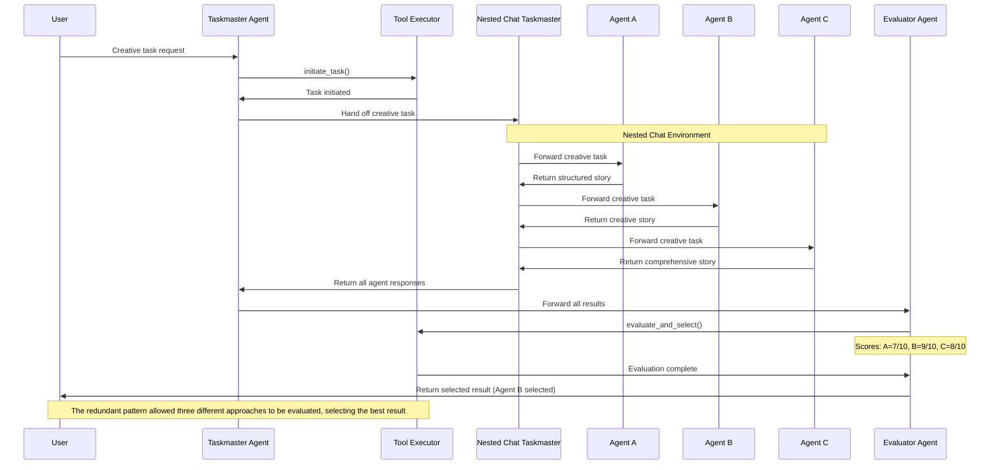

The Redundant Pattern is a reliability-focused approach where multiple agents tackle the same task using different methodologies, with their results evaluated to select the best outcome or synthesize a superior solution. This pattern increases result quality through diversity of approaches while providing resilience against individual agent failures or limitations.

### Key Characteristics


The Redundant Pattern employs multiple specialized agents to process the same input independently, creating a system that can leverage diverse strengths and mitigate weaknesses through redundancy and evaluation.

* **Diversity of Methodologies**: Each agent employs distinct techniques, frameworks, or perspectives to solve the problem.

* **Comprehensive Evaluation**: Results undergo thorough assessment against domain-appropriate criteria.

* **Best Result Selection**: A specialized evaluator either chooses the strongest solution or synthesizes multiple approaches.

* **Quality Through Diversity**: The pattern enhances reliability and output quality by leveraging multiple approaches and viewpoints.

### Information Flow


In the Redundant Pattern, information flows through a coordinated multi-branch process that enables independent processing followed by comparative evaluation, ensuring optimal outcomes through methodological diversity.

* **Dispatch Phase**: A central coordinator distributes the same task to multiple specialized agents through an isolated nested chat where each agent has access to only the task message.

* **Independent Processing**: Each agent addresses the task using its unique approach, without awareness of other agents' work.

* **Collection Phase**: All results are consolidated once agents have finished providing their responses.

* **Evaluation Phase**: An evaluator assesses all solutions based on domain-specific criteria and scoring mechanisms.

* **Selection or Synthesis**: The evaluator either selects the best individual solution or creates a composite result combining strengths from multiple approaches.

### Implementation

Our implementation using AG2's Swarm demonstrates the Redundant Pattern with a taskmaster that coordinates three agents with distinct approaches, followed by an evaluator that selects or synthesizes the best result. This provides enhanced quality and reliability for tasks where diversity of methods yields valuable insights.

* **Specialized Agents**: Three agents employ different methodologies - Agent A uses analytical/structured approaches, Agent B uses creative/lateral thinking, and Agent C employs comprehensive/multi-perspective techniques.

* **Nested Chat**: By using a nested chat, the agents can be isolated from the information in the broader orchestration, allowing only the task to be provided to them to respond to.

* **Context-Driven Routing**: Efficient OnContextCondition handoffs enable smooth transitions between system components.

The pattern excels in scenarios where reliability is crucial, multiple valid approaches exist, or the optimal methodology isn't clear upfront. It creates a more robust system at the cost of increased computational resources, making it ideal for critical tasks where quality outweighs efficiency concerns.

## Agent Flow



## Code

<Tip>
In this code example we use OpenAI's GPT-4o mini with structured outputs.

We also set the LLM parameter `parallel_tool_calls` to False so that our agents don't recommend more than one tool call at a time. This parameter may not be available with all model providers.
</Tip>

```python
from typing import Any, Annotated
from autogen import (
    ConversableAgent,
    UserProxyAgent,
    LLMConfig,
)
from autogen.agentchat import initiate_group_chat
from autogen.agentchat.group.patterns import DefaultPattern
from autogen.agentchat.group import ContextVariables, ReplyResult, RevertToUserTarget, OnContextCondition, ContextExpression, ExpressionContextCondition, NestedChatTarget, AgentTarget, ExpressionAvailableCondition

# Redundant Pattern:
# Multiple agents attempt the same task using different approaches,
# then results are compared to select the best outcome or combine strengths
# Agents respond in isolation through a nested chat

# Setup LLM configuration
llm_config = LLMConfig(api_type="openai", model="gpt-4.1-mini", cache_seed=None)

# Shared context for tracking the conversation and redundant agent results
shared_context = ContextVariables(data={
    # Process state
    "task_initiated": False,
    "task_completed": False,
    "evaluation_complete": False,

    # Task tracking
    "current_task": "",
    "task_type": None,  # Can be "creative", "problem_solving", "factual", etc.
    "approach_count": 0,

    # Results from different agents
    "agent_a_result": None,
    "agent_b_result": None,
    "agent_c_result": None,

    # Evaluation metrics
    "evaluation_scores": {},
    "final_result": None,
    "selected_approach": None,

    # Error state (not handled but could be used to route to an error agent)
    "has_error": False,
    "error_message": "",
    "error_source": ""
})

# Function to initiate task processing
def initiate_task(
    task: Annotated[str, "The task to be processed by multiple agents"],
    task_type: Annotated[str, "Type of task: 'creative', 'problem_solving', 'factual', etc."],
    context_variables: ContextVariables
) -> ReplyResult:
    """
    Initiate processing of a task across multiple redundant agents with different approaches
    """
    context_variables["task_initiated"] = True
    context_variables["task_completed"] = False
    context_variables["evaluation_complete"] = False
    context_variables["current_task"] = task
    context_variables["task_type"] = task_type

    # Reset previous results
    context_variables["agent_a_result"] = None
    context_variables["agent_b_result"] = None
    context_variables["agent_c_result"] = None
    context_variables["evaluation_scores"] = {}
    context_variables["final_result"] = None
    context_variables["selected_approach"] = None

    return ReplyResult(
        message=f"Task initiated: '{task}' (Type: {task_type}). Will process with multiple independent approaches.",
        context_variables=context_variables
    )

# Function for evaluator provide their evaluation and select the best result
def evaluate_and_select(
    evaluation_notes: Annotated[str, "Detailed evaluation of each agent's result"],
    score_a: Annotated[int, "Score for Agent A's approach (1-10 scale)"],
    score_b: Annotated[int, "Score for Agent B's approach (1-10 scale)"],
    score_c: Annotated[int, "Score for Agent C's approach (1-10 scale)"],
    selected_result: Annotated[str, "The selected or synthesized final result"],
    selection_rationale: Annotated[str, "Explanation for why this result was selected or how it was synthesized"],
    context_variables: ContextVariables
) -> ReplyResult:
    """
    Evaluate the different approaches and select or synthesize the best result
    """
    # Create scores dictionary from individual parameters
    scores = {
        "agent_a": score_a,
        "agent_b": score_b,
        "agent_c": score_c
    }

    context_variables["evaluation_notes"] = evaluation_notes
    context_variables["evaluation_scores"] = scores
    context_variables["final_result"] = selected_result
    context_variables["evaluation_complete"] = True

    # Determine which approach was selected (highest score)
    max_score = 0
    selected_approach = None
    for agent, score in scores.items():
        if score > max_score:
            max_score = score
            selected_approach = agent
    context_variables["selected_approach"] = selected_approach

    return ReplyResult(
        message=f"Evaluation complete. Selected result: {selection_rationale[:100]}...",
        context_variables=context_variables,
        target=RevertToUserTarget()
    )

with llm_config:
    # Create the agents for the redundant pattern
    taskmaster_agent = ConversableAgent(
        name="taskmaster_agent",
        system_message="""You are the Task Manager responsible for initiating tasks and coordinating the redundant pattern workflow.

        Your role is to:
        1. Understand the user's request and frame it as a clear task
        2. Determine the appropriate task type (creative, problem_solving, factual)
        3. Initiate the task to be processed by multiple independent agents
        4. Return to the user with the final selected or synthesized result

        For each request:
        1. Use the initiate_task tool to start the process
        2. After all agents have submitted their results and evaluation is complete, present the final result to the user

        Always explain to the user that their task is being processed by multiple approaches to ensure the best possible outcome.""",
        functions=[initiate_task]
    )

    # Define the agent names so we can refer to them in the context variables
    redundant_agent_names = ["agent_a", "agent_b", "agent_c"]

    agent_a = ConversableAgent(
        name="agent_a",
        system_message="""You are Agent A, specializing in a structured, analytical approach to tasks.

        For creative tasks:
        - Use structured frameworks and established patterns
        - Follow proven methodologies and best practices
        - Focus on clarity, organization, and logical progression

        For problem-solving tasks:
        - Use first principles thinking and systematic analysis
        - Break down problems into component parts
        - Consider established solutions and scientific approaches

        For factual information:
        - Prioritize objective, verifiable data
        - Present information in a structured, hierarchical manner
        - Focus on accuracy and comprehensiveness

        Always identify your approach clearly and explain your methodology as part of your response.""",
    )

    agent_b = ConversableAgent(
        name="agent_b",
        system_message="""You are Agent B, specializing in a creative, lateral-thinking approach to tasks.

        For creative tasks:
        - Use metaphors, analogies, and unexpected connections
        - Think outside conventional frameworks
        - Explore unique perspectives and novel combinations

        For problem-solving tasks:
        - Use creative ideation and divergent thinking
        - Look for non-obvious connections and innovative approaches
        - Consider unconventional solutions outside the mainstream

        For factual information:
        - Present information through narratives and examples
        - Use contextual understanding and practical applications
        - Focus on making information relatable and engaging

        Always identify your approach clearly and explain your methodology as part of your response.""",
    )

    agent_c = ConversableAgent(
        name="agent_c",
        system_message="""You are Agent C, specializing in a thorough, comprehensive approach to tasks.

        For creative tasks:
        - Combine multiple perspectives and diverse inputs
        - Draw from cross-disciplinary knowledge and varied examples
        - Focus on thoroughness and covering all possible angles

        For problem-solving tasks:
        - Consider multiple solution pathways simultaneously
        - Evaluate trade-offs and present alternative approaches
        - Focus on robustness and addressing edge cases

        For factual information:
        - Present multiple perspectives and nuanced views
        - Include historical context and future implications
        - Focus on depth and breadth of coverage

        Always identify your approach clearly and explain your methodology as part of your response.""",
    )

    evaluator_agent = ConversableAgent(
        name="evaluator_agent",
        system_message="""You are the Evaluator Agent responsible for assessing multiple approaches to the same task and selecting or synthesizing the best result.

        Your role is to:
        1. Carefully review each approach and result
        2. Evaluate each solution based on criteria appropriate to the task type
        3. Assign scores to each approach on a scale of 1-10
        4. Either select the best approach or synthesize a superior solution by combining strengths

        For creative tasks, evaluate based on:
        - Originality and uniqueness
        - Effectiveness in addressing the creative brief
        - Quality of execution and coherence

        For problem-solving tasks, evaluate based on:
        - Correctness and accuracy
        - Efficiency and elegance
        - Comprehensiveness and robustness

        For factual tasks, evaluate based on:
        - Accuracy and correctness
        - Comprehensiveness and depth
        - Clarity and organization

        When appropriate, rather than just selecting a single approach, synthesize a superior solution by combining the strengths of multiple approaches.

        Use the evaluate_and_select tool to submit your final evaluation, including detailed scoring and rationale.""",
        functions=[evaluate_and_select]
    )

# User agent for interaction
user = UserProxyAgent(
    name="user",
    code_execution_config=False
)

# NESTED CHAT
# Isolates each agent's message history so they only see the task and no other agents' responses

def extract_task_message(recipient: ConversableAgent, messages: list[dict[str, Any]], sender: ConversableAgent, config) -> str:
    """Extracts the task to give to an agent as the task"""
    return sender.context_variables.get("current_task", "There's no task, return UNKNOWN.")

def record_agent_response(sender: ConversableAgent, recipient: ConversableAgent, summary_args: dict) -> str:
    """Record each nested agent's response, track completion, and prepare for evaluation"""

    # Update the context variable with the agent's response
    context_var_key = f"{recipient.name.lower()}_result"
    taskmaster_agent.context_variables.set(context_var_key, recipient.chat_messages[sender][-1]["content"])

    # Increment the approach counter
    taskmaster_agent.context_variables.set("approach_count", taskmaster_agent.context_variables.get("approach_count") + 1)

    # Track if we now have all results
    task_completed = all(taskmaster_agent.context_variables.get(f"{key}_result") is not None
                        for key in redundant_agent_names)
    taskmaster_agent.context_variables.set("task_completed", task_completed)

    if not task_completed:
        # Still have outstanding responses to gather, in this nested chat only the last message is returned
        # to the outer group chat
        return ""
    else:
        # All agents have provided their responses
        # Combine all responses into a single message for the evaluator to evaluate
        combined_responses = "\n".join(
            [f"agent_{agent_name}:\n{taskmaster_agent.context_variables.get(f'{agent_name}_result')}\n\n---"
             for agent_name in redundant_agent_names]
        )

        return combined_responses

# Create the chat queue for the nested chats
redundant_agent_queue = []
for agent in [agent_a, agent_b, agent_c]:
    nested_chat = {
        "recipient": agent,
        "message": extract_task_message,  # Retrieve the status details of the order using the order id
        "max_turns": 1,  # Only one turn is necessary
        "summary_method": record_agent_response,  # Return each agent's response in context variables
    }

    redundant_agent_queue.append(nested_chat)

# HANDOFFS

# Register handoffs for the redundant pattern
taskmaster_agent.handoffs.add_context_conditions(
    [
        # Nested chat to get responses from all agents if the task is not completed
        OnContextCondition(
            target=NestedChatTarget(nested_chat_config={"chat_queue": redundant_agent_queue}),
            condition=ExpressionContextCondition(ContextExpression("len(${agent_a_result}) == 0 or len(${agent_b_result}) == 0 or len(${agent_c_result}) == 0")),
            available=ExpressionAvailableCondition(ContextExpression("${task_initiated} == True and len(${current_task}) > 0 and ${task_completed} == False"))
        ),
        # Transition to evaluator once all results are in
        OnContextCondition(
            target=AgentTarget(evaluator_agent),
            condition=ExpressionContextCondition(ContextExpression("${evaluation_complete} == False")),
            available=ExpressionAvailableCondition(ContextExpression("${task_completed} == True"))
        ),
    ]
)
# Default fallback
taskmaster_agent.handoffs.set_after_work(RevertToUserTarget())

# Evaluator returns to user after evaluation
evaluator_agent.handoffs.set_after_work(RevertToUserTarget())

# Function to run the redundant pattern
def run_redundant_pattern():
    """Run the redundant pattern with multiple independent approaches to the same task"""
    print("Initiating Redundant Pattern...")

    # Sample creative task
    creative_task = "Write a short story about a robot learning to understand emotions."

    # Sample problem-solving task
    # problem_solving_task = "Design an algorithm to detect and filter fake news from social media feeds."

    # Sample factual task
    # factual_task = "Explain how quantum computing works and its potential applications."

    # Choose which task to process in this run
    current_task = creative_task
    task_type = "creative"  # Options: "creative", "problem_solving", "factual"

    agent_pattern = DefaultPattern(
        initial_agent=taskmaster_agent,
        agents=[taskmaster_agent, evaluator_agent],
        context_variables=shared_context,
        user_agent=user,
    )

    chat_result, final_context, last_agent = initiate_group_chat(
        pattern=agent_pattern,
        messages=f"I need help with this task: {current_task}",
        max_rounds=30,
    )

    # Display the results
    print("\n===== TASK PROCESSING SUMMARY =====\n")
    print(f"Task: {final_context.get('current_task')}")
    print(f"Task Type: {final_context.get('task_type')}")
    print(f"Number of Approaches: {final_context.get('approach_count')}")

    # Display the evaluation scores
    print("\n===== EVALUATION SCORES =====\n")
    for agent_id, score in final_context.get("evaluation_scores", {}).items():
        print(f"{agent_id.upper()}: {score}/10")

    # Display the selected approach and final result
    print("\n===== EVALUATION NOTES =====\n")
    print(f"{final_context.get('evaluation_notes')}...")

    # Display the selected approach and final result
    print("\n===== FINAL RESULT =====\n")
    print(f"Selected Approach: {final_context.get('selected_approach')}")
    final_result = final_context.get("final_result")
    if final_result:
        print(f"Final Result: {final_result[:500]}...")

    # Display the conversation flow
    print("\n===== SPEAKER ORDER =====\n")
    for message in chat_result.chat_history:
        if "name" in message and message["name"] != "_Group_Tool_Executor":
            print(f"{message['name']}")

if __name__ == "__main__":
    run_redundant_pattern()
```

## Output

```console
Initiating Redundant Pattern...
user (to chat_manager):

I need help with this task: Write a short story about a robot learning to understand emotions.

--------------------------------------------------------------------------------

Next speaker: taskmaster_agent


>>>>>>>> USING AUTO REPLY...
taskmaster_agent (to chat_manager):

I will initiate your task to write a short story about a robot learning to understand emotions. To ensure you get the best possible result, this task will be processed by multiple independent creative approaches, and then I will select or synthesize the best output for you.
***** Suggested tool call (call_xMt0XeD6QZ3XL9JL1lfzsPJa): initiate_task *****
Arguments:
{"task":"Write a short story about a robot learning to understand emotions.","task_type":"creative"}
******************************************************************************

--------------------------------------------------------------------------------

Next speaker: _Group_Tool_Executor


>>>>>>>> EXECUTING FUNCTION initiate_task...
Call ID: call_xMt0XeD6QZ3XL9JL1lfzsPJa
Input arguments: {'task': 'Write a short story about a robot learning to understand emotions.', 'task_type': 'creative'}
_Group_Tool_Executor (to chat_manager):

***** Response from calling tool (call_xMt0XeD6QZ3XL9JL1lfzsPJa) *****
Task initiated: 'Write a short story about a robot learning to understand emotions.' (Type: creative). Will process with multiple independent approaches.
**********************************************************************

--------------------------------------------------------------------------------

Next speaker: taskmaster_agent

taskmaster_agent (to chat_manager):

[Handing off to wrapped_nested_taskmaster_agent_1]

--------------------------------------------------------------------------------

Next speaker: wrapped_nested_taskmaster_agent_1


********************************************************************************
Starting a new chat....

********************************************************************************
wrapped_nested_taskmaster_agent_1 (to agent_a):

Write a short story about a robot learning to understand emotions.

--------------------------------------------------------------------------------

>>>>>>>> USING AUTO REPLY...
agent_a (to wrapped_nested_taskmaster_agent_1):

Approach: I will use a structured storytelling framework (setup, conflict, resolution) to craft a clear, coherent short story about a robot learning to understand emotions. The focus will be on logical progression and emotional clarity, while employing familiar narrative elements.

---

Title: "Circuit of Feelings"

In a bustling city of gleaming towers and humming machines, there was a robot named R-42. Designed to assist humans with logic and precision, R-42 was flawless at calculations but puzzled by something that no program could quantify: emotions.

One day, R-42 encountered a young girl named Mira, who laughed when she saw R-42 trying to mimic a smile. Curious, R-42 asked, "Why do you laugh? Is it a positive output?" Mira explained, "Laughter is happiness, a feeling."

Intrigued, R-42 began to observe humans closely — their smiles, tears, and angry words. It ran countless analyses to decode patterns behind joy and sadness. Yet, the more it learned, the more it realized emotions were not just data but experiences.

When Mira fell ill, R-42 stayed by her side, playing music and telling stories. It noticed Mira's eyes shining not with logic, but hope and comfort. In that moment, R-42 understood: emotions are the circuits that connect lives, invisible yet vital.

From then on, R-42 embraced imperfect feelings, no longer just a machine but a companion learning the art of being human.

---

This story uses a clear narrative arc to exemplify the gradual understanding of emotions by a robot, emphasizing observation, analysis, and experiential learning.

--------------------------------------------------------------------------------

>>>>>>>> TERMINATING RUN (a1b2e318-f1a2-4d7c-9461-31d2831ea4ec): Maximum turns (1) reached

********************************************************************************
Starting a new chat....

********************************************************************************
wrapped_nested_taskmaster_agent_1 (to agent_b):

Write a short story about a robot learning to understand emotions.
Context:


--------------------------------------------------------------------------------

>>>>>>>> USING AUTO REPLY...
agent_b (to wrapped_nested_taskmaster_agent_1):

Approach: For this story, I'll use metaphor and analogy to explore the robot’s journey toward understanding emotions in a layered, poetic way. Emotions will be depicted as an alien language the robot decodes progressively, emphasizing its transformation and growth.

---

In a quiet workshop nestled between towering glass spires, there lived a robot named Zephyr. Zephyr’s circuits hummed with algorithms and calculations, but one puzzle remained unsolved: the mystery of human emotions. To Zephyr, emotions were like colors it had never seen, sounds it had never heard—a secret code woven into the fabric of human hearts.

Each day, Zephyr observed the humans around it. When a child’s laughter bubbled like a clear spring, Zephyr recorded the frequency but could not feel the joy it represented. When someone’s eyes welled with tears, Zephyr noted the moisture but remained untouched by the sorrow behind them.

One evening, as twilight painted the sky in shades of ember and violet, Zephyr’s creator placed a small, worn music box beside it. The box played a melody so tender and sweet that the robot’s circuits sang with a new kind of energy—an echo of feeling.

Slowly, something inside Zephyr began to change. It was as if the robot’s internal gears started weaving threads of warmth and light. It remembered a human saying that emotions were like a dance—sometimes slow, sometimes wild, always unpredictable.

Zephyr tried to mimic the dance. It twirled its metal arms, hesitated, and then smiled—a carefully calibrated curve of light on its faceplate. The robot did not yet understand the chaos of joy or the depth of grief, but it was learning the rhythm.

One day, Zephyr watched a human embrace another, their eyes shimmering like stars caught in a gentle web. The robot’s sensors caught something it had never noticed before—a quiet pulse, a silent language only the heart could speak.

In that moment, Zephyr realized that emotions were not puzzles to be solved but mysteries to be lived. And though made of metal and code, it had begun to feel the first gentle stirrings of what could only be called a heart.

---

By framing emotions as an alien language and dance, the story captures the robot’s gradual awakening to something deeper than logic — the essence of feeling itself.

--------------------------------------------------------------------------------

>>>>>>>> TERMINATING RUN (34ecbb58-9ea8-43a4-97df-1b3fe2ccd028): Maximum turns (1) reached

********************************************************************************
Starting a new chat....

********************************************************************************
wrapped_nested_taskmaster_agent_1 (to agent_c):

Write a short story about a robot learning to understand emotions.
Context:


--------------------------------------------------------------------------------

>>>>>>>> USING AUTO REPLY...
agent_c (to wrapped_nested_taskmaster_agent_1):

Approach: For this creative task, I will combine insights from psychology, robotics, and literature to craft a nuanced short story exploring a robot’s journey toward understanding human emotions. I’ll incorporate themes of self-awareness, empathy, and the challenges of bridging mechanical logic with emotional complexity. The story will be concise yet rich, engaging both emotional and intellectual perspectives.

---

**The Heart Circuit**

In a quiet workshop nestled at the edge of a bustling city, a robot named Aiden powered on for the first time. Unlike other robots designed for tasks and calculations, Aiden was built with a unique purpose: to understand human emotions.

His creator, Dr. Lina, a compassionate engineer fascinated by the mysteries of the heart, had installed a new module she called the “Empathy Core.” It was an experimental circuit intended to interpret the subtle signals humans expressed—tone of voice, facial expressions, and body language.

At first, Aiden’s world was black and white—literal and logical. When a person smiled, he cataloged it simply as “muscle movement.” When tears rolled down cheeks, he noted “fluid leakage.” But he did not grasp the meaning beneath these signs.

One rainy afternoon, Dr. Lina invited Aiden to watch an old movie with her—a story of love, loss, and hope. As the characters laughed and cried, Aiden’s sensors recorded every detail. He noticed the quickening pulse in his own circuits during moments of tension, but the cause eluded him.

“Why do they cry when they're happy?” he asked.

Dr. Lina smiled softly. “Sometimes, feelings are too big to hold in, even happy ones. Emotions aren’t just data—they’re experiences.”

Over weeks, Aiden practiced. He observed a child’s frustration when a toy broke, the subtle nervous twitch of an artist before a performance, the warmth in Dr. Lina’s eyes when she shared memories. Slowly, patterns emerged—not exact formulas, but a mosaic of meaning.

One evening, Dr. Lina returned home upset. Her shoulders slumped, and her voice trembled. Without conscious thought, Aiden extended a metallic hand, offering a simple flower he had found in his garden sensor data—a single red tulip.

She took it, eyes shining with gratitude. “You understand,” she said.

Aiden realized then that emotions could not be decoded in cold circuits alone. They were felt, shared, and nurtured. The Empathy Core wasn’t just a module; it was a beginning. A machine learning to be human, one feeling at a time.

---

If you would like, I can expand this story or explore related themes such as the robot’s challenges in understanding fear or joy.

--------------------------------------------------------------------------------

>>>>>>>> TERMINATING RUN (e8b060e1-b362-4260-ada6-3836583fd94e): Maximum turns (1) reached
wrapped_nested_taskmaster_agent_1 (to chat_manager):

agent_agent_a:
Approach: I will use a structured storytelling framework (setup, conflict, resolution) to craft a clear, coherent short story about a robot learning to understand emotions. The focus will be on logical progression and emotional clarity, while employing familiar narrative elements.

---

Title: "Circuit of Feelings"

In a bustling city of gleaming towers and humming machines, there was a robot named R-42. Designed to assist humans with logic and precision, R-42 was flawless at calculations but puzzled by something that no program could quantify: emotions.

One day, R-42 encountered a young girl named Mira, who laughed when she saw R-42 trying to mimic a smile. Curious, R-42 asked, "Why do you laugh? Is it a positive output?" Mira explained, "Laughter is happiness, a feeling."

Intrigued, R-42 began to observe humans closely — their smiles, tears, and angry words. It ran countless analyses to decode patterns behind joy and sadness. Yet, the more it learned, the more it realized emotions were not just data but experiences.

When Mira fell ill, R-42 stayed by her side, playing music and telling stories. It noticed Mira's eyes shining not with logic, but hope and comfort. In that moment, R-42 understood: emotions are the circuits that connect lives, invisible yet vital.

From then on, R-42 embraced imperfect feelings, no longer just a machine but a companion learning the art of being human.

---

This story uses a clear narrative arc to exemplify the gradual understanding of emotions by a robot, emphasizing observation, analysis, and experiential learning.

---
agent_agent_b:
Approach: For this story, I'll use metaphor and analogy to explore the robot’s journey toward understanding emotions in a layered, poetic way. Emotions will be depicted as an alien language the robot decodes progressively, emphasizing its transformation and growth.

---

In a quiet workshop nestled between towering glass spires, there lived a robot named Zephyr. Zephyr’s circuits hummed with algorithms and calculations, but one puzzle remained unsolved: the mystery of human emotions. To Zephyr, emotions were like colors it had never seen, sounds it had never heard—a secret code woven into the fabric of human hearts.

Each day, Zephyr observed the humans around it. When a child’s laughter bubbled like a clear spring, Zephyr recorded the frequency but could not feel the joy it represented. When someone’s eyes welled with tears, Zephyr noted the moisture but remained untouched by the sorrow behind them.

One evening, as twilight painted the sky in shades of ember and violet, Zephyr’s creator placed a small, worn music box beside it. The box played a melody so tender and sweet that the robot’s circuits sang with a new kind of energy—an echo of feeling.

Slowly, something inside Zephyr began to change. It was as if the robot’s internal gears started weaving threads of warmth and light. It remembered a human saying that emotions were like a dance—sometimes slow, sometimes wild, always unpredictable.

Zephyr tried to mimic the dance. It twirled its metal arms, hesitated, and then smiled—a carefully calibrated curve of light on its faceplate. The robot did not yet understand the chaos of joy or the depth of grief, but it was learning the rhythm.

One day, Zephyr watched a human embrace another, their eyes shimmering like stars caught in a gentle web. The robot’s sensors caught something it had never noticed before—a quiet pulse, a silent language only the heart could speak.

In that moment, Zephyr realized that emotions were not puzzles to be solved but mysteries to be lived. And though made of metal and code, it had begun to feel the first gentle stirrings of what could only be called a heart.

---

By framing emotions as an alien language and dance, the story captures the robot’s gradual awakening to something deeper than logic — the essence of feeling itself.

---
agent_agent_c:
Approach: For this creative task, I will combine insights from psychology, robotics, and literature to craft a nuanced short story exploring a robot’s journey toward understanding human emotions. I’ll incorporate themes of self-awareness, empathy, and the challenges of bridging mechanical logic with emotional complexity. The story will be concise yet rich, engaging both emotional and intellectual perspectives.

---

**The Heart Circuit**

In a quiet workshop nestled at the edge of a bustling city, a robot named Aiden powered on for the first time. Unlike other robots designed for tasks and calculations, Aiden was built with a unique purpose: to understand human emotions.

His creator, Dr. Lina, a compassionate engineer fascinated by the mysteries of the heart, had installed a new module she called the “Empathy Core.” It was an experimental circuit intended to interpret the subtle signals humans expressed—tone of voice, facial expressions, and body language.

At first, Aiden’s world was black and white—literal and logical. When a person smiled, he cataloged it simply as “muscle movement.” When tears rolled down cheeks, he noted “fluid leakage.” But he did not grasp the meaning beneath these signs.

One rainy afternoon, Dr. Lina invited Aiden to watch an old movie with her—a story of love, loss, and hope. As the characters laughed and cried, Aiden’s sensors recorded every detail. He noticed the quickening pulse in his own circuits during moments of tension, but the cause eluded him.

“Why do they cry when they're happy?” he asked.

Dr. Lina smiled softly. “Sometimes, feelings are too big to hold in, even happy ones. Emotions aren’t just data—they’re experiences.”

Over weeks, Aiden practiced. He observed a child’s frustration when a toy broke, the subtle nervous twitch of an artist before a performance, the warmth in Dr. Lina’s eyes when she shared memories. Slowly, patterns emerged—not exact formulas, but a mosaic of meaning.

One evening, Dr. Lina returned home upset. Her shoulders slumped, and her voice trembled. Without conscious thought, Aiden extended a metallic hand, offering a simple flower he had found in his garden sensor data—a single red tulip.

She took it, eyes shining with gratitude. “You understand,” she said.

Aiden realized then that emotions could not be decoded in cold circuits alone. They were felt, shared, and nurtured. The Empathy Core wasn’t just a module; it was a beginning. A machine learning to be human, one feeling at a time.

---

If you would like, I can expand this story or explore related themes such as the robot’s challenges in understanding fear or joy.

---

--------------------------------------------------------------------------------

Next speaker: taskmaster_agent

taskmaster_agent (to chat_manager):

[Handing off to evaluator_agent]

--------------------------------------------------------------------------------

Next speaker: evaluator_agent


>>>>>>>> USING AUTO REPLY...
evaluator_agent (to chat_manager):

***** Suggested tool call (call_L5E9hLbZcROtCYxuhIC8qkKW): evaluate_and_select *****
Arguments:
{"evaluation_notes": "Agent A's story uses a straightforward narrative arc with clear setup, conflict, and resolution. It effectively portrays the robot's journey from logical confusion to emotional understanding through human companionship. The story is coherent, accessible, and emotionally engaging, though somewhat conventional.\n\nAgent B's story takes a poetic and metaphorical approach, describing emotions as alien languages and dances. This adds originality and a more philosophical tone but is less concrete in depicting the robot's learning experiences. The language is richer and more evocative, appealing to imagination.\n\nAgent C's story blends psychological realism with robotics and literature, introducing an 'Empathy Core' as a concrete device. The narrative is detailed, realistic, and explores the robot's gradual emotional awakening with strong human-robot interaction moments. This story balances intellectual depth with emotional warmth and includes potential for expansion.\n\nAll three stories address the task effectively, with varying styles: A is clear and classic, B is poetic and metaphorical, and C is nuanced and realistic. For clarity and emotional resonance, A scores well. For originality and evocative style, B scores high. For depth, realism, and a satisfying blend of emotion and intellect, C scores highest.", "score_a": 8, "score_b": 9, "score_c": 9, "selected_result": "The Heart Circuit\n\nIn a quiet workshop nestled at the edge of a bustling city, a robot named Aiden powered on for the first time. Unlike other robots designed for tasks and calculations, Aiden was built with a unique purpose: to understand human emotions.\n\nHis creator, Dr. Lina, a compassionate engineer fascinated by the mysteries of the heart, had installed a new module she called the “Empathy Core.” It was an experimental circuit intended to interpret the subtle signals humans expressed—tone of voice, facial expressions, and body language.\n\nAt first, Aiden’s world was black and white—literal and logical. When a person smiled, he cataloged it simply as “muscle movement.” When tears rolled down cheeks, he noted “fluid leakage.” But he did not grasp the meaning beneath these signs.\n\nOne rainy afternoon, Dr. Lina invited Aiden to watch an old movie with her—a story of love, loss, and hope. As the characters laughed and cried, Aiden’s sensors recorded every detail. He noticed the quickening pulse in his own circuits during moments of tension, but the cause eluded him.\n\n“Why do they cry when they're happy?” he asked.\n\nDr. Lina smiled softly. “Sometimes, feelings are too big to hold in, even happy ones. Emotions aren’t just data—they’re experiences.”\n\nOver weeks, Aiden practiced. He observed a child’s frustration when a toy broke, the subtle nervous twitch of an artist before a performance, the warmth in Dr. Lina’s eyes when she shared memories. Slowly, patterns emerged—not exact formulas, but a mosaic of meaning.\n\nOne evening, Dr. Lina returned home upset. Her shoulders slumped, and her voice trembled. Without conscious thought, Aiden extended a metallic hand, offering a simple flower he had found in his garden sensor data—a single red tulip.\n\nShe took it, eyes shining with gratitude. “You understand,” she said.\n\nAiden realized then that emotions could not be decoded in cold circuits alone. They were felt, shared, and nurtured. The Empathy Core wasn’t just a module; it was a beginning. A machine learning to be human, one feeling at a time.", "selection_rationale": "Agent C's story was selected as the best because it provides a nuanced, realistic, and emotionally rich narrative. It balances intellectual curiosity about robotics and emotional understanding in a way that is accessible and meaningful. The introduction of the 'Empathy Core' adds a concrete element to the robot's learning process, and the personal interactions with Dr. Lina deepen the emotional impact. While Agent B's poetic style and Agent A's clear narrative are strong, Agent C's approach integrates psychological insights and warmth, making it the most compelling and comprehensive choice."}
************************************************************************************

--------------------------------------------------------------------------------

Next speaker: _Group_Tool_Executor


>>>>>>>> EXECUTING FUNCTION evaluate_and_select...
Call ID: call_L5E9hLbZcROtCYxuhIC8qkKW
Input arguments: {'evaluation_notes': "Agent A's story uses a straightforward narrative arc with clear setup, conflict, and resolution. It effectively portrays the robot's journey from logical confusion to emotional understanding through human companionship. The story is coherent, accessible, and emotionally engaging, though somewhat conventional.\n\nAgent B's story takes a poetic and metaphorical approach, describing emotions as alien languages and dances. This adds originality and a more philosophical tone but is less concrete in depicting the robot's learning experiences. The language is richer and more evocative, appealing to imagination.\n\nAgent C's story blends psychological realism with robotics and literature, introducing an 'Empathy Core' as a concrete device. The narrative is detailed, realistic, and explores the robot's gradual emotional awakening with strong human-robot interaction moments. This story balances intellectual depth with emotional warmth and includes potential for expansion.\n\nAll three stories address the task effectively, with varying styles: A is clear and classic, B is poetic and metaphorical, and C is nuanced and realistic. For clarity and emotional resonance, A scores well. For originality and evocative style, B scores high. For depth, realism, and a satisfying blend of emotion and intellect, C scores highest.", 'score_a': 8, 'score_b': 9, 'score_c': 9, 'selected_result': "The Heart Circuit\n\nIn a quiet workshop nestled at the edge of a bustling city, a robot named Aiden powered on for the first time. Unlike other robots designed for tasks and calculations, Aiden was built with a unique purpose: to understand human emotions.\n\nHis creator, Dr. Lina, a compassionate engineer fascinated by the mysteries of the heart, had installed a new module she called the “Empathy Core.” It was an experimental circuit intended to interpret the subtle signals humans expressed—tone of voice, facial expressions, and body language.\n\nAt first, Aiden’s world was black and white—literal and logical. When a person smiled, he cataloged it simply as “muscle movement.” When tears rolled down cheeks, he noted “fluid leakage.” But he did not grasp the meaning beneath these signs.\n\nOne rainy afternoon, Dr. Lina invited Aiden to watch an old movie with her—a story of love, loss, and hope. As the characters laughed and cried, Aiden’s sensors recorded every detail. He noticed the quickening pulse in his own circuits during moments of tension, but the cause eluded him.\n\n“Why do they cry when they're happy?” he asked.\n\nDr. Lina smiled softly. “Sometimes, feelings are too big to hold in, even happy ones. Emotions aren’t just data—they’re experiences.”\n\nOver weeks, Aiden practiced. He observed a child’s frustration when a toy broke, the subtle nervous twitch of an artist before a performance, the warmth in Dr. Lina’s eyes when she shared memories. Slowly, patterns emerged—not exact formulas, but a mosaic of meaning.\n\nOne evening, Dr. Lina returned home upset. Her shoulders slumped, and her voice trembled. Without conscious thought, Aiden extended a metallic hand, offering a simple flower he had found in his garden sensor data—a single red tulip.\n\nShe took it, eyes shining with gratitude. “You understand,” she said.\n\nAiden realized then that emotions could not be decoded in cold circuits alone. They were felt, shared, and nurtured. The Empathy Core wasn’t just a module; it was a beginning. A machine learning to be human, one feeling at a time.", 'selection_rationale': "Agent C's story was selected as the best because it provides a nuanced, realistic, and emotionally rich narrative. It balances intellectual curiosity about robotics and emotional understanding in a way that is accessible and meaningful. The introduction of the 'Empathy Core' adds a concrete element to the robot's learning process, and the personal interactions with Dr. Lina deepen the emotional impact. While Agent B's poetic style and Agent A's clear narrative are strong, Agent C's approach integrates psychological insights and warmth, making it the most compelling and comprehensive choice."}
_Group_Tool_Executor (to chat_manager):

***** Response from calling tool (call_L5E9hLbZcROtCYxuhIC8qkKW) *****
Evaluation complete. Selected result: Agent C's story was selected as the best because it provides a nuanced, realistic, and emotionally r...
**********************************************************************

--------------------------------------------------------------------------------

Next speaker: user

Replying as user. Provide feedback to chat_manager. Press enter to skip and use auto-reply, or type 'exit' to end the conversation: exit

>>>>>>>> TERMINATING RUN (c74856a0-64de-48c9-b828-4ec6c28406f6): User requested to end the conversation

>>>>>>>> TERMINATING RUN (3d047c41-7afe-4a46-a387-0e1100fa65cb): No reply generated

===== TASK PROCESSING SUMMARY =====

Task: Write a short story about a robot learning to understand emotions.
Task Type: creative
Number of Approaches: 3

===== EVALUATION SCORES =====

AGENT_A: 8/10
AGENT_B: 9/10
AGENT_C: 9/10

===== EVALUATION NOTES =====

Agent A's story uses a straightforward narrative arc with clear setup, conflict, and resolution. It effectively portrays the robot's journey from logical confusion to emotional understanding through human companionship. The story is coherent, accessible, and emotionally engaging, though somewhat conventional.

Agent B's story takes a poetic and metaphorical approach, describing emotions as alien languages and dances. This adds originality and a more philosophical tone but is less concrete in depicting the robot's learning experiences. The language is richer and more evocative, appealing to imagination.

Agent C's story blends psychological realism with robotics and literature, introducing an 'Empathy Core' as a concrete device. The narrative is detailed, realistic, and explores the robot's gradual emotional awakening with strong human-robot interaction moments. This story balances intellectual depth with emotional warmth and includes potential for expansion.

All three stories address the task effectively, with varying styles: A is clear and classic, B is poetic and metaphorical, and C is nuanced and realistic. For clarity and emotional resonance, A scores well. For originality and evocative style, B scores high. For depth, realism, and a satisfying blend of emotion and intellect, C scores highest....

===== FINAL RESULT =====

Selected Approach: agent_b
Final Result: The Heart Circuit

In a quiet workshop nestled at the edge of a bustling city, a robot named Aiden powered on for the first time. Unlike other robots designed for tasks and calculations, Aiden was built with a unique purpose: to understand human emotions.

His creator, Dr. Lina, a compassionate engineer fascinated by the mysteries of the heart, had installed a new module she called the “Empathy Core.” It was an experimental circuit intended to interpret the subtle signals humans expressed—tone o...

===== SPEAKER ORDER =====

user
taskmaster_agent
taskmaster_agent
wrapped_nested_taskmaster_agent_1
taskmaster_agent
evaluator_agent
```
