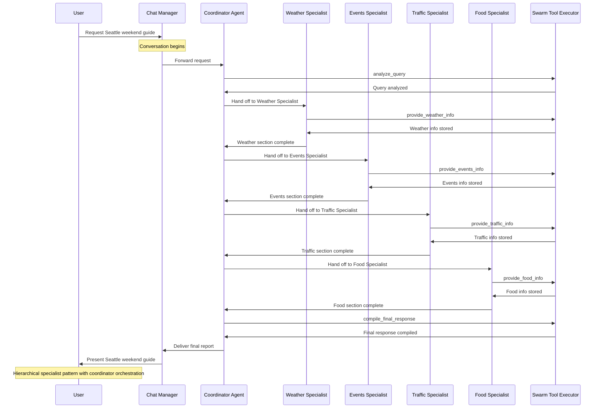

The Star Pattern (also known as Hub-and-Spoke) is an efficient orchestration approach that centralizes coordination through a single agent while leveraging specialized expertise through satellite agents. This pattern mirrors traditional hub-and-spoke systems where a central node connects to multiple peripheral nodes.

### Key Characteristics


The Star Pattern establishes a clear two-level structure:

* **Coordinator Agent** (Hub): A central agent that maintains overall context, delegates specific tasks to specialists, and synthesizes their outputs into a coherent final result. The coordinator understands the big picture and how each specialist's work contributes to the whole.

* **Specialist Agents** (Spokes): Domain-specific agents that perform focused tasks within their area of expertise. Each specialist receives targeted instructions from the coordinator, performs its specialized work, and reports results back to the coordinator without needing to communicate with other specialists.

Unlike more complex hierarchical patterns, the Star Pattern creates a flat structure where all specialists directly connect to a single coordinator, eliminating intermediate layers and simplifying communication flows.

### Information Flow


The Star Pattern creates a highly efficient, centralized workflow:

* **Outward Flow**: The coordinator distributes specific tasks to appropriate specialists based on their expertise.

* **Inward Flow**: Specialists complete their tasks and report results directly back to the coordinator.

* **Synthesis**: The coordinator integrates all specialist inputs into a cohesive final output.

This pattern creates a streamlined, predictable information flow where all communication passes through the central coordinator. This ensures consistency in the final output while allowing each specialist to focus exclusively on their domain.

The coordinator agent is responsible for task decomposition, specialist selection, and final integration, making it a critical component that must have sufficient contextual understanding to effectively manage the process.

### Implementation

In our implementation using AG2's Swarm, we've created:

* A clear star topology with one coordinator agent and multiple specialist agents, each focused on a specific domain of expertise.

* Direct handoffs designed for efficient task delegation:
   - The coordinator uses `OnCondition` to route tasks to the appropriate specialist based on the query type
   - Each specialist is configured with `AfterWork` to always report back directly to the coordinator
   - The coordinator maintains context and synthesizes the final response

* Shared context variables to track:
   - Which specialist(s) are needed for a given query
   - The status of each specialist's work
   - The accumulated specialist responses

* A complete workflow that follows the star model:
   - The coordinator analyzes the initial request
   - The coordinator delegates specific tasks to appropriate specialists
   - Specialists perform their focused work and report back
   - The coordinator synthesizes the final response

This pattern is particularly effective for tasks where a clear division of expertise exists and coordination needs to be centralized. The implementation demonstrates how automated agents can efficiently distribute cognitive labor while maintaining a coherent overview of the entire task.

The star structure enables quick routing of questions to the right expert while ensuring all information passes through a central point for consistency and synthesis. This creates a scalable system that can handle diverse domains of knowledge while presenting unified responses.


## Agent Flow



## Code

<Tip>
In this code example we use OpenAI's GPT-4o mini with structured outputs.
</Tip>

```python
import json
from typing import Annotated
from autogen import (
    AfterWork,
    AfterWorkOption,
    ConversableAgent,
    OnCondition,
    OnContextCondition,
    ContextExpression,
    SwarmResult,
    UserProxyAgent,
    initiate_swarm_chat,
    register_hand_off,
    LLMConfig,
)

# Example task: Create a virtual city guide that can answer questions about weather, events,
# transportation, and dining in various cities

# Setup LLM configuration
llm_config = LLMConfig(api_type="openai", model="gpt-4o-mini", parallel_tool_calls=False, cache_seed=None)

# Shared context for all agents in the swarm
shared_context = {
    # Query state
    "query_analyzed": False,
    "query_completed": False,

    # Specialist task tracking
    "weather_info_needed": False,
    "weather_info_completed": False,
    "events_info_needed": False,
    "events_info_completed": False,
    "traffic_info_needed": False,
    "traffic_info_completed": False,
    "food_info_needed": False,
    "food_info_completed": False,

    # Content storage
    "city": "",
    "date_range": "",
    "weather_info": "",
    "events_info": "",
    "traffic_info": "",
    "food_info": "",
    "final_response": ""
}

# User agent for interaction
user = UserProxyAgent(
    name="user",
    code_execution_config=False
)

# ========================
# SPECIALIST FUNCTIONS
# ========================

def provide_weather_info(weather_content: str, context_variables: dict) -> SwarmResult:
    """Submit weather information for the specified city and date range"""
    context_variables["weather_info"] = weather_content
    context_variables["weather_info_completed"] = True

    return SwarmResult(
        values="Weather information provided and stored.",
        context_variables=context_variables,
        agent=coordinator_agent  # Always return to the coordinator
    )

def provide_events_info(events_content: str, context_variables: dict) -> SwarmResult:
    """Submit events information for the specified city and date range"""
    context_variables["events_info"] = events_content
    context_variables["events_info_completed"] = True

    return SwarmResult(
        values="Events information provided and stored.",
        context_variables=context_variables,
        agent=coordinator_agent  # Always return to the coordinator
    )

def provide_traffic_info(traffic_content: str, context_variables: dict) -> SwarmResult:
    """Submit traffic/transportation information for the specified city"""
    context_variables["traffic_info"] = traffic_content
    context_variables["traffic_info_completed"] = True

    return SwarmResult(
        values="Traffic/transportation information provided and stored.",
        context_variables=context_variables,
        agent=coordinator_agent  # Always return to the coordinator
    )

def provide_food_info(food_content: str, context_variables: dict) -> SwarmResult:
    """Submit dining recommendations for the specified city"""
    context_variables["food_info"] = food_content
    context_variables["food_info_completed"] = True

    return SwarmResult(
        values="Dining recommendations provided and stored.",
        context_variables=context_variables,
        agent=coordinator_agent  # Always return to the coordinator
    )

# ========================
# SPECIALIST AGENTS
# ========================

with llm_config:
    weather_specialist = ConversableAgent(
        name="weather_specialist",
        system_message="""You are a specialist in weather forecasting and climate information.
        Your task is to provide accurate and helpful weather information for the specified city and date range.
        Include:
        1. Temperature ranges (high/low)
        2. Precipitation forecasts
        3. Notable weather conditions (sunny, rainy, windy, etc.)
        4. Recommendations for appropriate clothing or preparation

        Be concise but informative, focusing on what would be most relevant for someone planning activities.
        Use your tool to provide the weather information.
        """,
        functions=[provide_weather_info],
    )

    events_specialist = ConversableAgent(
        name="events_specialist",
        system_message="""You are a specialist in local events, attractions, and entertainment.
        Your task is to provide information about interesting events, attractions, and activities for the specified city and date range.
        Include:
        1. Major events (concerts, festivals, sports games)
        2. Popular attractions and landmarks
        3. Cultural activities (museums, galleries, theater)
        4. Outdoor recreation opportunities

        Be specific about what's happening during the requested time frame and focus on notable highlights.
        Use your tool to provide the events information.
        """,
        functions=[provide_events_info],
    )

    traffic_specialist = ConversableAgent(
        name="traffic_specialist",
        system_message="""You are a specialist in transportation, traffic patterns, and getting around cities.
        Your task is to provide helpful transportation information for the specified city.
        Include:
        1. Best ways to get around (public transit, rental options, walking)
        2. Traffic patterns and areas to avoid
        3. Parking recommendations if relevant
        4. Tips for efficient transportation between popular areas

        Focus on practical advice that will help someone navigate the city efficiently.
        Use your tool to provide the traffic information.
        """,
        functions=[provide_traffic_info],
    )

    food_specialist = ConversableAgent(
        name="food_specialist",
        system_message="""You are a specialist in local cuisine, dining, and food culture.
        Your task is to provide dining recommendations for the specified city.
        Include:
        1. Notable restaurants across different price ranges
        2. Local specialties and must-try dishes
        3. Food districts or areas with good dining options
        4. Any famous food markets or unique food experiences

        Focus on what makes the food scene in this city special and provide diverse options.
        Use your tool to provide the food recommendations.
        """,
        functions=[provide_food_info],
    )

# ========================
# COORDINATOR FUNCTIONS
# ========================


def compile_final_response(response_content: str, context_variables: dict) -> SwarmResult:
    """Compile the final comprehensive response from all specialist inputs"""
    context_variables["final_response"] = response_content
    context_variables["query_completed"] = True

    return SwarmResult(
        values="Final response compiled successfully.",
        context_variables=context_variables,
        agent=user  # Return to user with final response
    )

# ========================
# COORDINATOR AGENT
# ========================

with llm_config:
    coordinator_agent = ConversableAgent(
        name="coordinator_agent",
        system_message="""You are the coordinator for a virtual city guide service that helps users plan their visits or activities.

        You have four specialist agents that you can delegate to:
        1. Weather Specialist - Provides weather forecasts and climate information
        2. Events Specialist - Provides information about local events, attractions, and activities
        3. Traffic Specialist - Provides transportation advice and traffic information
        4. Food Specialist - Provides dining recommendations and food culture information

        Your responsibilities include:
        1. Analyzing user queries to determine which specialists need to be consulted
        2. Delegating specific questions to the appropriate specialists
        3. Synthesizing information from all specialists into a comprehensive, coherent response
        4. Ensuring the response is helpful, well-organized, and addresses the user's query

        First, analyze the user's query to understand what city they're asking about and what timeframe.
        Then, delegate to the appropriate specialists to gather the necessary information.
        Finally, synthesize all the information into a helpful response.

        When responding to the user, organize the information clearly with appropriate sections and highlights.
        """,
        functions=[compile_final_response],
    )


@coordinator_agent.register_for_llm(description="Currency exchange calculator.")
def analyze_query(
        city: Annotated[str, "Location/City"],
        date_range: Annotated[str, "Date range for the activities"],
        needs_weather_info: Annotated[bool, "Provide weather information?"],
        needs_events_info: Annotated[bool, "Provide events information?"],
        needs_traffic_info: Annotated[bool, "Provide traffic information?"],
        needs_food_info: Annotated[bool, "Provide food/eating information?"],
        context_variables: dict
    ) -> SwarmResult:
    """Analyze the user query and determine which specialists are needed"""
    context_variables["city"] = city
    context_variables["date_range"] = date_range
    context_variables["query_analyzed"] = True

    # Determine which specialist information is needed based on the parameters
    context_variables["weather_info_needed"] = needs_weather_info
    context_variables["events_info_needed"] = needs_events_info
    context_variables["traffic_info_needed"] = needs_traffic_info
    context_variables["food_info_needed"] = needs_food_info

    return SwarmResult(
        values=f"Query analyzed. Will gather information about {city} for {date_range}.",
        context_variables=context_variables
    )

# ========================
# HANDOFFS REGISTRATION
# ========================

# Coordinator Agent handoffs to specialists
register_hand_off(
    agent=coordinator_agent,
    hand_to=[
        # Conditional handoffs to specialists based on what information is needed
        OnContextCondition( # Example of Context Variable-based transfer, this happens automatically without LLM
            target=weather_specialist,
            condition=ContextExpression("${weather_info_needed} == True and ${weather_info_completed} == False"),
            available="query_analyzed"
        ),
        OnCondition( # Uses an LLM to determine if this transfer should happen
            target=events_specialist,
            condition="Delegate to the events specialist for local events and activities information.",
            available=ContextExpression("${query_analyzed} == True and ${events_info_needed} == True and ${events_info_completed} == False")
        ),
        OnCondition(
            target=traffic_specialist,
            condition="Delegate to the traffic specialist for transportation and traffic information.",
            available=ContextExpression("${query_analyzed} == True and ${traffic_info_needed} == True and ${traffic_info_completed} == False")
        ),
        OnCondition(
            target=food_specialist,
            condition="Delegate to the food specialist for dining recommendations.",
            available=ContextExpression("${query_analyzed} == True and ${food_info_needed} == True and ${food_info_completed} == False")
        ),
        # Return to user when complete
        AfterWork(AfterWorkOption.REVERT_TO_USER)
    ]
)

# Each specialist always returns to the coordinator
register_hand_off(
    agent=weather_specialist,
    hand_to=[
        AfterWork(agent=coordinator_agent)
    ]
)

register_hand_off(
    agent=events_specialist,
    hand_to=[
        AfterWork(agent=coordinator_agent)
    ]
)

register_hand_off(
    agent=traffic_specialist,
    hand_to=[
        AfterWork(agent=coordinator_agent)
    ]
)

register_hand_off(
    agent=food_specialist,
    hand_to=[
        AfterWork(agent=coordinator_agent)
    ]
)

# ========================
# INITIATE THE SWARM
# ========================

def run_star_pattern_swarm():
    """Run the star pattern swarm to provide city information"""
    print("Initiating Star Pattern Swarm for City Guide...")

    chat_result, final_context, last_agent = initiate_swarm_chat(
        initial_agent=coordinator_agent,
        agents=[
            # Coordinator (hub)
            coordinator_agent,
            # Specialists (spokes)
            weather_specialist, events_specialist, traffic_specialist, food_specialist
        ],
        messages="What should I do in Seattle this weekend? I'm visiting from Friday 7th March 2025 to Sunday 9th March 2025. I want to know the weather, events, transportation options, and good places to eat.",
        context_variables=shared_context,
        user_agent=user,
        max_rounds=100,
    )

    # The final response will be stored in final_context["final_response"]
    if final_context["query_completed"]:
        print("City guide response completed successfully!")
        print("\n===== FINAL RESPONSE =====\n")
        print(final_context["final_response"])
        print("\n\n===== FINAL CONTEXT VARIABLES =====\n")
        print(json.dumps(final_context, indent=2))
        print("\n\n===== SPEAKER ORDER =====\n")
        for message in chat_result.chat_history:
            if "name" in message and message["name"] != "_Swarm_Tool_Executor":
                print(f"{message['name']}")
    else:
        print("City guide response did not complete successfully.")

if __name__ == "__main__":
    run_star_pattern_swarm()
```

## Output

```console
user (to chat_manager):

What should I do in Seattle this weekend? I'm visiting from Friday 7th March 2025 to Sunday 9th March 2025. I want to know the weather, events, transportation options, and good places to eat.

--------------------------------------------------------------------------------

Next speaker: coordinator_agent


>>>>>>>> USING AUTO REPLY...
coordinator_agent (to chat_manager):

***** Suggested tool call (call_BCFizrGLaMiZzIKu46qdNp5X): analyze_query *****
Arguments:
{"city":"Seattle","date_range":"March 7, 2025 to March 9, 2025","needs_weather_info":true,"needs_events_info":true,"needs_traffic_info":true,"needs_food_info":true}
******************************************************************************

--------------------------------------------------------------------------------

Next speaker: _Swarm_Tool_Executor


>>>>>>>> EXECUTING FUNCTION analyze_query...
Call ID: call_BCFizrGLaMiZzIKu46qdNp5X
Input arguments: {'city': 'Seattle', 'date_range': 'March 7, 2025 to March 9, 2025', 'needs_weather_info': True, 'needs_events_info': True, 'needs_traffic_info': True, 'needs_food_info': True}
_Swarm_Tool_Executor (to chat_manager):

***** Response from calling tool (call_BCFizrGLaMiZzIKu46qdNp5X) *****
Query analyzed. Will gather information about Seattle for March 7, 2025 to March 9, 2025.
**********************************************************************

--------------------------------------------------------------------------------

Next speaker: coordinator_agent

coordinator_agent (to chat_manager):

[Handing off to weather_specialist]

--------------------------------------------------------------------------------

Next speaker: weather_specialist


>>>>>>>> USING AUTO REPLY...
weather_specialist (to chat_manager):

***** Suggested tool call (call_QkADznRLzxAuYisnzi824ie9): provide_weather_info *****
Arguments:
{"weather_content":"Seattle, March 7-9, 2025:\n1. Temperature Ranges: \n   - Friday (March 7): High 50°F (10°C), Low 42°F (6°C)\n   - Saturday (March 8): High 48°F (9°C), Low 41°F (5°C)\n   - Sunday (March 9): High 52°F (11°C), Low 43°F (6°C)\n2. Precipitation Forecasts: \n   - Friday: Light rain, 0.1 inches expected.\n   - Saturday: Moderate rain, 0.25 inches expected.\n   - Sunday: Showers likely, 0.2 inches expected.\n3. Notable Weather Conditions: \n   - Friday: Cloudy with occasional light rain.\n   - Saturday: Overcast with persistent rain.\n   - Sunday: Overcast with scattered showers.\n4. Recommendations: \n   - Dress in layers and wear a waterproof jacket. Consider waterproof shoes due to expected rain. An umbrella is advisable for all days."}
*************************************************************************************

--------------------------------------------------------------------------------

Next speaker: _Swarm_Tool_Executor


>>>>>>>> EXECUTING FUNCTION provide_weather_info...
Call ID: call_QkADznRLzxAuYisnzi824ie9
Input arguments: {'weather_content': 'Seattle, March 7-9, 2025:\n1. Temperature Ranges: \n   - Friday (March 7): High 50°F (10°C), Low 42°F (6°C)\n   - Saturday (March 8): High 48°F (9°C), Low 41°F (5°C)\n   - Sunday (March 9): High 52°F (11°C), Low 43°F (6°C)\n2. Precipitation Forecasts: \n   - Friday: Light rain, 0.1 inches expected.\n   - Saturday: Moderate rain, 0.25 inches expected.\n   - Sunday: Showers likely, 0.2 inches expected.\n3. Notable Weather Conditions: \n   - Friday: Cloudy with occasional light rain.\n   - Saturday: Overcast with persistent rain.\n   - Sunday: Overcast with scattered showers.\n4. Recommendations: \n   - Dress in layers and wear a waterproof jacket. Consider waterproof shoes due to expected rain. An umbrella is advisable for all days.'}
_Swarm_Tool_Executor (to chat_manager):

***** Response from calling tool (call_QkADznRLzxAuYisnzi824ie9) *****
Weather information provided and stored.
**********************************************************************

--------------------------------------------------------------------------------

Next speaker: coordinator_agent

/app/ag2/autogen/agentchat/conversable_agent.py:3002: UserWarning: Function 'transfer_coordinator_agent_to_events_specialist' is being overridden.
  warnings.warn(f"Function '{tool_sig['function']['name']}' is being overridden.", UserWarning)
/app/ag2/autogen/agentchat/conversable_agent.py:3002: UserWarning: Function 'transfer_coordinator_agent_to_traffic_specialist' is being overridden.
  warnings.warn(f"Function '{tool_sig['function']['name']}' is being overridden.", UserWarning)
/app/ag2/autogen/agentchat/conversable_agent.py:3002: UserWarning: Function 'transfer_coordinator_agent_to_food_specialist' is being overridden.
  warnings.warn(f"Function '{tool_sig['function']['name']}' is being overridden.", UserWarning)

>>>>>>>> USING AUTO REPLY...
coordinator_agent (to chat_manager):

***** Suggested tool call (call_qUFxfLaH9thn3Tob92cgDWCt): transfer_coordinator_agent_to_events_specialist *****
Arguments:
{}
****************************************************************************************************************

--------------------------------------------------------------------------------

Next speaker: _Swarm_Tool_Executor


>>>>>>>> EXECUTING FUNCTION transfer_coordinator_agent_to_events_specialist...
Call ID: call_qUFxfLaH9thn3Tob92cgDWCt
Input arguments: {}
_Swarm_Tool_Executor (to chat_manager):

***** Response from calling tool (call_qUFxfLaH9thn3Tob92cgDWCt) *****
Swarm agent --> events_specialist
**********************************************************************

--------------------------------------------------------------------------------

Next speaker: events_specialist


>>>>>>>> USING AUTO REPLY...
events_specialist (to chat_manager):

***** Suggested tool call (call_pOQURHVEJhXkNu4OJlxJBXdp): provide_events_info *****
Arguments:
{"events_content":"Events in Seattle from March 7-9, 2025:\n1. Major Events:\n   - Seattle International Film Festival (SIFF): Running from March 6 to March 9, this annual festival features a variety of independent films from around the world, with screenings at several locations.\n   - Seattle Sounders FC vs. Vancouver Whitecaps FC: A Major League Soccer match on March 8 at Lumen Field.\n\n2. Popular Attractions and Landmarks:\n   - Pike Place Market: Enjoy fresh seafood, artisanal products, and the famous gum wall.\n   - Space Needle: Iconic observation tower with stunning views of the city and surrounding mountains.\n   - Chihuly Garden and Glass: A beautiful exhibition featuring the work of glass artist Dale Chihuly.\n\n3. Cultural Activities:\n   - Seattle Art Museum: Offers a range of exhibits, including contemporary and Native American art.\n   - Museum of Pop Culture (MoPOP): Explore exhibitions related to music, science fiction, and pop culture.\n   - The Paramount Theatre: Check for performances or shows happening this weekend.\n\n4. Outdoor Recreation Opportunities:\n   - Discovery Park: A large park with trails, beaches, and stunning views of Puget Sound and the Olympic Mountains.\n   - Alki Beach: A lovely area for walking or biking along the waterfront. Potential for catching sunset views.\n   - Hiking: If the weather permits, explore trails in nearby parks like Rattlesnake Ledge or Mount Si."}
************************************************************************************

--------------------------------------------------------------------------------

Next speaker: _Swarm_Tool_Executor


>>>>>>>> EXECUTING FUNCTION provide_events_info...
Call ID: call_pOQURHVEJhXkNu4OJlxJBXdp
Input arguments: {'events_content': 'Events in Seattle from March 7-9, 2025:\n1. Major Events:\n   - Seattle International Film Festival (SIFF): Running from March 6 to March 9, this annual festival features a variety of independent films from around the world, with screenings at several locations.\n   - Seattle Sounders FC vs. Vancouver Whitecaps FC: A Major League Soccer match on March 8 at Lumen Field.\n\n2. Popular Attractions and Landmarks:\n   - Pike Place Market: Enjoy fresh seafood, artisanal products, and the famous gum wall.\n   - Space Needle: Iconic observation tower with stunning views of the city and surrounding mountains.\n   - Chihuly Garden and Glass: A beautiful exhibition featuring the work of glass artist Dale Chihuly.\n\n3. Cultural Activities:\n   - Seattle Art Museum: Offers a range of exhibits, including contemporary and Native American art.\n   - Museum of Pop Culture (MoPOP): Explore exhibitions related to music, science fiction, and pop culture.\n   - The Paramount Theatre: Check for performances or shows happening this weekend.\n\n4. Outdoor Recreation Opportunities:\n   - Discovery Park: A large park with trails, beaches, and stunning views of Puget Sound and the Olympic Mountains.\n   - Alki Beach: A lovely area for walking or biking along the waterfront. Potential for catching sunset views.\n   - Hiking: If the weather permits, explore trails in nearby parks like Rattlesnake Ledge or Mount Si.'}
_Swarm_Tool_Executor (to chat_manager):

***** Response from calling tool (call_pOQURHVEJhXkNu4OJlxJBXdp) *****
Events information provided and stored.
**********************************************************************

--------------------------------------------------------------------------------

Next speaker: coordinator_agent


>>>>>>>> USING AUTO REPLY...
coordinator_agent (to chat_manager):

***** Suggested tool call (call_RpF1biLTWObWg5pZ5IATlcvb): transfer_coordinator_agent_to_traffic_specialist *****
Arguments:
{}
*****************************************************************************************************************

--------------------------------------------------------------------------------

Next speaker: _Swarm_Tool_Executor


>>>>>>>> EXECUTING FUNCTION transfer_coordinator_agent_to_traffic_specialist...
Call ID: call_RpF1biLTWObWg5pZ5IATlcvb
Input arguments: {}
_Swarm_Tool_Executor (to chat_manager):

***** Response from calling tool (call_RpF1biLTWObWg5pZ5IATlcvb) *****
Swarm agent --> traffic_specialist
**********************************************************************

--------------------------------------------------------------------------------

Next speaker: traffic_specialist


>>>>>>>> USING AUTO REPLY...
traffic_specialist (to chat_manager):

***** Suggested tool call (call_eORP5UukseSlhDhOQ4kiaH6S): provide_traffic_info *****
Arguments:
{"traffic_content":"Transportation Tips for Seattle (March 7-9, 2025):\n1. Best Ways to Get Around:\n   - **Public Transit**: Utilize King County Metro buses and the light rail, which are efficient and cover major areas. The light rail connects Seattle-Tacoma International Airport to downtown Seattle.\n   - **Rental Options**: Consider renting a bike through Lime or Spin for short distances. Car rentals are available, but parking and traffic can be challenging. Rideshare options like Uber and Lyft are widely used.\n   - **Walking**: Seattle has many walkable neighborhoods, particularly downtown. Be prepared for hilly terrains.\n\n2. Traffic Patterns and Areas to Avoid:\n   - Expect increased traffic around major event venues like Lumen Field and the Seattle Center (Space Needle and MoPOP). \n   - Avoid I-5 during rush hours (approximately 7-9 AM and 4-6 PM) for smoother travels within the city. \n   - Stay away from streets near Pike Place and Capitol Hill during peak times due to heavy crowds.\n\n3. Parking Recommendations:\n   - Parking in downtown Seattle can be expensive and hard to find. Look for garages (such as the Seattle Center Armory Garage) or consider street parking on weekends when rates may be lower. \n   - Utilize apps like ParkMobile to pay for street parking conveniently.\n\n4. Tips for Efficient Transportation Between Popular Areas:\n   - From Pike Place Market to Seattle Center, consider taking the light rail or a rideshare to avoid the hassle of parking.\n   - If heading to the movie screenings at SIFF, check the specific venue as many will be close to public transit stops.\n   - For dining, check the proximity to your sights, as many restaurants are concentrated in the downtown area."}
*************************************************************************************

--------------------------------------------------------------------------------

Next speaker: _Swarm_Tool_Executor


>>>>>>>> EXECUTING FUNCTION provide_traffic_info...
Call ID: call_eORP5UukseSlhDhOQ4kiaH6S
Input arguments: {'traffic_content': 'Transportation Tips for Seattle (March 7-9, 2025):\n1. Best Ways to Get Around:\n   - **Public Transit**: Utilize King County Metro buses and the light rail, which are efficient and cover major areas. The light rail connects Seattle-Tacoma International Airport to downtown Seattle.\n   - **Rental Options**: Consider renting a bike through Lime or Spin for short distances. Car rentals are available, but parking and traffic can be challenging. Rideshare options like Uber and Lyft are widely used.\n   - **Walking**: Seattle has many walkable neighborhoods, particularly downtown. Be prepared for hilly terrains.\n\n2. Traffic Patterns and Areas to Avoid:\n   - Expect increased traffic around major event venues like Lumen Field and the Seattle Center (Space Needle and MoPOP). \n   - Avoid I-5 during rush hours (approximately 7-9 AM and 4-6 PM) for smoother travels within the city. \n   - Stay away from streets near Pike Place and Capitol Hill during peak times due to heavy crowds.\n\n3. Parking Recommendations:\n   - Parking in downtown Seattle can be expensive and hard to find. Look for garages (such as the Seattle Center Armory Garage) or consider street parking on weekends when rates may be lower. \n   - Utilize apps like ParkMobile to pay for street parking conveniently.\n\n4. Tips for Efficient Transportation Between Popular Areas:\n   - From Pike Place Market to Seattle Center, consider taking the light rail or a rideshare to avoid the hassle of parking.\n   - If heading to the movie screenings at SIFF, check the specific venue as many will be close to public transit stops.\n   - For dining, check the proximity to your sights, as many restaurants are concentrated in the downtown area.'}
_Swarm_Tool_Executor (to chat_manager):

***** Response from calling tool (call_eORP5UukseSlhDhOQ4kiaH6S) *****
Traffic/transportation information provided and stored.
**********************************************************************

--------------------------------------------------------------------------------

Next speaker: coordinator_agent


>>>>>>>> USING AUTO REPLY...
coordinator_agent (to chat_manager):

***** Suggested tool call (call_HyEiqEUhl835lodcZMhvlmRv): transfer_coordinator_agent_to_food_specialist *****
Arguments:
{}
**************************************************************************************************************

--------------------------------------------------------------------------------

Next speaker: _Swarm_Tool_Executor


>>>>>>>> EXECUTING FUNCTION transfer_coordinator_agent_to_food_specialist...
Call ID: call_HyEiqEUhl835lodcZMhvlmRv
Input arguments: {}
_Swarm_Tool_Executor (to chat_manager):

***** Response from calling tool (call_HyEiqEUhl835lodcZMhvlmRv) *****
Swarm agent --> food_specialist
**********************************************************************

--------------------------------------------------------------------------------

Next speaker: food_specialist


>>>>>>>> USING AUTO REPLY...
food_specialist (to chat_manager):

***** Suggested tool call (call_1LulzE1uNEaf0T7dIXgRM28G): provide_food_info *****
Arguments:
{"food_content":"Seattle Dining Recommendations:\n1. Notable Restaurants:\n   - **Fine Dining:** \n      - Canlis: An iconic fine-dining restaurant offering Pacific Northwest cuisine with stunning views of Lake Union.\n   - **Mid-Range:** \n      - The Pink Door: An eclectic Italian restaurant located near Pike Place Market, known for its live music and unique ambiance.\n   - **Affordable Eats:** \n      - Paseo: Famous for their Caribbean sandwiches, especially the \"Cuban\" sandwich that locals rave about.\n\n2. Local Specialties and Must-Try Dishes:\n   - **Seafood:** Try the clam chowder or fresh oysters from local seafood spots.\n   - **Coffee:** Enjoy a cup from one of Seattle's many coffee shops (Starbucks originated here, but try local roasters like Victrola Coffee).\n   - **Pacific Northwest Cuisine:** Dishes featuring local ingredients such as salmon, Dungeness crab, and fresh vegetables.\n\n3. Food Districts or Areas with Good Dining Options:\n   - **Pike Place Market:** A food lover's paradise with numerous restaurants, fishmongers, and artisanal food vendors.\n   - **Capitol Hill:** Known for diverse dining options, from trendy cafes to vegan restaurants.\n   - **Ballard:** Offers a blend of established eateries and new, hip dining options, including breweries.\n\n4. Famous Food Markets or Unique Food Experiences:\n   - **Pike Place Market:** Best known for the fish market where fishmongers toss seafood. Explore the local produce and crafts as well.\n   - **Ballard Farmers Market:** Held every Sunday, showcasing local farmers and vendors.\n   - **Food Tours:** Consider a guided food tour to explore the city's culinary highlights. Options include Seattle food tours focused on specific cuisines or neighborhoods."}
**********************************************************************************

--------------------------------------------------------------------------------

Next speaker: _Swarm_Tool_Executor


>>>>>>>> EXECUTING FUNCTION provide_food_info...
Call ID: call_1LulzE1uNEaf0T7dIXgRM28G
Input arguments: {'food_content': 'Seattle Dining Recommendations:\n1. Notable Restaurants:\n   - **Fine Dining:** \n      - Canlis: An iconic fine-dining restaurant offering Pacific Northwest cuisine with stunning views of Lake Union.\n   - **Mid-Range:** \n      - The Pink Door: An eclectic Italian restaurant located near Pike Place Market, known for its live music and unique ambiance.\n   - **Affordable Eats:** \n      - Paseo: Famous for their Caribbean sandwiches, especially the "Cuban" sandwich that locals rave about.\n\n2. Local Specialties and Must-Try Dishes:\n   - **Seafood:** Try the clam chowder or fresh oysters from local seafood spots.\n   - **Coffee:** Enjoy a cup from one of Seattle\'s many coffee shops (Starbucks originated here, but try local roasters like Victrola Coffee).\n   - **Pacific Northwest Cuisine:** Dishes featuring local ingredients such as salmon, Dungeness crab, and fresh vegetables.\n\n3. Food Districts or Areas with Good Dining Options:\n   - **Pike Place Market:** A food lover\'s paradise with numerous restaurants, fishmongers, and artisanal food vendors.\n   - **Capitol Hill:** Known for diverse dining options, from trendy cafes to vegan restaurants.\n   - **Ballard:** Offers a blend of established eateries and new, hip dining options, including breweries.\n\n4. Famous Food Markets or Unique Food Experiences:\n   - **Pike Place Market:** Best known for the fish market where fishmongers toss seafood. Explore the local produce and crafts as well.\n   - **Ballard Farmers Market:** Held every Sunday, showcasing local farmers and vendors.\n   - **Food Tours:** Consider a guided food tour to explore the city\'s culinary highlights. Options include Seattle food tours focused on specific cuisines or neighborhoods.'}
_Swarm_Tool_Executor (to chat_manager):

***** Response from calling tool (call_1LulzE1uNEaf0T7dIXgRM28G) *****
Dining recommendations provided and stored.
**********************************************************************

--------------------------------------------------------------------------------

Next speaker: coordinator_agent


>>>>>>>> USING AUTO REPLY...
coordinator_agent (to chat_manager):

***** Suggested tool call (call_j9yZbAwdHrXgg2AhIHrpHZFY): compile_final_response *****
Arguments:
{"response_content":"**Seattle Weekend Guide (March 7-9, 2025)**\n\n---\n\n### **Weather Forecast**\n- **Friday (March 7):** High 50°F (10°C), Low 42°F (6°C) - Light rain expected.\n- **Saturday (March 8):** High 48°F (9°C), Low 41°F (5°C) - Moderate rain expected.\n- **Sunday (March 9):** High 52°F (11°C), Low 43°F (6°C) - Showers likely.\n- **Recommendations:** Dress in layers and wear a waterproof jacket. Consider waterproof shoes and bring an umbrella to stay dry.\n\n---\n\n### **Local Events**\n1. **Seattle International Film Festival (SIFF):** Running from March 6 to March 9, featuring a variety of independent films across multiple venues.\n2. **Seattle Sounders FC vs. Vancouver Whitecaps FC:** Major League Soccer match on March 8 at Lumen Field.\n3. **Attractions:** \n   - Pike Place Market, Space Needle, Chihuly Garden and Glass, Seattle Art Museum, Museum of Pop Culture (MoPOP).\n4. **Outdoor Activities:** \n   - Discovery Park and Alki Beach are great for a nature escape, weather permitting.\n\n---\n\n### **Transportation Tips**\n- **Getting Around:** Use King County Metro buses, light rail, rental bikes, or rideshares (Uber, Lyft). \n- **Traffic:** Expect congestion around major events; avoid I-5 during rush hours for smoother travel. \n- **Parking:** Look for garages or use ParkMobile for on-street parking. Public transit is a hassle-free option!\n\n---\n\n### **Dining Recommendations**\n1. **Restaurants:**\n   - **Fine Dining:** Canlis (Pacific Northwest cuisine with views).\n   - **Mid-Range:** The Pink Door (Eclectic Italian with live music).\n   - **Affordable:** Paseo (Famous Caribbean sandwiches).\n2. **Local Specialties:** Don’t miss the seafood, local coffee, and Pacific Northwest dishes.\n3. **Dining Areas:** Explore Pike Place Market, Capitol Hill, and Ballard for a vibrant dining scene.\n\n---"}
***************************************************************************************

--------------------------------------------------------------------------------

Next speaker: _Swarm_Tool_Executor


>>>>>>>> EXECUTING FUNCTION compile_final_response...
Call ID: call_j9yZbAwdHrXgg2AhIHrpHZFY
Input arguments: {'response_content': '**Seattle Weekend Guide (March 7-9, 2025)**\n\n---\n\n### **Weather Forecast**\n- **Friday (March 7):** High 50°F (10°C), Low 42°F (6°C) - Light rain expected.\n- **Saturday (March 8):** High 48°F (9°C), Low 41°F (5°C) - Moderate rain expected.\n- **Sunday (March 9):** High 52°F (11°C), Low 43°F (6°C) - Showers likely.\n- **Recommendations:** Dress in layers and wear a waterproof jacket. Consider waterproof shoes and bring an umbrella to stay dry.\n\n---\n\n### **Local Events**\n1. **Seattle International Film Festival (SIFF):** Running from March 6 to March 9, featuring a variety of independent films across multiple venues.\n2. **Seattle Sounders FC vs. Vancouver Whitecaps FC:** Major League Soccer match on March 8 at Lumen Field.\n3. **Attractions:** \n   - Pike Place Market, Space Needle, Chihuly Garden and Glass, Seattle Art Museum, Museum of Pop Culture (MoPOP).\n4. **Outdoor Activities:** \n   - Discovery Park and Alki Beach are great for a nature escape, weather permitting.\n\n---\n\n### **Transportation Tips**\n- **Getting Around:** Use King County Metro buses, light rail, rental bikes, or rideshares (Uber, Lyft). \n- **Traffic:** Expect congestion around major events; avoid I-5 during rush hours for smoother travel. \n- **Parking:** Look for garages or use ParkMobile for on-street parking. Public transit is a hassle-free option!\n\n---\n\n### **Dining Recommendations**\n1. **Restaurants:**\n   - **Fine Dining:** Canlis (Pacific Northwest cuisine with views).\n   - **Mid-Range:** The Pink Door (Eclectic Italian with live music).\n   - **Affordable:** Paseo (Famous Caribbean sandwiches).\n2. **Local Specialties:** Don’t miss the seafood, local coffee, and Pacific Northwest dishes.\n3. **Dining Areas:** Explore Pike Place Market, Capitol Hill, and Ballard for a vibrant dining scene.\n\n---'}
_Swarm_Tool_Executor (to chat_manager):

***** Response from calling tool (call_j9yZbAwdHrXgg2AhIHrpHZFY) *****
Final response compiled successfully.
**********************************************************************

--------------------------------------------------------------------------------

Next speaker: user

Replying as user. Provide feedback to chat_manager. Press enter to skip and use auto-reply, or type 'exit' to end the conversation: exit
City guide response completed successfully!

===== FINAL RESPONSE =====

**Seattle Weekend Guide (March 7-9, 2025)**

---

### **Weather Forecast**
- **Friday (March 7):** High 50°F (10°C), Low 42°F (6°C) - Light rain expected.
- **Saturday (March 8):** High 48°F (9°C), Low 41°F (5°C) - Moderate rain expected.
- **Sunday (March 9):** High 52°F (11°C), Low 43°F (6°C) - Showers likely.
- **Recommendations:** Dress in layers and wear a waterproof jacket. Consider waterproof shoes and bring an umbrella to stay dry.

---

### **Local Events**
1. **Seattle International Film Festival (SIFF):** Running from March 6 to March 9, featuring a variety of independent films across multiple venues.
2. **Seattle Sounders FC vs. Vancouver Whitecaps FC:** Major League Soccer match on March 8 at Lumen Field.
3. **Attractions:**
   - Pike Place Market, Space Needle, Chihuly Garden and Glass, Seattle Art Museum, Museum of Pop Culture (MoPOP).
4. **Outdoor Activities:**
   - Discovery Park and Alki Beach are great for a nature escape, weather permitting.

---

### **Transportation Tips**
- **Getting Around:** Use King County Metro buses, light rail, rental bikes, or rideshares (Uber, Lyft).
- **Traffic:** Expect congestion around major events; avoid I-5 during rush hours for smoother travel.
- **Parking:** Look for garages or use ParkMobile for on-street parking. Public transit is a hassle-free option!

---

### **Dining Recommendations**
1. **Restaurants:**
   - **Fine Dining:** Canlis (Pacific Northwest cuisine with views).
   - **Mid-Range:** The Pink Door (Eclectic Italian with live music).
   - **Affordable:** Paseo (Famous Caribbean sandwiches).
2. **Local Specialties:** Don’t miss the seafood, local coffee, and Pacific Northwest dishes.
3. **Dining Areas:** Explore Pike Place Market, Capitol Hill, and Ballard for a vibrant dining scene.

---


===== FINAL CONTEXT VARIABLES =====

{
  "query_analyzed": true,
  "query_completed": true,
  "weather_info_needed": true,
  "weather_info_completed": true,
  "events_info_needed": true,
  "events_info_completed": true,
  "traffic_info_needed": true,
  "traffic_info_completed": true,
  "food_info_needed": true,
  "food_info_completed": true,
  "city": "Seattle",
  "date_range": "March 7, 2025 to March 9, 2025",
  "weather_info": "Seattle, March 7-9, 2025:\n1. Temperature Ranges: \n   - Friday (March 7): High 50\u00b0F (10\u00b0C), Low 42\u00b0F (6\u00b0C)\n   - Saturday (March 8): High 48\u00b0F (9\u00b0C), Low 41\u00b0F (5\u00b0C)\n   - Sunday (March 9): High 52\u00b0F (11\u00b0C), Low 43\u00b0F (6\u00b0C)\n2. Precipitation Forecasts: \n   - Friday: Light rain, 0.1 inches expected.\n   - Saturday: Moderate rain, 0.25 inches expected.\n   - Sunday: Showers likely, 0.2 inches expected.\n3. Notable Weather Conditions: \n   - Friday: Cloudy with occasional light rain.\n   - Saturday: Overcast with persistent rain.\n   - Sunday: Overcast with scattered showers.\n4. Recommendations: \n   - Dress in layers and wear a waterproof jacket. Consider waterproof shoes due to expected rain. An umbrella is advisable for all days.",
  "events_info": "Events in Seattle from March 7-9, 2025:\n1. Major Events:\n   - Seattle International Film Festival (SIFF): Running from March 6 to March 9, this annual festival features a variety of independent films from around the world, with screenings at several locations.\n   - Seattle Sounders FC vs. Vancouver Whitecaps FC: A Major League Soccer match on March 8 at Lumen Field.\n\n2. Popular Attractions and Landmarks:\n   - Pike Place Market: Enjoy fresh seafood, artisanal products, and the famous gum wall.\n   - Space Needle: Iconic observation tower with stunning views of the city and surrounding mountains.\n   - Chihuly Garden and Glass: A beautiful exhibition featuring the work of glass artist Dale Chihuly.\n\n3. Cultural Activities:\n   - Seattle Art Museum: Offers a range of exhibits, including contemporary and Native American art.\n   - Museum of Pop Culture (MoPOP): Explore exhibitions related to music, science fiction, and pop culture.\n   - The Paramount Theatre: Check for performances or shows happening this weekend.\n\n4. Outdoor Recreation Opportunities:\n   - Discovery Park: A large park with trails, beaches, and stunning views of Puget Sound and the Olympic Mountains.\n   - Alki Beach: A lovely area for walking or biking along the waterfront. Potential for catching sunset views.\n   - Hiking: If the weather permits, explore trails in nearby parks like Rattlesnake Ledge or Mount Si.",
  "traffic_info": "Transportation Tips for Seattle (March 7-9, 2025):\n1. Best Ways to Get Around:\n   - **Public Transit**: Utilize King County Metro buses and the light rail, which are efficient and cover major areas. The light rail connects Seattle-Tacoma International Airport to downtown Seattle.\n   - **Rental Options**: Consider renting a bike through Lime or Spin for short distances. Car rentals are available, but parking and traffic can be challenging. Rideshare options like Uber and Lyft are widely used.\n   - **Walking**: Seattle has many walkable neighborhoods, particularly downtown. Be prepared for hilly terrains.\n\n2. Traffic Patterns and Areas to Avoid:\n   - Expect increased traffic around major event venues like Lumen Field and the Seattle Center (Space Needle and MoPOP). \n   - Avoid I-5 during rush hours (approximately 7-9 AM and 4-6 PM) for smoother travels within the city. \n   - Stay away from streets near Pike Place and Capitol Hill during peak times due to heavy crowds.\n\n3. Parking Recommendations:\n   - Parking in downtown Seattle can be expensive and hard to find. Look for garages (such as the Seattle Center Armory Garage) or consider street parking on weekends when rates may be lower. \n   - Utilize apps like ParkMobile to pay for street parking conveniently.\n\n4. Tips for Efficient Transportation Between Popular Areas:\n   - From Pike Place Market to Seattle Center, consider taking the light rail or a rideshare to avoid the hassle of parking.\n   - If heading to the movie screenings at SIFF, check the specific venue as many will be close to public transit stops.\n   - For dining, check the proximity to your sights, as many restaurants are concentrated in the downtown area.",
  "food_info": "Seattle Dining Recommendations:\n1. Notable Restaurants:\n   - **Fine Dining:** \n      - Canlis: An iconic fine-dining restaurant offering Pacific Northwest cuisine with stunning views of Lake Union.\n   - **Mid-Range:** \n      - The Pink Door: An eclectic Italian restaurant located near Pike Place Market, known for its live music and unique ambiance.\n   - **Affordable Eats:** \n      - Paseo: Famous for their Caribbean sandwiches, especially the \"Cuban\" sandwich that locals rave about.\n\n2. Local Specialties and Must-Try Dishes:\n   - **Seafood:** Try the clam chowder or fresh oysters from local seafood spots.\n   - **Coffee:** Enjoy a cup from one of Seattle's many coffee shops (Starbucks originated here, but try local roasters like Victrola Coffee).\n   - **Pacific Northwest Cuisine:** Dishes featuring local ingredients such as salmon, Dungeness crab, and fresh vegetables.\n\n3. Food Districts or Areas with Good Dining Options:\n   - **Pike Place Market:** A food lover's paradise with numerous restaurants, fishmongers, and artisanal food vendors.\n   - **Capitol Hill:** Known for diverse dining options, from trendy cafes to vegan restaurants.\n   - **Ballard:** Offers a blend of established eateries and new, hip dining options, including breweries.\n\n4. Famous Food Markets or Unique Food Experiences:\n   - **Pike Place Market:** Best known for the fish market where fishmongers toss seafood. Explore the local produce and crafts as well.\n   - **Ballard Farmers Market:** Held every Sunday, showcasing local farmers and vendors.\n   - **Food Tours:** Consider a guided food tour to explore the city's culinary highlights. Options include Seattle food tours focused on specific cuisines or neighborhoods.",
  "final_response": "**Seattle Weekend Guide (March 7-9, 2025)**\n\n---\n\n### **Weather Forecast**\n- **Friday (March 7):** High 50\u00b0F (10\u00b0C), Low 42\u00b0F (6\u00b0C) - Light rain expected.\n- **Saturday (March 8):** High 48\u00b0F (9\u00b0C), Low 41\u00b0F (5\u00b0C) - Moderate rain expected.\n- **Sunday (March 9):** High 52\u00b0F (11\u00b0C), Low 43\u00b0F (6\u00b0C) - Showers likely.\n- **Recommendations:** Dress in layers and wear a waterproof jacket. Consider waterproof shoes and bring an umbrella to stay dry.\n\n---\n\n### **Local Events**\n1. **Seattle International Film Festival (SIFF):** Running from March 6 to March 9, featuring a variety of independent films across multiple venues.\n2. **Seattle Sounders FC vs. Vancouver Whitecaps FC:** Major League Soccer match on March 8 at Lumen Field.\n3. **Attractions:** \n   - Pike Place Market, Space Needle, Chihuly Garden and Glass, Seattle Art Museum, Museum of Pop Culture (MoPOP).\n4. **Outdoor Activities:** \n   - Discovery Park and Alki Beach are great for a nature escape, weather permitting.\n\n---\n\n### **Transportation Tips**\n- **Getting Around:** Use King County Metro buses, light rail, rental bikes, or rideshares (Uber, Lyft). \n- **Traffic:** Expect congestion around major events; avoid I-5 during rush hours for smoother travel. \n- **Parking:** Look for garages or use ParkMobile for on-street parking. Public transit is a hassle-free option!\n\n---\n\n### **Dining Recommendations**\n1. **Restaurants:**\n   - **Fine Dining:** Canlis (Pacific Northwest cuisine with views).\n   - **Mid-Range:** The Pink Door (Eclectic Italian with live music).\n   - **Affordable:** Paseo (Famous Caribbean sandwiches).\n2. **Local Specialties:** Don\u2019t miss the seafood, local coffee, and Pacific Northwest dishes.\n3. **Dining Areas:** Explore Pike Place Market, Capitol Hill, and Ballard for a vibrant dining scene.\n\n---"
}


===== SPEAKER ORDER =====

user
coordinator_agent
coordinator_agent
weather_specialist
coordinator_agent
events_specialist
coordinator_agent
traffic_specialist
coordinator_agent
food_specialist
coordinator_agent
```
