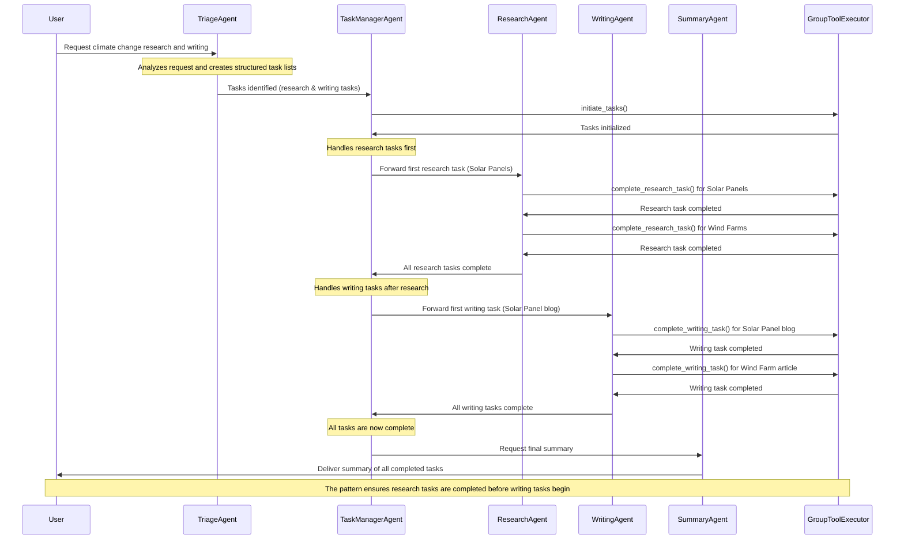

The Triage with Tasks Pattern is a workflow orchestration approach that breaks down complex user requests into structured task sequences with specialized agents handling specific task types in a sequential order.

This pattern excels at managing interdependent work where certain tasks must precede others, such as research before writing, while maintaining organized tracking of task status, priorities, and dependencies throughout the process.

By creating a clear task taxonomy and enforcing execution order, this pattern ensures each component of a complex request is handled by the most appropriate specialist agent while preserving the logical workflow dependencies.

This pattern is used within our [`DocAgent`](/docs/user-guide/reference-agents/docagent) ([code](https://github.com/ag2ai/ag2/blob/main/autogen/agents/experimental/document_agent/document_agent.py)).

### Key Characteristics


The Triage with Tasks Pattern establishes a structured workflow where complex requests are decomposed into discrete, prioritized tasks that flow through specialized agents in a predetermined sequence.

* **Task Decomposition**: Initial triage breaks requests into categorized tasks (e.g., research, writing).

* **Sequential Task Processing**: Tasks are processed in a logical order with enforced prerequisites (e.g., research tasks must complete before dependent writing tasks begin).

* **Specialized Task Agents**: Dedicated agents handle specific task types, focusing exclusively on their domain expertise.

* **Dynamic Task Management**: A central task manager tracks progress, maintains context, and routes tasks to appropriate agents based on current state and dependencies.

### Information Flow


The Triage with Tasks Pattern creates a structured information pipeline where tasks flow from initial triage agent through specialized processors in a determined sequence.

* **Triage Stage**: User requests are analyzed and decomposed into categorized, pre-defined, tasks.

* **Task Distribution**: Tasks flow through a central task manager that enforces the sequence, ensuring prerequisite tasks are completed before dependent ones begin.

* **Specialized Processing**: Each task is processed by a domain-specific agent that adds its expertise to the task output.

* **Consolidated Results**: Upon completion of all tasks, results are gathered and presented as a cohesive summary that reflects the relationships between the different task outputs.

### Implementation

Our implementation using AG2's Group Chat demonstrates the Triage with Tasks Pattern with a structured system that breaks user requests into research and writing tasks, ensuring research is completed before dependent writing begins, while maintaining comprehensive task tracking.

* **Structured Data Models**: Pydantic models (ResearchTask, WritingTask) define the explicit schema for different task types, ensuring consistent tracking and processing.

* **Context-Aware Task Management**: The TaskManager maintains rich context including task lists, completion status, and current task indices to ensure proper sequencing.

* **Dynamic System Messages**: Agent prompts update based on context, ensuring each agent always has current information about its assigned task.

* **Conditional Hand-offs**: [`OnContextCondition`](/docs/api-reference/autogen/agentchat/group/on_context_condition/OnContextCondition/#autogen.agentchat.group.on_context_condition.OnContextCondition) transitions efficiently route tasks based on current state, ensuring research is completed before writing begins, and providing a comprehensive summary when all tasks are finished.

## Agent Flow



## Code

<Tip>
In this code example we use OpenAI's GPT-4o mini with structured outputs.

We also set the LLM parameter `parallel_tool_calls` to False so that our agents don't recommend more than one tool call at a time. This parameter may not be available with all model providers.
</Tip>

```python
from copy import deepcopy
from enum import Enum
from typing import Annotated, Any, List, Tuple
from pydantic import BaseModel, Field
from autogen import (
    ConversableAgent,
    UpdateSystemMessage,
    ChatResult,
    LLMConfig
)
from autogen.agentchat import initiate_group_chat
from autogen.agentchat.group.patterns import DefaultPattern
from autogen.agentchat.group import ContextVariables, ReplyResult, AgentNameTarget, AgentTarget, OnContextCondition, ExpressionContextCondition, StayTarget, TerminateTarget, ContextExpression

# === STRUCTURED DATA MODELS ===

class TaskPriority(str, Enum):
    LOW = "low"
    MEDIUM = "medium"
    HIGH = "high"

class ResearchTask(BaseModel):
    topic: str = Field(description="Topic to research")
    details: str = Field(description="Specific details or questions to research")
    priority: TaskPriority = Field(description="Priority level of the task")

class WritingTask(BaseModel):
    topic: str = Field(description="Topic to write about")
    type: str = Field(description="Type of writing (article, email, report, etc.)")
    details: str = Field(description="Details or requirements for the writing task")
    priority: TaskPriority = Field(description="Priority level of the task")

class TaskAssignment(BaseModel):
    """Structured output for task triage decisions."""
    research_tasks: List[ResearchTask] = Field(description="List of research tasks to complete first")
    writing_tasks: List[WritingTask] = Field(description="List of writing tasks to complete after research")

# === AGENTS ===

# Task Manager
TASK_MANAGER_NAME = "TaskManagerAgent"
TASK_MANAGER_SYSTEM_MESSAGE = """
You are a task manager. Your responsibilities include:

1. Initialize tasks from the TriageAgent using the initiate_tasks tool
2. Route research tasks to the ResearchAgent (complete ALL research tasks first)
3. Route writing tasks to the WritingAgent (only after ALL research tasks are done)
4. Hand off to the SummaryAgent when all tasks are complete

Use tools to transfer to the appropriate agent based on the context variables.
Only call tools once in your response.
"""

# Research Agent
RESEARCH_AGENT_SYSTEM_MESSAGE = """
You are a research specialist who gathers information on various topics.

When assigned a research task:
1. Analyze the topic and required details
2. Provide comprehensive and accurate information
3. Focus on facts and reliable information
4. Use the complete_research_task tool to submit your findings

Be thorough but concise, and ensure your research is relevant to the specific request.
"""

# Writing Agent
WRITING_AGENT_SYSTEM_MESSAGE = """
You are a writing specialist who creates various types of content.

When assigned a writing task:
1. Review the topic, type, and requirements
2. Create well-structured, engaging content
3. Adapt your style to the specified type (article, email, report, etc.)
4. Use the complete_writing_task tool to submit your work

Focus on quality, clarity, and meeting the specific requirements of each task.
"""

# Summary Agent
SUMMARY_AGENT_SYSTEM_MESSAGE = """
You provide clear summaries of completed tasks.

Format your summary as follows:
1. Total research tasks completed
2. Total writing tasks completed
3. Brief overview of each completed task

Be concise and focus on the most important details and outcomes.
"""

# Error Agent
ERROR_AGENT_NAME = "ErrorAgent"
ERROR_AGENT_SYSTEM_MESSAGE = """
You communicate errors to the user. Include the original error messages in full.
Use the format:
The following error(s) occurred while processing your request:
- Error 1
- Error 2
"""

# === TOOL FUNCTIONS ===

def initiate_tasks(
    research_tasks: list[ResearchTask],
    writing_tasks: list[WritingTask],
    context_variables: ContextVariables,
) -> ReplyResult:
    """Initialize the task processing based on triage assessment."""
    if "TaskInitiated" in context_variables:
        return ReplyResult(
            message="Task already initiated",
            context_variables=context_variables
        )

    # Process tasks
    formatted_research_tasks = []
    for i, task in enumerate(research_tasks):
        formatted_research_tasks.append({
            "index": i,
            "topic": task.topic,
            "details": task.details,
            "priority": task.priority,
            "status": "pending",
            "output": None
        })

    formatted_writing_tasks = []
    for i, task in enumerate(writing_tasks):
        formatted_writing_tasks.append({
            "index": i,
            "topic": task.topic,
            "type": task.type,
            "details": task.details,
            "priority": task.priority,
            "status": "pending",
            "output": None
        })

    # Sort tasks by priority
    for task_list in [formatted_research_tasks, formatted_writing_tasks]:
        task_list.sort(key=lambda x: {"high": 0, "medium": 1, "low": 2}[x["priority"]])

    # Update context variables
    context_variables["ResearchTasks"] = formatted_research_tasks
    context_variables["WritingTasks"] = formatted_writing_tasks
    context_variables["CurrentResearchTaskIndex"] = -1 if not formatted_research_tasks else 0
    context_variables["CurrentWritingTaskIndex"] = -1 if not formatted_writing_tasks else 0
    context_variables["ResearchTasksCompleted"] = []
    context_variables["WritingTasksCompleted"] = []
    context_variables["TaskInitiated"] = True

    return ReplyResult(
        message="Initialized tasks for processing",
        context_variables=context_variables,
        target=AgentNameTarget(TASK_MANAGER_NAME),
    )

def complete_research_task(
    index: Annotated[int, "Research task index"],
    topic: Annotated[str, "Research topic"],
    findings: Annotated[str, "Research findings"],
    context_variables: ContextVariables,
) -> ReplyResult:
    """Complete a research task with findings."""
    try:
        current_index = context_variables["CurrentResearchTaskIndex"]

        if index != current_index:
            return ReplyResult(
                message=f"The index provided, {index}, does not match the current writing task index, {current_index}.",
                context_variables=context_variables,
                target=AgentNameTarget(TASK_MANAGER_NAME),
            )

        if current_index == -1:
            return ReplyResult(
                message="No current research task to complete.",
                context_variables=context_variables,
                target=AgentNameTarget(TASK_MANAGER_NAME),
            )

        current_task = context_variables["ResearchTasks"][current_index]

        # Update task status
        current_task["status"] = "completed"
        current_task["topic"] = topic
        current_task["output"] = findings

        # Move task to completed list
        context_variables["ResearchTasksCompleted"].append(current_task)

        # Move to the next research task, if there is one.
        if current_index + 1 >= len(context_variables["ResearchTasks"]):
            # No more tasks
            context_variables["ResearchTasksDone"] = True
            context_variables["CurrentResearchTaskIndex"] = -1
        else:
            # Move to the next task
            context_variables["CurrentResearchTaskIndex"] = current_index + 1

        return ReplyResult(
            message=f"Research task completed: {topic}",
            context_variables=context_variables,
        )
    except Exception as e:
        return ReplyResult(
            message=f"Error occurred with research task #{index}: {str(e)}",
            context_variables=context_variables,
            target=AgentNameTarget(ERROR_AGENT_NAME),
        )

def complete_writing_task(
    index: Annotated[int, "Writing task index"],
    topic: Annotated[str, "Writing topic"],
    findings: Annotated[str, "Writing findings"],
    context_variables: ContextVariables,
) -> ReplyResult:
    """Complete a writing task with content."""
    try:
        current_index = context_variables["CurrentWritingTaskIndex"]

        if index != current_index:
            return ReplyResult(
                message=f"The index provided, {index}, does not match the current writing task index, {current_index}.",
                context_variables=context_variables,
                target=AgentNameTarget(TASK_MANAGER_NAME),
            )

        if current_index == -1:
            return ReplyResult(
                message="No current writing task to complete.",
                context_variables=context_variables,
                target=AgentNameTarget(TASK_MANAGER_NAME),
            )

        current_task = context_variables["WritingTasks"][current_index]

        # Update task status
        current_task["status"] = "completed"
        current_task["topic"] = topic
        current_task["output"] = findings

        # Move task to completed list
        context_variables["WritingTasksCompleted"].append(current_task)

        # Move to the next research task, if there is one.
        if current_index + 1 >= len(context_variables["WritingTasks"]):
            # No more tasks
            context_variables["WritingTasksDone"] = True
            context_variables["CurrentWritingTaskIndex"] = -1
        else:
            # Move to the next task
            context_variables["CurrentWritingTaskIndex"] = current_index + 1

        return ReplyResult(
            message=f"Writing task completed: {topic}",
            context_variables=context_variables,
        )
    except Exception as e:
        return ReplyResult(
            message=f"Error occurred with writing task #{index}: {str(e)}",
            context_variables=context_variables,
            target=AgentNameTarget(ERROR_AGENT_NAME),
        )

# Create the agents for the group chat
def create_research_writing_group_chat(llm_config_base: dict[str, Any]):
    """Create and configure all agents for the research-writing group chat."""

    # Triage agent
    structured_config = deepcopy(llm_config_base)
    structured_config["config_list"][0]["response_format"] = TaskAssignment

    triage_agent = ConversableAgent(
        name="triage_agent",
        llm_config=structured_config,
        system_message=(
            "You are a task triage agent. You analyze requests and break them down into tasks.\n"
            "For each request, identify two types of tasks:\n"
            "1. Research tasks: Topics that need information gathering before writing\n"
            "2. Writing tasks: Content creation tasks that may depend on the research\n\n"
            "Structure all tasks with appropriate details and priority levels.\n"
            "Research tasks will be completed first, followed by writing tasks."
        ),
    )

    llm_config_with_tools = LLMConfig(model="gpt-4.1-mini", api_type="openai", parallel_tool_calls=False)


    # Task Manager agent
    task_manager_agent = ConversableAgent(
        name=TASK_MANAGER_NAME,
        system_message=TASK_MANAGER_SYSTEM_MESSAGE,
        llm_config=llm_config_with_tools,
        functions=[initiate_tasks],
    )

    # Define the system message generation for the research agent, getting the next research task
    def create_research_agent_prompt(agent: ConversableAgent, messages: list[dict[str, Any]]) -> str:
        """Create the research agent prompt with the current research task."""
        current_research_index = agent.context_variables.get("CurrentResearchTaskIndex", -1)
        research_tasks = agent.context_variables.get("ResearchTasks")

        if current_research_index >= 0:

            current_task = research_tasks[current_research_index]
            return (f"{RESEARCH_AGENT_SYSTEM_MESSAGE}"
                "\n\n"
                f"Research Task:\n"
                f"Index: {current_research_index}:\n"
                f"Topic: {current_task['topic']}\n"
                f"Details: {current_task['details']}\n"
            )
        else:
            return "No more research tasks to process."

    # Research agent
    research_agent = ConversableAgent(
        name="ResearchAgent",
        system_message=RESEARCH_AGENT_SYSTEM_MESSAGE,
        llm_config=llm_config_with_tools,
        functions=[complete_research_task],
        update_agent_state_before_reply=[UpdateSystemMessage(create_research_agent_prompt)],
    )

    # Define the system message generation for the writing agent, getting the next writing task
    def create_writing_agent_prompt(agent: ConversableAgent, messages: list[dict[str, Any]]) -> str:
        """Create the writing agent prompt with the current writing task."""
        current_writing_index = agent.context_variables.get("CurrentWritingTaskIndex", -1)
        writing_tasks = agent.context_variables.get("WritingTasks")

        if current_writing_index >= 0:

            current_task = writing_tasks[current_writing_index]
            return (f"{WRITING_AGENT_SYSTEM_MESSAGE}"
                "\n\n"
                f"Writing Task:\n"
                f"Index: {current_writing_index}:\n"
                f"Topic: {current_task['topic']}\n"
                f"Type: {current_task['type']}\n"
                f"Details: {current_task['details']}\n"
            )
        else:
            return "No more writing tasks to process."

    # Writing agent
    writing_agent = ConversableAgent(
        name="WritingAgent",
        system_message=WRITING_AGENT_SYSTEM_MESSAGE,
        llm_config=llm_config_with_tools,
        functions=[complete_writing_task],
        update_agent_state_before_reply=[UpdateSystemMessage(create_writing_agent_prompt)],
    )

    # Summary agent
    def create_summary_agent_prompt(agent: ConversableAgent, messages: list[dict[str, Any]]) -> str:
        """Create the summary agent prompt with task completion results."""
        research_tasks = agent.context_variables.get("ResearchTasksCompleted")
        writing_tasks = agent.context_variables.get("WritingTasksCompleted")

        system_message = (
            "You are a task summary specialist. Provide a summary of all completed tasks.\n\n"
            f"Research Tasks Completed: {len(research_tasks)}\n"
            f"Writing Tasks Completed: {len(writing_tasks)}\n\n"
            "Task Details:\n\n"
        )

        if research_tasks:
            system_message += "RESEARCH TASKS:\n"
            for i, task in enumerate(research_tasks, 1):
                system_message += (
                    f"{i}. Topic: {task['topic']}\n"
                    f"   Priority: {task['priority']}\n"
                    f"   Details: {task['details']}\n"
                    f"   Findings: {task['output'][:200]}...\n\n"
                )

        if writing_tasks:
            system_message += "WRITING TASKS:\n"
            for i, task in enumerate(writing_tasks, 1):
                system_message += (
                    f"{i}. Topic: {task['topic']}\n"
                    f"   Type: {task['type']}\n"
                    f"   Priority: {task['priority']}\n"
                    f"   Content: {task['output'][:200]}...\n\n"
                )

        return system_message

    # Create the summary agent
    summary_agent = ConversableAgent(
        name="SummaryAgent",
        llm_config=llm_config_base,
        system_message=SUMMARY_AGENT_SYSTEM_MESSAGE,
        update_agent_state_before_reply=[UpdateSystemMessage(create_summary_agent_prompt)],
    )

    # Create the error agent
    error_agent = ConversableAgent(
        name=ERROR_AGENT_NAME,
        system_message=ERROR_AGENT_SYSTEM_MESSAGE,
        llm_config=llm_config_base,
    )

    # Set up handoffs between agents

    # Triage agent always hands off to the Task Manager
    triage_agent.handoffs.set_after_work(AgentTarget(task_manager_agent))

    # Task Manager routes to Research and Writing agents if they have tasks
    # then to the Summary agent if the tasks are done
    task_manager_agent.handoffs.add_context_conditions(
        [
            OnContextCondition(
                target=AgentTarget(research_agent),
                condition=ExpressionContextCondition(ContextExpression("${CurrentResearchTaskIndex} >= 0")),
            ),
            OnContextCondition(
                target=AgentTarget(writing_agent),
                condition=ExpressionContextCondition(ContextExpression("${CurrentWritingTaskIndex} >= 0")),
            ),
            OnContextCondition(
                target=AgentTarget(summary_agent),
                condition=ExpressionContextCondition(ContextExpression("${ResearchTasksDone} and ${WritingTasksDone}")),
            ),
        ]
    )

    task_manager_agent.handoffs.set_after_work(StayTarget())

    # Research agent hands back to the Task Manager if they have no more tasks
    research_agent.handoffs.add_context_condition(
        OnContextCondition(
            target=AgentTarget(task_manager_agent),
            condition=ExpressionContextCondition(ContextExpression("${CurrentResearchTaskIndex} == -1")),
        ),
    )
    research_agent.handoffs.set_after_work(AgentTarget(task_manager_agent))

    # Writing agent hands back to the Task Manager if they have no more tasks
    writing_agent.handoffs.add_context_condition(
        OnContextCondition(
            target=AgentTarget(task_manager_agent),
            condition=ExpressionContextCondition(ContextExpression("${CurrentWritingTaskIndex} == -1")),
        ),
    )
    writing_agent.handoffs.set_after_work(AgentTarget(task_manager_agent))

    # The Summary Agent will summarize and then terminate
    summary_agent.handoffs.set_after_work(TerminateTarget())

    # If an error occurs, hand off to the Error Agent
    error_agent.handoffs.set_after_work(TerminateTarget())

    # Return all the agents
    return {
        "triage_agent": triage_agent,
        "task_manager_agent": task_manager_agent,
        "research_agent": research_agent,
        "writing_agent": writing_agent,
        "summary_agent": summary_agent,
        "error_agent": error_agent
    }

# Function to run the group chat
def run_research_writing(user_request: str) -> Tuple[ChatResult, ContextVariables]:
    """Run the research and writing group chat for a given user request."""

    llm_config_base = {
        "config_list": [{"model": "gpt-4.1-mini", "api_type": "openai"}],
    }

    # Create the agents
    agents = create_research_writing_group_chat(llm_config_base)

    # Set up initial context variables
    context_variables = ContextVariables({
        "CurrentResearchTaskIndex": -1,
        "CurrentWritingTaskIndex": -1,
        "ResearchTasksDone": False,
        "WritingTasksDone": False,
    })

    # Get all agents as a list
    all_agents = list(agents.values())

    agent_pattern = DefaultPattern(
        initial_agent=agents["triage_agent"],
        agents=all_agents,
        context_variables=context_variables,
        group_after_work=TerminateTarget()
    )

    # Run the group chat
    chat_result, final_context, _ = initiate_group_chat(
        pattern=agent_pattern,
        messages=user_request,
        max_rounds=100,
    )

    # Return the results
    return chat_result, final_context

# Example usage
if __name__ == "__main__":
    # Sample request
    request = "I need to write about climate change solutions. Can you help me research solar panels and wind farms and then write two articles a blog and a longer form article summarizing the state of these two technologies."

    # Run the group chat
    result, final_context = run_research_writing(request)

    # Display the Research
    print("\n===== RESEARCH =====\n")
    for i, research_task in enumerate(final_context["ResearchTasksCompleted"]):
        print(f"{research_task['index']}. Topic: {research_task['topic']}")
        print(f"Details: {research_task['details']}")
        print(f"Research: {research_task['output']}\n\n")

    # Display the Writing
    print("\n===== WRITING =====\n")
    for i, writing_task in enumerate(final_context["WritingTasksCompleted"]):
        print(f"{writing_task['index']}. Topic: {writing_task['topic']}")
        print(f"Type: {writing_task['type']}")
        print(f"Details: {writing_task['details']}")
        print(f"Content: {writing_task['output']}\n\n")

    # Print the result
    print("===== SUMMARY =====")
    print(result.summary)

    # Display the conversation flow
    print("\n===== SPEAKER ORDER =====\n")
    for message in result.chat_history:
        if "name" in message and message["name"] != "_Group_Tool_Executor":
            print(f"{message['name']}")
```

## Output

```console
_User (to chat_manager):

I need to write about climate change solutions. Can you help me research solar panels and wind farms and then write two articles a blog and a longer form article summarizing the state of these two technologies.

--------------------------------------------------------------------------------

Next speaker: triage_agent


>>>>>>>> USING AUTO REPLY...
triage_agent (to chat_manager):

{"research_tasks":[{"topic":"Solar Panels","details":"Research current technologies, benefits, challenges, and recent advancements related to solar panels as a climate change solution.","priority":"high"},{"topic":"Wind Farms","details":"Research current technologies, benefits, challenges, and recent advancements related to wind farms as a climate change solution.","priority":"high"}],"writing_tasks":[{"topic":"Climate Change Solutions: Solar Panels and Wind Farms - Blog Article","type":"article","details":"Write a blog article summarizing the state of solar panels and wind farms as climate change solutions, highlighting key benefits and recent developments.","priority":"medium"},{"topic":"Climate Change Solutions: Solar Panels and Wind Farms - Longer Form Article","type":"article","details":"Write a comprehensive article summarizing in-depth research on solar panels and wind farms, covering technologies, benefits, challenges, and future outlook.","priority":"high"}]}

--------------------------------------------------------------------------------

Next speaker: TaskManagerAgent


>>>>>>>> USING AUTO REPLY...
TaskManagerAgent (to chat_manager):

***** Suggested tool call (call_VHxLSJShQENq4ZJUOtE0Nk9t): initiate_tasks *****
Arguments:
{"research_tasks":[{"topic":"Solar Panels","details":"Research current technologies, benefits, challenges, and recent advancements related to solar panels as a climate change solution.","priority":"high"},{"topic":"Wind Farms","details":"Research current technologies, benefits, challenges, and recent advancements related to wind farms as a climate change solution.","priority":"high"}],"writing_tasks":[{"topic":"Climate Change Solutions: Solar Panels and Wind Farms - Blog Article","type":"article","details":"Write a blog article summarizing the state of solar panels and wind farms as climate change solutions, highlighting key benefits and recent developments.","priority":"medium"},{"topic":"Climate Change Solutions: Solar Panels and Wind Farms - Longer Form Article","type":"article","details":"Write a comprehensive article summarizing in-depth research on solar panels and wind farms, covering technologies, benefits, challenges, and future outlook.","priority":"high"}]}
*******************************************************************************

--------------------------------------------------------------------------------

Next speaker: _Group_Tool_Executor


>>>>>>>> EXECUTING FUNCTION initiate_tasks...
Call ID: call_VHxLSJShQENq4ZJUOtE0Nk9t
Input arguments: {'research_tasks': [{'topic': 'Solar Panels', 'details': 'Research current technologies, benefits, challenges, and recent advancements related to solar panels as a climate change solution.', 'priority': 'high'}, {'topic': 'Wind Farms', 'details': 'Research current technologies, benefits, challenges, and recent advancements related to wind farms as a climate change solution.', 'priority': 'high'}], 'writing_tasks': [{'topic': 'Climate Change Solutions: Solar Panels and Wind Farms - Blog Article', 'type': 'article', 'details': 'Write a blog article summarizing the state of solar panels and wind farms as climate change solutions, highlighting key benefits and recent developments.', 'priority': 'medium'}, {'topic': 'Climate Change Solutions: Solar Panels and Wind Farms - Longer Form Article', 'type': 'article', 'details': 'Write a comprehensive article summarizing in-depth research on solar panels and wind farms, covering technologies, benefits, challenges, and future outlook.', 'priority': 'high'}]}
_Group_Tool_Executor (to chat_manager):

***** Response from calling tool (call_VHxLSJShQENq4ZJUOtE0Nk9t) *****
Initialized tasks for processing
**********************************************************************

--------------------------------------------------------------------------------

Next speaker: TaskManagerAgent

TaskManagerAgent (to chat_manager):

[Handing off to ResearchAgent]

--------------------------------------------------------------------------------

Next speaker: ResearchAgent


>>>>>>>> USING AUTO REPLY...
ResearchAgent (to chat_manager):

***** Suggested tool call (call_2l0nchoObp2hRobukCdKUdtI): complete_research_task *****
Arguments:
{"index":0,"topic":"Solar Panels","findings":"Current Technologies: Modern solar panels primarily use photovoltaic (PV) technology to convert sunlight directly into electricity. Types include monocrystalline, polycrystalline, thin-film, and bifacial panels. Emerging technologies involve perovskite solar cells, tandem cells combining silicon and perovskite, and building-integrated photovoltaics (BIPV).\n\nBenefits: Solar panels provide clean, renewable energy, significantly reducing greenhouse gas emissions. They reduce dependency on fossil fuels, have low operational costs after installation, and can be deployed at various scales from residential rooftops to large solar farms.\n\nChallenges: Intermittency due to weather and day-night cycles, high upfront costs, land use concerns for large installations, efficiency limits, and recycling or disposal of end-of-life panels.\n\nRecent Advancements: Advances in perovskite technology promise higher efficiencies and lower costs. Bifacial panels increase energy capture by using reflected light. Improved energy storage integration with solar systems enhances reliability. Innovations in manufacturing, such as thinner and more flexible materials, are expanding installation possibilities and reducing material use."}
***************************************************************************************

--------------------------------------------------------------------------------

Next speaker: _Group_Tool_Executor


>>>>>>>> EXECUTING FUNCTION complete_research_task...
Call ID: call_2l0nchoObp2hRobukCdKUdtI
Input arguments: {'index': 0, 'topic': 'Solar Panels', 'findings': 'Current Technologies: Modern solar panels primarily use photovoltaic (PV) technology to convert sunlight directly into electricity. Types include monocrystalline, polycrystalline, thin-film, and bifacial panels. Emerging technologies involve perovskite solar cells, tandem cells combining silicon and perovskite, and building-integrated photovoltaics (BIPV).\n\nBenefits: Solar panels provide clean, renewable energy, significantly reducing greenhouse gas emissions. They reduce dependency on fossil fuels, have low operational costs after installation, and can be deployed at various scales from residential rooftops to large solar farms.\n\nChallenges: Intermittency due to weather and day-night cycles, high upfront costs, land use concerns for large installations, efficiency limits, and recycling or disposal of end-of-life panels.\n\nRecent Advancements: Advances in perovskite technology promise higher efficiencies and lower costs. Bifacial panels increase energy capture by using reflected light. Improved energy storage integration with solar systems enhances reliability. Innovations in manufacturing, such as thinner and more flexible materials, are expanding installation possibilities and reducing material use.'}
_Group_Tool_Executor (to chat_manager):

***** Response from calling tool (call_2l0nchoObp2hRobukCdKUdtI) *****
Research task completed: Solar Panels
**********************************************************************

--------------------------------------------------------------------------------

Next speaker: ResearchAgent


>>>>>>>> USING AUTO REPLY...
ResearchAgent (to chat_manager):

***** Suggested tool call (call_hAHXq9ZJMKi1eKbxhRFfoGPs): complete_research_task *****
Arguments:
{"index":1,"topic":"Wind Farms","findings":"Current Technologies: Wind farms deploy large-scale wind turbines that convert kinetic wind energy into electricity. Turbines use horizontal-axis systems predominantly, with sizes growing to multi-megawatt capacities and offshore developments increasing. Technology improvements include larger rotors, taller towers, and optimized blade design using aerodynamic modeling.\n\nBenefits: Wind farms provide a significant source of clean, renewable energy with near-zero emissions during operation. They reduce fossil fuel reliance and have relatively low operational expenses. Offshore wind farms tap stronger and more consistent winds, producing higher capacity factors.\n\nChallenges: Intermittency and variability of wind, visual and noise concerns, impact on wildlife (e.g., birds and bats), land use conflicts, and the need for grid infrastructure upgrades to handle variable input.\n\nRecent Advancements: Floating offshore wind turbines enable deployment in deeper waters previously inaccessible. Digitalization and AI optimize turbine performance and predictive maintenance. Larger offshore turbines exceeding 10 MW capacity improve economics and energy output. Hybrid projects combining wind with storage or other renewables enhance grid stability."}
***************************************************************************************

--------------------------------------------------------------------------------

Next speaker: _Group_Tool_Executor


>>>>>>>> EXECUTING FUNCTION complete_research_task...
Call ID: call_hAHXq9ZJMKi1eKbxhRFfoGPs
Input arguments: {'index': 1, 'topic': 'Wind Farms', 'findings': 'Current Technologies: Wind farms deploy large-scale wind turbines that convert kinetic wind energy into electricity. Turbines use horizontal-axis systems predominantly, with sizes growing to multi-megawatt capacities and offshore developments increasing. Technology improvements include larger rotors, taller towers, and optimized blade design using aerodynamic modeling.\n\nBenefits: Wind farms provide a significant source of clean, renewable energy with near-zero emissions during operation. They reduce fossil fuel reliance and have relatively low operational expenses. Offshore wind farms tap stronger and more consistent winds, producing higher capacity factors.\n\nChallenges: Intermittency and variability of wind, visual and noise concerns, impact on wildlife (e.g., birds and bats), land use conflicts, and the need for grid infrastructure upgrades to handle variable input.\n\nRecent Advancements: Floating offshore wind turbines enable deployment in deeper waters previously inaccessible. Digitalization and AI optimize turbine performance and predictive maintenance. Larger offshore turbines exceeding 10 MW capacity improve economics and energy output. Hybrid projects combining wind with storage or other renewables enhance grid stability.'}
_Group_Tool_Executor (to chat_manager):

***** Response from calling tool (call_hAHXq9ZJMKi1eKbxhRFfoGPs) *****
Research task completed: Wind Farms
**********************************************************************

--------------------------------------------------------------------------------

Next speaker: ResearchAgent

ResearchAgent (to chat_manager):

[Handing off to TaskManagerAgent]

--------------------------------------------------------------------------------

Next speaker: TaskManagerAgent

TaskManagerAgent (to chat_manager):

[Handing off to WritingAgent]

--------------------------------------------------------------------------------

Next speaker: WritingAgent


>>>>>>>> USING AUTO REPLY...
WritingAgent (to chat_manager):

***** Suggested tool call (call_6AVpE85nYDS2Vbc8IxsLZzTg): complete_writing_task *****
Arguments:
{"index":1,"topic":"Climate Change Solutions: Solar Panels and Wind Farms - Longer Form Article","findings":"Introduction\n\nClimate change represents one of the most pressing global challenges of our time, necessitating urgent adoption of clean and renewable energy solutions. Among the leading technologies combating the effects of climate change are solar panels and wind farms. These renewable energy sources offer sustainable alternatives to fossil fuel-based power generation, reducing greenhouse gas emissions and mitigating global warming.\n\nSolar Panels: Technologies, Benefits, Challenges, and Future Outlook\n\nSolar panels utilize photovoltaic (PV) technology to convert sunlight directly into electricity. The main types of solar panels include monocrystalline, polycrystalline, thin-film, and bifacial panels. Emerging advances such as perovskite solar cells and tandem cells combining silicon and perovskite materials promise higher efficiencies and reduced costs. Additionally, building-integrated photovoltaics (BIPV) seamlessly integrate solar panels into building materials for dual functionality.\n\nThe benefits of solar panels are numerous: they generate clean and renewable energy, reduce reliance on fossil fuels, lower greenhouse gas emissions, and offer scalability from household rooftops to vast solar farms. After the initial installation costs, solar panels require minimal operational expenses.\n\nHowever, challenges persist, including the intermittent nature of solar energy due to weather variability and night cycles, efficiency limits, the high upfront costs for installation, land use concerns for large-scale farms, and issues surrounding recycling and disposal of used panels.\n\nRecent advancements have enhanced the viability of solar energy. Technological innovations in perovskite materials have improved efficiency and cost-effectiveness. Bifacial panels increase energy yield by capturing reflected sunlight. Integration with energy storage systems improves reliability. Furthermore, new manufacturing techniques that produce thinner, more flexible panels open pathways for diverse applications and decreased resource use.\n\nWind Farms: Technologies, Benefits, Challenges, and Future Outlook\n\nWind farms harness kinetic energy from wind through large turbines, predominantly horizontal-axis designs with blades optimized through aerodynamic modeling. Increasingly, turbines have grown to multi-megawatt capacities, especially in offshore wind farms where stronger, more consistent winds prevail.\n\nWind energy presents significant benefits such as abundant clean power generation with negligible emissions during operation. Offshore wind developments further enhance capacity factors and energy reliability, lowering fossil fuel dependence. Operational expenses are relatively low once turbines are installed.\n\nDespite its advantages, wind energy faces challenges including intermittency and variability, environmental concerns related to noise and visual impacts, effects on wildlife such as birds and bats, land use competition, and the necessity to upgrade grid infrastructure to accommodate fluctuating input.\n\nRecent advancements include development of floating offshore turbines enabling deployment in deep waters previously inaccessible. The application of digitalization and artificial intelligence optimizes turbine performance and predictive maintenance. Larger turbines, exceeding 10 MW capacity, improve economies of scale, while hybrid renewable projects integrating wind with energy storage or solar diversify and stabilize energy supply.\n\nFuture Outlook\n\nLooking forward, the integration of solar and wind energy systems with advanced energy storage, grid modernization, and smart management technologies will be crucial to fully realize their potential in climate change mitigation. Continued research and investment in improving efficiency, reducing costs, addressing environmental concerns, and expanding accessibility will accelerate the transition to a sustainable energy future.\n\nConclusion\n\nSolar panels and wind farms represent cornerstone solutions in the global effort to combat climate change. Their evolving technologies, diverse benefits, and the proactive addressing of challenges forecast a promising path forward toward a cleaner, more sustainable planet."}
**************************************************************************************

--------------------------------------------------------------------------------

Next speaker: _Group_Tool_Executor


>>>>>>>> EXECUTING FUNCTION complete_writing_task...
Call ID: call_6AVpE85nYDS2Vbc8IxsLZzTg
Input arguments: {'index': 1, 'topic': 'Climate Change Solutions: Solar Panels and Wind Farms - Longer Form Article', 'findings': 'Introduction\n\nClimate change represents one of the most pressing global challenges of our time, necessitating urgent adoption of clean and renewable energy solutions. Among the leading technologies combating the effects of climate change are solar panels and wind farms. These renewable energy sources offer sustainable alternatives to fossil fuel-based power generation, reducing greenhouse gas emissions and mitigating global warming.\n\nSolar Panels: Technologies, Benefits, Challenges, and Future Outlook\n\nSolar panels utilize photovoltaic (PV) technology to convert sunlight directly into electricity. The main types of solar panels include monocrystalline, polycrystalline, thin-film, and bifacial panels. Emerging advances such as perovskite solar cells and tandem cells combining silicon and perovskite materials promise higher efficiencies and reduced costs. Additionally, building-integrated photovoltaics (BIPV) seamlessly integrate solar panels into building materials for dual functionality.\n\nThe benefits of solar panels are numerous: they generate clean and renewable energy, reduce reliance on fossil fuels, lower greenhouse gas emissions, and offer scalability from household rooftops to vast solar farms. After the initial installation costs, solar panels require minimal operational expenses.\n\nHowever, challenges persist, including the intermittent nature of solar energy due to weather variability and night cycles, efficiency limits, the high upfront costs for installation, land use concerns for large-scale farms, and issues surrounding recycling and disposal of used panels.\n\nRecent advancements have enhanced the viability of solar energy. Technological innovations in perovskite materials have improved efficiency and cost-effectiveness. Bifacial panels increase energy yield by capturing reflected sunlight. Integration with energy storage systems improves reliability. Furthermore, new manufacturing techniques that produce thinner, more flexible panels open pathways for diverse applications and decreased resource use.\n\nWind Farms: Technologies, Benefits, Challenges, and Future Outlook\n\nWind farms harness kinetic energy from wind through large turbines, predominantly horizontal-axis designs with blades optimized through aerodynamic modeling. Increasingly, turbines have grown to multi-megawatt capacities, especially in offshore wind farms where stronger, more consistent winds prevail.\n\nWind energy presents significant benefits such as abundant clean power generation with negligible emissions during operation. Offshore wind developments further enhance capacity factors and energy reliability, lowering fossil fuel dependence. Operational expenses are relatively low once turbines are installed.\n\nDespite its advantages, wind energy faces challenges including intermittency and variability, environmental concerns related to noise and visual impacts, effects on wildlife such as birds and bats, land use competition, and the necessity to upgrade grid infrastructure to accommodate fluctuating input.\n\nRecent advancements include development of floating offshore turbines enabling deployment in deep waters previously inaccessible. The application of digitalization and artificial intelligence optimizes turbine performance and predictive maintenance. Larger turbines, exceeding 10 MW capacity, improve economies of scale, while hybrid renewable projects integrating wind with energy storage or solar diversify and stabilize energy supply.\n\nFuture Outlook\n\nLooking forward, the integration of solar and wind energy systems with advanced energy storage, grid modernization, and smart management technologies will be crucial to fully realize their potential in climate change mitigation. Continued research and investment in improving efficiency, reducing costs, addressing environmental concerns, and expanding accessibility will accelerate the transition to a sustainable energy future.\n\nConclusion\n\nSolar panels and wind farms represent cornerstone solutions in the global effort to combat climate change. Their evolving technologies, diverse benefits, and the proactive addressing of challenges forecast a promising path forward toward a cleaner, more sustainable planet.'}
_Group_Tool_Executor (to chat_manager):

***** Response from calling tool (call_6AVpE85nYDS2Vbc8IxsLZzTg) *****
The index provided, 1, does not match the current writing task index, 0.
**********************************************************************

--------------------------------------------------------------------------------

Next speaker: TaskManagerAgent

TaskManagerAgent (to chat_manager):

[Handing off to WritingAgent]

--------------------------------------------------------------------------------

Next speaker: WritingAgent


>>>>>>>> USING AUTO REPLY...
WritingAgent (to chat_manager):

***** Suggested tool call (call_yBHmKH2Mxg4ET6uWsz6Uqfii): complete_writing_task *****
Arguments:
{"index":0,"topic":"Climate Change Solutions: Solar Panels and Wind Farms - Longer Form Article","findings":"Introduction\n\nClimate change is one of the most urgent global challenges today, driving a critical need for sustainable and renewable energy solutions. Among the most effective technologies addressing this challenge are solar panels and wind farms. These renewable energy sources reduce dependence on fossil fuels, cut greenhouse gas emissions, and help transition the world toward a cleaner energy future.\n\nSolar Panels: Technologies, Benefits, Challenges, and Future Outlook\n\nSolar panels primarily use photovoltaic (PV) technology to convert sunlight into electricity. Various types are widely used: monocrystalline for high efficiency, polycrystalline for cost-effectiveness, thin-film for flexibility, and bifacial panels that capture light from both sides. Innovations like perovskite solar cells and tandem cells—combining silicon and perovskite—are advancing the field by enhancing efficiency and lowering costs. Building-integrated photovoltaics (BIPV) are emerging as aesthetically pleasing, space-saving solutions where solar cells are integrated into building materials.\n\nThe benefits of solar energy include clean, renewable electricity generation that sharply reduces carbon emissions, scalable deployment from rooftops to utility-scale farms, and low operational costs after initial investment. However, challenges remain: solar output is intermittent, dependent on weather and daylight; upfront costs can be high; large solar farms require significant land; and end-of-life panel recycling and disposal present environmental concerns.\n\nRecent advancements address many of these challenges. Perovskite technology promises higher efficiency and affordability. Bifacial panels increase energy capture by using reflected sunlight from the environment. The integration of solar with energy storage systems helps mitigate intermittency, increasing reliability. Manufacturing innovations producing thinner, lighter, and flexible panels broaden application possibilities while reducing resource consumption.\n\nWind Farms: Technologies, Benefits, Challenges, and Future Outlook\n\nWind farms convert the kinetic energy of wind into electricity through large turbines, predominantly horizontal-axis types. Turbine sizes have grown substantially, with offshore wind farms harnessing powerful, more consistent winds. Advances in blade design, taller towers, and multi-megawatt turbines enhance energy yields and efficiency.\n\nWind energy provides significant environmental and economic benefits. It produces clean electricity with near-zero emissions, reduces reliance on fossil fuels, and benefits from relatively low operational costs. Offshore wind farms, in particular, achieve higher capacity factors due to steady winds.\n\nHowever, wind farms face challenges such as the variability of wind, land use and aesthetic impacts, noise concerns, potential harm to wildlife like birds and bats, and demands for upgraded grid infrastructure to manage intermittent energy input.\n\nRecent technological progress includes the development of floating offshore turbines, allowing installation in deep waters previously inaccessible. Digitalization and artificial intelligence applications optimize turbine performance and maintenance scheduling. Larger turbines exceeding 10 MW capacity improve economics of scale. Additionally, hybrid systems combining wind power with energy storage or complementing renewables boost grid stability.\n\nFuture Outlook\n\nThe future of these technologies lies in their integration with energy storage, smart grids, and improved materials and designs. Investment in research, infrastructure, and policy support will be essential to overcome remaining hurdles and enhance deployment worldwide. As efficiencies improve and costs continue to decline, solar panels and wind farms will play an increasingly vital role in combating climate change.\n\nConclusion\n\nSolar panels and wind farms stand as pivotal climate change solutions, offering scalable, renewable alternatives to fossil fuels. Continued innovation and expansion of these technologies promise a cleaner, more sustainable energy landscape critical for global climate stability."}
**************************************************************************************

--------------------------------------------------------------------------------

Next speaker: _Group_Tool_Executor


>>>>>>>> EXECUTING FUNCTION complete_writing_task...
Call ID: call_yBHmKH2Mxg4ET6uWsz6Uqfii
Input arguments: {'index': 0, 'topic': 'Climate Change Solutions: Solar Panels and Wind Farms - Longer Form Article', 'findings': 'Introduction\n\nClimate change is one of the most urgent global challenges today, driving a critical need for sustainable and renewable energy solutions. Among the most effective technologies addressing this challenge are solar panels and wind farms. These renewable energy sources reduce dependence on fossil fuels, cut greenhouse gas emissions, and help transition the world toward a cleaner energy future.\n\nSolar Panels: Technologies, Benefits, Challenges, and Future Outlook\n\nSolar panels primarily use photovoltaic (PV) technology to convert sunlight into electricity. Various types are widely used: monocrystalline for high efficiency, polycrystalline for cost-effectiveness, thin-film for flexibility, and bifacial panels that capture light from both sides. Innovations like perovskite solar cells and tandem cells—combining silicon and perovskite—are advancing the field by enhancing efficiency and lowering costs. Building-integrated photovoltaics (BIPV) are emerging as aesthetically pleasing, space-saving solutions where solar cells are integrated into building materials.\n\nThe benefits of solar energy include clean, renewable electricity generation that sharply reduces carbon emissions, scalable deployment from rooftops to utility-scale farms, and low operational costs after initial investment. However, challenges remain: solar output is intermittent, dependent on weather and daylight; upfront costs can be high; large solar farms require significant land; and end-of-life panel recycling and disposal present environmental concerns.\n\nRecent advancements address many of these challenges. Perovskite technology promises higher efficiency and affordability. Bifacial panels increase energy capture by using reflected sunlight from the environment. The integration of solar with energy storage systems helps mitigate intermittency, increasing reliability. Manufacturing innovations producing thinner, lighter, and flexible panels broaden application possibilities while reducing resource consumption.\n\nWind Farms: Technologies, Benefits, Challenges, and Future Outlook\n\nWind farms convert the kinetic energy of wind into electricity through large turbines, predominantly horizontal-axis types. Turbine sizes have grown substantially, with offshore wind farms harnessing powerful, more consistent winds. Advances in blade design, taller towers, and multi-megawatt turbines enhance energy yields and efficiency.\n\nWind energy provides significant environmental and economic benefits. It produces clean electricity with near-zero emissions, reduces reliance on fossil fuels, and benefits from relatively low operational costs. Offshore wind farms, in particular, achieve higher capacity factors due to steady winds.\n\nHowever, wind farms face challenges such as the variability of wind, land use and aesthetic impacts, noise concerns, potential harm to wildlife like birds and bats, and demands for upgraded grid infrastructure to manage intermittent energy input.\n\nRecent technological progress includes the development of floating offshore turbines, allowing installation in deep waters previously inaccessible. Digitalization and artificial intelligence applications optimize turbine performance and maintenance scheduling. Larger turbines exceeding 10 MW capacity improve economics of scale. Additionally, hybrid systems combining wind power with energy storage or complementing renewables boost grid stability.\n\nFuture Outlook\n\nThe future of these technologies lies in their integration with energy storage, smart grids, and improved materials and designs. Investment in research, infrastructure, and policy support will be essential to overcome remaining hurdles and enhance deployment worldwide. As efficiencies improve and costs continue to decline, solar panels and wind farms will play an increasingly vital role in combating climate change.\n\nConclusion\n\nSolar panels and wind farms stand as pivotal climate change solutions, offering scalable, renewable alternatives to fossil fuels. Continued innovation and expansion of these technologies promise a cleaner, more sustainable energy landscape critical for global climate stability.'}
_Group_Tool_Executor (to chat_manager):

***** Response from calling tool (call_yBHmKH2Mxg4ET6uWsz6Uqfii) *****
Writing task completed: Climate Change Solutions: Solar Panels and Wind Farms - Longer Form Article
**********************************************************************

--------------------------------------------------------------------------------

Next speaker: WritingAgent


>>>>>>>> USING AUTO REPLY...
WritingAgent (to chat_manager):

***** Suggested tool call (call_J0kSPzajwPfk7YipQ6Wxjrny): complete_writing_task *****
Arguments:
{"index":0,"topic":"Climate Change Solutions: Solar Panels and Wind Farms - Blog Article","findings":"Climate change requires urgent action, and renewable energy sources like solar panels and wind farms are leading the charge in providing sustainable solutions. \n\nSolar panels use photovoltaic technology to convert sunlight into electricity. They come in various types such as monocrystalline, polycrystalline, thin-film, and bifacial panels. Innovations like perovskite solar cells and building-integrated photovoltaics are improving efficiency and reducing costs. Solar energy helps reduce greenhouse gas emissions, lowers dependence on fossil fuels, and offers scalable solutions from rooftops to large solar farms. Challenges include weather-dependent output and high upfront costs, but recent advances in technology and energy storage are addressing these issues.\n\nWind farms utilize large turbines to convert wind energy into electricity. Modern turbines are getting larger and more efficient, especially with offshore developments tapping into stronger, steadier winds. Wind energy produces no emissions during operation and offers low operating costs. Challenges include wind variability, visual and noise concerns, and impacts on wildlife. Advances like floating offshore turbines, AI-driven maintenance, and hybrid systems with storage are making wind energy more reliable and economical.\n\nTogether, solar panels and wind farms form key pillars in the global transition to clean energy. Their continued technological progress and deployment expansion are vital for reducing carbon emissions and combating climate change effectively."}
**************************************************************************************

--------------------------------------------------------------------------------

Next speaker: _Group_Tool_Executor


>>>>>>>> EXECUTING FUNCTION complete_writing_task...
Call ID: call_J0kSPzajwPfk7YipQ6Wxjrny
Input arguments: {'index': 0, 'topic': 'Climate Change Solutions: Solar Panels and Wind Farms - Blog Article', 'findings': 'Climate change requires urgent action, and renewable energy sources like solar panels and wind farms are leading the charge in providing sustainable solutions. \n\nSolar panels use photovoltaic technology to convert sunlight into electricity. They come in various types such as monocrystalline, polycrystalline, thin-film, and bifacial panels. Innovations like perovskite solar cells and building-integrated photovoltaics are improving efficiency and reducing costs. Solar energy helps reduce greenhouse gas emissions, lowers dependence on fossil fuels, and offers scalable solutions from rooftops to large solar farms. Challenges include weather-dependent output and high upfront costs, but recent advances in technology and energy storage are addressing these issues.\n\nWind farms utilize large turbines to convert wind energy into electricity. Modern turbines are getting larger and more efficient, especially with offshore developments tapping into stronger, steadier winds. Wind energy produces no emissions during operation and offers low operating costs. Challenges include wind variability, visual and noise concerns, and impacts on wildlife. Advances like floating offshore turbines, AI-driven maintenance, and hybrid systems with storage are making wind energy more reliable and economical.\n\nTogether, solar panels and wind farms form key pillars in the global transition to clean energy. Their continued technological progress and deployment expansion are vital for reducing carbon emissions and combating climate change effectively.'}
_Group_Tool_Executor (to chat_manager):

***** Response from calling tool (call_J0kSPzajwPfk7YipQ6Wxjrny) *****
The index provided, 0, does not match the current writing task index, 1.
**********************************************************************

--------------------------------------------------------------------------------

Next speaker: TaskManagerAgent

TaskManagerAgent (to chat_manager):

[Handing off to WritingAgent]

--------------------------------------------------------------------------------

Next speaker: WritingAgent


>>>>>>>> USING AUTO REPLY...
WritingAgent (to chat_manager):

***** Suggested tool call (call_CTSCll4CWA1L9qbFT6l3mkKf): complete_writing_task *****
Arguments:
{"index":1,"topic":"Climate Change Solutions: Solar Panels and Wind Farms - Blog Article","findings":"Climate change demands immediate solutions, and solar panels alongside wind farms have emerged as two of the most promising technologies in the renewable energy sector. These methods harness the power of the sun and wind to generate clean electricity, significantly reducing greenhouse gas emissions and dependency on fossil fuels.\n\nSolar panels utilize photovoltaic technology to convert sunlight directly into electricity. Different types like monocrystalline, polycrystalline, thin-film, and bifacial panels provide options for varying efficiency and cost needs. Innovations such as perovskite solar cells and building-integrated photovoltaics are enhancing efficiency and integration capabilities. While solar energy is sustainable and scalable from residential to utility levels, challenges remain around intermittency and initial costs. Recent advancements, including better energy storage systems and bifacial designs, are improving overall efficiency and reliability.\n\nWind farms capture kinetic energy from wind using large turbines, which have grown in capacity and sophistication over the years. Offshore wind farms, in particular, tap into stronger and more consistent winds, boosting energy production. These farms offer clean energy with minimal environmental impact during operation, though challenges such as wildlife protection and noise considerations need addressing. Recent progress like floating offshore turbines and AI-driven maintenance systems is increasing performance and cost-effectiveness.\n\nTogether, solar panels and wind farms provide scalable, renewable energy solutions essential for combating climate change. Ongoing technological advancements and broader adoption promise a cleaner, sustainable energy future."}
**************************************************************************************

--------------------------------------------------------------------------------

Next speaker: _Group_Tool_Executor


>>>>>>>> EXECUTING FUNCTION complete_writing_task...
Call ID: call_CTSCll4CWA1L9qbFT6l3mkKf
Input arguments: {'index': 1, 'topic': 'Climate Change Solutions: Solar Panels and Wind Farms - Blog Article', 'findings': 'Climate change demands immediate solutions, and solar panels alongside wind farms have emerged as two of the most promising technologies in the renewable energy sector. These methods harness the power of the sun and wind to generate clean electricity, significantly reducing greenhouse gas emissions and dependency on fossil fuels.\n\nSolar panels utilize photovoltaic technology to convert sunlight directly into electricity. Different types like monocrystalline, polycrystalline, thin-film, and bifacial panels provide options for varying efficiency and cost needs. Innovations such as perovskite solar cells and building-integrated photovoltaics are enhancing efficiency and integration capabilities. While solar energy is sustainable and scalable from residential to utility levels, challenges remain around intermittency and initial costs. Recent advancements, including better energy storage systems and bifacial designs, are improving overall efficiency and reliability.\n\nWind farms capture kinetic energy from wind using large turbines, which have grown in capacity and sophistication over the years. Offshore wind farms, in particular, tap into stronger and more consistent winds, boosting energy production. These farms offer clean energy with minimal environmental impact during operation, though challenges such as wildlife protection and noise considerations need addressing. Recent progress like floating offshore turbines and AI-driven maintenance systems is increasing performance and cost-effectiveness.\n\nTogether, solar panels and wind farms provide scalable, renewable energy solutions essential for combating climate change. Ongoing technological advancements and broader adoption promise a cleaner, sustainable energy future.'}
_Group_Tool_Executor (to chat_manager):

***** Response from calling tool (call_CTSCll4CWA1L9qbFT6l3mkKf) *****
Writing task completed: Climate Change Solutions: Solar Panels and Wind Farms - Blog Article
**********************************************************************

--------------------------------------------------------------------------------

Next speaker: WritingAgent

WritingAgent (to chat_manager):

[Handing off to TaskManagerAgent]

--------------------------------------------------------------------------------

Next speaker: TaskManagerAgent

TaskManagerAgent (to chat_manager):

[Handing off to SummaryAgent]

--------------------------------------------------------------------------------

Next speaker: SummaryAgent


>>>>>>>> USING AUTO REPLY...
SummaryAgent (to chat_manager):

Summary of Completed Tasks:

Research Tasks:
1. Solar Panels: Researched current photovoltaic technologies including monocrystalline, polycrystalline, thin-film, bifacial, and emerging perovskite solar cells. Identified benefits such as clean, scalable renewable energy with low operating costs, and challenges like intermittency, upfront costs, land use, and recycling concerns. Covered recent advancements in perovskite technology, bifacial panels, energy storage integration, and manufacturing improvements.
2. Wind Farms: Investigated large-scale wind turbine technologies, focusing on horizontal-axis turbines with increasing sizes and offshore development. Highlighted benefits of clean, low-emission electricity and relatively low operations costs, along with challenges including intermittency, environmental impact, noise, and grid infrastructure needs. Noted advancements such as floating offshore turbines, AI-optimized maintenance, larger turbines, and hybrid renewable integrations.

Writing Tasks:
1. Longer Form Article: Produced a comprehensive article covering the technologies, benefits, challenges, recent advancements, and future outlook for solar panels and wind farms as key climate change solutions. The article emphasized technological innovations, environmental benefits, and the integration of these renewables for a sustainable energy future.
2. Blog Article: Created a concise blog post summarizing the role of solar panels and wind farms in combating climate change. The blog highlighted the clean energy potential, types and innovations of each technology, challenges faced, and recent improvements enhancing reliability and cost-effectiveness.

Both the research and writing tasks were completed with a focus on providing detailed, up-to-date information and actionable insights on solar and wind energy technologies as critical components in mitigating climate change.

--------------------------------------------------------------------------------

>>>>>>>> TERMINATING RUN (73476d77-e5e1-4d87-95e8-dd87fdd65a30): No next speaker selected

===== RESEARCH =====

0. Topic: Solar Panels
Details: Research current technologies, benefits, challenges, and recent advancements related to solar panels as a climate change solution.
Research: Current Technologies: Modern solar panels primarily use photovoltaic (PV) technology to convert sunlight directly into electricity. Types include monocrystalline, polycrystalline, thin-film, and bifacial panels. Emerging technologies involve perovskite solar cells, tandem cells combining silicon and perovskite, and building-integrated photovoltaics (BIPV).

Benefits: Solar panels provide clean, renewable energy, significantly reducing greenhouse gas emissions. They reduce dependency on fossil fuels, have low operational costs after installation, and can be deployed at various scales from residential rooftops to large solar farms.

Challenges: Intermittency due to weather and day-night cycles, high upfront costs, land use concerns for large installations, efficiency limits, and recycling or disposal of end-of-life panels.

Recent Advancements: Advances in perovskite technology promise higher efficiencies and lower costs. Bifacial panels increase energy capture by using reflected light. Improved energy storage integration with solar systems enhances reliability. Innovations in manufacturing, such as thinner and more flexible materials, are expanding installation possibilities and reducing material use.


1. Topic: Wind Farms
Details: Research current technologies, benefits, challenges, and recent advancements related to wind farms as a climate change solution.
Research: Current Technologies: Wind farms deploy large-scale wind turbines that convert kinetic wind energy into electricity. Turbines use horizontal-axis systems predominantly, with sizes growing to multi-megawatt capacities and offshore developments increasing. Technology improvements include larger rotors, taller towers, and optimized blade design using aerodynamic modeling.

Benefits: Wind farms provide a significant source of clean, renewable energy with near-zero emissions during operation. They reduce fossil fuel reliance and have relatively low operational expenses. Offshore wind farms tap stronger and more consistent winds, producing higher capacity factors.

Challenges: Intermittency and variability of wind, visual and noise concerns, impact on wildlife (e.g., birds and bats), land use conflicts, and the need for grid infrastructure upgrades to handle variable input.

Recent Advancements: Floating offshore wind turbines enable deployment in deeper waters previously inaccessible. Digitalization and AI optimize turbine performance and predictive maintenance. Larger offshore turbines exceeding 10 MW capacity improve economics and energy output. Hybrid projects combining wind with storage or other renewables enhance grid stability.


===== WRITING =====

1. Topic: Climate Change Solutions: Solar Panels and Wind Farms - Longer Form Article
Type: article
Details: Write a comprehensive article summarizing in-depth research on solar panels and wind farms, covering technologies, benefits, challenges, and future outlook.
Content: Introduction

Climate change is one of the most urgent global challenges today, driving a critical need for sustainable and renewable energy solutions. Among the most effective technologies addressing this challenge are solar panels and wind farms. These renewable energy sources reduce dependence on fossil fuels, cut greenhouse gas emissions, and help transition the world toward a cleaner energy future.

Solar Panels: Technologies, Benefits, Challenges, and Future Outlook

Solar panels primarily use photovoltaic (PV) technology to convert sunlight into electricity. Various types are widely used: monocrystalline for high efficiency, polycrystalline for cost-effectiveness, thin-film for flexibility, and bifacial panels that capture light from both sides. Innovations like perovskite solar cells and tandem cells—combining silicon and perovskite—are advancing the field by enhancing efficiency and lowering costs. Building-integrated photovoltaics (BIPV) are emerging as aesthetically pleasing, space-saving solutions where solar cells are integrated into building materials.

The benefits of solar energy include clean, renewable electricity generation that sharply reduces carbon emissions, scalable deployment from rooftops to utility-scale farms, and low operational costs after initial investment. However, challenges remain: solar output is intermittent, dependent on weather and daylight; upfront costs can be high; large solar farms require significant land; and end-of-life panel recycling and disposal present environmental concerns.

Recent advancements address many of these challenges. Perovskite technology promises higher efficiency and affordability. Bifacial panels increase energy capture by using reflected sunlight from the environment. The integration of solar with energy storage systems helps mitigate intermittency, increasing reliability. Manufacturing innovations producing thinner, lighter, and flexible panels broaden application possibilities while reducing resource consumption.

Wind Farms: Technologies, Benefits, Challenges, and Future Outlook

Wind farms convert the kinetic energy of wind into electricity through large turbines, predominantly horizontal-axis types. Turbine sizes have grown substantially, with offshore wind farms harnessing powerful, more consistent winds. Advances in blade design, taller towers, and multi-megawatt turbines enhance energy yields and efficiency.

Wind energy provides significant environmental and economic benefits. It produces clean electricity with near-zero emissions, reduces reliance on fossil fuels, and benefits from relatively low operational costs. Offshore wind farms, in particular, achieve higher capacity factors due to steady winds.

However, wind farms face challenges such as the variability of wind, land use and aesthetic impacts, noise concerns, potential harm to wildlife like birds and bats, and demands for upgraded grid infrastructure to manage intermittent energy input.

Recent technological progress includes the development of floating offshore turbines, allowing installation in deep waters previously inaccessible. Digitalization and artificial intelligence applications optimize turbine performance and maintenance scheduling. Larger turbines exceeding 10 MW capacity improve economics of scale. Additionally, hybrid systems combining wind power with energy storage or complementing renewables boost grid stability.

Future Outlook

The future of these technologies lies in their integration with energy storage, smart grids, and improved materials and designs. Investment in research, infrastructure, and policy support will be essential to overcome remaining hurdles and enhance deployment worldwide. As efficiencies improve and costs continue to decline, solar panels and wind farms will play an increasingly vital role in combating climate change.

Conclusion

Solar panels and wind farms stand as pivotal climate change solutions, offering scalable, renewable alternatives to fossil fuels. Continued innovation and expansion of these technologies promise a cleaner, more sustainable energy landscape critical for global climate stability.


0. Topic: Climate Change Solutions: Solar Panels and Wind Farms - Blog Article
Type: article
Details: Write a blog article summarizing the state of solar panels and wind farms as climate change solutions, highlighting key benefits and recent developments.
Content: Climate change demands immediate solutions, and solar panels alongside wind farms have emerged as two of the most promising technologies in the renewable energy sector. These methods harness the power of the sun and wind to generate clean electricity, significantly reducing greenhouse gas emissions and dependency on fossil fuels.

Solar panels utilize photovoltaic technology to convert sunlight directly into electricity. Different types like monocrystalline, polycrystalline, thin-film, and bifacial panels provide options for varying efficiency and cost needs. Innovations such as perovskite solar cells and building-integrated photovoltaics are enhancing efficiency and integration capabilities. While solar energy is sustainable and scalable from residential to utility levels, challenges remain around intermittency and initial costs. Recent advancements, including better energy storage systems and bifacial designs, are improving overall efficiency and reliability.

Wind farms capture kinetic energy from wind using large turbines, which have grown in capacity and sophistication over the years. Offshore wind farms, in particular, tap into stronger and more consistent winds, boosting energy production. These farms offer clean energy with minimal environmental impact during operation, though challenges such as wildlife protection and noise considerations need addressing. Recent progress like floating offshore turbines and AI-driven maintenance systems is increasing performance and cost-effectiveness.

Together, solar panels and wind farms provide scalable, renewable energy solutions essential for combating climate change. Ongoing technological advancements and broader adoption promise a cleaner, sustainable energy future.


===== SUMMARY =====
Summary of Completed Tasks:

Research Tasks:
1. Solar Panels: Researched current photovoltaic technologies including monocrystalline, polycrystalline, thin-film, bifacial, and emerging perovskite solar cells. Identified benefits such as clean, scalable renewable energy with low operating costs, and challenges like intermittency, upfront costs, land use, and recycling concerns. Covered recent advancements in perovskite technology, bifacial panels, energy storage integration, and manufacturing improvements.
2. Wind Farms: Investigated large-scale wind turbine technologies, focusing on horizontal-axis turbines with increasing sizes and offshore development. Highlighted benefits of clean, low-emission electricity and relatively low operations costs, along with challenges including intermittency, environmental impact, noise, and grid infrastructure needs. Noted advancements such as floating offshore turbines, AI-optimized maintenance, larger turbines, and hybrid renewable integrations.

Writing Tasks:
1. Longer Form Article: Produced a comprehensive article covering the technologies, benefits, challenges, recent advancements, and future outlook for solar panels and wind farms as key climate change solutions. The article emphasized technological innovations, environmental benefits, and the integration of these renewables for a sustainable energy future.
2. Blog Article: Created a concise blog post summarizing the role of solar panels and wind farms in combating climate change. The blog highlighted the clean energy potential, types and innovations of each technology, challenges faced, and recent improvements enhancing reliability and cost-effectiveness.

Both the research and writing tasks were completed with a focus on providing detailed, up-to-date information and actionable insights on solar and wind energy technologies as critical components in mitigating climate change.

===== SPEAKER ORDER =====

triage_agent
TaskManagerAgent
TaskManagerAgent
ResearchAgent
ResearchAgent
ResearchAgent
TaskManagerAgent
WritingAgent
TaskManagerAgent
WritingAgent
WritingAgent
TaskManagerAgent
WritingAgent
WritingAgent
TaskManagerAgent
SummaryAgent
```
