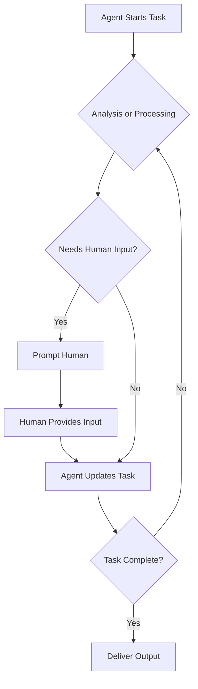

## What is Human In The Loop (HITL) - An Analogy

Think of Human In the Loop (HITL) like a cooking assistant in your kitchen.

The assistant can chop veggies, measure ingredients, and follow a recipe fast, but it checks with you before tossing everything into the pot.

Why? Because:

- Some dishes need your taste test to get the flavor just right
- A mistake could ruin the meal
- You might want tweaks based on who's eating

*This setup lets the assistant do the heavy lifting while you make the big calls.*

## A More Formal Definition of HITL

Human in the Loop (HITL) is a workflow pattern that enables Agents to collaborate with humans to complete tasks.

It allows for human intervention at critical points in the process, ensuring that the final output meets the desired quality and accuracy standards.

Usually, the human provides authority, approval or feedback - whereas the agent does the heavy lifting.

## HITL Flow Diagram

## When to Use HITL - A Few High Level Examples

- Tasks require nuanced judgment (e.g., legal compliance, creative content).
- Errors could have significant consequences (e.g., medical diagnostics, financial audits).
- The system needs to adapt to subjective or context-specific requirements (e.g., personalized lesson planning)

## Example #1: Lesson Planning Assistant

In the previous [ConversableAgent](/docs/user-guide/basic-concepts/conversable-agent) example we demonstrated that you were able to chat with an agent.

As you build your own workflows, you can decide if and how to use your *human in the loop* agents. As demonstrated previously, and in the following example, to do so, simply use the `ConversableAgent` and set the `human_input_mode` to `ALWAYS`.

Let's start to build a more useful scenario, a classroom lesson planner, and create our human agent.

You'll also see in this example that you can use the `system_message` property to give detailed instructions to agents.

In this example we demonstrate a simulation of a _financial compliance assistant_ that:

-   Automatically reviews randomly generated transactions.
-   Flags suspicious ones for **human review** (interactive).
-   Produces a summary report at the end indicating:
    -   Auto-approved transactions
    -   Transactions denied or left pending for the human

<Note>

You must set the environment variable `OPENAI_API_KEY` or define credentials in your `OAI_CONFIG_LIST`.
**If missing**, you'll encounter authentication errors or your agent won't be able to connect to the LLM backend.

</Note>

import Example from "/snippets/python-examples/humanintheloop.mdx";

<Example/>

#### See it in Action:

1. Create our human-in-the-loop agent by setting its `human_input_mode`, and no `llm_config` is required.

2. Our `the_human` agent starts a conversation by sending a message to `lesson_planner`. An agent's `initiate_chat` method is used to start a conversation between two agents.

This creates a conversation between you and the lesson planner agent.

## Example #2: Financial Fraud Detector

In this example, we will create a financial fraud detection agent that uses a human in the loop to verify potential fraud cases.
The agent will analyze transactions and flag any suspicious ones for human review. The human will then decide whether to approve or reject the flagged transactions.

At the end, the agent will summarize the results of the review.

import ExampleHITLFinance from "/snippets/python-examples/humanintheloop_financial.mdx";

<ExampleHITLFinance/>

#### See it in Action:

## Quick Recap of HITL Technical Details

[ConversableAgent](/docs/user-guide/basic-concepts/conversable-agent):

Represents either a bot or a human participant in the conversation.

The system_message guides the AI agent’s role or reasoning style.

[LLMConfig](/docs/user-guide/advanced-concepts/llm-configuration-deep-dive/):

Encapsulates model and API settings.

Uses a JSON config (e.g., `OAI_CONFIG_LIST`) to load the model and credentials.

`human_input_mode="ALWAYS"`:

Ensures the human agent (simulated via terminal) must respond when prompted by the system.

Ensures manual intervention in ambiguous or flagged cases.

`initiate_chat(...)`:

Starts the conversation from one agent (in this case, human) by sending a message to another (finance_bot).
