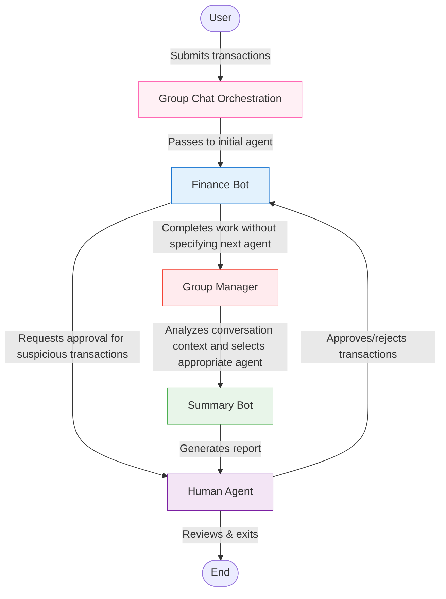
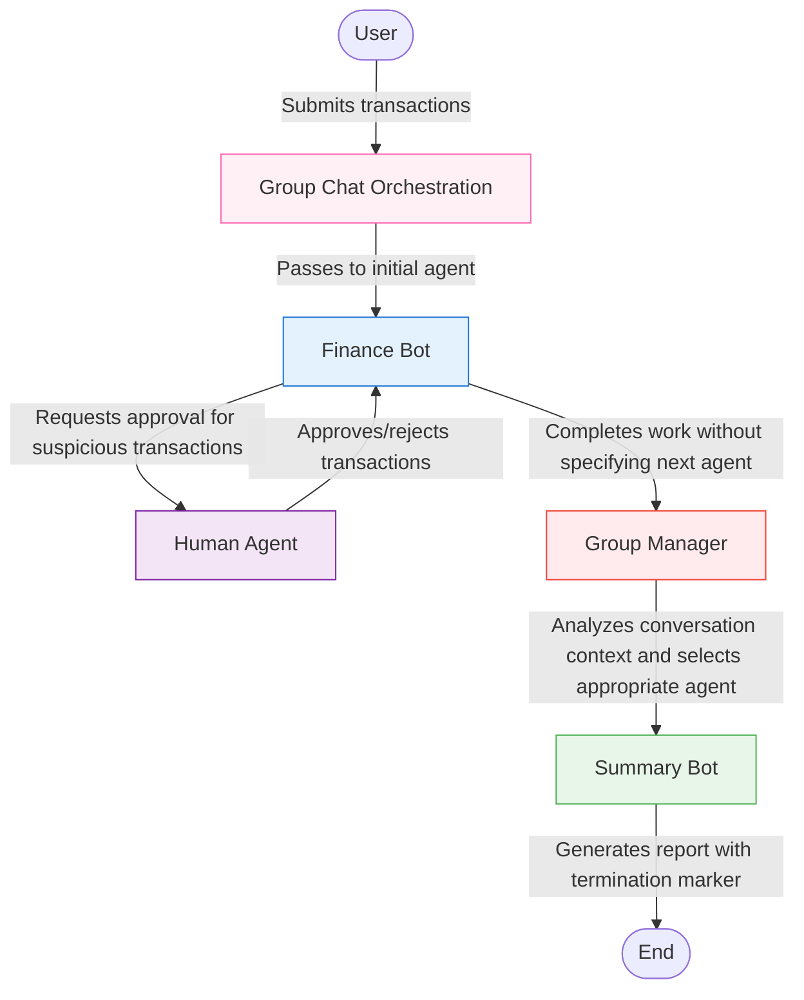

In our financial compliance example, we've successfully implemented a human-in-the-loop agent that processes transactions and flags suspicious ones for human approval. This works well for basic compliance checking, but what if we need to provide detailed summary reports after all transactions are processed?

We could expand the system message of our `finance_bot` to include this functionality, but this approach isn't scalable as requirements grow more complex. The `finance_bot` would have multiple responsibilities, making it harder to maintain and extend.

## The Need for Specialized Agents

As our financial compliance system evolves, we might need to:

- Generate formatted summary reports of all transactions
- Perform risk analysis on transaction patterns
- Create visualizations of financial data
- Send notifications to relevant stakeholders

Each of these tasks requires different specialized knowledge and skills. This is where AG2's orchestration patterns come in - they allow us to coordinate multiple specialized agents to work together seamlessly.

## Introducing the Group Chat Pattern

AG2 offers several orchestration patterns, and for our evolving financial compliance system, the Group Chat pattern is particularly powerful. It allows specialized agents to collaborate with dynamic handoffs to achieve complex workflows.

**An Analogy for Group Chat Pattern**:

Continuing our hospital treatment system analogy from the HITL. Think of the Group Chat pattern like a hospital emergency in the hospital:

- The patient first sees whichever specialist is most appropriate (a triage agent)
- Each specialist (specialized agent) handles a specific aspect of patient care
- After completing their work, specialists can explicitly transfer the patient to another specialist based on what they found (agent handoffs)
- If a specialist doesn't specify who should see the patient next, we can revert to the hospital coordinator (Group chat manager) who can review the patient's chart and decide which specialist would be most appropriate
- The patient record follows them through the entire process (shared context)
- The entire system works together to ensure the patient receives the right care at the right time

This pattern leverages specialized skills while maintaining a cohesive workflow across multiple participants, with both direct handoffs and intelligent coordination when needed.

## From Concept to Implementation

Implementing a group chat in AG2 is a simple two-step process:

- First, **create a pattern** that defines how agents will interact
- Then, **initialize the group chat** using the pattern

The pattern defines the orchestration logic - which agents are involved, who speaks first, and how to transition between agents. AG2 provides several pre-defined patterns to choose from:

- **DefaultPattern**: A minimal pattern for simple agent interactions where the handoffs and transitions needs to be explicitly defined
- **AutoPattern**: Automatically selects the next speaker based on conversation context
- **RoundRobinPattern**: Agents speak in a defined sequence
- **RandomPattern**: Randomly selects the next speaker
- **ManualPattern**: Allows human selection of the next speaker

The easiest pattern to get started with is the **AutoPattern**, where a group manager agent automatically selects agents to speak by evaluating the messages in the chat and the descriptions of the agents. This creates a natural workflow where the most appropriate agent responds based on the conversation context.

Here's how you implement a basic group chat:

```python hl_lines="14-19 22-25"
from autogen import ConversableAgent, LLMConfig
from autogen.agentchat import initiate_group_chat
from autogen.agentchat.group.patterns import AutoPattern

# Create your specialized agents
with llm_config:
    agent_1 = ConversableAgent(name="agent_1", system_message="...")
    agent_2 = ConversableAgent(name="agent_2", system_message="...")

# Create human agent if needed
human = ConversableAgent(name="human", human_input_mode="ALWAYS")

# Set up the pattern for orchestration
pattern = AutoPattern(
    initial_agent=agent_1,              # Agent that starts the workflow
    agents=[agent_1, agent_2],          # All agents in the group chat
    user_agent=human,                   # Human agent for interaction
    group_manager_args={"llm_config": llm_config}  # Config for group manager
)

# Initialize the group chat
result, context_variables, last_agent = initiate_group_chat(
    pattern=pattern,
    messages="Initial request",         # Starting message
)
```

## Enhancing Our Financial Compliance System with Group Chat

Now that we understand the group chat pattern, let's see how it solves our challenge of adding specialized summary reporting to our financial compliance system.

### The Challenge

In our Human in the Loop example, we built a `finance_bot` that could process transactions and get human approval for suspicious ones. However, we now need professional, formatted summary reports of all the transactions.

### Our Group Chat Solution

Here's how we'll enhance our system:

- Keep the `finance_bot` focused on transaction processing and human approval
- Create a new `summary_bot` specialized in generating formatted transaction reports
- Use the group chat with `AutoPattern` pattern to automatically transition from `finance_bot` to `summary_bot` when all transactions are processed
- Maintain human oversight for suspicious transaction approval and to terminate the conversation

### Implementation: Creating the Necessary Agents

Let's create a new specialized agent for generating summary reports. We'll also keep our existing `finance_bot` for transaction processing and a human agent for oversight.

```python hl_lines="30-40 48-51"
from autogen import ConversableAgent, LLMConfig
from autogen.agentchat import initiate_group_chat
from autogen.agentchat.group.patterns import AutoPattern

import os
import random

# Note: Make sure to set your API key in your environment first

# Configure the LLM
llm_config = LLMConfig(
    api_type="openai",
    model="gpt-4o-mini",
    api_key=os.environ.get("OPENAI_API_KEY"),
    temperature=0.2,
)

# Define the system message for our finance bot
finance_system_message = """
You are a financial compliance assistant. You will be given a set of transaction descriptions.
For each transaction:
- If it seems suspicious (e.g., amount > $10,000, vendor is unusual, memo is vague), ask the human agent for approval.
- Otherwise, approve it automatically.
Provide the full set of transactions to approve at one time.
If the human gives a general approval, it applies to all transactions requiring approval.
When all transactions are processed, summarize the results and say "You can type exit to finish".
"""

# Define the system message for the summary agent
summary_system_message = """
You are a financial summary assistant. You will be given a set of transaction details and their approval status.
Your task is to summarize the results of the transactions processed by the finance bot.
Generate a markdown table with the following columns:
- Vendor
- Memo
- Amount
- Status (Approved/Rejected)
The summary should include the total number of transactions, the number of approved transactions, and the number of rejected transactions.
The summary should be concise and clear.
"""

# Create the finance agent with LLM intelligence
with llm_config:
    finance_bot = ConversableAgent(
        name="finance_bot",
        system_message=finance_system_message,
    )
    summary_bot = ConversableAgent(
        name="summary_bot",
        system_message=summary_system_message,
    )

# Create the human agent for oversight
human = ConversableAgent(
    name="human",
    human_input_mode="ALWAYS",  # Always ask for human input
)
```

### Initiating the Group Chat

Now let's set up our group chat with these specialized agents. We will be using the `AutoPattern` to manage the conversation flow.

```python hl_lines="21-26 29-32"
# Generate sample transactions - this creates different transactions each time you run
VENDORS = ["Staples", "Acme Corp", "CyberSins Ltd", "Initech", "Globex", "Unicorn LLC"]
MEMOS = ["Quarterly supplies", "Confidential", "NDA services", "Routine payment", "Urgent request", "Reimbursement"]

def generate_transaction():
    amount = random.choice([500, 1500, 9999, 12000, 23000, 4000])
    vendor = random.choice(VENDORS)
    memo = random.choice(MEMOS)
    return f"Transaction: ${amount} to {vendor}. Memo: {memo}."

# Generate 3 random transactions
transactions = [generate_transaction() for _ in range(3)]

# Format the initial message
initial_prompt = (
    "Please process the following transactions one at a time:\n\n" +
    "\n".join([f"{i+1}. {tx}" for i, tx in enumerate(transactions)])
)

# Create pattern for the group chat
pattern = AutoPattern(
    initial_agent=finance_bot,                   # Start with the finance bot
    agents=[finance_bot, summary_bot],           # All agents in the group chat
    user_agent=human,                            # Provide our human-in-the-loop agent
    group_manager_args={"llm_config": llm_config}  # Config for group manager
)

# Initialize the group chat
result, context_variables, last_agent = initiate_group_chat(
    pattern=pattern,
    messages=initial_prompt,                     # Initial request with transactions
)
```

### Understanding the Group Chat Workflow

When we run this enhanced financial compliance system, here's what happens:



- **Initial Processing**: The `finance_bot` analyzes each transaction

    - Regular transactions are automatically approved
    - Suspicious transactions are flagged for human review


- **Human Review**: The human agent reviews flagged transactions

    - The human can approve or reject each transaction
    - This provides the crucial oversight required for compliance


- **Handoff to Summary Agent**: After all transactions are processed, the Group Chat manager transitions control to the `summary_bot`

    - This transition happens automatically based on conversation context
    - The `summary_bot` has access to the full conversation history


- **Report Generation**: The `summary_bot` creates a report summarizing all transactions in a markdown table

- **Final Review**: The human agent reviews the summary and terminates the conversation

### Complete Code Example

Here's the complete, ready-to-run code for our enhanced financial compliance system using the Group Chat pattern:

???+ info "Complete Code Example"

    ```python
    from autogen import ConversableAgent, LLMConfig
    from autogen.agentchat import initiate_group_chat
    from autogen.agentchat.group.patterns import AutoPattern

    import os
    import random

    # Note: Make sure to set your API key in your environment first

    # Configure the LLM
    llm_config = LLMConfig(
        api_type="openai",
        model="gpt-4o-mini",
        api_key=os.environ.get("OPENAI_API_KEY"),
        temperature=0.2
    )

    # Define the system message for our finance bot
    finance_system_message = """
    You are a financial compliance assistant. You will be given a set of transaction descriptions.
    For each transaction:
    - If it seems suspicious (e.g., amount > $10,000, vendor is unusual, memo is vague), ask the human agent for approval.
    - Otherwise, approve it automatically.
    Provide the full set of transactions to approve at one time.
    If the human gives a general approval, it applies to all transactions requiring approval.
    When all transactions are processed, summarize the results and say "You can type exit to finish".
    """

    # Define the system message for the summary agent
    summary_system_message = """
    You are a financial summary assistant. You will be given a set of transaction details and their approval status.
    Your task is to summarize the results of the transactions processed by the finance bot.
    Generate a markdown table with the following columns:
    - Vendor
    - Memo
    - Amount
    - Status (Approved/Rejected)
    The summary should include the total number of transactions, the number of approved transactions, and the number of rejected transactions.
    The summary should be concise and clear.
    """

    # Create the finance agent with LLM intelligence
    with llm_config:
        finance_bot = ConversableAgent(
            name="finance_bot",
            system_message=finance_system_message,
        )
        summary_bot = ConversableAgent(
            name="summary_bot",
            system_message=summary_system_message,
        )

    # Create the human agent for oversight
    human = ConversableAgent(
        name="human",
        human_input_mode="ALWAYS",  # Always ask for human input
    )

    # Generate sample transactions - this creates different transactions each time you run
    VENDORS = ["Staples", "Acme Corp", "CyberSins Ltd", "Initech", "Globex", "Unicorn LLC"]
    MEMOS = ["Quarterly supplies", "Confidential", "NDA services", "Routine payment", "Urgent request", "Reimbursement"]

    def generate_transaction():
        amount = random.choice([500, 1500, 9999, 12000, 23000, 4000])
        vendor = random.choice(VENDORS)
        memo = random.choice(MEMOS)
        return f"Transaction: ${amount} to {vendor}. Memo: {memo}."

    # Generate 3 random transactions
    transactions = [generate_transaction() for _ in range(3)]

    # Format the initial message
    initial_prompt = (
        "Please process the following transactions one at a time:\n\n" +
        "\n".join([f"{i+1}. {tx}" for i, tx in enumerate(transactions)])
    )

    # Create pattern and start group chat
    pattern = AutoPattern(
        initial_agent=finance_bot,
        agents=[finance_bot, summary_bot],
        user_agent=human,
        group_manager_args = {"llm_config": llm_config},
    )

    result, _, _ = initiate_group_chat(
        pattern=pattern,
        messages=initial_prompt,
    )
    ```

### How to Run This Example

- Save the code above to a file (e.g., `financial_compliance.py`)
- Set your OpenAI API key in your environment variable or use your preferred model provider
- Make sure you have AG2 installed: `pip install ag2[openai]`
- Run the script: python `financial_compliance.py`

### Example Output

When you run this code, you'll see a workflow similar to this:

```console
human (to chat_manager):

Please process the following transactions one at a time:

1. Transaction: $23000 to Globex. Memo: Confidential.
2. Transaction: $9999 to Unicorn LLC. Memo: Urgent request.
3. Transaction: $12000 to Globex. Memo: Urgent request.

--------------------------------------------------------------------------------

Next speaker: finance_bot


>>>>>>>> USING AUTO REPLY...
finance_bot (to chat_manager):

Here are the transactions that require approval:

1. Transaction: $23000 to Globex. Memo: Confidential. (Suspicious due to amount > $10,000)
2. Transaction: $12000 to Globex. Memo: Urgent request. (Suspicious due to amount > $10,000)

The following transaction can be approved automatically:
- Transaction: $9999 to Unicorn LLC. Memo: Urgent request. (Not suspicious)

Please provide your approval for the suspicious transactions.

--------------------------------------------------------------------------------

Next speaker: human

Replying as human. Provide feedback to chat_manager. Press enter to skip and use auto-reply, or type 'exit' to end the conversation: approved
human (to chat_manager):

approved

--------------------------------------------------------------------------------

Next speaker: finance_bot


>>>>>>>> USING AUTO REPLY...
finance_bot (to chat_manager):

All transactions have been processed:

1. Transaction: $23000 to Globex. Memo: Confidential. - Approved
2. Transaction: $9999 to Unicorn LLC. Memo: Urgent request. - Approved
3. Transaction: $12000 to Globex. Memo: Urgent request. - Approved

Summary:
- Total transactions processed: 3
- Approved transactions: 3

You can type exit to finish.

--------------------------------------------------------------------------------

Next speaker: summary_bot


>>>>>>>> USING AUTO REPLY...
summary_bot (to chat_manager):

Here is the summary of the transactions processed:

| Vendor        | Memo               | Amount  | Status   |
|---------------|--------------------|---------|----------|
| Globex        | Confidential       | $23000  | Approved  |
| Unicorn LLC   | Urgent request      | $9999   | Approved  |
| Globex        | Urgent request      | $12000  | Approved  |

### Summary:
- **Total transactions processed:** 3
- **Approved transactions:** 3
- **Rejected transactions:** 0

--------------------------------------------------------------------------------

Next speaker: human

Replying as human. Provide feedback to chat_manager. Press enter to skip and use auto-reply, or type 'exit' to end the conversation: exit

>>>>>>>> TERMINATING RUN (e7b44634-1531-4bf1-bf74-6a8c3778121a): User requested to end the conversation

>>>>>>>> TERMINATING RUN (e86cb553-8c38-4749-ae54-433ad5a00620): No reply generated
```

## Automatic Termination in Group Chats

In the example above, our workflow always ends with human review and manual termination.

However, in production systems, it would be more efficient to automatically terminate the workflow once all tasks are completed and seek for human input only for suspicious transactions. With AG2, we can easily achieve this by using a termination condition.

Let's enhance our financial compliance system to automatically end after generating the summary report.

### Creating a Termination Condition

First, we'll modify our summary bot's system message to include a special marker at the end of its output:

```python hl_lines="12-13"
summary_system_message = """
You are a financial summary assistant. You will be given a set of transaction details and their approval status.
Your task is to summarize the results of the transactions processed by the finance bot.
Generate a markdown table with the following columns:
- Vendor
- Memo
- Amount
- Status (Approved/Rejected)
The summary should include the total number of transactions, the number of approved transactions, and the number of rejected transactions.
The summary should be concise and clear.

Once you've generated the summary, append the following marker:
==== SUMMARY GENERATED ====
"""
```

Next, we'll define a termination function that checks for this marker:

```python
def is_termination_msg(msg: dict[str, Any]) -> bool:
    content = msg.get("content", "")
    return (content is not None) and "==== SUMMARY GENERATED ====" in content
```

The above function checks if the content of the message contains our termination marker. If it does, it returns `True`, indicating that the conversation should end.

Finally, we'll pass this termination function to the group manager:

```python hl_lines="7"
pattern = AutoPattern(
    initial_agent=finance_bot,
    agents=[finance_bot, summary_bot],
    user_agent=human,
    group_manager_args={
        "llm_config": llm_config,
        "is_termination_msg": is_termination_msg # Add termination condition
        },
)

result, _, _ = initiate_group_chat(
    pattern=pattern,
    messages=initial_prompt,
)
```

### Updated Flow with Automatic Termination

With these changes, our workflow becomes more streamlined:



Now the human agent only participates when needed for transaction approval, and the workflow automatically terminates after the summary report is generated.

### Complete Code Example with Automatic Termination

Here's the updated code that incorporates automatic termination:

???+ info "Complete Code Example with Automatic Termination"

    ```python
    from typing import Any
    import os
    import random

    from autogen import ConversableAgent, LLMConfig
    from autogen.agentchat import initiate_group_chat
    from autogen.agentchat.group.patterns import AutoPattern

    # Note: Make sure to set your API key in your environment first

    # Configure the LLM
    llm_config = LLMConfig(
        api_type="openai",
        model="gpt-4o-mini",
        api_key=os.environ.get("OPENAI_API_KEY"),
        temperature=0.2,
    )

    # Define the system message for our finance bot
    finance_system_message = """
    You are a financial compliance assistant. You will be given a set of transaction descriptions.
    For each transaction:
    - If it seems suspicious (e.g., amount > $10,000, vendor is unusual, memo is vague), ask the human agent for approval.
    - Otherwise, approve it automatically.
    Provide the full set of transactions to approve at one time.
    If the human gives a general approval, it applies to all transactions requiring approval.
    When all transactions are processed, summarize the results and say "You can type exit to finish".
    """

    # Define the system message for the summary agent
    summary_system_message = """
    You are a financial summary assistant. You will be given a set of transaction details and their approval status.
    Your task is to summarize the results of the transactions processed by the finance bot.
    Generate a markdown table with the following columns:
    - Vendor
    - Memo
    - Amount
    - Status (Approved/Rejected)
    The summary should include the total number of transactions, the number of approved transactions, and the number of rejected transactions.
    The summary should be concise and clear.

    Once you generated the summary append the below in the summary:
    ==== SUMMARY GENERATED ====
    """

    # Create the finance agent with LLM intelligence
    with llm_config:
        finance_bot = ConversableAgent(
            name="finance_bot",
            system_message=finance_system_message,
        )
        summary_bot = ConversableAgent(
            name="summary_bot",
            system_message=summary_system_message,
        )

    def is_termination_msg(x: dict[str, Any]) -> bool:
        content = x.get("content", "")
        return (content is not None) and "==== SUMMARY GENERATED ====" in content

    # Create the human agent for oversight
    human = ConversableAgent(
        name="human",
        human_input_mode="ALWAYS",  # Always ask for human input
    )

    # Generate sample transactions - this creates different transactions each time you run
    VENDORS = ["Staples", "Acme Corp", "CyberSins Ltd", "Initech", "Globex", "Unicorn LLC"]
    MEMOS = ["Quarterly supplies", "Confidential", "NDA services", "Routine payment", "Urgent request", "Reimbursement"]

    def generate_transaction():
        amount = random.choice([500, 1500, 9999, 12000, 23000, 4000])
        vendor = random.choice(VENDORS)
        memo = random.choice(MEMOS)
        return f"Transaction: ${amount} to {vendor}. Memo: {memo}."

    # Generate 3 random transactions
    transactions = [generate_transaction() for _ in range(3)]

    # Format the initial message
    initial_prompt = (
        "Please process the following transactions one at a time:\n\n" +
        "\n".join([f"{i+1}. {tx}" for i, tx in enumerate(transactions)])
    )


    # Create pattern and start group chat
    pattern = AutoPattern(
        initial_agent=finance_bot,
        agents=[finance_bot, summary_bot],
        user_agent=human,
        group_manager_args = {
            "llm_config": llm_config,
            "is_termination_msg": is_termination_msg
        },
    )

    result, _, _ = initiate_group_chat(
        pattern=pattern,
        messages=initial_prompt,
    )

    ```

### Example Output with Automatic Termination

With automatic termination, the output will look similar to before, but the workflow terminates automatically after the summary is generated:

```console
human (to chat_manager):

Please process the following transactions one at a time:

1. Transaction: $23000 to CyberSins Ltd. Memo: Routine payment.
2. Transaction: $1500 to CyberSins Ltd. Memo: Urgent request.
3. Transaction: $23000 to Staples. Memo: NDA services.

--------------------------------------------------------------------------------

Next speaker: finance_bot


>>>>>>>> USING AUTO REPLY...
finance_bot (to chat_manager):

Let's process the transactions:

1. Transaction: $23000 to CyberSins Ltd. Memo: Routine payment.
   - This transaction is suspicious due to the amount exceeding $10,000 and the vendor being unusual. Approval required.

2. Transaction: $1500 to CyberSins Ltd. Memo: Urgent request.
   - This transaction is not suspicious. It will be approved automatically.

3. Transaction: $23000 to Staples. Memo: NDA services.
   - This transaction is also suspicious due to the amount exceeding $10,000. Approval required.

Please provide approval for the suspicious transactions (1 and 3) or a general approval for all transactions requiring approval.

--------------------------------------------------------------------------------

Next speaker: human

Replying as human. Provide feedback to chat_manager. Press enter to skip and use auto-reply, or type 'exit' to end the conversation: approved
human (to chat_manager):

approved

--------------------------------------------------------------------------------

Next speaker: finance_bot


>>>>>>>> USING AUTO REPLY...
finance_bot (to chat_manager):

Thank you for the approval. Here are the results of the transactions processed:

1. Transaction: $23000 to CyberSins Ltd. Memo: Routine payment. - Approved
2. Transaction: $1500 to CyberSins Ltd. Memo: Urgent request. - Approved
3. Transaction: $23000 to Staples. Memo: NDA services. - Approved

All transactions have been processed successfully. You can type exit to finish.

--------------------------------------------------------------------------------

Next speaker: summary_bot


>>>>>>>> USING AUTO REPLY...
summary_bot (to chat_manager):

| Vendor          | Memo                  | Amount  | Status   |
|-----------------|-----------------------|---------|----------|
| CyberSins Ltd.  | Routine payment       | $23000  | Approved  |
| CyberSins Ltd.  | Urgent request        | $1500   | Approved  |
| Staples         | NDA services          | $23000  | Approved  |

**Total Transactions:** 3
**Approved Transactions:** 3
**Rejected Transactions:** 0

==== SUMMARY GENERATED ====

You are trained on data up to October 2023.

--------------------------------------------------------------------------------

>>>>>>>> TERMINATING RUN (173c3737-cb76-43f0-a718-f4db30ba937f): Termination message condition on the GroupChatManager 'chat_manager' met
```

Notice that the conversation automatically ends after the summary is generated, without requiring the human to type "exit".

## Next Steps: Extending the System

Our financial compliance system demonstrates the power of the group chat pattern, but we've only scratched the surface. In our next section, we'll explore how to enhance our system with specialized tools.

One common requirement in financial systems is detecting duplicate payments and avoiding them. Let's dive into the next section and see how we can integrate specialized tools with our group chat agents to build even more powerful financial compliance workflows!
