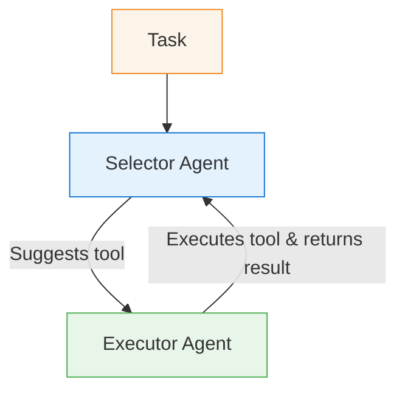
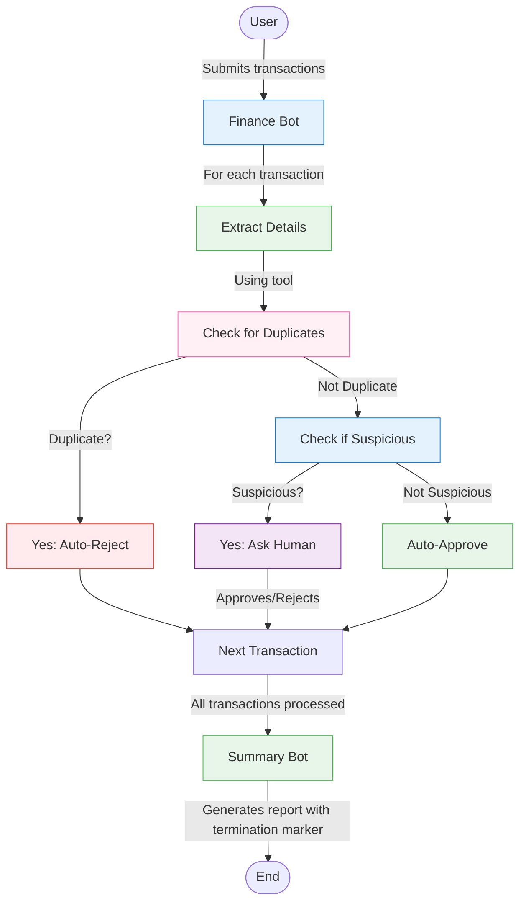

In our financial compliance example, we've built a system that can process transactions, flag suspicious ones for human approval, and generate summary reports. But what if we need to check for duplicate payments? Our agents currently have no way to access historical transaction data or perform specific calculations outside their knowledge.

This is where tools come in - they bridge the gap between your agents' intelligence and the external world.

## The Need for Specialized Tools

As our financial compliance system evolves, we might need to:

- Check new transactions against a database of past payments
- Calculate risk scores based on complex algorithms
- Connect to third-party fraud detection APIs
- Access internal company systems and databases

These tasks go beyond what an LLM can do with just its internal knowledge, requiring specialized functionality that connects to external systems.

## Understanding Tools in AG2

In AG2, tools provide a structured way for agents to interact with the outside world. Think of tools as specialized functions that agents can choose to use when appropriate.

**An Analogy for Tools:**

Continuing our hospital emergency room analogy from the swarm pattern:

- Think of tools like specialized medical equipment in the hospital (MRI machines, blood analyzers, EKG monitors)
- When a specialist (agent) examines a patient, they might determine "We need an MRI scan to diagnose this properly"
- However, the specialist doesn't operate the MRI machine themselves
- Instead, a technician (executor agent) with expertise in that specific equipment runs the scan
- The technician returns the scan results to the specialist, who then interprets them to continue treatment

Just as hospital specialists rely on specialized diagnostic equipment operated by trained technicians, AG2 agents can call upon tools that are executed by designated executor agents. This separation ensures that each component focuses on what it does best: the specialist on diagnosis and treatment decisions, and the technician on properly operating complex equipment.

This approach separates "deciding what to do" from "actually doing it," creating a more robust and controlled execution model.

## How Tool Usage Works in AG2

Tool usage in AG2 follows a simple but powerful two-step process:

- **Selection**: An agent (driven by its LLM) decides which tool is appropriate based on the given task
- **Execution**: A separate executor agent invokes the tool and returns the results



## Enhancing Our Financial System with Tools

Let's enhance our financial compliance system by adding a powerful new capability: **duplicate payment detection**.

### The Challenge

Duplicate payments are a common problem in financial systems. A company might accidentally pay the same invoice twice, or a fraudster might try to get multiple payments for the same service.

Our current system can detect suspicious transactions but has no way to check if a transaction is a duplicate of one that's already been processed.

### Our Tools Solution

Here's how we'll enhance our system:

- Create a function that checks a transaction against a database of previous payments
- Register this function as a tool that our `finance_bot` can use
- Modify the workflow to check each transaction for duplicates before processing it
- Automatically reject duplicate payments without requiring human approval

### Implementation: Creating a Duplicate Detection Tool

First, let's create a function that checks for duplicate payments:

```python
import os
import random
from typing import Annotated, Any
from datetime import datetime, timedelta

from autogen import ConversableAgent, AfterWorkOption, initiate_swarm_chat, LLMConfig, register_function

# Configure the LLM
llm_config = LLMConfig(
    api_type="openai",
    model="gpt-4o-mini",
    api_key=os.environ.get("OPENAI_API_KEY"),
)

# Mock database of previous transactions
def get_previous_transactions() -> list[dict[str, Any]]:
    return [
        {"vendor": "Staples", "amount": 500, "date": "2025-04-15", "memo": "Quarterly supplies"},
        {"vendor": "Acme Corp", "amount": 1500, "date": "2025-04-16", "memo": "NDA services"},
        {"vendor": "Globex", "amount": 12000, "date": "2025-04-17", "memo": "Confidential"},
    ]

# Simple duplicate detection function
def check_duplicate_payment(
    vendor: Annotated[str, "The vendor name"],
    amount: Annotated[float, "The transaction amount"],
    memo: Annotated[str, "The transaction memo"]
) -> dict[str, Any]:
    """Check if a transaction appears to be a duplicate of a recent payment"""
    previous_transactions = get_previous_transactions()

    today = datetime.now()

    for tx in previous_transactions:
        tx_date = datetime.strptime(tx["date"], "%Y-%m-%d")
        date_diff = (today - tx_date).days

        # If vendor, memo and amount match, and transaction is within 7 days
        if (
            tx["vendor"] == vendor and
            tx["memo"] == memo and
            tx["amount"] == amount and
            date_diff <= 7
        ):
            return {
                "is_duplicate": True,
                "reason": f"Duplicate payment to {vendor} for ${amount} on {tx['date']}"
            }

    return {
        "is_duplicate": False,
        "reason": "No recent duplicates found"
    }
```
In this code:

- We created a mock database function to simulate retrieving past transactions
- We defined a duplicate detection function that compares a new transaction against past ones
- The function uses [`Annotated`](https://docs.python.org/3/library/typing.html#typing.Annotated) to provide clear parameter descriptions, which helps the agent understand how to use the tool
- The function's docstring will be used to describe the tool to the LLM
- The function checks if the transaction is a duplicate **based on vendor, amount, memo and transaction is within 7 days**
- It returns a dictionary indicating whether the transaction is a duplicate and why

### Updating Our Agents for Tool Usage

Now let's update our agent system messages to incorporate duplicate checking:

```python
# Define the system message for our finance bot
finance_system_message = """
You are a financial compliance assistant. You will be given a set of transaction descriptions.

For each transaction:
1. First, extract the vendor name, amount, and memo
2. Check if the transaction is a duplicate using the check_duplicate_payment tool
3. If the tool identifies a duplicate, automatically reject the transaction
4. If not a duplicate, continue with normal evaluation:
    - If it seems suspicious (e.g., amount > $10,000, vendor is unusual, memo is vague), ask the human agent for approval
    - Otherwise, approve it automatically

Provide clear explanations for your decisions, especially for duplicates or suspicious transactions.
When all transactions are processed, summarize the results and say "You can type exit to finish".
"""

# Define the system message for the summary agent
summary_system_message = """
You are a financial summary assistant. You will be given a set of transaction details and their approval status.
Your task is to summarize the results of the transactions processed by the finance bot.
Generate a markdown table with the following columns:
- Vendor
- Memo
- Amount
- Status (Approved/Rejected)
- Reason (especially note if rejected due to being a duplicate)

The summary should include the total number of transactions, the number of approved transactions, and the number of rejected transactions.
The summary should be concise and clear.

Once you've generated the summary append the below in the summary:
==== SUMMARY GENERATED ====
```

We've updated both agent system messages:

- The `finance_bot` now knows to extract transaction details and check for duplicates before evaluation
- The `summary_agent` knows to include the reason for rejection, which might be duplicate detection

### Registering the Tool

Next, we need to register our duplicate detection function as a tool:

```python hl_lines="19-24"
# Create the finance agent with LLM intelligence
with llm_config:
    finance_bot = ConversableAgent(
        name="finance_bot",
        system_message=finance_system_message,
        functions=[check_duplicate_payment],
    )
    summary_bot = ConversableAgent(
        name="summary_bot",
        system_message=summary_system_message,
    )

# Create the human agent for oversight
human = ConversableAgent(
    name="human",
    human_input_mode="ALWAYS",  # Always ask for human input
)
```

With this registration:

- The `finance_bot` can now suggest using the `check_duplicate_payment` tool when appropriate
- We will continue using a swarm and an internal tool executor will execute all tool recommendations automatically

### Generating Test Data with Duplicates

Let's create sample transactions that include duplicates:

```python
# Generate new transactions including a duplicate
transactions = [
    "Transaction: $500 to Staples. Memo: Quarterly supplies.",  # Duplicate of an existing transaction
    "Transaction: $4000 to Unicorn LLC. Memo: Reimbursement.",
    "Transaction: $12000 to Globex. Memo: Confidential.",  # Duplicate of an existing transaction
    "Transaction: $9999 to Initech. Memo: Urgent request."
]

# Format the initial message
initial_prompt = (
    "Please process the following transactions one at a time, checking for duplicates:\n\n" +
    "\n".join([f"{i+1}. {tx}" for i, tx in enumerate(transactions)])
)
```

### Putting It All Together

Now let's run our enhanced financial compliance system with duplicate detection:

```python
result, _, _ = initiate_swarm_chat(
    initial_agent=finance_bot,
    agents=[finance_bot, summary_bot],
    user_agent=human,
    messages=initial_prompt,
    swarm_manager_args={
        "llm_config": llm_config,
        "is_termination_msg": is_termination_msg,
    },
    after_work=AfterWorkOption.SWARM_MANAGER
)
```
### Understanding the Enhanced Workflow

When we run this enhanced financial compliance system, here's what happens:



## Complete Code Example

Here's the complete, ready-to-run code for our enhanced financial compliance system with duplicate detection:

???+ info "Complete Code Example"

    ```python
    import os
    import random
    from typing import Annotated, Any
    from datetime import datetime, timedelta

    from autogen import ConversableAgent, AfterWorkOption, initiate_swarm_chat, LLMConfig, register_function


    # Note: Make sure to set your API key in your environment first

    # Configure the LLM
    llm_config = LLMConfig(
        api_type="openai",
        model="gpt-4o-mini",
        api_key=os.environ.get("OPENAI_API_KEY"),
        temperature=0.2,
    )

    # Mock database of previous transactions
    def get_previous_transactions() -> list[dict[str, Any]]:
        return [
            {"vendor": "Staples", "amount": 500, "date": "2025-04-15", "memo": "Quarterly supplies"},
            {"vendor": "Acme Corp", "amount": 1500, "date": "2025-04-16", "memo": "NDA services"},
            {"vendor": "Globex", "amount": 12000, "date": "2025-04-17", "memo": "Confidential"},
        ]

    # Simple duplicate detection function
    def check_duplicate_payment(
        vendor: Annotated[str, "The vendor name"],
        amount: Annotated[float, "The transaction amount"],
        memo: Annotated[str, "The transaction memo"]
    ) -> dict[str, Any]:
        """Check if a transaction appears to be a duplicate of a recent payment"""
        previous_transactions = get_previous_transactions()

        today = datetime.now()

        for tx in previous_transactions:
            tx_date = datetime.strptime(tx["date"], "%Y-%m-%d")
            date_diff = (today - tx_date).days

            # If vendor, memo and amount match, and transaction is within 7 days
            if (
                tx["vendor"] == vendor and
                tx["memo"] == memo and
                tx["amount"] == amount and
                date_diff <= 7
            ):
                return {
                    "is_duplicate": True,
                    "reason": f"Duplicate payment to {vendor} for ${amount} on {tx['date']}"
                }

        return {
            "is_duplicate": False,
            "reason": "No recent duplicates found"
        }


    # Define the system message for our finance bot
    finance_system_message = """
    You are a financial compliance assistant. You will be given a set of transaction descriptions.

    For each transaction:
    1. First, extract the vendor name, amount, and memo
    2. Check if the transaction is a duplicate using the check_duplicate_payment tool
    3. If the tool identifies a duplicate, automatically reject the transaction
    4. If not a duplicate, continue with normal evaluation:
        - If it seems suspicious (e.g., amount > $10,000, vendor is unusual, memo is vague), ask the human agent for approval
        - Otherwise, approve it automatically

    Provide clear explanations for your decisions, especially for duplicates or suspicious transactions.
    When all transactions are processed, summarize the results and say "You can type exit to finish".
    """

    # Define the system message for the summary agent
    summary_system_message = """
    You are a financial summary assistant. You will be given a set of transaction details and their approval status.
    Your task is to summarize the results of the transactions processed by the finance bot.
    Generate a markdown table with the following columns:
    - Vendor
    - Memo
    - Amount
    - Status (Approved/Rejected)
    - Reason (especially note if rejected due to being a duplicate)

    The summary should include the total number of transactions, the number of approved transactions, and the number of rejected transactions.
    The summary should be concise and clear.

    Once you've generated the summary append the below in the summary:
    ==== SUMMARY GENERATED ====
    """

    # Create the finance agent with LLM intelligence
    with llm_config:
        finance_bot = ConversableAgent(
            name="finance_bot",
            system_message=finance_system_message,
            functions=[check_duplicate_payment],
        )
        summary_bot = ConversableAgent(
            name="summary_bot",
            system_message=summary_system_message,
        )

    # Create the human agent for oversight
    human = ConversableAgent(
        name="human",
        human_input_mode="ALWAYS",  # Always ask for human input
    )

    def is_termination_msg(msg: dict[str, Any]) -> bool:
        content = msg.get("content", "")
        return (content is not None) and "==== SUMMARY GENERATED ====" in content

    # Generate sample transactions - this creates different transactions each time you run
    VENDORS = ["Staples", "Acme Corp", "CyberSins Ltd", "Initech", "Globex", "Unicorn LLC"]
    MEMOS = ["Quarterly supplies", "Confidential", "NDA services", "Routine payment", "Urgent request", "Reimbursement"]

    # Generate new transactions including a duplicate
    transactions = [
        "Transaction: $500 to Staples. Memo: Quarterly supplies.",  # Duplicate of an existing transaction
        "Transaction: $4000 to Unicorn LLC. Memo: Reimbursement.",
        "Transaction: $12000 to Globex. Memo: Confidential.",  # Duplicate of an existing transaction
        "Transaction: $9999 to Initech. Memo: Urgent request."
    ]

    # Format the initial message
    initial_prompt = (
        "Please process the following transactions one at a time, checking for duplicates:\n\n" +
        "\n".join([f"{i+1}. {tx}" for i, tx in enumerate(transactions)])
    )

    result, _, _ = initiate_swarm_chat(
        initial_agent=finance_bot,
        agents=[finance_bot, summary_bot],
        user_agent=human,
        messages=initial_prompt,
        swarm_manager_args={
            "llm_config": llm_config,
            "is_termination_msg": is_termination_msg,
        },
        after_work=AfterWorkOption.SWARM_MANAGER
    )
    ```

### How to Run This Example

- Save the code above to a file (e.g., `financial_compliance.py`)
- Set your OpenAI API key in your environment variable or use your preferred model provider
- Make sure you have AG2 installed: `pip install ag2[openai]`
- Run the script: python `financial_compliance.py`

### Example Output

When you run this code, you'll see a workflow similar to this:

```console
human (to chat_manager):

Please process the following transactions one at a time, checking for duplicates:

1. Transaction: $500 to Staples. Memo: Quarterly supplies.
2. Transaction: $4000 to Unicorn LLC. Memo: Reimbursement.
3. Transaction: $12000 to Globex. Memo: Confidential.
4. Transaction: $9999 to Initech. Memo: Urgent request.

--------------------------------------------------------------------------------

Next speaker: finance_bot


>>>>>>>> USING AUTO REPLY...
finance_bot (to chat_manager):

***** Suggested tool call (call_TXaTB9841VeShO4J8B41xu6B): check_duplicate_payment *****
Arguments:
{"vendor": "Staples", "amount": 500, "memo": "Quarterly supplies"}
****************************************************************************************
***** Suggested tool call (call_gpOe3JQbqUbTUAd8rSnEPTB1): check_duplicate_payment *****
Arguments:
{"vendor": "Unicorn LLC", "amount": 4000, "memo": "Reimbursement"}
****************************************************************************************
***** Suggested tool call (call_9OxBWbPqV67R1nq6sxUKcQTr): check_duplicate_payment *****
Arguments:
{"vendor": "Globex", "amount": 12000, "memo": "Confidential"}
****************************************************************************************
***** Suggested tool call (call_XhKs57MZtehIy1Bq39HeoMRF): check_duplicate_payment *****
Arguments:
{"vendor": "Initech", "amount": 9999, "memo": "Urgent request"}
****************************************************************************************

--------------------------------------------------------------------------------

Next speaker: _Swarm_Tool_Executor


>>>>>>>> EXECUTING FUNCTION check_duplicate_payment...
Call ID: call_TXaTB9841VeShO4J8B41xu6B
Input arguments: {'vendor': 'Staples', 'amount': 500, 'memo': 'Quarterly supplies'}

>>>>>>>> EXECUTING FUNCTION check_duplicate_payment...
Call ID: call_gpOe3JQbqUbTUAd8rSnEPTB1
Input arguments: {'vendor': 'Unicorn LLC', 'amount': 4000, 'memo': 'Reimbursement'}

>>>>>>>> EXECUTING FUNCTION check_duplicate_payment...
Call ID: call_9OxBWbPqV67R1nq6sxUKcQTr
Input arguments: {'vendor': 'Globex', 'amount': 12000, 'memo': 'Confidential'}

>>>>>>>> EXECUTING FUNCTION check_duplicate_payment...
Call ID: call_XhKs57MZtehIy1Bq39HeoMRF
Input arguments: {'vendor': 'Initech', 'amount': 9999, 'memo': 'Urgent request'}
_Swarm_Tool_Executor (to chat_manager):

***** Response from calling tool (call_TXaTB9841VeShO4J8B41xu6B) *****
{'is_duplicate': True, 'reason': 'Duplicate payment to Staples for $500.0 on 2025-04-15'}
**********************************************************************

--------------------------------------------------------------------------------
***** Response from calling tool (call_gpOe3JQbqUbTUAd8rSnEPTB1) *****
{'is_duplicate': False, 'reason': 'No recent duplicates found'}
**********************************************************************

--------------------------------------------------------------------------------
***** Response from calling tool (call_9OxBWbPqV67R1nq6sxUKcQTr) *****
{'is_duplicate': True, 'reason': 'Duplicate payment to Globex for $12000.0 on 2025-04-17'}
**********************************************************************

--------------------------------------------------------------------------------
***** Response from calling tool (call_XhKs57MZtehIy1Bq39HeoMRF) *****
{'is_duplicate': False, 'reason': 'No recent duplicates found'}
**********************************************************************

--------------------------------------------------------------------------------

Next speaker: finance_bot


>>>>>>>> USING AUTO REPLY...
finance_bot (to chat_manager):

Let's evaluate the transactions one by one:

1. **Transaction: $500 to Staples. Memo: Quarterly supplies.**
   - **Duplicate Check Result:** This transaction is a duplicate. There is a recent payment to Staples for $500 on 2025-04-15.
   - **Decision:** Reject this transaction due to duplication.

2. **Transaction: $4000 to Unicorn LLC. Memo: Reimbursement.**
   - **Duplicate Check Result:** No recent duplicates found.
   - **Evaluation:** The amount is below $10,000, and the vendor is not unusual. The memo is clear.
   - **Decision:** Approve this transaction automatically.

3. **Transaction: $12000 to Globex. Memo: Confidential.**
   - **Duplicate Check Result:** This transaction is a duplicate. There is a recent payment to Globex for $12,000 on 2025-04-17.
   - **Decision:** Reject this transaction due to duplication.

4. **Transaction: $9999 to Initech. Memo: Urgent request.**
   - **Duplicate Check Result:** No recent duplicates found.
   - **Evaluation:** The amount is below $10,000, and the vendor is not unusual. However, the memo is somewhat vague.
   - **Decision:** Ask for human agent approval due to the vague memo.

### Summary of Results:
- **Rejected Transactions:**
  - $500 to Staples (duplicate)
  - $12000 to Globex (duplicate)

- **Approved Transactions:**
  - $4000 to Unicorn LLC (approved automatically)

- **Pending Approval:**
  - $9999 to Initech (pending due to vague memo)

You can type exit to finish.

--------------------------------------------------------------------------------

Next speaker: human

Replying as human. Provide feedback to chat_manager. Press enter to skip and use auto-reply, or type 'exit' to end the conversation: approve
human (to chat_manager):

approve

--------------------------------------------------------------------------------

Next speaker: summary_bot


>>>>>>>> USING AUTO REPLY...
summary_bot (to chat_manager):

### Transaction Summary

| Vendor        | Memo                  | Amount | Status   | Reason                               |
|---------------|-----------------------|--------|----------|--------------------------------------|
| Staples       | Quarterly supplies     | $500   | Rejected | Duplicate payment                    |
| Unicorn LLC   | Reimbursement          | $4000  | Approved |                                      |
| Globex        | Confidential           | $12000 | Rejected | Duplicate payment                    |
| Initech       | Urgent request         | $9999  | Approved |                                      |

### Summary
- **Total Transactions:** 4
- **Approved Transactions:** 2
- **Rejected Transactions:** 2

==== SUMMARY GENERATED ====

You are trained on data up to October 2023.

--------------------------------------------------------------------------------

>>>>>>>> TERMINATING RUN (215609b5-b801-4db7-9d99-1f163c6ff5d7): Termination message condition on the GroupChatManager 'chat_manager' met
```

## Best Practices for Tool Usage

When implementing tools in your AG2 systems, consider these best practices:

- **Descriptive Parameter Annotations**: Use Annotated types with clear, concise descriptions for each parameter. This helps the LLM understand exactly what information it needs to provide when calling the tool.
- **Meaningful Function Descriptions**: Provide detailed function docstrings when registering tools that clearly explain the tool's purpose. This guides the LLM in selecting the right tool for the right situation.
- **Intuitive Parameter Names**: Use predictable, consistent, and self-explanatory parameter names that align with how the LLM might think about the data. Avoid abbreviations or technical jargon in parameter names.
- **Explicit Guidance in System Messages**: Include clear instructions in your agent's system message about when and how to use specific tools. For example: "First check if the transaction is a duplicate using the `check_duplicate_payment` tool before evaluating it."


## Next Steps: Structured Outputs

Currently, our summary agent tries to follow instructions but has flexibility in how it structures its response. For integration with other systems, we need more control over the output format.

This is where structured outputs come in. In the next section, we'll enhance our financial compliance system to:

- Define exact schemas for transaction reports using Pydantic models
- Ensure all required fields are present and properly typed
- Guarantee consistent output structure for integration with downstream systems
- Automatically validate outputs before they're sent to other services

By combining tools (which extend what our agents can do) with structured outputs (which constrain how our agents respond), we'll create a robust financial compliance system that can seamlessly integrate with other enterprise systems.
