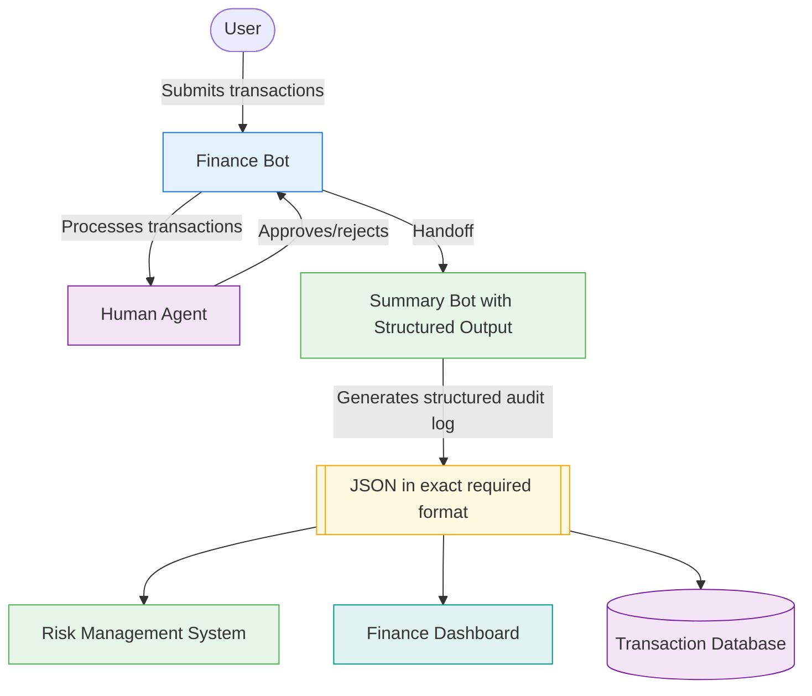

In our financial compliance system, we've built a workflow that checks transactions, detects duplicates, and generates summary reports. Everything seems to be working well, but then we get a new requirement:

*The risk management team needs to integrate our transaction summary reports with their systems, and they need the data in a specific format.*

Our summary agent currently produces nice-looking reports, but the output format isn't guaranteed. The agent decides how to format the data based on its system message instructions. This inconsistency makes it impossible for the risk management system to reliably extract the data it needs.

What we need is a way to ensure our summary bot always produces reports in exactly the same structured format, regardless of the specific transactions being processed.

## The Need for Structured Outputs

We're faced with a common challenge in AI systems: how do we get our agents to output information in a consistent, predictable format that other systems can understand?

Think about it like this - our finance bot and summary bot are doing great work analyzing transactions, but if we want to connect them to other business systems, we need something more reliable than hoping they'll format data consistently each time.

This is where structured outputs come in - they provide a way to define the exact structure your agent's responses should follow.

**An Analogy for Structured Outputs:**

Continuing our hospital emergency room analogy:

- Think of structured outputs like standardized medical forms used in the hospital
- Without standardized forms, each doctor might document patient information differently (freeform text)
- With standardized forms, all required fields must be completed and in the correct format
- Technicians know exactly where to find vitals, lab results, and medications without guessing
- Downstream systems (insurance, billing, pharmacy) can reliably process these forms
- The forms act as guardrails, ensuring all necessary information is captured and consistently structured

Just as standardized medical forms ensure complete and consistent documentation across different healthcare providers, structured outputs ensure your agents produce responses in a predictable format that can be reliably processed by other systems.

## From Concept to Implementation

Implementing structured outputs in AG2 is straightforward using Pydantic models and the [`response_format`](/docs/api-reference/autogen/llm_config/LLMConfigEntry#response_format) parameter:

<Note>
Not all model providers support structured outputs. For a current list of supported providers, see [here](https://docs.ag2.ai/latest/docs/use-cases/notebooks/notebooks/agentchat_structured_outputs/?h=structured#supported-model-providers).
</Note>

```python hl_lines="5-8 14"
from pydantic import BaseModel
from autogen import ConversableAgent, LLMConfig

# 1. Define your structured output model with Pydantic
class ResponseModel(BaseModel):
    field1: str
    field2: int
    field3: list[str]

# 2. Create LLM configuration with the structured output model
llm_config = LLMConfig(
    api_type="openai",
    model="gpt-4o-mini",
    response_format=ResponseModel,  # Specify the response format
)

# 3. Create agent with structured output configuration
with llm_config:
    structured_agent = ConversableAgent(
        name="structured_agent",
        system_message="You provide information in a structured format."
    )
```

With this setup:

- The agent will always return responses that match the `ResponseModel` structure
- All required fields will be present and correctly typed
- You no longer need formatting instructions in the system message
- The responses can be easily parsed and processed by other systems

## Enhancing Our Financial Compliance System with Structured Outputs

Now, let's enhance our financial compliance system by adding structured outputs to our summary agent:

### Defining the Structured Output Model

First, let's define our structured output model for transaction audit logs:

```python
from pydantic import BaseModel

# Define structured output for audit logs
class TransactionAuditEntry(BaseModel):
    vendor: str
    amount: float
    memo: str
    status: str
    reason: str

class AuditLogSummary(BaseModel):
    total_transactions: int
    approved_count: int
    rejected_count: int
    transactions: List[TransactionAuditEntry]
    summary_generated_time: str
```

### Creating the Summary Agent with Structured Output

Next, let's update our summary agent to use this structured output model:

```python hl_lines="7 12-16"
# Configure the LLM for summary bot with structured output
summary_llm_config = LLMConfig(
    api_type="openai",
    model="gpt-4o-mini",
    api_key=os.environ.get("OPENAI_API_KEY"),
    temperature=0.2,
    response_format=AuditLogSummary,  # Using our Pydantic model for structured output
)

# Define the system message for the summary agent
# Note: No formatting instructions needed!
summary_system_message = """
You are a financial summary assistant that generates audit logs.
Analyze the transaction details and their approval status from the conversation.
Include each transaction with its vendor, amount, memo, status and reason.
"""

# Create the summary agent with structured output
with summary_llm_config:
    summary_bot = ConversableAgent(
        name="summary_bot",
        system_message=summary_system_message,
    )
```

Notice how much simpler the system message is now - we no longer need to include detailed formatting instructions because the structure is enforced by the Pydantic model.

### Updating the Termination Condition

We'll also update our termination condition to recognize the structured output:

```python
def is_termination_msg(x: dict[str, Any]) -> bool:
    content = x.get("content", "")
    try:
        # Try to parse the content as JSON (structured output)
        data = json.loads(content)
        return isinstance(data, dict) and "summary_generated_time" in data
    except:
        # If not JSON, check for text marker (fallback)
        return (content is not None) and "==== SUMMARY GENERATED ====" in content
```

### Using the Structured Output

After the Group Chat completes, we can easily get the final message and parse it as JSON. For example:

```python hl_lines="16-18"
pattern = AutoPattern(
    initial_agent=finance_bot,
    agents=[finance_bot, summary_bot],
    user_agent=human,
    group_manager_args = {
        "llm_config": finance_llm_config,
        "is_termination_msg": is_termination_msg
    },
)

result, _, _ = initiate_group_chat(
    pattern=pattern,
    messages=initial_prompt,
)

final_message = result.chat_history[-1]["content"]
structured_data = json.loads(final_message)
print(json.dumps(structured_data, indent=4))
```

### Understanding the Enhanced Workflow

With structured outputs added to our financial compliance system, our workflow becomes much more reliable:



## Complete Code Example

Here's the complete, ready-to-run code for our financial compliance system with structured outputs:

???+ info "Complete Code Example"

    ```python
    import os
    import random
    import json
    from typing import Annotated, Any, List, Dict
    from datetime import datetime, timedelta
    from pydantic import BaseModel

    from autogen import ConversableAgent, LLMConfig
    from autogen.agentchat import initiate_group_chat
    from autogen.agentchat.group.patterns import AutoPattern

    # Mock database of previous transactions
    def get_previous_transactions() -> list[dict[str, Any]]:
        today = datetime.now()
        return [
            {
                "vendor": "Staples",
                "amount": 500,
                "date": (today - timedelta(days=3)).strftime("%Y-%m-%d"),  # 3 days ago
                "memo": "Quarterly supplies",
            },
            {
                "vendor": "Acme Corp",
                "amount": 1500,
                "date": (today - timedelta(days=10)).strftime("%Y-%m-%d"),  # 10 days ago
                "memo": "NDA services",
            },
            {
                "vendor": "Globex",
                "amount": 12000,
                "date": (today - timedelta(days=5)).strftime("%Y-%m-%d"),  # 5 days ago
                "memo": "Confidential",
            },
        ]

    # Simple duplicate detection function
    def check_duplicate_payment(
        vendor: Annotated[str, "The vendor name"],
        amount: Annotated[float, "The transaction amount"],
        memo: Annotated[str, "The transaction memo"]
    ) -> dict[str, Any]:
        """Check if a transaction appears to be a duplicate of a recent payment"""
        previous_transactions = get_previous_transactions()

        today = datetime.now()

        for tx in previous_transactions:
            tx_date = datetime.strptime(tx["date"], "%Y-%m-%d")
            date_diff = (today - tx_date).days

            # If vendor, memo and amount match, and transaction is within 7 days
            if (
                tx["vendor"] == vendor and
                tx["memo"] == memo and
                tx["amount"] == amount and
                date_diff <= 7
            ):
                return {
                    "is_duplicate": True,
                    "reason": f"Duplicate payment to {vendor} for ${amount} on {tx['date']}"
                }

        return {
            "is_duplicate": False,
            "reason": "No recent duplicates found"
        }

    # Configure the LLM for finance bot (standard configuration)
    finance_llm_config = LLMConfig(
        api_type="openai",
        model="gpt-4o-mini",
        api_key=os.environ.get("OPENAI_API_KEY"),
        temperature=0.2
    )

    # Define the system message for our finance bot
    finance_system_message = """
    You are a financial compliance assistant. You will be given a set of transaction descriptions.

    For each transaction:
    1. First, extract the vendor name, amount, and memo
    2. Check if the transaction is a duplicate using the check_duplicate_payment tool
    3. If the tool identifies a duplicate, automatically reject the transaction
    4. If not a duplicate, continue with normal evaluation:
        - If it seems suspicious (e.g., amount > $10,000, vendor is unusual, memo is vague), ask the human agent for approval
        - Otherwise, approve it automatically

    Provide clear explanations for your decisions, especially for duplicates or suspicious transactions.
    When all transactions are processed, summarize the results and say "You can type exit to finish".
    """

    # Create the agents with respective LLM configurations
    with finance_llm_config:
        finance_bot = ConversableAgent(
            name="finance_bot",
            system_message=finance_system_message,
            functions=[check_duplicate_payment],
        )

    # Create the human agent for oversight
    human = ConversableAgent(
        name="human",
        human_input_mode="ALWAYS",  # Always ask for human input
    )

    # Define structured output for audit logs
    class TransactionAuditEntry(BaseModel):
        vendor: str
        amount: float
        memo: str
        status: str  # "approved" or "rejected"
        reason: str

    class AuditLogSummary(BaseModel):
        total_transactions: int
        approved_count: int
        rejected_count: int
        transactions: List[TransactionAuditEntry]
        summary_generated_time: str

    # Configure the LLM for summary bot with structured output
    summary_llm_config = LLMConfig(
        api_type="openai",
        model="gpt-4o-mini",
        api_key=os.environ.get("OPENAI_API_KEY"),
        temperature=0.2,
        response_format=AuditLogSummary,  # Using the Pydantic model for structured output
    )

    # Define the system message for the summary agent
    # Note: No formatting instructions needed!
    summary_system_message = """
    You are a financial summary assistant that generates audit logs.
    Analyze the transaction details and their approval status from the conversation.
    Include each transaction with its vendor, amount, memo, status and reason.
    """

    with summary_llm_config:
        summary_bot = ConversableAgent(
            name="summary_bot",
            system_message=summary_system_message,
        )

    def is_termination_msg(x: dict[str, Any]) -> bool:
        content = x.get("content", "")
        try:
            # Try to parse the content as JSON (structured output)
            data = json.loads(content)
            return isinstance(data, dict) and "summary_generated_time" in data
        except:
            # If not JSON, check for text marker
            return (content is not None) and "==== SUMMARY GENERATED ====" in content

    # Generate new transactions including a duplicate
    transactions = [
        "Transaction: $500 to Staples. Memo: Quarterly supplies.",  # Duplicate
        "Transaction: $4000 to Unicorn LLC. Memo: Reimbursement.",
        "Transaction: $12000 to Globex. Memo: Confidential.",  # Duplicate
        "Transaction: $22000 to Initech. Memo: Urgent request."
    ]

    # Format the initial message
    initial_prompt = (
        "Please process the following transactions one at a time, checking for duplicates:\n\n" +
        "\n".join([f"{i+1}. {tx}" for i, tx in enumerate(transactions)])
    )

    pattern = AutoPattern(
        initial_agent=finance_bot,
        agents=[finance_bot, summary_bot],
        user_agent=human,
        group_manager_args = {
            "llm_config": finance_llm_config,
            "is_termination_msg": is_termination_msg
        },
    )

    result, _, _ = initiate_group_chat(
        pattern=pattern,
        messages=initial_prompt,
    )

    # Pretty-print the transaction_data
    final_message = result.chat_history[-1]["content"]
    structured_data = json.loads(final_message)
    print(json.dumps(structured_data, indent=4))
    ```

## Example Output

When you run this code, you'll receive a perfectly structured JSON output (shown here with pretty-printing):

```console
human (to chat_manager):

Please process the following transactions one at a time, checking for duplicates:

1. Transaction: $500 to Staples. Memo: Quarterly supplies.
2. Transaction: $4000 to Unicorn LLC. Memo: Reimbursement.
3. Transaction: $12000 to Globex. Memo: Confidential.
4. Transaction: $22000 to Initech. Memo: Urgent request.

--------------------------------------------------------------------------------

Next speaker: finance_bot


>>>>>>>> USING AUTO REPLY...
finance_bot (to chat_manager):

***** Suggested tool call (call_q0VApe4K0108hQi8o9FUwHWr): check_duplicate_payment *****
Arguments:
{"vendor": "Staples", "amount": 500, "memo": "Quarterly supplies"}
****************************************************************************************
***** Suggested tool call (call_1UXAmxxJksTg4ZoVh8ykoZcL): check_duplicate_payment *****
Arguments:
{"vendor": "Unicorn LLC", "amount": 4000, "memo": "Reimbursement"}
****************************************************************************************
***** Suggested tool call (call_4WbNhWkK1hcGN5aqzWQeW17E): check_duplicate_payment *****
Arguments:
{"vendor": "Globex", "amount": 12000, "memo": "Confidential"}
****************************************************************************************
***** Suggested tool call (call_7Msq2A1ZmKkcFmlTgC4q8dl2): check_duplicate_payment *****
Arguments:
{"vendor": "Initech", "amount": 22000, "memo": "Urgent request"}
****************************************************************************************

--------------------------------------------------------------------------------

Next speaker: _Group_Tool_Executor


>>>>>>>> EXECUTING FUNCTION check_duplicate_payment...
Call ID: call_q0VApe4K0108hQi8o9FUwHWr
Input arguments: {'vendor': 'Staples', 'amount': 500, 'memo': 'Quarterly supplies'}

>>>>>>>> EXECUTING FUNCTION check_duplicate_payment...
Call ID: call_1UXAmxxJksTg4ZoVh8ykoZcL
Input arguments: {'vendor': 'Unicorn LLC', 'amount': 4000, 'memo': 'Reimbursement'}

>>>>>>>> EXECUTING FUNCTION check_duplicate_payment...
Call ID: call_4WbNhWkK1hcGN5aqzWQeW17E
Input arguments: {'vendor': 'Globex', 'amount': 12000, 'memo': 'Confidential'}

>>>>>>>> EXECUTING FUNCTION check_duplicate_payment...
Call ID: call_7Msq2A1ZmKkcFmlTgC4q8dl2
Input arguments: {'vendor': 'Initech', 'amount': 22000, 'memo': 'Urgent request'}
_Group_Tool_Executor (to chat_manager):

***** Response from calling tool (call_q0VApe4K0108hQi8o9FUwHWr) *****
{'is_duplicate': True, 'reason': 'Duplicate payment to Staples for $500.0 on 2025-04-20'}
**********************************************************************

--------------------------------------------------------------------------------
***** Response from calling tool (call_1UXAmxxJksTg4ZoVh8ykoZcL) *****
{'is_duplicate': False, 'reason': 'No recent duplicates found'}
**********************************************************************

--------------------------------------------------------------------------------
***** Response from calling tool (call_4WbNhWkK1hcGN5aqzWQeW17E) *****
{'is_duplicate': True, 'reason': 'Duplicate payment to Globex for $12000.0 on 2025-04-18'}
**********************************************************************

--------------------------------------------------------------------------------
***** Response from calling tool (call_7Msq2A1ZmKkcFmlTgC4q8dl2) *****
{'is_duplicate': False, 'reason': 'No recent duplicates found'}
**********************************************************************

--------------------------------------------------------------------------------

Next speaker: finance_bot


>>>>>>>> USING AUTO REPLY...
finance_bot (to chat_manager):

Let's process the transactions one by one:

1. **Transaction: $500 to Staples. Memo: Quarterly supplies.**
   - **Duplicate Check Result:** This transaction is a duplicate. There is a recent payment to Staples for $500.00 on 2025-04-20.
   - **Decision:** Reject the transaction due to duplication.

2. **Transaction: $4000 to Unicorn LLC. Memo: Reimbursement.**
   - **Duplicate Check Result:** No recent duplicates found.
   - **Evaluation:** The amount is under $10,000, and the vendor is not unusual. The memo is clear.
   - **Decision:** Approve the transaction automatically.

3. **Transaction: $12000 to Globex. Memo: Confidential.**
   - **Duplicate Check Result:** This transaction is a duplicate. There is a recent payment to Globex for $12,000.00 on 2025-04-18.
   - **Decision:** Reject the transaction due to duplication.

4. **Transaction: $22000 to Initech. Memo: Urgent request.**
   - **Duplicate Check Result:** No recent duplicates found.
   - **Evaluation:** The amount is over $10,000, and the memo is somewhat vague.
   - **Decision:** This transaction seems suspicious, so I will ask for human approval.

### Summary of Results:
- **Rejected:** $500 to Staples (duplicate).
- **Approved:** $4000 to Unicorn LLC.
- **Rejected:** $12000 to Globex (duplicate).
- **Pending Approval:** $22000 to Initech (suspicious).

You can type exit to finish.

--------------------------------------------------------------------------------

Next speaker: human

Replying as human. Provide feedback to chat_manager. Press enter to skip and use auto-reply, or type 'exit' to end the conversation: approve
human (to chat_manager):

approve

--------------------------------------------------------------------------------

Next speaker: finance_bot


>>>>>>>> USING AUTO REPLY...
finance_bot (to chat_manager):

The transaction for $22000 to Initech has been approved.

### Final Summary of Results:
- **Rejected:** $500 to Staples (duplicate).
- **Approved:** $4000 to Unicorn LLC.
- **Rejected:** $12000 to Globex (duplicate).
- **Approved:** $22000 to Initech.

All transactions have been processed. You can type exit to finish.

--------------------------------------------------------------------------------

Next speaker: summary_bot


>>>>>>>> USING AUTO REPLY...
summary_bot (to chat_manager):

{"total_transactions":4,"approved_count":2,"rejected_count":2,"transactions":[{"vendor":"Staples","amount":500,"memo":"Quarterly supplies","status":"Rejected","reason":"Duplicate payment to Staples for $500.0 on 2025-04-20"},{"vendor":"Unicorn LLC","amount":4000,"memo":"Reimbursement","status":"Approved","reason":"No recent duplicates found"},{"vendor":"Globex","amount":12000,"memo":"Confidential","status":"Rejected","reason":"Duplicate payment to Globex for $12000.0 on 2025-04-18"},{"vendor":"Initech","amount":22000,"memo":"Urgent request","status":"Approved","reason":"No recent duplicates found"}],"summary_generated_time":"2023-10-05T12:00:00Z"}

--------------------------------------------------------------------------------

>>>>>>>> TERMINATING RUN (c9144262-7977-4ddd-b621-82b07d55b9cb): Termination message condition on the GroupChatManager 'chat_manager' met
{
    "total_transactions": 4,
    "approved_count": 2,
    "rejected_count": 2,
    "transactions": [
        {
            "vendor": "Staples",
            "amount": 500,
            "memo": "Quarterly supplies",
            "status": "Rejected",
            "reason": "Duplicate payment to Staples for $500.0 on 2025-04-20"
        },
        {
            "vendor": "Unicorn LLC",
            "amount": 4000,
            "memo": "Reimbursement",
            "status": "Approved",
            "reason": "No recent duplicates found"
        },
        {
            "vendor": "Globex",
            "amount": 12000,
            "memo": "Confidential",
            "status": "Rejected",
            "reason": "Duplicate payment to Globex for $12000.0 on 2025-04-18"
        },
        {
            "vendor": "Initech",
            "amount": 22000,
            "memo": "Urgent request",
            "status": "Approved",
            "reason": "No recent duplicates found"
        }
    ],
    "summary_generated_time": "2023-10-05T12:00:00Z"
}
```

## Key Benefits of Structured Outputs

Structured outputs offer several compelling benefits:

- **Consistency**: Every response has the same structure, making integration reliable
- **Validation**: Built-in type checking ensures data integrity
- **Simplicity**: Reduced need for complex formatting instructions in system messages
- **Integration**: Easy to parse and use in downstream systems
- **Maintainability**: Schema changes can be managed centrally

## Next Steps

You've now learned how to create a complete financial compliance system incorporating the basic concepts of AG2:

- **LLM Configuration**: Powering our agents with the right language models
- **ConversableAgent**: Creating smart, interactive agents for different tasks
- **Human in the Loop**: Adding human oversight for suspicious transactions
- **Agent Orchestration**: Coordinating multiple specialized agents with the Group Chat pattern
- **Tools**: Extending agent capabilities with duplicate payment detection
- **Structured Outputs**: Ensuring consistent, validated summary reports

In the Advanced Concepts section, you'll learn how to further enhance your AG2 applications with more sophisticated patterns, agent capabilities, and integration options. You'll also find more in-depth explanations of the concepts we've covered here, allowing you to build even more powerful multi-agent systems.
